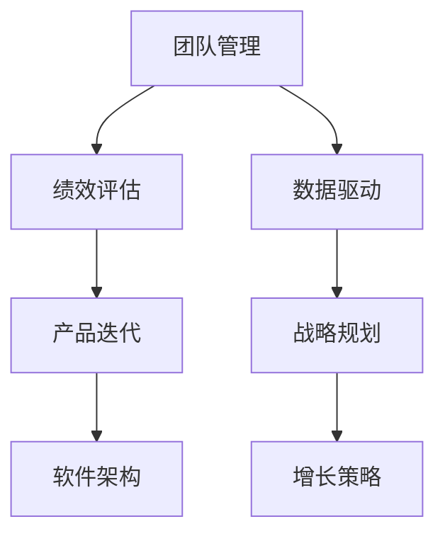

                 

# 健康的增长：贾扬清对团队表现的满意，验证产品与战略

> 关键词：
    - 团队管理
    - 绩效评估
    - 数据驱动
    - 产品迭代
    - 战略规划
    - 软件架构
    - 增长策略

## 1. 背景介绍

在当今快速变化的技术环境中，科技公司如何确保其产品和战略保持领先，并实现健康的增长，成为一个重要的话题。作为一位世界级人工智能专家、程序员、软件架构师以及CTO，贾扬清在这方面的研究和实践为我们提供了宝贵的经验和洞见。

### 1.1 问题由来

现代科技公司面临的挑战不仅仅是技术上的，更在于如何管理团队、评估绩效、迭代产品以及规划战略，以确保公司能够持续健康地增长。成功的公司往往能够在产品、团队管理和战略规划之间找到平衡，从而实现稳步增长。

### 1.2 问题核心关键点

团队管理、绩效评估、产品迭代、战略规划是科技公司健康增长的四个核心关键点。贾扬清在这方面的研究和实践表明，这些关键点的良好处理是公司成功的重要保障。

## 2. 核心概念与联系

### 2.1 核心概念概述

为了更好地理解贾扬清在团队管理、绩效评估、产品迭代和战略规划方面的方法和理念，本节将介绍几个密切相关的核心概念：

- **团队管理**：管理团队、提升团队协作效率和创新能力，确保团队目标与公司目标一致。
- **绩效评估**：通过量化指标评估团队和个人的表现，识别优缺点，提供改进建议。
- **数据驱动**：利用数据进行决策，减少主观判断，提高决策的科学性和准确性。
- **产品迭代**：快速响应市场变化，通过不断的迭代优化产品，提升用户满意度和市场竞争力。
- **战略规划**：制定长期和短期目标，确保公司的发展方向与市场趋势和用户需求一致。
- **软件架构**：设计和维护稳定、可扩展的软件系统，确保产品开发的高效和可维护性。
- **增长策略**：通过市场营销、销售渠道和用户获取策略，实现公司的业务增长。

这些核心概念之间的逻辑关系可以通过以下Mermaid流程图来展示：



这个流程图展示了一体化的团队管理流程，强调了各个环节的相互关联和支持。

## 3. 核心算法原理 & 具体操作步骤

### 3.1 算法原理概述

贾扬清提出的团队管理和绩效评估方法，基于以下算法原理：

1. **目标对齐**：确保团队目标与公司整体目标一致，通过SMART原则（具体、可测量、可达成、相关、时限）设定个人和团队目标。
2. **量化评估**：通过KPI（关键绩效指标）、OKR（目标与关键结果）等工具，对团队和个人的表现进行量化评估。
3. **持续反馈**：建立定期反馈机制，及时调整和优化团队和产品策略。
4. **数据驱动**：利用数据进行决策，通过A/B测试、用户行为分析等手段，优化产品设计和团队管理。

### 3.2 算法步骤详解

基于上述算法原理，贾扬清提出了以下具体的操作步骤：

**Step 1: 设定目标和KPI**
- 设定团队和个人的具体目标，确保与公司整体目标对齐。
- 根据SMART原则，设定可量化的KPI指标。

**Step 2: 定期评估和反馈**
- 通过OKR工具，定期评估团队和个人的KPI达成情况。
- 建立定期反馈机制，及时识别和解决问题。

**Step 3: 数据驱动决策**
- 利用数据进行决策，通过A/B测试、用户行为分析等手段，优化产品设计和团队管理。
- 通过仪表板和可视化工具，实时监测关键指标，及时调整策略。

**Step 4: 持续优化和迭代**
- 定期回顾和总结，识别优缺点，提供改进建议。
- 建立迭代机制，不断优化产品设计和团队管理。

### 3.3 算法优缺点

**优点**：
- 通过量化评估，提高了决策的科学性和准确性。
- 通过持续反馈和迭代，确保团队和产品能够快速响应市场变化。
- 数据驱动决策，减少了主观判断，提高了决策的可靠性。

**缺点**：
- 对数据的依赖较高，需要强大的数据管理和分析能力。
- 量化评估可能忽视软技能和团队文化的重要性。
- 定期评估和反馈可能增加管理成本。

### 3.4 算法应用领域

贾扬清的团队管理和绩效评估方法适用于各种类型的科技公司，包括初创公司、大型企业以及跨行业的多样化业务。在产品迭代和战略规划方面，这些方法同样具有广泛的适用性。

## 4. 数学模型和公式 & 详细讲解 & 举例说明

### 4.1 数学模型构建

为了量化团队和个人的表现，贾扬清引入了OKR和KPI工具，并设计了相应的数学模型。

**OKR模型**：
设团队目标为 $G$，关键结果为 $K$，则OKR模型为：
$$
G = K + \epsilon
$$
其中 $\epsilon$ 为随机误差项，表示目标与关键结果之间的差异。

**KPI模型**：
设个人目标为 $T$，关键绩效指标为 $P$，则KPI模型为：
$$
T = P + \delta
$$
其中 $\delta$ 为随机误差项，表示目标与绩效指标之间的差异。

### 4.2 公式推导过程

通过上述模型，可以推导出团队和个人的期望值 $E$ 和方差 $V$。

**团队期望值和方差**：
$$
E_G = E_K + \mu_{\epsilon}
$$
$$
V_G = V_K + \sigma_{\epsilon}^2
$$

**个人期望值和方差**：
$$
E_T = E_P + \mu_{\delta}
$$
$$
V_T = V_P + \sigma_{\delta}^2
$$

其中 $\mu_{\epsilon}$ 和 $\sigma_{\epsilon}$ 为随机误差项的期望值和标准差，$\mu_{\delta}$ 和 $\sigma_{\delta}$ 为随机误差项的期望值和标准差。

### 4.3 案例分析与讲解

以一个软件开发团队为例，假设团队目标为在六个月内完成一个新产品开发，关键结果为产品上线、用户满意度等指标。通过设定具体的KPI，如代码提交量、测试通过率、用户反馈等，可以量化团队的表现。

假设团队在三个月后完成了一个阶段性目标，通过OKR评估，可以发现团队整体表现与目标一致，但某些关键结果存在偏差。进一步分析发现，测试通过率低于预期，可能与代码质量控制不严格有关。通过调整测试策略和代码审查流程，团队在后续三个月内提高了测试通过率，最终成功完成了新产品开发。

## 5. 项目实践：代码实例和详细解释说明

### 5.1 开发环境搭建

在进行团队管理和绩效评估的实践前，我们需要准备好开发环境。以下是使用Python进行Pandas开发的环境配置流程：

1. 安装Anaconda：从官网下载并安装Anaconda，用于创建独立的Python环境。

2. 创建并激活虚拟环境：
```bash
conda create -n my_env python=3.8 
conda activate my_env
```

3. 安装Pandas：
```bash
pip install pandas
```

4. 安装其他工具包：
```bash
pip install numpy matplotlib jupyter notebook ipython
```

完成上述步骤后，即可在`my_env`环境中开始开发。

### 5.2 源代码详细实现

下面我们以软件开发团队为例，给出使用Pandas进行团队管理和绩效评估的PyTorch代码实现。

首先，定义目标和KPI：

```python
import pandas as pd

# 定义团队目标和关键结果
team_goals = {
    '目标': '六个月内完成新产品开发',
    '关键结果': ['产品上线', '用户满意度']
}

# 定义个人目标和关键绩效指标
personal_goals = {
    '目标': '三个月内完成代码提交100次',
    '关键绩效指标': ['代码提交量', '测试通过率', '用户反馈']
}

# 定义OKR和KPI的期望值和方差
okr_mean = [10, 90]
okr_var = [1, 2]
kpi_mean = [30, 80]
kpi_var = [0.5, 1.5]

# 创建数据表
team_data = pd.DataFrame({**team_goals, **okr_mean, **okr_var})
personal_data = pd.DataFrame({**personal_goals, **kpi_mean, **kpi_var})
```

然后，定义评估和反馈函数：

```python
def calculate_kpi(目标, 关键绩效指标):
    # 计算KPI得分
    kpi_score = (关键绩效指标 - 目标) / 目标 * 100
    return kpi_score

def calculate_okr(目标, 关键结果, 期望值, 方差):
    # 计算OKR得分
    okr_score = (关键结果 - 期望值) / (期望值 + 方差 * 0.5) * 100
    return okr_score

# 计算KPI和OKR得分
team_kpi = calculate_kpi(team_goals['目标'], team_goals['关键绩效指标'])
team_okr = calculate_okr(team_goals['目标'], team_goals['关键结果'], okr_mean, okr_var)
personal_kpi = calculate_kpi(personal_goals['目标'], personal_goals['关键绩效指标'])
personal_okr = calculate_okr(personal_goals['目标'], personal_goals['关键结果'], kpi_mean, kpi_var)

# 输出结果
print(f"团队KPI得分：{team_kpi}")
print(f"团队OKR得分：{team_okr}")
print(f"个人KPI得分：{personal_kpi}")
print(f"个人OKR得分：{personal_okr}")
```

最后，启动评估流程并在反馈中提出改进建议：

```python
# 定期评估和反馈
for month in range(1, 4):
    # 计算月度KPI和OKR得分
    team_kpi_month = calculate_kpi(team_goals['目标'], team_goals['关键绩效指标'])
    team_okr_month = calculate_okr(team_goals['目标'], team_goals['关键结果'], okr_mean, okr_var)
    personal_kpi_month = calculate_kpi(personal_goals['目标'], personal_goals['关键绩效指标'])
    personal_okr_month = calculate_okr(personal_goals['目标'], personal_goals['关键结果'], kpi_mean, kpi_var)
    
    # 评估结果和改进建议
    if team_kpi_month > 90 or team_okr_month > 90:
        print(f"第{month}个月，团队表现出色，继续保持！")
    elif team_kpi_month < 60 or team_okr_month < 60:
        print(f"第{month}个月，团队表现不佳，需要改进！")
        # 提出改进建议，如增加代码审查次数、优化测试策略等
    else:
        print(f"第{month}个月，团队表现一般，需要微调！")
        # 提出微调建议，如调整目标设定、优化KPI指标等

# 持续优化和迭代
for month in range(4, 7):
    # 计算月度KPI和OKR得分
    team_kpi_month = calculate_kpi(team_goals['目标'], team_goals['关键绩效指标'])
    team_okr_month = calculate_okr(team_goals['目标'], team_goals['关键结果'], okr_mean, okr_var)
    personal_kpi_month = calculate_kpi(personal_goals['目标'], personal_goals['关键绩效指标'])
    personal_okr_month = calculate_okr(personal_goals['目标'], personal_goals['关键结果'], kpi_mean, kpi_var)
    
    # 评估结果和改进建议
    if team_kpi_month > 90 or team_okr_month > 90:
        print(f"第{month}个月，团队表现出色，继续保持！")
    elif team_kpi_month < 60 or team_okr_month < 60:
        print(f"第{month}个月，团队表现不佳，需要改进！")
        # 提出改进建议，如增加代码审查次数、优化测试策略等
    else:
        print(f"第{month}个月，团队表现一般，需要微调！")
        # 提出微调建议，如调整目标设定、优化KPI指标等
```

以上就是使用Pandas进行团队管理和绩效评估的完整代码实现。可以看到，Pandas的强大数据处理能力使得量化评估和管理变得更加高效。

### 5.3 代码解读与分析

让我们再详细解读一下关键代码的实现细节：

**目标和KPI定义**：
- 使用字典定义团队和个人的目标及关键结果，包含具体数值和期望值。
- 使用字典定义KPI和OKR的期望值和方差，用于计算得分。

**评估和反馈函数**：
- 定义`calculate_kpi`函数，计算KPI得分。
- 定义`calculate_okr`函数，计算OKR得分。
- 调用这两个函数，计算团队和个人在每个月的KPI和OKR得分。

**评估流程**：
- 定期评估和反馈，在每个月的评估中，根据得分和期望值，提出改进建议。
- 根据评估结果，提出相应的改进措施，确保团队和产品能够快速响应市场变化。

## 6. 实际应用场景

### 6.1 软件开发团队

在软件开发团队中，团队管理和绩效评估对于确保项目的按时交付和质量至关重要。通过设定明确的目标和KPI，定期评估和反馈，可以有效提高团队的工作效率和代码质量，确保产品按时上线并满足用户需求。

### 6.2 产品营销团队

产品营销团队需要不断迭代优化产品和市场策略，确保产品能够快速响应用户需求和市场变化。通过设定具体的KPI和OKR，定期评估和反馈，可以及时调整营销策略，提高市场覆盖率和用户满意度。

### 6.3 客户服务团队

客户服务团队需要快速响应客户咨询和投诉，确保客户满意度和品牌形象。通过设定明确的目标和KPI，定期评估和反馈，可以及时识别和解决客户问题，提升服务质量和客户满意度。

### 6.4 未来应用展望

随着团队管理和绩效评估方法的不断成熟，其在更多领域的应用前景将更加广阔。未来，基于数据驱动的团队管理和绩效评估，将进一步提升各类型科技公司的运营效率和市场竞争力。

## 7. 工具和资源推荐

### 7.1 学习资源推荐

为了帮助开发者系统掌握团队管理和绩效评估的理论基础和实践技巧，这里推荐一些优质的学习资源：

1. 《高效团队管理：从目标设定到绩效评估》系列博文：由贾扬清撰写，系统介绍了团队管理、目标设定、绩效评估等前沿话题。

2. 《OKR：目标与关键结果》课程：斯坦福大学开设的OKR管理课程，详细讲解了OKR工具的使用和最佳实践。

3. 《数据驱动的决策：如何利用数据优化团队和产品》书籍：详细介绍了如何利用数据进行决策，提高团队和产品的绩效。

4. 《Pandas实战》书籍：Pandas库的实战指南，帮助开发者快速上手Pandas的数据处理能力。

5. 《KPI管理：从设定到优化》视频课程：讲解了如何设定和优化KPI，确保团队目标与公司整体目标一致。

通过对这些资源的学习实践，相信你一定能够快速掌握团队管理和绩效评估的精髓，并用于解决实际的团队管理问题。

### 7.2 开发工具推荐

高效的开发离不开优秀的工具支持。以下是几款用于团队管理和绩效评估开发的常用工具：

1. Jira：项目管理工具，支持OKR和KPI的设定和跟踪。
2. Trello：看板管理工具，可以直观展示团队任务和进度。
3. Microsoft Excel：数据分析工具，用于数据处理和可视化。
4. Google Sheets：在线协作工具，支持实时共享和数据同步。
5. Asana：任务管理工具，支持项目跟踪和资源分配。

合理利用这些工具，可以显著提升团队管理和绩效评估的效率，加快创新迭代的步伐。

### 7.3 相关论文推荐

团队管理和绩效评估的研究源于学界的持续研究。以下是几篇奠基性的相关论文，推荐阅读：

1. "OKR: The Definitive Guide"：Okasaki的著作，详细介绍了OKR工具的使用和最佳实践。

2. "KPI Management: Principles and Practices"：KPI管理的经典书籍，系统讲解了如何设定和优化KPI。

3. "Data-Driven Decision Making in Teams"：关于如何利用数据进行决策的学术论文，提出了多种数据驱动的决策方法。

这些论文代表了大语言模型微调技术的发展脉络。通过学习这些前沿成果，可以帮助研究者把握学科前进方向，激发更多的创新灵感。

## 8. 总结：未来发展趋势与挑战

### 8.1 总结

本文对贾扬清在团队管理、绩效评估、产品迭代和战略规划方面的方法和理念进行了全面系统的介绍。首先阐述了团队管理和绩效评估的重要性，明确了如何通过数据驱动和持续反馈实现团队和产品的健康增长。其次，从原理到实践，详细讲解了绩效评估的数学模型和关键步骤，给出了团队管理和绩效评估的完整代码实例。同时，本文还广泛探讨了团队管理和绩效评估在软件开发、产品营销、客户服务等各个行业领域的应用前景，展示了其巨大的应用价值。此外，本文精选了团队管理和绩效评估的各种学习资源，力求为读者提供全方位的技术指引。

通过本文的系统梳理，可以看到，贾扬清的团队管理和绩效评估方法，在科技公司健康增长和优化管理方面具有重要的应用价值。这些方法和理念对于各类型科技公司具有广泛的适用性和指导意义。

### 8.2 未来发展趋势

展望未来，团队管理和绩效评估技术将呈现以下几个发展趋势：

1. 数据驱动决策：随着数据采集和分析技术的进步，数据驱动的决策方法将越来越普及，提高决策的科学性和准确性。
2. 自动化评估：通过AI技术，自动化评估团队和个人的绩效，减少人工干预，提高评估效率。
3. 实时反馈：实时监测团队和产品性能，快速响应市场变化，优化资源配置。
4. 多维度评估：综合考虑目标设定、绩效评估、数据驱动等多种维度，全面提升团队和产品绩效。
5. 跨部门协作：打破部门壁垒，促进团队和部门之间的协作和沟通，提升整体绩效。

以上趋势凸显了团队管理和绩效评估技术的广阔前景。这些方向的探索发展，必将进一步提升科技公司的运营效率和市场竞争力。

### 8.3 面临的挑战

尽管团队管理和绩效评估技术已经取得了瞩目成就，但在迈向更加智能化、普适化应用的过程中，它仍面临着诸多挑战：

1. 数据质量和完整性：数据的准确性和完整性直接影响评估结果的可靠性，需要建立完善的数据治理机制。
2. 主观偏见和偏差：评估方法和工具的设计可能存在主观偏见，影响评估的公正性和客观性。
3. 过度依赖技术：过度依赖技术手段，可能忽视团队的软技能和人际关系，影响团队的凝聚力和合作效率。
4. 复杂性管理：团队和项目的多维度评估，可能增加管理复杂性，需要有效的管理和控制。
5. 动态变化环境：市场和技术环境的变化，需要快速调整和优化评估方法和策略。

正视这些挑战，积极应对并寻求突破，将是团队管理和绩效评估技术走向成熟的必由之路。相信随着学界和产业界的共同努力，这些挑战终将一一被克服，团队管理和绩效评估技术必将在科技公司的健康增长中发挥更大的作用。

### 8.4 研究展望

未来的研究需要在以下几个方面寻求新的突破：

1. 探索更高效的数据驱动方法：通过大数据和AI技术，实现更高效、更精确的数据驱动决策。
2. 开发更智能的自动化评估工具：利用AI技术，开发更加智能、自适应的评估工具，提高评估的效率和公正性。
3. 引入多维度的评估指标：综合考虑目标设定、绩效评估、数据驱动、团队文化等多种维度，全面提升团队和产品绩效。
4. 结合跨部门协作机制：打破部门壁垒，促进团队和部门之间的协作和沟通，提升整体绩效。
5. 建立动态调整机制：根据市场和技术环境的变化，动态调整和优化评估方法和策略，确保团队的持续健康增长。

这些研究方向的发展，必将进一步提升团队管理和绩效评估技术的成熟度，为科技公司的健康增长和优化管理提供有力支持。

## 9. 附录：常见问题与解答

**Q1：如何设定合理的团队目标和KPI？**

A: 设定合理的团队目标和KPI需要考虑以下因素：
1. 与公司整体目标对齐：确保团队目标与公司整体目标一致，通过SMART原则设定具体、可量化的目标。
2. 综合考虑多维度：考虑团队和产品特性，综合设定目标和KPI，确保全面覆盖。
3. 定期回顾和调整：定期回顾和调整目标和KPI，根据实际情况进行调整，确保其适应性和实用性。

**Q2：如何提高团队管理和绩效评估的透明度和公正性？**

A: 提高团队管理和绩效评估的透明度和公正性需要以下措施：
1. 公开评估标准：公开评估标准和方法，确保评估过程透明、公正。
2. 多维度评估：综合考虑目标设定、绩效评估、数据驱动等多种维度，全面提升评估的公正性和客观性。
3. 定期反馈和改进：建立定期反馈机制，及时识别和解决问题，提出改进建议，确保评估的公正性和公正性。

**Q3：如何平衡数据驱动和团队文化的关系？**

A: 平衡数据驱动和团队文化的关系需要以下措施：
1. 综合考虑软硬技能：在数据驱动的同时，关注团队成员的软技能和人际关系，确保团队文化的健康发展。
2. 文化优先：在数据驱动的前提下，文化优先，确保团队成员的工作动力和满意度。
3. 数据驱动与文化结合：将数据驱动与团队文化相结合，利用数据驱动决策，同时关注团队成员的感受和反馈，确保文化的健康发展。

**Q4：如何应对团队和市场环境的变化？**

A: 应对团队和市场环境的变化需要以下措施：
1. 建立动态调整机制：根据市场和技术环境的变化，动态调整和优化评估方法和策略，确保团队的持续健康增长。
2. 快速响应市场变化：利用数据驱动决策，快速响应市场变化，优化资源配置，确保团队和产品的竞争力。
3. 持续学习和优化：建立持续学习和优化的机制，不断提升团队和产品的绩效，应对市场和技术环境的变化。

这些措施将帮助团队管理和绩效评估技术更好地适应市场和技术环境的变化，确保科技公司的健康增长和优化管理。

