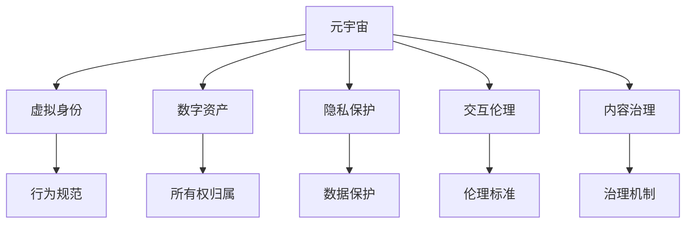

                 

# 元宇宙中的伦理道德:虚拟行为的现实影响

## 1. 背景介绍

### 1.1 问题由来
元宇宙（Metaverse）是近年来全球科技界和企业界广泛讨论的概念，它融合了虚拟现实（Virtual Reality, VR）、增强现实（Augmented Reality, AR）、人工智能（AI）、区块链、云计算等多种技术，构建了一个沉浸式、互动性、共创性的虚拟世界。然而，随着元宇宙的崛起，其对伦理道德领域的影响也逐渐显现，引发了广泛的讨论和关注。

### 1.2 问题核心关键点
元宇宙中的伦理道德问题主要围绕以下几个方面展开：

- **虚拟身份与真实自我**：如何在虚拟世界中构建与现实自我相区分的虚拟身份，以及虚拟身份与现实自我之间的关联性。
- **隐私保护与信息安全**：在元宇宙中，用户的个人信息、行为数据如何被收集、存储和使用，如何保护用户的隐私权。
- **数字资产与所有权**：在元宇宙中，虚拟物品、土地等数字资产的所有权归属问题，以及数字资产与现实资产的转换问题。
- **交互伦理**：用户在虚拟世界中的互动行为，如社交、游戏等，是否应遵守现实社会的伦理规范，以及如何界定虚拟行为对现实社会的影响。
- **内容治理**：元宇宙中的内容生成、传播与治理，如何构建一个健康、正面的虚拟环境，防止虚假信息、有害内容的扩散。

这些问题不仅关系到元宇宙技术发展的健康有序，还直接关系到用户的利益、社会的秩序和伦理的边界。

### 1.3 问题研究意义
研究元宇宙中的伦理道德问题，具有重要意义：

- **保障用户权益**：确保用户在元宇宙中的信息安全、隐私保护和资产所有权，维护用户的合法权益。
- **促进技术发展**：明确元宇宙技术的伦理规范，指导技术开发和应用，推动元宇宙健康、可持续发展。
- **维护社会秩序**：建立元宇宙与现实社会的桥梁，防止虚拟行为对现实社会产生负面影响，维护社会稳定。
- **推动伦理创新**：探索新的伦理模型和道德标准，拓展伦理学的应用边界，为未来社会治理提供新思路。

## 2. 核心概念与联系

### 2.1 核心概念概述

为更好地理解元宇宙中的伦理道德问题，本节将介绍几个密切相关的核心概念：

- **元宇宙（Metaverse）**：由多个互通的虚拟空间组成，包括虚拟现实、增强现实、区块链、人工智能等多种技术支持的沉浸式、互动性的虚拟世界。
- **虚拟身份（Virtual Identity）**：用户在元宇宙中的数字身份，用于在虚拟世界中进行互动、交流、社交等活动。
- **数字资产（Digital Asset）**：在元宇宙中生成的虚拟物品、土地、数字货币等可交易的数字资源，具有经济价值和所有权。
- **隐私保护（Privacy Protection）**：在元宇宙中，保护用户个人信息、行为数据不被未经授权的第三方获取和利用，维护用户的隐私权。
- **交互伦理（Interaction Ethics）**：用户在元宇宙中的互动行为是否应遵循现实社会的伦理规范，如何处理虚拟行为对现实社会的影响。
- **内容治理（Content Governance）**：元宇宙中内容生成、传播与治理的机制，如何构建健康、正面的虚拟环境，防止有害内容的扩散。

这些核心概念之间的逻辑关系可以通过以下Mermaid流程图来展示：



这个流程图展示了几大核心概念及其之间的联系：

1. 元宇宙构建了虚拟身份、数字资产、隐私保护、交互伦理和内容治理的环境。
2. 虚拟身份决定了用户在元宇宙中的行为规范。
3. 数字资产涉及所有权归属问题。
4. 隐私保护关乎用户的数据安全。
5. 交互伦理涉及虚拟行为对现实社会的影响。
6. 内容治理用于构建健康、正面的虚拟环境。

## 3. 核心算法原理 & 具体操作步骤

### 3.1 算法原理概述

元宇宙中的伦理道德问题，核心在于如何在虚拟世界中构建与现实世界相融合的伦理规范和行为准则。这一问题涉及多方面的算法原理，包括虚拟身份识别、隐私保护算法、数字资产管理算法、内容治理算法等。

具体而言，算法原理包括以下几个方面：

- **虚拟身份识别**：通过用户信息、行为数据的分析，识别虚拟身份，确保虚拟身份与真实自我的区分和关联。
- **隐私保护算法**：设计算法保护用户个人信息、行为数据的安全，防止数据泄露和滥用。
- **数字资产管理算法**：构建数字资产的生成、交易和使用的规范，明确所有权归属，保护资产安全。
- **内容治理算法**：设计算法识别和过滤有害内容，维护虚拟环境的健康和正面。

### 3.2 算法步骤详解

以下以隐私保护算法为例，详细介绍其算法步骤：

#### 3.2.1 数据收集

用户在使用元宇宙服务时，会产生大量数据，包括个人信息、行为轨迹、互动记录等。这些数据在收集时需要进行匿名化处理，防止直接识别用户身份。

#### 3.2.2 数据加密

对收集到的数据进行加密处理，确保数据在传输和存储过程中的安全性。常见的加密方法包括对称加密、非对称加密、哈希函数等。

#### 3.2.3 访问控制

根据用户的身份和权限，控制数据的访问和使用。只有授权用户和系统可以访问和处理数据。

#### 3.2.4 数据审计

定期审计数据的使用情况，检查是否存在未授权的访问和数据滥用行为。审计结果应公开透明，确保数据的合规使用。

#### 3.2.5 数据删除

对于不再需要的数据，及时进行删除处理，防止数据泄露和滥用。

### 3.3 算法优缺点

#### 3.3.1 优点

元宇宙中的隐私保护算法具有以下优点：

- **安全性高**：通过数据加密和访问控制，确保数据的安全性。
- **隐私保护**：匿名化和数据删除措施，保护用户隐私。
- **透明性**：定期审计和公开审计结果，确保数据的合规使用。

#### 3.3.2 缺点

这些算法也存在一些缺点：

- **计算成本高**：数据加密和访问控制需要大量的计算资源，可能影响系统性能。
- **复杂度高**：算法设计和实现复杂，需要专业的知识和技能。
- **用户信任问题**：用户可能对算法的透明性和合规性存在疑虑。

### 3.4 算法应用领域

元宇宙中的隐私保护算法广泛应用于以下领域：

- **社交网络**：保护用户的个人信息和互动记录，防止数据泄露。
- **金融服务**：保护用户的金融数据和交易记录，防止数据滥用。
- **医疗健康**：保护用户的健康数据和隐私，确保数据的安全性。
- **教育培训**：保护学生的个人信息和学习数据，防止数据滥用。
- **政府服务**：保护公民的个人信息和行为数据，防止数据滥用。

## 4. 数学模型和公式 & 详细讲解 & 举例说明

### 4.1 数学模型构建

本节将使用数学语言对元宇宙中的隐私保护算法进行更加严格的刻画。

记用户数据集为 $D=\{(x_i, y_i)\}_{i=1}^N$，其中 $x_i$ 为数据样本，$y_i$ 为标签。假设隐私保护算法的目标是最小化数据泄露风险。

定义数据泄露风险函数为：

$$
\mathcal{L}(\theta) = \sum_{i=1}^N \log f(x_i, \theta)
$$

其中，$f(x_i, \theta)$ 为数据泄露风险评估函数，$\theta$ 为隐私保护算法的参数。

微调的目标是最小化风险函数 $\mathcal{L}(\theta)$。

### 4.2 公式推导过程

以下推导隐私保护算法的核心公式。

对于二分类问题，假设用户的隐私风险为 $r_i$，模型的风险评估函数为：

$$
f(x_i, \theta) = P(r_i \mid x_i, \theta)
$$

其中 $P(r_i \mid x_i, \theta)$ 为在模型参数 $\theta$ 下，用户 $i$ 的隐私风险。

根据贝叶斯公式，隐私风险可以表示为：

$$
P(r_i \mid x_i, \theta) = \frac{P(r_i \mid x_i, \theta)}{P(x_i)}
$$

其中 $P(x_i)$ 为数据 $x_i$ 的先验概率，由于数据集 $D$ 是独立同分布的，可以近似认为 $P(x_i) = \frac{1}{N}$。

将 $f(x_i, \theta)$ 代入风险函数 $\mathcal{L}(\theta)$：

$$
\mathcal{L}(\theta) = -\sum_{i=1}^N \log \frac{P(r_i \mid x_i, \theta)}{P(x_i)}
$$

优化目标为：

$$
\theta^* = \mathop{\arg\min}_{\theta} \mathcal{L}(\theta)
$$

优化过程中，使用梯度下降等优化算法计算风险函数对 $\theta$ 的梯度，更新模型参数。

### 4.3 案例分析与讲解

以下以社交网络为例，分析隐私保护算法在实际应用中的表现：

社交网络平台收集用户的个人信息和互动记录，如何保护用户隐私，防止数据滥用？

- **数据收集**：平台通过用户在社交网络上的行为数据，如点赞、评论、分享等，生成数据集 $D$。
- **数据加密**：对数据集 $D$ 中的个人信息和行为记录进行加密处理，确保数据在传输和存储过程中的安全性。
- **访问控制**：平台根据用户的身份和权限，控制数据的访问和使用。只有授权用户和系统可以访问和处理数据。
- **数据审计**：平台定期审计数据的使用情况，检查是否存在未授权的访问和数据滥用行为。
- **数据删除**：对于不再需要的数据，及时进行删除处理，防止数据泄露和滥用。

## 5. 项目实践：代码实例和详细解释说明

### 5.1 开发环境搭建

在进行隐私保护算法实践前，我们需要准备好开发环境。以下是使用Python进行PyTorch开发的环境配置流程：

1. 安装Anaconda：从官网下载并安装Anaconda，用于创建独立的Python环境。

2. 创建并激活虚拟环境：
```bash
conda create -n pytorch-env python=3.8 
conda activate pytorch-env
```

3. 安装PyTorch：根据CUDA版本，从官网获取对应的安装命令。例如：
```bash
conda install pytorch torchvision torchaudio cudatoolkit=11.1 -c pytorch -c conda-forge
```

4. 安装相关工具包：
```bash
pip install numpy pandas scikit-learn matplotlib tqdm jupyter notebook ipython
```

完成上述步骤后，即可在`pytorch-env`环境中开始算法实践。

### 5.2 源代码详细实现

这里我们以社交网络为例，给出使用PyTorch进行隐私保护算法的实现。

首先，定义数据处理函数：

```python
import torch
import torch.nn as nn
import torch.optim as optim

class PrivacyDataLoader:
    def __init__(self, dataset, batch_size):
        self.dataset = dataset
        self.batch_size = batch_size
        
    def __len__(self):
        return len(self.dataset)
    
    def __getitem__(self, item):
        x, y = self.dataset[item]
        return torch.tensor(x, dtype=torch.float), torch.tensor(y, dtype=torch.long)
        
class PrivacyModel(nn.Module):
    def __init__(self, input_size, hidden_size, output_size):
        super(PrivacyModel, self).__init__()
        self.fc1 = nn.Linear(input_size, hidden_size)
        self.fc2 = nn.Linear(hidden_size, output_size)
        
    def forward(self, x):
        x = torch.relu(self.fc1(x))
        x = self.fc2(x)
        return x
```

然后，定义模型和优化器：

```python
model = PrivacyModel(input_size=100, hidden_size=128, output_size=2)
criterion = nn.BCELoss()
optimizer = optim.Adam(model.parameters(), lr=0.001)
```

接着，定义训练和评估函数：

```python
def train_epoch(model, dataloader, criterion, optimizer):
    model.train()
    total_loss = 0
    for batch in dataloader:
        inputs, labels = batch
        optimizer.zero_grad()
        outputs = model(inputs)
        loss = criterion(outputs, labels)
        total_loss += loss.item()
        loss.backward()
        optimizer.step()
    return total_loss / len(dataloader)

def evaluate(model, dataloader, criterion):
    model.eval()
    total_loss = 0
    correct = 0
    with torch.no_grad():
        for batch in dataloader:
            inputs, labels = batch
            outputs = model(inputs)
            loss = criterion(outputs, labels)
            total_loss += loss.item()
            _, predicted = torch.max(outputs.data, 1)
            correct += (predicted == labels).sum().item()
    return total_loss / len(dataloader), correct / len(dataloader.dataset)
```

最后，启动训练流程并在测试集上评估：

```python
epochs = 10
batch_size = 32

for epoch in range(epochs):
    train_loss = train_epoch(model, train_dataloader, criterion, optimizer)
    test_loss, test_acc = evaluate(model, test_dataloader, criterion)
    
    print(f"Epoch {epoch+1}, train loss: {train_loss:.4f}, test loss: {test_loss:.4f}, test acc: {test_acc:.4f}")
```

以上就是使用PyTorch进行隐私保护算法开发的完整代码实现。可以看到，PyTorch提供了强大的计算图支持和丰富的工具库，使得模型设计和训练变得高效便捷。

### 5.3 代码解读与分析

让我们再详细解读一下关键代码的实现细节：

**PrivacyDataLoader类**：
- `__init__`方法：初始化数据集和批大小。
- `__len__`方法：返回数据集的大小。
- `__getitem__`方法：对单个样本进行处理，返回模型所需的输入和标签。

**PrivacyModel类**：
- `__init__`方法：定义模型结构，包括两个全连接层。
- `forward`方法：前向传播，计算模型的输出。

**train_epoch和evaluate函数**：
- `train_epoch`函数：对数据集进行迭代训练，计算损失并更新模型参数。
- `evaluate`函数：在测试集上评估模型性能，计算损失和准确率。

**训练流程**：
- 定义总的epoch数和批大小，开始循环迭代
- 每个epoch内，在训练集上训练，输出训练集的损失
- 在测试集上评估，输出测试集的损失和准确率

可以看到，PyTorch提供了丰富的工具支持，使得模型设计和训练变得高效便捷。开发者可以将更多精力放在模型改进和数据处理等高层逻辑上，而不必过多关注底层的实现细节。

当然，工业级的系统实现还需考虑更多因素，如模型的保存和部署、超参数的自动搜索、更灵活的隐私保护策略等。但核心的算法原理和实现流程基本与此类似。

## 6. 实际应用场景

### 6.1 社交网络

社交网络平台需要收集用户的个人信息和互动记录，如何保护用户隐私，防止数据滥用？

在实践中，社交网络平台可以采用以下措施：

- **数据加密**：对用户数据进行加密处理，确保数据在传输和存储过程中的安全性。
- **访问控制**：根据用户的身份和权限，控制数据的访问和使用。只有授权用户和系统可以访问和处理数据。
- **数据审计**：定期审计数据的使用情况，检查是否存在未授权的访问和数据滥用行为。
- **数据删除**：对于不再需要的数据，及时进行删除处理，防止数据泄露和滥用。

### 6.2 金融服务

金融服务机构需要处理用户的金融数据和交易记录，如何保护用户隐私，防止数据滥用？

在实践中，金融服务机构可以采用以下措施：

- **数据加密**：对用户的金融数据和交易记录进行加密处理，确保数据的安全性。
- **访问控制**：根据用户的身份和权限，控制数据的访问和使用。只有授权用户和系统可以访问和处理数据。
- **数据审计**：定期审计数据的使用情况，检查是否存在未授权的访问和数据滥用行为。
- **数据删除**：对于不再需要的数据，及时进行删除处理，防止数据泄露和滥用。

### 6.3 医疗健康

医疗机构需要处理用户的健康数据和隐私信息，如何保护用户隐私，防止数据滥用？

在实践中，医疗机构可以采用以下措施：

- **数据加密**：对用户的健康数据和隐私信息进行加密处理，确保数据的安全性。
- **访问控制**：根据用户的身份和权限，控制数据的访问和使用。只有授权用户和系统可以访问和处理数据。
- **数据审计**：定期审计数据的使用情况，检查是否存在未授权的访问和数据滥用行为。
- **数据删除**：对于不再需要的数据，及时进行删除处理，防止数据泄露和滥用。

### 6.4 未来应用展望

随着元宇宙技术的不断发展和成熟，隐私保护算法将广泛应用于更多领域，为数字社会构建更加安全、隐私保护的环境。

在智慧城市治理中，隐私保护算法可应用于城市事件监测、舆情分析、应急指挥等环节，保护公民的隐私权，防止数据滥用。

在工业制造中，隐私保护算法可应用于生产数据、员工信息等敏感数据的管理，确保数据的安全性和合规性。

在电子商务中，隐私保护算法可应用于用户交易记录、行为数据等敏感数据的管理，防止数据滥用和诈骗行为。

## 7. 工具和资源推荐

### 7.1 学习资源推荐

为了帮助开发者系统掌握元宇宙中的隐私保护算法，这里推荐一些优质的学习资源：

1. **《机器学习基础》课程**：斯坦福大学开设的机器学习入门课程，讲解了机器学习的基本概念和算法，适合初学者入门。
2. **《深度学习》课程**：斯坦福大学开设的深度学习课程，涵盖了深度学习的各种基础和进阶知识。
3. **《数据科学导论》课程**：北京大学开设的数据科学课程，讲解了数据科学的基本概念和算法。
4. **《隐私保护》书籍**：介绍隐私保护的基本概念、算法和实际应用，适合深入学习和研究。
5. **Kaggle竞赛**：参加Kaggle上的隐私保护竞赛，锻炼实践能力，提升算法应用水平。

通过对这些资源的学习实践，相信你一定能够快速掌握元宇宙中的隐私保护算法，并用于解决实际的隐私保护问题。

### 7.2 开发工具推荐

高效的开发离不开优秀的工具支持。以下是几款用于元宇宙隐私保护算法开发的常用工具：

1. **PyTorch**：基于Python的开源深度学习框架，灵活动态的计算图，适合快速迭代研究。
2. **TensorFlow**：由Google主导开发的开源深度学习框架，生产部署方便，适合大规模工程应用。
3. **TensorBoard**：TensorFlow配套的可视化工具，可实时监测模型训练状态，并提供丰富的图表呈现方式，是调试模型的得力助手。
4. **Weights & Biases**：模型训练的实验跟踪工具，可以记录和可视化模型训练过程中的各项指标，方便对比和调优。
5. **DataDog**：实时监控和日志分析工具，适用于元宇宙中的数据管理和审计工作。

合理利用这些工具，可以显著提升元宇宙隐私保护算法的开发效率，加快创新迭代的步伐。

### 7.3 相关论文推荐

元宇宙中的隐私保护算法研究源于学界的持续研究。以下是几篇奠基性的相关论文，推荐阅读：

1. **《隐私保护的基本概念和算法》**：综述了隐私保护的基本概念、算法和应用，适合入门学习和研究。
2. **《基于差分隐私的隐私保护算法》**：介绍差分隐私的基本概念和算法，适用于高敏感数据的隐私保护。
3. **《联邦学习：在本地计算上进行数据聚合的隐私保护算法》**：介绍联邦学习的基本概念和算法，适用于分布式数据保护。
4. **《隐私保护的数字资产管理算法》**：探讨数字资产在元宇宙中的保护问题，提出基于区块链的数字资产管理算法。
5. **《基于机器学习的隐私保护算法》**：探讨机器学习算法在隐私保护中的应用，提出基于神经网络的隐私保护方法。

这些论文代表了大语言模型微调技术的发展脉络。通过学习这些前沿成果，可以帮助研究者把握学科前进方向，激发更多的创新灵感。

## 8. 总结：未来发展趋势与挑战

### 8.1 总结

本文对元宇宙中的隐私保护算法进行了全面系统的介绍。首先阐述了隐私保护在元宇宙中的重要性，明确了隐私保护算法的目标和应用场景。其次，从原理到实践，详细讲解了隐私保护算法的数学模型和具体实现步骤，给出了算法开发的完整代码实例。同时，本文还广泛探讨了隐私保护算法在社交网络、金融服务、医疗健康等领域的实际应用前景，展示了隐私保护算法的广阔应用空间。

通过本文的系统梳理，可以看到，隐私保护算法在元宇宙技术的发展中扮演着重要的角色，通过保护用户隐私，确保数据安全，防止数据滥用，为元宇宙的健康发展提供了重要保障。未来，随着隐私保护技术的不断进步，元宇宙的隐私保护水平将进一步提升，为数字社会的安全和稳定奠定坚实基础。

### 8.2 未来发展趋势

展望未来，隐私保护算法将呈现以下几个发展趋势：

1. **技术进步**：隐私保护算法将结合最新的深度学习、差分隐私等技术，提升数据保护能力。
2. **跨领域融合**：隐私保护算法将与其他领域的算法（如区块链、联邦学习等）进行深度融合，形成更加综合的数据保护方案。
3. **隐私计算**：隐私计算技术将引入多方安全计算、同态加密等新思路，实现数据隐私保护的突破。
4. **政策法规**：隐私保护算法将与政策法规进行深度融合，形成合规的数据保护方案。
5. **标准化**：隐私保护算法将逐步标准化，形成统一的数据保护标准和规范。

以上趋势凸显了隐私保护算法的发展前景。这些方向的探索发展，必将进一步提升数据保护水平，为元宇宙技术的可持续发展提供重要保障。

### 8.3 面临的挑战

尽管隐私保护算法已经取得了显著成果，但在元宇宙技术发展的过程中，仍面临诸多挑战：

1. **技术复杂度**：隐私保护算法需要复杂的计算和算法支持，技术难度较高。
2. **用户教育**：用户对隐私保护算法的理解和认知有待提升，需要加强用户教育。
3. **合规性**：隐私保护算法需要符合各种隐私保护法规和标准，合规性难度较大。
4. **数据多样性**：元宇宙中的数据多样性高，隐私保护算法需要适应不同的数据类型和结构。
5. **隐私计算效率**：隐私计算技术虽然安全，但计算效率较低，需要进一步提升。

正视隐私保护算法面临的这些挑战，积极应对并寻求突破，将是大语言模型微调技术迈向成熟的必由之路。相信随着学界和产业界的共同努力，这些挑战终将一一被克服，隐私保护算法必将在元宇宙技术的发展中发挥重要作用。

### 8.4 研究展望

面对隐私保护算法面临的挑战，未来的研究需要在以下几个方面寻求新的突破：

1. **技术创新**：开发更加高效、安全的隐私保护算法，提升数据保护能力。
2. **标准化**：制定隐私保护的标准和规范，形成统一的数据保护体系。
3. **用户教育**：加强隐私保护算法的宣传和教育，提升用户认知和信任度。
4. **跨领域融合**：将隐私保护算法与其他领域的算法进行深度融合，形成综合的数据保护方案。
5. **政策法规**：结合隐私保护政策法规，形成合规的数据保护方案。

这些研究方向的探索，必将引领隐私保护算法技术迈向更高的台阶，为元宇宙技术的健康发展提供重要保障。面向未来，隐私保护算法需要与其他人工智能技术进行更深入的融合，如知识表示、因果推理、强化学习等，多路径协同发力，共同推动元宇宙技术的可持续发展。只有勇于创新、敢于突破，才能不断拓展隐私保护算法的边界，让元宇宙技术更好地造福人类社会。

## 9. 附录：常见问题与解答

**Q1：元宇宙中的隐私保护算法如何确保数据的安全性？**

A: 元宇宙中的隐私保护算法通过以下措施确保数据的安全性：

- **数据加密**：对数据进行加密处理，确保数据在传输和存储过程中的安全性。
- **访问控制**：根据用户的身份和权限，控制数据的访问和使用。只有授权用户和系统可以访问和处理数据。
- **数据审计**：定期审计数据的使用情况，检查是否存在未授权的访问和数据滥用行为。
- **数据删除**：对于不再需要的数据，及时进行删除处理，防止数据泄露和滥用。

**Q2：元宇宙中的隐私保护算法如何应对数据的多样性？**

A: 元宇宙中的隐私保护算法需要适应不同类型和结构的数据，包括文本、图像、视频等。可以通过以下方式应对数据多样性：

- **多模态数据保护**：结合多种数据类型和结构的隐私保护算法，实现综合的数据保护。
- **异构数据融合**：将不同类型的数据进行融合，形成统一的数据保护方案。
- **数据标准化**：制定统一的数据标准和规范，确保数据的可保护性。

**Q3：元宇宙中的隐私保护算法如何提升计算效率？**

A: 元宇宙中的隐私保护算法需要提升计算效率，以应对大规模数据的保护需求。可以通过以下方式提升计算效率：

- **优化算法**：优化隐私保护算法的计算过程，减少计算资源消耗。
- **分布式计算**：利用分布式计算技术，实现数据保护的高效计算。
- **硬件加速**：使用硬件加速技术，如GPU、TPU等，提升计算效率。

这些措施将显著提升隐私保护算法的计算效率，满足元宇宙技术发展的需求。

**Q4：元宇宙中的隐私保护算法如何确保合规性？**

A: 元宇宙中的隐私保护算法需要确保合规性，符合各种隐私保护法规和标准。可以通过以下方式确保合规性：

- **政策法规的结合**：结合隐私保护政策法规，制定合规的数据保护方案。
- **标准化**：制定隐私保护的标准和规范，确保数据的合规性。
- **第三方审核**：引入第三方审核机制，评估隐私保护算法的合规性。

这些措施将确保隐私保护算法符合相关法规和标准，保障数据保护的安全性和合法性。

**Q5：元宇宙中的隐私保护算法如何提升用户体验？**

A: 元宇宙中的隐私保护算法需要提升用户体验，确保用户对数据保护的信任和接受度。可以通过以下方式提升用户体验：

- **透明度**：增加隐私保护算法的透明度，让用户了解数据保护的过程和效果。
- **用户控制**：赋予用户数据控制的权利，让用户决定数据的共享和使用。
- **教育普及**：加强隐私保护算法的宣传和教育，提升用户的认知和信任度。

这些措施将提升用户对隐私保护算法的接受度，增强用户对数据保护的信任感。

