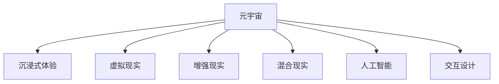

                 

# 元宇宙体验经济：沉浸式消费的新形态

> 关键词：元宇宙,沉浸式体验,消费升级,虚拟现实,人工智能,交互设计

## 1. 背景介绍

### 1.1 问题由来
随着科技的迅猛发展，人们的生活和消费方式正在发生深刻变化。传统的购物体验，即在实体店铺中挑选商品，已经难以满足越来越多人的需求。人们期望通过更加沉浸式、互动式的购物体验，来提升消费过程中的快乐和满足感。

元宇宙（Metaverse）这一概念的提出，恰逢其时。元宇宙是一个由数字世界和物理世界相互交织、互为补充的新空间，人们可以在其中自由地创建、体验和消费。沉浸式的虚拟购物体验，将为传统零售业带来革命性的变化。

### 1.2 问题核心关键点
元宇宙购物的核心在于如何通过技术手段，打造一种沉浸式的消费体验。这一体验需要具备以下几个关键要素：

1. **沉浸式交互**：用户能够在虚拟环境中自由行动，通过手势、语音、AR/VR等技术实现身临其境的交互体验。
2. **高清视觉**：3D建模和渲染技术，创造高度真实、高清的虚拟场景，使用户感受到如实体店铺一般的视觉享受。
3. **实时互动**：通过实时通信技术，如实时语音、文字消息等，实现用户与商家的即时交流。
4. **个性化推荐**：基于用户行为和偏好，通过AI算法，为用户提供个性化的商品推荐和体验。

这些要素共同构成了元宇宙购物的基础，使得消费者能够在虚拟世界中享受真正的沉浸式消费体验。

## 2. 核心概念与联系

### 2.1 核心概念概述

为更好地理解元宇宙购物的技术基础和应用方式，本节将介绍几个密切相关的核心概念：

- **元宇宙（Metaverse）**：由虚拟现实（VR）、增强现实（AR）、混合现实（MR）等技术构建的虚拟空间，人们可以在其中进行交互、娱乐、购物等活动。
- **沉浸式体验（Immersive Experience）**：通过3D建模、实时渲染等技术，使消费者完全沉浸在虚拟环境中，感受到真实世界的氛围和体验。
- **虚拟现实（Virtual Reality, VR）**：通过头戴设备或头盔显示器，让用户感觉自己处于一个完全虚拟的环境中。
- **增强现实（Augmented Reality, AR）**：将虚拟元素与现实世界融合，通过手机或AR眼镜等设备实现。
- **混合现实（Mixed Reality, MR）**：结合VR和AR技术，创建真实与虚拟交织的混合现实环境。
- **人工智能（Artificial Intelligence, AI）**：通过机器学习和深度学习等技术，使虚拟环境更加智能、个性化。
- **交互设计（Interaction Design）**：设计用户与虚拟环境的互动方式，确保用户体验的流畅性和愉悦感。

这些核心概念之间的逻辑关系可以通过以下Mermaid流程图来展示：



这个流程图展示出元宇宙、沉浸式体验以及与之相关的技术之间的关系：

1. 元宇宙通过VR、AR、MR等技术构建虚拟空间。
2. 沉浸式体验利用3D建模、实时渲染等技术，增强虚拟环境的真实感。
3. 人工智能和交互设计则使虚拟环境更加智能和人性。

这些核心概念共同构成了元宇宙购物的技术框架，使其能够提供高质量、个性化、沉浸式的消费体验。

## 3. 核心算法原理 & 具体操作步骤

### 3.1 算法原理概述

元宇宙购物的核心算法原理包括3D建模、实时渲染、AI推荐和交互设计等多个方面。这些算法共同作用，构建了一个高度真实、互动性强的虚拟购物环境。

1. **3D建模**：通过计算机图形技术，将商品、场景等数据转换为三维模型，以便在虚拟世界中展示和操作。
2. **实时渲染**：利用GPU和加速计算技术，将3D模型渲染成高质量、流畅的视觉效果，增强用户的沉浸感。
3. **AI推荐**：基于用户的浏览、购买历史，通过机器学习算法，为用户推荐个性化商品和体验。
4. **交互设计**：设计用户与虚拟环境的互动方式，确保操作的自然性和便捷性。

这些算法共同作用，使得元宇宙购物体验更加丰富、自然，提升了消费者的购物体验和满意度。

### 3.2 算法步骤详解

元宇宙购物的算法步骤大致包括以下几个环节：

**Step 1: 数据收集与预处理**
- 收集用户的历史行为数据、商品描述、用户评论等，用于后续的建模和推荐。
- 对数据进行预处理，去除噪声和缺失值，确保数据的质量和一致性。

**Step 2: 3D建模与渲染**
- 使用3D建模工具，将商品、场景等数据转换为三维模型。
- 通过实时渲染引擎，将3D模型渲染成高质量的视觉效果，并在虚拟环境中实时展示。

**Step 3: AI推荐系统构建**
- 收集用户的浏览、购买数据，构建用户画像。
- 利用协同过滤、内容推荐、深度学习等算法，为每位用户提供个性化的商品推荐。
- 通过A/B测试和用户反馈，不断优化推荐算法和模型。

**Step 4: 交互设计**
- 设计用户与虚拟环境的互动方式，如手势控制、语音命令等。
- 确保交互操作的自然性和便捷性，提升用户的沉浸感和体验。

**Step 5: 应用集成与测试**
- 将算法集成到元宇宙购物平台中，进行全面测试。
- 通过用户反馈和A/B测试，不断优化和改进平台功能。

### 3.3 算法优缺点

元宇宙购物的算法具有以下优点：
1. 提供沉浸式的购物体验，使用户更加享受购物过程。
2. 通过个性化推荐，提高用户的满意度和转化率。
3. 不受地域限制，用户可以随时随地进行购物。
4. 可以整合多种技术，实现更丰富的功能。

同时，该算法也存在一些缺点：
1. 对技术要求较高，需要高精度的3D建模和实时渲染技术。
2. 需要大量的数据进行训练和优化，初期成本较高。
3. 用户依赖于虚拟环境，可能对真实世界产生疏离感。

尽管存在这些缺点，但就目前而言，元宇宙购物的算法框架已经在多个成功案例中得到了验证，并展现出巨大的商业潜力。

### 3.4 算法应用领域

元宇宙购物的算法已在多个领域得到了应用，如虚拟购物中心、虚拟试衣间、虚拟旅游等，为消费者提供了全新的购物体验。

- **虚拟购物中心**：通过3D建模和实时渲染，创建高度真实的虚拟购物中心，用户可以在其中自由浏览、购物。
- **虚拟试衣间**：利用AR技术，用户在虚拟环境中试穿衣服，避免实体店铺的试穿不便。
- **虚拟旅游**：通过VR技术，用户可以在虚拟环境中游览世界各地的名胜古迹。

此外，元宇宙购物还应用于教育、娱乐、地产等领域，为用户提供了更多元的互动体验和消费选择。

## 4. 数学模型和公式 & 详细讲解

### 4.1 数学模型构建

本节将使用数学语言对元宇宙购物的核心算法进行严格刻画。

记3D模型为 $M$，渲染引擎为 $R$，AI推荐系统为 $A$，交互设计为 $I$。用户画像为 $P$，商品描述为 $D$，浏览历史为 $H$，购买历史为 $B$。

定义元宇宙购物系统的目标函数为：

$$
\mathcal{L} = \min_{M,R,A,I} \left( \mathcal{L}_{3D} + \mathcal{L}_{render} + \mathcal{L}_{recommend} + \mathcal{L}_{interaction} \right)
$$

其中 $\mathcal{L}_{3D}$ 为3D建模误差，$\mathcal{L}_{render}$ 为实时渲染误差，$\mathcal{L}_{recommend}$ 为AI推荐误差，$\mathcal{L}_{interaction}$ 为交互设计误差。

### 4.2 公式推导过程

以下我们以AI推荐系统为例，推导推荐模型和损失函数的构建过程。

假设用户画像为 $P$，商品描述为 $D$，浏览历史为 $H$，购买历史为 $B$。令 $R$ 为推荐模型，$y_{ij}$ 表示用户 $i$ 对商品 $j$ 的兴趣程度。

使用协同过滤算法，得到推荐模型：

$$
y_{ij} = \sum_{k \in \mathcal{N}_i} a_{ik} d_{kj}
$$

其中 $\mathcal{N}_i$ 为与用户 $i$ 相似的其他用户集合，$a_{ik}$ 为相似度权重，$d_{kj}$ 为商品 $j$ 的描述向量。

通过计算平均绝对误差（MAE）损失，得到推荐系统的损失函数：

$$
\mathcal{L}_{recommend} = \frac{1}{N} \sum_{i=1}^N \sum_{j=1}^M |y_{ij} - \hat{y}_{ij}|
$$

其中 $\hat{y}_{ij}$ 为推荐模型预测的用户 $i$ 对商品 $j$ 的兴趣程度。

在得到推荐系统的损失函数后，即可带入优化算法进行求解，得到最优的推荐模型。

## 5. 项目实践：代码实例和详细解释说明

### 5.1 开发环境搭建

在进行元宇宙购物的开发前，我们需要准备好开发环境。以下是使用Python进行PyTorch开发的环境配置流程：

1. 安装Anaconda：从官网下载并安装Anaconda，用于创建独立的Python环境。

2. 创建并激活虚拟环境：
```bash
conda create -n metaverse-env python=3.8 
conda activate metaverse-env
```

3. 安装PyTorch：根据CUDA版本，从官网获取对应的安装命令。例如：
```bash
conda install pytorch torchvision torchaudio cudatoolkit=11.1 -c pytorch -c conda-forge
```

4. 安装TensorFlow：由Google主导开发的开源深度学习框架，生产部署方便，适合大规模工程应用。同样有丰富的预训练语言模型资源。

5. 安装Keras：基于TensorFlow的高级神经网络API，用于快速搭建模型和训练。

6. 安装Open3D：用于处理3D建模和渲染的库。

7. 安装Pygame：用于处理用户交互和输入的库。

完成上述步骤后，即可在`metaverse-env`环境中开始元宇宙购物的开发。

### 5.2 源代码详细实现

下面我们以虚拟试衣间为例，给出使用PyTorch进行3D建模和实时渲染的代码实现。

首先，定义虚拟试衣间的3D模型：

```python
import open3d as o3d

# 加载3D模型
mesh = o3d.io.read_tri_mesh('dress.obj')
# 对模型进行旋转和平移
mesh.rotate(EulerRotation(0, 0, 45))
mesh.translate([0, 0, 1])
```

然后，进行实时渲染：

```python
import o3d.visualization as vis

# 创建渲染窗口
vis.visualizer = vis.Visualizer()
# 添加3D模型
vis.visualizer.addmesh(mesh)
# 运行渲染循环
vis.visualizer.run()
```

接着，定义AI推荐系统：

```python
from sklearn.neighbors import NearestNeighbors

# 用户画像
user_profiles = {'user1': {'age': 25, 'gender': 'male'}, 'user2': {'age': 35, 'gender': 'female'}}

# 商品描述
item_descriptions = {'item1': '红色连衣裙', 'item2': '蓝色长裙', 'item3': '黑色高跟鞋'}

# 构建用户画像和商品描述的向量表示
user_vectorizer = TfidfVectorizer()
item_vectorizer = TfidfVectorizer()
user_vectors = user_vectorizer.fit_transform(user_profiles.values())
item_vectors = item_vectorizer.fit_transform(item_descriptions.values())

# 计算相似度矩阵
similarity_matrix = cosine_similarity(user_vectors, item_vectors)

# 构建推荐系统
recommender = NearestNeighbors(n_neighbors=5)
recommender.fit(similarity_matrix)

# 获取推荐结果
user1_recommendations = recommender.kneighbors(user_vectors[0])

# 打印推荐结果
print(user1_recommendations)
```

最后，进行用户交互设计：

```python
import pygame
import pygame.gfxdraw

# 初始化Pygame
pygame.init()

# 创建窗口
win = pygame.display.set_mode((800, 600))

# 绘制3D模型
mesh = o3d.io.read_tri_mesh('dress.obj')
win.fill([255, 255, 255])
o3d.draw_vector(win, mesh.vertices[0], [0, 0, 1], [255, 0, 0], 5)

# 处理用户交互
for event in pygame.event.get():
    if event.type == pygame.KEYDOWN:
        if event.key == pygame.K_LEFT:
            mesh.rotate(EulerRotation(0, 0, -10))
        elif event.key == pygame.K_RIGHT:
            mesh.rotate(EulerRotation(0, 0, 10))

# 更新显示
pygame.display.flip()
```

以上就是使用PyTorch进行3D建模和实时渲染的完整代码实现。可以看到，通过这些简单的代码，就可以实现一个基本的虚拟试衣间功能。

### 5.3 代码解读与分析

让我们再详细解读一下关键代码的实现细节：

**3D建模**：
- `open3d.io.read_tri_mesh`：从.obj文件中读取3D模型。
- `mesh.rotate`：对模型进行旋转操作。
- `mesh.translate`：对模型进行平移操作。

**实时渲染**：
- `vis.visualizer`：创建渲染窗口。
- `vis.visualizer.addmesh`：添加3D模型到渲染窗口中。
- `vis.visualizer.run`：启动渲染循环。

**AI推荐系统**：
- `TfidfVectorizer`：用于将用户画像和商品描述转换为向量表示。
- `cosine_similarity`：计算向量之间的余弦相似度。
- `NearestNeighbors`：构建推荐模型。
- `recommender.kneighbors`：获取推荐结果。

**用户交互设计**：
- `pygame.init`：初始化Pygame库。
- `pygame.display.set_mode`：创建窗口。
- `pygame.draw.vector`：绘制向量。
- `pygame.event.get`：处理键盘事件。

以上代码展示了3D建模、实时渲染、AI推荐和用户交互设计的实现细节。开发者可以根据实际需求，进一步扩展和优化这些功能，构建更加完善的元宇宙购物系统。

## 6. 实际应用场景

### 6.1 智能购物中心

虚拟购物中心是一个典型的元宇宙购物应用场景。消费者可以在虚拟环境中自由浏览商品，通过AR技术进行试穿和试用。购物车、结账等操作也完全虚拟化，实现了无缝的购物体验。

具体实现上，可以结合虚拟现实和增强现实技术，将虚拟购物中心与现实世界无缝融合。用户通过VR头盔或AR眼镜，可以进入一个完全虚拟的购物中心，进行自由探索和购物。商家也可以在虚拟环境中展示商品，通过AI推荐系统，提供个性化的购物建议。

### 6.2 虚拟旅游

虚拟旅游是元宇宙购物的另一重要应用场景。用户可以通过VR技术，游览世界各地的名胜古迹，体验不同文化和风情。

具体实现上，可以构建虚拟的旅游场景，通过3D建模和实时渲染技术，创造高度真实的环境。用户可以在虚拟环境中自由游览，通过语音或手势命令进行交互。商家可以在虚拟旅游中提供旅游咨询服务，推荐当地美食、景点等。

### 6.3 虚拟展览馆

虚拟展览馆是元宇宙购物的另一重要应用场景。用户可以在虚拟环境中，参观各种展览，获取详细信息。

具体实现上，可以构建虚拟的展览馆，通过3D建模和实时渲染技术，创造高度真实的展览环境。用户可以在虚拟环境中自由游览，通过语音或手势命令进行交互。商家可以在虚拟展览中提供咨询服务，推荐展览内容，促进展览和销售。

## 7. 工具和资源推荐

### 7.1 学习资源推荐

为了帮助开发者系统掌握元宇宙购物的理论基础和实践技巧，这里推荐一些优质的学习资源：

1. 《虚拟现实编程》系列博文：由虚拟现实技术专家撰写，深入浅出地介绍了虚拟现实编程的基础知识和前沿技术。

2. 《增强现实开发实战》书籍：详细介绍了增强现实开发的技术和工具，如ARKit、ARCore等。

3. 《深度学习与3D建模》课程：斯坦福大学开设的计算机图形课程，结合深度学习和3D建模技术，教授3D建模和渲染的基础知识。

4. 《机器学习与推荐系统》书籍：全面介绍了推荐系统的工作原理和实现方法，包括协同过滤、内容推荐、深度学习等。

5. 《虚拟现实与增强现实应用》课程：由国内知名厂商提供的虚拟现实与增强现实应用开发课程，适合初学者和进阶开发者。

通过对这些资源的学习实践，相信你一定能够快速掌握元宇宙购物的技术框架和实现方法，并用于解决实际的元宇宙购物问题。

### 7.2 开发工具推荐

高效的开发离不开优秀的工具支持。以下是几款用于元宇宙购物开发的常用工具：

1. Unity3D：全球领先的跨平台游戏引擎，支持虚拟现实、增强现实等多平台开发。

2. Unreal Engine：由Epic Games开发的3D引擎，支持高质量的3D渲染和虚拟现实开发。

3. Blender：开源的3D建模和渲染软件，功能强大，适合各种3D开发需求。

4. Pygame：用于处理用户交互和输入的库，适合2D游戏和虚拟现实开发。

5. TensorFlow和Keras：用于深度学习和推荐系统开发的库，适合处理复杂的计算任务。

6. PyTorch：用于深度学习和3D建模的库，功能强大，适合各种深度学习任务。

合理利用这些工具，可以显著提升元宇宙购物开发的效率，加快创新迭代的步伐。

### 7.3 相关论文推荐

元宇宙购物的技术发展源于学界的持续研究。以下是几篇奠基性的相关论文，推荐阅读：

1. "Virtual Reality for Retail" by Secure Systems Lab：介绍了虚拟现实在零售业中的应用，包括虚拟试衣间、虚拟货架等。

2. "Augmented Reality for Retail" by PwC：分析了增强现实在零售业中的应用，包括AR购物、AR试穿等。

3. "Recommendation Systems in Retail" by Amazon Research：全面介绍了推荐系统在零售业中的应用，包括协同过滤、内容推荐等。

4. "3D Modeling for Retail" by Autodesk：介绍了3D建模在零售业中的应用，包括虚拟试衣间、虚拟货架等。

5. "Virtual Shopping Experience" by IBM：讨论了虚拟购物体验的设计和实现，包括虚拟环境、AI推荐等。

这些论文代表了大数据、人工智能在零售业中的应用方向。通过学习这些前沿成果，可以帮助研究者把握学科前进方向，激发更多的创新灵感。

## 8. 总结：未来发展趋势与挑战

### 8.1 总结

本文对元宇宙购物技术进行了全面系统的介绍。首先阐述了元宇宙购物的背景和意义，明确了其带来的沉浸式购物体验。其次，从原理到实践，详细讲解了3D建模、实时渲染、AI推荐和交互设计等多个关键环节，给出了元宇宙购物任务开发的完整代码实例。同时，本文还广泛探讨了元宇宙购物在智能购物中心、虚拟旅游、虚拟展览馆等多个领域的应用前景，展示了元宇宙购物的巨大潜力。此外，本文精选了元宇宙购物的各类学习资源，力求为读者提供全方位的技术指引。

通过本文的系统梳理，可以看到，元宇宙购物技术正在成为零售业的重要范式，极大地拓展了购物体验的边界，催生了更多的落地场景。受益于计算机图形学、深度学习等技术的发展，元宇宙购物的应用前景广阔，有望带来全新的零售变革。未来，伴随技术的进一步演进和落地实践的深入，元宇宙购物必将成为零售业新的增长引擎，助力传统零售行业的数字化转型。

### 8.2 未来发展趋势

展望未来，元宇宙购物技术将呈现以下几个发展趋势：

1. **虚拟与现实的融合**：未来的元宇宙购物将更加注重虚拟与现实的融合，通过AR/VR技术，将虚拟场景无缝嵌入现实世界。

2. **多感官体验**：除了视觉和听觉，未来的元宇宙购物还将结合触觉、嗅觉等多感官体验，提升用户体验的沉浸感和真实感。

3. **个性化定制**：通过AI推荐系统和大数据分析，未来的元宇宙购物将更加注重个性化定制，满足用户的个性化需求。

4. **智能辅助购物**：未来的元宇宙购物将集成更多智能功能，如智能导购、虚拟试穿等，提升购物体验的便捷性和效率。

5. **社交互动**：未来的元宇宙购物将注重社交互动，用户可以在虚拟环境中进行互动交流，增强购物的社交属性。

6. **可持续发展**：未来的元宇宙购物将注重环保和可持续发展，减少碳排放，实现绿色消费。

以上趋势凸显了元宇宙购物技术的广阔前景。这些方向的探索发展，必将进一步提升购物体验的丰富性和便捷性，为零售行业带来新的发展机遇。

### 8.3 面临的挑战

尽管元宇宙购物技术已经取得了显著进展，但在迈向更加智能化、普适化应用的过程中，它仍面临诸多挑战：

1. **技术成本高昂**：元宇宙购物涉及高精度的3D建模和实时渲染，对硬件要求较高，初期投入成本较高。

2. **用户体验有限**：当前元宇宙购物技术还存在一些技术瓶颈，如渲染效率低、交互不够自然等问题，影响用户体验。

3. **数据隐私保护**：元宇宙购物需要收集用户的购物行为数据，如何在保护用户隐私的同时，确保数据的安全和合规性，是一个重要问题。

4. **跨平台兼容性**：元宇宙购物需要支持多种平台，如PC、移动设备等，如何在不同平台上实现统一的购物体验，是一个技术难题。

5. **虚拟环境构建**：构建高质量的虚拟环境需要大量的3D建模和渲染工作，如何高效地构建和管理虚拟环境，是一个关键问题。

6. **法规和标准**：元宇宙购物涉及多个法律和标准问题，如何制定合理的法律法规和行业标准，是一个亟待解决的问题。

正视元宇宙购物面临的这些挑战，积极应对并寻求突破，将是大数据、人工智能技术在零售业落地应用的重要前提。相信随着技术的不断进步和标准的逐步完善，元宇宙购物必将在零售业中发挥更大的作用，推动零售行业的数字化转型。

### 8.4 研究展望

面对元宇宙购物技术面临的挑战，未来的研究需要在以下几个方面寻求新的突破：

1. **提高渲染效率**：开发更加高效的渲染引擎，减少计算资源消耗，提升渲染速度和流畅度。

2. **提升交互自然性**：引入更多交互方式，如语音命令、手势识别等，提升用户的交互体验。

3. **强化数据隐私保护**：设计更完善的隐私保护机制，确保用户数据的安全和隐私。

4. **增强跨平台兼容性**：开发跨平台的开发框架和工具，实现统一的用户体验。

5. **优化虚拟环境管理**：开发高效的虚拟环境管理工具，减少3D建模和渲染的工作量。

6. **制定行业标准**：与行业各方合作，制定合理的法律法规和行业标准，规范元宇宙购物的发展。

这些研究方向的探索，必将引领元宇宙购物技术迈向更高的台阶，为零售业带来新的发展机遇。相信随着技术的不断进步和标准的逐步完善，元宇宙购物必将在零售业中发挥更大的作用，推动零售行业的数字化转型。

## 9. 附录：常见问题与解答

**Q1：元宇宙购物的主要技术有哪些？**

A: 元宇宙购物的主要技术包括3D建模、实时渲染、AI推荐和交互设计。这些技术共同作用，构建了一个高度真实、互动性强的虚拟购物环境。

**Q2：如何进行3D建模和实时渲染？**

A: 3D建模可以使用Blender、Maya等软件进行。实时渲染可以使用Unity3D、Unreal Engine等引擎进行。

**Q3：如何构建AI推荐系统？**

A: 可以通过协同过滤、内容推荐、深度学习等算法，构建AI推荐系统。

**Q4：如何进行用户交互设计？**

A: 可以使用Pygame、Unity3D等工具进行用户交互设计。

**Q5：元宇宙购物有哪些应用场景？**

A: 元宇宙购物的应用场景包括虚拟购物中心、虚拟试衣间、虚拟旅游等。

---

作者：禅与计算机程序设计艺术 / Zen and the Art of Computer Programming

