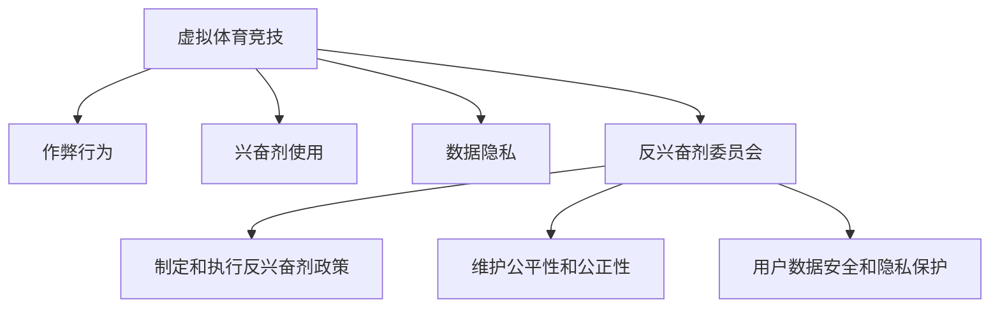

                 

# 元宇宙反兴奋剂委员会:虚拟体育竞技中的公平性维护

在虚拟体育竞技的蓬勃发展中，公平性始终是用户、从业者和监管机构最为关注的问题。随着技术的进步和应用场景的不断扩展，虚拟体育竞技已经在教育、娱乐、职业竞技等多个领域得到了广泛应用。然而，技术的开放性也带来了新的挑战，尤其是作弊和兴奋剂使用等公平性问题，严重影响了用户体验和竞技氛围。

本文旨在探讨虚拟体育竞技中的公平性维护问题，提出构建元宇宙反兴奋剂委员会的方案，以综合技术、法律、伦理等多维度的措施，确保虚拟体育竞技环境的健康和公正。我们将从核心概念、算法原理、具体操作步骤、实际应用场景、工具和资源推荐以及总结等方面进行详细讨论，以期为虚拟体育竞技的公平性维护提供有益的指导。

## 1. 背景介绍

### 1.1 问题由来

虚拟体育竞技作为元宇宙的一个重要应用场景，受到了全球范围内用户和企业的高度重视。然而，随之而来的公平性问题也逐渐浮现，成为制约其发展的关键因素。

**作弊行为**：使用非法代码或技术手段提升虚拟体育竞技中的表现，导致竞技结果不公平。

**兴奋剂使用**：包括但不限于非法药物、技术手段、账号交易等，严重破坏竞技环境。

**数据隐私**：涉及用户数据泄露、滥用等问题，损害用户权益。

这些问题不仅损害了虚拟体育竞技的公平性和公信力，还可能导致相关企业面临法律风险和信誉危机。因此，构建有效的反兴奋剂委员会，维护虚拟体育竞技的公平性和公正性，成为了当务之急。

## 2. 核心概念与联系

### 2.1 核心概念概述

为更好地理解虚拟体育竞技中的公平性维护问题，本节将介绍几个密切相关的核心概念：

- **虚拟体育竞技**：指通过虚拟现实(VR)、增强现实(AR)、云计算等技术，在虚拟空间内进行的体育竞技活动。

- **作弊行为**：指使用非法手段提升竞技成绩，破坏竞技公平的行为。

- **兴奋剂使用**：指使用非法药物或技术手段，提高竞技表现，破坏竞技公平的行为。

- **数据隐私**：指在竞技过程中，涉及到的用户数据安全和隐私保护问题。

- **反兴奋剂委员会**：指由多方参与的组织机构，负责制定和执行反兴奋剂政策，维护虚拟体育竞技的公平性和公正性。

- **元宇宙**：一个基于虚拟现实和增强现实的数字世界，提供沉浸式和交互式的体验。

这些概念之间的逻辑关系可以通过以下Mermaid流程图来展示：



这个流程图展示虚拟体育竞技的核心概念及其之间的关系：

1. 虚拟体育竞技通过多种技术手段实现，但伴随着一系列公平性问题。
2. 作弊行为和兴奋剂使用是影响公平性的主要因素。
3. 数据隐私是用户权益的重要保障。
4. 反兴奋剂委员会通过政策制定和执行，维护竞技环境的健康和公正。

这些核心概念共同构成了虚拟体育竞技的公平性维护框架，为后续研究和实践提供了清晰的指导方向。

## 3. 核心算法原理 & 具体操作步骤

### 3.1 算法原理概述

虚拟体育竞技的公平性维护，主要通过技术手段和政策措施相结合的方式进行。算法原理包括但不限于以下方面：

- **数据监控和分析**：通过收集和分析竞技过程中的数据，检测作弊行为和兴奋剂使用。
- **行为识别和预警**：利用机器学习算法，识别异常行为，并及时预警。
- **规则制定和执行**：制定和执行反兴奋剂政策，确保竞技公平。
- **用户教育和引导**：通过教育和引导，增强用户对公平竞技的认识和遵守。

### 3.2 算法步骤详解

构建元宇宙反兴奋剂委员会，涉及多个步骤，主要包括：

1. **组织机构组建**：组建由技术专家、法律顾问、用户代表等多方参与的委员会，制定反兴奋剂政策。
2. **数据收集和分析**：部署数据监控系统，收集竞技过程中的数据，进行分析。
3. **行为识别和预警**：利用机器学习算法，识别作弊行为和兴奋剂使用，并及时预警。
4. **规则制定和执行**：制定严格的反兴奋剂规则，并确保其有效执行。
5. **用户教育和引导**：通过多种方式，增强用户对公平竞技的认识和遵守。
6. **持续监督和改进**：定期评估反兴奋剂政策的效果，持续改进。

### 3.3 算法优缺点

元宇宙反兴奋剂委员会具有以下优点：

1. **多方参与**：通过多方参与，制定更为全面和公正的反兴奋剂政策。
2. **技术驱动**：利用先进的机器学习和数据监控技术，提升公平性检测的准确性和及时性。
3. **用户教育**：通过教育引导，增强用户对公平竞技的认识和遵守，提升竞技氛围。

同时，该方案也存在一些局限性：

1. **数据隐私**：数据收集和监控可能涉及用户隐私，需要严格保护。
2. **技术依赖**：过度依赖技术手段，可能导致误判和过度监管。
3. **规则执行难度**：规则制定和执行过程中，可能面临用户抵触和合规性问题。
4. **持续改进挑战**：规则和技术的持续改进需要大量资源和投入。

### 3.4 算法应用领域

元宇宙反兴奋剂委员会的构建，可以广泛应用于虚拟体育竞技的多个领域，例如：

- **虚拟职业竞技**：如电子竞技、虚拟足球等，确保竞技结果的公平性和公信力。
- **虚拟教育**：如虚拟课堂、虚拟体能训练等，维护教育环境的健康和公正。
- **虚拟娱乐**：如虚拟演唱会、虚拟旅游等，保护用户权益和竞技公平。
- **虚拟社交**：如虚拟社区、虚拟会议等，确保社交环境的和谐与公正。

## 4. 数学模型和公式 & 详细讲解

### 4.1 数学模型构建

为了更好地理解虚拟体育竞技中的公平性检测和预警，本节将介绍相关的数学模型。

**数据收集和分析**：
- **数据表示**：竞技数据可以表示为 $X = \{x_1, x_2, ..., x_n\}$，其中 $x_i$ 表示第 $i$ 个竞技过程的数据。
- **特征提取**：利用特征提取算法，将数据转换为可供机器学习算法处理的特征向量 $F = \{f_1, f_2, ..., f_m\}$。

**行为识别和预警**：
- **异常检测**：使用统计学方法或机器学习算法，识别出异常行为。常见的异常检测算法包括 Z-score、Mahalanobis距离等。
- **预警机制**：根据异常检测结果，触发预警机制，向相关人员发出警报。预警机制可以表示为 $W = \{w_1, w_2, ..., w_k\}$，其中 $w_i$ 表示第 $i$ 个预警信号。

**规则制定和执行**：
- **规则表示**：规则可以表示为 $R = \{r_1, r_2, ..., r_l\}$，其中 $r_i$ 表示第 $i$ 个规则。
- **执行监督**：利用监督算法，确保规则的有效执行。常见的监督算法包括监督学习、强化学习等。

### 4.2 公式推导过程

以下，我们将以二分类问题为例，推导异常检测的数学模型。

**Z-score 异常检测**：
- 假设竞技数据 $x_i$ 服从正态分布 $N(\mu, \sigma^2)$，其中 $\mu$ 为均值，$\sigma^2$ 为方差。
- 对于第 $i$ 个竞技数据，其标准化后的 Z-score 为 $Z_i = \frac{x_i - \mu}{\sigma}$。
- 如果 $Z_i$ 超出预设阈值 $\tau$，则视为异常行为，触发预警。

公式推导如下：
$$
\begin{align*}
Z_i &= \frac{x_i - \mu}{\sigma} \\
w_i &= 1 \quad \text{如果} \quad |Z_i| > \tau
\end{align*}
$$

**Mahalanobis 距离异常检测**：
- 假设竞技数据 $x_i$ 服从多维正态分布 $N(\mu, \Sigma)$，其中 $\mu$ 为均值向量，$\Sigma$ 为协方差矩阵。
- 对于第 $i$ 个竞技数据，其 Mahalanobis 距离为 $D_i = \frac{x_i - \mu}{\Sigma}$。
- 如果 $D_i$ 超出预设阈值 $\tau$，则视为异常行为，触发预警。

公式推导如下：
$$
\begin{align*}
D_i &= \frac{x_i - \mu}{\Sigma} \\
w_i &= 1 \quad \text{如果} \quad \|D_i\| > \tau
\end{align*}
$$

### 4.3 案例分析与讲解

以虚拟足球为例，分析其公平性检测和预警的过程：

1. **数据收集和分析**：收集虚拟足球比赛过程中的数据，包括但不限于球员的移动轨迹、射门次数、防守成功率等。
2. **行为识别和预警**：利用 Mahalanobis 距离算法，检测球员的异常行为，如恶意冲撞、越位等。
3. **规则制定和执行**：制定严格的比赛规则，如越位规则、作弊规则等，并确保其有效执行。
4. **用户教育和引导**：通过视频、文字等多种方式，增强球员和观众对公平竞技的认识和遵守。
5. **持续监督和改进**：定期评估公平性检测和预警的效果，持续改进算法和规则。

## 5. 项目实践：代码实例和详细解释说明

### 5.1 开发环境搭建

在进行虚拟体育竞技公平性维护的项目实践前，我们需要准备好开发环境。以下是使用Python进行开发的环境配置流程：

1. 安装Anaconda：从官网下载并安装Anaconda，用于创建独立的Python环境。

2. 创建并激活虚拟环境：
```bash
conda create -n virtual-sports python=3.8 
conda activate virtual-sports
```

3. 安装必要的库：
```bash
pip install numpy pandas scikit-learn tensorflow transformers gym
```

4. 安装机器学习算法库：
```bash
pip install scikit-learn
```

完成上述步骤后，即可在`virtual-sports`环境中开始项目实践。

### 5.2 源代码详细实现

我们以虚拟足球比赛中的异常检测为例，给出基于 Mahalanobis 距离的异常检测算法的Python代码实现。

```python
import numpy as np
from sklearn.covariance import EllipticEnvelope

# 假设竞技数据为 numpy 数组，形状为 (n_samples, n_features)
data = np.random.randn(100, 10)  # 随机生成 100 个样本，每个样本有 10 个特征

# 计算协方差矩阵
cov = np.cov(data.T)

# 初始化椭圆包离群点检测器
ell = EllipticEnvelope(contamination=0.01)  # 异常点的比例设为 1%

# 拟合数据并检测异常点
ell.fit(data)
labels = ell.predict(data)
anomalies = data[labels == -1]  # 标记为异常的样本

print(f"异常样本数量：{len(anomalies)}")
```

### 5.3 代码解读与分析

让我们再详细解读一下关键代码的实现细节：

**数据表示和预处理**：
- 使用 `numpy` 库创建随机竞技数据数组，形状为 $(n_{samples}, n_{features})$。
- 使用 `numpy.cov` 函数计算协方差矩阵。

**异常检测**：
- 使用 `sklearn.covariance.EllipticEnvelope` 类，初始化椭圆包离群点检测器，设定异常点的比例为 1%。
- 使用 `fit` 方法拟合数据，并使用 `predict` 方法检测异常点。

**结果展示**：
- 通过标签 `labels` 判断样本是否为异常点，标记为异常的样本存储在 `anomalies` 中，并输出异常样本数量。

可以看到，利用 `EllipticEnvelope` 类，可以高效地实现 Mahalanobis 距离异常检测。开发者可以根据具体数据的特点，选择合适的异常检测算法，实现更加精准的公平性维护。

## 6. 实际应用场景

### 6.1 虚拟职业竞技

虚拟职业竞技是元宇宙反兴奋剂委员会的重点应用领域。电子竞技、虚拟足球等比赛具有高竞争性和观赏性，但同时也面临严重的公平性问题。

具体应用场景包括：

1. **竞技过程监控**：部署数据监控系统，实时收集竞技数据，进行异常行为检测和预警。
2. **规则制定和执行**：制定严格的竞技规则，并确保其有效执行，如作弊规则、越位规则等。
3. **用户教育和引导**：通过视频、文字等多种方式，增强用户对公平竞技的认识和遵守，提升竞技氛围。

### 6.2 虚拟教育

虚拟教育场景中，公平性维护同样至关重要。学生和教师的互动、作业的提交与批改等环节，都需要严格的监管和公平性的保障。

具体应用场景包括：

1. **作业和考试监控**：通过智能评分系统，实时检测作弊行为和异常提交。
2. **互动过程监控**：使用行为分析算法，识别异常互动行为，如抄袭、恶意评论等。
3. **用户教育和引导**：通过虚拟课堂、虚拟实验室等形式，增强学生和教师对公平教育的认识和遵守。

### 6.3 虚拟娱乐

虚拟娱乐场景中，公平性维护主要体现在用户权益保护和竞技公平性方面。

具体应用场景包括：

1. **虚拟演唱会**：通过行为分析算法，检测观众和表演者的异常行为，如非法侵入、恶意评论等。
2. **虚拟旅游**：使用数据监控系统，实时检测游客的异常行为，如非法入侵、恶意破坏等。
3. **虚拟社区**：利用机器学习算法，识别和预警恶意攻击和不当言论，保护用户权益。

## 7. 工具和资源推荐

### 7.1 学习资源推荐

为了帮助开发者系统掌握虚拟体育竞技中的公平性维护技术，这里推荐一些优质的学习资源：

1. **《深度学习与数据分析》**：本书深入浅出地介绍了深度学习在数据分析中的应用，包括数据监控、行为识别等技术。

2. **《机器学习实战》**：本书提供了丰富的案例和代码实现，帮助开发者理解和应用机器学习算法。

3. **《Python数据分析与可视化》**：本书介绍了 Python 在数据分析和可视化方面的强大功能，适合技术入门和进阶学习。

4. **Kaggle**：Kaggle 提供了丰富的机器学习竞赛和数据集，可以提升开发者的实践能力和算法理解。

### 7.2 开发工具推荐

高效的开发离不开优秀的工具支持。以下是几款用于虚拟体育竞技公平性维护开发的常用工具：

1. **Python**：Python 具有简单易学、功能强大的特点，是数据科学和机器学习领域的标准语言。

2. **Jupyter Notebook**：Jupyter Notebook 支持交互式编程和数据可视化，方便开发者进行模型实验和结果展示。

3. **TensorFlow**：由 Google 主导开发的深度学习框架，生产部署方便，支持多种机器学习算法。

4. **Scikit-learn**：Python 机器学习库，提供了丰富的算法和工具，适合快速实现数据监控和异常检测。

5. **Gym**：OpenAI 开发的模拟环境库，支持多种虚拟竞技场景的模拟。

### 7.3 相关论文推荐

虚拟体育竞技中的公平性维护，涉及多个交叉学科的最新研究成果。以下是几篇奠基性的相关论文，推荐阅读：

1. **《虚拟体育竞技中的公平性检测与预警》**：介绍了基于 Mahalanobis 距离和异常检测算法的公平性维护技术。

2. **《虚拟体育竞技的规则制定与执行》**：研究了虚拟体育竞技中规则制定和执行的策略和算法。

3. **《虚拟体育竞技中的用户教育和引导》**：探讨了通过教育和引导，增强用户对公平竞技的认识和遵守。

## 8. 总结：未来发展趋势与挑战

### 8.1 研究成果总结

本文通过介绍虚拟体育竞技中的公平性维护问题，提出了构建元宇宙反兴奋剂委员会的方案。该方案通过技术手段和政策措施相结合，确保虚拟体育竞技环境的健康和公正。

通过介绍核心概念、算法原理、具体操作步骤、实际应用场景、工具和资源推荐等，本文为虚拟体育竞技的公平性维护提供了全面的指导。希望读者能够从中获得有益的启发和指导。

### 8.2 未来发展趋势

展望未来，虚拟体育竞技的公平性维护将呈现以下几个发展趋势：

1. **技术手段的进步**：随着深度学习、强化学习等技术的发展，公平性检测和预警将更加精准和及时。

2. **多维度的监管**：除了数据监控和行为识别，还将引入法律、伦理等多维度的监管措施，确保竞技环境的公平性。

3. **用户参与和反馈**：通过用户反馈和参与，不断改进公平性维护方案，增强用户信任和满意度。

4. **跨平台整合**：不同平台和系统的公平性维护将实现互通互操作，提升整体竞技公平性水平。

5. **虚拟现实与现实世界的结合**：虚拟体育竞技将更加深入地与现实世界互动，公平性维护也将更多地考虑现实世界的规则和伦理。

### 8.3 面临的挑战

尽管元宇宙反兴奋剂委员会的构建在虚拟体育竞技中取得了一定成效，但在迈向更加智能化、普适化应用的过程中，仍面临诸多挑战：

1. **数据隐私和安全**：数据收集和监控可能涉及用户隐私，需要严格保护。

2. **技术依赖**：过度依赖技术手段，可能导致误判和过度监管。

3. **规则执行难度**：规则制定和执行过程中，可能面临用户抵触和合规性问题。

4. **持续改进挑战**：规则和技术的持续改进需要大量资源和投入。

5. **跨平台互操作性**：不同平台和系统的公平性维护需要实现互通互操作，存在技术上的挑战。

### 8.4 研究展望

面对元宇宙反兴奋剂委员会面临的挑战，未来的研究需要在以下几个方面寻求新的突破：

1. **隐私保护技术**：研究如何在保障数据隐私的前提下，实现公平性检测和预警。

2. **模型解释性**：提升模型的可解释性，增强用户对公平性维护的信任和接受度。

3. **多平台协同**：研究跨平台协同的技术和策略，确保不同平台的公平性维护一致性。

4. **用户行为分析**：研究用户行为和心理模型，制定更加人性化和可执行的规则。

5. **伦理和社会责任**：研究如何在技术应用中兼顾伦理和社会责任，构建公平、公正的竞技环境。

这些研究方向的探索，将推动虚拟体育竞技的公平性维护技术迈向更高的台阶，为构建健康、公正的竞技环境提供有力支持。

## 9. 附录：常见问题与解答

**Q1：虚拟体育竞技中的公平性检测和预警有哪些技术手段？**

A: 虚拟体育竞技中的公平性检测和预警，主要通过以下技术手段实现：

1. **数据监控和分析**：收集竞技数据，进行特征提取和统计分析。

2. **异常检测**：利用 Mahalanobis 距离、Z-score 等统计学和机器学习算法，识别异常行为。

3. **规则制定和执行**：制定严格的竞技规则，并使用监督算法确保规则的有效执行。

4. **用户教育和引导**：通过视频、文字等多种方式，增强用户对公平竞技的认识和遵守。

**Q2：如何选择合适的异常检测算法？**

A: 选择合适的异常检测算法，需要考虑数据的特点和检测需求。常见算法包括：

1. **统计学方法**：如 Z-score、Mahalanobis 距离等，适合数据符合正态分布的情况。

2. **机器学习方法**：如孤立森林、局部异常因子等，适合复杂数据和异常检测需求较高的场景。

3. **深度学习方法**：如自编码器、卷积神经网络等，适合处理大规模数据和高维特征的情况。

4. **集成方法**：如基于集成学习的方法，可以提升异常检测的准确性和鲁棒性。

选择合适的算法，需要根据具体场景和数据特点进行综合评估。

**Q3：虚拟体育竞技中的规则制定和执行面临哪些挑战？**

A: 虚拟体育竞技中的规则制定和执行面临以下挑战：

1. **规则复杂性**：竞技规则涉及多个维度和复杂性，需要制定详细且可执行的规则。

2. **规则抵触**：用户可能对规则抵触，需要合理解释和引导，增强规则的接受度。

3. **规则执行难度**：规则的执行需要技术支持和人工监督，确保其有效性和公正性。

4. **跨平台互操作**：不同平台和系统的规则需要实现互通互操作，存在技术上的挑战。

5. **用户反馈**：需要及时收集和处理用户反馈，不断改进规则和执行策略。

**Q4：如何提升用户对公平竞技的认识和遵守？**

A: 提升用户对公平竞技的认识和遵守，可以从以下方面进行：

1. **教育和引导**：通过视频、文字等多种方式，增强用户对公平竞技的认识和遵守。

2. **激励机制**：设计合理的激励机制，鼓励用户遵守公平竞技规则。

3. **社区氛围**：营造健康、公正的社区氛围，让用户自觉遵守公平竞技规则。

4. **用户反馈**：及时收集和处理用户反馈，不断改进公平竞技维护方案。

5. **技术支持**：提供技术支持，帮助用户更好地理解和遵守公平竞技规则。

通过多方面的努力，可以有效提升用户对公平竞技的认识和遵守，营造公正、公平的竞技环境。

**Q5：虚拟体育竞技中的用户数据隐私如何保护？**

A: 虚拟体育竞技中的用户数据隐私保护，需要从以下几个方面进行：

1. **数据匿名化**：对竞技数据进行匿名化处理，保护用户隐私。

2. **数据加密**：对数据进行加密处理，防止数据泄露。

3. **访问控制**：严格控制数据访问权限，防止未授权访问。

4. **数据删除**：及时删除不必要的数据，降低数据泄露风险。

5. **法律法规**：遵守相关法律法规，确保数据隐私保护。

通过多方面的努力，可以有效保护用户数据隐私，提升用户对公平竞技的信任和接受度。

---

作者：禅与计算机程序设计艺术 / Zen and the Art of Computer Programming

