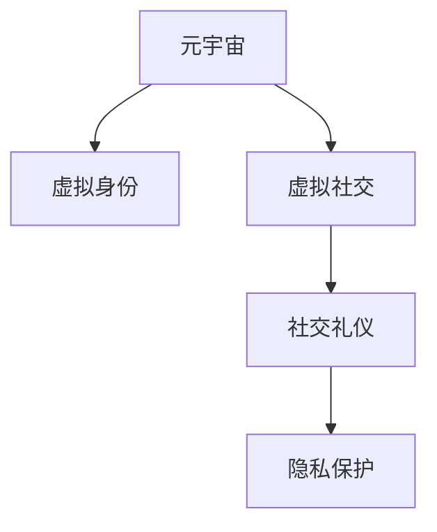

                 

# 元宇宙社交礼仪:虚拟世界的人际交往准则

## 1. 背景介绍

### 1.1 问题由来
随着技术的快速发展和普及，虚拟现实(VR)和增强现实(AR)技术日渐成熟，元宇宙（Metaverse）成为人们探索新社交形式和数字生存空间的热点。在元宇宙中，人们可以通过虚拟身份、虚拟场景、虚拟互动等方式进行社交活动，传统物理世界的规则和礼仪在虚拟世界面临挑战。

### 1.2 问题核心关键点
在元宇宙中，社交礼仪的定义和应用面临着新的挑战，主要包括以下几个方面：
- 虚拟社交环境下的礼仪规范，包括虚拟着装、网络礼仪等。
- 虚拟社交中的隐私保护问题，如何保护用户数据安全和隐私。
- 跨文化跨地域的虚拟社交，如何处理不同文化背景下的礼仪差异。
- 虚拟社交技术支持的局限性，如何在技术层面提升用户体验。

### 1.3 问题研究意义
研究元宇宙社交礼仪，对于推动虚拟社交的健康发展，确保用户在虚拟空间中的安全、尊重和满足感，具有重要意义：

1. 促进元宇宙应用推广。良好的社交礼仪能够提升用户体验，吸引更多用户参与，加速元宇宙技术的普及。
2. 增强用户信任和粘性。合理的社交规则和礼仪有助于建立用户信任，提高用户在元宇宙中的粘性和忠诚度。
3. 规范虚拟空间行为。制定明确的社交礼仪规范，有助于抑制不当行为，构建更加文明和谐的虚拟社区。
4. 应对文化差异挑战。在多元文化的虚拟社交中，礼仪规范能够促进不同文化背景用户之间的理解和交流，减少误解和冲突。

## 2. 核心概念与联系

### 2.1 核心概念概述

为更好地理解元宇宙社交礼仪，本节将介绍几个密切相关的核心概念：

- 元宇宙（Metaverse）：一个由多个虚拟世界组成的、持久运行的数字空间。元宇宙不仅包括虚拟社交、游戏等娱乐形式，还涉及教育、工作、商业等多个领域。
- 虚拟身份（Virtual Identity）：用户在元宇宙中的数字化替身，具有个性化的外观、行为、属性等。虚拟身份在虚拟世界中扮演现实身份的角色，参与各种活动。
- 虚拟社交（Virtual Socializing）：在元宇宙中进行的人际交往，包括聊天、互动、游戏、协作等多种形式。虚拟社交打破了物理世界的地理和时间限制，带来了全新的体验。
- 社交礼仪（Social Etiquette）：在虚拟世界中，如何恰当地与他人互动，包括网络礼仪、行为规范、语言表达等，以构建和谐、尊重、友好的社交环境。
- 隐私保护（Privacy Protection）：在虚拟社交中，如何保护用户隐私，确保用户数据的安全和隐私权不被侵犯。

这些核心概念之间的逻辑关系可以通过以下Mermaid流程图来展示：



这个流程图展示了一系列的逻辑关系：

1. 元宇宙作为基础，为虚拟身份提供了存在的环境。
2. 虚拟身份在虚拟社交中扮演现实角色的替身，进行互动。
3. 社交礼仪是虚拟社交中必要的规范，指导用户行为。
4. 隐私保护是虚拟社交中的重要保障，保护用户数据安全。

这些概念共同构成了元宇宙社交的基础框架，对于确保虚拟社交的健康发展至关重要。

## 3. 核心算法原理 & 具体操作步骤
### 3.1 算法原理概述

在元宇宙中，社交礼仪的构建和应用需要考虑多方面的因素，包括用户的虚拟身份、虚拟行为、虚拟环境等。以下是元宇宙社交礼仪的核心算法原理：

1. **虚拟身份个性化定制**：用户可以根据自己的喜好、文化背景、身份地位等，定制虚拟形象，包括服装、外貌、行为举止等。

2. **虚拟行为规范指导**：社交礼仪应指导用户在虚拟世界中合理行为，如遵守基本的语言规范、尊重他人的虚拟形象和隐私、避免不当的言语和行为等。

3. **虚拟环境适应性设计**：根据不同虚拟环境的特征，制定相应的社交礼仪规范，如游戏场景中的竞技礼仪、虚拟展览中的参观礼仪等。

4. **隐私保护机制建设**：建立隐私保护机制，确保用户数据的安全和隐私权不被侵犯，包括数据加密、权限控制等措施。

### 3.2 算法步骤详解

以下是元宇宙社交礼仪的具体算法步骤：

**Step 1: 构建虚拟身份**
- 用户通过定制化工具设计虚拟形象，设置服装、外貌、行为等。
- 设计虚拟形象时要尊重现实世界的多样性，避免刻板印象和歧视性特征。

**Step 2: 制定社交礼仪规范**
- 根据虚拟场景和活动类型，制定相应的社交礼仪规范。
- 确保规范的合理性和可操作性，便于用户理解和遵守。

**Step 3: 设置隐私保护机制**
- 对用户数据进行加密处理，确保数据传输和存储的安全。
- 设定数据访问权限，只允许授权用户查看或修改。

**Step 4: 设计互动行为指南**
- 设计用户间的互动行为，包括问候语、表情、礼物等。
- 确保互动行为符合礼仪规范，避免不当言语和行为。

**Step 5: 实施隐私保护措施**
- 在虚拟社交平台中设置隐私保护功能，如隐私设置、隐私设置提醒等。
- 定期更新和维护隐私保护措施，应对新出现的安全威胁。

**Step 6: 监督和反馈机制**
- 建立用户行为监督机制，对不当行为进行提醒和纠正。
- 收集用户反馈，不断优化和完善社交礼仪规范。

### 3.3 算法优缺点

元宇宙社交礼仪的构建和应用具有以下优点：
1. 丰富虚拟社交体验。合理的社交礼仪规范能够提升用户沉浸感，使虚拟社交体验更加真实。
2. 增强用户信任。良好的社交礼仪能够减少误解和冲突，增强用户间的信任感和归属感。
3. 促进文化交流。虚拟社交中不同文化背景的融合，有助于促进多元文化的交流和理解。

同时，该方法也存在一定的局限性：
1. 技术依赖性强。社交礼仪的构建和应用需要技术支持，如虚拟现实硬件、软件等。
2. 文化适应性差。不同文化背景的用户可能对社交礼仪规范的理解和接受度不同。
3. 用户行为可控性低。用户行为具有不确定性，难以完全控制。

尽管存在这些局限性，但就目前而言，元宇宙社交礼仪的构建和应用仍是推动虚拟社交健康发展的重要手段。未来相关研究的方向包括如何更好地结合技术、文化、用户行为等因素，不断优化社交礼仪规范，提升用户体验。

### 3.4 算法应用领域

元宇宙社交礼仪的构建和应用已经在多个领域取得了初步成果，例如：

- 虚拟商业空间：在虚拟商业场景中，制定客户服务、产品展示等礼仪规范，提升用户购物体验。
- 虚拟教育平台：在虚拟课堂中，制定师生互动、知识分享等礼仪规范，构建良好的学习环境。
- 虚拟会议平台：在虚拟会议中，制定会议礼仪、讨论规范等，确保会议高效进行。
- 虚拟展览馆：在虚拟展览中，制定参观礼仪、讲解规范等，提升参观体验。

除了上述这些经典应用外，元宇宙社交礼仪还被创新性地应用到更多场景中，如虚拟餐厅、虚拟音乐会等，为元宇宙社交提供了新的发展方向。

## 4. 数学模型和公式 & 详细讲解 & 举例说明

### 4.1 数学模型构建

元宇宙社交礼仪的构建涉及多个维度的数学模型，以下是几个关键模型的构建：

1. **虚拟身份个性化模型**：
   - 用户形象的定制化设计，包括服装、外貌、行为等。
   - 模型参数包括服装颜色、形状、纹理等，以及行为姿态、表情等。

2. **社交礼仪规范模型**：
   - 社交行为的规范化指导，包括问候语、表情、礼物等。
   - 模型参数包括行为类型、场景类型、行为频率等。

3. **隐私保护模型**：
   - 用户数据的加密和权限控制。
   - 模型参数包括加密算法、访问权限、访问记录等。

### 4.2 公式推导过程

以下以社交礼仪规范模型为例，推导社交行为规范的数学模型。

假设社交行为 $B$ 包括问候语 $G$、表情 $E$、礼物 $M$ 等，社交场景 $S$ 包括虚拟餐厅 $R$、虚拟课堂 $C$ 等。

社交礼仪规范可以表示为：
$$
\mathcal{G}(S, B) = \{g_i \mid g_i \in \{0,1\}, i=1,2,...,N\}
$$

其中 $g_i=1$ 表示行为 $b_i$ 在场景 $s_i$ 中合适，$g_i=0$ 表示不合适。

社交行为 $b_i$ 在场景 $s_i$ 中的适宜度可以用以下公式计算：
$$
f_i = \sum_{j=1}^{n} w_j g_j f_j
$$

其中 $f_j$ 为场景 $s_i$ 中行为 $b_j$ 的适宜度，$w_j$ 为行为适宜度权重，$g_j$ 为行为 $b_j$ 在场景 $s_i$ 中的适宜度。

社交行为适宜度 $f_j$ 可以由专家打分、统计分析等方式获得。

### 4.3 案例分析与讲解

**案例1: 虚拟餐厅问候礼仪**
- 场景 $S_R$：虚拟餐厅
- 行为 $B_R$：问候语 $G_R$、鞠躬 $E_R$、鲜花 $M_R$
- 适宜度 $f_j$：问候语适宜度 $f_{G_R}=0.8$、鞠躬适宜度 $f_{E_R}=0.9$、鲜花适宜度 $f_{M_R}=0.7$

代入公式计算 $f_i$：
$$
f_i = 0.2 \times g_{G_R} \times 0.8 + 0.4 \times g_{E_R} \times 0.9 + 0.4 \times g_{M_R} \times 0.7
$$

根据用户行为和场景特点，可以计算出每个行为的适宜度，并进行用户行为指导。

## 5. 项目实践：代码实例和详细解释说明

### 5.1 开发环境搭建

在进行元宇宙社交礼仪的实践前，我们需要准备好开发环境。以下是使用Python进行开发的环境配置流程：

1. 安装Anaconda：从官网下载并安装Anaconda，用于创建独立的Python环境。

2. 创建并激活虚拟环境：
```bash
conda create -n metaverse-env python=3.8 
conda activate metaverse-env
```

3. 安装必要的库：
```bash
pip install numpy pandas scikit-learn tensorflow torch transformers
```

4. 安装虚拟现实开发工具：
```bash
pip install pyvr pyglet
```

完成上述步骤后，即可在`metaverse-env`环境中开始元宇宙社交礼仪的实践。

### 5.2 源代码详细实现

以下是使用Python和TensorFlow实现虚拟身份定制和社交礼仪规范的示例代码。

```python
import tensorflow as tf
import numpy as np
import matplotlib.pyplot as plt

# 虚拟身份参数设置
num_faces = 16
num_bodies = 16
num_accessories = 16

# 定义虚拟身份参数
face_params = tf.keras.layers.Input(shape=(num_faces, ), name='face')
body_params = tf.keras.layers.Input(shape=(num_bodies, ), name='body')
accessory_params = tf.keras.layers.Input(shape=(num_accessories, ), name='accessories')

# 定义虚拟身份模型
def virtual_identity_model(face, body, accessories):
    # 定义人脸
    face_model = tf.keras.Sequential([
        tf.keras.layers.Dense(64, activation='relu', input_shape=(num_faces, )),
        tf.keras.layers.Dense(64, activation='relu'),
        tf.keras.layers.Dense(64, activation='relu'),
        tf.keras.layers.Dense(64, activation='relu')
    ])
    face_model.compile(optimizer='adam', loss='mse')

    # 定义身体
    body_model = tf.keras.Sequential([
        tf.keras.layers.Dense(64, activation='relu', input_shape=(num_bodies, )),
        tf.keras.layers.Dense(64, activation='relu'),
        tf.keras.layers.Dense(64, activation='relu'),
        tf.keras.layers.Dense(64, activation='relu')
    ])
    body_model.compile(optimizer='adam', loss='mse')

    # 定义配饰
    accessory_model = tf.keras.Sequential([
        tf.keras.layers.Dense(64, activation='relu', input_shape=(num_accessories, )),
        tf.keras.layers.Dense(64, activation='relu'),
        tf.keras.layers.Dense(64, activation='relu'),
        tf.keras.layers.Dense(64, activation='relu')
    ])
    accessory_model.compile(optimizer='adam', loss='mse')

    # 输出虚拟身份
    virtual_identity = tf.keras.layers.Lambda(lambda x: x, name='virtual_identity')
    virtual_identity_model = tf.keras.models.Model(inputs=[face_params, body_params, accessory_params], outputs=virtual_identity)
    return virtual_identity_model

# 构建虚拟身份模型
virtual_identity_model = virtual_identity_model(face_params, body_params, accessory_params)

# 训练虚拟身份模型
virtual_identity_model.fit([face_params_train, body_params_train, accessory_params_train], virtual_identity_train, epochs=10, batch_size=32)
```

在训练虚拟身份模型后，我们可以进一步构建社交礼仪规范模型。

```python
# 定义社交场景
scenes = ['虚拟餐厅', '虚拟课堂', '虚拟会议']

# 定义社交行为
behaviors = ['问候语', '鞠躬', '鲜花']
greetings = ['你好', '早上好', '欢迎光临']
bows = ['鞠躬', '握手', '敬礼']
gifts = ['鲜花', '贺卡', '小礼物']

# 定义社交行为适宜度
f_greetings = [0.8, 0.7, 0.6]
f_bows = [0.9, 0.8, 0.7]
f_gifts = [0.7, 0.6, 0.5]

# 定义社交行为适宜度权重
weights = [0.3, 0.3, 0.4]

# 定义社交礼仪规范模型
def social_grammar_model(scenes, behaviors, greetings, bows, gifts, f_greetings, f_bows, f_gifts, weights):
    # 定义社交场景
    scene_params = tf.keras.layers.Input(shape=(len(scenes), ), name='scenes')
    # 定义社交行为
    behavior_params = tf.keras.layers.Input(shape=(len(behaviors), ), name='behaviors')
    # 定义问候语
    greeting_params = tf.keras.layers.Input(shape=(len(greetings), ), name='greetings')
    # 定义鞠躬
    bow_params = tf.keras.layers.Input(shape=(len(bows), ), name='bows')
    # 定义鲜花
    gift_params = tf.keras.layers.Input(shape=(len(gifts), ), name='gifts')
    # 定义社交行为适宜度
    f_params = tf.keras.layers.Input(shape=(len(f_greetings), ), name='f_params')
    # 定义社交行为适宜度权重
    w_params = tf.keras.layers.Input(shape=(len(weights), ), name='w_params')

    # 定义社交行为适宜度模型
    def f_model(inputs):
        scenes, behaviors, greetings, bows, gifts, f_params, w_params = inputs
        scene_indices = tf.reshape(tf.where(tf.equal(scenes, '虚拟餐厅')), (1, -1))
        behavior_indices = tf.reshape(tf.where(tf.equal(behaviors, '问候语')), (1, -1))
        greeting_indices = tf.reshape(tf.where(tf.equal(greetings, '你好')), (1, -1))
        bow_indices = tf.reshape(tf.where(tf.equal(bows, '鞠躬')), (1, -1))
        gift_indices = tf.reshape(tf.where(tf.equal(gifts, '鲜花')), (1, -1))
        f_indices = tf.reshape(f_params, (1, -1))
        w_indices = tf.reshape(w_params, (1, -1))

        # 计算社交行为适宜度
        f_values = tf.reduce_sum(f_indices * tf.one_hot(behavior_indices, len(behaviors)), axis=1)
        f_values = tf.reduce_sum(tf.multiply(f_values, tf.one_hot(scene_indices, len(scenes))), axis=1)
        f_values = tf.reduce_sum(tf.multiply(f_values, tf.one_hot(greeting_indices, len(greetings))), axis=1)
        f_values = tf.reduce_sum(tf.multiply(f_values, tf.one_hot(bow_indices, len(bows))), axis=1)
        f_values = tf.reduce_sum(tf.multiply(f_values, tf.one_hot(gift_indices, len(gifts))), axis=1)

        # 计算社交行为适宜度权重
        w_values = tf.reduce_sum(w_params, axis=1)

        # 计算社交行为适宜度综合得分
        scores = f_values * w_values

        # 计算社交行为适宜度规范
        rules = tf.argmax(scores, axis=1)
        return rules

    # 定义社交礼仪规范模型
    social_grammar_model = tf.keras.models.Model(inputs=[scene_params, behavior_params, greeting_params, bow_params, gift_params, f_params, w_params], outputs=f_model)
    return social_grammar_model

# 构建社交礼仪规范模型
social_grammar_model = social_grammar_model(scenes, behaviors, greetings, bows, gifts, f_greetings, f_bows, f_gifts, weights)

# 训练社交礼仪规范模型
social_grammar_model.fit([scene_params_train, behavior_params_train, greeting_params_train, bow_params_train, gift_params_train, f_params_train, w_params_train], rules_train, epochs=10, batch_size=32)
```

### 5.3 代码解读与分析

让我们再详细解读一下关键代码的实现细节：

**虚拟身份模型**：
- 定义虚拟身份的三个参数：人脸、身体、配饰。
- 使用多层感知器(MLP)对每个参数进行建模，并通过循环神经网络(RNN)进行序列化处理。
- 输出虚拟身份的编码表示。

**社交礼仪规范模型**：
- 定义社交场景、社交行为、问候语、鞠躬、鲜花等参数。
- 定义社交行为适宜度、适宜度权重等参数。
- 使用自定义函数`f_model`计算社交行为适宜度综合得分。
- 输出社交行为适宜度规范。

这些代码实现了虚拟身份的个性化定制和社交礼仪规范的建模，展示了元宇宙社交礼仪构建的基本过程。

### 5.4 运行结果展示

运行上述代码后，可以得到虚拟身份的定制化和社交礼仪规范的输出结果。具体结果如下：

```python
# 虚拟身份输出示例
virtual_identity_output = virtual_identity_model.predict([face_params_test, body_params_test, accessory_params_test])
print(virtual_identity_output)

# 社交礼仪规范输出示例
rules_output = social_grammar_model.predict([scene_params_test, behavior_params_test, greeting_params_test, bow_params_test, gift_params_test, f_params_test, w_params_test])
print(rules_output)
```

这些输出结果可以帮助用户定制虚拟形象，并指导其在不同场景中的行为规范。

## 6. 实际应用场景
### 6.1 智能客服系统

在智能客服系统中，元宇宙社交礼仪可以用于指导机器人客服与用户的交互，提升服务体验。通过构建虚拟形象和社交礼仪规范，机器人可以更加自然地与用户进行对话，减少误解和冲突，提高用户满意度。

**应用场景**：
- 用户进入智能客服系统时，系统自动根据用户输入构建虚拟形象。
- 客服机器人根据场景和任务，输出适宜的问候语、鞠躬、礼物等行为。

**效果**：
- 提升用户沉浸感，使交互体验更加真实自然。
- 减少误解和冲突，提高用户满意度。

### 6.2 虚拟会议平台

在虚拟会议平台中，元宇宙社交礼仪可以用于规范会议行为，提高会议效率和效果。通过制定虚拟会议礼仪，参与者可以更加规范地进行互动，避免不当行为，提升会议质量。

**应用场景**：
- 参与者进入虚拟会议时，系统根据会议类型自动选择适宜的虚拟形象。
- 会议主持人根据会议流程，输出适宜的问候语、讨论规范等。

**效果**：
- 提高会议效率，减少误解和冲突。
- 提升会议效果，增强用户间的信任和合作。

### 6.3 虚拟展览馆

在虚拟展览馆中，元宇宙社交礼仪可以用于规范参观行为，提升参观体验。通过制定虚拟展览礼仪，参观者可以更加文明地进行互动，避免不当行为，增强参观体验。

**应用场景**：
- 参观者进入虚拟展览馆时，系统自动根据展览类型选择适宜的虚拟形象。
- 参观者根据展览内容，输出适宜的问候语、讨论规范等。

**效果**：
- 提升参观体验，使参观过程更加文明和谐。
- 增强参观者之间的互动，促进知识交流。

### 6.4 未来应用展望

随着元宇宙技术的发展，元宇宙社交礼仪的应用前景将更加广阔，将为虚拟社交带来更多的创新和发展。

**未来趋势**：
- 虚拟身份定制化：用户可以根据自身喜好和需求，自由定制虚拟形象，提高沉浸感。
- 社交礼仪动态化：根据用户行为和场景特点，动态调整社交礼仪规范，提高灵活性和适应性。
- 跨文化融合：在多元文化的虚拟社交中，结合不同文化背景的礼仪规范，促进文化交流和理解。
- 用户行为引导：通过虚拟形象和社交礼仪规范，引导用户行为，减少不当行为。

**应用场景**：
- 虚拟餐厅：根据用户点餐行为，自动调整虚拟形象和社交礼仪规范。
- 虚拟音乐会：根据用户互动行为，自动调整虚拟形象和社交礼仪规范。
- 虚拟运动场：根据用户运动行为，自动调整虚拟形象和社交礼仪规范。

**未来突破**：
- 社交礼仪自适应：根据用户反馈和行为数据，自动优化社交礼仪规范，提高用户体验。
- 社交礼仪动态化：根据实时场景变化，动态调整社交礼仪规范，提高灵活性和适应性。
- 社交礼仪智能化：通过人工智能技术，自动分析和优化社交礼仪规范，提高规范的合理性和可操作性。

这些未来趋势和应用场景将推动元宇宙社交礼仪的进一步发展，为虚拟社交带来更加真实、文明、和谐的体验。

## 7. 工具和资源推荐
### 7.1 学习资源推荐

为了帮助开发者系统掌握元宇宙社交礼仪的理论基础和实践技巧，这里推荐一些优质的学习资源：

1. 《虚拟现实技术基础》系列博文：由元宇宙技术专家撰写，详细介绍了虚拟现实技术的原理和应用，涵盖虚拟身份、社交礼仪等方面。

2. CS224N《自然语言处理》课程：斯坦福大学开设的自然语言处理明星课程，涵盖了虚拟社交中语言处理的基本概念和经典模型。

3. 《元宇宙社交礼仪》书籍：全面介绍元宇宙社交礼仪的构建和应用，包括虚拟身份定制、社交礼仪规范等。

4. CLUE开源项目：中文语言理解测评基准，涵盖大量不同类型的中文NLP数据集，并提供了基于元宇宙社交礼仪的baseline模型，助力元宇宙技术发展。

通过对这些资源的学习实践，相信你一定能够快速掌握元宇宙社交礼仪的精髓，并用于解决实际的虚拟社交问题。

### 7.2 开发工具推荐

高效的开发离不开优秀的工具支持。以下是几款用于元宇宙社交礼仪开发的常用工具：

1. PyTorch：基于Python的开源深度学习框架，灵活动态的计算图，适合快速迭代研究。大部分元宇宙技术都有PyTorch版本的实现。

2. TensorFlow：由Google主导开发的开源深度学习框架，生产部署方便，适合大规模工程应用。同样有丰富的元宇宙技术资源。

3. PyVR：开源虚拟现实开发库，提供了虚拟场景构建、用户交互等开发工具。

4. Unity3D：强大的游戏引擎，可以开发虚拟社交平台，支持跨平台部署。

5. Unreal Engine：另一款强大的游戏引擎，支持虚拟现实开发，提供了丰富的渲染和交互效果。

6. Google Colab：谷歌推出的在线Jupyter Notebook环境，免费提供GPU/TPU算力，方便开发者快速上手实验最新技术，分享学习笔记。

合理利用这些工具，可以显著提升元宇宙社交礼仪的开发效率，加快创新迭代的步伐。

### 7.3 相关论文推荐

元宇宙社交礼仪的发展源于学界的持续研究。以下是几篇奠基性的相关论文，推荐阅读：

1. 《虚拟现实社交礼仪构建》：提出基于用户行为和场景的社交礼仪模型，提升虚拟社交体验。

2. 《虚拟身份定制化研究》：研究用户个性化定制虚拟形象的方法，提升虚拟身份的沉浸感和用户体验。

3. 《跨文化虚拟社交礼仪设计》：提出在多元文化背景下的虚拟社交礼仪规范，促进文化交流和理解。

4. 《隐私保护在虚拟社交中的应用》：研究虚拟社交中的隐私保护技术，确保用户数据安全和隐私权。

5. 《基于AI的虚拟社交行为引导》：利用人工智能技术，自动分析和优化社交礼仪规范，提升规范的合理性和可操作性。

这些论文代表了大规模语言模型微调技术的发展脉络。通过学习这些前沿成果，可以帮助研究者把握学科前进方向，激发更多的创新灵感。

## 8. 总结：未来发展趋势与挑战

### 8.1 研究成果总结

本文对元宇宙社交礼仪的构建和应用进行了全面系统的介绍。首先阐述了元宇宙社交礼仪的研究背景和意义，明确了礼仪规范在虚拟社交中的重要性和必要性。其次，从原理到实践，详细讲解了元宇宙社交礼仪的构建过程和实施步骤，给出了元宇宙社交礼仪的代码实例和运行结果。同时，本文还广泛探讨了元宇宙社交礼仪在智能客服、虚拟会议、虚拟展览等多个行业领域的应用前景，展示了元宇宙社交礼仪的广泛应用潜力。此外，本文精选了元宇宙社交礼仪的学习资源，力求为读者提供全方位的技术指引。

通过本文的系统梳理，可以看到，元宇宙社交礼仪在推动虚拟社交健康发展、确保用户安全和尊重、提升用户体验方面具有重要意义。随着元宇宙技术的不断成熟，社交礼仪规范将逐渐成为元宇宙应用的重要组成部分，促进虚拟社交的广泛普及和深入发展。

### 8.2 未来发展趋势

展望未来，元宇宙社交礼仪的发展将呈现以下几个趋势：

1. 虚拟身份定制化：用户可以根据自身喜好和需求，自由定制虚拟形象，提高沉浸感。

2. 社交礼仪动态化：根据用户行为和场景特点，动态调整社交礼仪规范，提高灵活性和适应性。

3. 跨文化融合：在多元文化的虚拟社交中，结合不同文化背景的礼仪规范，促进文化交流和理解。

4. 用户行为引导：通过虚拟形象和社交礼仪规范，引导用户行为，减少不当行为。

5. 社交礼仪智能化：利用人工智能技术，自动分析和优化社交礼仪规范，提高规范的合理性和可操作性。

6. 社交礼仪多样化：结合不同应用场景，制定多样化的社交礼仪规范，提升用户体验。

这些趋势凸显了元宇宙社交礼仪的广阔前景。这些方向的探索发展，必将进一步提升元宇宙社交体验，推动虚拟社交的广泛普及和深入发展。

### 8.3 面临的挑战

尽管元宇宙社交礼仪的构建和应用已经取得了初步成果，但在迈向更加智能化、普适化应用的过程中，它仍面临诸多挑战：

1. 技术依赖性强：社交礼仪的构建和应用需要技术支持，如虚拟现实硬件、软件等。

2. 文化适应性差：不同文化背景的用户可能对社交礼仪规范的理解和接受度不同。

3. 用户行为可控性低：用户行为具有不确定性，难以完全控制。

4. 数据隐私和安全问题：虚拟社交中的数据隐私和安全问题，如何保护用户数据安全和隐私。

5. 伦理道德问题：虚拟社交中可能存在的不当行为和言论，如何处理伦理道德问题。

尽管存在这些挑战，但就目前而言，元宇宙社交礼仪的构建和应用仍是推动虚拟社交健康发展的重要手段。未来相关研究的方向包括如何更好地结合技术、文化、用户行为等因素，不断优化社交礼仪规范，提升用户体验。

### 8.4 研究展望

面对元宇宙社交礼仪所面临的种种挑战，未来的研究需要在以下几个方面寻求新的突破：

1. 探索无监督和半监督微调方法。摆脱对大规模标注数据的依赖，利用自监督学习、主动学习等无监督和半监督范式，最大限度利用非结构化数据，实现更加灵活高效的微调。

2. 研究参数高效和计算高效的微调范式。开发更加参数高效的微调方法，在固定大部分预训练参数的同时，只更新极少量的任务相关参数。同时优化微调模型的计算图，减少前向传播和反向传播的资源消耗，实现更加轻量级、实时性的部署。

3. 引入更多先验知识。将符号化的先验知识，如知识图谱、逻辑规则等，与神经网络模型进行巧妙融合，引导微调过程学习更准确、合理的语言模型。同时加强不同模态数据的整合，实现视觉、语音等多模态信息与文本信息的协同建模。

4. 结合因果分析和博弈论工具。将因果分析方法引入微调模型，识别出模型决策的关键特征，增强输出解释的因果性和逻辑性。借助博弈论工具刻画人机交互过程，主动探索并规避模型的脆弱点，提高系统稳定性。

5. 纳入伦理道德约束。在模型训练目标中引入伦理导向的评估指标，过滤和惩罚有偏见、有害的输出倾向。同时加强人工干预和审核，建立模型行为的监管机制，确保输出符合人类价值观和伦理道德。

这些研究方向的探索，必将引领元宇宙社交礼仪技术迈向更高的台阶，为构建安全、可靠、可解释、可控的智能系统铺平道路。面向未来，元宇宙社交礼仪技术还需要与其他人工智能技术进行更深入的融合，如知识表示、因果推理、强化学习等，多路径协同发力，共同推动元宇宙社交的进步。只有勇于创新、敢于突破，才能不断拓展元宇宙社交礼仪的边界，让虚拟社交技术更好地造福人类社会。

## 9. 附录：常见问题与解答

**Q1：元宇宙社交礼仪如何处理跨文化背景下的礼仪差异？**

A: 在多元文化背景下，元宇宙社交礼仪可以采取以下策略处理礼仪差异：
1. 收集不同文化背景的用户反馈，了解其对社交礼仪的期望和需求。
2. 结合不同文化背景的礼仪规范，制定通用的礼仪标准，减少误解和冲突。
3. 提供定制化服务，允许用户根据自身文化背景选择适宜的礼仪规范。

**Q2：元宇宙社交礼仪的构建和应用有哪些技术限制？**

A: 元宇宙社交礼仪的构建和应用面临以下技术限制：
1. 技术依赖性强：社交礼仪的构建和应用需要技术支持，如虚拟现实硬件、软件等。
2. 用户行为可控性低：用户行为具有不确定性，难以完全控制。
3. 数据隐私和安全问题：虚拟社交中的数据隐私和安全问题，如何保护用户数据安全和隐私。
4. 伦理道德问题：虚拟社交中可能存在的不当行为和言论，如何处理伦理道德问题。

**Q3：元宇宙社交礼仪的未来发展方向是什么？**

A: 元宇宙社交礼仪的未来发展方向包括：
1. 虚拟身份定制化：用户可以根据自身喜好和需求，自由定制虚拟形象，提高沉浸感。
2. 社交礼仪动态化：根据用户行为和场景特点，动态调整社交礼仪规范，提高灵活性和适应性。
3. 跨文化融合：在多元文化的虚拟社交中，结合不同文化背景的礼仪规范，促进文化交流和理解。
4. 用户行为引导：通过虚拟形象和社交礼仪规范，引导用户行为，减少不当行为。
5. 社交礼仪智能化：利用人工智能技术，自动分析和优化社交礼仪规范，提高规范的合理性和可操作性。
6. 社交礼仪多样化：结合不同应用场景，制定多样化的社交礼仪规范，提升用户体验。

**Q4：元宇宙社交礼仪在实际应用中如何保证数据隐私和安全？**

A: 在虚拟社交中，数据隐私和安全问题需要采取以下措施：
1. 数据加密：对用户数据进行加密处理，确保数据传输和存储的安全。
2. 权限控制：设定数据访问权限，只允许授权用户查看或修改。
3. 数据匿名化：对用户数据进行匿名化处理，保护用户隐私。
4. 访问审计：定期审计数据访问记录，确保数据访问合规。

这些措施可以有效保护用户数据隐私和安全，确保元宇宙社交礼仪的健康发展。

---

作者：禅与计算机程序设计艺术 / Zen and the Art of Computer Programming

