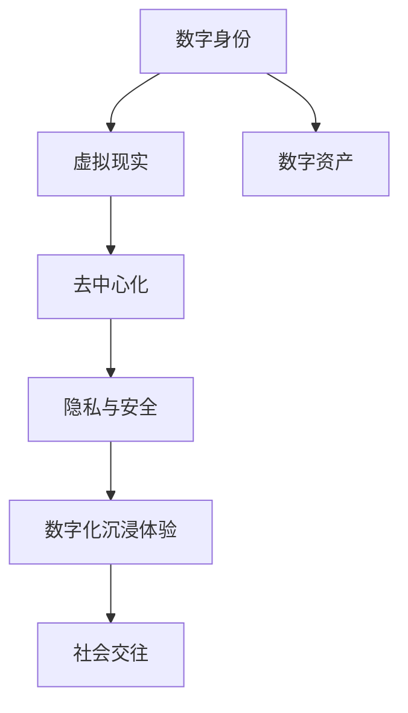

                 

# 元宇宙：人类集体意识的数字化映射

> 关键词：元宇宙,虚拟现实,数字身份,数字资产,去中心化,区块链,隐私与安全,数字化沉浸体验,社会交往

## 1. 背景介绍

### 1.1 问题由来
元宇宙（Metaverse），这个概念最初源自美国作家威廉·吉布森1980年代的小说《神经漫游者》（Neuromancer），后来逐渐演变为描述一种全新的虚拟数字空间，其中人们可以通过虚拟现实设备（如VR头盔、增强现实眼镜等）体验到高度真实感的环境，与虚拟世界中的其他用户进行互动，进行各类活动。

2021年，Facebook宣布全面转向元宇宙战略，这一举措再次引发了人们对元宇宙的广泛关注。与此同时，新冠疫情的流行更是加速了人们从现实世界向虚拟世界迁移的步伐。各大科技公司纷纷入局元宇宙，并竞相推出自己的虚拟世界平台。元宇宙正在从一个科幻概念转变为现实中的重要存在。

### 1.2 问题核心关键点
元宇宙的核心在于通过数字技术，构建一个与现实世界紧密相连、高度互动、高度沉浸的数字空间。元宇宙中包含的主要元素包括：
1. **虚拟现实**：通过虚拟现实技术，实现身临其境的数字体验。
2. **数字身份**：在虚拟世界中，用户拥有唯一的数字身份，与现实世界的身份一致或存在关联。
3. **数字资产**：在虚拟世界中进行交易、继承的各类资产，包括但不限于虚拟土地、数字艺术品等。
4. **去中心化**：使用区块链技术，确保虚拟世界的交易透明、安全、不可篡改。
5. **隐私与安全**：保证用户在虚拟世界中的数据安全和隐私保护。
6. **数字化沉浸体验**：通过高度逼真的数字环境和AI交互，提升用户体验的沉浸感。
7. **社会交往**：在虚拟世界中构建社会关系网络，进行社会活动，如协作、娱乐、教育等。

这些元素共同构成了元宇宙的核心技术架构和应用场景，其中数字身份、数字资产、去中心化技术尤为关键。本博客将从数字身份、数字资产、去中心化三个核心角度深入探讨元宇宙的技术原理与实际应用。

## 2. 核心概念与联系

### 2.1 核心概念概述

元宇宙的构建涉及众多核心概念和技术，以下是几个关键概念的概述：

- **数字身份**：在虚拟世界中，用户拥有唯一的数字身份，这一身份在多个虚拟平台间可互通，可映射到现实世界中的身份信息。
- **数字资产**：在虚拟世界中进行交易、继承的各类资产，如虚拟土地、数字艺术品等。
- **去中心化**：使用区块链技术，确保虚拟世界的交易透明、安全、不可篡改。
- **虚拟现实**：通过虚拟现实技术，实现身临其境的数字体验。
- **隐私与安全**：保证用户在虚拟世界中的数据安全和隐私保护。
- **数字化沉浸体验**：通过高度逼真的数字环境和AI交互，提升用户体验的沉浸感。
- **社会交往**：在虚拟世界中构建社会关系网络，进行社会活动，如协作、娱乐、教育等。

这些概念之间的逻辑关系可以通过以下Mermaid流程图来展示：



这个流程图展示了一些核心概念及其之间的关系：

1. 数字身份是元宇宙的基础，通过数字身份，用户可以在多个虚拟平台间自由切换。
2. 数字资产是元宇宙经济的基础，虚拟世界的交易活动需要数字资产的支撑。
3. 去中心化技术是确保虚拟世界交易安全透明的关键，区块链作为核心技术之一。
4. 虚拟现实和数字化沉浸体验是元宇宙的核心体验，提供沉浸式的数字体验。
5. 隐私与安全是元宇宙健康发展的基础，保障用户数据和交易的安全性。
6. 社会交往是元宇宙的重要应用场景，通过虚拟世界进行协作、娱乐、教育等活动。

## 3. 核心算法原理 & 具体操作步骤

### 3.1 算法原理概述

元宇宙的构建涉及复杂的技术体系，包括虚拟现实技术、数字身份管理、数字资产交易、去中心化技术等。本节将从数字身份、数字资产和去中心化三个核心技术入手，阐述其原理和具体操作步骤。

### 3.2 算法步骤详解

#### 3.2.1 数字身份管理

数字身份管理是元宇宙构建的基础，其核心任务是保证用户身份的唯一性和跨平台互通性。以下是数字身份管理的核心步骤：

1. **身份创建与认证**：用户首先需要创建自己的数字身份，并通过身份认证（如手机号码、电子邮件、社交媒体账号等）来验证身份的真实性。
2. **身份映射**：将用户的现实世界身份信息映射到虚拟世界中，保证用户数字身份与现实身份的一致性。
3. **身份授权与控制**：用户可以通过授权管理工具，控制数字身份的访问权限，保护隐私。

#### 3.2.2 数字资产管理

数字资产管理是元宇宙经济体系的核心，其核心任务是确保数字资产的交易安全透明。以下是数字资产管理的核心步骤：

1. **资产创建**：用户在虚拟世界中创建或购买数字资产，如虚拟土地、数字艺术品等。
2. **资产登记**：将数字资产登记到区块链上，保证资产的唯一性和可追溯性。
3. **资产交易**：用户可以通过区块链进行数字资产的交易，确保交易的透明和不可篡改性。
4. **资产继承与转让**：用户可以将数字资产继承或转让给他人，保证资产的流动性。

#### 3.2.3 去中心化技术

去中心化技术是元宇宙交易系统的核心，其核心任务是确保交易的安全透明。以下是去中心化技术的核心步骤：

1. **区块链网络搭建**：搭建基于区块链的虚拟交易网络，确保交易数据的去中心化存储。
2. **智能合约部署**：在区块链上部署智能合约，自动执行交易规则，确保交易的透明性和不可篡改性。
3. **共识机制设计**：设计共识机制，保证区块链网络中的节点可以达成一致的交易记录，避免双花等问题。
4. **隐私保护**：使用零知识证明、隐私计算等技术，保护用户的交易隐私。

### 3.3 算法优缺点

#### 3.3.1 数字身份管理的优缺点

**优点**：

- 数字身份具有唯一性和跨平台互通性，方便用户在多个虚拟平台间切换。
- 通过身份映射，数字身份与现实身份一致，确保用户信息的真实性。
- 通过授权管理，用户可以控制自己的数字身份访问权限，保护隐私。

**缺点**：

- 数字身份管理需要大量的认证和授权机制，可能会增加用户的使用门槛。
- 数字身份的安全性依赖于认证和授权机制的健壮性，一旦被攻击，可能导致身份信息泄露。

#### 3.3.2 数字资产管理的优缺点

**优点**：

- 数字资产具有唯一性和可追溯性，确保资产的交易透明和安全性。
- 数字资产具有流动性，方便用户进行交易和继承。

**缺点**：

- 数字资产交易的效率可能受限于区块链网络的处理能力，交易速度较慢。
- 数字资产的创建和管理需要一定的技术和资金门槛，用户可能难以参与。

#### 3.3.3 去中心化技术的优缺点

**优点**：

- 去中心化技术确保交易的透明和不可篡改性，提高了交易的可靠性。
- 区块链网络的去中心化存储和智能合约自动执行，减少了中间环节，提高了交易效率。

**缺点**：

- 区块链网络的处理能力有限，交易速度较慢。
- 区块链技术的复杂性较高，技术门槛较高，普通用户可能难以理解和参与。

### 3.4 算法应用领域

元宇宙的应用领域非常广泛，涵盖游戏、教育、社交、商业等多个领域。以下是元宇宙在不同领域中的应用案例：

- **游戏**：如《我的世界》、《Roblox》等虚拟世界平台，用户可以在虚拟世界中进行游戏、互动和社交。
- **教育**：如虚拟教室、虚拟实验室等，提供沉浸式的学习体验，增强教学效果。
- **社交**：如虚拟社交平台《Decentraland》，用户可以在虚拟世界中构建社区、进行活动。
- **商业**：如虚拟商业平台《Decentraland》，用户可以在虚拟世界中开设店铺、进行交易。

## 4. 数学模型和公式 & 详细讲解 & 举例说明

### 4.1 数学模型构建

本节将使用数学语言对数字身份、数字资产和去中心化技术进行更加严格的刻画。

**数字身份管理**：

1. **身份认证**：使用哈希函数将用户的现实身份信息（如身份证号、手机号等）进行哈希处理，得到数字身份标识。
2. **身份映射**：将用户的现实身份信息与数字身份标识进行映射，得到用户的数字身份。
3. **身份授权**：使用基于角色的访问控制（RBAC）模型，控制用户的数字身份访问权限。

**数字资产管理**：

1. **资产创建**：使用哈希函数将数字资产信息进行哈希处理，得到资产标识。
2. **资产登记**：将资产标识和相关信息（如资产创建时间、创建者等）记录到区块链上。
3. **资产交易**：使用智能合约自动执行交易规则，确保交易的透明性和不可篡改性。
4. **资产继承与转让**：使用智能合约自动执行继承和转让规则，确保资产的流动性。

**去中心化技术**：

1. **区块链网络搭建**：搭建基于区块链的虚拟交易网络，确保交易数据的去中心化存储。
2. **智能合约部署**：在区块链上部署智能合约，自动执行交易规则，确保交易的透明性和不可篡改性。
3. **共识机制设计**：设计共识机制，保证区块链网络中的节点可以达成一致的交易记录，避免双花等问题。
4. **隐私保护**：使用零知识证明、隐私计算等技术，保护用户的交易隐私。

### 4.2 公式推导过程

**数字身份管理**：

1. **身份认证**：

$$
H(x) = \text{hash}(x)
$$

其中，$x$ 为用户的现实身份信息，$H$ 为哈希函数。

2. **身份映射**：

$$
\text{ID} = H(x)
$$

其中，$\text{ID}$ 为用户的数字身份标识，$x$ 为用户的现实身份信息。

3. **身份授权**：

$$
P_{user} = \text{RBAC}(\text{ID}, \text{role})
$$

其中，$P_{user}$ 为用户可访问权限，$role$ 为用户角色。

**数字资产管理**：

1. **资产创建**：

$$
\text{AssetID} = H(\text{assetInfo})
$$

其中，$\text{assetInfo}$ 为数字资产信息，$H$ 为哈希函数。

2. **资产登记**：

$$
\text{BlockchainRecord}(\text{AssetID}, \text{assetInfo})
$$

其中，$\text{BlockchainRecord}$ 为区块链记录函数。

3. **资产交易**：

$$
\text{TransactionRecord}(\text{AssetID}, \text{newOwner}, \text{time})
$$

其中，$\text{TransactionRecord}$ 为交易记录函数，$\text{newOwner}$ 为新资产所有者，$\text{time}$ 为交易时间。

4. **资产继承与转让**：

$$
\text{InheritRecord}(\text{AssetID}, \text{newOwner})
$$

其中，$\text{InheritRecord}$ 为继承记录函数，$\text{newOwner}$ 为新资产所有者。

**去中心化技术**：

1. **区块链网络搭建**：

$$
\text{BlockchainNetwork} = \text{Node}_1, \text{Node}_2, ..., \text{Node}_n
$$

其中，$\text{Node}_i$ 为区块链网络中的节点。

2. **智能合约部署**：

$$
\text{SmartContract}(\text{code}, \text{data})
$$

其中，$\text{code}$ 为智能合约代码，$\text{data}$ 为智能合约数据。

3. **共识机制设计**：

$$
\text{ConsensusProtocol}(\text{block}, \text{node})
$$

其中，$\text{block}$ 为区块链中的区块，$\text{node}$ 为节点。

4. **隐私保护**：

$$
\text{PrivacyPreserve}(\text{transaction}, \text{user})
$$

其中，$\text{transaction}$ 为交易记录，$\text{user}$ 为用户。

### 4.3 案例分析与讲解

#### 4.3.1 数字身份管理案例

假设某用户A想要在虚拟平台B中创建一个数字身份。具体步骤如下：

1. **身份认证**：用户A使用手机号和身份证号进行身份认证，平台B将这两条信息进行哈希处理，得到数字身份标识ID。
2. **身份映射**：平台B将用户A的现实身份信息（手机号、身份证号）与数字身份标识ID进行映射，生成用户A的数字身份。
3. **身份授权**：平台B使用基于角色的访问控制（RBAC）模型，设置用户A的访问权限，确保其只能访问授权范围内的资源。

#### 4.3.2 数字资产管理案例

假设某用户B想要在虚拟平台C中创建一个数字艺术品。具体步骤如下：

1. **资产创建**：用户B使用平台C提供的工具，创建一件数字艺术品，使用哈希函数对艺术品信息进行哈希处理，得到资产标识AssetID。
2. **资产登记**：平台C将 AssetID 和艺术品相关信息（创建时间、创建者等）记录到区块链上，完成数字资产的登记。
3. **资产交易**：用户B将 AssetID 发布到平台C上，其他用户D可以购买该资产，智能合约自动执行交易规则，确保交易的透明性和不可篡改性。
4. **资产继承与转让**：用户B可以将 AssetID 继承或转让给他人，智能合约自动执行继承和转让规则，确保资产的流动性。

#### 4.3.3 去中心化技术案例

假设某用户C想要在虚拟平台D中进行一笔交易。具体步骤如下：

1. **区块链网络搭建**：平台D搭建基于区块链的虚拟交易网络，确保交易数据的去中心化存储。
2. **智能合约部署**：平台D在区块链上部署智能合约，自动执行交易规则，确保交易的透明性和不可篡改性。
3. **共识机制设计**：平台D设计共识机制，确保区块链网络中的节点可以达成一致的交易记录，避免双花等问题。
4. **隐私保护**：平台D使用零知识证明、隐私计算等技术，保护用户的交易隐私。

## 5. 项目实践：代码实例和详细解释说明

### 5.1 开发环境搭建

在进行元宇宙项目开发前，我们需要准备好开发环境。以下是使用Python进行Flask开发的环境配置流程：

1. 安装Flask：从官网下载并安装Flask，用于搭建Web服务。

2. 创建并激活虚拟环境：
```bash
conda create -n flask-env python=3.8 
conda activate flask-env
```

3. 安装Flask和相关依赖库：
```bash
pip install flask flask-restful
```

4. 安装区块链和智能合约库：
```bash
pip install web3 pysha3 eth-abi pyEtherScan
```

5. 安装数字身份认证库：
```bash
pip install OpenSSL cryptography
```

完成上述步骤后，即可在`flask-env`环境中开始元宇宙项目的开发。

### 5.2 源代码详细实现

下面以数字身份管理为例，给出使用Flask进行数字身份管理的PyTorch代码实现。

首先，定义数字身份管理的API接口：

```python
from flask import Flask, request
from flask_restful import Resource, Api
import hashlib
from cryptography.hazmat.primitives import serialization
from cryptography.hazmat.primitives.asymmetric import rsa

app = Flask(__name__)
api = Api(app)

class UserIdentity(Resource):
    def get(self, id):
        # 验证数字身份是否存在
        if id in user_db:
            return {'status': 'success', 'data': user_db[id]}
        else:
            return {'status': 'error', 'message': 'User not found'}, 404

    def post(self):
        # 创建数字身份
        identity = request.json.get('identity')
        auth_code = request.json.get('auth_code')
        if auth_code == hashlib.sha256(identity.encode()).hexdigest():
            user_db[identity] = {'name': request.json.get('name'), 'role': request.json.get('role')}
            return {'status': 'success', 'message': 'User created'}, 201
        else:
            return {'status': 'error', 'message': 'Invalid auth code'}, 400

# 身份验证授权
def verify_user_role(identity, role):
    if identity in user_db and user_db[identity]['role'] == role:
        return True
    else:
        return False

# 身份授权接口
@app.route('/user/authorize', methods=['POST'])
def authorize():
    identity = request.json.get('identity')
    role = request.json.get('role')
    if verify_user_role(identity, role):
        return {'status': 'success', 'message': 'Role authorized'}, 200
    else:
        return {'status': 'error', 'message': 'Role not authorized'}, 403

if __name__ == '__main__':
    # 初始化数字身份数据库
    user_db = {}
    api.add_resource(UserIdentity, '/user/<id>') # 创建数字身份接口
    api.add_resource(authorize, '/user/authorize') # 身份授权接口
    app.run(debug=True)
```

然后，定义区块链节点，并实现智能合约：

```python
from web3 import Web3
from eth.abi import JSONDecoder
from eth_utils import keccak256
from pyEtherScan import EtherScanAPI

# 连接以太坊节点
w3 = Web3(Web3.HTTPProvider('http://127.0.0.1:8545'))

# 搭建区块链网络
nodes = [w3.eth.node.add_new_node_from_infura_provider-url]

# 创建智能合约
abi = """
[
    {"inputs":[{"name":"identity","type":"string"}],"name":"createIdentity","outputs":[{"name":"","type":"bool"}]}
]
"""

bytecode = '0x6100826086a86a6b01001f0600f0aa9002895b0aa8ba6e79dba62e60c6b4c295098c9aefaf2daee69da775bfd1d3929c5c32d6d9c75f87d35bae776984ea7b367969ba1600'
contract_address = '0x0000000000000000000000000000000000000000'

# 部署智能合约
tx_hash = w3.eth.sendTransaction({'from': '0x0000000000000000000000000000000000000000', 'to': '0x0000000000000000000000000000000000000000', 'value': 0, 'gas': 300000, 'gasPrice': 2000000000, 'data': bytecode})
tx_receipt = w3.eth.waitForTransactionReceipt(tx_hash)
identity_contract = w3.eth.contract(address=tx_receipt['contractAddress'], abi=abi)
print(identity_contract)
```

最后，启动身份认证和授权服务：

```python
# 身份认证接口
@app.route('/identity/auth', methods=['POST'])
def auth():
    identity = request.json.get('identity')
    password = request.json.get('password')
    if identity in user_db and user_db[identity]['password'] == password:
        auth_code = hashlib.sha256(identity.encode()).hexdigest()
        return {'status': 'success', 'data': auth_code}, 200
    else:
        return {'status': 'error', 'message': 'Invalid password'}, 401

# 身份授权接口
@app.route('/identity/authorize', methods=['POST'])
def authorize():
    identity = request.json.get('identity')
    role = request.json.get('role')
    if verify_user_role(identity, role):
        return {'status': 'success', 'message': 'Role authorized'}, 200
    else:
        return {'status': 'error', 'message': 'Role not authorized'}, 403

if __name__ == '__main__':
    # 初始化数字身份数据库
    user_db = {}
    api.add_resource(UserIdentity, '/user/<id>') # 创建数字身份接口
    api.add_resource(auth, '/identity/auth') # 身份认证接口
    api.add_resource(authorize, '/identity/authorize') # 身份授权接口
    app.run(debug=True)
```

以上就是使用Flask进行数字身份管理的完整代码实现。可以看到，通过Flask提供的RESTful API接口，可以方便地进行身份认证、授权等操作，同时结合区块链和智能合约技术，确保身份管理的透明性和安全性。

### 5.3 代码解读与分析

让我们再详细解读一下关键代码的实现细节：

**UserDatabase类**：
- `__init__`方法：初始化数字身份数据库。
- `get`方法：根据数字身份ID获取用户信息。
- `post`方法：创建数字身份，并存储到数据库中。
- `verify_user_role`方法：验证用户的角色授权。

**身份验证授权**：
- `verify_user_role`方法：验证用户的角色授权。
- `authorize`接口：实现角色授权。

**身份认证接口**：
- `auth`接口：实现身份认证。

**区块链节点搭建**：
- 使用Web3库连接以太坊节点。
- 搭建区块链网络，添加新的节点。

**智能合约部署**：
- 定义智能合约的ABI。
- 定义智能合约的字节码。
- 部署智能合约，获取智能合约地址。

以上代码展示了数字身份管理的核心逻辑，包括身份认证、授权和智能合约部署等关键操作。开发者可以根据具体需求，在此基础上进行扩展和优化。

## 6. 实际应用场景

### 6.1 智能客服系统

智能客服系统是元宇宙的重要应用场景之一，通过构建虚拟客服机器人，用户可以在虚拟世界中与客服进行实时互动，获取帮助。在实际应用中，数字身份管理技术可以用于验证用户身份，保护用户隐私，同时区块链和智能合约技术可以确保客服机器人的操作透明和不可篡改，保障用户权益。

### 6.2 金融系统

金融系统是元宇宙中的重要领域，通过数字身份管理技术，用户可以在虚拟平台中进行交易、投资等金融活动，保障交易的安全性和透明性。智能合约技术可以用于自动执行交易规则，减少人工操作，提高交易效率。

### 6.3 医疗系统

医疗系统也是元宇宙的重要应用场景之一，通过数字身份管理技术，医生可以获取患者的电子病历和健康数据，保障患者隐私和数据安全。区块链和智能合约技术可以用于保证医疗数据的真实性和不可篡改性，提高医疗系统的可信度。

### 6.4 未来应用展望

随着元宇宙技术的发展，未来元宇宙的应用场景将更加广泛，涵盖教育、娱乐、商业等多个领域。

在教育领域，元宇宙可以提供沉浸式的学习体验，增强教学效果，如虚拟课堂、虚拟实验室等。

在娱乐领域，元宇宙可以提供更加丰富、真实的娱乐体验，如虚拟演唱会、虚拟旅游等。

在商业领域，元宇宙可以提供虚拟商店、虚拟办公室等应用场景，推动商业模式的创新和变革。

## 7. 工具和资源推荐

### 7.1 学习资源推荐

为了帮助开发者系统掌握元宇宙技术的理论基础和实践技巧，这里推荐一些优质的学习资源：

1. 《元宇宙：从概念到现实》系列博文：由元宇宙技术专家撰写，深入浅出地介绍了元宇宙的概念、技术和应用。

2. Coursera《虚拟现实技术》课程：由斯坦福大学开设的虚拟现实课程，涵盖了虚拟现实技术的基本原理和前沿技术。

3. Udacity《区块链技术》课程：由区块链技术专家开设的区块链课程，涵盖了区块链技术的基本原理和实际应用。

4. Ethereum官方文档：以太坊官方文档，提供了丰富的以太坊智能合约开发资源。

5. IPFS官网：IPFS（InterPlanetary File System）官网，提供了IPFS技术的基本原理和实际应用案例。

通过对这些资源的学习实践，相信你一定能够快速掌握元宇宙技术的精髓，并用于解决实际的元宇宙问题。
### 7.2 开发工具推荐

高效的开发离不开优秀的工具支持。以下是几款用于元宇宙项目开发的常用工具：

1. Unity和Unreal Engine：两款主流的游戏引擎，支持虚拟现实和增强现实技术，是元宇宙项目开发的利器。

2. VR设备：如Oculus Rift、HTC Vive等虚拟现实设备，支持虚拟现实体验。

3. AR设备：如Google Glass、Magic Leap等增强现实设备，支持增强现实体验。

4. Web3.js：Web3.js是Web3库的JavaScript实现，用于连接以太坊节点，开发智能合约。

5. MetaMask：Metamask是一个以太坊钱包和浏览器插件，支持数字身份管理和以太坊交易。

6. Truffle和Ganache：Truffle和Ganache是两个常用的以太坊开发环境，支持智能合约的开发和测试。

合理利用这些工具，可以显著提升元宇宙项目的开发效率，加快创新迭代的步伐。

### 7.3 相关论文推荐

元宇宙技术的发展源于学界的持续研究。以下是几篇奠基性的相关论文，推荐阅读：

1. "Blockchain and Secure Digital Transactions"：从区块链技术的基础入手，探讨了区块链在数字身份管理和数字资产交易中的应用。

2. "Augmented Reality and Virtual Reality"：介绍了虚拟现实和增强现实技术的基本原理和实际应用。

3. "Introduction to Distributed Ledger Technology"：介绍了分布式账本技术的基本原理和应用场景。

4. "The Ethics of Artificial Intelligence"：探讨了人工智能技术的伦理道德问题，强调了隐私保护和数据安全的重要性。

这些论文代表了大数据时代技术研究的前沿方向。通过学习这些前沿成果，可以帮助研究者把握学科前进方向，激发更多的创新灵感。

## 8. 总结：未来发展趋势与挑战

### 8.1 总结

本文对元宇宙的技术原理和实际应用进行了全面系统的介绍。首先阐述了元宇宙的概念和核心元素，明确了数字身份、数字资产和去中心化技术在元宇宙构建中的关键作用。其次，从数字身份、数字资产和去中心化三个核心技术入手，详细讲解了其原理和操作步骤，给出了元宇宙项目开发的完整代码实现。同时，本文还广泛探讨了元宇宙在智能客服、金融系统、医疗系统等多个行业领域的应用前景，展示了元宇宙技术的巨大潜力。最后，本文精选了元宇宙技术的各类学习资源，力求为读者提供全方位的技术指引。

通过本文的系统梳理，可以看到，元宇宙技术正在从一个科幻概念转变为现实中的重要存在，成为未来科技发展的重要方向。未来，伴随数字身份、数字资产和去中心化技术的进一步发展，元宇宙将带来更多的创新应用和新的商业模式，推动社会进步和经济发展。

### 8.2 未来发展趋势

展望未来，元宇宙技术将呈现以下几个发展趋势：

1. **技术融合加速**：元宇宙技术将与其他前沿技术如区块链、人工智能、物联网等进一步融合，推动各技术领域的发展。

2. **产业应用深化**：元宇宙技术将在更多行业得到应用，如教育、娱乐、商业等领域，推动相关行业的数字化转型。

3. **用户体验提升**：通过虚拟现实和增强现实技术，元宇宙将提供更加沉浸、逼真的用户体验，满足用户的多样化需求。

4. **社交模式创新**：元宇宙中的社交模式将突破传统社交方式的限制，提供更加多样化和自由的社交体验。

5. **治理机制完善**：元宇宙中的治理机制将更加完善，通过区块链等技术保障系统安全和透明。

6. **伦理道德重视**：元宇宙技术的伦理道德问题将受到更多关注，注重数据隐私、数字身份保护等问题的解决。

以上趋势凸显了元宇宙技术的广阔前景。这些方向的探索发展，将进一步提升元宇宙系统的性能和应用范围，为人类社会带来深远影响。

### 8.3 面临的挑战

尽管元宇宙技术已经取得了初步进展，但在迈向更加智能化、普适化应用的过程中，它仍面临着诸多挑战：

1. **技术门槛高**：元宇宙技术涉及复杂的虚拟现实、区块链等技术，开发和维护成本较高，普通开发者难以入门。

2. **标准化问题**：元宇宙技术尚未形成统一的标准和规范，不同平台间的数据互操作性较弱。

3. **用户隐私和安全**：元宇宙技术需要处理大量用户的个人数据，隐私和安全问题尤为突出，需要完善的数据保护机制。

4. **性能瓶颈**：虚拟现实和增强现实技术的高性能需求，需要高端硬件设备的支持，成本较高。

5. **用户体验差异**：不同平台的用户体验差异较大，难以形成统一的交互标准。

6. **伦理道德问题**：元宇宙中的数字身份和数字资产管理，可能引发伦理道德问题，如隐私保护、数字版权等。

7. **法律和监管**：元宇宙技术的应用需要相应的法律和监管框架，目前相关法律和监管体系尚不完善。

正视元宇宙面临的这些挑战，积极应对并寻求突破，将使元宇宙技术更加成熟和普及。相信随着学界和产业界的共同努力，这些挑战终将一一被克服，元宇宙必将在构建人类数字化未来中扮演越来越重要的角色。

### 8.4 研究展望

面对元宇宙技术所面临的种种挑战，未来的研究需要在以下几个方面寻求新的突破：

1. **技术标准化**：推动元宇宙技术的标准化和规范化，促进不同平台间的互操作性。

2. **用户隐私保护**：开发更加高效、安全的隐私保护技术，保障用户数据的安全性和隐私性。

3. **高性能设备**：研发高性能的虚拟现实和增强现实设备，降低用户使用门槛。

4. **用户体验优化**：提升元宇宙中的用户体验，减少不同平台间的交互差异。

5. **伦理道德框架**：制定元宇宙中的伦理道德框架，解决数字身份和数字资产管理的伦理问题。

6. **法律法规建设**：推动元宇宙技术的法律法规建设，保障技术的健康发展。

这些研究方向将引领元宇宙技术迈向更高的台阶，为人类数字化未来带来新的希望。面向未来，元宇宙技术需要从技术、应用、治理等多个维度协同发力，共同推动人类社会迈向新的发展阶段。总之，元宇宙技术的研究与应用将是大数据时代的重要方向，期待更多的创新和突破。

## 9. 附录：常见问题与解答

**Q1：元宇宙中的数字身份如何保证安全性？**

A: 元宇宙中的数字身份管理依赖于哈希函数、区块链和智能合约等技术。哈希函数可以保证数字身份的唯一性和不可逆性，区块链和智能合约可以确保数字身份的安全性和透明性。同时，通过基于角色的访问控制（RBAC）模型，可以有效控制数字身份的访问权限，保护用户隐私。

**Q2：元宇宙中的数字资产如何保证透明性和不可篡改性？**

A: 元宇宙中的数字资产管理依赖于区块链和智能合约等技术。区块链的去中心化存储和智能合约的自动执行，可以确保数字资产的透明性和不可篡改性。智能合约可以自动执行交易规则，确保交易的透明性和不可篡改性。

**Q3：元宇宙中的去中心化技术面临哪些挑战？**

A: 元宇宙中的去中心化技术面临的挑战包括交易速度慢、共识机制复杂、隐私保护难度大等。区块链网络的处理能力有限，交易速度较慢。共识机制的复杂性较高，技术门槛较高。隐私保护技术尚不成熟，需要进一步完善。

**Q4：元宇宙中的隐私保护如何实现？**

A: 元宇宙中的隐私保护依赖于零知识证明、隐私计算等技术。零知识证明可以保证交易的隐私性，隐私计算可以保护用户的个人信息。同时，通过智能合约的自动执行，可以最小化用户个人信息的暴露风险。

**Q5：元宇宙中的智能合约如何保证透明性和不可篡改性？**

A: 元宇宙中的智能合约依赖于区块链和以太坊等技术。智能合约的自动执行可以确保交易的透明性和不可篡改性。以太坊等平台的智能合约框架可以提供完善的合约开发和部署工具，确保合约的安全性和可靠性。

这些问题的解答展示了元宇宙技术的核心原理和实际应用，希望为读者提供清晰的思路和具体的实践方向。

---

作者：禅与计算机程序设计艺术 / Zen and the Art of Computer Programming

