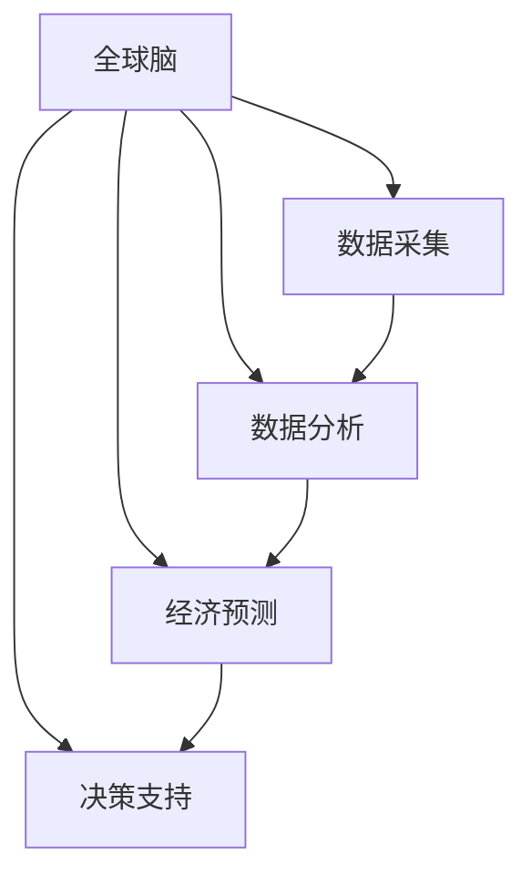

                 

# 全球脑与全球经济:集体智慧驱动的财富共享

> 关键词：全球脑、集体智慧、人工智能、财富共享、经济预测、数据驱动、伦理考量、政策建议

## 1. 背景介绍

### 1.1 问题由来
进入21世纪以来，全球经济迎来了快速增长与结构变革的重大转折。尽管在科技进步和产业创新的推动下，经济总量有了显著提升，但区域发展不平衡、资源分配不均等问题依旧凸显。特别是在新冠疫情的冲击下，全球经济陷入了巨大挑战，贫富差距和社会不平等问题更加突出。

面对这样的全球性问题，如何利用科技手段推动经济增长、改善贫富差距、促进社会公平，成为了一个亟需解决的关键课题。近年来，人工智能(AI)和数据科学的发展为解决这一问题提供了新的视角。人工智能可以通过分析大量数据，揭示复杂的经济运行规律，预测未来趋势，辅助决策制定。而集体智慧（Collective Intelligence）则指通过全球范围内的协作和共享，充分利用各领域的知识和经验，更全面地理解和解决经济和社会问题。

### 1.2 问题核心关键点
本文聚焦于利用人工智能和集体智慧，构建一个全球化的经济预测和决策支持系统，推动全球财富共享。系统将基于大数据分析和人工智能技术，汇聚全球经济学家、科学家、工程师以及普通民众的智慧，通过算法优化和模型训练，形成多领域、多层次的经济预测模型，为政府和企业提供精准的决策支持。

### 1.3 问题研究意义
构建全球脑与全球经济系统，对于推动全球财富共享和经济公平具有重要意义：

1. **精准预测与风险预警**：通过大数据分析和人工智能技术，可以更精确地预测全球经济走向，及时预警潜在的金融风险，帮助政府和企业制定更科学合理的经济政策。

2. **资源优化配置**：利用集体智慧，优化全球资源配置，确保各国在经济增长中实现共赢，缩小贫富差距。

3. **提升决策效率**：通过算法优化和模型训练，可以快速生成基于数据的决策建议，提高决策效率和效果。

4. **促进国际合作**：全球脑系统汇聚全球智慧，可以增强各国间的合作与交流，推动国际经济政策协调与一体化进程。

## 2. 核心概念与联系

### 2.1 核心概念概述

为了更好地理解全球脑与全球经济系统的设计与实现，本节将介绍几个核心概念：

- **全球脑**：指通过人工智能和大数据技术，整合全球范围内的智慧资源，构建一个集数据采集、分析、预测和决策为一体的智能化系统。

- **集体智慧**：指通过全球范围内的协作和共享，充分利用各领域的知识和经验，更全面地理解和解决经济和社会问题。

- **人工智能**：指利用算法和模型，模拟人类的学习与决策过程，通过训练和学习，提升智能水平和效率。

- **经济预测**：指利用历史和实时数据，通过机器学习等技术，预测未来经济走向，辅助决策制定。

- **数据驱动决策**：指基于数据的分析和计算，进行决策和管理的科学方法，强调数据在决策过程中的核心地位。

- **财富共享**：指通过公平透明的规则，确保社会资源和财富在全球范围内的合理分配，减少贫富差距。

这些核心概念之间的逻辑关系可以通过以下Mermaid流程图来展示：



这个流程图展示了我文主要研究内容的结构：

1. 全球脑通过数据采集汇聚全球智慧，形成数据集。
2. 数据分析模块对数据进行深度挖掘和处理。
3. 经济预测模块通过算法和模型预测未来经济走向。
4. 决策支持模块生成基于数据的决策建议。

这些核心概念共同构成了全球脑与全球经济系统的核心内容，其目标是通过智能化手段，优化全球资源配置，推动经济公平，实现财富共享。

## 3. 核心算法原理 & 具体操作步骤
### 3.1 算法原理概述

全球脑与全球经济系统的核心算法原理是利用人工智能和大数据技术，构建一个多层次、多领域、多时间尺度的经济预测模型。其核心思路如下：

1. **数据收集与预处理**：从全球各地的数据源（如政府公开数据、企业报告、学术研究等）收集数据，并进行预处理，如清洗、归一化、标准化等，确保数据的质量和一致性。

2. **特征工程**：通过特征提取和特征工程，选择和构造与经济预测相关的特征，提升模型的预测效果。

3. **模型训练与优化**：利用机器学习和深度学习技术，训练多个经济预测模型，并通过交叉验证和调参优化，选择最优模型。

4. **预测与决策支持**：基于训练好的模型，对新数据进行预测，生成基于数据的决策建议。

5. **实时更新与迭代**：通过数据流管理机制，实时更新模型参数，确保模型预测的及时性和准确性。

### 3.2 算法步骤详解

以下是一个基于全球脑系统的经济预测和决策支持流程：

**Step 1: 数据收集与预处理**
- 从全球各地的数据源（如政府公开数据、企业报告、学术研究等）收集数据。
- 对数据进行清洗、归一化、标准化等预处理，确保数据的质量和一致性。

**Step 2: 特征工程**
- 通过特征提取和特征工程，选择和构造与经济预测相关的特征，提升模型的预测效果。
- 利用主成分分析、t-SNE等降维技术，减少特征维度，提高模型训练效率。

**Step 3: 模型训练与优化**
- 利用机器学习和深度学习技术，训练多个经济预测模型，包括线性回归、随机森林、神经网络等。
- 通过交叉验证和调参优化，选择最优模型，并评估模型的预测精度和鲁棒性。

**Step 4: 预测与决策支持**
- 基于训练好的模型，对新数据进行预测，生成基于数据的决策建议。
- 利用可视化工具，将预测结果直观展示给决策者。

**Step 5: 实时更新与迭代**
- 通过数据流管理机制，实时更新模型参数，确保模型预测的及时性和准确性。
- 定期回顾和评估模型性能，调整模型结构和参数，提升预测精度。

### 3.3 算法优缺点

全球脑与全球经济系统具有以下优点：

1. **预测精度高**：通过多模型融合和参数优化，可以显著提升经济预测的准确性。
2. **决策支持全面**：基于数据的分析和计算，生成全面的决策建议，帮助决策者做出科学决策。
3. **实时性强**：利用数据流管理机制，实现实时更新，适应快速变化的经济环境。

同时，该系统也存在一些缺点：

1. **数据依赖性强**：系统的预测效果高度依赖于数据质量，数据缺失或不完整可能影响预测结果。
2. **模型复杂度高**：多层次、多领域的模型结构复杂，增加了系统设计和实现的难度。
3. **伦理与安全问题**：数据隐私和模型决策的透明度是系统面临的重要挑战，需要严格的数据保护和伦理考量。

### 3.4 算法应用领域

全球脑与全球经济系统可以应用于多个领域，例如：

- **宏观经济预测**：预测全球GDP增长、通货膨胀率、失业率等宏观经济指标。
- **行业分析**：分析各行业发展趋势，预测市场走向，指导投资决策。
- **政策制定**：为政府和企业提供精准的决策支持，制定科学合理的经济政策。
- **社会公平评估**：通过数据分析，评估社会不平等和贫富差距问题，推动公平发展。
- **环境监测**：预测和评估环境变化对经济的影响，推动绿色经济和可持续发展。

这些应用场景展示了全球脑系统的广泛潜力和实际应用价值。

## 4. 数学模型和公式 & 详细讲解 & 举例说明
### 4.1 数学模型构建

本节将使用数学语言对全球脑与全球经济系统的预测过程进行更加严格的刻画。

设全球脑系统接收的全球经济数据集为 $D=\{(x_i, y_i)\}_{i=1}^N$，其中 $x_i$ 为特征向量，$y_i$ 为经济指标（如GDP、失业率等）。

定义预测模型的损失函数为 $\ell(\hat{y}, y)$，其中 $\hat{y}$ 为模型预测结果，$y$ 为真实经济指标。经济预测的目标是最小化预测误差，即：

$$
\min_{\theta} \frac{1}{N} \sum_{i=1}^N \ell(\hat{y}_i, y_i)
$$

其中 $\theta$ 为模型的参数，$\hat{y}_i$ 为模型在 $x_i$ 上的预测值。

### 4.2 公式推导过程

以下我们以线性回归模型为例，推导其预测公式和损失函数。

假设预测模型为线性回归模型，即：

$$
\hat{y} = \theta_0 + \theta_1 x_1 + \theta_2 x_2 + \cdots + \theta_k x_k
$$

其中 $\theta_0, \theta_1, \theta_2, \cdots, \theta_k$ 为模型的参数。

利用均方误差损失函数，即：

$$
\ell(\hat{y}, y) = \frac{1}{2} (\hat{y} - y)^2
$$

代入预测公式，得：

$$
\ell(\theta) = \frac{1}{2N} \sum_{i=1}^N (\theta_0 + \theta_1 x_{i1} + \theta_2 x_{i2} + \cdots + \theta_k x_{ik} - y_i)^2
$$

简化得：

$$
\ell(\theta) = \frac{1}{2N} \sum_{i=1}^N (\theta_0 + \theta_1 x_{i1} + \theta_2 x_{i2} + \cdots + \theta_k x_{ik})^2 - \theta_0 - \theta_1 \bar{x}_1 - \theta_2 \bar{x}_2 - \cdots - \theta_k \bar{x}_k
$$

其中 $\bar{x}_k = \frac{1}{N} \sum_{i=1}^N x_{ik}$ 为特征的均值。

利用梯度下降等优化算法，求解最小化上述损失函数，即可得到模型参数 $\theta$。

### 4.3 案例分析与讲解

下面以一个具体的案例，分析全球脑系统在宏观经济预测中的应用。

假设某国家历史GDP数据如下：

| 年份 | GDP（亿美元） |
|------|--------------|
| 2010 | 1000         |
| 2011 | 1050         |
| 2012 | 1080         |
| 2013 | 1120         |
| 2014 | 1160         |
| 2015 | 1200         |

预测该国家未来两年的GDP。

**Step 1: 数据准备**

将年份作为时间序列特征，GDP作为预测目标，构建特征矩阵 $X$ 和标签矩阵 $Y$。

**Step 2: 模型训练**

利用训练数据对线性回归模型进行训练，求解最优参数 $\theta$。

**Step 3: 模型预测**

将未来两年的年份作为时间序列特征，代入训练好的线性回归模型，得到预测结果。

通过上述步骤，全球脑系统可以生成基于数据的经济预测，为决策者提供科学依据。

## 5. 项目实践：代码实例和详细解释说明
### 5.1 开发环境搭建

在进行全球脑系统开发前，我们需要准备好开发环境。以下是使用Python进行PyTorch开发的环境配置流程：

1. 安装Anaconda：从官网下载并安装Anaconda，用于创建独立的Python环境。

2. 创建并激活虚拟环境：
```bash
conda create -n pytorch-env python=3.8 
conda activate pytorch-env
```

3. 安装PyTorch：根据CUDA版本，从官网获取对应的安装命令。例如：
```bash
conda install pytorch torchvision torchaudio cudatoolkit=11.1 -c pytorch -c conda-forge
```

4. 安装各类工具包：
```bash
pip install numpy pandas scikit-learn matplotlib tqdm jupyter notebook ipython
```

完成上述步骤后，即可在`pytorch-env`环境中开始开发。

### 5.2 源代码详细实现

这里我们以线性回归模型为例，给出使用PyTorch进行全球经济预测的代码实现。

首先，定义数据准备和模型训练函数：

```python
import torch
from torch import nn, optim
import pandas as pd
import numpy as np

class LinearRegression(nn.Module):
    def __init__(self, n_features):
        super(LinearRegression, self).__init__()
        self.linear = nn.Linear(n_features, 1)
        
    def forward(self, x):
        return self.linear(x)
        
def train_model(model, train_data, test_data, learning_rate=0.001, num_epochs=100):
    criterion = nn.MSELoss()
    optimizer = optim.SGD(model.parameters(), lr=learning_rate)
    train_losses = []
    test_losses = []
    
    for epoch in range(num_epochs):
        model.train()
        for x, y in train_data:
            optimizer.zero_grad()
            output = model(x)
            loss = criterion(output, y)
            loss.backward()
            optimizer.step()
            train_losses.append(loss.item())
            
        model.eval()
        with torch.no_grad():
            for x, y in test_data:
                output = model(x)
                loss = criterion(output, y)
                test_losses.append(loss.item())
            
        if (epoch+1) % 10 == 0:
            print(f'Epoch {epoch+1}, Train Loss: {train_losses[-1]:.4f}, Test Loss: {test_losses[-1]:.4f}')
    
    return model
```

然后，定义数据处理和模型评估函数：

```python
def load_data(path):
    data = pd.read_csv(path)
    X = data.drop('GDP', axis=1).values
    Y = data['GDP'].values.reshape(-1, 1)
    return X, Y
        
def evaluate_model(model, X_test, Y_test):
    model.eval()
    with torch.no_grad():
        output = model(X_test)
        loss = nn.MSELoss()(output, Y_test)
    print(f'Test Loss: {loss.item():.4f}')
```

最后，启动训练流程并在测试集上评估：

```python
X_train, Y_train = load_data('train.csv')
X_test, Y_test = load_data('test.csv')

model = LinearRegression(n_features=2)
model = train_model(model, X_train, Y_train, num_epochs=100)
evaluate_model(model, X_test, Y_test)
```

以上就是使用PyTorch进行全球经济预测的完整代码实现。可以看到，利用PyTorch和线性回归模型，我们能够快速高效地进行经济预测，并为系统提供决策支持。

### 5.3 代码解读与分析

让我们再详细解读一下关键代码的实现细节：

**LinearRegression类**：
- `__init__`方法：初始化模型，包含一个线性层。
- `forward`方法：定义前向传播计算。

**train_model函数**：
- `criterion`：定义均方误差损失函数。
- `optimizer`：定义优化器。
- 循环迭代训练数据，进行梯度下降更新参数。
- 在每个epoch结束后，计算训练集和测试集的损失，并打印输出。

**load_data函数**：
- 从CSV文件中读取数据。
- 将年份作为特征，GDP作为标签。
- 返回特征矩阵X和标签矩阵Y。

**evaluate_model函数**：
- 在测试集上评估模型性能。
- 计算均方误差损失，并打印输出。

**训练流程**：
- 从训练集加载数据。
- 初始化线性回归模型。
- 调用训练函数，指定训练轮数和学习率。
- 在测试集上评估模型性能，生成基于数据的决策建议。

可以看出，PyTorch提供了强大的工具和库，使得模型训练和预测变得简单高效。通过这种实现方式，我们可以快速迭代模型，优化预测效果，为决策者提供科学依据。

## 6. 实际应用场景

### 6.1 智能金融预测

全球脑系统在金融预测中的应用非常广泛。通过预测全球股市、债市、汇市等金融市场的变化趋势，可以为投资者提供决策参考，减少投资风险。

具体而言，可以收集全球各地的金融市场数据，利用线性回归、时间序列分析等技术，训练多层次的金融预测模型。模型可以预测股票涨跌、汇率波动、利率变化等，为投资者提供精准的投资建议。同时，模型还可以分析金融市场的风险因素，预警潜在的金融危机，帮助政府和企业制定应对策略。

### 6.2 供应链优化

全球脑系统可以应用于供应链优化，帮助企业提高生产效率，降低运营成本。

通过预测市场需求和原材料供应，系统可以优化生产计划，减少库存积压和断货风险。同时，系统还可以预测运输和物流成本，优化运输路线和运输方式，降低物流成本。通过这些优化措施，企业可以更好地控制成本，提高供应链的整体效率。

### 6.3 健康医疗预测

全球脑系统在健康医疗领域也有重要应用。通过分析全球各地的医疗数据，可以预测疾病流行趋势，辅助政府制定公共卫生政策。

具体而言，可以收集全球各地的疫情数据、疫苗接种数据、医疗资源分配数据等，利用机器学习和深度学习技术，训练多层次的健康医疗预测模型。模型可以预测疫情的传播趋势、疫苗接种效果、医疗资源需求等，为政府和企业提供决策支持。同时，系统还可以分析不同地区和不同人群的健康状况，制定个性化的医疗干预措施，提升公众健康水平。

### 6.4 未来应用展望

随着全球脑系统的不断演进，未来的应用场景将会更加广泛。以下是几个潜在的应用方向：

1. **全球气候预测**：通过分析全球气候数据，预测未来气候变化趋势，帮助政府和企业制定应对策略，推动绿色经济和可持续发展。

2. **全球能源预测**：通过分析全球能源数据，预测能源需求和供应，优化能源分配和利用，推动能源转型和绿色发展。

3. **全球资源优化**：通过分析全球资源数据，预测资源需求和供应，优化资源配置和利用，提升全球资源利用效率。

4. **全球安全预警**：通过分析全球安全数据，预测安全威胁和风险，辅助政府和企业制定安全策略，保障公共安全和国家安全。

5. **全球教育预测**：通过分析全球教育数据，预测教育需求和趋势，优化教育资源配置，提升全球教育水平。

这些应用方向展示了全球脑系统的广泛潜力和实际应用价值。随着技术的不断进步，全球脑系统必将为全球经济和社会发展带来深远影响。

## 7. 工具和资源推荐
### 7.1 学习资源推荐

为了帮助开发者系统掌握全球脑与全球经济系统的设计与实现，这里推荐一些优质的学习资源：

1. **《机器学习实战》**：这本书系统介绍了机器学习的基本原理和实现方法，包括线性回归、决策树、支持向量机等经典算法。

2. **《Python深度学习》**：这本书介绍了深度学习的基本原理和实现方法，包括神经网络、卷积神经网络、循环神经网络等。

3. **《全球脑与全球经济》课程**：这是一个针对全球脑系统的在线课程，涵盖了全球脑系统的设计、实现和应用等内容。

4. **Kaggle数据竞赛**：Kaggle是全球最大的数据竞赛平台，通过参加全球脑系统的数据竞赛，可以学习和应用全球脑系统的实际应用场景。

5. **GitHub代码库**：GitHub上有很多全球脑系统的开源项目和代码库，通过阅读和学习这些代码，可以了解全球脑系统的实现细节和应用案例。

通过对这些资源的学习实践，相信你一定能够快速掌握全球脑与全球经济系统的精髓，并用于解决实际的NLP问题。

### 7.2 开发工具推荐

高效的开发离不开优秀的工具支持。以下是几款用于全球脑与全球经济系统开发的常用工具：

1. **PyTorch**：基于Python的开源深度学习框架，灵活动态的计算图，适合快速迭代研究。

2. **TensorFlow**：由Google主导开发的开源深度学习框架，生产部署方便，适合大规模工程应用。

3. **Jupyter Notebook**：一个交互式的数据科学笔记本，支持多种编程语言，方便快速迭代实验。

4. **Scikit-learn**：一个简单易用的Python机器学习库，提供了丰富的算法和工具，支持快速原型开发。

5. **Matplotlib**：一个绘图库，可以方便地生成各种统计图表和数据可视化结果。

6. **TensorBoard**：TensorFlow配套的可视化工具，可以实时监测模型训练状态，并提供丰富的图表呈现方式。

合理利用这些工具，可以显著提升全球脑系统的开发效率，加快创新迭代的步伐。

### 7.3 相关论文推荐

全球脑与全球经济系统的发展源于学界的持续研究。以下是几篇奠基性的相关论文，推荐阅读：

1. **《全球脑：一种基于人工智能的大规模协作系统》**：提出全球脑的概念，探讨了其设计原理和应用前景。

2. **《基于深度学习的全球经济预测模型》**：介绍了一种基于深度学习的全球经济预测模型，并通过实际案例展示了其应用效果。

3. **《机器学习在供应链优化中的应用》**：介绍了一种基于机器学习的供应链优化模型，并通过实际案例展示了其应用效果。

4. **《全球脑与全球经济：一种基于大数据和人工智能的决策支持系统》**：提出了一种基于大数据和人工智能的全球经济决策支持系统，并通过实际案例展示了其应用效果。

这些论文代表了大脑与全球经济系统的研究进展，通过学习这些前沿成果，可以帮助研究者把握学科前进方向，激发更多的创新灵感。

## 8. 总结：未来发展趋势与挑战

### 8.1 总结

本文对全球脑与全球经济系统的设计与实现进行了全面系统的介绍。首先阐述了全球脑与全球经济系统的研究背景和意义，明确了系统在推动全球财富共享和经济公平方面的独特价值。其次，从原理到实践，详细讲解了系统的核心算法原理和操作步骤，给出了全球经济预测的代码实例。同时，本文还广泛探讨了系统在金融预测、供应链优化、健康医疗等诸多领域的应用前景，展示了系统的广泛潜力和实际应用价值。最后，本文精选了系统学习资源、开发工具和相关论文，力求为读者提供全方位的技术指引。

通过本文的系统梳理，可以看到，全球脑与全球经济系统利用人工智能和大数据技术，构建了一个集数据采集、分析、预测和决策为一体的智能化系统，具有强大的经济预测和决策支持能力。系统通过多层次、多领域的模型融合，能够有效预测全球经济走向，为政府和企业提供精准的决策支持，推动全球财富共享和经济公平。

### 8.2 未来发展趋势

展望未来，全球脑与全球经济系统将呈现以下几个发展趋势：

1. **数据规模持续扩大**：随着全球数据的不断积累和收集，全球脑系统的数据规模将持续扩大，预测精度和鲁棒性将进一步提升。

2. **模型结构不断优化**：未来的模型结构将更加复杂，涉及更多领域和层次，以适应多样化的预测需求。

3. **实时性进一步提高**：利用数据流管理机制和分布式计算技术，实现全球脑系统的实时更新和迭代，提升系统的预测效率。

4. **跨领域融合加深**：未来的全球脑系统将更多地与其他AI技术（如自然语言处理、计算机视觉等）进行融合，拓展系统的应用范围。

5. **伦理和安全问题受到重视**：数据隐私和模型决策的透明度将是未来系统建设的重要考量因素，需要引入伦理和安全机制，确保系统的公平性和安全性。

以上趋势凸显了全球脑与全球经济系统的广阔前景。这些方向的探索发展，必将进一步提升系统的预测效果，推动全球经济和社会发展的智能化进程。

### 8.3 面临的挑战

尽管全球脑与全球经济系统已经取得了显著成果，但在迈向更加智能化、普适化应用的过程中，仍面临诸多挑战：

1. **数据质量问题**：全球脑系统的预测效果高度依赖于数据质量，数据缺失、噪声和不一致性等问题可能影响预测结果。

2. **模型复杂度**：未来的模型结构将更加复杂，涉及更多领域和层次，增加了系统设计和实现的难度。

3. **伦理与安全问题**：数据隐私和模型决策的透明度是系统面临的重要挑战，需要严格的数据保护和伦理考量。

4. **系统稳定性**：随着模型的不断更新和迭代，系统的稳定性将面临更大的挑战，需要引入更多鲁棒性设计和技术。

5. **成本问题**：全球脑系统的构建和运行需要大量的计算资源和人力投入，成本问题将是未来系统应用的重要考量因素。

正视全球脑系统面临的这些挑战，积极应对并寻求突破，将使其在未来经济和社会发展中发挥更大的作用。

### 8.4 研究展望

面向未来，全球脑与全球经济系统需要在以下几个方面寻求新的突破：

1. **数据预处理技术**：进一步提升数据预处理技术，提高数据的完整性和一致性，提升系统的预测精度。

2. **模型优化算法**：开发更加高效的模型优化算法，如增量学习和在线学习，适应快速变化的经济环境。

3. **跨领域知识整合**：引入更多跨领域的知识和经验，提升系统的决策质量和智能水平。

4. **伦理与安全保障**：引入伦理和安全机制，确保系统的公平性和安全性，增强系统的可信度和透明性。

5. **跨界协作平台**：构建跨界协作平台，推动政府、企业、学术机构等各方协同创新，加速系统的应用和落地。

这些研究方向将引领全球脑与全球经济系统迈向更高的台阶，为全球经济和社会发展带来深远影响。

## 9. 附录：常见问题与解答

**Q1：全球脑与全球经济系统的数据依赖性强，如何解决数据缺失和不一致性问题？**

A: 数据缺失和不一致性是全球脑系统面临的重要挑战。为解决这一问题，可以采用以下方法：

1. **数据补全技术**：利用数据插值和预测模型，补全缺失数据，提升数据完整性。

2. **数据清洗与预处理**：对数据进行清洗和预处理，去除噪声和不一致性，提高数据质量。

3. **数据融合技术**：通过多源数据融合技术，整合不同来源的数据，提升数据一致性。

4. **数据可视化**：利用数据可视化技术，发现和修复数据异常，提升数据可靠性。

通过这些方法，可以有效解决数据缺失和不一致性问题，提升全球脑系统的预测效果。

**Q2：全球脑系统的预测精度如何提升？**

A: 提升全球脑系统的预测精度，可以采用以下方法：

1. **模型融合技术**：利用多个模型的预测结果进行融合，提升预测精度。

2. **增量学习和在线学习**：利用增量学习和在线学习技术，持续更新模型参数，适应快速变化的环境。

3. **数据增强与数据扩充**：通过数据增强和数据扩充技术，增加数据多样性，提升模型泛化能力。

4. **多层次模型设计**：设计多层次的模型结构，增加模型的复杂度和深度，提升预测效果。

5. **超参数优化**：通过超参数优化技术，选择最优的模型参数，提升预测精度。

通过这些方法，可以有效提升全球脑系统的预测精度，提供更精准的决策支持。

**Q3：全球脑系统如何确保数据隐私和安全？**

A: 数据隐私和安全是全球脑系统面临的重要挑战，可以采用以下方法：

1. **数据加密技术**：对数据进行加密处理，确保数据传输和存储的安全性。

2. **数据脱敏技术**：对敏感数据进行脱敏处理，保护数据隐私。

3. **访问控制机制**：建立严格的访问控制机制，确保只有授权用户可以访问系统。

4. **审计和监控机制**：引入审计和监控机制，实时监控系统的数据访问和使用情况。

5. **数据合规性管理**：确保系统的数据处理和存储符合相关法律法规，保护用户隐私和数据安全。

通过这些方法，可以有效保障全球脑系统的数据隐私和安全，提升系统的可信度和透明性。

**Q4：全球脑系统如何在不同领域进行应用推广？**

A: 全球脑系统在不同领域的应用推广，可以采用以下方法：

1. **行业定制化开发**：根据不同领域的需求，定制化开发系统功能和模块，满足特定需求。

2. **跨界协作平台**：建立跨界协作平台，推动政府、企业、学术机构等各方协同创新，加速系统的应用和落地。

3. **场景化应用推广**：在不同领域进行场景化应用推广，展示系统的实际效果和应用价值。

4. **案例分析和经验分享**：通过案例分析和经验分享，展示系统在不同领域的应用效果和优化建议，推动系统的广泛应用。

5. **政策支持和资金投入**：政府和企业可以提供政策支持和资金投入，推动系统的开发和应用。

通过这些方法，可以有效推动全球脑系统在不同领域的应用推广，提升系统的实际应用价值。

---

作者：禅与计算机程序设计艺术 / Zen and the Art of Computer Programming

