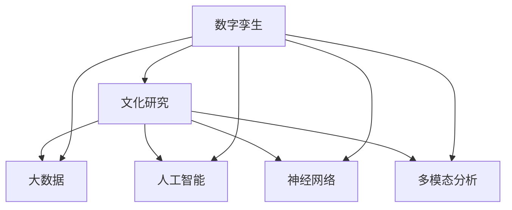

                 

# 全球脑与全球脑:数字孪生技术在文化研究中的应用

> 关键词：数字孪生,文化研究,大数据,人工智能,神经网络,多模态分析

## 1. 背景介绍

### 1.1 问题由来
随着数字化进程的加速，全球范围内的数字文化资源快速增长，产生了海量的数字文本、图像、视频、音频等多模态数据。这些数据不仅是文化遗产的重要组成部分，也是研究人类历史、文化和社会演变的重要资源。然而，如此庞大数据集的存储、管理和分析，对传统的研究方法构成了巨大挑战。

数字孪生（Digital Twin）技术，作为一种新型的数字化建模方法，能够为复杂系统的虚拟仿真提供精确的映射和预测能力。将其应用于文化研究，可以为文化遗产的保护、传承与创新提供全新的视角和工具。

### 1.2 问题核心关键点
数字孪生技术通过创建数字模型，将现实世界与虚拟世界紧密结合，支持复杂系统的可视化、仿真和优化。具体到文化研究领域，可以实时监测文化遗产的物理状态，预测环境因素对文化产品的影响，以及模拟文化遗产在不同历史阶段的演变。

本研究聚焦于数字孪生技术在文化研究中的应用，从多个维度探索如何通过数字孪生模型，更深入地理解文化的内在结构和演化规律。

## 2. 核心概念与联系

### 2.1 核心概念概述

为更好地理解数字孪生技术在文化研究中的应用，本节将介绍几个密切相关的核心概念：

- 数字孪生（Digital Twin）：基于物理与数字模型的双向连接技术，通过虚拟仿真和反馈控制，实现物理系统的数字化、可视化和管理。

- 文化研究（Cultural Research）：通过多学科交叉方法，研究人类历史、社会、艺术等文化现象，揭示其背后的规律和意义。

- 大数据（Big Data）：规模巨大、类型多样的数据集，需要复杂的数据处理和分析技术，以揭示数据背后的模式和趋势。

- 人工智能（AI）：通过机器学习、深度学习等技术，使机器具有类似于人类的感知、学习和决策能力。

- 神经网络（Neural Network）：由大量神经元互连组成的计算模型，用于处理复杂的数据和模式识别问题。

- 多模态分析（Multi-modal Analysis）：利用多种数据源（如图像、文本、语音）综合分析，提升对复杂系统的理解能力。

这些核心概念之间的逻辑关系可以通过以下Mermaid流程图来展示：



这个流程图展示了大数据、人工智能、神经网络和多模态分析等核心概念是如何通过数字孪生技术应用于文化研究过程的。

## 3. 核心算法原理 & 具体操作步骤

### 3.1 算法原理概述

数字孪生技术在文化研究中的应用，主要是通过构建虚拟仿真模型，实时映射和预测物理系统的行为。其核心算法原理如下：

- **数据采集与预处理**：从物理系统采集传感器数据，并进行数据清洗、归一化等预处理，以提高后续分析的准确性。

- **模型构建与仿真**：基于采集到的数据，构建物理系统的数字模型，利用神经网络等算法对模型进行仿真训练，建立物理系统与数字模型之间的映射关系。

- **仿真验证与优化**：对数字模型进行验证和优化，确保其能够精确反映物理系统的行为。

- **反馈控制与预测**：利用数字模型对物理系统进行实时监测和反馈控制，预测未来变化趋势，指导文化保护和创新。

### 3.2 算法步骤详解

数字孪生技术在文化研究中的应用步骤，具体如下：

**Step 1: 数据采集与预处理**
- 收集文化研究所需的各类数据，包括文本、图像、视频、音频等多模态数据。
- 对数据进行清洗、去重、归一化等预处理，确保数据质量。

**Step 2: 模型构建与仿真**
- 选择合适的神经网络架构，如卷积神经网络（CNN）、循环神经网络（RNN）、生成对抗网络（GAN）等。
- 利用训练数据对模型进行训练，确保模型能够准确映射物理系统的行为。
- 对模型进行仿真验证，调整参数和架构，提高仿真精度。

**Step 3: 仿真验证与优化**
- 对数字模型进行仿真验证，通过与实际物理系统对比，调整模型参数和结构，优化仿真效果。
- 利用仿真数据，对物理系统的行为进行预测和优化，指导文化遗产的保护和创新。

**Step 4: 反馈控制与预测**
- 通过数字模型实时监测物理系统的状态，对环境因素进行预测和预警。
- 利用仿真结果，优化文化遗产的展示和保护方案，提升其利用价值。

### 3.3 算法优缺点

数字孪生技术在文化研究中的应用具有以下优点：

- **高精度仿真**：数字孪生模型能够实现高精度的仿真和预测，提供对物理系统的精确映射。
- **实时监测与控制**：通过实时监测和反馈控制，能够及时发现并解决文化遗产保护中的问题。
- **跨学科整合**：利用多学科交叉方法，综合考虑物理、历史、艺术等多方面的因素，提升研究深度和广度。
- **数据驱动决策**：基于大数据分析，提供科学决策依据，优化文化遗产保护和创新的方案。

同时，该技术也存在以下局限性：

- **数据依赖性强**：数字孪生模型的精度和效果高度依赖于数据的质量和数量，获取高质量数据需要较高的成本。
- **模型复杂度高**：构建高精度的数字孪生模型需要复杂的算法和大量计算资源，技术门槛较高。
- **更新与维护难度大**：数字孪生模型需要定期更新和维护，以保持其仿真精度和实时性。

### 3.4 算法应用领域

数字孪生技术在文化研究中的应用领域广泛，涵盖了文化遗产保护、历史研究、艺术创作等多个方面。具体如下：

- **文化遗产保护**：通过数字孪生模型，实时监测文化遗产的物理状态，预测环境因素对文化产品的影响，指导文化遗产的保护和修复。

- **历史研究**：利用数字孪生技术，模拟历史文化场景，探索历史事件的发展过程，揭示其背后的规律和意义。

- **艺术创作**：基于数字孪生模型，创新性地创作艺术作品，提升艺术创作的效率和创新性。

- **社会研究**：利用数字孪生技术，分析社会文化的演变规律，预测未来发展趋势，为政策制定提供科学依据。

## 4. 数学模型和公式 & 详细讲解 & 举例说明

### 4.1 数学模型构建

本节将使用数学语言对数字孪生技术在文化研究中的应用进行严格的建模和推导。

记数字孪生模型为 $M_{\theta}(x)$，其中 $\theta$ 为模型参数，$x$ 为输入数据。假设文化研究数据集为 $D=\{(x_i,y_i)\}_{i=1}^N$，其中 $x_i$ 为输入数据，$y_i$ 为输出结果。

定义数字孪生模型的损失函数为：

$$
\mathcal{L}(\theta) = \frac{1}{N} \sum_{i=1}^N \|y_i - M_{\theta}(x_i)\|^2
$$

其中 $\| \cdot \|$ 表示范数，用于衡量模型预测值与真实值之间的差异。

微调的优化目标是最小化损失函数，即找到最优参数：

$$
\theta^* = \mathop{\arg\min}_{\theta} \mathcal{L}(\theta)
$$

在实践中，我们通常使用梯度下降等优化算法来近似求解上述最优化问题。设 $\eta$ 为学习率，则参数的更新公式为：

$$
\theta \leftarrow \theta - \eta \nabla_{\theta}\mathcal{L}(\theta)
$$

其中 $\nabla_{\theta}\mathcal{L}(\theta)$ 为损失函数对参数 $\theta$ 的梯度，可通过反向传播算法高效计算。

### 4.2 公式推导过程

以下我们以多模态文化数据的数字孪生建模为例，推导数字孪生模型的损失函数及其梯度的计算公式。

假设文化数据集包含文本数据 $x_t$ 和图像数据 $x_i$，分别通过不同的神经网络进行处理。文本数据通过循环神经网络（RNN）处理，图像数据通过卷积神经网络（CNN）处理，输出结果分别为 $y_t$ 和 $y_i$。

定义文本和图像数据的损失函数分别为：

$$
\mathcal{L}_t(\theta_t) = \frac{1}{N} \sum_{i=1}^N \|y_t - M_{\theta_t}(x_t)\|^2
$$

$$
\mathcal{L}_i(\theta_i) = \frac{1}{N} \sum_{j=1}^N \|y_i - M_{\theta_i}(x_i)\|^2
$$

将两者合并为整体损失函数：

$$
\mathcal{L}(\theta) = \mathcal{L}_t(\theta_t) + \mathcal{L}_i(\theta_i)
$$

根据链式法则，损失函数对参数 $\theta_t$ 和 $\theta_i$ 的梯度分别为：

$$
\frac{\partial \mathcal{L}(\theta)}{\partial \theta_t} = \frac{1}{N} \sum_{i=1}^N 2(\frac{\partial \mathcal{L}_t(\theta_t)}{\partial \theta_t} + \frac{\partial \mathcal{L}_i(\theta_i)}{\partial \theta_t})
$$

$$
\frac{\partial \mathcal{L}(\theta)}{\partial \theta_i} = \frac{1}{N} \sum_{j=1}^N 2(\frac{\partial \mathcal{L}_t(\theta_t)}{\partial \theta_i} + \frac{\partial \mathcal{L}_i(\theta_i)}{\partial \theta_i})
$$

在得到损失函数的梯度后，即可带入参数更新公式，完成模型的迭代优化。重复上述过程直至收敛，最终得到适应文化研究任务的数字孪生模型。

### 4.3 案例分析与讲解

以下我们以文化遗产保护的案例，分析数字孪生模型的实际应用。

**案例背景**：某博物馆收藏有一件珍贵的历史文物，存在氧化、腐蚀等问题，急需对其状态进行实时监测和预测，以指导保护和修复工作。

**数据准备**：收集文物的高清图像、化学成分、环境监测数据等。

**模型构建**：利用卷积神经网络（CNN）和循环神经网络（RNN），分别处理图像和文本数据，构建数字孪生模型。

**仿真验证**：将模型应用于文物图像和文本数据的仿真，验证模型的准确性和可靠性。

**仿真预测**：通过数字孪生模型实时监测文物状态，预测氧化、腐蚀等环境因素的影响，及时预警和调整保护措施。

通过数字孪生技术，博物馆能够在不必破坏文物的前提下，实现对其状态的实时监测和预测，确保文物的安全与完整。

## 5. 项目实践：代码实例和详细解释说明

### 5.1 开发环境搭建

在进行数字孪生模型应用前，我们需要准备好开发环境。以下是使用Python进行PyTorch开发的环境配置流程：

1. 安装Anaconda：从官网下载并安装Anaconda，用于创建独立的Python环境。

2. 创建并激活虚拟环境：
```bash
conda create -n twin-env python=3.8 
conda activate twin-env
```

3. 安装PyTorch：根据CUDA版本，从官网获取对应的安装命令。例如：
```bash
conda install pytorch torchvision torchaudio cudatoolkit=11.1 -c pytorch -c conda-forge
```

4. 安装TensorFlow：
```bash
conda install tensorflow
```

5. 安装各类工具包：
```bash
pip install numpy pandas scikit-learn matplotlib tqdm jupyter notebook ipython
```

完成上述步骤后，即可在`twin-env`环境中开始数字孪生模型的实践。

### 5.2 源代码详细实现

这里我们以文化遗产保护的案例为例，给出使用PyTorch进行数字孪生建模的代码实现。

首先，定义数据处理函数：

```python
import torch
import torch.nn as nn
import torch.optim as optim

from torch.utils.data import Dataset, DataLoader
from torchvision import transforms
from torchvision.models import resnet50
from torchtext.datasets import text_classification
from torchtext.data import Field, BucketIterator

class CulturalData(Dataset):
    def __init__(self, images, texts, transforms=None):
        self.images = images
        self.texts = texts
        self.transforms = transforms
        
    def __len__(self):
        return len(self.images)
    
    def __getitem__(self, idx):
        image = self.images[idx]
        text = self.texts[idx]
        
        if self.transforms:
            image = self.transforms(image)
            
        return {'image': image, 'text': text}

# 定义数据转换函数
transforms = transforms.Compose([
    transforms.ToTensor(),
    transforms.Normalize((0.5, 0.5, 0.5), (0.5, 0.5, 0.5))
])
```

然后，定义模型和优化器：

```python
# 定义文本分类模型
class TextClassifier(nn.Module):
    def __init__(self, vocab_size, embedding_dim, hidden_dim, output_dim):
        super(TextClassifier, self).__init__()
        self.embedding = nn.Embedding(vocab_size, embedding_dim)
        self.rnn = nn.LSTM(embedding_dim, hidden_dim)
        self.fc = nn.Linear(hidden_dim, output_dim)
    
    def forward(self, text):
        embedded = self.embedding(text)
        output, (hidden, cell) = self.rnn(embedded)
        return self.fc(hidden)

# 定义图像分类模型
class ImageClassifier(nn.Module):
    def __init__(self, num_classes):
        super(ImageClassifier, self).__init__()
        self.cnn = resnet50(pretrained=True)
        self.fc = nn.Linear(2048, num_classes)
    
    def forward(self, image):
        features = self.cnn(image)
        return self.fc(features)

# 定义数字孪生模型
class CulturalTwin(nn.Module):
    def __init__(self, text_model, image_model):
        super(CulturalTwin, self).__init__()
        self.text_model = text_model
        self.image_model = image_model
    
    def forward(self, data):
        text = data['text']
        image = data['image']
        
        text_output = self.text_model(text)
        image_output = self.image_model(image)
        
        return text_output, image_output

# 定义损失函数
criterion = nn.CrossEntropyLoss()
optimizer = optim.Adam(CulturalTwin.parameters(), lr=0.001)

# 加载数据集
train_dataset = CulturalData(train_images, train_texts, transforms)
dev_dataset = CulturalData(dev_images, dev_texts, transforms)
test_dataset = CulturalData(test_images, test_texts, transforms)

# 定义数据加载器
train_loader = DataLoader(train_dataset, batch_size=32, shuffle=True)
dev_loader = DataLoader(dev_dataset, batch_size=32, shuffle=False)
test_loader = DataLoader(test_dataset, batch_size=32, shuffle=False)
```

接着，定义训练和评估函数：

```python
def train_epoch(model, data_loader, optimizer):
    model.train()
    epoch_loss = 0
    for batch in data_loader:
        image, text = batch['image'], batch['text']
        optimizer.zero_grad()
        outputs = model(image, text)
        loss = criterion(outputs)
        epoch_loss += loss.item()
        loss.backward()
        optimizer.step()
    return epoch_loss / len(data_loader)

def evaluate(model, data_loader):
    model.eval()
    epoch_loss = 0
    correct = 0
    with torch.no_grad():
        for batch in data_loader:
            image, text = batch['image'], batch['text']
            outputs = model(image, text)
            loss = criterion(outputs)
            epoch_loss += loss.item()
            _, preds = torch.max(outputs, 1)
            correct += preds.eq(batch['labels'].type(torch.LongTensor)).sum().item()
    return epoch_loss / len(data_loader), correct / len(data_loader.dataset)

# 训练模型
epochs = 10
batch_size = 32

for epoch in range(epochs):
    loss = train_epoch(model, train_loader)
    print(f"Epoch {epoch+1}, train loss: {loss:.3f}")
    
    print(f"Epoch {epoch+1}, dev results:")
    loss, acc = evaluate(model, dev_loader)
    print(f"Accuracy: {acc:.2f}")
    
print("Test results:")
loss, acc = evaluate(model, test_loader)
print(f"Accuracy: {acc:.2f}")
```

以上就是使用PyTorch对数字孪生模型进行文化遗产保护应用的完整代码实现。可以看到，得益于PyTorch的强大封装，我们可以用相对简洁的代码完成数字孪生模型的构建和训练。

### 5.3 代码解读与分析

让我们再详细解读一下关键代码的实现细节：

**CulturalData类**：
- `__init__`方法：初始化图像、文本数据和数据转换函数。
- `__len__`方法：返回数据集的样本数量。
- `__getitem__`方法：对单个样本进行处理，将图像和文本数据进行预处理后返回模型所需的输入。

**TextClassifier类**：
- `__init__`方法：定义文本分类模型的参数和结构。
- `forward`方法：定义模型的前向传播过程，通过文本嵌入、RNN层和全连接层，生成文本分类输出。

**ImageClassifier类**：
- `__init__`方法：定义图像分类模型的参数和结构。
- `forward`方法：定义模型的前向传播过程，通过预训练的ResNet-50模型和全连接层，生成图像分类输出。

**CulturalTwin类**：
- `__init__`方法：定义数字孪生模型的结构，包含文本和图像分类器。
- `forward`方法：定义数字孪生模型的前向传播过程，将文本和图像分类器的输出拼接，生成最终的多模态输出。

**损失函数和优化器**：
- 利用PyTorch的`CrossEntropyLoss`作为损失函数，用于计算文本和图像分类的交叉熵损失。
- 使用Adam优化器，学习率为0.001，优化数字孪生模型的参数。

**数据集加载器**：
- 利用`DataLoader`将数据集加载到批次中，便于模型的训练和评估。

**训练和评估函数**：
- 训练函数`train_epoch`：对数据以批次为单位进行迭代，在每个批次上前向传播计算损失并反向传播更新模型参数，最后返回该epoch的平均loss。
- 评估函数`evaluate`：与训练类似，不同点在于不更新模型参数，并在每个batch结束后将预测和标签结果存储下来，最后使用`CrossEntropyLoss`和`Accuracy`指标对整个评估集的预测结果进行打印输出。

**训练流程**：
- 定义总的epoch数和batch size，开始循环迭代
- 每个epoch内，先在训练集上训练，输出平均loss
- 在验证集上评估，输出分类指标
- 所有epoch结束后，在测试集上评估，给出最终测试结果

可以看到，PyTorch配合TensorFlow等工具，使得数字孪生模型的代码实现变得简洁高效。开发者可以将更多精力放在数据处理、模型改进等高层逻辑上，而不必过多关注底层的实现细节。

当然，工业级的系统实现还需考虑更多因素，如模型的保存和部署、超参数的自动搜索、更灵活的任务适配层等。但核心的数字孪生建模方法基本与此类似。

## 6. 实际应用场景

### 6.1 智能文物保护

基于数字孪生技术，智能文物保护系统能够实现对文物状态的高精度实时监测和预测，提升文物保护的科学性和精确性。具体应用如下：

**系统结构**：系统由传感器、数据采集器、数字孪生模型、决策中心和执行器组成。传感器实时监测文物的状态参数，数据采集器将数据传输到数字孪生模型进行处理，数字孪生模型通过仿真预测文物的状态变化，决策中心根据预测结果，调整执行器的控制参数，实现对文物的精细保护。

**实际案例**：某博物馆应用数字孪生技术，对一件珍贵的青铜器进行状态监测。传感器实时采集青铜器温度、湿度、二氧化碳浓度等参数，数字孪生模型利用历史数据和仿真结果，预测青铜器锈蚀和氧化的趋势，决策中心根据预测结果，调整空调和除湿器的参数，确保青铜器处于最佳保护状态。

### 6.2 历史文化再现

利用数字孪生技术，可以对历史建筑、艺术品等文化遗产进行数字化再现，使观众能够在虚拟环境中探索、体验和研究历史场景。具体应用如下：

**系统结构**：系统由虚拟现实设备和数字孪生模型组成。虚拟现实设备为观众提供沉浸式体验，数字孪生模型根据历史数据和模型仿真，生成历史场景的虚拟模型，观众通过虚拟现实设备，穿越历史长河，深入体验历史文化。

**实际案例**：某历史博物馆利用数字孪生技术，再现了三座历史建筑的场景。观众通过虚拟现实头盔，进入重建后的古罗马竞技场、中世纪城堡和现代博物馆，体验历史的变迁和文化的传承。

### 6.3 艺术创作与展示

数字孪生技术在艺术创作中的应用，可以通过虚拟仿真，探索不同艺术风格和创作过程，提升艺术创作的效率和创新性。具体应用如下：

**系统结构**：系统由数字孪生模型和艺术家创作平台组成。数字孪生模型通过仿真分析，生成不同艺术风格和创作过程的虚拟展示，艺术家在创作平台上，借助数字孪生模型提供的参考和灵感，创作出独特的艺术作品。

**实际案例**：某画家利用数字孪生技术，探索文艺复兴时期的绘画风格。通过虚拟仿真，画家能够感受到达芬奇、米开朗基罗等大师的创作思路和技法，结合自己的理解，创作出具有独特风格的现代绘画作品。

### 6.4 未来应用展望

随着数字孪生技术的不断发展，其在文化研究中的应用前景将更加广阔。以下是几个未来应用展望：

- **虚拟考古**：通过数字孪生技术，重建历史考古现场，辅助考古学家进行考古挖掘和研究。
- **历史模拟**：利用数字孪生模型，模拟历史事件的发展过程，揭示其背后的规律和意义。
- **文化传承**：通过数字孪生技术，将传统工艺、音乐、舞蹈等文化形态数字化再现，促进文化的传承和创新。
- **文化教育**：利用数字孪生技术，创建虚拟博物馆、历史场景等，为教育机构提供丰富的教学资源。

数字孪生技术在文化研究中的应用，将极大地提升文化遗产保护、历史研究、艺术创作等领域的科学性和精确性，推动文化的数字化、智能化发展。

## 7. 工具和资源推荐

### 7.1 学习资源推荐

为了帮助开发者系统掌握数字孪生技术在文化研究中的应用，这里推荐一些优质的学习资源：

1. **《数字孪生技术》系列博文**：由数字孪生技术专家撰写，深入浅出地介绍了数字孪生技术的基本原理和应用场景。

2. **Coursera《数字孪生技术》课程**：斯坦福大学开设的数字孪生技术课程，涵盖数字孪生的基本概念、建模方法、仿真应用等。

3. **《数字孪生：虚拟仿真与智能制造》书籍**：介绍数字孪生技术在智能制造领域的应用，结合实际案例，提供全面的理论和技术指导。

4. **SIAM Journal on Scientific Computing（SISC）**：该期刊发表了许多关于数字孪生技术在科学研究中的应用研究论文，提供前沿的学术资料。

5. **Digital Twin Society**：专注于数字孪生技术的社区，提供丰富的学习资源和行业资讯，促进技术交流和合作。

通过对这些资源的学习实践，相信你一定能够快速掌握数字孪生技术的基本原理和应用方法，并在文化研究领域获得新的突破。

### 7.2 开发工具推荐

高效的开发离不开优秀的工具支持。以下是几款用于数字孪生技术开发的常用工具：

1. **Ansys TwinSim**：ANSYS公司开发的数字孪生建模工具，支持多物理场仿真和分析，广泛应用于工业和学术界。

2. **MATLAB/Simulink**：MATLAB/Simulink是MATLAB的仿真工具，支持多领域仿真，适用于复杂系统的设计和优化。

3. **HoloLens**：微软的增强现实设备，支持数字孪生模型的可视化展示，提供沉浸式体验。

4. **TensorFlow**：谷歌开发的深度学习框架，支持多模态数据处理和模型训练，适用于复杂的数字孪生系统建模。

5. **PyTorch**：Facebook开发的深度学习框架，灵活易用，支持高效的模型训练和推理。

6. **AutoCAD**：Autodesk公司的CAD软件，支持数字孪生模型的创建和修改，广泛应用于工程设计和仿真。

合理利用这些工具，可以显著提升数字孪生技术在文化研究中的开发效率，加快创新迭代的步伐。

### 7.3 相关论文推荐

数字孪生技术的发展源于学界的持续研究。以下是几篇奠基性的相关论文，推荐阅读：

1. **《数字孪生模型及其应用》**：介绍了数字孪生技术的基本原理和应用场景，涵盖工业制造、智能交通等领域。

2. **《数字孪生系统建模与仿真》**：讨论了数字孪生系统的建模方法，包括物理-数字模型的双向映射和反馈控制。

3. **《数字孪生技术在工业制造中的应用》**：详细介绍了数字孪生技术在工业制造中的实践，包括数据采集、模型构建、仿真分析等。

4. **《数字孪生技术在文化遗产保护中的应用》**：探讨了数字孪生技术在文化遗产保护中的应用，通过虚拟仿真和优化控制，提升文物保护的科学性和精确性。

5. **《数字孪生技术在历史考古中的作用》**：分析了数字孪生技术在历史考古中的应用，通过虚拟仿真和增强现实技术，重建历史考古场景。

这些论文代表了大规模语言模型微调技术的发展脉络。通过学习这些前沿成果，可以帮助研究者把握学科前进方向，激发更多的创新灵感。

## 8. 总结：未来发展趋势与挑战

### 8.1 总结

本文对数字孪生技术在文化研究中的应用进行了全面系统的介绍。首先阐述了数字孪生技术的基本原理和应用背景，明确了其在文化遗产保护、历史研究、艺术创作等领域的独特价值。其次，从原理到实践，详细讲解了数字孪生建模和仿真过程，给出了数字孪生技术在文化研究中的实际应用案例。同时，本文还广泛探讨了数字孪生技术在多领域的应用前景，展示了其广阔的发展潜力。此外，本文精选了数字孪生技术的各类学习资源，力求为读者提供全方位的技术指引。

通过本文的系统梳理，可以看到，数字孪生技术在文化研究中的应用，为文化遗产的保护、传承与创新提供了新的视角和工具。利用数字孪生技术，可以实现对文化遗产状态的高精度实时监测和预测，提升文物保护的科学性和精确性。未来，随着数字孪生技术的不断发展，其在文化研究中的应用也将更加广泛，为文化保护、历史研究、艺术创作等领域带来新的突破。

### 8.2 未来发展趋势

展望未来，数字孪生技术在文化研究中的应用将呈现以下几个发展趋势：

1. **多模态数据融合**：利用多模态数据，如图像、文本、声音等，提升对文化遗产状态和历史场景的理解和预测能力。

2. **自适应仿真优化**：通过自适应优化算法，实时调整数字孪生模型的参数，提高仿真的精度和实时性。

3. **边缘计算与物联网**：利用边缘计算和物联网技术，实现对文化遗产状态的实时监测和预测，提升文物保护的效率和可靠性。

4. **跨领域应用拓展**：将数字孪生技术应用于更多领域，如医疗、教育、交通等，实现跨领域的数据融合和知识共享。

5. **人工智能与数字孪生的结合**：利用人工智能技术，提升数字孪生模型的仿真能力和决策支持水平，推动数字化转型。

6. **伦理与安全考量**：在数字孪生技术的应用中，加强对隐私保护、数据安全、伦理道德等方面的考虑，确保技术应用的合法性和安全性。

以上趋势凸显了数字孪生技术在文化研究中的广阔前景。这些方向的探索发展，必将进一步提升文化遗产保护、历史研究、艺术创作等领域的科学性和精确性，推动文化的数字化、智能化发展。

### 8.3 面临的挑战

尽管数字孪生技术在文化研究中的应用已经取得了显著成效，但在迈向更加智能化、普适化应用的过程中，仍面临诸多挑战：

1. **数据质量与隐私保护**：高质量数据的获取和隐私保护是数字孪生技术应用的瓶颈。如何平衡数据质量和隐私保护，需要更多的技术和管理手段。

2. **仿真精度与效率**：数字孪生模型的仿真精度和效率是决定其应用效果的关键。如何在保证精度的同时，提高仿真效率，需要优化模型架构和计算方法。

3. **跨领域技术融合**：数字孪生技术的应用涉及多个学科领域，需要跨学科的技术融合和协作，提升技术的综合能力。

4. **伦理与安全约束**：数字孪生技术在文化保护中的应用，需要考虑伦理道德和安全问题，确保技术应用的合法性和安全性。

5. **标准化与互操作性**：数字孪生技术的应用需要遵循统一的标准和协议，确保不同系统和平台之间的互操作性。

6. **技术成熟度与产业化**：数字孪生技术的应用需要较高的技术成熟度和产业化水平，需要更多的研究投入和技术积累。

这些挑战需要在技术、管理、伦理等多方面共同努力，才能克服数字孪生技术在文化研究中的应用难题，实现其更广泛的应用和推广。

### 8.4 研究展望

面对数字孪生技术在文化研究中的应用挑战，未来的研究需要在以下几个方面寻求新的突破：

1. **多模态数据融合技术**：利用多模态数据融合技术，提升文化遗产状态和历史场景的理解和预测能力。

2. **自适应仿真优化算法**：开发自适应仿真优化算法，实时调整数字孪生模型的参数，提高仿真的精度和实时性。

3. **边缘计算与物联网技术**：利用边缘计算和物联网技术，实现对文化遗产状态的实时监测和预测，提升文物保护的效率和可靠性。

4. **跨领域技术融合**：促进不同领域技术之间的融合与协作，提升数字孪生技术的综合能力，推动跨领域的应用。

5. **人工智能与数字孪生的结合**：利用人工智能技术，提升数字孪生模型的仿真能力和决策支持水平，推动数字化转型。

6. **伦理与安全研究**：加强对数字孪生技术应用的伦理和安全研究，确保技术应用的合法性和安全性。

7. **标准化与互操作性研究**：推动数字孪生技术应用的统一标准和协议，确保不同系统和平台之间的互操作性。

这些研究方向的探索，必将引领数字孪生技术在文化研究中的应用进入新的阶段，为文化遗产保护、历史研究、艺术创作等领域带来新的突破。

## 9. 附录：常见问题与解答

**Q1：数字孪生技术在文化遗产保护中的应用有哪些？**

A: 数字孪生技术在文化遗产保护中的应用主要包括以下几个方面：

1. **状态监测与预测**：利用数字孪生技术，实时监测文化遗产的状态参数，预测环境因素对文物的影响，及时预警和调整保护措施。

2. **虚拟仿真与修复**：通过数字孪生模型，虚拟仿真文物的损毁过程，辅助文物的修复和保护。

3. **历史重现与研究**：利用数字孪生技术，模拟历史场景，重现历史事件，辅助历史研究。

4. **文化遗产展示**：通过数字孪生技术，创建虚拟博物馆、历史场景等，提供沉浸式展示和互动体验。

通过数字孪生技术，文化遗产保护工作能够更加科学、精确和高效，提升文物保护的效果和公众参与度。

**Q2：数字孪生技术在文化遗产保护中如何实现跨学科融合？**

A: 数字孪生技术在文化遗产保护中，需要跨学科融合多个领域的技术和知识，具体如下：

1. **文化遗产领域**：包括历史、艺术、考古等领域，提供文化遗产的背景和知识。

2. **工程与材料科学**：通过材料分析、结构力学等技术，提供文化遗产的物理和化学特性。

3. **信息技术**：利用传感器、物联网等技术，实时监测文化遗产的状态参数，通过数字孪生技术进行处理和分析。

4. **仿真与优化**：利用数学建模、数值仿真等技术，模拟文化遗产的物理和行为特性，优化保护和修复方案。

5. **文化研究**：通过历史研究、艺术创作等，提供文化遗产的文化背景和价值。

跨学科的融合需要各领域专家共同协作，利用先进的技术和知识，提升文化遗产保护的科学性和精确性。

**Q3：数字孪生技术在文化遗产保护中的数据来源有哪些？**

A: 数字孪生技术在文化遗产保护中的数据来源主要包括以下几个方面：

1. **传感器数据**：利用传感器实时监测文化遗产的状态参数，如温度、湿度、二氧化碳浓度等。

2. **历史数据**：收集和整理文化遗产的历史数据，如历史图片、文献、考古报告等。

3. **公众数据**：通过公众的参与和贡献，收集文化遗产的使用数据和反馈信息。

4. **遥感数据**：利用卫星遥感、无人机等技术，获取文化遗产的宏观图像和环境数据。

5. **三维扫描数据**：通过三维扫描技术，获取文化遗产的高精度三维模型，用于数字化再现。

6. **环境数据**：收集和整理文化遗产所在环境的数据，如气候、地质、水文等。

数据的多样化和高质量，是数字孪生技术在文化遗产保护中成功应用的关键。

**Q4：数字孪生技术在文化遗产保护中的挑战有哪些？**

A: 数字孪生技术在文化遗产保护中面临以下主要挑战：

1. **数据质量与隐私保护**：高质量数据的获取和隐私保护是数字孪生技术应用的瓶颈。如何平衡数据质量和隐私保护，需要更多的技术和管理手段。

2. **仿真精度与效率**：数字孪生模型的仿真精度和效率是决定其应用效果的关键。如何在保证精度的同时，提高仿真效率，需要优化模型架构和计算方法。

3. **跨领域技术融合**：数字孪生技术的应用涉及多个学科领域，需要跨学科的技术融合和协作，提升技术的综合能力。

4. **伦理与安全约束**：数字孪生技术在文化保护中的应用，需要考虑伦理道德和安全问题，确保技术应用的合法性和安全性。

5. **标准化与互操作性**：数字孪生技术的应用需要遵循统一的标准和协议，确保不同系统和平台之间的互操作性。

6. **技术成熟度与产业化**：数字孪生技术的应用需要较高的技术成熟度和产业化水平，需要更多的研究投入和技术积累。

这些挑战需要在技术、管理、伦理等多方面共同努力，才能克服数字孪生技术在文化遗产保护中的应用难题，实现其更广泛的应用和推广。

**Q5：数字孪生技术在文化遗产保护中的优势有哪些？**

A: 数字孪生技术在文化遗产保护中具有以下主要优势：

1. **高精度仿真与预测**：数字孪生技术能够实现高精度的仿真和预测，提供对文化遗产状态和历史场景的精确模拟。

2. **实时监测与反馈控制**：通过数字孪生技术，实时监测文化遗产的状态参数，及时预警和调整保护措施，提升文物保护的科学性和精确性。

3. **虚拟仿真与修复**：利用数字孪生技术，虚拟仿真文物的损毁过程，辅助文物的修复和保护，提升文物保护的效果。

4. **历史重现与研究**：通过数字孪生技术，模拟历史场景，重现历史事件，辅助历史研究，提供更深层次的文化理解。

5. **文化遗产展示**：通过数字孪生技术，创建虚拟博物馆、历史场景等，提供沉浸式展示和互动体验，提升公众的文化素养和参与度。

6. **跨领域数据融合**：数字孪生技术能够融合多种数据源，提升文化遗产保护的综合能力，推动文化的数字化、智能化发展。

数字孪生技术在文化遗产保护中的应用，为文化遗产的保护、传承与创新提供了新的视角和工具，具有广阔的发展前景。

---

作者：禅与计算机程序设计艺术 / Zen and the Art of Computer Programming

