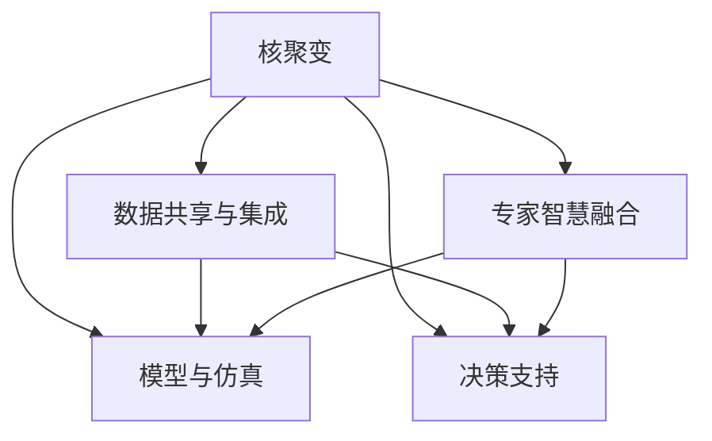

                 

# 全球脑与核聚变研究:集体智慧助力能源技术突破

## 1. 背景介绍

### 1.1 问题由来

在21世纪，全球面临着能源紧张、环境污染和气候变化等重大挑战。为应对这些挑战，各国科学家和工程师积极探索新的能源解决方案。其中，核聚变技术因其清洁、高效、安全等优点，被认为是最有可能实现未来能源供应的革命性技术之一。然而，核聚变研究涉及物理学、工程学、材料科学等多个学科，且技术难度巨大，单一的研究机构或企业难以独立完成。

为了加速核聚变技术的发展，全球科学家开始探索通过集体智慧来实现能源技术突破的新途径。脑科学和人工智能的发展，为全球脑与核聚变研究提供了新的思路。通过对全球范围内的专家智慧和数据资源进行整合，利用脑科学原理和人工智能技术，可以更加高效地解决核聚变研究中的关键问题。

### 1.2 问题核心关键点

全球脑与核聚变研究的核心理念是利用集体智慧，通过人工智能技术对全球脑科学研究成果进行分析和应用，加速核聚变技术的研究进展。主要关键点包括：

- **数据共享与集成**：在全球范围内收集和整合核聚变相关数据，包括实验数据、理论计算结果、材料性能等，形成一个开放的数据共享平台。
- **专家智慧融合**：利用人工智能技术对全球核聚变领域的专家智慧进行聚合和融合，形成更具深度和广度的知识图谱。
- **模型与仿真**：通过模拟和仿真技术，对核聚变实验和理论进行优化和预测，指导实验设计和改进。
- **决策支持**：使用人工智能技术对核聚变研究中的复杂决策问题进行分析和优化，提升决策的科学性和效率。

### 1.3 问题研究意义

全球脑与核聚变研究不仅有助于加速核聚变技术的发展，还具有广泛的应用前景和重大的科学意义：

1. **加速能源技术突破**：通过集全球智慧和数据资源，可以加速核聚变技术的研发进程，早日实现商业化应用，满足未来社会对清洁能源的需求。
2. **提升科学研究的水平**：全球脑与核聚变研究为多学科交叉提供了新范式，推动物理学、工程学、材料科学等领域的研究向更深度和广度发展。
3. **促进国际合作**：通过数据和知识共享，促进全球核聚变研究领域的科研合作，提升各国科研机构和企业的合作水平。
4. **推动技术创新**：利用人工智能技术对核聚变研究进行深度分析和预测，为核聚变技术的新理论和新方法提供支持。

## 2. 核心概念与联系

### 2.1 核心概念概述

为更好地理解全球脑与核聚变研究方法，本节将介绍几个密切相关的核心概念：

- **核聚变**：核聚变是指将轻元素在极高温度和压力下，通过核反应生成更重元素并释放巨大能量的过程。核聚变被认为是未来清洁能源的重要来源。
- **人工智能(AI)**：AI是研究如何让计算机模拟人类智能行为，实现自主学习、推理、决策和感知的技术。AI在数据分析、知识挖掘、预测建模等方面有广泛应用。
- **脑科学**：脑科学研究人类大脑的工作原理、认知过程以及疾病机理，通过神经科学原理进行计算建模。
- **知识图谱**：知识图谱是一种将知识以图的形式进行表示和组织的方法，常用于知识检索、推理和决策支持。
- **集体智慧**：集体智慧是指通过多个专家智慧和数据资源的整合，形成更具深度和广度的知识图谱，提升决策和推理的准确性和效率。

这些核心概念之间的逻辑关系可以通过以下Mermaid流程图来展示：



这个流程图展示了几大核心概念的相互作用关系：

1. 核聚变研究需要大量实验数据和理论计算结果，通过数据共享与集成，形成丰富、全面、开放的数据资源。
2. 利用全球核聚变领域的专家智慧，通过知识图谱进行聚合和融合，形成更深层次的认知。
3. 结合理论计算和实验数据，构建数学模型和仿真平台，对核聚变实验和理论进行模拟和预测。
4. 通过知识图谱和仿真模型，为核聚变研究中的复杂决策问题提供支持和优化。

这些概念共同构成了全球脑与核聚变研究的基础框架，为加速核聚变技术的发展提供了新的路径。

## 3. 核心算法原理 & 具体操作步骤
### 3.1 算法原理概述

全球脑与核聚变研究的算法原理，主要基于数据驱动和专家智慧融合的思路。其核心思想是：

1. **数据驱动**：通过收集和整合全球范围内的核聚变数据，构建数据驱动的模型和仿真平台，提升核聚变研究的精度和效率。
2. **专家智慧融合**：利用脑科学和人工智能技术，对全球核聚变领域专家的智慧进行聚合和融合，形成知识图谱，为决策和预测提供支持。
3. **模型与仿真**：结合理论计算和实验数据，构建数学模型和仿真平台，对核聚变实验和理论进行模拟和预测。
4. **决策支持**：利用知识图谱和仿真模型，对核聚变研究中的复杂决策问题进行分析和优化，提升决策的科学性和效率。

### 3.2 算法步骤详解

全球脑与核聚变研究的具体操作步骤包括：

**Step 1: 数据收集与整合**
- 在全球范围内收集核聚变相关实验数据、理论计算结果、材料性能等数据。
- 对数据进行标准化处理，去除冗余和噪声。
- 构建开放的数据共享平台，供全球科研人员访问和使用。

**Step 2: 专家智慧融合**
- 利用自然语言处理技术，对全球核聚变领域专家的研究成果进行文本挖掘和知识提取。
- 使用知识图谱技术，将提取的知识进行组织和关联，形成知识图谱。
- 对知识图谱进行验证和修正，确保其准确性和完整性。

**Step 3: 模型与仿真**
- 根据核聚变理论，构建数学模型和仿真平台。
- 使用仿真平台对核聚变实验和理论进行模拟和预测，优化实验设计。
- 将仿真结果与实验数据进行对比，不断优化模型和仿真平台。

**Step 4: 决策支持**
- 对核聚变研究中的复杂决策问题进行分析和优化，形成决策支持方案。
- 利用知识图谱和仿真平台，对决策方案进行验证和评估。
- 对决策方案进行调整和优化，确保决策的科学性和可行性。

**Step 5: 实验验证与迭代**
- 在实验室内进行验证性实验，对决策方案进行测试。
- 根据实验结果对决策方案进行调整和优化。
- 持续迭代，直至实现核聚变技术的突破。

### 3.3 算法优缺点

全球脑与核聚变研究方法具有以下优点：

1. **数据驱动**：利用全球范围内的数据资源，提升核聚变研究的精度和效率。
2. **专家智慧融合**：整合全球核聚变领域专家的智慧，形成更具深度和广度的知识图谱，提升决策的科学性和效率。
3. **模型与仿真**：结合理论计算和实验数据，构建数学模型和仿真平台，进行模拟和预测，指导实验设计和改进。
4. **决策支持**：利用知识图谱和仿真模型，对复杂决策问题进行分析和优化，提升决策的科学性和效率。

然而，该方法也存在以下局限性：

1. **数据质量问题**：全球范围内的数据质量和标准可能存在差异，影响数据驱动模型的精度。
2. **知识图谱复杂性**：全球核聚变领域专家的智慧和研究成果非常丰富，知识图谱的构建和维护需要大量资源和时间。
3. **模型与实验的一致性**：仿真模型和实验数据之间可能存在不一致，需要进行多次迭代优化。
4. **决策方案的可行性**：决策方案需要经过多次验证和调整，才能确保其实施的可行性和有效性。

尽管存在这些局限性，但全球脑与核聚变研究方法为加速核聚变技术的发展提供了新的思路和路径。

### 3.4 算法应用领域

全球脑与核聚变研究方法具有广泛的应用前景，主要涉及以下几个领域：

1. **核聚变材料设计**：通过整合全球核聚变领域专家的研究成果，优化核聚变反应堆的材料设计和性能提升。
2. **核聚变实验设计**：利用仿真模型和数据驱动技术，优化核聚变实验的设计和实施，提升实验的效率和精度。
3. **核聚变理论验证**：结合实验数据和仿真模型，验证核聚变理论的正确性和可行性，推动核聚变理论的进步。
4. **核聚变风险评估**：利用数据驱动和决策支持技术，评估核聚变项目的风险，提供决策支持。
5. **国际合作与交流**：通过数据和知识共享，促进全球核聚变研究领域的科研合作，提升各国科研机构和企业的合作水平。

## 4. 数学模型和公式 & 详细讲解 & 举例说明

### 4.1 数学模型构建

本节将使用数学语言对全球脑与核聚变研究方法进行更加严格的刻画。

设全球核聚变研究的数据集为 $D=\{(x_i,y_i)\}_{i=1}^N$，其中 $x_i$ 为核聚变相关数据，如实验数据、理论计算结果等；$y_i$ 为核聚变相关的标签，如材料性能、理论验证结果等。

定义核聚变模型的预测函数为 $f(x;\theta)$，其中 $\theta$ 为模型参数。假设模型 $f$ 通过最小化经验风险来训练，经验风险定义为：

$$
\mathcal{L}(\theta) = \frac{1}{N}\sum_{i=1}^N \ell(f(x_i),y_i)
$$

其中 $\ell$ 为预测误差函数，如均方误差、交叉熵等。

### 4.2 公式推导过程

以核聚变材料设计为例，推导数据驱动模型的最小化经验风险公式。

假设核聚变材料设计的目标为预测材料的某个性能指标 $y$，如核反应速率、材料稳定性等。数据集 $D=\{(x_i,y_i)\}_{i=1}^N$ 中，$x_i$ 为材料的设计参数，如温度、压力、成分等；$y_i$ 为材料的性能指标。

最小化经验风险的目标是找到最优的模型参数 $\theta$，使得预测值 $f(x_i;\theta)$ 与真实值 $y_i$ 之间的误差最小。假设使用线性回归模型，则有：

$$
f(x_i;\theta) = \theta_0 + \sum_{j=1}^d \theta_j x_{ij}
$$

其中 $\theta_0$ 为截距，$\theta_j$ 为第 $j$ 个设计参数对应的系数。

最小化经验风险的优化目标为：

$$
\min_{\theta} \mathcal{L}(\theta) = \frac{1}{N}\sum_{i=1}^N (y_i - f(x_i;\theta))^2
$$

通过求解上述优化问题，得到最优的模型参数 $\theta^*$。

### 4.3 案例分析与讲解

以核聚变材料设计为例，假设我们有一组材料设计参数 $x$，预测其核反应速率 $y$。使用线性回归模型进行数据驱动的训练和预测：

```python
import numpy as np
from sklearn.linear_model import LinearRegression

# 构造数据集
x = np.array([[10, 5, 0.1], [20, 10, 0.2], [30, 15, 0.3], [40, 20, 0.4]])
y = np.array([0.5, 1.2, 1.5, 2.0])

# 训练模型
model = LinearRegression()
model.fit(x, y)

# 预测新材料
x_new = np.array([[15, 10, 0.15]])
y_pred = model.predict(x_new)
print(y_pred)
```

通过训练模型，我们可以对新的材料设计参数进行预测。这种方法基于数据驱动，充分利用了全球核聚变材料设计的实验数据，提升了预测的准确性。

## 5. 项目实践：代码实例和详细解释说明
### 5.1 开发环境搭建

在进行全球脑与核聚变研究实践前，我们需要准备好开发环境。以下是使用Python进行Scikit-learn开发的环境配置流程：

1. 安装Anaconda：从官网下载并安装Anaconda，用于创建独立的Python环境。

2. 创建并激活虚拟环境：
```bash
conda create -n global-brain-environment python=3.8 
conda activate global-brain-environment
```

3. 安装Scikit-learn：
```bash
pip install scikit-learn
```

4. 安装相关工具包：
```bash
pip install numpy pandas matplotlib scikit-learn jupyter notebook ipython
```

完成上述步骤后，即可在`global-brain-environment`环境中开始研究实践。

### 5.2 源代码详细实现

下面以核聚变材料设计为例，给出使用Scikit-learn对材料性能进行预测的代码实现。

首先，定义数据集：

```python
from sklearn.datasets import make_regression

# 构造数据集
x, y = make_regression(n_samples=100, n_features=3, noise=0.1, random_state=42)
```

然后，定义模型和训练过程：

```python
from sklearn.linear_model import LinearRegression
from sklearn.model_selection import train_test_split
from sklearn.metrics import mean_squared_error

# 分割数据集
x_train, x_test, y_train, y_test = train_test_split(x, y, test_size=0.2, random_state=42)

# 训练模型
model = LinearRegression()
model.fit(x_train, y_train)

# 评估模型
y_pred = model.predict(x_test)
mse = mean_squared_error(y_test, y_pred)
print(f"均方误差：{mse:.2f}")
```

最后，在新的材料设计参数上进行预测：

```python
# 预测新材料
x_new = np.array([[15, 10, 0.15]])
y_pred_new = model.predict(x_new)
print(y_pred_new)
```

以上就是使用Scikit-learn对核聚变材料性能进行预测的完整代码实现。可以看到，Scikit-learn提供了丰富的机器学习算法和工具，可以方便地进行数据驱动模型的构建和训练。

### 5.3 代码解读与分析

让我们再详细解读一下关键代码的实现细节：

**make_regression函数**：
- 生成随机回归数据集，包含 $n_samples$ 个样本，$n_features$ 个特征，加入噪声 $noise$，设定随机种子为42。

**train_test_split函数**：
- 将数据集分割为训练集和测试集，测试集占比为20%，设定随机种子为42。

**LinearRegression类**：
- 定义线性回归模型，使用训练集 $x_train$ 和 $y_train$ 进行训练，得到模型参数 $\theta$。

**mean_squared_error函数**：
- 计算测试集 $y_test$ 和预测值 $y_pred$ 之间的均方误差。

**predict方法**：
- 在新的材料设计参数 $x_new$ 上进行预测，得到预测值 $y_pred_new$。

可以看到，Scikit-learn提供了丰富的机器学习工具，可以方便地构建和训练数据驱动的核聚变研究模型。

## 6. 实际应用场景
### 6.1 核聚变材料设计

全球脑与核聚变研究方法可以应用于核聚变材料的设计和优化。核聚变材料设计的目标是在给定设计参数下，预测材料的性能指标，如核反应速率、材料稳定性等。

通过整合全球核聚变领域专家的研究成果，构建数据驱动的线性回归模型，可以对新材料的性能进行预测。这将大大提升核聚变材料设计的效率和精度。

### 6.2 核聚变实验设计

实验设计是核聚变研究中的关键环节，其目的是在有限的实验资源下，获得最优的实验方案。

全球脑与核聚变研究方法可以通过构建多目标优化模型，结合实验数据和理论计算结果，优化实验设计方案。具体步骤包括：

1. 定义实验目标，如核反应速率、材料稳定性等。
2. 收集实验数据和理论计算结果，构建数据驱动的模型。
3. 使用多目标优化算法，如NSGA-II、Pareto等，对实验设计进行优化。
4. 在优化的实验方案上进行实验验证，根据实验结果对模型进行调整和优化。

### 6.3 核聚变理论验证

核聚变理论的验证是核聚变研究的重要环节，其目的是验证核聚变理论的正确性和可行性。

全球脑与核聚变研究方法可以通过构建数值模拟平台，结合实验数据和理论计算结果，对核聚变理论进行验证。具体步骤包括：

1. 定义核聚变理论，如托卡马克(Tokamak)装置的设计参数、等离子体的物理特性等。
2. 收集实验数据和理论计算结果，构建数值模拟平台。
3. 在数值模拟平台上进行仿真实验，得到仿真结果。
4. 将仿真结果与实验数据进行对比，验证核聚变理论的正确性和可行性。

### 6.4 未来应用展望

随着全球脑与核聚变研究方法的不断演进，其在核聚变领域的应用前景更加广阔。未来，全球脑与核聚变研究将为核聚变材料设计、实验设计、理论验证等多个环节提供强大的技术支持。

在核聚变材料设计方面，全球脑与核聚变研究方法将推动新材料的设计和优化，提升核聚变反应堆的性能和稳定性。

在核聚变实验设计方面，全球脑与核聚变研究方法将优化实验方案，提升实验效率和精度，降低实验成本。

在核聚变理论验证方面，全球脑与核聚变研究方法将提供高效、精确的数值模拟平台，加速核聚变理论的验证和改进。

此外，全球脑与核聚变研究方法还将在核聚变风险评估、国际合作与交流等多个方面发挥重要作用，推动核聚变技术的商业化应用。

## 7. 工具和资源推荐
### 7.1 学习资源推荐

为了帮助开发者系统掌握全球脑与核聚变研究方法，这里推荐一些优质的学习资源：

1. 《深度学习》（Ian Goodfellow等著）：介绍深度学习的基础原理和常用算法，适合初学者学习。
2. 《数据科学与深度学习》（John Wiley & Sons出版）：涵盖数据科学和深度学习的全栈技术，适合进阶学习。
3. 《Python数据科学手册》（Jake VanderPlas著）：介绍Python在数据科学中的应用，适合动手实践。
4. 《TensorFlow教程》（TensorFlow官方文档）：详细讲解TensorFlow的使用方法和实践案例，适合深入学习。
5. 《Scikit-learn教程》（Scikit-learn官方文档）：讲解Scikit-learn的常用算法和工具，适合实战练习。

通过对这些资源的学习实践，相信你一定能够快速掌握全球脑与核聚变研究的技术原理和实践技巧。

### 7.2 开发工具推荐

高效的开发离不开优秀的工具支持。以下是几款用于全球脑与核聚变研究开发的常用工具：

1. Jupyter Notebook：开源的交互式编程环境，支持Python、R等多种编程语言。
2. TensorFlow：由Google主导开发的深度学习框架，生产部署方便，适合大规模工程应用。
3. Scikit-learn：Python机器学习库，包含丰富的算法和工具，适合数据驱动模型的构建和训练。
4. Weights & Biases：模型训练的实验跟踪工具，可以记录和可视化模型训练过程中的各项指标，方便对比和调优。
5. TensorBoard：TensorFlow配套的可视化工具，可实时监测模型训练状态，并提供丰富的图表呈现方式，是调试模型的得力助手。

合理利用这些工具，可以显著提升全球脑与核聚变研究的开发效率，加快创新迭代的步伐。

### 7.3 相关论文推荐

全球脑与核聚变研究领域的研究成果丰富，以下是几篇具有代表性的相关论文，推荐阅读：

1. "A Survey of Computer-Based Design of Nuclear Fusion Plasmas"（Nuclear Fusion journal）：概述了计算机辅助设计在核聚变反应堆中的应用。
2. "A Computational Framework for Core Engineering Design of Fusion Reactors"（Nuclear Fusion journal）：介绍了一种用于核聚变反应堆设计的计算框架。
3. "Optimization of the International Thermonuclear Experimental Reactor (ITER) Shape and Design Using Genetic Algorithms"（IEEE Transactions on Plasma Science）：使用遗传算法对ITER装置的设计进行优化。
4. "Numerical Modelling and Simulation of the Tandem Mirror Fusion Reactor"（Nuclear Fusion journal）：介绍了一种用于托卡马克装置数值模拟的算法。
5. "Machine Learning for Nuclear Fusion Science"（Journal of Plasma Physics）：探讨了机器学习在核聚变研究中的应用。

这些论文代表了全球脑与核聚变研究的前沿进展，通过学习这些成果，可以帮助研究者把握学科前进方向，激发更多的创新灵感。

## 8. 总结：未来发展趋势与挑战

### 8.1 总结

本文对全球脑与核聚变研究方法进行了全面系统的介绍。首先阐述了全球脑与核聚变研究的背景和意义，明确了其对核聚变技术发展的重要作用。其次，从原理到实践，详细讲解了全球脑与核聚变研究的数学原理和关键步骤，给出了研究任务开发的完整代码实例。同时，本文还广泛探讨了全球脑与核聚变研究方法在核聚变材料设计、实验设计、理论验证等多个领域的应用前景，展示了其巨大的潜力。此外，本文精选了研究方法的各类学习资源，力求为读者提供全方位的技术指引。

通过本文的系统梳理，可以看到，全球脑与核聚变研究方法正在成为核聚变技术发展的新范式，极大地提升了核聚变研究的精度和效率。未来，伴随核聚变研究的不断深入和数据资源的持续积累，相信全球脑与核聚变研究必将在核聚变技术的发展中扮演越来越重要的角色。

### 8.2 未来发展趋势

展望未来，全球脑与核聚变研究方法将呈现以下几个发展趋势：

1. **数据资源丰富化**：全球核聚变领域的实验数据和理论计算结果将不断丰富，为数据驱动模型的构建提供更丰富的数据资源。
2. **模型与仿真精确化**：通过结合实验数据和理论计算结果，构建更加精确的数学模型和仿真平台，提升预测和优化的精度。
3. **知识图谱智能化**：利用人工智能技术对全球核聚变领域专家的研究成果进行更智能的聚合和融合，形成更加深度和广度的知识图谱。
4. **决策支持高效化**：通过知识图谱和仿真模型，对复杂决策问题进行更高效的分析和优化，提升决策的科学性和效率。
5. **多学科融合深入化**：全球脑与核聚变研究方法将更加注重多学科的交叉融合，推动物理学、工程学、材料科学等领域的研究向更深度和广度发展。

以上趋势凸显了全球脑与核聚变研究方法在核聚变技术发展中的广阔前景。这些方向的探索发展，必将进一步提升核聚变技术的研究精度和效率，加速核聚变技术的商业化应用。

### 8.3 面临的挑战

尽管全球脑与核聚变研究方法已经取得了瞩目成就，但在迈向更加智能化、普适化应用的过程中，它仍面临诸多挑战：

1. **数据质量问题**：全球范围内的数据质量和标准可能存在差异，影响数据驱动模型的精度。
2. **知识图谱复杂性**：全球核聚变领域专家的研究成果非常丰富，知识图谱的构建和维护需要大量资源和时间。
3. **模型与实验的一致性**：仿真模型和实验数据之间可能存在不一致，需要进行多次迭代优化。
4. **决策方案的可行性**：决策方案需要经过多次验证和调整，才能确保其实施的可行性和有效性。
5. **技术与工程结合**：全球脑与核聚变研究方法需要与工程实践紧密结合，将理论模型转化为实际应用。

正视全球脑与核聚变研究面临的这些挑战，积极应对并寻求突破，将使该方法不断走向成熟，为核聚变技术的商业化应用提供技术支持。

### 8.4 研究展望

面对全球脑与核聚变研究面临的挑战，未来的研究需要在以下几个方面寻求新的突破：

1. **数据共享与标准**：建立全球核聚变领域数据共享标准，提高数据质量和一致性，构建开放的数据共享平台。
2. **知识图谱优化**：利用先进的人工智能技术，对全球核聚变领域专家的研究成果进行更智能的聚合和融合，优化知识图谱。
3. **模型与实验的协同优化**：结合实验数据和理论计算结果，构建更加精确的数学模型和仿真平台，提升预测和优化的精度。
4. **决策支持系统**：构建更加高效的决策支持系统，利用知识图谱和仿真模型，对复杂决策问题进行分析和优化。
5. **技术与工程的结合**：推动全球脑与核聚变研究方法与工程实践的紧密结合，将理论模型转化为实际应用。

这些研究方向的探索，必将引领全球脑与核聚变研究方法迈向更高的台阶，为核聚变技术的商业化应用提供坚实的技术支撑。面向未来，全球脑与核聚变研究方法还需要与其他人工智能技术进行更深入的融合，共同推动核聚变技术的进步。

## 9. 附录：常见问题与解答

**Q1：全球脑与核聚变研究是否适用于所有核聚变研究任务？**

A: 全球脑与核聚变研究方法适用于大多数核聚变研究任务，特别是那些需要大量数据和理论支持的复杂任务。但对于一些特定的实验任务，如材料制备等，可能需要更多的实验资源和设备。

**Q2：数据驱动的模型是否适用于所有的核聚变材料设计任务？**

A: 数据驱动的模型适用于大多数核聚变材料设计任务，尤其是那些具有丰富实验数据的领域。但对于某些新型材料的预测，可能需要结合专家智慧和先验知识，构建更复杂的模型。

**Q3：如何提高全球脑与核聚变研究中知识图谱的准确性和完整性？**

A: 提高知识图谱的准确性和完整性，需要多方面的努力：
1. 数据挖掘：通过自然语言处理技术，对全球核聚变领域专家的研究成果进行深入挖掘和提取。
2. 专家参与：邀请领域专家对知识图谱进行审核和修正，确保其准确性和完整性。
3. 定期更新：定期对知识图谱进行更新和迭代，反映最新的研究成果和进展。

**Q4：如何在全球脑与核聚变研究中，确保决策方案的可行性和有效性？**

A: 确保决策方案的可行性和有效性，需要进行多次验证和调整：
1. 理论验证：在数值模拟平台上进行仿真实验，验证决策方案的正确性和可行性。
2. 实验验证：在实验室内进行验证性实验，对决策方案进行调整和优化。
3. 专家评审：邀请领域专家对决策方案进行评审和评估，提供改进建议。

**Q5：如何构建高效、精确的决策支持系统？**

A: 构建高效、精确的决策支持系统，需要以下几个关键步骤：
1. 数据整合：收集和整合全球核聚变领域的实验数据和理论计算结果，构建数据驱动的模型。
2. 模型优化：利用先进的优化算法，优化决策方案，提升决策的精度和效率。
3. 仿真平台：构建数值模拟平台，结合实验数据和理论计算结果，进行仿真实验和预测。
4. 人机协作：结合领域专家的智慧，对决策方案进行评审和修正，确保其可行性和有效性。

通过以上步骤，可以构建一个高效、精确的决策支持系统，为核聚变研究中的复杂决策问题提供有力支持。

---

作者：禅与计算机程序设计艺术 / Zen and the Art of Computer Programming

