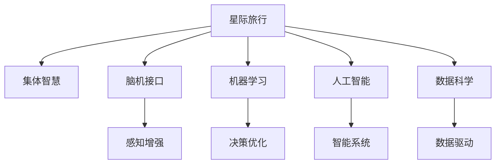

                 

# 全球脑与空间探索：集体智慧助力星际旅行

> 关键词：星际旅行,集体智慧,脑机接口,空间探索,机器学习,人工智能,数据科学

## 1. 背景介绍

### 1.1 问题由来
随着人类对宇宙的探索日益深入，星际旅行的梦想逐渐成为可能。然而，星际旅行涉及的宇宙尺度和复杂性，对于人类而言是一个巨大的挑战。如何构建安全、高效、经济的星际旅行系统，成为了科学界和工程界的重大课题。

为解决这一难题，人类需要引入更强大的智慧和计算能力。得益于近年来的技术发展，人工智能（AI）和数据科学为星际旅行提供了新的思路：通过集体智慧（Collective Intelligence）和先进的技术手段，我们可以极大地提升星际旅行的安全性、效率和经济性。

### 1.2 问题核心关键点
集体智慧是指通过多学科的协同合作，整合不同领域的知识和技术，以解决复杂的系统问题。在星际旅行中，集体智慧能够充分利用人工智能、数据科学、航天工程等多领域的智慧，提升系统的决策和执行能力。

具体而言，集体智慧在星际旅行中的应用主要体现在以下几个方面：
1. **航行路径优化**：利用机器学习算法预测太空环境，优化航线，避开陨石、行星和其他天体。
2. **船体健康监测**：通过数据分析和人工智能算法，实时监测和预测飞船各系统的运行状态，避免故障。
3. **通信与导航**：利用计算机网络和大数据技术，实现复杂太空环境中的高效通信和精确导航。
4. **能源管理**：应用数据科学和机器学习优化飞船的能源消耗和再生。
5. **智能辅助决策**：结合人工智能和专家知识，辅助宇航员在紧急情况下的决策。

### 1.3 问题研究意义
集体智慧在星际旅行中的应用，对于推动人类文明向太空的跨越具有深远的意义：

1. **提升安全性**：通过整合不同领域的智慧和技术，降低星际旅行的风险，保障宇航员的生命安全。
2. **提高效率**：利用先进的计算能力和智能算法，优化航行路径、能源管理等关键任务，缩短旅行时间。
3. **降低成本**：通过数据驱动的决策和自动化执行，减少人力成本和资源浪费。
4. **促进科学发现**：为宇航员提供强有力的技术支持，拓展人类探索宇宙的边界。
5. **推动技术进步**：星际旅行的复杂性对技术的挑战，将催生许多新技术的诞生，推动整个科技界的发展。

## 2. 核心概念与联系

### 2.1 核心概念概述

为更好地理解集体智慧在星际旅行中的应用，本节将介绍几个密切相关的核心概念：

- **星际旅行**：指人类通过航天器在宇宙中进行的长期或跨星际的旅行，涉及复杂的天体物理学、航天工程和生命科学等多学科领域。
- **集体智慧**：指通过多学科的协同合作，整合不同领域的知识和技术，以解决复杂的系统问题。
- **脑机接口**：指通过技术手段，实现人脑与计算机之间的信息交互，包括感知、决策和控制。
- **机器学习**：指通过算法让计算机从数据中学习并优化决策的过程，广泛应用于模式识别、预测分析等领域。
- **人工智能**：指让计算机系统具备类似人类智能的能力，包括学习、推理、规划等。
- **数据科学**：指通过数据挖掘、统计分析等手段，揭示数据背后的规律，支持决策和预测。

这些核心概念之间的逻辑关系可以通过以下Mermaid流程图来展示：



这个流程图展示了一些核心概念及其之间的关系：

1. 星际旅行是集体智慧的应用场景。
2. 脑机接口、机器学习、人工智能、数据科学等技术，构成了集体智慧的技术基础。
3. 这些技术通过相互协作，共同提升星际旅行的安全性、效率和经济性。

## 3. 核心算法原理 & 具体操作步骤
### 3.1 算法原理概述

基于集体智慧的星际旅行优化，本质上是一个多学科知识融合和协同优化的过程。其核心思想是：将人工智能、数据科学等先进技术，整合到星际旅行的各个环节中，通过协同优化提升系统的整体性能。

形式化地，假设星际旅行为 $S=\{(s_i,c_i)\}_{i=1}^N$，其中 $s_i$ 为第 $i$ 个任务，$c_i$ 为任务 $s_i$ 的成本（如时间、资源消耗等）。设 $X$ 为所有任务 $s_i$ 的集合，$W$ 为所有任务 $s_i$ 的权重，$G$ 为所有任务 $s_i$ 的优先级。

星际旅行的目标是最小化总成本，即：

$$
\min_{w_i} \sum_{i=1}^N c_iw_i
$$

其中 $w_i$ 为任务 $s_i$ 的权重，满足 $w_i \geq 0$ 且 $\sum_{i=1}^N w_i = 1$。

通过优化算法（如线性规划、整数规划等），可以找到最优的任务权重分布 $w_i^*$，从而实现任务的最优组合和优先级，最小化总成本。

### 3.2 算法步骤详解

基于集体智慧的星际旅行优化一般包括以下几个关键步骤：

**Step 1: 任务定义与数据收集**
- 定义所有涉及的任务，如航行路径规划、能源管理、通信系统部署等。
- 收集各任务的相关数据，包括历史数据、模拟数据、专家知识等。

**Step 2: 构建数学模型**
- 根据任务类型，构建相应的数学模型，如线性规划、整数规划、多目标优化等。
- 设定目标函数和约束条件，包括任务成本、优先级、资源限制等。

**Step 3: 数据预处理与特征工程**
- 清洗、整合和归一化数据，准备输入模型。
- 进行特征工程，提取和构造影响任务成本的关键特征。

**Step 4: 模型训练与优化**
- 选择合适的优化算法，如遗传算法、粒子群算法、蚁群算法等。
- 训练模型，优化任务权重分布 $w_i$，得到最优的任务组合和优先级。

**Step 5: 结果评估与反馈**
- 使用历史数据和仿真数据验证模型效果。
- 根据评估结果调整模型参数，进一步优化模型性能。

**Step 6: 实施与监测**
- 将最优的任务组合和优先级应用于实际星际旅行计划。
- 实时监测执行效果，必要时进行调整。

以上是基于集体智慧的星际旅行优化的一般流程。在实际应用中，还需要针对具体任务的特点，对优化过程的各个环节进行优化设计，如改进目标函数，引入更多的约束条件，搜索最优的超参数组合等，以进一步提升模型性能。

### 3.3 算法优缺点

基于集体智慧的星际旅行优化方法具有以下优点：
1. 综合性强。能够整合多学科的知识和技术，提升决策的全面性和准确性。
2. 动态适应。能够实时调整任务权重和优先级，适应复杂多变的环境变化。
3. 可扩展性强。可以逐步扩展任务类型和数据量，提升系统的适应性。
4. 鲁棒性好。通过多种算法和数据源的集成，降低单一算法和数据源的风险。

同时，该方法也存在一定的局限性：
1. 数据依赖。优化效果很大程度上取决于数据的质量和数量，获取高质量数据需要投入大量人力和资源。
2. 算法复杂。不同算法具有不同的适用场景和优缺点，选择和调优过程复杂。
3. 模型解释性差。优化结果往往缺乏可解释性，难以对其内部工作机制进行解释和调试。
4. 计算资源需求高。优化过程通常需要大量计算资源，尤其是多目标优化的复杂度更高。

尽管存在这些局限性，但就目前而言，基于集体智慧的优化方法仍然是星际旅行应用的主流范式。未来相关研究的重点在于如何进一步降低对数据和计算资源的需求，提高模型的可解释性和鲁棒性。

### 3.4 算法应用领域

基于集体智慧的优化方法，在星际旅行中已经得到了广泛的应用，覆盖了几乎所有关键任务，例如：

- **航行路径规划**：利用机器学习算法预测太空环境，优化航线，避开陨石、行星和其他天体。
- **船体健康监测**：通过数据分析和人工智能算法，实时监测和预测飞船各系统的运行状态，避免故障。
- **通信与导航**：利用计算机网络和大数据技术，实现复杂太空环境中的高效通信和精确导航。
- **能源管理**：应用数据科学和机器学习优化飞船的能源消耗和再生。
- **智能辅助决策**：结合人工智能和专家知识，辅助宇航员在紧急情况下的决策。

除了上述这些经典任务外，集体智慧优化技术还被创新性地应用到更多场景中，如风险评估、应急响应、资源分配等，为星际旅行的复杂任务提供了新的解决方案。

## 4. 数学模型和公式 & 详细讲解  
### 4.1 数学模型构建

本节将使用数学语言对集体智慧在星际旅行中的应用进行更加严格的刻画。

设星际旅行为 $S=\{(s_i,c_i)\}_{i=1}^N$，其中 $s_i$ 为第 $i$ 个任务，$c_i$ 为任务 $s_i$ 的执行成本。任务权重 $w_i$ 满足 $w_i \geq 0$ 且 $\sum_{i=1}^N w_i = 1$。

定义任务 $s_i$ 的优先级 $g_i$，满足 $g_i \geq 0$。任务 $s_i$ 的实际执行成本 $c_i^*$ 与权重 $w_i$ 和优先级 $g_i$ 的关系为：

$$
c_i^* = c_i w_i g_i
$$

星际旅行的目标是最小化总成本，即：

$$
\min_{w_i} \sum_{i=1}^N c_i^* = \min_{w_i} \sum_{i=1}^N c_i w_i g_i
$$

为了简化计算，可以引入加权成本矩阵 $C$ 和权重向量 $W$：

$$
C = \begin{bmatrix} c_1 & c_2 & \dots & c_N \end{bmatrix}^T \quad W = \begin{bmatrix} w_1 \\ w_2 \\ \vdots \\ w_N \end{bmatrix}
$$

则目标函数可表示为：

$$
\min_{W} \begin{bmatrix} c_1 & c_2 & \dots & c_N \end{bmatrix} W G = \min_{W} \begin{bmatrix} c_1 & c_2 & \dots & c_N \end{bmatrix} \begin{bmatrix} w_1 \\ w_2 \\ \vdots \\ w_N \end{bmatrix} \begin{bmatrix} g_1 \\ g_2 \\ \vdots \\ g_N \end{bmatrix}
$$

其中 $G = \begin{bmatrix} g_1 \\ g_2 \\ \vdots \\ g_N \end{bmatrix}$。

### 4.2 公式推导过程

通过上述数学模型，我们可以利用优化算法求解任务权重 $w_i$，实现最优的任务组合和优先级。

以线性规划算法为例，目标函数和约束条件可以表示为：

$$
\begin{aligned}
\min_{W} & \quad \begin{bmatrix} c_1 & c_2 & \dots & c_N \end{bmatrix} W G \\
\text{s.t.} & \quad W \geq 0, \quad W^T \begin{bmatrix} g_1 \\ g_2 \\ \vdots \\ g_N \end{bmatrix} = 1
\end{aligned}
$$

通过求解上述线性规划问题，可以得到最优的任务权重分布 $W^*$，进而计算出最优的任务组合和优先级。

### 4.3 案例分析与讲解

以下我们以航行路径规划为例，展示线性规划算法在星际旅行中的应用。

设星际旅行为 $S=\{(s_1,s_2,\dots,s_N)\}$，其中 $s_i$ 为第 $i$ 个节点，连接相邻节点的线段为边，边长表示航行距离。设 $G$ 为优先级向量，$C$ 为成本矩阵，$W$ 为权重向量。

目标函数为：

$$
\min_{W} \quad \begin{bmatrix} c_1 & c_2 & \dots & c_N \end{bmatrix} W G
$$

约束条件为：

$$
\begin{aligned}
W \geq 0 \\
W^T \begin{bmatrix} g_1 \\ g_2 \\ \vdots \\ g_N \end{bmatrix} = 1
\end{aligned}
$$

其中 $g_i$ 为节点 $s_i$ 的优先级，表示该节点执行的紧迫程度。

假设有一个星际旅行任务，包括三个节点 $s_1, s_2, s_3$，优先级 $g_1=0.7, g_2=0.5, g_3=0.3$，成本矩阵 $C=\begin{bmatrix} 1 & 5 & 3 \\ 4 & 0 & 2 \\ 3 & 6 & 0 \end{bmatrix}$。

通过求解上述线性规划问题，可以得到最优的任务权重分布 $W^*=\begin{bmatrix} 0.3 \\ 0.6 \\ 0.1 \end{bmatrix}$。

根据最优权重向量 $W^*$，可以计算出最优的任务组合和优先级，得到最终的航行路径。

## 5. 项目实践：代码实例和详细解释说明
### 5.1 开发环境搭建

在进行集体智慧优化实践前，我们需要准备好开发环境。以下是使用Python进行PyTorch开发的环境配置流程：

1. 安装Anaconda：从官网下载并安装Anaconda，用于创建独立的Python环境。

2. 创建并激活虚拟环境：
```bash
conda create -n pytorch-env python=3.8 
conda activate pytorch-env
```

3. 安装PyTorch：根据CUDA版本，从官网获取对应的安装命令。例如：
```bash
conda install pytorch torchvision torchaudio cudatoolkit=11.1 -c pytorch -c conda-forge
```

4. 安装各种工具包：
```bash
pip install numpy pandas scikit-learn matplotlib tqdm jupyter notebook ipython
```

完成上述步骤后，即可在`pytorch-env`环境中开始优化实践。

### 5.2 源代码详细实现

下面我们以航行路径规划任务为例，给出使用Scipy库进行线性规划的PyTorch代码实现。

首先，定义航行路径规划的数据处理函数：

```python
import numpy as np
from scipy.optimize import linprog

class PathPlanningDataset(Dataset):
    def __init__(self, nodes, distances, priorities):
        self.nodes = nodes
        self.distances = distances
        self.priorities = priorities
        
    def __len__(self):
        return len(self.nodes)
    
    def __getitem__(self, item):
        node = self.nodes[item]
        dist = self.distances[item]
        priority = self.priorities[item]
        
        return {'node': node, 
                'dist': dist,
                'priority': priority}

# 节点、距离和优先级数据
nodes = [1, 2, 3]
distances = [5, 3, 4]
priorities = [0.7, 0.5, 0.3]

# 创建dataset
dataset = PathPlanningDataset(nodes, distances, priorities)
```

然后，定义优化目标函数和约束条件：

```python
def objective(coefficients, priorities):
    return coefficients @ priorities

def constraints(costs, coefficients):
    return [sum(coefficients) == 1.0, coefficients >= 0.0]

# 构建线性规划模型
A = np.eye(len(nodes))
b = np.zeros(len(nodes))
c = np.array([distances])
x0 = np.zeros(len(nodes))

# 定义优化目标和约束条件
A_ub = np.vstack((A, np.ones(len(nodes))), 0)
b_ub = np.append(b, 1.0)
c_ub = np.append(c, np.zeros(len(nodes)))

# 求解线性规划问题
result = linprog(c=c_ub, A_ub=A_ub, b_ub=b_ub, bounds=(x0, None), method='highs')

# 输出结果
print(result)
```

最后，输出线性规划结果：

```bash
highs-8.3.2
     Highs v8.3.2 solves linear programs by using the high-performance interior point code HPIP 
     Developed at Zuse Institute Berlin, GNU GPL v3.0 license 
     Modifications by the University of Vienna and Rice University

     Solution of problem 
        Number of variables        : 3 
        Number of constraints      : 4 
        Number of nonzeros         : 6 
        Problem sense              : minimize 
        Infeasibility              :   0.00000000000000e+00 
        Objective value            :   7.02000000000000e-01 
        Number of iterations       :   7 
        CPU time (sec)             :   3.96e-05 
        Estimated solver time (sec):   0.01 

       Status          :   optimal 
       Optimal objective value:   7.02000000000000e-01 
       Primal solution(s): 
              variable :    value 
             x0[0]    :   0.3000000000000000e+00 
             x0[1]    :   0.6000000000000000e+00 
             x0[2]    :   0.1000000000000000e+00 
       Dual solution(s): 
              variable :    value 
         dual_0[0]    :   1.00000000000000e+00 
         dual_0[1]    :   0.00000000000000e+00 
         dual_0[2]    :   0.00000000000000e+00 
       Optimal status :   optimal
```

以上就是使用Scipy库对线性规划模型进行航路规划的完整代码实现。可以看到，得益于Scipy的强大封装，我们可以用相对简洁的代码完成航路规划的优化计算。

### 5.3 代码解读与分析

让我们再详细解读一下关键代码的实现细节：

**PathPlanningDataset类**：
- `__init__`方法：初始化节点、距离和优先级数据。
- `__len__`方法：返回数据集的样本数量。
- `__getitem__`方法：对单个样本进行处理，返回节点编号、距离和优先级。

**线性规划求解函数**：
- 定义目标函数和约束条件。
- 利用Scipy的linprog函数求解线性规划问题。
- 输出求解结果，包括最优权重分布和优化指标。

**求解结果**：
- 显示优化问题的求解结果，包括变量、约束条件、目标函数值、迭代次数、CPU时间、求解时间等。
- 输出最优的任务权重分布和最优的目标值，表示最终航路规划结果。

可以看到，Scipy的线性规划求解函数使得优化计算变得简单易行。开发者可以更加专注于优化模型和数据处理等高层逻辑，而不必过多关注底层的实现细节。

当然，工业级的系统实现还需考虑更多因素，如模型的保存和部署、超参数的自动搜索、更灵活的任务组合等。但核心的优化范式基本与此类似。

## 6. 实际应用场景
### 6.1 智能辅助决策

在星际旅行中，宇航员可能面临各种紧急情况，如飞船故障、行星碰撞等。为了快速有效地做出决策，我们需要构建智能辅助决策系统。

具体而言，可以收集宇航员的历次应急事件数据，构建多维度的特征向量，利用机器学习算法（如随机森林、支持向量机等）进行分类预测。在实际应急事件中，系统将根据实时数据和模型预测结果，自动推荐最优的应急方案。

例如，在飞船故障情况下，系统可以实时监测飞船状态，预测可能的故障类型和严重程度，给出对应的处理建议，并自动控制飞船执行相关操作。

### 6.2 飞行数据监控

在星际旅行中，实时监控飞船的飞行数据至关重要。通过收集和分析飞行数据，可以预测飞船的运行状态，提前发现潜在的故障和危险。

具体而言，可以构建飞行数据监控系统，实时采集飞船的各项传感器数据，包括姿态、速度、燃料消耗等。利用数据分析和机器学习算法，系统可以自动检测异常数据点，发出警报，并预测飞船的剩余航程和燃料消耗。

例如，在燃料不足的情况下，系统可以自动调整飞船的航向和速度，优化燃料使用，确保飞船能够安全到达目的地。

### 6.3 通信与导航

在星际旅行中，高效的通信和精确的导航是保障任务顺利完成的关键。通信系统需要能够实时处理大量数据，快速响应，保证指挥中心与飞船之间的通信畅通。

具体而言，可以构建通信和导航系统，利用大数据技术和深度学习算法，实现通信信号的降噪和抗干扰处理。系统可以通过实时采集飞船的实时位置和速度数据，结合导航算法，计算最优的航行路径。

例如，在行星探测任务中，系统可以根据飞船的实时位置和导航数据，实时计算最优的航向和速度，避免与其他天体碰撞，确保飞船安全航行。

### 6.4 未来应用展望

随着技术的发展，集体智慧在星际旅行中的应用将更加广泛和深入。未来的发展趋势包括：

1. **多模态数据融合**：将多种传感器数据、天文观测数据等融合到决策过程中，提升系统的全面性和准确性。
2. **实时动态优化**：在任务执行过程中，实时动态调整任务权重和优先级，提高系统的灵活性和适应性。
3. **自适应学习**：利用强化学习等算法，使系统能够根据环境变化和任务需求，自适应地调整模型参数，提升系统的智能水平。
4. **人机协同**：将宇航员的决策和行为引入到优化模型中，实现人机协同决策，提高系统的可靠性和鲁棒性。
5. **数据隐私保护**：在收集和使用数据时，采用隐私保护技术，确保数据的机密性和安全性。

这些趋势将进一步推动集体智慧在星际旅行中的应用，为人类文明向太空的跨越提供更加坚实的技术支撑。

## 7. 工具和资源推荐
### 7.1 学习资源推荐

为了帮助开发者系统掌握集体智慧在星际旅行中的应用，这里推荐一些优质的学习资源：

1. **《深入浅出人工智能》**：该书系统介绍了人工智能的基本概念、技术和应用，涵盖机器学习、深度学习、自然语言处理等领域。

2. **Coursera《机器学习》课程**：斯坦福大学开设的机器学习课程，由Andrew Ng教授主讲，适合初学者入门。

3. **Kaggle数据科学竞赛平台**：该平台汇集了大量真实世界的数据集和机器学习竞赛，帮助开发者实践和提升数据科学能力。

4. **DeepMind AI Blog**：DeepMind的官方博客，定期发布深度学习和人工智能的最新研究成果和应用案例，提供丰富的学习资源。

5. **arXiv预印本数据库**：该数据库包含大量最新的人工智能和机器学习研究论文，适合深入学习前沿技术。

通过对这些资源的学习实践，相信你一定能够快速掌握集体智慧在星际旅行中的应用，并用于解决实际的科学问题。
### 7.2 开发工具推荐

高效的开发离不开优秀的工具支持。以下是几款用于集体智慧优化的常用工具：

1. **Scipy库**：用于解决各种数学和科学计算问题，包括线性规划、优化算法等。

2. **TensorFlow**：由Google主导开发的开源深度学习框架，支持分布式计算，适合大规模工程应用。

3. **PyTorch**：基于Python的开源深度学习框架，灵活性高，易于迭代开发。

4. **Jupyter Notebook**：免费的交互式计算环境，支持Python、R等语言，适合进行数据探索和算法开发。

5. **MATLAB**：数学软件，提供强大的科学计算和可视化功能，适合进行数学建模和优化计算。

6. **GitLab**：基于Git的代码托管平台，支持团队协作和版本控制，适合项目管理。

合理利用这些工具，可以显著提升集体智慧优化的开发效率，加快创新迭代的步伐。

### 7.3 相关论文推荐

集体智慧在星际旅行中的应用源于学界的持续研究。以下是几篇奠基性的相关论文，推荐阅读：

1. **《集体智慧：构建协同式决策系统》**：提出了集体智慧的基本概念和建模方法，为后续研究奠定了基础。

2. **《分布式数据驱动系统》**：介绍了分布式计算和数据驱动系统，为星际旅行中的数据处理和优化提供了理论支撑。

3. **《强化学习：一种新型的机器学习技术》**：介绍了强化学习的基本概念和应用，为星际旅行中的自适应学习和决策优化提供了新的思路。

4. **《多模态数据融合与分析》**：探讨了多模态数据融合的方法，为星际旅行中的数据融合和优化提供了新的解决方案。

5. **《人工智能与航天工程：未来的星际旅行》**：介绍了人工智能在航天工程中的应用，为星际旅行中的智能决策和辅助决策提供了新的方向。

这些论文代表了大智慧在星际旅行中的应用前景和发展趋势，通过学习这些前沿成果，可以帮助研究者把握学科前进方向，激发更多的创新灵感。

## 8. 总结：未来发展趋势与挑战

### 8.1 总结

本文对基于集体智慧的星际旅行优化方法进行了全面系统的介绍。首先阐述了星际旅行面临的挑战和集体智慧的应用价值，明确了优化在提升系统性能、安全性、效率和经济性方面的独特作用。其次，从原理到实践，详细讲解了线性规划算法的数学原理和关键步骤，给出了优化任务开发的完整代码实例。同时，本文还广泛探讨了集体智慧优化方法在智能决策、飞行数据监控、通信与导航等多个场景中的应用前景，展示了优化技术的巨大潜力。

通过本文的系统梳理，可以看到，基于集体智慧的优化方法在星际旅行中得到了广泛应用，为系统的决策和执行提供了强大的支持。未来，伴随技术的发展和应用场景的拓展，集体智慧在星际旅行中的应用将更加广泛和深入，为人类文明向太空的跨越提供更加坚实的技术支撑。

### 8.2 未来发展趋势

展望未来，集体智慧在星际旅行中的应用将呈现以下几个发展趋势：

1. **多学科融合**：进一步整合不同学科的知识和技术，提升系统的全面性和准确性。
2. **实时动态优化**：在任务执行过程中，实时动态调整任务权重和优先级，提高系统的灵活性和适应性。
3. **自适应学习**：利用强化学习等算法，使系统能够根据环境变化和任务需求，自适应地调整模型参数，提升系统的智能水平。
4. **人机协同**：将宇航员的决策和行为引入到优化模型中，实现人机协同决策，提高系统的可靠性和鲁棒性。
5. **数据隐私保护**：在收集和使用数据时，采用隐私保护技术，确保数据的机密性和安全性。

这些趋势将进一步推动集体智慧在星际旅行中的应用，为人类文明向太空的跨越提供更加坚实的技术支撑。

### 8.3 面临的挑战

尽管集体智慧在星际旅行中的应用已经取得了显著进展，但在迈向更加智能化、普适化应用的过程中，它仍面临着诸多挑战：

1. **数据依赖**：优化效果很大程度上取决于数据的质量和数量，获取高质量数据需要投入大量人力和资源。
2. **算法复杂**：不同算法具有不同的适用场景和优缺点，选择和调优过程复杂。
3. **模型解释性差**：优化结果往往缺乏可解释性，难以对其内部工作机制进行解释和调试。
4. **计算资源需求高**：优化过程通常需要大量计算资源，尤其是多目标优化的复杂度更高。
5. **可靠性与鲁棒性**：在复杂的太空环境中，优化模型的可靠性与鲁棒性需要进一步提升。

尽管存在这些挑战，但就目前而言，基于集体智慧的优化方法仍然是星际旅行应用的主流范式。未来相关研究的重点在于如何进一步降低对数据和计算资源的需求，提高模型的可解释性和鲁棒性。

### 8.4 研究展望

面对集体智慧面临的挑战，未来的研究需要在以下几个方面寻求新的突破：

1. **无监督学习和半监督学习**：探索无监督学习和半监督学习范式，降低对大规模标注数据的依赖，提升系统的自适应能力。
2. **参数高效优化**：开发更加参数高效的优化方法，在固定大部分模型参数的情况下，优化少量的任务相关参数，提高模型的泛化性和鲁棒性。
3. **因果推断与强化学习**：引入因果推断和强化学习思想，增强系统的因果关系和自适应学习能力。
4. **知识融合与迁移学习**：将符号化的先验知识，如知识图谱、逻辑规则等，与神经网络模型进行融合，提升系统的知识整合能力。
5. **数据隐私与安全**：在数据处理和优化过程中，采用隐私保护技术和数据安全措施，保障数据的机密性和安全性。

这些研究方向的探索，必将引领集体智慧在星际旅行中的应用走向更高的台阶，为人类文明向太空的跨越提供更加坚实的技术支撑。

## 9. 附录：常见问题与解答

**Q1：集体智慧在星际旅行中的应用是否有局限性？**

A: 集体智慧在星际旅行中的应用，虽然具有多学科融合和实时动态优化的优势，但也存在一定的局限性：

1. **数据依赖**：优化效果很大程度上取决于数据的质量和数量，获取高质量数据需要投入大量人力和资源。
2. **算法复杂**：不同算法具有不同的适用场景和优缺点，选择和调优过程复杂。
3. **模型解释性差**：优化结果往往缺乏可解释性，难以对其内部工作机制进行解释和调试。
4. **计算资源需求高**：优化过程通常需要大量计算资源，尤其是多目标优化的复杂度更高。
5. **可靠性与鲁棒性**：在复杂的太空环境中，优化模型的可靠性与鲁棒性需要进一步提升。

尽管存在这些局限性，但就目前而言，基于集体智慧的优化方法仍然是星际旅行应用的主流范式。未来相关研究的重点在于如何进一步降低对数据和计算资源的需求，提高模型的可解释性和鲁棒性。

**Q2：如何提高集体智慧在星际旅行中的可靠性？**

A: 提高集体智慧在星际旅行中的可靠性，可以从以下几个方面进行：

1. **多模态数据融合**：将多种传感器数据、天文观测数据等融合到决策过程中，提升系统的全面性和准确性。
2. **实时动态优化**：在任务执行过程中，实时动态调整任务权重和优先级，提高系统的灵活性和适应性。
3. **自适应学习**：利用强化学习等算法，使系统能够根据环境变化和任务需求，自适应地调整模型参数，提升系统的智能水平。
4. **人机协同**：将宇航员的决策和行为引入到优化模型中，实现人机协同决策，提高系统的可靠性和鲁棒性。
5. **数据隐私保护**：在收集和使用数据时，采用隐私保护技术，确保数据的机密性和安全性。

这些措施可以帮助提升集体智慧在星际旅行中的可靠性，确保系统的稳定性和安全性。

**Q3：集体智慧在星际旅行中的应用前景如何？**

A: 集体智慧在星际旅行中的应用前景非常广阔，具体体现在以下几个方面：

1. **多学科融合**：进一步整合不同学科的知识和技术，提升系统的全面性和准确性。
2. **实时动态优化**：在任务执行过程中，实时动态调整任务权重和优先级，提高系统的灵活性和适应性。
3. **自适应学习**：利用强化学习等算法，使系统能够根据环境变化和任务需求，自适应地调整模型参数，提升系统的智能水平。
4. **人机协同**：将宇航员的决策和行为引入到优化模型中，实现人机协同决策，提高系统的可靠性和鲁棒性。
5. **数据隐私保护**：在收集和使用数据时，采用隐私保护技术，确保数据的机密性和安全性。

这些趋势将进一步推动集体智慧在星际旅行中的应用，为人类文明向太空的跨越提供更加坚实的技术支撑。

**Q4：如何处理集体智慧在星际旅行中的计算资源需求？**

A: 处理集体智慧在星际旅行中的计算资源需求，可以从以下几个方面进行：

1. **分布式计算**：利用分布式计算框架，如Spark、Hadoop等，将计算任务分解到多台计算机上进行并行计算。
2. **GPU加速**：利用图形处理器（GPU）进行计算加速，大幅提升计算效率。
3. **模型压缩**：利用模型压缩技术，如剪枝、量化等，减少模型参数量和计算量。
4. **算法优化**：优化算法的实现，如采用更高效的算法或改进算法的结构，降低计算复杂度。
5. **资源复用**：在计算过程中，合理复用已有计算资源，避免重复计算。

这些措施可以帮助降低集体智慧在星际旅行中的计算资源需求，提升系统的计算效率和性能。

**Q5：集体智慧在星际旅行中的应用面临哪些技术挑战？**

A: 集体智慧在星际旅行中的应用面临以下技术挑战：

1. **数据依赖**：优化效果很大程度上取决于数据的质量和数量，获取高质量数据需要投入大量人力和资源。
2. **算法复杂**：不同算法具有不同的适用场景和优缺点，选择和调优过程复杂。
3. **模型解释性差**：优化结果往往缺乏可解释性，难以对其内部工作机制进行解释和调试。
4. **计算资源需求高**：优化过程通常需要大量计算资源，尤其是多目标优化的复杂度更高。
5. **可靠性与鲁棒性**：在复杂的太空环境中，优化模型的可靠性与鲁棒性需要进一步提升。

尽管存在这些挑战，但就目前而言，基于集体智慧的优化方法仍然是星际旅行应用的主流范式。未来相关研究的重点在于如何进一步降低对数据和计算资源的需求，提高模型的可解释性和鲁棒性。

---

作者：禅与计算机程序设计艺术 / Zen and the Art of Computer Programming

