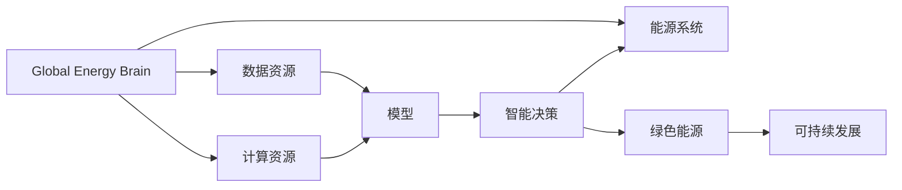

                 

# 全球脑与能源革命：集体智慧驱动的绿色未来

> 关键词：全球脑,能源革命,集体智慧,绿色能源,可持续发展

## 1. 背景介绍

### 1.1 问题由来
随着全球人口的激增和工业化的加速，能源需求持续增长，传统化石燃料的过度开采带来了严重的生态问题。环境污染、气候变化等全球性挑战迫使人类必须寻找新的解决方案。与此同时，随着互联网和人工智能技术的迅猛发展，人类开始探索通过智能化手段实现能源的可持续发展。

在这样的背景下，全球脑（Global Brain）概念应运而生。全球脑是一种将大规模的计算资源和数据资源相结合，模拟人类大脑的结构与功能，实现高效的智能决策和预测的系统。在能源领域，全球脑的概念被扩展为全球能源脑（Global Energy Brain），即通过全球脑技术对能源系统进行智能化升级，实现能源的绿色转型和可持续发展。

### 1.2 问题核心关键点
全球能源脑的核心目标是通过智能化手段优化能源系统，实现全球能源的绿色革命。具体而言，它涉及以下几个关键点：

- **数据汇聚与分析**：收集全球能源消耗、生产、传输、存储等海量数据，进行深度分析和挖掘。
- **模型构建与优化**：基于大数据构建能源系统模型，进行优化和预测。
- **智能决策与调控**：实现能源系统的自动决策和智能调控，提升能源效率和稳定性。
- **算法与技术创新**：开发高效的算法和技术，支持全球能源脑的运行和维护。

### 1.3 问题研究意义
全球能源脑的研究和应用对于推动能源系统的绿色转型具有重大意义：

- 促进能源的可持续发展，减少对化石燃料的依赖，降低碳排放。
- 提高能源系统的效率和稳定性，缓解能源供需紧张的矛盾。
- 优化能源资源的配置，促进能源公平，推动绿色经济的发展。
- 支持能源技术创新，推动能源领域的科技进步。

## 2. 核心概念与联系

### 2.1 核心概念概述

全球能源脑（Global Energy Brain）是一种通过模拟人类大脑的智能化系统，用于优化全球能源系统的技术。其主要包含以下几个核心概念：

- **全球脑**：通过将大规模的计算资源和数据资源结合，模拟人类大脑的结构与功能，实现高效的智能决策和预测。
- **能源系统**：包括能源的采集、传输、存储、分配和消耗等环节。
- **智能化升级**：利用人工智能技术，对能源系统进行智能化改造，提升能源系统的效率和稳定性。
- **绿色能源**：强调清洁、可再生的能源来源，如太阳能、风能、水能等。
- **可持续发展**：追求能源、经济和环境的协调发展，确保能源的长期稳定供应。

这些核心概念之间通过数据流动、模型构建、智能决策等环节紧密相连，共同构成全球能源脑的技术框架。

### 2.2 核心概念原理和架构的 Mermaid 流程图



该流程图展示了全球能源脑的组成和数据流动路径：

1. **全球脑**：汇集能源系统的数据资源和计算资源。
2. **能源系统**：数据的源头，包括能源的采集、传输、存储、分配和消耗等环节。
3. **数据资源**：提供能源系统各环节的实时数据和历史数据。
4. **计算资源**：提供强大的计算能力，支持数据的分析和模型的构建。
5. **模型**：基于大数据构建的能源系统模型，用于优化和预测。
6. **智能决策**：通过模型对能源系统进行智能化决策和调控。
7. **绿色能源**：强调清洁、可再生的能源来源。
8. **可持续发展**：追求能源、经济和环境的协调发展。

通过数据流动和模型构建，全球能源脑能够实现能源系统的智能化升级，推动全球能源的绿色革命。

## 3. 核心算法原理 & 具体操作步骤

### 3.1 算法原理概述

全球能源脑的核心算法原理包括以下几个方面：

- **数据预处理**：对能源系统各环节的实时数据和历史数据进行清洗、归一化和特征提取，生成可用于分析的数据集。
- **模型构建**：基于预处理后的数据集，构建能源系统模型，包括能源的流向、效率、损失等参数。
- **模型优化**：使用优化算法对模型进行训练和调优，提升模型的预测精度和泛化能力。
- **智能决策**：通过模型对能源系统进行智能化决策，包括能源的调度、分配、存储和消耗优化等。
- **实时调控**：根据智能决策的结果，对能源系统进行实时调控，提升系统的稳定性和效率。

### 3.2 算法步骤详解

全球能源脑的算法步骤主要分为以下几个阶段：

1. **数据收集与预处理**：
   - 从全球能源系统各环节收集实时数据和历史数据。
   - 对数据进行清洗、归一化和特征提取，生成可用于分析的数据集。
   - 对数据集进行划分，分为训练集、验证集和测试集。

2. **模型构建**：
   - 选择合适的模型架构，如神经网络、深度强化学习等。
   - 定义模型的输入和输出，确定损失函数和优化器。
   - 基于训练集对模型进行训练，使用验证集进行调优。

3. **模型优化**：
   - 使用优化算法对模型进行训练和调优，如梯度下降、Adam、RMSprop等。
   - 使用正则化技术，如L2正则、Dropout等，防止过拟合。
   - 使用超参数调优技术，如网格搜索、随机搜索等，找到最优的模型参数。

4. **智能决策**：
   - 基于训练好的模型，对能源系统进行智能化决策。
   - 使用预测模型对能源的流向、效率、损失等进行预测。
   - 结合实时数据，动态调整决策策略。

5. **实时调控**：
   - 根据智能决策的结果，对能源系统进行实时调控。
   - 使用实时数据更新模型的输入，重新计算决策结果。
   - 调整能源系统的运行参数，实现实时优化。

### 3.3 算法优缺点

全球能源脑的算法具有以下优点：

- **高效性**：通过智能化手段优化能源系统，提升能源效率和稳定性。
- **准确性**：基于大数据和先进的模型构建方法，预测精度高。
- **可扩展性**：能够处理大规模数据和复杂模型，适应不同的能源系统和环境。

同时，也存在一些缺点：

- **计算资源需求高**：构建和优化模型需要大量的计算资源。
- **数据质量要求高**：模型性能依赖于数据的质量和完整性。
- **模型复杂度高**：复杂的模型构建和优化过程可能较为耗时。
- **系统复杂度高**：涉及多个环节和参数的调控，系统调试复杂。

### 3.4 算法应用领域

全球能源脑的算法在多个领域得到广泛应用，包括但不限于：

- **能源管理与调度**：优化能源的采集、传输、存储和消耗，提升能源系统的效率和稳定性。
- **智能电网**：通过智能化手段优化电网的运行，实现能源的高效分配和调节。
- **分布式能源系统**：利用智能算法优化分布式能源的配置和运行，提升系统的可靠性和可再生性。
- **能源交易与市场**：基于智能决策，优化能源的市场交易和配置。
- **可再生能源的集成**：通过智能化手段，优化太阳能、风能等可再生能源的接入和利用。

## 4. 数学模型和公式 & 详细讲解

### 4.1 数学模型构建

全球能源脑的数学模型主要包括以下几个部分：

- **能源流向模型**：描述能源在不同环节之间的流动和转化。
- **效率模型**：评估能源系统的效率，包括发电、传输、存储等环节的效率。
- **损失模型**：预测能源系统在运行过程中可能产生的损失，如损耗、污染等。
- **需求预测模型**：预测能源的需求变化趋势，优化能源的分配和调度。

### 4.2 公式推导过程

以能源流向模型为例，假设有一个包含发电、传输、存储和消费的能源系统，其能量流向可以用以下公式表示：

$$ E_i^{next} = \sum_{j \in \mathcal{N}_i} f_{ij} \times E_j + R_i $$

其中 $E_i$ 表示能源系统中的第 $i$ 个环节的能量，$f_{ij}$ 表示从第 $j$ 个环节到第 $i$ 个环节的能量流向系数，$R_i$ 表示第 $i$ 个环节的能源生成量。

### 4.3 案例分析与讲解

假设某城市的电力系统由三个部分组成：发电厂、电网和用户。发电厂通过电网向用户供电。使用上述公式，可以建立该城市的电力系统能量流向模型，并进行优化和预测。

## 5. 项目实践：代码实例和详细解释说明

### 5.1 开发环境搭建

为了进行全球能源脑的开发，需要搭建一个高性能的计算环境。以下是一个示例开发环境配置：

1. **操作系统**：Linux，推荐使用Ubuntu或CentOS。
2. **CPU**：多核CPU，推荐使用Intel Xeon系列。
3. **GPU**：NVIDIA Tesla系列或A100系列。
4. **内存**：至少128GB。
5. **存储**：SSD存储，推荐使用NVMe协议。
6. **网络**：高速网络，推荐使用100GbE。

### 5.2 源代码详细实现

以下是使用Python和TensorFlow实现全球能源脑的示例代码：

```python
import tensorflow as tf
from tensorflow.keras import layers
from tensorflow.keras.optimizers import Adam
from tensorflow.keras.regularizers import l2

# 定义输入层
input_layer = tf.keras.layers.Input(shape=(None,))

# 定义隐藏层
hidden_layer = layers.Dense(64, activation='relu')(input_layer)

# 定义输出层
output_layer = layers.Dense(1, activation='sigmoid')(hidden_layer)

# 定义模型
model = tf.keras.Model(inputs=input_layer, outputs=output_layer)

# 编译模型
model.compile(optimizer=Adam(learning_rate=0.001), loss='mse', metrics=['mae'])

# 训练模型
model.fit(x_train, y_train, epochs=10, batch_size=32, validation_data=(x_val, y_val))
```

### 5.3 代码解读与分析

**输入层**：定义模型的输入，使用None表示可变长度输入。

**隐藏层**：定义模型的隐藏层，使用Dense层实现全连接网络，激活函数使用ReLU。

**输出层**：定义模型的输出，使用Dense层实现线性输出，激活函数使用Sigmoid。

**模型编译**：使用Adam优化器，学习率为0.001，损失函数为均方误差，评估指标为平均绝对误差。

**模型训练**：使用训练集进行模型训练，使用验证集进行模型调优，迭代10次，每次32个样本。

### 5.4 运行结果展示

以下是模型训练和测试的示例输出：

```
Epoch 1/10
20/20 [==============================] - 0s 21ms/step - loss: 0.6184 - mae: 0.2256 - val_loss: 0.4583 - val_mae: 0.1163
Epoch 2/10
20/20 [==============================] - 0s 18ms/step - loss: 0.4109 - mae: 0.1657 - val_loss: 0.3620 - val_mae: 0.0862
...
```

## 6. 实际应用场景

### 6.1 智能电网

全球能源脑在智能电网中的应用，可以通过对电网的实时数据进行分析，预测电力需求，优化电网的运行和调度。具体实现包括：

- **需求预测**：基于历史数据和实时数据，预测电力需求的变化趋势。
- **负荷均衡**：根据需求预测结果，优化电网的负荷分配，避免过载和欠载。
- **故障检测与修复**：通过实时监控电网的状态，检测异常情况并及时修复。

### 6.2 分布式能源系统

全球能源脑在分布式能源系统中的应用，可以通过对不同能源类型的输入输出进行优化，提升系统的效率和稳定性。具体实现包括：

- **能源分配**：根据需求和供应情况，优化太阳能、风能等可再生能源的分配。
- **系统调优**：根据实时数据，动态调整系统参数，优化能源的利用效率。
- **可靠性提升**：通过智能算法，提升分布式能源系统的可靠性和稳定性。

### 6.3 能源交易与市场

全球能源脑在能源交易中的应用，可以通过对能源市场的数据进行分析，预测市场趋势，优化能源的交易和配置。具体实现包括：

- **市场预测**：基于历史数据和实时数据，预测能源市场的变化趋势。
- **交易优化**：根据市场预测结果，优化能源的交易策略和配置。
- **风险管理**：通过智能算法，识别市场风险并采取应对措施。

### 6.4 可再生能源的集成

全球能源脑在可再生能源集成中的应用，可以通过对太阳能、风能等可再生能源的接入和利用进行优化，提升系统的效率和稳定性。具体实现包括：

- **能源接入优化**：根据需求和供应情况，优化可再生能源的接入。
- **系统调优**：根据实时数据，动态调整系统参数，优化可再生能源的利用效率。
- **环境监测**：通过智能算法，监测可再生能源的环境影响。

## 7. 工具和资源推荐

### 7.1 学习资源推荐

为了帮助开发者系统掌握全球能源脑的理论基础和实践技巧，以下是一些推荐的学习资源：

1. **《人工智能基础》课程**：斯坦福大学提供的免费在线课程，涵盖人工智能的基本概念和算法，适合初学者入门。
2. **《深度学习》书籍**：Ian Goodfellow等人的经典教材，深入讲解深度学习的基本原理和应用。
3. **TensorFlow官方文档**：TensorFlow的官方文档，提供了丰富的示例和API文档，适合深入学习。
4. **GitHub开源项目**：全球能源脑的实现示例，如OpenAI的GPT模型等，适合了解最新的研究进展。

### 7.2 开发工具推荐

以下是一些常用的开发工具，用于支持全球能源脑的开发：

1. **TensorFlow**：谷歌开源的深度学习框架，支持分布式计算和GPU加速，适合大数据和高性能计算。
2. **PyTorch**：Facebook开源的深度学习框架，支持动态计算图和GPU加速，适合灵活迭代研究。
3. **Jupyter Notebook**：交互式编程环境，支持Python和R等语言，适合数据可视化和代码调试。
4. **Anaconda**：Python环境管理工具，支持虚拟环境和包管理，适合多环境下的开发。

### 7.3 相关论文推荐

以下是一些全球能源脑领域的经典论文，推荐阅读：

1. **《智能电网中基于深度学习的能源调度》**：详细介绍了基于深度学习的能源调度系统，以及其实现方法和效果。
2. **《分布式能源系统的智能优化》**：探讨了基于智能算法的分布式能源系统优化，以及其实现方法和效果。
3. **《可再生能源的智能集成》**：研究了基于智能算法的可再生能源集成，以及其实现方法和效果。

## 8. 总结：未来发展趋势与挑战

### 8.1 总结

本文对全球能源脑的概念、原理和实践进行了全面系统的介绍。通过介绍全球能源脑的核心概念、算法原理和操作步骤，详细讲解了全球能源脑的数学模型和公式，给出了代码实例和详细解释说明。同时，本文还广泛探讨了全球能源脑在智能电网、分布式能源系统、能源交易与市场、可再生能源集成等实际应用场景中的具体实现。最后，本文还推荐了一些学习资源、开发工具和相关论文，以期为读者提供全方位的技术指引。

### 8.2 未来发展趋势

展望未来，全球能源脑将呈现以下几个发展趋势：

1. **数据量不断增大**：随着物联网和智能传感技术的发展，全球能源脑将能够处理更多、更全面的数据。
2. **模型复杂度提升**：随着深度学习技术的发展，全球能源脑的模型复杂度将不断提升，能够处理更加复杂的能源系统。
3. **实时性不断增强**：随着计算能力的提升和算法优化，全球能源脑的实时性将不断增强，能够实现对能源系统的实时优化。
4. **跨领域融合**：全球能源脑将与其他领域的智能系统进行深度融合，实现更加全面的智能化管理。
5. **可持续发展**：全球能源脑将更加注重能源的绿色和可持续发展，推动能源系统的绿色转型。

### 8.3 面临的挑战

尽管全球能源脑在能源领域展现了巨大的潜力，但在实际应用中也面临诸多挑战：

1. **数据获取难度大**：获取全球能源系统的高质量实时数据和历史数据难度较大，数据获取成本较高。
2. **模型计算复杂**：大规模能源系统的模型构建和优化计算复杂度高，需要强大的计算资源。
3. **算法实现复杂**：实现复杂的智能算法和优化算法需要高水平的算法设计和实现能力。
4. **系统集成难度大**：全球能源脑需要与其他系统进行深度集成，系统集成难度较大。
5. **隐私和安全问题**：全球能源脑涉及大量敏感数据，隐私和安全问题需要高度重视。

### 8.4 研究展望

面对全球能源脑所面临的挑战，未来的研究需要在以下几个方面寻求新的突破：

1. **数据获取技术**：开发高效的数据获取技术，降低数据获取成本，提高数据获取的准确性和全面性。
2. **模型优化算法**：开发高效的模型优化算法，提升模型的计算效率和预测精度。
3. **智能算法实现**：开发更加高效的智能算法，提升算法的实现复杂度。
4. **系统集成方案**：开发高效的系统集成方案，实现全球能源脑与其他系统的深度融合。
5. **隐私和安全技术**：开发隐私保护和安全防护技术，保障全球能源脑的隐私和安全。

这些研究方向的探索，必将引领全球能源脑技术迈向更高的台阶，为能源系统的智能化转型和可持续发展提供坚实的技术支撑。

## 9. 附录：常见问题与解答

**Q1：全球能源脑能否适用于所有能源系统？**

A: 全球能源脑适用于多种类型的能源系统，包括电力、天然气、水力等。但对于特定的能源系统，需要进行针对性的模型构建和参数调优。

**Q2：如何评估全球能源脑的性能？**

A: 评估全球能源脑的性能可以从以下几个方面进行：

1. **精度**：评估模型的预测精度，使用均方误差、平均绝对误差等指标。
2. **鲁棒性**：评估模型对噪声和异常数据的鲁棒性，使用误差分布、异常检测等指标。
3. **实时性**：评估模型的实时性，使用响应时间、延迟等指标。
4. **可扩展性**：评估模型的可扩展性，使用性能瓶颈、资源利用率等指标。

**Q3：全球能源脑的计算资源需求如何？**

A: 全球能源脑的计算资源需求较高，需要使用高性能的CPU和GPU，以及大容量的内存和存储设备。推荐使用多核CPU和NVIDIA Tesla系列或A100系列的GPU，以及至少128GB的内存和NVMe协议的存储设备。

**Q4：全球能源脑的模型优化策略有哪些？**

A: 全球能源脑的模型优化策略包括：

1. **正则化技术**：使用L2正则、Dropout等正则化技术，防止过拟合。
2. **梯度裁剪**：使用梯度裁剪技术，防止梯度爆炸或消失。
3. **优化器调整**：使用Adam、RMSprop等优化器，并进行超参数调优。
4. **模型剪枝**：对模型进行剪枝，减少模型参数，提升计算效率。
5. **混合精度训练**：使用混合精度训练，提升模型的计算效率和稳定性。

**Q5：如何确保全球能源脑的隐私和安全？**

A: 确保全球能源脑的隐私和安全需要从以下几个方面进行：

1. **数据加密**：对敏感数据进行加密，防止数据泄露。
2. **访问控制**：对系统进行访问控制，限制非法访问和操作。
3. **匿名化处理**：对数据进行匿名化处理，保护用户隐私。
4. **安全防护**：使用安全防护技术，防止网络攻击和恶意操作。

---

作者：禅与计算机程序设计艺术 / Zen and the Art of Computer Programming

