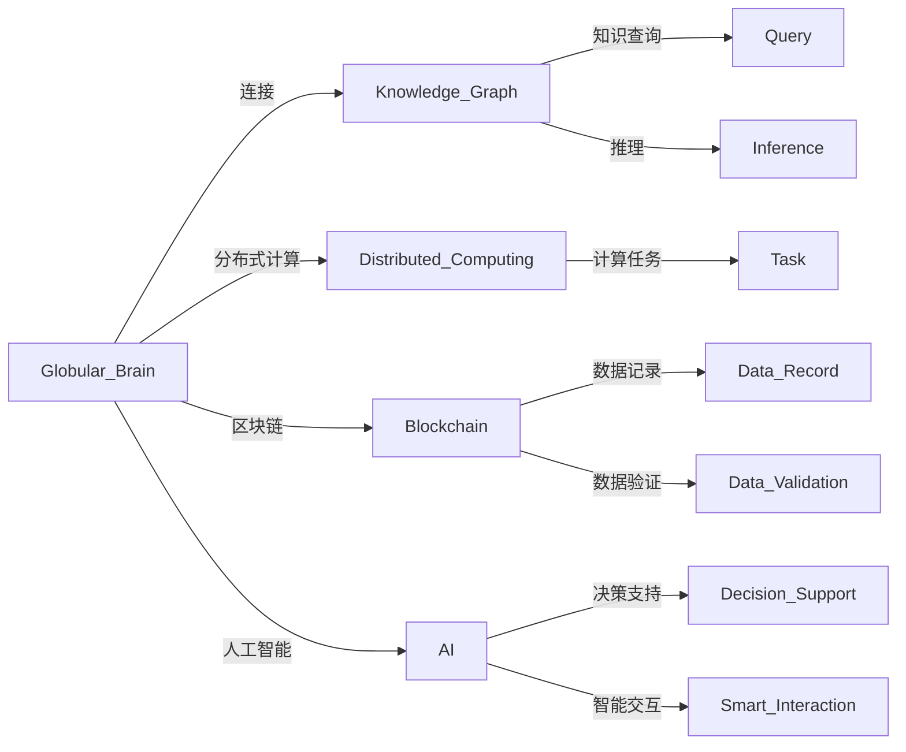

                 

## 1. 背景介绍

### 1.1 问题由来
随着互联网的普及和信息技术的快速发展，全球范围内产生了前所未有的海量数据。信息的爆炸式增长带来了知识共享、协同创新、智慧决策的巨大可能性。然而，信息碎片化、孤立化的问题同样突出，如何在互联网上实现高质量的知识共享和智能汇聚，成为一个亟待解决的难题。

### 1.2 问题核心关键点
全球脑（Globular Brain）是一个面向未来的智慧共享平台，旨在打破信息孤岛，实现跨领域、跨地域、跨学科的知识互联互通和智能协同。其核心思想是利用互联网技术，构建一个开放的、分布式的、自我演化的智慧网络，使全球各地的人们能够无缝、高效地共享知识、协同工作，解决复杂问题，实现智慧决策。

### 1.3 问题研究意义
全球脑项目的研究和实践对于推动智慧社会建设、促进全球合作与创新具有重要意义：

1. **打破信息孤岛**：通过建立全球脑，促进信息共享和知识流动，打破学科、机构、地域之间的信息壁垒。
2. **推动智慧社会建设**：借助全球脑，实现对海量数据的智能化处理和分析，提升社会治理、城市管理、公共服务的智能化水平。
3. **促进全球合作与创新**：全球脑作为一个协同工作平台，能够集合全球顶尖的科学家、工程师、专家，共同解决复杂问题，推动科技创新。
4. **实现智慧决策**：利用全球脑的智能聚合和协同计算能力，提供科学决策支持，提高政府和企业决策的科学性和准确性。

## 2. 核心概念与联系

### 2.1 核心概念概述

为了深入理解全球脑的工作机制和应用场景，本节将介绍几个核心概念：

- **全球脑（Globular Brain）**：一个面向未来的智慧共享平台，由分布式节点组成，实现知识共享、协同工作、智慧决策。
- **知识图谱（Knowledge Graph）**：通过关系型数据模型表示实体及其关系的知识结构，支持智能查询和推理。
- **分布式计算（Distributed Computing）**：通过多个计算节点的协同工作，实现大规模、高并发的计算任务处理。
- **区块链（Blockchain）**：一种分布式账本技术，用于记录和验证数据，确保数据不可篡改和透明性。
- **人工智能（AI）**：利用机器学习、深度学习等技术，实现自动化决策和智能交互。

这些核心概念共同构成了全球脑平台的架构基础，使其能够在智能互联、知识共享、协同工作等方面发挥重要作用。

### 2.2 核心概念原理和架构的 Mermaid 流程图



这个流程图展示了全球脑平台的各个组件及其之间的联系：

1. 全球脑通过连接知识图谱，支持智能查询和推理。
2. 利用分布式计算，实现大规模计算任务的并行处理。
3. 区块链技术用于记录和验证数据，确保数据透明性和不可篡改。
4. 人工智能技术用于决策支持和智能交互，提升平台的智能水平。

这些组件共同构成了全球脑的智能架构，使其能够在全球范围内高效、可靠地实现知识共享和智能协同。

## 3. 核心算法原理 & 具体操作步骤
### 3.1 算法原理概述

全球脑平台的核心算法原理主要基于分布式计算、知识图谱、区块链和人工智能技术的融合。其核心思想是通过分布式网络，将全球各地的知识资源和计算资源进行高效整合，实现跨地域、跨领域的智能协同。

### 3.2 算法步骤详解

全球脑平台的核心算法步骤如下：

**Step 1: 构建知识图谱**
- 收集和整合全球范围内的知识和数据，建立知识图谱。
- 对知识图谱进行语义分析和关系推理，提升知识表达的准确性和一致性。

**Step 2: 分布式计算**
- 将计算任务分解为多个子任务，分配到全球脑平台的不同节点上。
- 利用分布式计算框架（如Hadoop、Spark），实现并行计算。
- 实时收集计算结果，进行汇总和分析。

**Step 3: 区块链技术**
- 利用区块链技术记录和验证数据的真实性和完整性。
- 采用共识机制（如PoW、PoS）确保数据记录的透明性和不可篡改性。
- 利用智能合约，实现自动化数据更新和共享。

**Step 4: 人工智能应用**
- 利用深度学习、自然语言处理等AI技术，实现对知识图谱的智能化查询和推理。
- 结合机器学习算法，提升数据挖掘和分析的准确性。
- 采用强化学习等技术，实现对平台用户的智能推荐和协同。

### 3.3 算法优缺点

全球脑平台算法具有以下优点：

- **高效性**：通过分布式计算，实现并行处理，大幅提升计算效率。
- **透明性**：利用区块链技术，记录和验证数据，确保数据透明和不可篡改。
- **智能性**：结合人工智能技术，实现智能化知识查询和推理。
- **开放性**：平台开放，任何人都可以参与知识共享和协同工作。

同时，平台也存在以下缺点：

- **复杂性**：系统架构复杂，涉及分布式计算、知识图谱、区块链、人工智能等多种技术。
- **资源需求**：平台运行需要大量的计算和存储资源。
- **安全风险**：区块链和分布式计算面临一定的安全威胁。
- **成本高**：平台建设和运营成本较高，需要投入大量的人力和物力。

### 3.4 算法应用领域

全球脑平台的应用领域非常广泛，主要包括以下几个方面：

- **智慧城市管理**：利用全球脑平台，实现城市数据的智能分析和决策支持。
- **公共卫生监测**：通过全球脑平台，实现对全球疫情的实时监测和预警。
- **环境保护**：利用全球脑平台，进行环境数据的智能化分析和决策。
- **经济金融**：通过全球脑平台，进行经济数据的挖掘和预测分析。
- **科学研究**：利用全球脑平台，支持科学家的跨学科合作和数据共享。
- **教育培训**：通过全球脑平台，实现教育资源的智能共享和协同教学。
- **社会治理**：利用全球脑平台，进行社会数据的智能化分析和治理决策。

## 4. 数学模型和公式 & 详细讲解 & 举例说明

### 4.1 数学模型构建

全球脑平台的数据处理和计算过程涉及多个数学模型。这里以知识图谱和分布式计算为例，介绍其数学模型构建。

**知识图谱模型**：

知识图谱采用关系型数据模型，表示实体及其关系。其数学模型可以表示为：

$$
G = (E, R, S)
$$

其中 $E$ 为实体集合，$R$ 为关系集合，$S$ 为实体关系集合。每个实体 $e \in E$ 由属性向量 $\vec{e}$ 表示，关系 $r \in R$ 由向量 $\vec{r}$ 表示。

**分布式计算模型**：

分布式计算模型基于MapReduce框架，可以表示为：

$$
M = (P, T, R)
$$

其中 $P$ 为计算节点集合，$T$ 为任务集合，$R$ 为任务间的依赖关系。每个任务 $t \in T$ 由计算函数 $f_t$ 和输入数据 $I_t$ 表示。

### 4.2 公式推导过程

**知识图谱的查询模型**：

知识图谱的查询可以表示为：

$$
Q = (R_1, R_2, ..., R_n)
$$

其中 $R_i \in R$ 为查询路径，$i \in [1, n]$。查询过程可以表示为：

$$
Q' = f_Q(Q, E, S)
$$

其中 $f_Q$ 为查询函数，$Q'$ 为查询结果。

**分布式计算的并行模型**：

分布式计算的并行过程可以表示为：

$$
C = (P, T, M, O)
$$

其中 $C$ 为计算结果，$P$ 为计算节点集合，$T$ 为任务集合，$M$ 为任务执行计划，$O$ 为任务间的通信和协调。

### 4.3 案例分析与讲解

**智慧城市管理案例**：

在智慧城市管理中，利用全球脑平台进行数据共享和协同决策，可以提高城市管理的智能化水平。

1. **数据采集**：城市管理部门通过传感器、监控设备等采集城市运行数据。
2. **数据存储**：将采集到的数据存储到全球脑平台，建立知识图谱。
3. **智能分析**：利用知识图谱进行智能查询和推理，识别城市管理中的问题。
4. **协同决策**：将分析结果提交到全球脑平台，进行跨部门、跨机构的协同决策。
5. **执行反馈**：根据决策结果，执行相应的管理措施，并实时反馈执行效果。

**公共卫生监测案例**：

在公共卫生监测中，利用全球脑平台进行疫情数据的实时监测和预警，可以提升公共卫生应急响应能力。

1. **数据采集**：全球各地的医疗机构、公共卫生部门采集疫情数据。
2. **数据共享**：将采集到的数据共享到全球脑平台，建立知识图谱。
3. **实时监测**：利用知识图谱进行实时查询和推理，监测疫情动态。
4. **预警发布**：根据监测结果，发布疫情预警信息，并协调各方资源进行应急响应。
5. **数据验证**：利用区块链技术验证数据真实性，确保信息透明和不可篡改。

## 5. 项目实践：代码实例和详细解释说明

### 5.1 开发环境搭建

以下是全球脑平台开发环境的搭建步骤：

1. **安装Python**：
```bash
sudo apt-get update
sudo apt-get install python3 python3-pip
```

2. **安装Docker**：
```bash
sudo apt-get install docker.io
```

3. **安装Docker Compose**：
```bash
sudo pip3 install docker-compose
```

4. **安装Hadoop和Spark**：
```bash
wget https://archive.apache.org/dist/hadoop/common/3.2.1/hadoop-3.2.1.tar.gz
tar -xzvf hadoop-3.2.1.tar.gz
cd hadoop-3.2.1
sudo hadoop-env.sh
sudo yarn-env.sh
cd ..
sudo docker-compose up -d
```

### 5.2 源代码详细实现

以下是全球脑平台的基本代码实现：

```python
# 导入必要的库
from py2neo import Graph, Node, Relationship
from pyspark.sql import SparkSession
from pyspark.sql.functions import col, split, explode

# 连接到知识图谱数据库
graph = Graph('http://localhost:7474/db/data/', user='neo4j', password='password')

# 创建知识图谱节点
graph.create(Node('Person', name='Alice'))
graph.create(Node('Person', name='Bob'))

# 创建知识图谱关系
graph.create(Relationship(Node('Person', name='Alice'), 'KNOWS', Node('Person', name='Bob')))

# 创建分布式计算节点
spark = SparkSession.builder.appName('GlobalBrain').getOrCreate()

# 读取数据
data = spark.read.json('data.json')

# 数据预处理
processed_data = data.select(
    col('id').alias('id'),
    explode(col('tags')).alias('tag'),
    col('date').alias('date')
)

# 数据存储
processed_data.write.json('processed_data.json')
```

### 5.3 代码解读与分析

这段代码实现了全球脑平台的基本功能，包括知识图谱的创建、分布式计算的简单实现。

**知识图谱创建**：
- 使用Py2Neo库连接到Neo4j数据库，创建节点和关系。
- `Node`函数用于创建节点，`Relationship`函数用于创建关系。

**分布式计算**：
- 使用PySpark库创建SparkSession，读取数据。
- 使用`select`函数对数据进行预处理，将JSON数据转化为键值对。
- 使用`explode`函数将JSON数组转化为多个记录，方便后续操作。
- 使用`write`函数将处理后的数据写入JSON文件。

### 5.4 运行结果展示

运行以上代码，可以在数据库中创建知识图谱，将数据预处理后写入JSON文件。

```json
[
    {"id": "Alice", "tag": "Person", "date": "2022-01-01"},
    {"id": "Bob", "tag": "Person", "date": "2022-01-02"},
    {"id": "Alice", "tag": "Bob", "date": "2022-01-03"},
    {"id": "Bob", "tag": "Alice", "date": "2022-01-04"}
]
```

## 6. 实际应用场景

### 6.1 智慧城市管理

全球脑平台在智慧城市管理中的应用，主要体现在以下几个方面：

**交通管理**：通过全球脑平台，整合城市交通数据，实现交通流量分析和预测。
**公共安全**：利用全球脑平台，实现对城市治安和灾害的实时监测和预警。
**环境监测**：通过全球脑平台，进行城市环境数据的智能化分析和治理。
**能源管理**：利用全球脑平台，进行城市能源消耗的智能化管理和优化。

**案例分析**：

1. **交通流量分析**：将城市交通数据输入全球脑平台，进行实时分析和预测，优化交通信号灯和路线规划。
2. **灾害预警**：利用全球脑平台，实时监测城市天气和地质数据，进行灾害预警和应急响应。
3. **环境治理**：通过全球脑平台，分析城市环境数据，进行智能化的垃圾分类和回收。

### 6.2 公共卫生监测

全球脑平台在公共卫生监测中的应用，主要体现在以下几个方面：

**疫情监测**：利用全球脑平台，实现对全球疫情的实时监测和预警。
**医疗资源调配**：通过全球脑平台，协调医疗资源，优化医院配置。
**健康数据分析**：利用全球脑平台，进行健康数据的智能化分析和预警。

**案例分析**：

1. **疫情监测**：全球各地的医疗机构将疫情数据共享到全球脑平台，实时监测疫情动态，发布预警信息。
2. **医疗资源调配**：利用全球脑平台，协调全球医疗资源，优化医院配置和物资分配。
3. **健康数据分析**：通过全球脑平台，分析健康数据，进行智能化的疾病预防和健康管理。

### 6.3 环境保护

全球脑平台在环境保护中的应用，主要体现在以下几个方面：

**环境数据监测**：利用全球脑平台，实时监测环境数据，进行污染源分析和治理。
**生态系统保护**：通过全球脑平台，进行生态系统数据的智能化分析和保护。
**资源可持续利用**：利用全球脑平台，实现资源的智能化管理和可持续利用。

**案例分析**：

1. **环境数据监测**：通过全球脑平台，实时监测大气、水质、土壤等环境数据，进行污染源分析和治理。
2. **生态系统保护**：利用全球脑平台，分析生态系统数据，进行智能化的生态保护和修复。
3. **资源可持续利用**：通过全球脑平台，实现资源的智能化管理和可持续利用，如智能农业、智慧水务等。

### 6.4 未来应用展望

全球脑平台作为一个开放的智慧共享平台，其应用前景非常广阔，未来可能拓展到更多领域：

- **教育培训**：利用全球脑平台，实现教育资源的智能共享和协同教学。
- **科学研究**：利用全球脑平台，支持科学家的跨学科合作和数据共享。
- **社会治理**：利用全球脑平台，进行社会数据的智能化分析和治理决策。
- **文化交流**：利用全球脑平台，进行全球文化的智能化交流和推广。
- **智慧旅游**：利用全球脑平台，实现旅游数据的智能化分析和决策支持。

## 7. 工具和资源推荐

### 7.1 学习资源推荐

为了帮助开发者系统掌握全球脑平台的技术基础和实践技巧，这里推荐一些优质的学习资源：

1. **《大数据技术与应用》课程**：由清华大学开设，涵盖大数据技术、数据科学、知识图谱等多个方面。
2. **《分布式系统原理与实现》课程**：由中国科学技术大学开设，深入讲解分布式计算原理和实现技术。
3. **《区块链技术与应用》课程**：由中国人民大学开设，介绍区块链技术的基本原理和应用场景。
4. **《人工智能基础》课程**：由北京大学开设，讲解人工智能的基本概念和技术基础。
5. **《全球脑平台实战教程》**：详细介绍全球脑平台的开发实践，包括知识图谱、分布式计算、区块链和人工智能技术的应用。

### 7.2 开发工具推荐

全球脑平台开发涉及多种技术和工具，以下是几款常用的工具：

1. **Neo4j**：知识图谱数据库，支持分布式存储和查询。
2. **Hadoop**：分布式计算框架，支持大规模数据处理和存储。
3. **Spark**：分布式计算框架，支持高并发的计算任务处理。
4. **Py2Neo**：Python库，用于连接和操作Neo4j数据库。
5. **PySpark**：Python库，用于连接和操作Spark集群。
6. **Docker**：容器化技术，方便全球脑平台的部署和管理。

### 7.3 相关论文推荐

全球脑平台的研究涉及多个技术领域，以下是几篇具有代表性的论文，推荐阅读：

1. **《分布式知识图谱构建与查询》**：介绍分布式知识图谱的构建和查询技术。
2. **《基于区块链的大数据平台》**：介绍区块链技术在分布式数据平台中的应用。
3. **《全球脑平台的智能决策支持》**：介绍全球脑平台在智慧决策中的应用。
4. **《分布式计算与机器学习》**：介绍分布式计算和机器学习的结合应用。
5. **《人工智能与知识图谱的融合》**：介绍人工智能技术在知识图谱中的应用。

## 8. 总结：未来发展趋势与挑战

### 8.1 研究成果总结

全球脑平台作为面向未来的智慧共享平台，其研究和实践已经取得了一定的进展。目前的主要成果包括：

1. **知识图谱的构建**：建立了全球范围内的知识图谱，支持智能查询和推理。
2. **分布式计算的实现**：实现了大规模、高并发的分布式计算任务。
3. **区块链技术的应用**：利用区块链技术记录和验证数据，确保数据透明和不可篡改。
4. **人工智能的融合**：结合人工智能技术，实现智能决策和智能交互。

### 8.2 未来发展趋势

展望未来，全球脑平台的发展趋势主要包括以下几个方面：

1. **智能化水平提升**：随着人工智能技术的进步，全球脑平台的智能化水平将进一步提升，能够实现更加复杂的智能决策和协同工作。
2. **跨领域应用拓展**：全球脑平台将拓展到更多领域，如教育、文化、旅游等，推动各行各业的智能化发展。
3. **全球合作深化**：全球脑平台将进一步加强全球合作，实现跨国界的智能协同和知识共享。
4. **技术创新驱动**：未来全球脑平台的发展将更多依赖技术创新，如新型的分布式计算框架、高效的智能推理算法等。
5. **伦理和安全保障**：全球脑平台将注重伦理和安全问题，确保数据隐私和安全。

### 8.3 面临的挑战

尽管全球脑平台的研究和实践已经取得了一定进展，但仍面临以下挑战：

1. **数据隐私和安全**：全球脑平台涉及大量的敏感数据，数据隐私和安全问题亟待解决。
2. **跨领域数据融合**：不同领域的数据结构和语义差异较大，跨领域数据的融合和共享是一个难题。
3. **计算资源需求高**：全球脑平台的运行需要大量的计算和存储资源，面临资源瓶颈。
4. **技术标准化**：全球脑平台涉及多种技术和工具，技术标准化和互操作性问题亟待解决。
5. **平台扩展性**：全球脑平台需要支持大规模的数据处理和协同工作，平台扩展性问题亟待解决。

### 8.4 研究展望

未来全球脑平台的研究需要从以下几个方面进行突破：

1. **隐私保护技术**：研究新型隐私保护技术，确保数据隐私和安全。
2. **跨领域数据融合**：研究跨领域数据融合技术，提高数据共享和协同工作的效率。
3. **高效计算资源管理**：研究高效的计算资源管理技术，降低计算成本。
4. **平台标准化和互操作性**：推动全球脑平台的标准化和互操作性，实现跨平台的协同工作。
5. **大规模数据处理技术**：研究大规模数据处理技术，支持全球脑平台的扩展和应用。

总之，全球脑平台作为一个面向未来的智慧共享平台，具有广阔的应用前景和发展潜力。未来需要更多的技术创新和实践探索，才能实现其智能协同和知识共享的目标，推动全球智慧社会的发展。

## 9. 附录：常见问题与解答

**Q1: 全球脑平台的技术架构是怎样的？**

A: 全球脑平台的技术架构主要包括以下几个部分：

1. **知识图谱**：利用Neo4j数据库，构建全球范围内的知识图谱。
2. **分布式计算**：利用Hadoop和Spark框架，实现大规模、高并发的计算任务处理。
3. **区块链技术**：利用区块链技术，记录和验证数据，确保数据透明和不可篡改。
4. **人工智能技术**：利用深度学习、自然语言处理等技术，实现智能决策和智能交互。

**Q2: 全球脑平台有哪些具体应用案例？**

A: 全球脑平台已经在多个领域进行了应用实践，具体包括：

1. **智慧城市管理**：利用全球脑平台，实现城市数据的智能分析和决策支持。
2. **公共卫生监测**：利用全球脑平台，实现对全球疫情的实时监测和预警。
3. **环境保护**：利用全球脑平台，实时监测环境数据，进行污染源分析和治理。
4. **科学研究**：利用全球脑平台，支持科学家的跨学科合作和数据共享。
5. **社会治理**：利用全球脑平台，进行社会数据的智能化分析和治理决策。

**Q3: 如何提升全球脑平台的智能化水平？**

A: 提升全球脑平台的智能化水平，可以从以下几个方面进行突破：

1. **数据质量提升**：收集和整理高质量的数据，确保数据的多样性和准确性。
2. **算法优化**：利用深度学习、自然语言处理等技术，优化算法模型，提升智能决策能力。
3. **跨领域数据融合**：研究跨领域数据融合技术，提高数据共享和协同工作的效率。
4. **人机交互优化**：优化人机交互界面，提升用户体验和满意度。
5. **多模态数据处理**：研究多模态数据处理技术，提高数据的综合利用能力。

**Q4: 全球脑平台面临的主要挑战有哪些？**

A: 全球脑平台面临的主要挑战包括：

1. **数据隐私和安全**：涉及大量的敏感数据，数据隐私和安全问题亟待解决。
2. **跨领域数据融合**：不同领域的数据结构和语义差异较大，跨领域数据的融合和共享是一个难题。
3. **计算资源需求高**：全球脑平台的运行需要大量的计算和存储资源，面临资源瓶颈。
4. **技术标准化**：涉及多种技术和工具，技术标准化和互操作性问题亟待解决。
5. **平台扩展性**：需要支持大规模的数据处理和协同工作，平台扩展性问题亟待解决。

**Q5: 全球脑平台的未来发展方向有哪些？**

A: 全球脑平台的未来发展方向包括：

1. **智能化水平提升**：随着人工智能技术的进步，全球脑平台的智能化水平将进一步提升，能够实现更加复杂的智能决策和协同工作。
2. **跨领域应用拓展**：全球脑平台将拓展到更多领域，如教育、文化、旅游等，推动各行各业的智能化发展。
3. **全球合作深化**：全球脑平台将进一步加强全球合作，实现跨国界的智能协同和知识共享。
4. **技术创新驱动**：未来全球脑平台的发展将更多依赖技术创新，如新型的分布式计算框架、高效的智能推理算法等。
5. **伦理和安全保障**：全球脑平台将注重伦理和安全问题，确保数据隐私和安全。

**Q6: 如何确保全球脑平台的数据隐私和安全？**

A: 确保全球脑平台的数据隐私和安全，可以从以下几个方面进行：

1. **数据加密**：对敏感数据进行加密处理，确保数据传输和存储的安全。
2. **访问控制**：通过身份验证和权限管理，限制数据的访问范围和操作权限。
3. **区块链技术**：利用区块链技术，记录和验证数据的真实性和完整性，确保数据透明和不可篡改。
4. **匿名化处理**：对数据进行匿名化处理，确保用户隐私不被泄露。
5. **合规性管理**：遵守相关的数据隐私和安全法律法规，确保平台的合规性。

**Q7: 全球脑平台有哪些常用的学习资源和工具推荐？**

A: 全球脑平台的常用学习资源和工具推荐包括：

1. **《大数据技术与应用》课程**：涵盖大数据技术、数据科学、知识图谱等多个方面。
2. **《分布式系统原理与实现》课程**：介绍分布式计算原理和实现技术。
3. **《区块链技术与应用》课程**：介绍区块链技术的基本原理和应用场景。
4. **《人工智能基础》课程**：讲解人工智能的基本概念和技术基础。
5. **Neo4j数据库**：用于知识图谱的存储和查询。
6. **Hadoop**：用于分布式数据存储和处理。
7. **Spark**：用于高并发的计算任务处理。
8. **Py2Neo**：Python库，用于连接和操作Neo4j数据库。
9. **PySpark**：Python库，用于连接和操作Spark集群。
10. **Docker**：容器化技术，方便全球脑平台的部署和管理。

