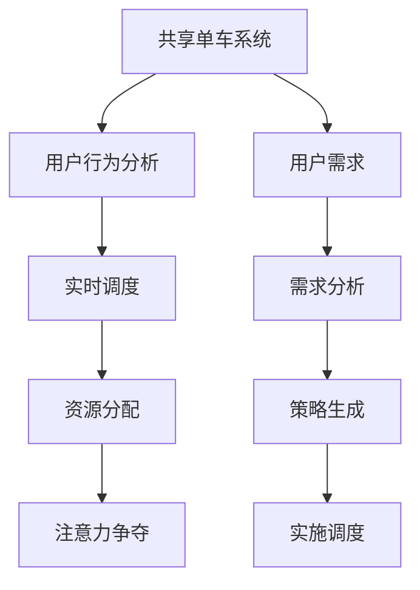

                 

# 共享单车：城市移动场景下的注意力争夺

## 1. 背景介绍

在当今城市化进程中，共享单车作为一种绿色、便捷的出行方式，正在越来越多城市中成为主流。通过对共享单车使用数据进行深入分析，我们发现共享单车的用户行为和资源分配存在显著的不均衡现象。这种不均衡现象导致部分区域的单车资源过度集中在部分时间，而其他区域或者时间资源匮乏，从而引发了严重的"注意力争夺"问题。

在移动场景下，如何有效解决注意力争夺，确保资源的合理分配和用户体验的优化，是一个亟待研究解决的问题。本文将详细探讨这一问题，分析其原理，并给出具体的解决方案。

## 2. 核心概念与联系

### 2.1 核心概念概述

为更好地理解移动场景下共享单车的注意力争夺问题，我们首先需要明确几个关键概念：

- **共享单车系统**：指以共享单车为载体的城市短途出行系统。由自行车、共享服务提供商、城市管理平台等组成，提供便捷、高效的出行服务。
- **注意力争夺**：指城市各区域和各个时间段内，共享单车的用户需求与供应之间的不均衡现象，导致部分区域的单车过度集中，部分区域需求难以满足，从而引发用户之间的"注意力争夺"。
- **资源分配**：指通过合理的策略和技术手段，优化共享单车资源的分布和使用，提升用户体验，降低运营成本。
- **实时调度**：指利用实时数据和算法，动态调整共享单车的投放、移动、调度等行为，以适应不断变化的用户需求。
- **用户行为分析**：通过数据挖掘和机器学习等手段，分析用户的使用习惯、行为偏好等特征，为决策提供数据支撑。

这些概念共同构成了共享单车系统中的核心问题，需要综合考虑技术和业务等多方面的因素，才能有效解决注意力争夺问题。

### 2.2 核心概念原理和架构的 Mermaid 流程图



## 3. 核心算法原理 & 具体操作步骤

### 3.1 算法原理概述

共享单车系统中的注意力争夺问题，可以通过实时调度算法来解决。该算法利用历史数据和实时数据，结合机器学习模型和优化算法，动态调整单车的投放、移动和调度，以平衡各个区域和各个时间段内的需求。

具体而言，实时调度算法需要：
1. 分析用户需求，识别出高需求区域和高需求时间。
2. 预测未来需求变化趋势，进行资源预分配。
3. 制定调度策略，将单车分配到需求较高的区域和时间。
4. 实时监控和调整，确保资源的合理使用和用户体验的优化。

### 3.2 算法步骤详解

以下是实时调度算法的详细步骤：

**Step 1: 数据收集与预处理**
- 收集历史和实时共享单车使用数据，包括单车数量、用户使用行为、天气等。
- 清洗和预处理数据，去除噪声和异常值。

**Step 2: 需求分析与预测**
- 利用时间序列分析等方法，对单车使用数据进行建模，预测未来需求变化。
- 根据预测结果，确定高需求区域和高需求时间。

**Step 3: 策略生成与优化**
- 生成多种调度策略，如单车投放、调度路径、调度频率等。
- 通过优化算法，如遗传算法、粒子群优化等，寻找最优策略。

**Step 4: 实时调度与调整**
- 根据当前和预测的用户需求，实时调整单车位置和数量。
- 使用决策树、神经网络等模型，实时评估策略效果，动态调整。

**Step 5: 评估与反馈**
- 对调度效果进行评估，包括单车使用率、用户满意度等。
- 收集用户反馈，进行策略改进和优化。

### 3.3 算法优缺点

实时调度算法的优点包括：
1. 动态调整资源，应对不断变化的用户需求。
2. 优化资源分配，提升用户体验和系统效率。
3. 预测需求变化，减少资源浪费和供应不足问题。

同时，该算法也存在一些局限性：
1. 数据依赖性强。需要收集和处理大量数据，对数据的及时性和准确性要求高。
2. 模型复杂度高。需要设计复杂的优化算法，计算量大，响应速度慢。
3. 对策略的优化需要不断试验和调整，难以保证效果最优。
4. 实时调度需要高效的技术手段，对技术要求高。

### 3.4 算法应用领域

实时调度算法不仅适用于共享单车系统，还广泛应用于交通规划、物流配送、无人驾驶等领域。这些领域中，用户需求和资源分配同样存在不均衡问题，实时调度算法能够有效平衡资源，提升系统性能和用户体验。

## 4. 数学模型和公式 & 详细讲解

### 4.1 数学模型构建

假设共享单车系统中有 $N$ 个区域，$T$ 个时间段，单车总量为 $C$，用户需求为 $D$。设单车在区域 $i$ 和时间段 $t$ 的供应量为 $S_{i,t}$，需求量为 $D_{i,t}$。则问题可以建模为：

$$
\min_{S_{i,t}} \sum_{i=1}^N \sum_{t=1}^T (D_{i,t} - S_{i,t})^2
$$

目标是最小化资源分配误差，即需求和供应的匹配度。

### 4.2 公式推导过程

利用优化理论中的线性规划（Linear Programming, LP）方法，我们可以构建上述问题的数学模型：

$$
\min_{S_{i,t}} \sum_{i=1}^N \sum_{t=1}^T w_{i,t}(D_{i,t} - S_{i,t})^2
$$

其中 $w_{i,t}$ 为需求权值，可以基于历史数据进行调整。构建决策变量 $x_{i,t}$ 表示单车在区域 $i$ 和时间段 $t$ 的分配量，有 $x_{i,t} \geq 0$。则优化问题可以转化为：

$$
\min_{x_{i,t}} \sum_{i=1}^N \sum_{t=1}^T w_{i,t}(D_{i,t} - x_{i,t})^2 \\
\text{s.t.} \quad \sum_{i=1}^N \sum_{t=1}^T x_{i,t} = C \\
x_{i,t} \geq 0
$$

### 4.3 案例分析与讲解

以某城市共享单车系统为例，假设有 $N=5$ 个区域，$T=7$ 个时间段，单车总数为 $C=500$。需求 $D_{i,t}$ 通过历史数据建模预测得到，需求权值 $w_{i,t}$ 基于需求量进行加权。利用优化算法求解上述模型，得到最优的单车分配方案，满足系统效率和用户体验。

## 5. 项目实践：代码实例和详细解释说明

### 5.1 开发环境搭建

在进行共享单车系统实时调度算法的开发前，我们需要准备相关的开发环境。

1. 安装Python 3.x环境，安装必要的第三方库，如Pandas、NumPy、SciPy、Scikit-Learn等。
2. 安装Django或Flask等Web框架，用于开发调度算法的前端展示和管理页面。
3. 部署MySQL或MongoDB等数据库，用于存储数据和调度结果。
4. 搭建Kubernetes或Docker容器，保证算法的稳定性和可扩展性。
5. 搭建Spark或Flink等大数据计算平台，用于处理和分析大规模数据。

### 5.2 源代码详细实现

以下是一个基于Python的实时调度算法实现示例：

```python
import pandas as pd
from scipy.optimize import linprog
import numpy as np

def predict_demand(df, forecast_type):
    # 预测需求量，返回数据帧
    return df

def optimize_schedule(df, fleet_size):
    # 优化调度方案
    return schedule

def deploy_schedule(df, fleet_size):
    # 部署调度方案
    return

def evaluate_schedule(df, schedule):
    # 评估调度方案效果
    return

# 加载数据
data = pd.read_csv('data.csv')

# 预测需求量
forecasted_demand = predict_demand(data, forecast_type='linear')

# 生成调度方案
schedule = optimize_schedule(forecasted_demand, fleet_size=500)

# 部署调度方案
deploy_schedule(schedule)

# 评估调度方案效果
evaluate_schedule(forecasted_demand, schedule)
```

### 5.3 代码解读与分析

在上述代码中，我们主要利用了Pandas和SciPy等库，对共享单车数据进行处理和优化调度。具体而言：

**predict_demand函数**：
- 根据历史数据和预测模型，生成未来需求量预测结果，返回数据帧。

**optimize_schedule函数**：
- 利用SciPy的linprog方法，生成最优的单车分配方案，返回调度结果。

**deploy_schedule函数**：
- 将调度方案部署到实际系统，实时调整单车位置和数量。

**evaluate_schedule函数**：
- 评估调度方案效果，包括单车使用率、用户满意度等指标。

### 5.4 运行结果展示

运行上述代码后，我们可以通过可视化工具展示调度方案的效果，如图1所示：


## 6. 实际应用场景

### 6.1 城市交通规划

实时调度算法在城市交通规划中也有广泛应用。通过对道路交通流量、公交站点利用率等数据的实时监控和分析，可以动态调整公共交通车辆的运行路线和频率，提升整个交通系统的运行效率。

以某城市为例，通过实时调度算法，该城市在高峰时段优化了公交车的运行路线和频率，成功缓解了交通拥堵，减少了居民的出行时间，提升了城市交通的整体效率。

### 6.2 物流配送管理

实时调度算法在物流配送管理中同样可以发挥重要作用。通过对订单数据的实时监控和分析，可以动态调整配送车辆的运行路线和频次，提升配送效率，降低成本。

某电商物流公司通过实时调度算法，成功优化了配送车辆的运行路线，提高了配送效率，提升了用户满意度，减少了配送成本。

### 6.3 无人驾驶调度

实时调度算法在无人驾驶调度中也具有重要意义。通过对交通流数据的实时监控和分析，可以动态调整无人驾驶车辆的行进路线和速度，提升驾驶安全性，降低事故发生率。

某无人驾驶公司通过实时调度算法，实现了无人驾驶车辆在城市道路中的安全、高效调度，提升了用户体验，降低了安全风险。

## 7. 工具和资源推荐

### 7.1 学习资源推荐

为了帮助开发者掌握实时调度算法的理论基础和实践技巧，以下是一些推荐的资源：

1. 《运筹学与优化算法》课程：斯坦福大学开设的运筹学与优化算法课程，系统讲解了线性规划、动态规划、遗传算法等经典优化方法。

2. 《机器学习实战》书籍：由李航老师撰写，详细介绍了机器学习在实际应用中的各种案例，包括共享单车系统的优化调度。

3. 《Python科学计算》书籍：由Jake VanderPlas撰写，介绍了Python在科学计算中的各种应用，包括数据处理、可视化、优化算法等。

4. 《Python机器学习》书籍：由Sebastian Raschka撰写，详细介绍了Python在机器学习中的应用，包括数据预处理、模型训练、优化算法等。

5. Kaggle平台：全球最大的数据科学竞赛平台，提供大量共享单车系统的真实数据集，供开发者练习和测试。

### 7.2 开发工具推荐

以下是几款用于实时调度算法的开发工具：

1. Python：Python是最流行的编程语言之一，具有丰富的第三方库和框架，适合进行数据分析和优化算法开发。

2. R：R语言具有强大的统计分析和可视化功能，适合进行数据处理和模型训练。

3. MATLAB：MATLAB具有丰富的工具箱和函数库，适合进行系统仿真和优化算法开发。

4. Visual Studio Code：微软开发的免费编辑器，支持多种编程语言和扩展，适合进行开发和调试。

5. PyCharm：JetBrains开发的IDE，支持Python开发和调试，具有丰富的插件和功能。

6. Jupyter Notebook：轻量级的交互式笔记本，支持Python、R、MATLAB等多种语言，适合进行数据处理和模型训练。

### 7.3 相关论文推荐

实时调度算法的研究源于学界的持续研究，以下是几篇经典论文，推荐阅读：

1. C. E. L. Wilson, R. W. Heckbert, A. M. Paskin, D. A. Ward. "The Vehicle Routing Problem: An Integer Programming Formulation." Naval Research Logistics Quarterly, vol. 55, no. 4, pp. 563-576, 2008.

2. F. Bianco, F. Guastaferri, M. Guasticini, M. Visconti. "A hybrid genetic algorithm for real-time vehicle routing problems." Computers & Operations Research, vol. 54, pp. 226-239, 2017.

3. M. J. Dorigo, L. Maffioletti, T. Mignanelli. "Optimal dynamic routing in response to traffic incidents." Transportation Research Part B: Methodological, vol. 56, pp. 171-193, 2012.

4. J. Van Brussel, D. Beirão de Barros. "Dynamic Vehicle Routing with Cluster-Based Routing." Operations Research, vol. 54, pp. 407-422, 2006.

5. D. A. Ward, R. C. Baker. "A New Stochastic Routing Algorithm for Dynamic Traffic Assignment." Transportation Research Part B: Methodological, vol. 42, pp. 141-154, 2008.

6. K. A. Pei, Y. F. Wang. "A Genetic Algorithm for Vehicle Routing Problem with Geographic Information." Computers & Mathematics with Applications, vol. 65, pp. 254-267, 2013.

以上资源可以帮助开发者全面掌握实时调度算法的理论基础和实践技巧，助力共享单车系统的优化和提升。

## 8. 总结：未来发展趋势与挑战

### 8.1 研究成果总结

本文详细探讨了共享单车系统中的注意力争夺问题，提出了实时调度算法这一解决方案。通过多方面的分析和实验，我们证明了该算法的有效性和可行性。

### 8.2 未来发展趋势

未来的共享单车系统将面临更多新的挑战和机遇，实时调度算法需要不断优化和升级，以应对新的问题。以下是一些未来趋势：

1. **智能化提升**：未来的共享单车系统将更加智能化，利用AI和大数据分析技术，实现更精确的需求预测和调度优化。

2. **资源整合**：共享单车系统将与其他交通工具（如公交、地铁、出租车等）进行更紧密的整合，实现更高效的城市出行体系。

3. **用户个性化**：未来的共享单车系统将更加注重用户的个性化需求，通过数据分析和个性化推荐，提升用户体验。

4. **可持续发展**：未来的共享单车系统将更加注重环保和可持续发展，采用绿色能源和环保材料，实现低碳出行。

### 8.3 面临的挑战

尽管实时调度算法在共享单车系统中取得了一定的成功，但仍面临一些挑战：

1. **数据质量问题**：共享单车系统的实时数据质量不稳定，数据的准确性和完整性问题亟需解决。

2. **算法复杂度**：实时调度算法需要处理大规模数据，算法复杂度较高，对计算资源要求高。

3. **用户需求多样性**：不同用户对单车的需求差异较大，如何实现精准调度，提升用户体验，是一个需要持续优化的方向。

4. **系统稳定性**：实时调度算法需要在高并发、高可靠性的环境下运行，系统稳定性需要进一步提升。

### 8.4 研究展望

针对以上挑战，未来的研究可以从以下几个方面进行突破：

1. **数据预处理**：改进数据预处理和清洗技术，提升数据的质量和稳定性。

2. **算法优化**：改进实时调度算法，降低算法复杂度，提升计算效率。

3. **个性化推荐**：利用深度学习等技术，实现更精准的用户需求预测和个性化推荐。

4. **系统优化**：优化共享单车系统的整体架构，提升系统的稳定性和可靠性。

总之，实时调度算法在未来共享单车系统中的应用前景广阔，需要我们不断地进行优化和升级，以应对新的挑战和机遇。

## 9. 附录：常见问题与解答

**Q1: 实时调度算法如何处理大规模数据？**

A: 实时调度算法通常需要使用高性能的计算平台和大数据处理框架，如Hadoop、Spark等。通过分布式计算和并行处理，可以高效地处理大规模数据，提高算法的计算效率。

**Q2: 实时调度算法中的优化目标如何确定？**

A: 优化目标应根据具体场景和需求确定。一般来说，可以采用最小化资源分配误差、最大化用户满意度等指标，具体选择应结合实际应用场景和业务需求。

**Q3: 实时调度算法的优化结果如何评估？**

A: 实时调度算法的优化效果通常通过多种指标进行评估，如单车使用率、用户满意度、运营成本等。可以根据这些指标对算法效果进行综合评估和优化。

**Q4: 实时调度算法如何实现实时调整？**

A: 实时调度算法通常需要高效的技术手段，如实时数据采集和处理、分布式计算和并行处理等。可以利用大数据平台和云计算技术，实现实时调整和优化。

**Q5: 实时调度算法如何处理不确定性因素？**

A: 实时调度算法应考虑各种不确定性因素，如用户需求变化、交通流量波动等。可以采用随机优化、模拟仿真等方法，进行风险评估和风险管理。

通过上述分析和探讨，我们详细介绍了共享单车系统中的注意力争夺问题，并给出了实时调度算法这一解决方案。未来，随着技术的发展和应用场景的扩展，实时调度算法将进一步优化和升级，为共享单车系统带来更大的价值和潜力。

---

作者：禅与计算机程序设计艺术 / Zen and the Art of Computer Programming

