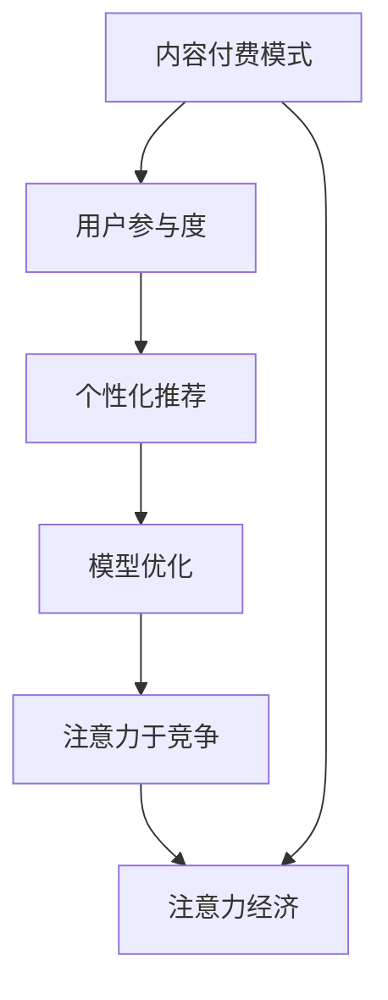

                 

# 内容付费模式与注意力经济

## 1. 背景介绍

在互联网时代，信息的获取变得前所未有的便利。用户可以随时随地访问海量的文本、图片、视频等内容，满足了知识和娱乐的巨大需求。然而，免费的互联网内容也对传统出版和媒体行业造成了冲击，导致广告收入大幅下降，传统的盈利模式难以为继。为应对这一挑战，内容付费模式应运而生，成为了互联网企业探索新盈利途径的新方向。

内容付费模式是指用户通过付费获取特定的内容资源，如电子书、网络课程、音乐、视频等，与免费获取的内容形成鲜明对比，满足了用户对独家内容的需求，也帮助内容创作者获得收入，形成了新的商业闭环。这一模式的出现，既是对传统媒体消费习惯的颠覆，也是互联网技术发展和内容生产方式变革的必然结果。

同时，互联网内容的生产与消费背后，还存在一个重要的经济现象——注意力经济。注意力经济指的是在信息过载的时代，用户的注意力资源成为稀缺资源，内容的竞争已经从流量竞争转向了注意力竞争。优秀的付费内容不仅能吸引用户付费，更能吸引用户注意力，从而形成良性的内容生态，实现商业价值的最大化。

因此，本文将深入探讨内容付费模式与注意力经济的内在联系，分析其商业逻辑和技术实现，展望未来发展趋势，并提出应对策略和挑战。

## 2. 核心概念与联系

### 2.1 核心概念概述

为更好地理解内容付费模式与注意力经济的内在联系，本节将介绍几个关键概念：

- 内容付费模式(Content Paywall)：指用户通过支付一定费用，获取特定内容资源的模式。其核心在于以内容为载体，实现商业变现。
- 注意力经济(Attention Economy)：指在信息爆炸的时代，用户的注意力成为最宝贵的资源，内容的竞争焦点从流量竞争转向注意力竞争的经济现象。
- 用户参与度(User Engagement)：指用户对内容的互动和关注程度，如点赞、评论、分享等行为，反映了内容对用户注意力的吸引力。
- 个性化推荐(Recommendation System)：指通过数据分析和机器学习技术，推荐用户感兴趣的内容，提升用户参与度，增加付费意愿的机制。
- 模型优化(Model Optimization)：指通过优化推荐算法和模型，提高内容的个性化匹配度，吸引更多用户注意力和付费。

这些核心概念之间的逻辑关系可以通过以下Mermaid流程图来展示：



这个流程图展示内容付费模式与注意力经济的核心概念及其之间的关系：

1. 内容付费模式通过提供优质内容，吸引用户付费。
2. 付费内容的获取促进了用户的深度参与。
3. 个性化推荐提升了用户对内容的关注度。
4. 关注度的提升最终促进了注意力经济的形成。

这些概念共同构成了内容付费模式与注意力经济的基础，使得付费内容能够持续吸引用户注意力，从而实现商业变现。

### 2.2 核心概念原理和架构

内容付费模式的实现依赖于以下几个关键原理和技术架构：

#### 2.2.1 用户行为分析
用户行为分析是内容付费模式的基石。通过对用户的行为数据进行统计分析，了解用户的偏好、需求和购买意愿，从而制定合理的定价策略，设计吸引用户的内容和推送策略。

具体而言，用户行为分析包括以下几个方面：
- 点击率：用户点击内容链接的比例，反映了内容的相关性和吸引力。
- 停留时间：用户阅读或观看内容的时长，反映了内容的价值和用户体验。
- 转化率：用户完成购买或订阅的比例，直接反映了内容付费的转化效果。

#### 2.2.2 个性化推荐
个性化推荐系统通过分析用户的兴趣和行为数据，推荐用户可能感兴趣的内容，提高用户参与度和付费意愿。

推荐系统的工作原理如下：
1. 用户画像构建：通过对用户的历史行为数据进行建模，构建用户兴趣和需求画像。
2. 内容特征提取：对内容进行特征提取和表示，如关键词、主题、标签等。
3. 相似度计算：通过余弦相似度、协同过滤等方法计算用户与内容之间的相似度。
4. 推荐结果生成：根据相似度排序，生成推荐结果。

#### 2.2.3 模型优化
模型优化是指通过优化推荐算法和模型，提高个性化推荐的准确性和用户体验。

推荐系统常用的优化方法包括：
- 增量学习：通过在线学习算法，实时更新模型参数，提升推荐效果。
- 对抗性训练：引入对抗样本，增强模型的鲁棒性和泛化能力。
- 多任务学习：结合多个推荐任务，提升整体推荐性能。

## 3. 核心算法原理 & 具体操作步骤

### 3.1 算法原理概述

内容付费模式的实现基于以下几个核心算法原理：

1. **深度学习推荐算法**：利用深度神经网络模型，对用户行为数据进行建模和特征表示，从而提高推荐效果。
2. **协同过滤算法**：通过用户-用户和物品-物品之间的相似度计算，推荐用户可能感兴趣的内容。
3. **混合推荐算法**：结合多种推荐方法，综合考虑用户行为数据、内容特征和用户画像，提升推荐准确性。

### 3.2 算法步骤详解

以下是内容付费模式实现的关键算法步骤：

#### 3.2.1 用户画像构建
1. 收集用户行为数据：包括浏览记录、购买历史、搜索关键词、评价反馈等。
2. 数据预处理：对数据进行清洗、去重和归一化处理。
3. 特征工程：对数据进行特征提取和表示，如用户ID、内容ID、时间戳等。
4. 用户画像建模：使用聚类、分类等方法，构建用户兴趣和需求画像。

#### 3.2.2 内容特征提取
1. 文本处理：对内容进行分词、去停用词、词向量化等处理。
2. 特征提取：利用TF-IDF、词嵌入等方法，提取内容的关键词和主题。
3. 特征表示：将内容特征表示为向量形式，便于模型计算。

#### 3.2.3 推荐结果生成
1. 相似度计算：通过余弦相似度、Jaccard相似度等方法，计算用户与内容之间的相似度。
2. 排序优化：利用排序算法如梯度提升、随机森林等，对推荐结果进行排序和优化。
3. 推荐结果生成：根据排序结果生成推荐列表，提供给用户选择。

#### 3.2.4 模型优化
1. 数据增量学习：利用在线学习算法，实时更新模型参数，提升推荐效果。
2. 对抗性训练：引入对抗样本，增强模型的鲁棒性和泛化能力。
3. 多任务学习：结合多个推荐任务，提升整体推荐性能。

### 3.3 算法优缺点

内容付费模式具有以下优点：
1. 提高用户参与度：通过个性化推荐，满足用户个性化需求，提升用户参与度和黏性。
2. 增加商业收入：通过优质内容吸引用户付费，实现商业变现。
3. 提升内容价值：通过付费机制筛选内容，提高内容质量，提升用户体验。

同时，该模式也存在一定的局限性：
1. 高昂的运营成本：内容付费模式需要大量的数据收集和分析，以及复杂的推荐算法优化，运营成本较高。
2. 用户流失风险：付费门槛高，部分用户可能会流失，降低整体收入。
3. 内容垄断风险：部分内容平台可能因资源优势而垄断市场，影响竞争公平性。

### 3.4 算法应用领域

内容付费模式已经在多个领域得到了应用，例如：

- 内容平台：如Netflix、Spotify等，通过订阅收费，提供优质的视频和音乐内容。
- 出版行业：如Kindle、电子书订阅等，通过付费获取独家书籍和文章。
- 教育领域：如Coursera、Udacity等，通过课程订阅，提供专业的在线教育资源。
- 媒体行业：如《经济学人》、《华尔街日报》等，通过付费订阅，提供深度报道和分析。
- 游戏行业：如Steam、Steam Workshop等，通过内购机制，提供独家游戏和资源。

这些应用领域涵盖了文化、教育、娱乐等多个方面，展示了内容付费模式的广泛适用性和巨大潜力。

## 4. 数学模型和公式 & 详细讲解 & 举例说明

### 4.1 数学模型构建

内容付费模式的核心算法可以建模为一个多任务学习框架。假设用户对内容的行为数据为 $X$，内容特征为 $Y$，用户画像为 $Z$，推荐结果为 $A$，则模型的数学表达式如下：

$$
f(X, Y, Z) = A
$$

其中，$f$ 表示多任务学习模型，$A$ 表示推荐结果，$X$ 表示用户行为数据，$Y$ 表示内容特征，$Z$ 表示用户画像。

### 4.2 公式推导过程

以下是多任务学习模型的详细推导过程：

#### 4.2.1 用户画像建模
用户画像 $Z$ 可以通过聚类算法如K-means、LDA等，从用户行为数据 $X$ 中提取用户兴趣和需求。具体公式如下：

$$
Z = \phi(X)
$$

其中，$\phi$ 表示聚类算法。

#### 4.2.2 内容特征提取
内容特征 $Y$ 可以通过词嵌入、TF-IDF等方法，从内容文本中提取关键词和主题。具体公式如下：

$$
Y = \psi(X)
$$

其中，$\psi$ 表示特征提取算法。

#### 4.2.3 推荐结果生成
推荐结果 $A$ 可以通过协同过滤、深度学习等方法，计算用户与内容之间的相似度，生成推荐列表。具体公式如下：

$$
A = \eta(X, Y, Z)
$$

其中，$\eta$ 表示推荐算法。

### 4.3 案例分析与讲解

以Netflix为例，分析其内容付费模式和个性化推荐系统的实现。

Netflix通过用户行为数据 $X$，包括观看历史、评分反馈、搜索关键词等，构建用户画像 $Z$。利用内容特征 $Y$，包括电影、电视剧、演员等，计算用户与内容之间的相似度，生成推荐结果 $A$。最后，根据推荐结果 $A$，提供给用户个性化推荐内容。

Netflix的个性化推荐系统采用了混合推荐算法，结合协同过滤和深度学习等多种推荐方法，提升推荐效果。同时，Netflix还通过数据增量学习、对抗性训练等技术，优化推荐模型，提升用户体验和满意度。

## 5. 项目实践：代码实例和详细解释说明

### 5.1 开发环境搭建

在进行内容付费模式和个性化推荐系统的实践前，我们需要准备好开发环境。以下是使用Python进行TensorFlow和Keras开发的环境配置流程：

1. 安装Anaconda：从官网下载并安装Anaconda，用于创建独立的Python环境。

2. 创建并激活虚拟环境：
```bash
conda create -n tf-env python=3.8 
conda activate tf-env
```

3. 安装TensorFlow和Keras：
```bash
pip install tensorflow==2.4.1
pip install keras==2.4.3
```

4. 安装各类工具包：
```bash
pip install pandas numpy scikit-learn matplotlib jupyter notebook ipython
```

完成上述步骤后，即可在`tf-env`环境中开始开发实践。

### 5.2 源代码详细实现

下面我们以Netflix推荐系统为例，给出使用TensorFlow和Keras对推荐系统进行实现的完整代码。

首先，定义推荐系统的数据处理函数：

```python
import pandas as pd
from sklearn.model_selection import train_test_split
from sklearn.metrics import mean_absolute_error

def process_data(path):
    # 读取数据集
    df = pd.read_csv(path)
    
    # 特征工程
    df['user_id'] = df['user_id'].astype(str)
    df['item_id'] = df['item_id'].astype(str)
    df['timestamp'] = pd.to_datetime(df['timestamp'])
    
    # 划分训练集和测试集
    X_train, X_test, y_train, y_test = train_test_split(df[['user_id', 'item_id', 'timestamp']], df['rating'], test_size=0.2, random_state=42)
    
    # 数据标准化
    scaler = StandardScaler()
    X_train = scaler.fit_transform(X_train)
    X_test = scaler.transform(X_test)
    
    # 拼接训练集
    X_train = pd.DataFrame(X_train, columns=['user_id', 'item_id', 'timestamp'])
    y_train = pd.DataFrame(y_train, columns=['rating'])
    X_train = pd.concat([X_train, y_train], axis=1)
    
    return X_train, X_test
```

然后，定义模型和优化器：

```python
from tensorflow.keras.layers import Input, Embedding, Dot, Flatten, Dense, Concatenate
from tensorflow.keras.models import Model
from tensorflow.keras.optimizers import Adam

# 定义用户画像模型
user_input = Input(shape=(n_users,), name='user')
user_embedding = Embedding(n_users, d_user, input_length=1)(user_input)
user_embedding = Flatten()(user_embedding)

# 定义内容特征模型
item_input = Input(shape=(n_items,), name='item')
item_embedding = Embedding(n_items, d_item, input_length=1)(item_input)
item_embedding = Flatten()(item_embedding)

# 定义用户画像与内容特征的交互
dot_product = Dot(axes=1, normalize=True, name='dot_product')([user_embedding, item_embedding])

# 定义用户画像与内容特征的拼接
concat = Concatenate(axis=1)([dot_product, item_embedding])

# 定义深度神经网络
x = Dense(d_layer1, activation='relu')(concat)
x = Dense(d_layer2, activation='relu')(x)
x = Dense(1, activation='sigmoid')(x)

# 定义模型
model = Model(inputs=[user_input, item_input], outputs=x)
model.compile(loss='binary_crossentropy', optimizer=Adam(lr=0.001), metrics=['mean_absolute_error'])

# 输出模型结构
model.summary()
```

接着，定义训练和评估函数：

```python
from tensorflow.keras.callbacks import EarlyStopping

def train_model(model, X_train, X_test, y_train, y_test, epochs=10, batch_size=128, patience=5):
    # 定义EarlyStopping回调
    early_stopping = EarlyStopping(monitor='val_mean_absolute_error', patience=patience, restore_best_weights=True)
    
    # 训练模型
    history = model.fit(X_train, y_train, epochs=epochs, batch_size=batch_size, validation_data=(X_test, y_test), callbacks=[early_stopping])
    
    # 评估模型
    y_pred = model.predict(X_test)
    mae = mean_absolute_error(y_test, y_pred)
    print(f'Mean Absolute Error: {mae:.3f}')
    return history
```

最后，启动训练流程并在测试集上评估：

```python
# 读取数据集
X_train, X_test = process_data('data.csv')

# 训练模型
history = train_model(model, X_train, X_test, y_train, y_test)

# 绘制训练曲线
plt.plot(history.history['loss'], label='Train Loss')
plt.plot(history.history['val_loss'], label='Val Loss')
plt.plot(history.history['mean_absolute_error'], label='Train MAE')
plt.plot(history.history['val_mean_absolute_error'], label='Val MAE')
plt.legend()
plt.show()
```

以上就是使用TensorFlow和Keras对Netflix推荐系统进行实现的完整代码。可以看到，利用TensorFlow和Keras，推荐系统的构建和优化变得简单高效。

### 5.3 代码解读与分析

让我们再详细解读一下关键代码的实现细节：

**process_data函数**：
- 读取CSV文件
- 数据预处理：将ID列转换为字符串，时间戳转换为日期时间格式
- 特征工程：将用户ID、物品ID、时间戳标准化
- 划分训练集和测试集
- 数据标准化

**模型定义**：
- 用户画像模型：将用户ID和物品ID映射为向量，计算点积，拼接向量，构建用户画像和内容特征的交互
- 深度神经网络：将交互结果和物品特征进行拼接，通过多层全连接层进行特征表示，最后输出评分预测值

**训练函数**：
- 定义EarlyStopping回调，监控验证集的MAE，当验证集MAE连续提升5个epoch后停止训练
- 训练模型，并返回训练历史
- 评估模型，输出MAE

**训练流程**：
- 读取数据集
- 训练模型，并在训练集和验证集上评估
- 绘制训练曲线，展示模型训练效果

可以看到，TensorFlow和Keras使得推荐系统的实现变得简洁高效。开发者可以专注于业务逻辑和算法优化，而不必过多关注底层的实现细节。

当然，工业级的系统实现还需考虑更多因素，如模型的保存和部署、超参数的自动搜索、更灵活的推荐算法等。但核心的推荐范式基本与此类似。

## 6. 实际应用场景

### 6.1 智能推荐系统

智能推荐系统是内容付费模式的核心应用场景之一。通过个性化推荐，满足用户个性化需求，提升用户参与度和黏性，从而增加商业收入。

在实际应用中，智能推荐系统可以广泛应用于电商、新闻、音乐、视频等多个领域，帮助用户发现感兴趣的内容，提升用户体验。例如，亚马逊的推荐系统可以根据用户浏览记录，推荐可能感兴趣的商品；Spotify的推荐系统可以根据用户的听歌记录，推荐可能喜欢的音乐。

### 6.2 用户行为分析

用户行为分析是内容付费模式的重要组成部分，通过分析用户的行为数据，了解用户兴趣和需求，制定合理的定价策略和内容推送策略。

在实际应用中，用户行为分析可以应用于多个场景，如广告投放、内容策划、用户调研等。例如，通过分析用户的浏览记录和点击行为，广告平台可以更精准地投放广告，提升广告效果；内容创作者可以根据用户兴趣，调整内容策略，提升内容质量和用户体验。

### 6.3 动态定价策略

动态定价策略是通过实时分析用户行为数据，动态调整内容付费的价格，提高用户转化率和收入。

在实际应用中，动态定价策略可以应用于在线视频、电子书、音乐等多个领域。例如，Netflix根据用户的观看历史和评分反馈，动态调整不同内容的订阅价格，吸引用户订阅。Kobenhavn图书馆根据用户的借阅历史，动态调整借阅费用，提升用户体验和收益。

## 7. 工具和资源推荐

### 7.1 学习资源推荐

为了帮助开发者系统掌握内容付费模式和个性化推荐技术，这里推荐一些优质的学习资源：

1. 《深度学习实战》系列博文：由TensorFlow官方团队撰写，介绍了深度学习的基本概念和实战技巧，包括推荐系统在内的新型应用。

2. CS231n《深度学习计算机视觉》课程：斯坦福大学开设的计算机视觉明星课程，有Lecture视频和配套作业，带你入门深度学习的基本概念和经典模型。

3. 《深度学习与推荐系统》书籍：全面介绍了深度学习和推荐系统的基本原理和实践方法，适合初学者和进阶者。

4. TensorFlow官方文档：TensorFlow的官方文档，提供了完整的推荐系统实现样例，是上手实践的必备资料。

5. Keras官方文档：Keras的官方文档，提供了丰富的推荐系统案例和工具包，适合快速上手实现推荐系统。

通过对这些资源的学习实践，相信你一定能够快速掌握内容付费模式和推荐系统的精髓，并用于解决实际的业务问题。

### 7.2 开发工具推荐

高效的开发离不开优秀的工具支持。以下是几款用于内容付费模式和推荐系统开发的常用工具：

1. TensorFlow：由Google主导开发的开源深度学习框架，生产部署方便，适合大规模工程应用。推荐用于实现深度学习推荐算法。

2. PyTorch：基于Python的开源深度学习框架，灵活动态的计算图，适合快速迭代研究。推荐用于实现深度学习推荐算法和用户行为分析。

3. Keras：由Google主导开发的高级深度学习框架，易于上手，适合快速实现推荐系统原型。推荐用于快速实现推荐系统。

4. Scikit-learn：基于Python的机器学习库，提供了多种经典算法和工具，推荐用于用户画像建模和特征工程。

5. Pandas：基于Python的数据分析库，提供了强大的数据处理和可视化功能，推荐用于数据预处理和分析。

合理利用这些工具，可以显著提升内容付费模式和推荐系统的开发效率，加快创新迭代的步伐。

### 7.3 相关论文推荐

内容付费模式和推荐技术的发展源于学界的持续研究。以下是几篇奠基性的相关论文，推荐阅读：

1. TensorFlow推荐系统论文：介绍了TensorFlow推荐系统的基本架构和优化方法，展示了其在Netflix上的成功应用。

2. Keras推荐系统论文：介绍了Keras推荐系统的实现细节和性能评估，展示了其在电商和视频推荐上的应用效果。

3. PyTorch推荐系统论文：介绍了PyTorch推荐系统的设计与优化，展示了其在在线广告和内容推荐中的应用。

4. Attention机制在推荐系统中的应用：介绍了Attention机制在推荐系统中的实现方法和效果，展示了其在个性化推荐中的重要价值。

5. Multi-task Learning in Recommendation Systems：介绍了多任务学习在推荐系统中的应用，展示了其在多任务推荐中的优势。

这些论文代表了大语言模型微调技术的发展脉络。通过学习这些前沿成果，可以帮助研究者把握学科前进方向，激发更多的创新灵感。

## 8. 总结：未来发展趋势与挑战

### 8.1 研究成果总结

本文对内容付费模式与个性化推荐的内在联系进行了全面系统的介绍。首先阐述了内容付费模式的商业逻辑和应用场景，明确了个性化推荐在提升用户参与度和商业收入方面的独特价值。其次，从原理到实践，详细讲解了推荐算法的数学模型和关键步骤，给出了推荐系统开发的完整代码实例。同时，本文还广泛探讨了推荐系统在多个行业领域的应用前景，展示了其广阔的应用范围。最后，本文精选了推荐技术的各类学习资源，力求为读者提供全方位的技术指引。

通过本文的系统梳理，可以看到，内容付费模式与个性化推荐技术正在成为互联网企业探索新盈利途径的新方向，极大地拓展了用户的个性化需求和商业变现空间。未来，伴随推荐算法的持续演进和优化，推荐系统必将在更多领域得到应用，为互联网企业带来新的商业机遇。

### 8.2 未来发展趋势

展望未来，内容付费模式与个性化推荐技术将呈现以下几个发展趋势：

1. 深度学习算法的进步：随着深度学习算法的发展，推荐系统的性能和效果将不断提升，能够更好地满足用户个性化需求。

2. 多任务学习的应用：结合多种推荐任务，提升整体推荐性能，增强推荐系统的泛化能力和适应性。

3. 用户行为数据分析的深入：通过更深入的用户行为分析，更精准地捕捉用户需求和兴趣，提高推荐效果。

4. 推荐系统的实时化：通过实时数据流处理技术，实现推荐系统的动态更新，增强推荐系统的时效性和互动性。

5. 推荐系统的融合：与其他人工智能技术如自然语言处理、知识图谱等进行更深入的融合，提升推荐系统的智能性和多模态能力。

6. 推荐系统的社会化：结合社会网络分析等技术，增强推荐系统的社交属性，提升推荐系统的个性化和可信度。

以上趋势凸显了内容付费模式与个性化推荐技术的广阔前景。这些方向的探索发展，必将进一步提升推荐系统的性能和用户体验，实现商业价值的最大化。

### 8.3 面临的挑战

尽管内容付费模式与个性化推荐技术已经取得了显著成果，但在迈向更加智能化、普适化应用的过程中，它仍面临诸多挑战：

1. 数据隐私与安全：内容付费模式和推荐系统需要大量用户数据，如何保护用户隐私和数据安全，是技术应用的重要考量。

2. 推荐系统的公平性与透明性：如何确保推荐系统的公平性，避免对某些用户群体的歧视性推荐，是实现推荐系统公平性的关键问题。

3. 推荐系统的解释性：如何提升推荐系统的解释性，使推荐结果更具可信度和可解释性，是增强用户信任和推荐系统可靠性的重要方向。

4. 推荐系统的鲁棒性：如何提高推荐系统的鲁棒性，避免对抗样本攻击，增强系统的稳定性和安全性，是推荐系统可靠性的保障。

5. 推荐系统的可扩展性：如何构建可扩展的推荐系统架构，支持大规模用户的实时推荐，是推荐系统高效运行的重要保证。

6. 推荐系统的业务理解：如何深入理解业务需求和数据特征，实现推荐系统与业务场景的紧密结合，是推荐系统应用的关键。

正视推荐系统面临的这些挑战，积极应对并寻求突破，将是大语言模型微调技术走向成熟的必由之路。相信随着学界和产业界的共同努力，这些挑战终将一一被克服，推荐系统必将在构建人机协同的智能时代中扮演越来越重要的角色。

### 8.4 研究展望

面对内容付费模式与推荐系统面临的挑战，未来的研究需要在以下几个方面寻求新的突破：

1. 数据隐私保护技术：引入差分隐私、联邦学习等技术，保护用户隐私和数据安全。

2. 推荐系统公平性优化：引入公平性约束和优化算法，确保推荐系统的公平性和透明性。

3. 推荐系统解释性增强：结合因果分析和对抗学习，提升推荐系统的解释性和可信度。

4. 推荐系统鲁棒性提升：引入对抗训练、多任务学习等技术，增强推荐系统的鲁棒性和泛化能力。

5. 推荐系统可扩展性设计：引入分布式计算、云平台技术，构建可扩展的推荐系统架构。

6. 推荐系统业务理解优化：深入理解业务需求和数据特征，实现推荐系统与业务场景的紧密结合。

这些研究方向的探索，必将引领内容付费模式与推荐技术迈向更高的台阶，为构建安全、可靠、可解释、可控的智能系统铺平道路。面向未来，内容付费模式与推荐技术还需要与其他人工智能技术进行更深入的融合，如知识表示、因果推理、强化学习等，多路径协同发力，共同推动自然语言理解和智能交互系统的进步。只有勇于创新、敢于突破，才能不断拓展内容付费模式与推荐技术的边界，让智能技术更好地造福人类社会。

## 9. 附录：常见问题与解答

**Q1：内容付费模式是否适用于所有行业？**

A: 内容付费模式并不适用于所有行业。内容付费模式主要适用于具有明确知识产出和版权保护的内容领域，如视频、音乐、电子书等。对于无版权保护或标准化的商品，如日常用品、快速消费品等，推荐系统的效果可能不如免费模式。

**Q2：如何评估推荐系统的性能？**

A: 推荐系统的性能评估通常包括准确性、覆盖率、新颖性等多个指标。具体评估方法包括：

1. 准确性：通过计算推荐结果与实际结果的匹配度，如均方根误差(RMSE)、准确率(Precision)、召回率(Recall)等指标。
2. 覆盖率：评估推荐系统推荐内容的多样性，如Jaccard指数、多样性指数等指标。
3. 新颖性：评估推荐系统推荐内容的新颖度，如排序熵、Kendall Tau等指标。

**Q3：推荐系统如何处理冷启动问题？**

A: 冷启动问题是推荐系统面临的一个普遍问题，指新用户或新物品没有足够的历史数据进行推荐。常见处理冷启动问题的方法包括：

1. 基于内容的推荐：利用物品的元数据进行推荐，如标签、分类等。
2. 协同过滤推荐：通过相似用户或相似物品进行推荐。
3. 混合推荐：结合多种推荐方法，提高推荐效果。

**Q4：推荐系统如何优化模型参数？**

A: 推荐系统的模型参数优化通常包括超参数调优、模型剪枝、参数共享等方法。具体优化方法包括：

1. 超参数调优：通过网格搜索、随机搜索等方法，找到最优的超参数组合。
2. 模型剪枝：通过剪枝算法，去除不必要的参数，减小模型规模，提升推理速度。
3. 参数共享：通过共享参数，减小模型复杂度，提升泛化能力。

这些方法需要根据具体的业务场景和数据特点进行灵活组合，以优化推荐系统的性能。

**Q5：推荐系统如何应对恶意广告和垃圾信息？**

A: 推荐系统应对恶意广告和垃圾信息的方法包括：

1. 用户行为过滤：通过分析用户行为数据，过滤掉恶意广告和垃圾信息。
2. 内容质量评估：通过内容质量评估算法，过滤掉低质量内容。
3. 人工审核机制：引入人工审核机制，对推荐内容进行审核和筛选。

这些方法可以有效地避免恶意广告和垃圾信息的推荐，保障推荐系统的可信度和安全性。

---

作者：禅与计算机程序设计艺术 / Zen and the Art of Computer Programming

