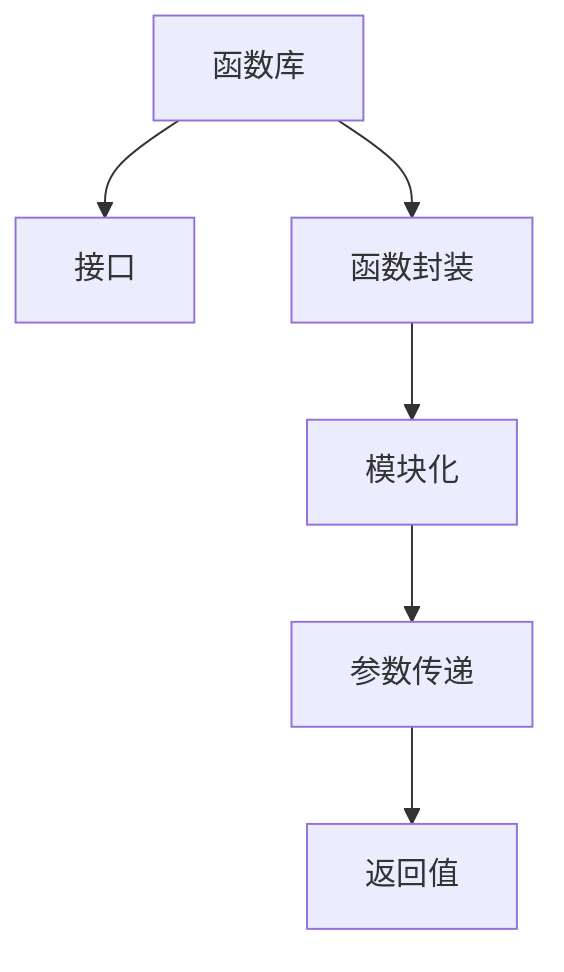

                 

# 函数库:封装复用代码的利器

## 1. 背景介绍

### 1.1 问题由来
在软件开发过程中，我们常常会遇到以下几种情况：

- 重复代码：在多个模块或函数中，可能会出现功能相同但实现细节不同的代码片段。这些代码不仅会占用额外的存储空间，还可能增加维护难度和错误率。
- 接口不一致：不同模块或函数之间的接口定义可能不一致，导致代码的复用性降低。
- 模块耦合度高：模块之间的依赖关系复杂，修改一个模块可能牵一发而动全身，维护成本高。
- 代码可读性差：代码风格不一致、注释不足、命名不规范等问题，导致代码可读性差，难以理解和维护。

这些问题不仅增加了开发成本，还可能影响项目的质量和效率。因此，如何有效地组织和复用代码，成为软件开发中的一个重要课题。

### 1.2 问题核心关键点
为了解决上述问题，函数库作为一种重要的软件设计模式，应运而生。函数库的核心思想是将代码模块化、封装化，通过封装复用代码，提高代码的可维护性、可扩展性和可重用性。

函数库通过将一系列相关功能封装在独立的函数或模块中，形成一个独立的、可复用的库，供其他模块或应用程序调用。使用函数库可以减少重复代码，降低模块之间的耦合度，提升代码的可读性和维护性。

## 2. 核心概念与联系

### 2.1 核心概念概述

为更好地理解函数库的设计和应用，本节将介绍几个密切相关的核心概念：

- 函数库(Function Library)：将一组独立且相关的函数或模块封装在一个独立的空间中，供其他模块或应用程序调用。
- 函数调用(Call by Function)：在程序中通过函数名调用函数库中的函数，实现功能复用。
- 接口(API, Application Programming Interface)：函数库的对外接口，定义了函数库对外提供的函数、类、常量等可访问元素。
- 函数封装(Encapsulation)：将函数的实现细节隐藏在函数库内部，仅对外暴露接口，保证代码的安全性和可维护性。
- 模块化(Modularity)：将代码按照功能或逻辑关系进行模块划分，每个模块只负责特定的功能。
- 参数传递(Parameter Passing)：通过参数传递的方式，将输入值传递给函数库中的函数，实现函数的动态调用。
- 返回值(Return Value)：函数库中的函数执行完毕后，将计算结果或状态信息返回给调用者。

这些概念之间的逻辑关系可以通过以下Mermaid流程图来展示：



这个流程图展示了函数库的核心概念及其之间的关系：

1. 函数库通过封装函数和模块，提供对外接口。
2. 函数封装保证了代码的安全性和可维护性。
3. 模块化有助于代码的组织和复用。
4. 参数传递实现了函数的动态调用。
5. 返回值提供了函数执行结果的反馈。

这些概念共同构成了函数库的设计和应用框架，使其能够在软件开发中发挥重要作用。

## 3. 核心算法原理 & 具体操作步骤
### 3.1 算法原理概述

函数库的设计和应用，本质上是一个代码组织和封装的过程。其核心思想是通过模块化、封装化，将代码组织成一系列独立的、可复用的函数或模块，供其他模块或应用程序调用。

函数库的设计和应用，一般遵循以下步骤：

1. 模块划分：根据功能的不同，将代码划分成多个独立的模块。每个模块负责特定的功能，避免代码的重复和冗余。
2. 函数封装：将模块中的函数封装在独立的函数库中，只对外暴露接口，隐藏实现细节。
3. 接口设计：定义函数库的对外接口，包括函数、类、常量等可访问元素。
4. 参数传递：通过参数传递的方式，将输入值传递给函数库中的函数，实现函数的动态调用。
5. 返回值处理：函数执行完毕后，将计算结果或状态信息返回给调用者。

### 3.2 算法步骤详解

函数库的设计和应用，一般遵循以下步骤：

**Step 1: 模块划分**
- 根据功能的不同，将代码划分成多个独立的模块。每个模块负责特定的功能，避免代码的重复和冗余。
- 定义模块的接口，明确模块对外提供的服务。
- 将模块的实现细节封装在函数库内部，仅对外暴露接口。

**Step 2: 函数封装**
- 将模块中的函数封装在独立的函数库中，只对外暴露接口。
- 定义函数的参数和返回值类型，明确函数的输入和输出。
- 将函数的实现细节封装在函数库内部，隐藏实现细节。

**Step 3: 接口设计**
- 定义函数库的对外接口，包括函数、类、常量等可访问元素。
- 明确函数库对外提供的服务，定义函数的参数和返回值类型。
- 保证接口的一致性和规范性，提高函数库的复用性和可维护性。

**Step 4: 参数传递**
- 通过参数传递的方式，将输入值传递给函数库中的函数，实现函数的动态调用。
- 参数传递可以是值的传递、引用传递、指针传递等。
- 参数传递需要考虑性能和安全问题，避免因参数传递不当导致的错误。

**Step 5: 返回值处理**
- 函数执行完毕后，将计算结果或状态信息返回给调用者。
- 返回值可以是值类型、引用类型、自定义类型等。
- 返回值处理需要考虑性能和安全问题，避免因返回值处理不当导致的错误。

### 3.3 算法优缺点

函数库的设计和应用，具有以下优点：
1. 代码复用：函数库中的函数或模块可以被多个模块或应用程序复用，减少代码的重复和冗余。
2. 接口一致：函数库的接口定义明确，调用者可以方便地使用函数库提供的服务。
3. 封装安全性：函数库将实现细节封装在内部，外部调用者无法修改函数的实现细节，提高代码的安全性。
4. 可维护性：函数库中的代码组织清晰，每个模块只负责特定的功能，便于维护和修改。

同时，函数库的设计和应用也存在一定的局限性：
1. 功能限制：函数库只能封装具体的功能，无法直接解决复杂的业务问题。
2. 学习成本：函数库的设计和使用需要一定的学习和理解成本，特别是在大规模系统中。
3. 性能开销：函数库的调用需要一定的性能开销，特别是在高并发、高负载的应用场景中。
4. 接口复杂：函数库的接口定义复杂，需要仔细设计和维护，否则可能导致调用者使用不当。

尽管存在这些局限性，但就目前而言，函数库仍然是软件开发中不可或缺的重要手段。合理使用函数库，可以显著提高代码的复用性、可维护性和可扩展性，提升软件开发效率和质量。

### 3.4 算法应用领域

函数库的应用领域非常广泛，几乎涵盖了所有的软件开发场景。以下是几个典型的应用领域：

- 操作系统：操作系统中的函数库提供了基本的操作系统功能，如文件管理、内存管理、进程管理等。
- 数据库：数据库中的函数库提供了数据存储、查询、事务管理等功能。
- Web应用：Web应用中的函数库提供了HTTP请求、用户认证、数据存储等功能。
- 游戏开发：游戏开发中的函数库提供了图形渲染、物理模拟、网络通信等功能。
- 嵌入式系统：嵌入式系统中的函数库提供了硬件驱动、网络通信、用户界面等功能。

除了这些常见的应用领域外，函数库还被广泛应用于各种软件开发场景中，如移动应用、物联网、人工智能等，为软件开发提供了强大的支持。

## 4. 数学模型和公式 & 详细讲解 & 举例说明
### 4.1 数学模型构建

函数库的设计和应用，通常采用模块化、封装化的方式，将代码组织成一系列独立的函数或模块，供其他模块或应用程序调用。函数库的接口定义、参数传递、返回值处理等环节，可以通过函数的形式进行抽象。

以一个简单的函数库为例，定义一个求和函数，对一组数字进行求和操作：

```python
def add_numbers(numbers):
    """
    对一组数字进行求和操作
    :param numbers: 一个包含数字的列表
    :return: 数字之和
    """
    total = 0
    for number in numbers:
        total += number
    return total
```

这个函数库中的函数`add_numbers`，定义了三个关键元素：参数、返回值和实现细节。

### 4.2 公式推导过程

函数的参数、返回值和实现细节，可以通过数学模型进行抽象。对于上述的求和函数，可以抽象为以下数学模型：

- 参数：$x_1, x_2, ..., x_n$
- 返回值：$y$
- 实现细节：$f(x_1, x_2, ..., x_n) = y$

其中，$f$表示求和函数，$y$表示数字之和。

对于函数库中的其他函数，同样可以抽象为类似的数学模型。例如，定义一个求平均值函数，对一组数字进行求平均操作：

```python
def average_numbers(numbers):
    """
    对一组数字进行求平均值操作
    :param numbers: 一个包含数字的列表
    :return: 数字的平均值
    """
    total = 0
    for number in numbers:
        total += number
    return total / len(numbers)
```

对于这个函数库中的函数`average_numbers`，同样可以抽象为类似的数学模型。

### 4.3 案例分析与讲解

假设我们正在开发一个简单的计算器应用程序，需要实现加、减、乘、除等基本操作。为了提升代码的复用性和可维护性，我们可以将这些基本操作封装在函数库中，供计算器应用程序调用。

首先，定义一个简单的函数库，包含加、减、乘、除四个函数：

```python
def add(x, y):
    """
    对两个数字进行求和操作
    :param x: 第一个数字
    :param y: 第二个数字
    :return: 数字之和
    """
    return x + y

def subtract(x, y):
    """
    对两个数字进行求差操作
    :param x: 第一个数字
    :param y: 第二个数字
    :return: 数字之差
    """
    return x - y

def multiply(x, y):
    """
    对两个数字进行求积操作
    :param x: 第一个数字
    :param y: 第二个数字
    :return: 数字之积
    """
    return x * y

def divide(x, y):
    """
    对两个数字进行求商操作
    :param x: 被除数
    :param y: 除数
    :return: 商
    """
    if y == 0:
        raise ValueError("除数不能为零")
    return x / y
```

这个函数库中的四个函数，分别实现了加、减、乘、除四个基本操作。每个函数都有明确的参数和返回值，并且实现了具体的计算逻辑。

接下来，我们定义一个简单的计算器应用程序，使用上述函数库中的函数进行基本操作：

```python
def calculate(operation, x, y):
    """
    根据操作符和数字，计算结果
    :param operation: 操作符，取值为'+'、'-'、'*'、'/'中的一个
    :param x: 第一个数字
    :param y: 第二个数字
    :return: 计算结果
    """
    if operation == '+':
        return add(x, y)
    elif operation == '-':
        return subtract(x, y)
    elif operation == '*':
        return multiply(x, y)
    elif operation == '/':
        return divide(x, y)
    else:
        raise ValueError("不支持的操作符")

# 测试计算器应用程序
print(calculate('+', 2, 3)) # 输出 5
print(calculate('-', 5, 2)) # 输出 3
print(calculate('*', 4, 2)) # 输出 8
print(calculate('/', 10, 2)) # 输出 5.0
```

这个计算器应用程序，通过调用函数库中的函数，实现了加、减、乘、除四个基本操作。由于函数库中的函数已经封装了计算逻辑，并且只暴露了简单的接口，因此整个应用程序的代码结构清晰，易于维护和扩展。

## 5. 项目实践：代码实例和详细解释说明
### 5.1 开发环境搭建

在进行函数库开发实践前，我们需要准备好开发环境。以下是使用Python进行开发的环境配置流程：

1. 安装Python：从官网下载并安装Python，建议使用3.x版本。

2. 安装开发工具：安装Python IDE，如PyCharm、VSCode等，或者使用命令行工具进行开发。

3. 安装依赖包：使用pip安装依赖包，如numpy、pandas等，用于数据处理和计算。

完成上述步骤后，即可在开发环境中开始函数库的开发实践。

### 5.2 源代码详细实现

这里我们以一个简单的函数库为例，定义一个字符串处理函数库，包含字符串拼接、反转、分割、计数等基本操作：

```python
def string_concat(str1, str2):
    """
    将两个字符串拼接
    :param str1: 第一个字符串
    :param str2: 第二个字符串
    :return: 拼接后的字符串
    """
    return str1 + str2

def string_reverse(str):
    """
    将字符串反转
    :param str: 字符串
    :return: 反转后的字符串
    """
    return str[::-1]

def string_split(str, separator):
    """
    将字符串按照分隔符分割成多个子字符串
    :param str: 字符串
    :param separator: 分隔符
    :return: 分割后的字符串列表
    """
    return str.split(separator)

def string_count(str, char):
    """
    计算字符串中指定字符出现的次数
    :param str: 字符串
    :param char: 指定字符
    :return: 字符出现次数
    """
    return str.count(char)
```

这些函数库中的函数，分别实现了字符串拼接、反转、分割、计数等基本操作。每个函数都有明确的参数和返回值，并且实现了具体的计算逻辑。

### 5.3 代码解读与分析

让我们再详细解读一下关键代码的实现细节：

**string_concat函数**：
- 参数：`str1`和`str2`，分别表示需要拼接的两个字符串。
- 返回值：拼接后的字符串。
- 实现细节：使用加号运算符将两个字符串拼接在一起。

**string_reverse函数**：
- 参数：`str`，表示需要反转的字符串。
- 返回值：反转后的字符串。
- 实现细节：使用字符串切片操作`[::-1]`将字符串反转。

**string_split函数**：
- 参数：`str`和`separator`，分别表示需要分割的字符串和分隔符。
- 返回值：分割后的字符串列表。
- 实现细节：使用`str.split()`方法将字符串按照分隔符分割成多个子字符串。

**string_count函数**：
- 参数：`str`和`char`，分别表示需要计数的字符串和指定字符。
- 返回值：字符出现次数。
- 实现细节：使用`str.count()`方法计算字符串中指定字符出现的次数。

这些函数的实现，展示了函数库的基本设计思路和实现方式。通过将代码封装成独立的函数，可以提升代码的复用性、可维护性和可扩展性。

## 6. 实际应用场景

### 6.1 操作系统

操作系统中的函数库提供了基本的操作系统功能，如文件管理、内存管理、进程管理等。函数库的封装和组织，使得操作系统更加模块化和可维护。

### 6.2 Web应用

Web应用中的函数库提供了HTTP请求、用户认证、数据存储等功能。函数库的封装和组织，使得Web应用更加模块化和可维护。

### 6.3 游戏开发

游戏开发中的函数库提供了图形渲染、物理模拟、网络通信等功能。函数库的封装和组织，使得游戏开发更加模块化和可维护。

### 6.4 未来应用展望

随着函数库设计和应用的发展，未来函数库将具备更强大的功能和更丰富的应用场景。以下列举几个未来的应用方向：

- 多语言支持：函数库支持多种语言，如C++、Java、Python等，提升跨语言开发的效率。
- 异步处理：函数库支持异步处理，提升高并发、高负载场景的性能。
- 服务化封装：函数库支持服务化封装，方便与其他系统集成和调用。
- 接口生成：函数库支持接口生成，自动生成API文档和接口说明，提升开发者体验。
- 元编程：函数库支持元编程，实现动态生成函数和接口，提升代码的灵活性和扩展性。

这些应用方向，将使得函数库在软件开发中发挥更大的作用，提升开发效率和代码质量。

## 7. 工具和资源推荐
### 7.1 学习资源推荐

为了帮助开发者系统掌握函数库的设计和应用，这里推荐一些优质的学习资源：

1. 《C++ Primer》：经典C++编程教材，详细介绍了C++语言的基础知识和编程技巧，包括函数库的设计和应用。
2. 《Python Cookbook》：经典Python编程教材，详细介绍了Python语言的基础知识和编程技巧，包括函数库的设计和应用。
3. 《Design Patterns》：经典设计模式教材，详细介绍了常用的设计模式和架构，包括函数库的设计和应用。
4. 《Clean Code》：经典代码优化教材，详细介绍了代码优化和设计原则，包括函数库的设计和应用。
5. 《Functional Programming Principles in Scala》：Scala语言编程教材，详细介绍了函数式编程和函数库的设计和应用。

通过对这些资源的学习实践，相信你一定能够快速掌握函数库的设计和应用技巧，提升开发效率和代码质量。

### 7.2 开发工具推荐

高效的开发离不开优秀的工具支持。以下是几款用于函数库开发的常用工具：

1. PyCharm：功能强大的Python IDE，支持代码重构、代码补全、调试等功能，方便函数库的开发和维护。
2. VSCode：轻量级的跨平台IDE，支持丰富的插件和扩展，方便函数库的开发和测试。
3. Sublime Text：轻量级的文本编辑器，支持代码高亮、代码折叠、语法高亮等功能，方便函数的编写和调试。
4. Vim：经典的文本编辑器，支持命令模式、可视模式、块模式等操作，方便函数的编写和调试。
5. Eclipse：功能强大的Java IDE，支持代码重构、代码补全、调试等功能，方便函数库的开发和维护。

合理利用这些工具，可以显著提升函数库的开发效率和代码质量，缩短开发周期。

### 7.3 相关论文推荐

函数库的设计和应用，在软件开发领域有着广泛的应用和研究。以下是几篇经典的论文，推荐阅读：

1. "Functional Programming Principles in Scala" by Martin Odersky
2. "Design Patterns: Elements of Reusable Object-Oriented Software" by Erich Gamma, Richard Helm, Ralph Johnson, John Vlissides
3. "Clean Code: A Handbook of Agile Software Craftsmanship" by Robert C. Martin
4. "Python Cookbook" by David Beazley
5. "C++ Primer" by Lippman, Lajoie, and Moo

这些论文代表了大函数库设计和应用的发展脉络。通过学习这些前沿成果，可以帮助研究者把握函数库设计的精髓，激发更多的创新灵感。

## 8. 总结：未来发展趋势与挑战

### 8.1 总结

本文对函数库的设计和应用进行了全面系统的介绍。首先阐述了函数库的核心思想和设计原则，明确了函数库在软件开发中的重要价值。其次，从原理到实践，详细讲解了函数库的设计和应用步骤，给出了函数库开发的全文代码实例。同时，本文还广泛探讨了函数库在操作系统、Web应用、游戏开发等不同领域的应用前景，展示了函数库的广泛应用场景。

通过本文的系统梳理，可以看到，函数库作为一种重要的软件设计模式，在软件开发中发挥着不可或缺的作用。函数库的设计和应用，可以有效提升代码的复用性、可维护性和可扩展性，提升软件开发效率和质量。

### 8.2 未来发展趋势

展望未来，函数库的设计和应用将呈现以下几个发展趋势：

1. 多语言支持：函数库支持多种语言，提升跨语言开发的效率。
2. 异步处理：函数库支持异步处理，提升高并发、高负载场景的性能。
3. 服务化封装：函数库支持服务化封装，方便与其他系统集成和调用。
4. 接口生成：函数库支持接口生成，自动生成API文档和接口说明，提升开发者体验。
5. 元编程：函数库支持元编程，实现动态生成函数和接口，提升代码的灵活性和扩展性。

这些趋势将使得函数库在软件开发中发挥更大的作用，提升开发效率和代码质量。

### 8.3 面临的挑战

尽管函数库的设计和应用已经取得了显著成果，但在迈向更加智能化、普适化应用的过程中，它仍面临诸多挑战：

1. 函数库的设计和应用需要深入理解软件架构和设计模式，开发成本较高。
2. 函数库的接口设计需要灵活性和稳定性相结合，保证调用者的体验。
3. 函数库的性能开销需要优化，避免因函数库调用导致的性能瓶颈。
4. 函数库的模块化和封装化需要权衡，避免因模块划分不当导致的耦合度过高。
5. 函数库的维护和扩展需要兼顾代码质量和开发效率，避免因维护不当导致的性能下降。

尽管存在这些挑战，但随着函数库设计和应用的发展，相信函数库将不断改进和优化，成为软件开发的重要手段。

### 8.4 研究展望

面向未来，函数库的研究和应用需要在以下几个方面寻求新的突破：

1. 模块化设计：实现更加灵活、可扩展的模块化设计，提升代码的复用性和可维护性。
2. 接口自动生成：实现自动化的接口生成，提升开发者体验和代码质量。
3. 元编程能力：增强函数库的元编程能力，实现动态生成函数和接口，提升代码的灵活性和扩展性。
4. 异步处理支持：支持异步处理和并发处理，提升函数库在高并发、高负载场景的性能。
5. 多语言支持：支持多种语言，提升跨语言开发的效率。

这些研究方向的探索，将使得函数库在软件开发中发挥更大的作用，提升开发效率和代码质量。相信随着函数库设计和应用的发展，函数库将成为软件开发的重要手段，为软件开发带来新的突破和创新。

## 9. 附录：常见问题与解答

**Q1：函数库中的函数和模块如何组织？**

A: 函数库中的函数和模块，通常按照功能进行组织。将具有相似功能的函数和模块划分到同一个模块中，避免代码的重复和冗余。同时，根据模块的依赖关系，合理组织模块的调用顺序，保证模块的运行效率和可维护性。

**Q2：函数库中的函数和模块如何命名？**

A: 函数库中的函数和模块，通常采用有意义的命名规则，便于开发者理解和维护。函数和模块的名称应该简洁明了，避免过于复杂和冗长的命名。同时，函数的命名应该遵循一致性和规范性，便于开发者调用和使用。

**Q3：函数库中的函数和模块如何编写文档？**

A: 函数库中的函数和模块，通常需要编写详细的文档，说明函数的参数、返回值和实现细节。文档应该简洁明了，便于开发者快速了解函数的用法和调用方式。同时，文档应该包括函数的参数类型、返回值类型和异常信息等关键信息，方便开发者进行调用和测试。

**Q4：函数库中的函数和模块如何测试？**

A: 函数库中的函数和模块，通常需要进行单元测试和集成测试，确保代码的正确性和稳定性。单元测试应该覆盖函数的各个分支和异常情况，确保函数的正确性和鲁棒性。集成测试应该覆盖函数的组合和调用关系，确保模块的正确性和交互性。

**Q5：函数库中的函数和模块如何优化性能？**

A: 函数库中的函数和模块，通常需要优化性能，提升代码的运行效率。性能优化可以从以下几个方面入手：
- 减少函数调用次数，避免不必要的函数调用。
- 使用高效的算法和数据结构，提升计算效率。
- 优化内存使用，避免内存泄漏和碎片化。
- 使用并发和异步处理，提升函数库在高并发、高负载场景的性能。

这些问题的解答，展示了函数库的设计和应用的基本思路和实现方式。通过合理设计和使用函数库，可以显著提升代码的复用性、可维护性和可扩展性，提升软件开发效率和质量。

