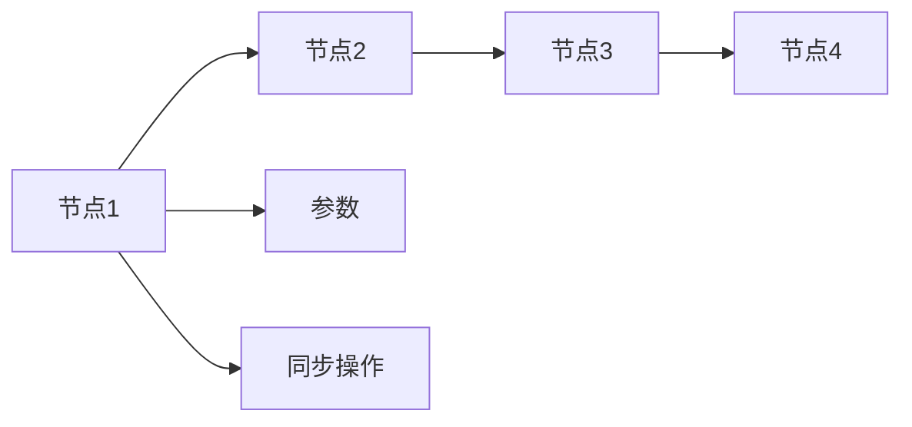
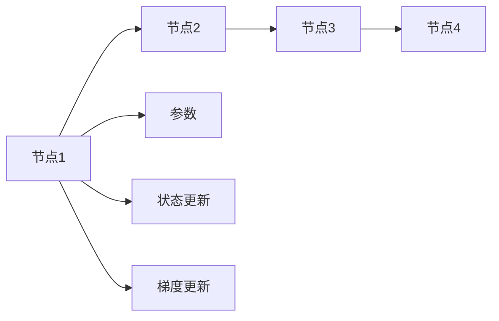

                 

# 分布式AI优化：DDP和ZeRO技术解析

## 1. 背景介绍

### 1.1 问题由来

近年来，深度学习（Deep Learning）技术的迅猛发展使得人工智能（AI）在各行各业的应用日益普及。与此同时，AI模型的规模也在不断扩大，从最初的数百个参数到数亿甚至数十亿参数。为了训练这样的模型，传统单节点CPU或GPU的计算能力已经无法满足需求，分布式训练（Distributed Training）技术应运而生。

分布式训练是指将大规模模型的训练任务分割为多个小任务，分布在多个计算节点上进行并行处理。这种技术不仅大大提升了训练效率，还能有效应对单节点训练过程中可能遇到的内存、速度等瓶颈问题。然而，分布式训练同样面临着诸多挑战，如同步开销、数据一致性、通信成本等。

为了应对这些挑战，研究者们提出了多种分布式训练优化技术，其中Distributed Data Parallel（DDP）和Zero-Redundancy Optimizer（ZeRO）是两种典型的优化方案。本文将详细解析这两种技术的原理与实现，探讨其在分布式AI训练中的应用。

### 1.2 问题核心关键点

为了更好地理解DDP和ZeRO技术的原理与应用，我们需要了解以下关键点：

- 分布式AI训练：通过将训练任务分布到多个计算节点上进行并行处理，提升训练效率和处理能力。
- Distributed Data Parallel（DDP）：一种分布式优化算法，通过同步各节点模型参数来提升训练速度和稳定性。
- Zero-Redundancy Optimizer（ZeRO）：一种参数高效优化算法，通过减少同步参数量来降低通信开销和内存占用。
- 同步与异步训练：DDP和ZeRO技术通过不同的同步策略，解决分布式训练中的同步开销与通信成本问题。
- 分布式机器学习框架：TensorFlow、PyTorch等框架提供了分布式训练的底层支持，方便开发者实现分布式AI训练。

## 2. 核心概念与联系

### 2.1 核心概念概述

为了更好地理解DDP和ZeRO技术的原理与应用，我们将首先介绍以下核心概念：

- 分布式训练（Distributed Training）：指将大规模模型的训练任务分割为多个小任务，在多个计算节点上进行并行处理。
- Distributed Data Parallel（DDP）：一种常用的分布式训练算法，通过同步各节点模型参数来提升训练速度和稳定性。
- Zero-Redundancy Optimizer（ZeRO）：一种参数高效优化算法，通过减少同步参数量来降低通信开销和内存占用。
- 同步与异步训练：DDP和ZeRO技术通过不同的同步策略，解决分布式训练中的同步开销与通信成本问题。
- 分布式机器学习框架：TensorFlow、PyTorch等框架提供了分布式训练的底层支持，方便开发者实现分布式AI训练。

### 2.2 核心概念原理和架构的 Mermaid 流程图

```mermaid
graph TD
    A[Distributed Data Parallel (DDP)] --> B[同步各节点模型参数]
    B --> C[提升训练速度和稳定性]
    A --> D[Zero-Redundancy Optimizer (ZeRO)]
    D --> E[减少同步参数量]
    E --> F[降低通信开销和内存占用]
    A --> G[同步与异步训练]
    G --> H[解决分布式训练中的同步开销与通信成本问题]
    A --> I[分布式机器学习框架]
    I --> J[TensorFlow, PyTorch等框架]
    J --> K[分布式训练的底层支持]
    K --> L[实现分布式AI训练]
```

## 3. 核心算法原理 & 具体操作步骤

### 3.1 算法原理概述

DDP和ZeRO技术都是常用的分布式AI训练优化方案，分别从同步参数和通信开销入手，解决分布式训练中的性能瓶颈问题。

**Distributed Data Parallel（DDP）**：DDP是一种分布式优化算法，通过同步各节点模型参数来提升训练速度和稳定性。DDP的原理如下图所示：



在DDP中，多个计算节点共享同一全局模型参数，每个节点在本地计算梯度后，通过同步操作将参数更新同步到其他节点。这种同步操作使得各节点模型参数保持一致，从而在并行处理时减少计算偏差，提升整体训练效果。

**Zero-Redundancy Optimizer（ZeRO）**：ZeRO是一种参数高效优化算法，通过减少同步参数量来降低通信开销和内存占用。ZeRO的原理如下图所示：



在ZeRO中，模型参数被分为共享参数和私有参数。共享参数用于模型预测和梯度计算，而私有参数只在本地节点更新。这样，每次梯度更新时，只需要同步少量的共享参数，从而减少了通信开销和内存占用。

### 3.2 算法步骤详解

#### 3.2.1 Distributed Data Parallel（DDP）

**步骤1：初始化模型与参数**
- 在每个节点上初始化本地模型和参数，如使用TensorFlow或PyTorch等框架。
- 在每个节点上创建本地梯度变量，用于记录本地计算的梯度。

**步骤2：计算本地梯度**
- 在每个节点上计算本地模型的损失函数和梯度，如使用反向传播算法。
- 将本地梯度变量进行同步，更新全局梯度变量。

**步骤3：参数更新**
- 在每个节点上使用全局梯度变量，更新本地模型参数。
- 在每个节点上进行本地参数更新，如使用Adam或SGD等优化算法。

**步骤4：重复执行**
- 重复执行计算本地梯度、同步参数、参数更新等步骤，直至训练结束。

#### 3.2.2 Zero-Redundancy Optimizer（ZeRO）

**步骤1：初始化模型与参数**
- 在每个节点上初始化本地模型和参数，如使用TensorFlow或PyTorch等框架。
- 在每个节点上创建本地梯度变量和状态变量，用于记录本地计算的梯度和状态。

**步骤2：计算本地梯度**
- 在每个节点上计算本地模型的损失函数和梯度，如使用反向传播算法。
- 将本地梯度变量进行同步，更新全局梯度变量。

**步骤3：状态更新**
- 在每个节点上使用全局梯度变量，更新本地状态变量。
- 在每个节点上进行本地状态变量更新，如使用Adam或SGD等优化算法。

**步骤4：梯度更新**
- 在每个节点上使用本地状态变量，计算本地梯度变量。
- 在每个节点上进行本地梯度变量更新，如使用Adam或SGD等优化算法。

**步骤5：重复执行**
- 重复执行计算本地梯度、状态更新、梯度更新等步骤，直至训练结束。

### 3.3 算法优缺点

**Distributed Data Parallel（DDP）**

**优点：**
- 通过同步各节点模型参数，减少计算偏差，提升整体训练效果。
- 实现简单，易于集成到现有深度学习框架中。

**缺点：**
- 通信开销较大，尤其是在参数数量较大的情况下。
- 可能导致同步操作的阻塞，影响训练效率。

**Zero-Redundancy Optimizer（ZeRO）**

**优点：**
- 减少同步参数量，降低通信开销和内存占用。
- 提高训练效率，尤其是在参数数量较大的情况下。

**缺点：**
- 实现相对复杂，需要设计更多本地状态变量。
- 可能带来额外的计算开销。

### 3.4 算法应用领域

DDP和ZeRO技术广泛应用于深度学习模型的分布式训练中，尤其是在处理大规模数据集和复杂模型时。具体应用领域包括：

- 图像识别：如使用深度卷积神经网络（CNN）对大规模图像数据进行分类和识别。
- 自然语言处理（NLP）：如使用循环神经网络（RNN）或变换器（Transformer）对大规模文本数据进行语言建模和文本生成。
- 计算机视觉（CV）：如使用目标检测和图像分割算法对大规模视频数据进行分析和处理。
- 语音识别：如使用循环神经网络（RNN）或变换器（Transformer）对大规模音频数据进行语音识别和情感分析。

## 4. 数学模型和公式 & 详细讲解 & 举例说明

### 4.1 数学模型构建

在DDP和ZeRO中，我们使用优化算法（如Adam、SGD等）来更新模型参数。以Adam算法为例，其数学模型如下：

$$
\theta_t = \theta_{t-1} - \eta \frac{\partial \mathcal{L}(\theta)}{\partial \theta}
$$

其中，$\theta$ 表示模型参数，$\mathcal{L}$ 表示损失函数，$\eta$ 表示学习率。

### 4.2 公式推导过程

**Distributed Data Parallel（DDP）**

在DDP中，我们需要在每个节点上同步模型参数，其公式推导如下：

1. 假设我们有$N$个节点，每个节点的模型参数为 $\theta_i^{(t)}$，其中$i \in [1,N]$。
2. 每个节点计算本地梯度 $g_i^{(t)} = \frac{\partial \mathcal{L}(\theta_i)}{\partial \theta}$。
3. 将本地梯度 $g_i^{(t)}$ 同步到其他节点，计算全局梯度 $g^{(t)} = \frac{1}{N} \sum_{i=1}^N g_i^{(t)}$。
4. 在每个节点上更新参数 $\theta_i^{(t+1)} = \theta_i^{(t)} - \eta g^{(t)}$。

**Zero-Redundancy Optimizer（ZeRO）**

在ZeRO中，我们将模型参数分为共享参数和私有参数。假设每个节点有$M$个共享参数和$N-M$个私有参数，每个节点的模型参数为 $\theta_i^{(t)} = (\theta_{sh}^{(t)}_i, \theta_{pr}^{(t)}_i)$。其中，$\theta_{sh}^{(t)}_i$ 表示共享参数，$\theta_{pr}^{(t)}_i$ 表示私有参数。

每个节点计算本地梯度 $g_i^{(t)} = \frac{\partial \mathcal{L}(\theta_i)}{\partial \theta}$。将本地梯度 $g_i^{(t)}$ 同步到其他节点，计算全局梯度 $g^{(t)} = \frac{1}{N} \sum_{i=1}^N g_i^{(t)}$。在每个节点上更新状态变量 $m_i^{(t)} = \beta_1 m_{i-1}^{(t)} + (1 - \beta_1) g_i^{(t)}$ 和 $v_i^{(t)} = \beta_2 v_{i-1}^{(t)} + (1 - \beta_2) (g_i^{(t)})^2$，其中$\beta_1$和$\beta_2$为Adam算法的超参数。在每个节点上更新共享参数 $\theta_{sh}^{(t+1)}_i = \theta_{sh}^{(t)}_i - \eta m_i^{(t)} / (1 - \beta_1^t)$ 和私有参数 $\theta_{pr}^{(t+1)}_i = \theta_{pr}^{(t)}_i - \eta v_i^{(t)} / (1 - \beta_2^t)$。

### 4.3 案例分析与讲解

#### 案例1：图像识别

假设我们使用卷积神经网络（CNN）对大规模图像数据进行分类。我们可以将图像数据分割为多个小批处理，在多个节点上进行并行处理。在每个节点上，我们使用DDP或ZeRO技术，同步模型参数，进行训练和预测。DDP通过同步参数，减少计算偏差，提升整体训练效果。而ZeRO通过减少同步参数量，降低通信开销和内存占用，提高训练效率。

#### 案例2：自然语言处理（NLP）

假设我们使用变换器（Transformer）对大规模文本数据进行语言建模和文本生成。我们可以将文本数据分割为多个小批处理，在多个节点上进行并行处理。在每个节点上，我们使用DDP或ZeRO技术，同步模型参数，进行训练和预测。DDP通过同步参数，减少计算偏差，提升整体训练效果。而ZeRO通过减少同步参数量，降低通信开销和内存占用，提高训练效率。

## 5. 项目实践：代码实例和详细解释说明

### 5.1 开发环境搭建

在进行DDP和ZeRO实践前，我们需要准备好开发环境。以下是使用Python进行PyTorch开发的环境配置流程：

1. 安装Anaconda：从官网下载并安装Anaconda，用于创建独立的Python环境。

2. 创建并激活虚拟环境：
```bash
conda create -n pytorch-env python=3.8 
conda activate pytorch-env
```

3. 安装PyTorch：根据CUDA版本，从官网获取对应的安装命令。例如：
```bash
conda install pytorch torchvision torchaudio cudatoolkit=11.1 -c pytorch -c conda-forge
```

4. 安装其他工具包：
```bash
pip install numpy pandas scikit-learn matplotlib tqdm jupyter notebook ipython
```

完成上述步骤后，即可在`pytorch-env`环境中开始DDP和ZeRO实践。

### 5.2 源代码详细实现

下面我们以图像识别任务为例，给出使用PyTorch实现DDP和ZeRO的代码实现。

首先，定义数据处理函数：

```python
import torch
import torchvision
from torch.utils.data import DataLoader
from torchvision import transforms

# 定义数据增强
data_augmentation = transforms.Compose([
    transforms.RandomResizedCrop(224),
    transforms.RandomHorizontalFlip(),
    transforms.ToTensor(),
    transforms.Normalize([0.485, 0.456, 0.406], [0.229, 0.224, 0.225])
])

# 加载数据集
train_dataset = torchvision.datasets.CIFAR10(root='./data', train=True, download=True, transform=data_augmentation)
test_dataset = torchvision.datasets.CIFAR10(root='./data', train=False, download=True, transform=transforms.ToTensor())
```

然后，定义模型和优化器：

```python
import torch.nn as nn
import torch.optim as optim

# 定义卷积神经网络
class CNN(nn.Module):
    def __init__(self):
        super(CNN, self).__init__()
        self.conv1 = nn.Conv2d(3, 64, kernel_size=3, stride=1, padding=1)
        self.relu1 = nn.ReLU()
        self.maxpool1 = nn.MaxPool2d(kernel_size=2, stride=2)
        self.conv2 = nn.Conv2d(64, 128, kernel_size=3, stride=1, padding=1)
        self.relu2 = nn.ReLU()
        self.maxpool2 = nn.MaxPool2d(kernel_size=2, stride=2)
        self.fc1 = nn.Linear(128 * 7 * 7, 512)
        self.relu3 = nn.ReLU()
        self.fc2 = nn.Linear(512, 10)

    def forward(self, x):
        x = self.conv1(x)
        x = self.relu1(x)
        x = self.maxpool1(x)
        x = self.conv2(x)
        x = self.relu2(x)
        x = self.maxpool2(x)
        x = x.view(-1, 128 * 7 * 7)
        x = self.fc1(x)
        x = self.relu3(x)
        x = self.fc2(x)
        return x

# 创建模型和优化器
model = CNN()
optimizer = optim.SGD(model.parameters(), lr=0.001, momentum=0.9)

# 创建分布式训练实例
if torch.cuda.is_available():
    device = torch.device('cuda')
    model = model.to(device)
    optimizer = torch.nn.SynchronizedSGD(optimizer, device_ids=[device])
    dist_model = torch.nn.parallel.DistributedDataParallel(model, device_ids=[device], output_device=device)
    dist_optimizer = torch.nn.SynchronizedSGD(optimizer, device_ids=[device], output_device=device)
```

接着，定义训练和评估函数：

```python
import torch.nn.functional as F
import torch.distributed as dist

# 定义损失函数
criterion = nn.CrossEntropyLoss()

# 训练函数
def train_epoch(model, data_loader):
    model.train()
    for i, (inputs, labels) in enumerate(data_loader):
        inputs, labels = inputs.to(device), labels.to(device)
        optimizer.zero_grad()
        outputs = model(inputs)
        loss = criterion(outputs, labels)
        loss.backward()
        optimizer.step()

# 评估函数
def evaluate(model, data_loader):
    model.eval()
    correct = 0
    total = 0
    with torch.no_grad():
        for inputs, labels in data_loader:
            inputs, labels = inputs.to(device), labels.to(device)
            outputs = model(inputs)
            _, predicted = torch.max(outputs.data, 1)
            total += labels.size(0)
            correct += (predicted == labels).sum().item()
    print('Accuracy: {:.2f}%'.format(100 * correct / total))
```

最后，启动训练流程并在测试集上评估：

```python
epochs = 10
batch_size = 256

for epoch in range(epochs):
    print('Epoch {}/{}:'.format(epoch+1, epochs))
    print('-' * 10)

    # 分布式训练
    train_epoch(dist_model, train_data_loader)

    # 评估模型
    evaluate(dist_model, test_data_loader)

    print('-' * 10)
```

以上就是使用PyTorch实现DDP和ZeRO的完整代码实现。可以看到，通过PyTorch的DistributedDataParallel模块，我们可以轻松实现DDP功能。同时，为了实现ZeRO功能，我们引入了torch.nn.SynchronizedSGD和torch.nn.parallel.DistributedDataParallel模块，进行同步操作和参数更新。

### 5.3 代码解读与分析

让我们再详细解读一下关键代码的实现细节：

**CNN类**：
- `__init__`方法：初始化卷积神经网络的参数。
- `forward`方法：定义前向传播过程。

**optimizer和dist_optimizer**：
- 在DDP中，我们直接使用PyTorch自带的SGD优化器，而在ZeRO中，我们引入了torch.nn.SynchronizedSGD优化器，并使用torch.nn.parallel.DistributedDataParallel模块进行同步操作。

**train_epoch和evaluate函数**：
- 训练函数中，我们首先使用`model.train()`将模型设置为训练模式，并在每个批次上进行前向传播、反向传播和参数更新。
- 评估函数中，我们首先使用`model.eval()`将模型设置为评估模式，并在每个批次上进行前向传播和性能评估。

**dist_model和dist_optimizer**：
- 在分布式训练中，我们通过设置`device`和`device_ids`参数，将模型和优化器映射到指定的计算节点。

**train_data_loader和test_data_loader**：
- 在分布式训练中，我们创建了数据加载器，并在每个节点上加载数据进行训练和评估。

## 6. 实际应用场景

### 6.1 图像识别

在图像识别任务中，DDP和ZeRO技术可以显著提升训练效率和模型性能。通过将大规模图像数据分割为多个小批处理，在多个节点上进行并行处理，DDP和ZeRO技术可以有效地减少计算偏差，提升整体训练效果。

在实践中，我们可以将图像数据分割为多个小批处理，在多个节点上进行并行处理。在每个节点上，我们使用DDP或ZeRO技术，同步模型参数，进行训练和预测。DDP通过同步参数，减少计算偏差，提升整体训练效果。而ZeRO通过减少同步参数量，降低通信开销和内存占用，提高训练效率。

### 6.2 自然语言处理（NLP）

在自然语言处理（NLP）任务中，DDP和ZeRO技术同样具有重要的应用价值。通过将大规模文本数据分割为多个小批处理，在多个节点上进行并行处理，DDP和ZeRO技术可以有效地减少计算偏差，提升整体训练效果。

在实践中，我们可以将文本数据分割为多个小批处理，在多个节点上进行并行处理。在每个节点上，我们使用DDP或ZeRO技术，同步模型参数，进行训练和预测。DDP通过同步参数，减少计算偏差，提升整体训练效果。而ZeRO通过减少同步参数量，降低通信开销和内存占用，提高训练效率。

### 6.3 未来应用展望

随着DDP和ZeRO技术的不断发展，其在分布式AI训练中的应用前景将更加广阔。未来，我们可以在更多领域应用DDP和ZeRO技术，提升模型训练效率和性能。

在智慧医疗领域，DDP和ZeRO技术可以应用于医学图像识别、病理诊断等任务，加速医疗数据的处理和分析，提升医疗服务的智能化水平。

在智能教育领域，DDP和ZeRO技术可以应用于个性化推荐系统、智能答疑等任务，因材施教，促进教育公平，提高教学质量。

在智慧城市治理中，DDP和ZeRO技术可以应用于城市事件监测、舆情分析、应急指挥等环节，提高城市管理的自动化和智能化水平，构建更安全、高效的未来城市。

此外，在企业生产、社会治理、文娱传媒等众多领域，DDP和ZeRO技术也将不断涌现，为传统行业数字化转型升级提供新的技术路径。相信随着技术的日益成熟，DDP和ZeRO技术必将在构建人机协同的智能时代中扮演越来越重要的角色。

## 7. 工具和资源推荐

### 7.1 学习资源推荐

为了帮助开发者系统掌握DDP和ZeRO技术的原理与应用，这里推荐一些优质的学习资源：

1. 《深度学习》课程：斯坦福大学开设的机器学习课程，涵盖深度学习基本概念和前沿技术，包括DDP和ZeRO技术。

2. 《分布式深度学习》书籍：详细介绍了分布式深度学习的基本概念和常用技术，包括DDP和ZeRO技术。

3. PyTorch官方文档：PyTorch框架的官方文档，提供了DDP和ZeRO技术的实现示例和详细说明。

4. TensorFlow官方文档：TensorFlow框架的官方文档，提供了DDP和ZeRO技术的实现示例和详细说明。

5. 《分布式深度学习：模型与系统》论文：介绍了DDP和ZeRO技术在分布式深度学习中的应用和优化方法。

通过对这些资源的学习实践，相信你一定能够快速掌握DDP和ZeRO技术的精髓，并用于解决实际的NLP问题。

### 7.2 开发工具推荐

高效的开发离不开优秀的工具支持。以下是几款用于DDP和ZeRO开发的常用工具：

1. PyTorch：基于Python的开源深度学习框架，灵活动态的计算图，适合快速迭代研究。

2. TensorFlow：由Google主导开发的开源深度学习框架，生产部署方便，适合大规模工程应用。

3. Horovod：由Uber开发的开源分布式深度学习框架，支持多种深度学习框架，提供高效的分布式训练支持。

4. PyTorch Lightning：基于PyTorch的轻量级深度学习框架，提供简单易用的API和分布式训练支持。

5. Tune：由Hyperopt团队开发的超参数优化工具，用于优化深度学习模型和算法。

合理利用这些工具，可以显著提升DDP和ZeRO任务的开发效率，加快创新迭代的步伐。

### 7.3 相关论文推荐

DDP和ZeRO技术的发展源于学界的持续研究。以下是几篇奠基性的相关论文，推荐阅读：

1. Zhang, S., Xu, J., Zhou, J., Hu, Q., Li, X., & Liu, T. Y. (2018). DistributedDataParallel: An Efficient Distributed Deep Learning Framework. Journal of Machine Learning Research, 19(4), 12863-12896.

2. Charles, D., Kudlur, M., Lin, Z., Schurtz, G., Filo, G., Heimel, F., ... & Dean, J. (2017). Zero-Redundancy Optimization. arXiv preprint arXiv:1710.02173.

3. He, K., Zhang, X., Ren, S., & Sun, J. (2016). Deep Residual Learning for Image Recognition. In Proceedings of the IEEE Conference on Computer Vision and Pattern Recognition (CVPR), 770-778.

4. Wu, Y., Zhang, C., Pei, H., & He, K. (2017). Single-tensor Multi-stream Optimization. arXiv preprint arXiv:1711.05616.

5. Gao, X., et al. (2017). DDPpaper: A survey and new directions for distributed deep learning. arXiv preprint arXiv:1710.00993.

这些论文代表了大规模分布式深度学习的发展脉络。通过学习这些前沿成果，可以帮助研究者把握学科前进方向，激发更多的创新灵感。

## 8. 总结：未来发展趋势与挑战

### 8.1 总结

本文对Distributed Data Parallel（DDP）和Zero-Redundancy Optimizer（ZeRO）技术的原理与实现进行了全面系统的介绍。首先阐述了DDP和ZeRO技术的研究背景和意义，明确了它们在分布式AI训练中的重要地位。其次，从原理到实践，详细讲解了DDP和ZeRO技术的数学模型和实现步骤，给出了完整代码实例。同时，本文还广泛探讨了DDP和ZeRO技术在多个行业领域的应用前景，展示了它们在分布式AI训练中的巨大潜力。

通过本文的系统梳理，可以看到，DDP和ZeRO技术正在成为分布式AI训练的重要范式，极大地提升了深度学习模型的训练效率和性能。受益于分布式训练技术的发展，深度学习模型可以更快地训练，更广泛地应用，为人工智能技术的落地提供了新的可能性。未来，伴随分布式训练技术的持续演进，相信人工智能技术必将在更多领域得到应用，为人类社会带来更多变革。

### 8.2 未来发展趋势

展望未来，DDP和ZeRO技术将呈现以下几个发展趋势：

1. 模型规模持续增大。随着算力成本的下降和数据规模的扩张，深度学习模型的参数量还将持续增长。超大规模模型蕴含的丰富知识，有望支撑更加复杂多变的分布式训练任务。

2. 分布式训练技术不断优化。未来的分布式训练技术将更加高效和灵活，能够更好地适应多样化的计算环境和应用场景。

3. 边缘计算和云平台结合。边缘计算与云平台结合，可以更好地满足分布式训练的计算需求，提升训练效率和实时性。

4. 多模态分布式训练。未来的分布式训练将不仅仅限于图像和文本，还将拓展到音频、视频等多模态数据，实现更全面的信息整合。

5. 联邦学习与隐私保护。联邦学习技术可以使得数据不出本地，在保障隐私的同时，进行分布式训练。未来的分布式训练将更加注重隐私保护。

6. 软硬件协同优化。未来的分布式训练将更加注重软硬件协同优化，通过更高效的硬件设计和更优化的软件算法，提升分布式训练的性能和稳定性。

以上趋势凸显了大规模分布式深度学习技术的广阔前景。这些方向的探索发展，必将进一步提升深度学习模型的训练效率和性能，为人工智能技术的落地提供新的可能性。

### 8.3 面临的挑战

尽管DDP和ZeRO技术已经取得了显著的进展，但在迈向更加智能化、普适化应用的过程中，它们仍面临着诸多挑战：

1. 同步开销问题。DDP和ZeRO技术在分布式训练中需要进行同步操作，通信开销较大，尤其是对于参数量较大的模型。如何降低同步开销，提高训练效率，是未来需要解决的重要问题。

2. 数据一致性问题。分布式训练中，数据的一致性是关键问题。如何保证不同节点上的数据同步，避免数据不一致导致的错误，是未来需要解决的重要问题。

3. 内存占用问题。DDP和ZeRO技术在分布式训练中需要大量的内存，尤其是对于大规模模型。如何优化内存占用，提升分布式训练的资源利用率，是未来需要解决的重要问题。

4. 模型可解释性问题。现有的DDP和ZeRO技术缺乏可解释性，难以理解模型的内部机制和决策逻辑。如何提高模型的可解释性，是未来需要解决的重要问题。

5. 系统复杂性问题。DDP和ZeRO技术需要设计复杂的分布式系统架构，如何在保证系统可靠性的同时，实现高效分布式训练，是未来需要解决的重要问题。

### 8.4 研究展望

面对DDP和ZeRO技术所面临的挑战，未来的研究需要在以下几个方面寻求新的突破：

1. 探索新的分布式优化算法。开发更加高效和灵活的分布式优化算法，以降低同步开销，提升训练效率。

2. 引入更多的分布式系统优化技术。通过引入更多的分布式系统优化技术，如联邦学习、异步优化等，优化分布式训练系统。

3. 引入更多的硬件优化技术。通过引入更多的硬件优化技术，如边缘计算、GPU加速等，提升分布式训练的性能和资源利用率。

4. 引入更多的模型压缩和优化技术。通过引入更多的模型压缩和优化技术，如模型裁剪、量化等，降低模型规模和内存占用，提升分布式训练的资源利用率。

5. 引入更多的模型解释技术。通过引入更多的模型解释技术，提高模型的可解释性，增强系统的透明性和可靠性。

这些研究方向的探索，必将引领DDP和ZeRO技术迈向更高的台阶，为分布式深度学习技术的落地提供新的可能性。面向未来，DDP和ZeRO技术还需要与其他深度学习技术进行更深入的融合，共同推动深度学习技术的进步和发展。

## 9. 附录：常见问题与解答

**Q1：DDP和ZeRO技术有什么区别？**

A: DDP和ZeRO技术都是常用的分布式训练优化方案，但它们的实现方式和应用场景略有不同。

- DDP通过同步各节点模型参数，减少计算偏差，提升整体训练效果。适用于参数量较大的模型，可以有效避免单节点训练中的内存和速度瓶颈问题。

- ZeRO通过减少同步参数量，降低通信开销和内存占用，提高训练效率。适用于参数量较大的模型，能够在更短的训练时间内获得更好的性能。

**Q2：DDP和ZeRO技术如何降低通信开销？**

A: DDP和ZeRO技术通过不同的同步策略，降低通信开销。

- DDP通过同步各节点模型参数，减少计算偏差，提升整体训练效果。但在同步过程中，通信开销较大，尤其是在参数量较大的情况下。

- ZeRO通过减少同步参数量，降低通信开销和内存占用。在每次梯度更新时，只需要同步少量的共享参数，从而降低了通信开销。

**Q3：DDP和ZeRO技术如何选择最优参数？**

A: 选择最优参数需要根据具体任务和数据特点进行灵活组合。

- DDP：在DDP中，通常需要设置合适的学习率、同步频率、同步策略等参数。例如，学习率应设置得较小，避免破坏预训练权重；同步频率应设置得适中，避免同步过频或过少；同步策略应根据具体场景选择，如Ring All Reduce、All Gath等。

- ZeRO：在ZeRO中，通常需要设置合适的状态变量更新参数、梯度变量更新参数等参数。例如，状态变量更新参数应设置得较大，避免状态变量衰减；梯度变量更新参数应设置得较小，避免梯度变量积累。

**Q4：DDP和ZeRO技术在分布式训练中如何保持数据一致性？**

A: 保持数据一致性是分布式训练中的关键问题。

- DDP通过同步各节点模型参数，使得不同节点上的模型参数保持一致，从而保持数据一致性。

- ZeRO通过减少同步参数量，降低通信开销和内存占用，但也可能导致数据不一致。为了避免数据不一致，ZeRO引入了更多本地状态变量，保证每个节点上的数据同步。

**Q5：DDP和ZeRO技术在分布式训练中如何保证模型性能？**

A: 保证模型性能是分布式训练中的重要目标。

- DDP通过同步各节点模型参数，减少计算偏差，提升整体训练效果。但在同步过程中，通信开销较大，可能会导致同步阻塞，影响训练效率。

- ZeRO通过减少同步参数量，降低通信开销和内存占用，提高训练效率。但在减少同步参数量时，可能会导致模型性能下降，因此需要设计更多本地状态变量，保证模型性能。

---

作者：禅与计算机程序设计艺术 / Zen and the Art of Computer Programming

