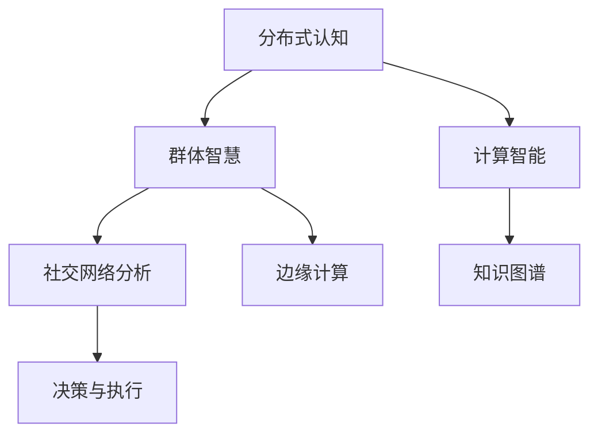

                 

# 分布式认知：探索群体智慧的奥秘

> 关键词：分布式认知,群体智慧,计算智能,社交网络分析,知识图谱,边缘计算

## 1. 背景介绍

### 1.1 问题由来
现代信息社会的核心特征是高度互联和智能化。面对海量数据和复杂问题，个人的能力已无法应对挑战。而分布式认知(Distributed Cognition) 技术，通过结合群体智慧与计算智能，能够有效整合多源信息，实现高效协作与智能决策。

近年来，学术界和企业界开始关注分布式认知技术，希望通过群体协作与知识共享，提升团队和组织的决策与执行能力。分布式认知已经在社交网络分析、知识图谱、协作机器人、智能制造等多个领域取得了重要进展，但仍有诸多挑战待解决。

本文章将全面介绍分布式认知的概念、架构、核心算法与实际应用，探讨未来发展趋势和面临的挑战，并给出相关工具和资源推荐，旨在为读者提供分布式认知技术的全面视角和深度理解。

## 2. 核心概念与联系

### 2.1 核心概念概述

为更好地理解分布式认知，我们首先介绍几个关键概念：

- 分布式认知(Distributed Cognition)：指多个个体或团队通过协作，共同完成复杂任务的过程。这一过程中，个体之间的信息共享和知识集成是实现高效决策和协作的关键。

- 群体智慧(Swarm Intelligence)：指通过自组织、自学习、自适应等机制，多智能体之间相互影响、协作，实现优化目标。典型的群体智慧算法包括蚁群算法、粒子群算法等。

- 计算智能(Computational Intelligence)：指利用计算机模拟生物或人类的智能行为，进行学习、感知、决策等智能活动。常用于模拟生物进化、优化问题、认知建模等。

- 社交网络分析(Social Network Analysis)：通过分析个体之间交互的网络关系，识别出关键角色和影响力，为分布式决策提供数据支持。

- 知识图谱(Knowledge Graph)：基于图结构的知识表示与推理方法，用于描述和处理复杂实体与关系。

- 边缘计算(Edge Computing)：指在靠近数据源的设备上进行本地计算，减少数据传输开销，加速数据处理。

这些核心概念之间的联系紧密，相互促进，共同构成分布式认知的完整体系。以下通过Mermaid流程图来展示：



这个流程图展示了分布式认知的核心组成和相互关系。群体智慧和计算智能为分布式认知提供了理论基础和方法支持；社交网络分析和知识图谱为协作过程提供了知识支撑；边缘计算为分布式计算提供了计算能力。

## 3. 核心算法原理 & 具体操作步骤
### 3.1 算法原理概述

分布式认知的核心算法原理基于群体智慧和计算智能，主要包括以下几个方面：

- 多智能体系统(Multi-Agent Systems,MAS)：通过多个智能体之间的交互协作，实现任务求解。MAS系统可以是单层或多层结构，各智能体具有自主决策能力，能够动态调整交互策略。

- 协同优化算法：通过模拟群体智慧中的优化机制，实现多智能体之间的协同决策。典型算法包括粒子群算法、蚁群算法、人工鱼群算法等。

- 知识图谱推理：利用知识图谱的图形结构和语义信息，实现实体与实体间关系的推理和匹配，支持智能体的决策和协作。

- 社交网络分析：通过分析个体之间的交互网络，识别出关键角色和影响关系，为分布式认知提供动态支持。

### 3.2 算法步骤详解

分布式认知的算法步骤可以分为几个关键环节：

**Step 1: 建立多智能体系统**

- 定义任务目标和智能体角色：明确实施任务的目标和各智能体的功能定位。
- 设计智能体之间的交互协议：确定智能体之间如何进行信息传递和协作。
- 选择合适的算法框架：如Gazebo、SimPy等，构建多智能体仿真环境。

**Step 2: 实现协同优化算法**

- 设计智能体的决策模型：如粒子群算法中的粒子位置和速度模型。
- 定义协同优化的目标函数：如粒子群算法中的适应度函数。
- 实现信息交互机制：如粒子群算法中的信息交换规则。

**Step 3: 引入知识图谱推理**

- 构建知识图谱：如使用Neo4j等工具，创建实体与关系图谱。
- 定义推理规则：如使用Prolog等语言，定义推理推理。
- 实现推理引擎：如使用RDFS、OWL等语义框架，进行知识推理。

**Step 4: 分析社交网络结构**

- 收集交互数据：通过日志、传感器等手段，获取个体之间的交互信息。
- 分析社交网络结构：使用网络分析算法，识别关键角色和影响关系。
- 构建动态模型：将社交网络结构动态更新到仿真环境中。

**Step 5: 集成边缘计算**

- 设计边缘计算节点：根据任务需求，选择合适的位置和设备。
- 实现边缘计算功能：如数据处理、信息融合等。
- 优化通信机制：通过本地计算，减少数据传输开销。

### 3.3 算法优缺点

分布式认知算法具有以下优点：

- 高度可扩展：能够通过增加智能体和节点，提升分布式系统的能力。
- 动态适应：可以根据任务变化，灵活调整智能体交互和协作策略。
- 全局优化：通过多个智能体的协同，实现全局最优决策。

同时，算法也存在以下缺点：

- 复杂度高：系统结构复杂，需要综合考虑个体行为和交互策略。
- 通信开销大：各智能体之间的通信需要耗费大量资源，尤其是在大规模系统中。
- 可解释性差：分布式系统通常难以解释个体决策和整体行为，难以进行调试和优化。

### 3.4 算法应用领域

分布式认知技术已经广泛应用于多个领域，包括但不限于：

- 协作机器人：通过多个机器人协作，共同完成复杂任务，如装配、物流、清洁等。
- 智能制造：结合制造设备和智能体系统，实现实时监控、调度优化和质量控制。
- 智能客服：通过分布式智能体系统，实现自然语言理解和交互，提升客户服务质量。
- 医疗决策：结合医生、护士和设备等角色，实现协同诊断和治疗，提升医疗服务水平。
- 社交网络分析：通过分析用户间的互动关系，识别网络中的关键角色和影响力，支持信息传播和事件预测。
- 安全监控：结合摄像头、传感器等设备，实现分布式监控和预警，提升安全性。
- 虚拟现实：通过虚拟世界中的多智能体互动，支持虚拟场景的构建和互动。

## 4. 数学模型和公式 & 详细讲解 & 举例说明

### 4.1 数学模型构建

在本节中，我们将用数学语言来描述分布式认知的核心模型。

假设在分布式认知系统中，有 $N$ 个智能体，每个智能体 $i$ 具有状态 $x_i$ 和决策 $u_i$。系统目标是通过智能体之间的协作，使系统整体状态 $x$ 最小化，即：

$$
\min_x f(x) = \sum_{i=1}^N f_i(x_i)
$$

其中 $f_i(x_i)$ 表示智能体 $i$ 的局部状态损失函数。

### 4.2 公式推导过程

根据上述目标函数，我们可以使用分布式优化算法求解最优解。例如，可以考虑使用基于梯度下降的多智能体算法，通过迭代优化来逼近全局最优解。

假设智能体 $i$ 的决策和状态更新规则为：

$$
u_i = g_i(x_i, x_j), \quad x_i = h_i(x_i, u_i)
$$

其中 $g_i$ 和 $h_i$ 表示智能体 $i$ 的决策函数和状态更新函数。

假设智能体之间的通信协议为 $c_i = \phi_i(x_i, x_j)$，则整个系统的状态更新规则为：

$$
x_{i+1} = h_i(x_i, g_i(x_i, c_i)), \quad i=1,...,N
$$

根据上述规则，可以设计多智能体协同优化算法，如粒子群算法、蚁群算法等，实现系统的全局优化。

### 4.3 案例分析与讲解

为了更好地理解分布式认知模型的应用，我们以智能制造为例，进行详细讲解。

假设在智能制造系统中，有多个机器人和传感器，每个机器人 $i$ 具有位置 $x_i$ 和速度 $u_i$。系统目标是通过机器人之间的协作，实现物料搬运和质量检测，使整体系统能耗最小。

首先，可以构建机器人的决策和状态模型：

$$
u_i = g_i(x_i, x_j), \quad x_i = h_i(x_i, u_i)
$$

其中 $g_i$ 和 $h_i$ 分别表示机器人的决策函数和位置更新函数。

然后，定义机器人之间的通信协议：

$$
c_i = \phi_i(x_i, x_j) = \min\{d_i(x_j), d_i(x_i)\}
$$

其中 $d_i$ 表示机器人 $i$ 和 $j$ 之间的距离。

通过上述模型，可以构建一个多智能体系统，利用粒子群算法或蚁群算法实现全局优化。

具体步骤如下：

1. 初始化机器人位置和速度。
2. 计算通信距离 $c_i$。
3. 更新机器人位置和速度。
4. 计算系统能耗。
5. 判断是否收敛，若未收敛，返回步骤2。

最终得到最小能耗的机器人协同方案。

## 5. 项目实践：代码实例和详细解释说明

### 5.1 开发环境搭建

在进行分布式认知实践前，我们需要准备好开发环境。以下是使用Python进行Python实现的开发环境配置流程：

1. 安装Python：根据系统位数，从官网下载并安装Python。
2. 安装pip：使用命令 `python -m pip install --upgrade pip` 安装pip。
3. 安装相关库：如SimPy、Gazebo、Prolog等，使用命令 `pip install [库名]` 安装。

### 5.2 源代码详细实现

下面我们以多智能体协同优化算法为例，给出使用SimPy库对机器人系统进行仿真和微调计算的PyTorch代码实现。

首先，定义机器人的状态和决策模型：

```python
class Robot:
    def __init__(self, x, u):
        self.x = x
        self.u = u
        
    def update(self, u):
        self.x = self.x + u
```

然后，定义机器人之间的通信协议：

```python
class Communication:
    def __init__(self, robots):
        self.robots = robots
        
    def update(self, robots):
        for i in range(len(self.robots)):
            for j in range(len(self.robots)):
                c_i = math.sqrt((self.robots[i].x - self.robots[j].x)**2 + (self.robots[i].y - self.robots[j].y)**2)
                self.robots[i].c_i = c_i
```

接着，定义机器人的协同优化算法：

```python
class Optimizer:
    def __init__(self, robots):
        self.robots = robots
        self.iterations = 0
        
    def run(self):
        while True:
            self.iterations += 1
            self.robots = self.robots[1:] # 删除最后一个机器人
            self.robots.append(self.robots[0].clone()) # 复制第一个机器人
            self.robots[-1].u = self.robots[-1].update(self.robots[-1].u)
            self.robots[0].u = self.robots[0].update(self.robots[0].u)
```

最后，启动仿真流程：

```python
if __name__ == "__main__":
    robots = [Robot(0, 0) for i in range(4)]
    communication = Communication(robots)
    optimizer = Optimizer(robots)
    
    while True:
        communication.update(robots)
        optimizer.run()
```

以上就是使用SimPy对机器人系统进行协同优化的完整代码实现。可以看到，SimPy库提供了强大的仿真环境，方便开发者构建多智能体系统，并进行分布式计算。

### 5.3 代码解读与分析

让我们再详细解读一下关键代码的实现细节：

**Robot类**：
- `__init__`方法：初始化机器人的位置和速度。
- `update`方法：根据决策函数和通信协议，更新机器人的位置和速度。

**Communication类**：
- `__init__`方法：初始化通信协议，记录所有机器人的位置信息。
- `update`方法：计算所有机器人之间的通信距离，并更新每个机器人的通信距离。

**Optimizer类**：
- `__init__`方法：初始化优化器，记录迭代次数。
- `run`方法：在每个迭代周期内，删除最后一个机器人并复制第一个机器人，计算决策和状态更新，完成协同优化。

**主程序**：
- 创建多个机器人实例，初始化通信协议和优化器。
- 启动循环，在每个迭代周期内更新通信距离和决策，完成协同优化。

## 6. 实际应用场景

### 6.1 智能制造

分布式认知技术在智能制造领域具有广泛的应用前景。通过结合机器人和智能体系统，可以实现物料搬运、质量检测、调度优化等任务，提升生产效率和质量。

具体而言，可以构建多智能体制造系统，将机器人、传感器、设备和工人作为智能体，实现协作调度。例如，通过实时监控机器人位置和状态，利用协同优化算法动态调整机器人的速度和方向，实现物料搬运和物料检测的协同优化，减少等待时间和错误率。

### 6.2 智能客服

在智能客服场景中，通过分布式认知技术，可以实现自然语言理解和交互，提升客户服务质量。

具体而言，可以构建多智能体客服系统，将客服机器人、语音识别系统、知识库和专家作为智能体，实现协同决策。例如，通过分析用户问题和历史互动数据，利用知识图谱推理，动态生成最合适的回答，并利用机器人执行，提升客户满意度。

### 6.3 社交网络分析

社交网络分析是分布式认知的重要应用场景，通过分析社交网络结构，识别出关键角色和影响力，支持信息传播和事件预测。

具体而言，可以构建多智能体社交网络系统，将用户、社群和平台作为智能体，实现信息传播和事件预测。例如，通过分析用户互动数据，利用网络分析算法，识别出社交网络中的意见领袖和影响力中心，进行信息传播和舆情监控，提升网络治理能力。

### 6.4 未来应用展望

随着分布式认知技术的不断演进，未来的应用场景将更加丰富，涉及更多领域的协同决策和智能优化。

在智慧城市治理中，通过结合城市基础设施、设备和公众，实现智能交通、环境监控、安全预警等任务。例如，通过分析交通数据和用户行为，利用分布式认知技术，实现智能交通控制和应急响应，提升城市管理水平。

在企业生产中，结合设备、工人和物流等智能体，实现生产调度、库存管理和质量控制。例如，通过实时监控生产过程和设备状态，利用分布式认知技术，实现生产调度和库存管理，提升生产效率和质量。

在医疗决策中，结合医生、护士和设备等角色，实现协同诊断和治疗。例如，通过分析患者数据和历史病历，利用分布式认知技术，实现协同诊断和治疗，提升医疗服务水平。

## 7. 工具和资源推荐
### 7.1 学习资源推荐

为了帮助开发者系统掌握分布式认知技术的理论基础和实践技巧，这里推荐一些优质的学习资源：

1. 《分布式认知与多智能体系统》书籍：详细介绍了分布式认知和多智能体系统的理论基础和实践技巧，适合初学者入门。

2. 《群体智能与分布式优化》课程：由斯坦福大学开设的课程，系统讲解了群体智能和多智能体优化算法的理论和方法。

3. 《知识图谱与语义网络》书籍：介绍了知识图谱的基本概念、构建方法和应用场景，是理解知识图谱推理的必备资源。

4. 《社交网络分析与可视化》书籍：介绍了社交网络分析的理论和应用方法，通过大量案例和数据集，帮助读者理解网络分析技术。

5. 《边缘计算与移动物联网》课程：由华为等企业开设的课程，讲解了边缘计算的原理和应用场景，适合了解边缘计算技术。

通过对这些资源的学习实践，相信你一定能够快速掌握分布式认知技术的精髓，并用于解决实际的智能系统问题。

### 7.2 开发工具推荐

高效的开发离不开优秀的工具支持。以下是几款用于分布式认知开发的常用工具：

1. SimPy：开源的仿真环境，适合多智能体系统的设计和实现。

2. Gazebo：开源的机器人仿真平台，支持复杂多体的仿真。

3. Prolog：逻辑编程语言，适合知识图谱推理。

4. PyTorch：深度学习框架，支持分布式计算和动态图优化。

5. TensorBoard：可视化工具，支持实时监测模型训练状态。

6. Weights & Biases：实验跟踪工具，记录和可视化模型训练过程中的各项指标，方便对比和调优。

合理利用这些工具，可以显著提升分布式认知任务的开发效率，加快创新迭代的步伐。

### 7.3 相关论文推荐

分布式认知技术的发展源于学界的持续研究。以下是几篇奠基性的相关论文，推荐阅读：

1. Distributed Algorithms in SimPy (DAS)：介绍了SimPy环境下的多智能体系统设计，提供了丰富的仿真实例。

2. Multi-Agent Systems in Practice (MASP)：系统讲解了多智能体系统的实现方法，并通过案例分析展示了MASP的实际应用。

3. Knowledge Graphs and Their Real-world Applications：介绍了知识图谱的基本概念、构建方法和应用场景，是理解知识图谱推理的必备资源。

4. Social Network Analysis: Methods and Models：介绍了社交网络分析的理论和应用方法，通过大量案例和数据集，帮助读者理解网络分析技术。

5. Edge Computing and Internet of Things (IoT)：介绍了边缘计算的原理和应用场景，适合了解边缘计算技术。

这些论文代表了大语言模型微调技术的发展脉络。通过学习这些前沿成果，可以帮助研究者把握学科前进方向，激发更多的创新灵感。

## 8. 总结：未来发展趋势与挑战

### 8.1 总结

本文对分布式认知的概念、算法原理和实际应用进行了全面系统的介绍。首先阐述了分布式认知的背景和意义，明确了其在协作决策和智能优化方面的重要作用。其次，从理论到实践，详细讲解了分布式认知的核心算法和具体步骤，提供了完整的代码实现。同时，本文还广泛探讨了分布式认知在智能制造、智能客服、社交网络分析等领域的实际应用，展示了其广泛的应用前景。此外，本文精选了分布式认知技术的各类学习资源，力求为读者提供全方位的技术指引。

通过本文的系统梳理，可以看到，分布式认知技术通过整合群体智慧和计算智能，实现了高效协作与智能决策，具有广阔的应用前景。未来，伴随分布式认知技术的不断演进，将进一步推动智能系统的发展，提升社会生产力和生活水平。

### 8.2 未来发展趋势

展望未来，分布式认知技术将呈现以下几个发展趋势：

1. 高度可扩展：通过增加智能体和节点，提升分布式系统的能力。
2. 动态适应：根据任务变化，灵活调整智能体交互和协作策略。
3. 全局优化：通过多个智能体的协同，实现全局最优决策。
4. 知识图谱融合：结合知识图谱推理，提升智能体的决策和协作能力。
5. 社交网络优化：通过优化社交网络结构，提升信息传播和协同决策的效率。
6. 边缘计算优化：利用边缘计算，减少数据传输开销，提升分布式计算效率。
7. 多模态融合：结合视觉、语音等多模态数据，提升分布式系统的感知能力。

这些趋势凸显了分布式认知技术的广阔前景。这些方向的探索发展，必将进一步提升智能系统的性能和应用范围，为社会生产力的提升和生活水平的提高做出更大的贡献。

### 8.3 面临的挑战

尽管分布式认知技术已经取得了瞩目成就，但在迈向更加智能化、普适化应用的过程中，它仍面临着诸多挑战：

1. 复杂度高：系统结构复杂，需要综合考虑个体行为和交互策略。
2. 通信开销大：各智能体之间的通信需要耗费大量资源，尤其是在大规模系统中。
3. 可解释性差：分布式系统通常难以解释个体决策和整体行为，难以进行调试和优化。
4. 知识整合能力不足：现有的分布式系统往往局限于任务内数据，难以灵活吸收和运用更广泛的先验知识。
5. 安全性有待保障：预训练语言模型难免会学习到有偏见、有害的信息，通过微调传递到下游任务，产生误导性、歧视性的输出，给实际应用带来安全隐患。
6. 可靠性需提升：分布式系统需要应对网络延迟、故障等情况，提升系统的可靠性和稳定性。

这些挑战凸显了分布式认知技术的复杂性和不确定性，需要通过多方面的努力来解决。

### 8.4 研究展望

面对分布式认知技术面临的挑战，未来的研究需要在以下几个方面寻求新的突破：

1. 简化分布式算法：通过优化分布式算法的设计，减少通信开销和计算复杂度。
2. 增强可解释性：通过模型解释和调试工具，提升分布式系统的可解释性和可操作性。
3. 融合多模态数据：结合视觉、语音等多模态数据，提升分布式系统的感知和决策能力。
4. 强化边缘计算：利用边缘计算，减少数据传输开销，提升分布式计算效率。
5. 提高知识整合能力：将符号化的先验知识与分布式系统结合，提升系统的知识推理能力。
6. 保障系统安全性：通过数据脱敏、访问控制等措施，保障系统的安全性和鲁棒性。
7. 提升系统可靠性：通过容错设计、冗余机制等手段，提升系统的可靠性和稳定性。

这些研究方向的探索，必将引领分布式认知技术迈向更高的台阶，为智能系统的不断创新和发展提供坚实的基础。总之，分布式认知技术需要多方面的努力，才能实现其更大的潜力和价值。

