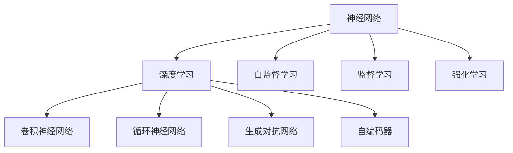
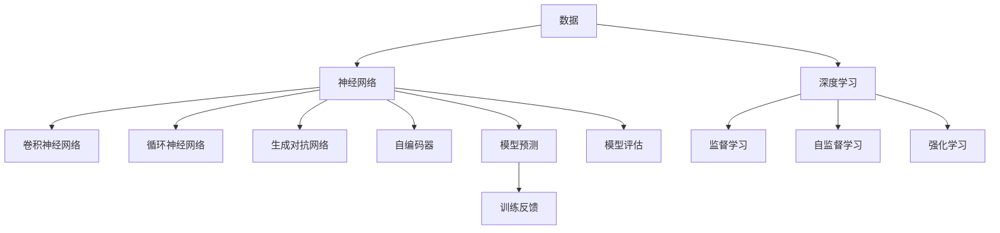

                 

# 创业精神：Perplex性 AI 的基因

## 1. 背景介绍

### 1.1 问题由来

在当前的信息时代，人工智能（AI）技术正以势不可挡之势，迅速渗透到各行各业。AI技术的迅猛发展，离不开创新和创业精神的驱动。尤其是在近年来，深度学习和神经网络技术的飞速进步，更是推动了AI研究进入了一个新的发展阶段。然而，这些复杂的AI技术往往被冠以“黑箱”之名的标签，因为其背后蕴含的原理和机制，常常显得深奥而难以理解。

### 1.2 问题核心关键点

AI技术，尤其是深度学习，其核心在于通过大量的数据训练，构建复杂的非线性模型，从而实现对于数据的高级抽象和预测。这一过程通常涉及以下几个核心概念：

- **神经网络(Neural Networks)**：一种模仿人脑神经元结构的网络模型，通过层与层之间的连接，实现对于复杂模式的学习和预测。
- **深度学习(Deep Learning)**：一种基于多层次神经网络的机器学习技术，通过逐层递进的学习，提高模型的表达能力和泛化性能。
- **卷积神经网络(Convolutional Neural Networks, CNNs)**：针对图像和视觉数据的一种特殊神经网络，通过卷积操作提取空间局部特征。
- **循环神经网络(Recurrent Neural Networks, RNNs)**：针对时间序列数据的一种神经网络，通过循环操作实现时序信息的处理。
- **生成对抗网络(Generative Adversarial Networks, GANs)**：一种通过对抗训练学习生成新数据的技术，在图像生成、音频生成等领域有广泛应用。
- **自编码器(Autocoders)**：一种通过编码和解码操作实现数据压缩和重构的技术，在特征提取和数据压缩等方面有重要应用。

这些核心概念之间的逻辑关系可以通过以下Mermaid流程图来展示：



这个流程图展示了几大AI技术的核心概念及其之间的关系：

1. 神经网络是深度学习的基础。
2. 深度学习通过多层次的神经网络实现对复杂数据模式的建模。
3. 卷积神经网络和循环神经网络分别针对不同类型的数据设计。
4. 生成对抗网络和自编码器进一步扩展了深度学习的应用场景。
5. 自监督学习、监督学习和强化学习是深度学习模型训练的三种主要方式。

这些概念共同构成了AI技术的框架，为数据驱动的智能系统提供了强大的支持。通过理解这些核心概念，我们可以更好地把握AI技术的精髓，并将其应用于实际应用中。

## 2. 核心概念与联系

### 2.1 核心概念概述

为了更好地理解AI技术的创业精神，本节将介绍几个关键概念，并探讨它们之间的联系：

- **创业精神**：指在技术和商业领域中，基于创新思维和风险承受能力的精神。在AI领域，这种精神体现在对于新技术的探索、新市场的开拓和新产品的创新上。
- **Perplexity**：在自然语言处理中，perplexity是一种衡量模型预测能力的重要指标。它反映了模型在给定数据集上的预测不确定性，perplexity越小，模型的预测能力越强。
- **AI基因**：指的是AI技术的底层原理、算法框架和工具集，这些元素共同构成了AI技术的核心竞争力。

### 2.2 核心概念原理和架构的 Mermaid 流程图

以下是AI技术中的一些核心概念的相互联系，它们之间通过数据和计算相互作用：



在这个流程图中，数据通过神经网络和深度学习被转换为模型预测结果。在模型预测和训练反馈之间，不断地进行评估和优化，从而提高模型的准确性和泛化能力。

### 2.3 核心概念之间的关系

AI技术的核心概念之间存在紧密的联系。例如：

- **数据**是AI技术的基石，所有的模型训练和预测都依赖于数据。
- **神经网络**是深度学习的基础，通过多层次的结构实现复杂的模式识别和预测。
- **深度学习**是AI技术的重要分支，通过多层次的神经网络实现对复杂数据模式的建模。
- **卷积神经网络**和**循环神经网络**分别针对不同类型的数据，提高了深度学习模型在图像和时序数据处理上的性能。
- **生成对抗网络**和**自编码器**进一步扩展了深度学习的应用场景，实现了数据的生成和重构。
- **监督学习、自监督学习和强化学习**是深度学习模型训练的三种主要方式，每种方式都有其独特的优势和应用场景。

这些核心概念通过相互作用，共同推动了AI技术的不断进步和创新。

## 3. 核心算法原理 & 具体操作步骤

### 3.1 算法原理概述

AI技术的核心算法原理通常基于以下三个步骤：

1. **数据预处理**：对原始数据进行清洗、归一化和特征工程，提高数据的可用性和模型训练效率。
2. **模型训练**：通过大量的数据和计算，构建复杂的神经网络模型，优化模型的参数，提高模型的泛化能力。
3. **模型预测**：使用训练好的模型对新数据进行预测，实现对于未知数据的高级抽象和决策。

### 3.2 算法步骤详解

以下是一个典型的AI模型训练流程：

1. **数据准备**：收集和整理数据集，进行数据清洗和预处理。
2. **模型构建**：选择合适的神经网络结构和算法框架，定义模型损失函数和优化器。
3. **模型训练**：将数据集分成训练集和验证集，使用训练集进行模型参数的优化，通过验证集评估模型性能，防止过拟合。
4. **模型评估**：在测试集上评估模型的泛化能力和预测准确性，判断模型是否达到应用需求。
5. **模型应用**：将训练好的模型部署到实际应用中，进行数据预测和决策支持。

### 3.3 算法优缺点

AI模型的优点包括：

- **自动化**：能够自动完成数据预处理和模型训练，减少了人工干预的工作量。
- **高效性**：通过大规模的计算和数据训练，模型能够快速实现对复杂模式的识别和预测。
- **泛化能力**：通过训练好的模型，可以对未知数据进行预测，实现对新场景的适应。

AI模型的缺点包括：

- **数据依赖**：模型的训练和预测依赖于大量的数据，数据获取和处理成本较高。
- **黑盒问题**：模型内部机制复杂，难以解释和理解，难以进行调试和优化。
- **计算资源需求**：模型训练和推理需要大量的计算资源，对于小规模应用存在计算瓶颈。
- **过拟合风险**：模型在训练集上表现良好，但在测试集上可能出现过拟合，导致性能下降。

### 3.4 算法应用领域

AI技术在许多领域都有广泛的应用，以下是几个典型的应用场景：

- **自然语言处理**：包括机器翻译、情感分析、文本分类、问答系统等。
- **计算机视觉**：包括图像识别、物体检测、图像生成等。
- **语音识别**：包括语音转换、语音合成、语音识别等。
- **推荐系统**：包括电商推荐、内容推荐、广告推荐等。
- **智能控制**：包括自动驾驶、智能家居、机器人控制等。
- **医疗健康**：包括医学影像分析、疾病预测、药物研发等。

## 4. 数学模型和公式 & 详细讲解 & 举例说明

### 4.1 数学模型构建

在AI技术中，数学模型是一个重要的组成部分。以下是一个典型的AI数学模型构建过程：

1. **输入输出定义**：定义输入数据 $x$ 和输出数据 $y$。
2. **模型参数定义**：定义模型参数 $\theta$，通常包括权重和偏置。
3. **损失函数定义**：定义损失函数 $L$，用于衡量模型预测和真实标签之间的差异。
4. **优化器定义**：定义优化器 $O$，用于更新模型参数，最小化损失函数。

### 4.2 公式推导过程

以一个简单的线性回归模型为例，推导其数学模型和优化过程：

1. **线性回归模型**：
   $$
   y = \theta_0 + \theta_1 x
   $$

2. **损失函数**：
   $$
   L = \frac{1}{2} \sum_{i=1}^N (y_i - \theta_0 - \theta_1 x_i)^2
   $$

3. **优化器**：
   $$
   \theta_j = \theta_j - \eta \frac{\partial L}{\partial \theta_j}
   $$

其中，$\eta$ 为学习率，$\partial L/\partial \theta_j$ 为损失函数对模型参数的梯度，可以通过反向传播算法计算得到。

### 4.3 案例分析与讲解

以图像识别为例，分析AI技术在该领域的典型应用：

1. **数据准备**：收集大量标注好的图像数据集，如ImageNet、CIFAR等。
2. **模型构建**：选择卷积神经网络(CNN)作为模型结构，定义合适的损失函数和优化器。
3. **模型训练**：使用训练集进行模型参数的优化，通过验证集评估模型性能，防止过拟合。
4. **模型评估**：在测试集上评估模型的泛化能力和预测准确性，判断模型是否达到应用需求。
5. **模型应用**：将训练好的模型部署到实际应用中，进行图像识别和分类。

## 5. 项目实践：代码实例和详细解释说明

### 5.1 开发环境搭建

以下是Python环境下搭建AI项目的基本步骤：

1. **安装Python**：从官网下载并安装Python，建议使用Anaconda或Miniconda。
2. **安装相关库**：使用pip或conda安装必要的AI库，如TensorFlow、Keras、PyTorch等。
3. **配置开发环境**：设置虚拟环境，使用virtualenv或conda创建虚拟环境。
4. **编写代码**：使用IDE或Jupyter Notebook编写代码，进行模型构建、训练和评估。

### 5.2 源代码详细实现

以下是一个简单的线性回归模型的Python代码实现：

```python
import numpy as np
from sklearn.linear_model import LinearRegression

# 准备数据
X = np.array([[1], [2], [3], [4], [5]])
y = np.array([2, 4, 6, 8, 10])

# 构建模型
model = LinearRegression()

# 训练模型
model.fit(X, y)

# 预测结果
X_test = np.array([[6], [7], [8], [9], [10]])
y_pred = model.predict(X_test)

# 输出结果
print(y_pred)
```

### 5.3 代码解读与分析

上述代码中，首先准备了训练数据和标签，然后使用LinearRegression模型进行训练和预测。通过简单的代码实现，展示了线性回归模型的基本流程。

## 6. 实际应用场景

### 6.1 智能推荐系统

AI技术在智能推荐系统中有着广泛的应用。例如，电商平台的商品推荐系统可以根据用户的历史购买记录和浏览行为，推荐用户可能感兴趣的商品。

1. **数据准备**：收集用户的历史行为数据，包括浏览记录、购买记录、评分记录等。
2. **模型构建**：选择协同过滤、基于内容的推荐算法等，定义推荐模型。
3. **模型训练**：使用历史数据进行模型训练，优化推荐算法。
4. **模型评估**：在测试集上评估推荐模型的性能，判断推荐效果。
5. **模型应用**：将训练好的模型部署到实际应用中，进行商品推荐。

### 6.2 自然语言处理

在自然语言处理领域，AI技术也有着广泛的应用。例如，智能客服系统可以通过对话机器人，自动回答用户的问题。

1. **数据准备**：收集历史客服对话数据，包括用户提问、客服回答等。
2. **模型构建**：选择对话生成模型、意图识别模型等，定义智能客服模型。
3. **模型训练**：使用历史对话数据进行模型训练，优化对话生成和意图识别算法。
4. **模型评估**：在测试集上评估智能客服模型的性能，判断回答质量。
5. **模型应用**：将训练好的模型部署到实际应用中，进行智能客服。

### 6.3 医疗健康

在医疗健康领域，AI技术可以用于医学影像分析、疾病预测、药物研发等。例如，AI可以通过图像识别技术，自动分析医学影像，辅助医生进行疾病诊断。

1. **数据准备**：收集医学影像数据，包括X光片、CT、MRI等。
2. **模型构建**：选择卷积神经网络等模型，定义医学影像分析模型。
3. **模型训练**：使用标注好的医学影像数据进行模型训练，优化图像识别算法。
4. **模型评估**：在测试集上评估医学影像分析模型的性能，判断识别准确性。
5. **模型应用**：将训练好的模型部署到实际应用中，进行医学影像分析。

## 7. 工具和资源推荐

### 7.1 学习资源推荐

为了帮助开发者系统掌握AI技术的创业精神，这里推荐一些优质的学习资源：

1. **Coursera**：提供各类AI课程，包括机器学习、深度学习、自然语言处理等。
2. **Udacity**：提供数据科学和AI课程，包括机器学习、深度学习、计算机视觉等。
3. **edX**：提供AI和数据科学课程，包括机器学习、深度学习、自然语言处理等。
4. **GitHub**：开源社区，可以找到大量的AI项目和代码，学习项目实现过程。
5. **Kaggle**：数据科学竞赛平台，可以找到大量的数据集和算法竞赛，提升数据处理和算法优化能力。

### 7.2 开发工具推荐

为了提升AI项目开发的效率，以下是几款常用的开发工具：

1. **Jupyter Notebook**：基于Web的交互式开发环境，支持Python、R等语言，支持代码运行和数据可视化。
2. **Google Colab**：基于Jupyter Notebook的云环境，提供免费的GPU资源，支持大规模计算。
3. **TensorFlow**：开源的深度学习框架，支持分布式计算，支持GPU加速。
4. **PyTorch**：开源的深度学习框架，支持动态计算图，支持GPU加速。
5. **Scikit-learn**：开源的机器学习库，提供各类经典算法和工具，支持数据预处理和模型评估。

### 7.3 相关论文推荐

以下是几篇经典的人工智能论文，推荐阅读：

1. **《Deep Learning》**：Ian Goodfellow等著，深入讲解了深度学习的基本原理和算法框架。
2. **《Neural Network and Deep Learning》**：Michael Nielsen著，介绍了神经网络和深度学习的基本概念和应用场景。
3. **《Reinforcement Learning: An Introduction》**：Richard S. Sutton等著，讲解了强化学习的基本原理和算法框架。
4. **《Natural Language Processing in Action》**：Susan Bird等著，介绍了自然语言处理的基本概念和应用场景。
5. **《Pattern Recognition and Machine Learning》**：Christopher Bishop著，介绍了模式识别和机器学习的基本原理和算法框架。

## 8. 总结：未来发展趋势与挑战

### 8.1 研究成果总结

AI技术的发展离不开创新和创业精神的驱动。在AI领域，通过不断的技术创新和应用探索，使得AI技术能够广泛应用于各个领域，解决实际问题。未来，AI技术将继续保持快速发展的态势，推动各行各业进入智能时代。

### 8.2 未来发展趋势

未来AI技术的趋势包括以下几个方面：

1. **自动化**：AI技术将更加自动化，能够自动完成数据的预处理、模型的训练和预测，提高工作效率。
2. **深度学习**：深度学习技术将进一步发展，通过更加复杂的神经网络结构和算法框架，实现对复杂数据模式的建模和预测。
3. **多模态融合**：AI技术将能够实现多模态数据的融合，实现视觉、语音、文本等多模态信息的协同建模和处理。
4. **弱监督学习**：弱监督学习技术将得到广泛应用，通过少量标注数据训练高质量模型，减少数据标注成本。
5. **联邦学习**：联邦学习技术将得到广泛应用，通过分布式计算，保护数据隐私，实现模型训练的协作。
6. **可解释性**：AI模型将更加注重可解释性，通过可视化工具和解释算法，实现对模型决策过程的透明和可理解。

### 8.3 面临的挑战

AI技术在发展过程中，也面临着诸多挑战：

1. **数据隐私和安全**：AI技术在数据处理过程中，需要保护用户隐私和数据安全，防止数据泄露和滥用。
2. **算法偏见和歧视**：AI模型可能会学习到数据中的偏见和歧视，导致模型输出不公和不平。
3. **计算资源需求**：AI模型训练和推理需要大量的计算资源，对于小规模应用存在计算瓶颈。
4. **模型泛化能力**：AI模型在训练集和测试集上的泛化能力不足，可能导致模型在实际应用中表现不佳。
5. **模型复杂性**：AI模型结构复杂，难以理解和调试，可能导致模型难以维护和优化。

### 8.4 研究展望

未来的AI技术研究需要在以下几个方面寻求新的突破：

1. **弱监督学习**：开发更加高效的弱监督学习方法，利用少量标注数据训练高质量模型，减少数据标注成本。
2. **联邦学习**：开发高效的联邦学习算法，实现分布式计算和协作训练，保护数据隐私。
3. **模型压缩和优化**：开发高效的模型压缩和优化算法，提高模型效率和可解释性。
4. **可解释性**：开发更好的可解释性算法和工具，实现对模型决策过程的透明和可理解。
5. **多模态融合**：开发更加高效的多模态融合算法，实现视觉、语音、文本等多模态信息的协同建模。
6. **模型鲁棒性**：开发更加鲁棒的模型，提高模型在各种场景下的适应性和泛化能力。

通过这些研究方向的探索，未来AI技术将能够更好地适应各种应用场景，实现智能系统的全面落地。

## 9. 附录：常见问题与解答

**Q1：AI技术的核心是什么？**

A: AI技术的核心是深度学习，通过多层次的神经网络实现对复杂数据模式的建模和预测。

**Q2：AI技术在实际应用中有哪些难点？**

A: AI技术在实际应用中存在数据隐私和安全、算法偏见和歧视、计算资源需求、模型泛化能力、模型复杂性等难点。

**Q3：未来AI技术的发展方向是什么？**

A: 未来AI技术的发展方向包括自动化、深度学习、多模态融合、弱监督学习、联邦学习、可解释性等。

**Q4：AI技术如何应用于医疗健康领域？**

A: AI技术可以用于医学影像分析、疾病预测、药物研发等，通过图像识别技术，自动分析医学影像，辅助医生进行疾病诊断。

**Q5：AI技术的创业精神是什么？**

A: AI技术的创业精神是创新和风险承受能力，通过不断探索和尝试，推动AI技术的发展和应用。

---

作者：禅与计算机程序设计艺术 / Zen and the Art of Computer Programming

