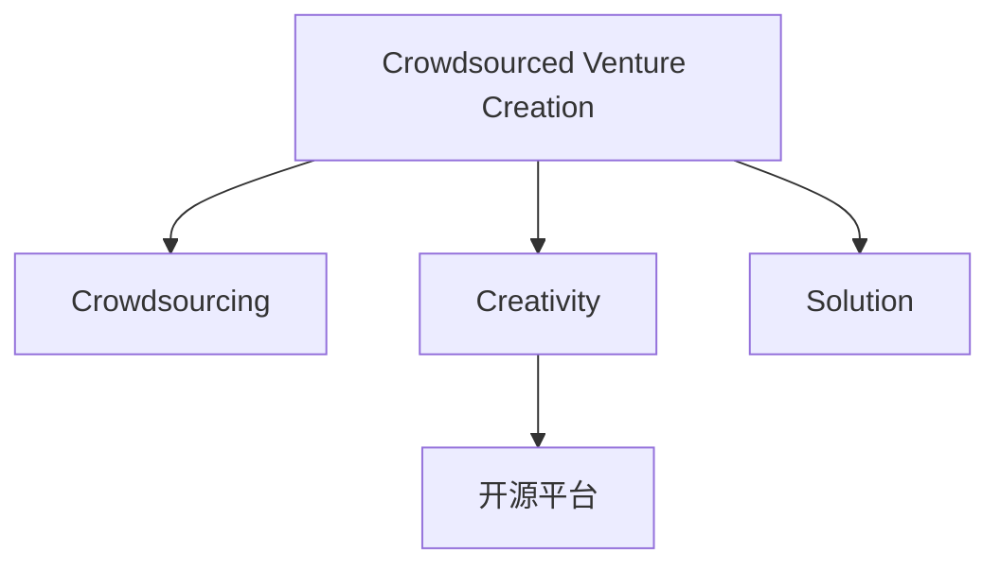

                 

# 创意众包创业：集思广益的力量

> 关键词：众包创业, 众包, 创意, 解决方案, 开源平台, 创业指导

## 1. 背景介绍

### 1.1 问题由来
在当今快速变化的市场环境中，创业公司需要迅速响应市场需求，同时也要不断提升产品和服务质量。然而，由于资源和时间的限制，单靠公司内部力量往往难以满足这一需求。此时，众包模式便应运而生，通过动员广泛的外部资源，以较低的成本快速解决复杂问题，成为许多创业公司的不二选择。

### 1.2 问题核心关键点
众包模式的核心在于将原本公司内部进行的任务外包给外部参与者（即“众包者”），利用他们的专业知识和创意，实现资源的高效利用和问题的快速解决。这种模式具有成本低、响应速度快、质量可控等优点，但同时也面临着任务定义模糊、参与者动机不均、管理复杂等问题。

### 1.3 问题研究意义
研究众包创业模式，不仅有助于企业提升创新能力和市场响应速度，还能促进更多人参与到创意活动中来，激发更多潜在的商业机会，推动社会经济的全面进步。通过详细分析众包创业的机制和案例，我们不仅能获得宝贵的创业经验和指导，也能在更大的范围内促进知识交流和创新。

## 2. 核心概念与联系

### 2.1 核心概念概述

为更好地理解众包创业模式，本节将介绍几个关键概念：

- **众包创业(Crowdsourced Venture Creation)**：指利用众包模式构建新创业公司的过程。通过将任务外包给全球的自由职业者，迅速形成有效的创新团队，加速产品开发和市场推广。

- **众包(Crowdsourcing)**：指将某项任务或问题通过互联网平台发布，吸引大众参与并提供解决方案。常见的众包平台包括Fiverr、Upwork、Freelancer等。

- **创意(Creativity)**：指通过创新思维，提出独特、有价值的解决方案。在众包创业中，创意驱动了新的商业模式和产品形态的诞生。

- **解决方案(Solution)**：指针对具体问题提出的可行方案，通常包括技术方案、市场策略、运营模型等。众包创业的核心在于寻找并实施高质量的解决方案。

- **开源平台(Open Source Platform)**：指提供开源代码、工具或数据的平台，如GitHub、Open Source Initiative等，是促进技术交流和协作的重要渠道。

这些概念之间的逻辑关系可以通过以下Mermaid流程图来展示：



这个流程图展示了几类核心概念及其之间的关系：

1. 众包创业是利用众包模式构建新创业公司的过程。
2. 众包将任务外包给大众，并利用其创意和解决方案。
3. 开源平台提供创意和解决方案的交流与共享。
4. 创意和解决方案的驱动和实施，是众包创业的核心。

## 3. 核心算法原理 & 具体操作步骤

### 3.1 算法原理概述

众包创业的核心算法原理主要围绕以下几个方面展开：

- **任务发布与获取**：众包平台发布任务，吸引具备相关技能和创意的参与者竞标。平台需根据任务复杂度、所需资源等因素，设定合理的任务奖励和预算。
- **筛选与匹配**：通过筛选算法（如基于技能、信誉、历史表现等），从众多竞标者中选取最适合的参与者进行任务分配。
- **协作与创新**：任务执行过程中，通过协作工具（如Git、Slack等）促进团队成员之间的交流和协同，激发更多创意和改进。
- **质量评估与反馈**：在任务执行结束后，对最终成果进行质量评估，收集参与者反馈，进行持续改进和优化。

### 3.2 算法步骤详解

众包创业的算法步骤如下：

**Step 1: 任务发布**
- 确定创业目标，明确所需解决的具体问题。
- 在众包平台上发布任务，详细描述任务要求、预期成果、预算和奖励机制。

**Step 2: 筛选与匹配**
- 通过筛选算法，从注册竞标者中选取具有相关技能和经验的参与者。
- 分配任务给最合适的参与者，并签订合同，明确双方的责任和权利。

**Step 3: 协作与创新**
- 利用协作工具（如Git、Slack等）促进团队成员之间的信息交流和协同工作。
- 鼓励参与者提出创新方案和改进意见，实现持续改进和优化。

**Step 4: 质量评估与反馈**
- 对参与者提交的成果进行质量评估，根据预设的评估标准，确定最终接受度。
- 收集参与者反馈，分析改进点和不足之处，优化未来任务分配和协作方式。

### 3.3 算法优缺点

众包创业模式具有以下优点：

- **成本效益高**：相比传统的全职团队，众包创业可显著降低人力资源和办公场所的成本。
- **灵活性高**：参与者来自全球各地，可以根据实际需要灵活调整人员配置和任务分配。
- **创新性强**：参与者来自不同背景，可以带来多样化的视角和创意，有助于创新解决方案。

同时，该模式也存在一些缺点：

- **质量控制难度大**：参与者多样，缺乏统一的评价标准，容易产生低质量成果。
- **协调难度高**：不同参与者之间存在时差、语言障碍等问题，协调沟通难度较大。
- **知识产权问题**：任务成果涉及多个参与者，知识产权归属问题可能引发纠纷。

### 3.4 算法应用领域

众包创业模式广泛应用于多个领域，例如：

- **软件开发**：利用众包平台获取源代码、技术建议和功能改进，加速软件产品的开发和迭代。
- **设计**：通过众包平台获取产品设计方案、用户界面设计等创意，优化产品设计流程。
- **市场营销**：利用众包平台进行广告创意、内容创作和市场调研，提升市场推广效果。
- **数据分析**：通过众包平台获取数据清洗、分析和可视化服务，降低数据分析成本。
- **项目管理**：利用众包平台进行任务分配、进度跟踪和质量监控，提高项目管理的效率和质量。

此外，众包创业还在医疗健康、教育培训、金融服务等诸多领域展现出巨大潜力，为这些行业注入新的活力。

## 4. 数学模型和公式 & 详细讲解 & 举例说明

### 4.1 数学模型构建

在众包创业中，我们通常会构建以下数学模型：

- **任务评估模型**：用于评估参与者提交的任务成果，通常包括精度、速度、创新性等指标。
- **成本效益模型**：用于计算众包创业的总体成本效益，考虑到参与者报酬和任务难度。
- **协作效率模型**：用于评估团队协作过程中的效率和协同效果，可以采用协作工具的使用频率和时间作为衡量指标。

### 4.2 公式推导过程

以下我们将以任务评估模型为例，推导其基本公式：

假设参与者提交的任务成果为 $X$，评估标准为 $Y$，任务评估模型的数学表达式为 $M(X,Y)$。假设任务成果 $X$ 服从正态分布 $N(\mu,\sigma^2)$，评估标准 $Y$ 为二元变量，取值为 $\{0,1\}$，其中 $0$ 表示不满意，$1$ 表示满意。

则任务评估模型的期望为：

$$
E(M) = \mathbb{E}[M(X,Y)] = \mathbb{E}[Y] \cdot \mathbb{E}[X] + \mathbb{E}[Y] \cdot \mathbb{E}[X]
$$

其中，$\mathbb{E}[X]$ 表示任务成果的期望值，$\mathbb{E}[Y]$ 表示评估标准的期望值。

进一步简化，可以得到：

$$
E(M) = P(Y=1) \cdot \mu + P(Y=0) \cdot \sigma^2
$$

通过该公式，我们可以计算出任务评估模型的期望值，进而评估任务的总体质量。

### 4.3 案例分析与讲解

假设有一个众包创业项目，需要将一款新产品进行市场调研。项目团队通过众包平台发布任务，吸引了10名参与者竞标。每个参与者需要提交一份调研报告，平台根据调研报告的深度、创意和实用性进行评分，评分标准为 $[0,1]$。

已知参与者提交的调研报告 $X$ 服从正态分布 $N(5,2)$，评估标准 $Y$ 为二元变量，取值为 $\{0,1\}$，其中 $P(Y=1)=0.8$，$P(Y=0)=0.2$。

我们可以根据公式计算任务评估模型的期望值：

$$
E(M) = 0.8 \cdot 5 + 0.2 \cdot 2^2 = 5.4
$$

这意味着，参与者提交的调研报告的平均质量为 $5.4$。

## 5. 项目实践：代码实例和详细解释说明

### 5.1 开发环境搭建

在进行众包创业项目开发前，我们需要准备好开发环境。以下是使用Python进行众包平台开发的典型环境配置流程：

1. 安装Python：根据系统需求，下载并安装相应版本的Python，如Python 3.8。
2. 安装Django：作为Python的Web框架，Django可以帮助我们快速构建众包平台。
3. 安装Flask：用于构建API接口，方便参与者访问和使用。
4. 安装SQLite3：作为轻量级的关系型数据库，存储任务和参与者信息。
5. 安装Git、GitHub API等工具：用于代码管理和协作。

完成上述步骤后，即可在本地搭建一个基本的众包平台开发环境。

### 5.2 源代码详细实现

下面我们以一个简单的众包平台为例，给出使用Django和Flask进行众包创业项目开发的代码实现。

首先，定义任务和参与者的数据模型：

```python
from django.db import models

class Task(models.Model):
    title = models.CharField(max_length=255)
    description = models.TextField()
    budget = models.DecimalField(max_digits=10, decimal_places=2)
    reward = models.DecimalField(max_digits=10, decimal_places=2)
    status = models.IntegerField(default=0)

class Participant(models.Model):
    name = models.CharField(max_length=255)
    skill = models.TextField()
    experience = models.IntegerField()
```

然后，定义任务发布、筛选、协作和评估的API接口：

```python
from django.http import JsonResponse
from flask import Flask, request, jsonify
import sqlite3

app = Flask(__name__)

# 发布任务
@app.route('/task/create', methods=['POST'])
def create_task():
    data = request.json
    conn = sqlite3.connect('crowdsourcing.db')
    cursor = conn.cursor()
    cursor.execute('INSERT INTO Task (title, description, budget, reward, status) VALUES (?, ?, ?, ?, ?)', (data['title'], data['description'], data['budget'], data['reward'], 0))
    conn.commit()
    conn.close()
    return JsonResponse({'success': True})

# 筛选参与者
@app.route('/participant/filter', methods=['POST'])
def filter_participants():
    data = request.json
    conn = sqlite3.connect('crowdsourcing.db')
    cursor = conn.cursor()
    query = 'SELECT * FROM Participant WHERE skill LIKE ? AND experience >= ?'
    cursor.execute(query, ('%' + data['skill'] + '%', data['experience']))
    results = cursor.fetchall()
    conn.close()
    return jsonify(results)

# 协作与创新
@app.route('/task/assign', methods=['POST'])
def assign_task():
    data = request.json
    conn = sqlite3.connect('crowdsourcing.db')
    cursor = conn.cursor()
    cursor.execute('UPDATE Task SET status = 1 WHERE id = ?', (data['task_id'],))
    conn.commit()
    conn.close()
    return JsonResponse({'success': True})

# 质量评估与反馈
@app.route('/task/evaluate', methods=['POST'])
def evaluate_task():
    data = request.json
    conn = sqlite3.connect('crowdsourcing.db')
    cursor = conn.cursor()
    cursor.execute('UPDATE Task SET score = ? WHERE id = ?', (data['score'], data['task_id']))
    conn.commit()
    conn.close()
    return JsonResponse({'success': True})
```

最后，启动Flask应用：

```python
if __name__ == '__main__':
    app.run(debug=True)
```

通过上述代码，我们可以构建一个基本的众包平台，支持任务发布、参与者筛选、协作和评估等功能。

### 5.3 代码解读与分析

让我们再详细解读一下关键代码的实现细节：

**数据模型定义**：
- `Task` 类定义了任务的基本信息，包括标题、描述、预算、奖励和状态。
- `Participant` 类定义了参与者的基本信息，包括姓名、技能、经验和状态。

**API接口实现**：
- `create_task` 函数用于发布任务，将任务信息存入数据库。
- `filter_participants` 函数用于筛选参与者，根据技能和经验进行过滤。
- `assign_task` 函数用于任务分配，将任务状态更新为已分配。
- `evaluate_task` 函数用于质量评估，更新任务评分。

这些API接口通过Django和Flask框架的封装，提供了高效、可靠的平台功能，方便参与者使用和管理。

**运行结果展示**：
在启动应用后，可以通过访问API接口进行任务发布、筛选、协作和评估等操作。例如，发布任务后，通过API接口可以获取任务信息、参与者信息和评分数据，从而评估任务执行效果。

## 6. 实际应用场景

### 6.1 众包创业平台

众包创业平台是众包创业的核心组件，是连接创业者和众包者的桥梁。通过平台，创业者和众包者可以高效沟通、协作和评估，实现资源的最优化配置。

例如，一家初创公司需要开发一款新应用，可以发布任务描述和预算，吸引有经验的软件开发人员参与竞标。平台根据参与者的技能和经验进行筛选，分配任务，并实时监控进度和质量。任务完成后，平台收集评估结果，反馈给创业者和参与者，进行持续改进。

### 6.2 创意竞赛平台

创意竞赛平台通过举办各类创意竞赛，激发参与者的创造力和创新思维。平台提供详细的任务描述和奖励机制，吸引来自全球的创意爱好者参与。

例如，一家公司可以举办产品设计竞赛，要求参与者提交一款新的手机应用设计方案，并设定高额的奖励。平台通过筛选算法，选择最有潜力的设计方案进行进一步审核，最终由公司决定是否采用。

### 6.3 开源社区平台

开源社区平台是众包创业的重要组成部分，提供开源代码、工具和数据，促进全球技术交流和协作。平台通常基于GitHub、GitLab等工具搭建，支持代码版本控制、项目管理、问题追踪等常见功能。

例如，一个开源社区可以发布一款新软件项目，吸引全球开发者参与代码贡献和功能改进。平台提供详细的开发指南和API接口，方便开发者接入和使用。

## 7. 工具和资源推荐

### 7.1 学习资源推荐

为了帮助开发者系统掌握众包创业的理论基础和实践技巧，这里推荐一些优质的学习资源：

1. **《众包创业：从0到1》**：介绍众包创业的各个环节和成功案例，提供详细的创业指导和经验分享。
2. **Coursera《众包与协作创新》课程**：讲解众包模式和平台搭建的基本原理和实践方法，适合初学者入门。
3. **《众包：协作的未来》**：通过分析多个领域的众包案例，探讨众包创业的潜力和应用前景。
4. **《开源社区的崛起》**：介绍开源社区的基本概念和运作机制，帮助开发者理解开源文化和技术交流。

通过对这些资源的学习实践，相信你一定能够快速掌握众包创业的精髓，并用于解决实际的创业问题。

### 7.2 开发工具推荐

高效的开发离不开优秀的工具支持。以下是几款用于众包创业开发的常用工具：

1. **Django**：Python的Web框架，用于构建高效、可扩展的Web应用。
2. **Flask**：轻量级Web框架，适用于构建API接口和简单Web应用。
3. **SQLite3**：轻量级关系型数据库，适用于小型众包平台的数据存储。
4. **GitHub API**：提供GitHub仓库的RESTful接口，方便开发者管理代码和协作。
5. **Jira**：项目管理工具，用于任务跟踪和进度监控。
6. **Slack**：团队协作工具，促进参与者之间的沟通和协作。

合理利用这些工具，可以显著提升众包创业的开发效率，加快创新迭代的步伐。

### 7.3 相关论文推荐

众包创业技术的发展源于学界的持续研究。以下是几篇奠基性的相关论文，推荐阅读：

1. **《众包创业：技术、管理和设计》**：系统介绍了众包创业的各个环节和技术框架。
2. **《众包平台的设计与实现》**：详细分析了众包平台的关键技术和实现方法，提供了实用的设计参考。
3. **《众包创业的商业价值》**：探讨了众包创业模式在多个行业中的应用前景和商业价值。
4. **《开源社区的成功之道》**：分析了开源社区的成功案例和运作机制，为众包创业提供了借鉴。

这些论文代表了大众创业模式的研究脉络。通过学习这些前沿成果，可以帮助研究者把握学科前进方向，激发更多的创新灵感。

## 8. 总结：未来发展趋势与挑战

### 8.1 总结

本文对众包创业模式进行了全面系统的介绍。首先阐述了众包创业的背景、核心概念和应用场景，明确了众包创业在提升创新能力、降低创业成本等方面的独特价值。其次，从原理到实践，详细讲解了众包创业的算法原理和具体操作步骤，给出了详细的代码实现和运行结果展示。同时，本文还广泛探讨了众包创业在多个行业领域的应用前景，展示了众包创业模式的巨大潜力。

通过本文的系统梳理，可以看到，众包创业模式正在成为创新创业的重要途径，极大地拓展了创业公司的资源获取和问题解决能力。得益于众包平台的高效协作和资源整合能力，创业公司可以迅速应对市场需求，获取高质量的解决方案，加速产品开发和市场推广。未来，伴随众包创业技术的持续演进，必将进一步推动创业领域的创新与发展。

### 8.2 未来发展趋势

展望未来，众包创业模式将呈现以下几个发展趋势：

1. **智能化升级**：随着AI技术的不断发展，众包创业平台将逐步引入智能算法，自动化筛选和评估参与者，提升任务分配和质量控制的效率。
2. **全球化拓展**：众包创业平台将更加注重国际化发展，吸引全球优秀人才参与创新，提升全球范围内的协作水平。
3. **垂直领域专业化**：众包创业平台将逐步向特定行业和领域深化，提供更加精准的解决方案，提升服务质量和用户体验。
4. **开放协作生态**：众包创业平台将更加注重开放协作，构建开源社区和创新生态，促进知识交流和技术融合。
5. **多样化任务类型**：众包创业平台将支持多样化的任务类型，包括创意设计、数据分析、软件开发等，满足不同创业者的需求。

以上趋势凸显了众包创业模式的广阔前景。这些方向的探索发展，必将进一步提升众包创业的创新能力和应用范围，为创业者提供更加灵活、高效的资源配置方式。

### 8.3 面临的挑战

尽管众包创业模式已经取得了显著成效，但在迈向更加智能化、全球化和专业化发展的过程中，仍面临诸多挑战：

1. **质量控制难度大**：众包创业平台需要有效评估参与者提交的任务成果，确保高质量的解决方案。然而，参与者多样、任务类型复杂，质量控制的难度较大。
2. **协作效率低**：不同参与者之间存在语言障碍、文化差异等问题，协作效率较低。需要通过智能算法和协作工具进行优化。
3. **平台运营成本高**：众包创业平台需要投入大量资源进行技术开发、平台维护和市场营销，运营成本较高。
4. **知识产权问题**：任务成果涉及多个参与者，知识产权归属问题可能引发纠纷。需要明确责任和权利，规范知识产权管理。

### 8.4 研究展望

面对众包创业面临的挑战，未来的研究需要在以下几个方面寻求新的突破：

1. **引入AI和机器学习**：通过引入智能算法和机器学习技术，自动化筛选和评估参与者，提升任务分配和质量控制的效率。
2. **优化协作工具**：开发更加智能化的协作工具，促进参与者之间的沟通和协作，提高协作效率。
3. **降低运营成本**：通过开源协作、自动化部署等手段，降低平台运营成本，提升平台的可扩展性和可复制性。
4. **规范知识产权管理**：制定明确的知识产权管理规则，规范任务成果的归属和使用，避免知识产权纠纷。
5. **提升平台国际化水平**：加强平台国际化布局，吸引全球优秀人才参与创新，提升全球范围内的协作水平。

这些研究方向将推动众包创业模式向更高层次发展，为创业者和参与者提供更加高效、灵活、安全的协作平台。未来，随着众包创业技术的不断成熟和完善，必将进一步推动全球创业创新的发展。

## 9. 附录：常见问题与解答

**Q1：众包创业平台如何平衡任务分配和质量控制？**

A: 众包创业平台需要设计合理的任务分配和质量控制机制，平衡效率和质量。常见的方法包括：
1. 设定合理的预算和奖励机制，吸引高素质参与者竞标。
2. 使用筛选算法，根据参与者的技能、经验和历史表现进行筛选。
3. 设计详细的任务描述和评估标准，明确任务要求和评估指标。
4. 引入智能评估工具，自动化筛选和评估任务成果。
5. 建立反馈机制，收集参与者和创业者的反馈，持续改进任务分配和质量控制。

通过以上方法，可以有效地平衡任务分配和质量控制，提升众包创业平台的服务质量和用户体验。

**Q2：众包创业平台如何确保参与者的安全性和隐私？**

A: 众包创业平台需要确保参与者的安全性和隐私，防止数据泄露和侵权行为。常见的方法包括：
1. 采用加密技术，保护数据传输和存储的安全性。
2. 设计合理的权限控制机制，限制敏感数据的访问权限。
3. 引入合规机制，遵守相关法律法规和行业规范。
4. 建立用户协议，明确平台和参与者的权利和义务。
5. 引入法律保障，设立纠纷解决机制，保护参与者的合法权益。

通过以上方法，可以确保众包创业平台的安全性和隐私保护，建立良好的信任关系，吸引更多的参与者。

**Q3：众包创业平台如何提高参与者的满意度和忠诚度？**

A: 提高参与者的满意度和忠诚度是众包创业平台的重要目标。常见的方法包括：
1. 设计合理的任务分配机制，确保参与者能够获得有挑战性和有意义的任务。
2. 提供公平的报酬和奖励机制，激励参与者积极参与和贡献创意。
3. 建立良好的沟通机制，及时回应参与者的反馈和需求。
4. 引入推荐系统，推荐适合的任务和合作机会，提高参与者的活跃度和忠诚度。
5. 开展创意竞赛和奖励活动，增强参与者的成就感和归属感。

通过以上方法，可以提高参与者的满意度和忠诚度，增强平台的吸引力和粘性。

---

作者：禅与计算机程序设计艺术 / Zen and the Art of Computer Programming

