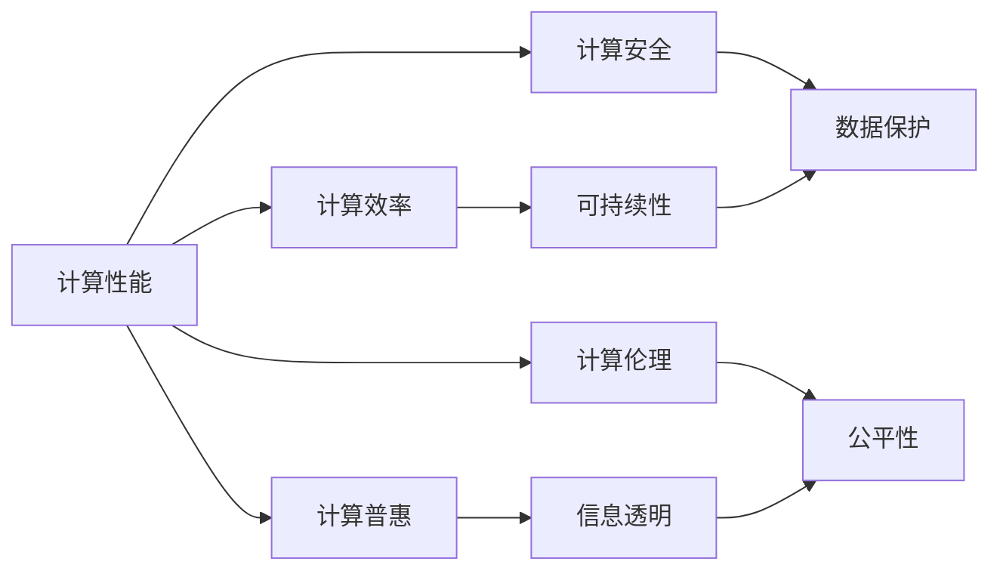

                 

# 创造更美好的世界：人类计算的终极目标

在信息技术日新月异的今天，人类计算的终极目标不仅是追求更高的性能和更广的应用，更是为了创造一个更美好的世界。本文将深入探讨人类计算的核心理念，分析其在社会、经济、文化和科技等多方面的影响，并展望未来发展趋势，力图为构建更美好的人机共生未来贡献智慧。

## 1. 背景介绍

### 1.1 计算科技的演进
自古以来，人类计算的演进经历了从算盘、手摇机械到蒸汽机、电动机的变革。信息时代的来临，将计算的核心推向了计算机和网络。作为人类文明的重要里程碑，计算科技从早期的大型机、小型机到PC、移动互联网，再到今天的云服务、量子计算，每一步都极大地拓展了人类智慧的边界。

### 1.2 计算与人类生活的融合
计算科技的发展，使得人类生活的方方面面都离不开计算。从智能手机、智能家居，到医疗健康、金融服务，计算正在成为支撑现代社会的基础设施。计算科技不仅改变了人们的生活方式，也极大地推动了社会生产力的发展。

## 2. 核心概念与联系

### 2.1 核心概念概述

人类计算的核心概念包括计算性能、计算效率、计算安全、计算普惠和计算伦理等。这些概念之间相互作用，共同推动着人类计算的发展。

1. **计算性能**：指计算系统处理任务的速度和效率，是衡量计算能力的重要指标。随着摩尔定律的放缓，计算性能的提升将更加依赖于新的计算范式和计算架构。

2. **计算效率**：指计算过程的资源利用效率，包括能效、带宽、存储等。在追求高性能的同时，计算效率的提升是实现可持续发展的重要保障。

3. **计算安全**：指计算系统中的数据和算法安全，防止未授权访问、篡改和泄露。随着计算科技的广泛应用，计算安全已成为信息时代的基本要求。

4. **计算普惠**：指计算科技的普及和共享，使得更多人能够便捷地访问和使用计算资源。计算普惠是实现社会公平和信息透明的关键。

5. **计算伦理**：指计算科技应用过程中所涉及的伦理道德问题，如数据隐私、算法透明、公平性等。计算伦理的遵循，是构建和谐人机共生社会的基础。

这些概念的相互作用，形成了人类计算的生态系统，共同支撑着人类社会的进步和未来发展。

### 2.2 核心概念原理和架构的 Mermaid 流程图(Mermaid 流程节点中不要有括号、逗号等特殊字符)



## 3. 核心算法原理 & 具体操作步骤

### 3.1 算法原理概述

人类计算的算法原理，可以追溯到早期的图灵机理论和算法复杂度理论。随着计算科技的演进，新的算法范式不断涌现，如分布式计算、并行计算、量子计算等。这些算法范式在解决复杂问题、提升计算效率和实现计算普惠方面，展现了强大的潜力。

### 3.2 算法步骤详解

以分布式计算为例，其基本步骤如下：

1. **数据划分**：将大规模数据划分为多个子集，分布在不同的计算节点上。
2. **任务分配**：将数据子集分配给不同的计算节点，并行计算。
3. **结果合并**：将各计算节点的结果进行汇总，生成最终输出。

### 3.3 算法优缺点

- **优点**：分布式计算可以显著提升计算性能和效率，实现海量数据的处理。
- **缺点**：分布式计算系统复杂度高，需要高水平的管理和维护；数据通信和同步开销较大，可能影响整体性能。

### 3.4 算法应用领域

分布式计算在科学研究、金融分析、工业制造、大数据处理等领域得到了广泛应用。其在提升计算效率、实现数据共享和促进跨领域合作方面，展现了巨大的潜力。

## 4. 数学模型和公式 & 详细讲解 & 举例说明

### 4.1 数学模型构建

人类计算的数学模型，通常涉及优化问题、机器学习模型和图计算模型等。这里以优化问题为例，构建基本的数学模型。

设一个优化问题为 $f(x)$，目标是最小化函数值 $f(x)$。常见的优化方法包括梯度下降、牛顿法等。其数学模型为：

$$
\min_x f(x)
$$

### 4.2 公式推导过程

以梯度下降为例，其基本公式为：

$$
x_{t+1} = x_t - \alpha \nabla f(x_t)
$$

其中，$\alpha$ 为学习率，$\nabla f(x_t)$ 为函数 $f(x)$ 在点 $x_t$ 的梯度。

### 4.3 案例分析与讲解

以深度学习模型的优化为例，其训练过程可以看作是在庞大的数据集上优化模型参数的过程。优化算法如AdamW、SGD等，通过对模型参数的梯度更新，不断调整模型以最小化损失函数。

## 5. 项目实践：代码实例和详细解释说明

### 5.1 开发环境搭建

开发人类计算项目，需要安装Python、Jupyter Notebook等开发环境，并配置相应的库和工具。以下是一个简单的Python环境配置流程：

1. 安装Anaconda：从官网下载并安装Anaconda，用于创建独立的Python环境。
2. 创建并激活虚拟环境：
```bash
conda create -n py-env python=3.8 
conda activate py-env
```

3. 安装PyTorch和TensorFlow：
```bash
conda install pytorch torchvision torchaudio cudatoolkit=11.1 -c pytorch -c conda-forge
```

4. 安装TensorBoard：
```bash
pip install tensorboard
```

完成上述步骤后，即可在`py-env`环境中开始人类计算项目开发。

### 5.2 源代码详细实现

以下是一个简单的深度学习模型训练代码示例：

```python
import torch
import torch.nn as nn
import torch.optim as optim

# 定义模型
class Net(nn.Module):
    def __init__(self):
        super(Net, self).__init__()
        self.fc1 = nn.Linear(784, 256)
        self.fc2 = nn.Linear(256, 10)
        
    def forward(self, x):
        x = torch.relu(self.fc1(x))
        x = torch.relu(self.fc2(x))
        return x

# 定义损失函数和优化器
net = Net()
criterion = nn.CrossEntropyLoss()
optimizer = optim.Adam(net.parameters(), lr=0.001)

# 训练模型
for epoch in range(10):
    running_loss = 0.0
    for i, data in enumerate(trainloader, 0):
        inputs, labels = data
        optimizer.zero_grad()
        outputs = net(inputs)
        loss = criterion(outputs, labels)
        loss.backward()
        optimizer.step()
        
    print(f"Epoch {epoch+1}, loss: {running_loss/len(trainloader):.3f}")
```

### 5.3 代码解读与分析

该代码展示了如何使用PyTorch构建和训练一个简单的深度学习模型。

- `Net`类定义了模型的结构，包括两个线性层和ReLU激活函数。
- 损失函数`criterion`使用了交叉熵损失，适用于分类任务。
- 优化器`optimizer`使用了Adam算法，自动调整模型参数。
- 训练循环中，前向传播计算模型输出和损失，反向传播更新模型参数，重复多次以优化模型。

### 5.4 运行结果展示

训练过程中，每个epoch的平均损失值会逐渐减小，表示模型在不断优化。训练结束后，可以评估模型在测试集上的性能，如准确率等指标。

## 6. 实际应用场景

### 6.1 智慧城市

智慧城市建设是人类计算的重要应用场景之一。通过计算科技的驱动，智慧城市可以提供交通管理、环境监测、公共安全等综合服务，极大地提升城市管理效率和生活品质。

### 6.2 智能医疗

智能医疗系统通过计算科技实现对医疗数据的全面分析，帮助医生进行精准诊断、个性化治疗和健康管理，提升医疗服务的质量和效率。

### 6.3 金融科技

金融科技利用计算科技进行大数据分析、风险评估和智能投顾，推动金融服务的数字化转型，提升金融市场的透明度和公平性。

### 6.4 未来应用展望

随着计算科技的不断进步，未来人类计算将展现出更多令人期待的应用。

- **人机共生**：未来的计算系统将更加智能，能够与人类进行更加流畅的交互，提升人机协同效率。
- **智能感知**：计算科技将赋予更多设备和传感器以智能感知能力，实现对物理世界的深度理解和智能控制。
- **普惠计算**：通过云计算和边缘计算等手段，实现计算资源的普惠，让更多人能够享受到计算科技的福利。
- **跨界融合**：计算科技与其他学科的深度融合，将推动新一轮的科技革命，带来更多的创新应用。

## 7. 工具和资源推荐

### 7.1 学习资源推荐

为帮助开发者掌握人类计算的知识，推荐以下学习资源：

1. 《深度学习》：Ian Goodfellow等著，全面介绍深度学习原理和应用。
2. 《计算机程序设计艺术》：Donald Knuth著，经典计算机科学著作，深入浅出地介绍了计算理论和算法。
3. Coursera《机器学习》课程：Andrew Ng主讲，介绍机器学习基本概念和算法。
4. Kaggle竞赛：通过参与实际数据挖掘和机器学习竞赛，提升实战能力。
5. TensorFlow官网和文档：提供丰富的TensorFlow教程和示例，是学习深度学习的重要资源。

### 7.2 开发工具推荐

以下是几个常用的开发工具：

1. Jupyter Notebook：数据科学和机器学习开发的常用工具，支持代码和文档的同步展示。
2. PyTorch：用于深度学习模型开发的开源框架，支持动态计算图和自动微分。
3. TensorBoard：TensorFlow的可视化工具，用于实时监测和调试模型训练过程。
4. GitHub：代码托管平台，提供丰富的开源项目和代码协作工具。

### 7.3 相关论文推荐

以下是几篇关于人类计算的代表性论文：

1. 《Deep Learning》：Ian Goodfellow等著，全面介绍深度学习原理和应用。
2. 《Pattern Recognition and Machine Learning》：Christopher Bishop著，深入探讨机器学习理论和方法。
3. 《Artificial Intelligence: A Modern Approach》：Stuart Russell和Peter Norvig著，经典人工智能教材。
4. 《Human-Computer Interaction》：B.J. F. Shi等编，介绍人机交互的基本理论和实践。

## 8. 总结：未来发展趋势与挑战

### 8.1 研究成果总结

人类计算的研究成果，不仅推动了计算科技的进步，也在各个领域产生了深远的影响。从智慧城市到智能医疗，从金融科技到生物信息学，计算科技正在不断拓展其应用边界。

### 8.2 未来发展趋势

- **计算性能**：量子计算、神经形态计算等新范式将进一步提升计算性能。
- **计算效率**：能效优化、数据压缩、算法创新等手段将提升计算效率。
- **计算安全**：分布式安全协议、差分隐私、加密计算等技术将保障计算安全。
- **计算普惠**：云计算、边缘计算、普惠技术等将推动计算普惠。
- **计算伦理**：算法透明、数据隐私、公平性等将成为计算伦理的重要课题。

### 8.3 面临的挑战

- **数据隐私**：如何在保障数据隐私的同时，实现数据的有效利用，是一大挑战。
- **公平性**：算法偏见、数据不平衡等问题可能导致计算结果的不公平。
- **安全性**：计算系统面临各种安全威胁，需要从技术和管理层面进行综合防护。
- **资源消耗**：计算科技的资源消耗问题，需要探索高效和可持续的解决方案。

### 8.4 研究展望

未来的人类计算研究，需要在算法、系统、应用和伦理等方面进行全面探索。以下研究方向值得关注：

- **新计算范式**：量子计算、神经形态计算、生物计算等新计算范式将带来新的计算性能和应用场景。
- **跨学科融合**：计算科技与其他学科的深度融合，将带来更多创新应用，如计算社会学、计算神经科学等。
- **伦理和社会责任**：计算科技的伦理和社会责任问题，需要从技术、法律、伦理等多角度进行研究。

## 9. 附录：常见问题与解答

**Q1：什么是人类计算？**

A: 人类计算是指利用计算科技解决人类面临的各种复杂问题，通过计算机和网络技术提升人类智慧和能力。

**Q2：人类计算对社会有什么影响？**

A: 人类计算的普及和应用，将提升社会的生产力和效率，改善公共服务和质量，推动社会公平和信息透明。

**Q3：如何保障计算安全？**

A: 保障计算安全需要从技术和管理多个层面进行综合防护。技术手段包括加密、差分隐私、分布式安全协议等。管理层面则需要建立完善的法律法规和监管机制。

**Q4：计算伦理的挑战有哪些？**

A: 计算伦理面临的挑战包括算法透明、数据隐私、公平性、安全性等。需要通过跨学科合作和多角度研究，找到解决方案。

**Q5：未来人类计算的发展方向是什么？**

A: 未来人类计算的发展方向包括计算性能提升、计算效率优化、计算安全保障、计算普惠普及和计算伦理建设等。

总之，人类计算的终极目标是创造一个更美好的世界，让人类在计算科技的支撑下，实现更高的智慧和能力，构建更加和谐、公平、可持续的未来社会。

---

作者：禅与计算机程序设计艺术 / Zen and the Art of Computer Programming

