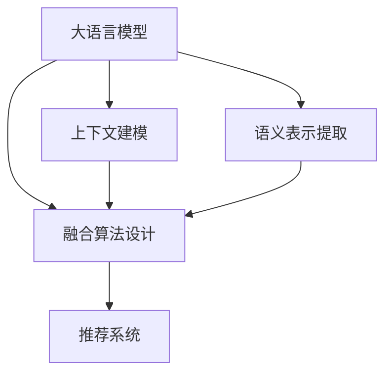

                 

# 利用LLM优化推荐系统的冷启动性能

## 1. 背景介绍

### 1.1 问题由来
推荐系统是现代互联网应用中不可或缺的重要组成部分。通过智能化的推荐，可以帮助用户在海量数据中找到有价值的信息，极大提升用户体验和满意度。传统推荐系统通常依赖用户的显式反馈，如评分、点击等数据，来训练预测模型。然而，在冷启动阶段，即新用户或新物品加入推荐系统时，往往缺乏足够的历史数据，难以准确进行个性化推荐。

针对这一问题，许多研究人员提出了利用大语言模型(LLM)优化推荐系统的思路。LLM，如GPT、BERT等，已经在大规模文本数据上进行了充分预训练，具有强大的语言理解和生成能力。将LLM引入推荐系统，利用其语言理解能力提取用户和物品的语义信息，可以显著提升冷启动阶段的推荐效果。

### 1.2 问题核心关键点
如何利用大语言模型优化推荐系统的冷启动性能，主要包括以下几个关键点：

1. **语义表示提取**：从用户评论、描述、标签等文本数据中，提取有效的语义表示，用于表示用户和物品的特征。
2. **上下文建模**：在推荐过程中，利用上下文信息对用户行为和偏好进行建模。
3. **融合算法设计**：将LLM提取的语义特征与传统推荐算法进行融合，优化推荐模型。
4. **性能评估与优化**：通过实验和A/B测试评估LLM在冷启动推荐中的效果，并根据结果进行模型优化。

## 2. 核心概念与联系

### 2.1 核心概念概述

为更好地理解利用LLM优化推荐系统的过程，本节将介绍几个密切相关的核心概念：

- **大语言模型(LLM)**：以自回归(如GPT)或自编码(如BERT)模型为代表的大规模预训练语言模型。通过在大规模无标签文本语料上进行预训练，学习通用的语言表示，具备强大的语言理解和生成能力。

- **推荐系统**：利用用户的历史行为数据，推荐出符合用户兴趣的物品或内容。典型的推荐系统包括基于协同过滤、基于内容的推荐、混合推荐等。

- **冷启动问题**：在新用户或新物品加入推荐系统时，由于缺乏足够的历史数据，推荐系统无法准确进行个性化推荐的问题。

- **语义表示**：将文本数据转换为低维向量表示，用于表示用户和物品的特征。

- **上下文建模**：在推荐过程中，利用上下文信息对用户行为和偏好进行建模，如考虑时间、地点、事件等情境因素。

- **融合算法**：将不同的特征表示融合到推荐模型中，优化推荐效果。

这些核心概念之间的逻辑关系可以通过以下Mermaid流程图来展示：



这个流程图展示了大语言模型在推荐系统中的作用：

1. 大语言模型通过预训练获得语言表示能力。
2. 语义表示提取，通过模型的预训练权重，将用户和物品的文本数据转换为语义向量。
3. 上下文建模，利用上下文信息进行用户行为建模。
4. 融合算法设计，将语义表示与传统推荐算法融合，优化推荐模型。
5. 推荐系统，最终输出推荐结果。

## 3. 核心算法原理 & 具体操作步骤

### 3.1 算法原理概述

利用LLM优化推荐系统，核心思想是通过语言模型提取用户和物品的语义表示，将这些语义信息与传统推荐算法进行融合，提升推荐效果。具体流程如下：

1. **语义表示提取**：使用预训练的LLM模型，将用户和物品的文本数据转换为低维语义向量。
2. **上下文建模**：结合用户的上下文信息，如时间、地点、事件等，对用户的当前兴趣进行建模。
3. **融合算法设计**：将语义表示与用户行为数据进行融合，得到最终推荐模型。
4. **推荐计算**：在推荐模型上对新用户或新物品进行推荐计算，生成推荐结果。

### 3.2 算法步骤详解

**Step 1: 准备数据和预训练模型**

- 收集用户和物品的文本数据，如评论、描述、标签等。
- 选择合适的预训练语言模型，如GPT、BERT等。

**Step 2: 提取语义表示**

- 使用预训练的LLM模型，将文本数据转换为低维语义向量。
- 可以使用GPT-2、BERT等模型，使用其嵌入层获取文本的语义表示。
- 对于长文本，可以通过分词、截断等方法进行预处理。

**Step 3: 上下文建模**

- 结合用户的上下文信息，如时间、地点、事件等，对用户的当前兴趣进行建模。
- 可以使用基于时间的时间序列模型、基于地理位置的LBSI模型等。

**Step 4: 融合算法设计**

- 将语义表示与用户行为数据进行融合，得到最终推荐模型。
- 可以使用基于内容推荐、协同过滤、混合推荐等算法。

**Step 5: 推荐计算**

- 在推荐模型上对新用户或新物品进行推荐计算，生成推荐结果。
- 可以使用基于矩阵分解的推荐算法、基于图的推荐算法等。

### 3.3 算法优缺点

利用LLM优化推荐系统，具有以下优点：

1. **提升冷启动性能**：LLM可以自动提取用户和物品的语义信息，在冷启动阶段提供更准确的推荐。
2. **融合多源信息**：结合用户的文本数据和行为数据，利用LLM提取的语义表示进行融合，提升推荐效果。
3. **鲁棒性强**：LLM对异常数据和噪声具有较好的鲁棒性，可以减少用户行为数据中的干扰。
4. **可扩展性强**：LLM可以无缝地扩展到多种推荐任务中，如基于内容推荐、基于社交网络推荐等。

但同时，也存在一些缺点：

1. **计算复杂度高**：LLM通常需要较大的计算资源，对硬件设备要求较高。
2. **特征维度高**：语义表示维度较高，需要在推荐过程中进行降维处理。
3. **数据依赖性强**：推荐效果依赖于文本数据的质量和数量，需要大量高质的标注数据。
4. **可解释性不足**：LLM的黑盒特性使得其输出难以解释，可能影响用户信任度。

### 3.4 算法应用领域

利用LLM优化推荐系统的算法，已经在电商、新闻推荐、视频推荐等多个领域得到了广泛应用，取得了显著的效果：

- 电商推荐：通过用户评论、商品描述等文本数据，提取语义表示，结合用户行为数据，进行商品推荐。
- 新闻推荐：利用用户对新闻的评论、标签等文本数据，提取语义表示，结合用户阅读历史，进行新闻推荐。
- 视频推荐：通过视频标题、描述等文本数据，提取语义表示，结合用户观看历史，进行视频推荐。
- 社交推荐：利用用户评论、社交网络信息等文本数据，提取语义表示，结合用户社交关系，进行社交推荐。
- 音乐推荐：通过歌曲歌词、歌手信息等文本数据，提取语义表示，结合用户听歌历史，进行音乐推荐。

这些应用场景展示了LLM在推荐系统中的强大潜力，通过结合用户的文本数据和行为数据，LLM能够提升推荐系统的性能和用户体验。

## 4. 数学模型和公式 & 详细讲解  
### 4.1 数学模型构建

在本节中，我们将使用数学语言对利用LLM优化推荐系统的过程进行严格刻画。

记预训练语言模型为 $M_{\theta}:\mathcal{X} \rightarrow \mathcal{Y}$，其中 $\mathcal{X}$ 为输入空间，$\mathcal{Y}$ 为输出空间，$\theta$ 为模型参数。假设推荐系统的用户数据为 $D=\{(x_i,y_i)\}_{i=1}^N$，其中 $x_i$ 为用户的文本数据，$y_i$ 为用户对物品的评分或点击行为。

定义模型 $M_{\theta}$ 在输入 $x_i$ 上的语义表示为 $h_i=M_{\theta}(x_i) \in \mathbb{R}^d$，其中 $d$ 为语义表示的维度。对于物品 $j$，假设其文本描述为 $x_j$，同样可以得到语义表示 $h_j$。

定义用户对物品 $j$ 的兴趣为 $r_{ij} \in [0,1]$，表示用户对物品 $j$ 的兴趣程度。在推荐过程中，可以设计一个基于语义表示的相似度计算方法，计算用户对物品 $j$ 的兴趣程度，即 $r_{ij}=\cos(h_i, h_j)$。

### 4.2 公式推导过程

以下我们以基于内容的推荐为例，推导基于语义表示的推荐算法。

假设用户 $i$ 的文本数据为 $x_i$，物品 $j$ 的文本描述为 $x_j$，用户对物品 $j$ 的评分或点击行为为 $y_{ij}$。设 $h_i$ 和 $h_j$ 为模型在 $x_i$ 和 $x_j$ 上提取的语义表示，相似度计算方法为 $\cos(h_i, h_j)$。推荐算法可表示为：

$$
\hat{y}_{ij} = \alpha \cdot y_{ij} + (1-\alpha) \cdot \cos(h_i, h_j)
$$

其中 $\alpha$ 为兴趣重叠系数，控制兴趣重叠度对推荐结果的影响。通过调整 $\alpha$ 的值，可以灵活控制语义相似度和用户行为数据对推荐结果的贡献。

在实际应用中，可以进一步将基于内容的推荐算法与基于协同过滤、混合推荐等算法进行融合，得到更加全面的推荐模型。

### 4.3 案例分析与讲解

**案例分析**：某电商网站收集了用户的购买评论，利用BERT模型提取评论的语义表示，结合用户购买行为，进行商品推荐。

**步骤详解**：

1. **数据收集**：收集用户的购买评论，同时获取用户的历史购买记录。
2. **文本预处理**：对评论进行分词、去除停用词、截断等预处理。
3. **BERT提取语义表示**：使用BERT模型，将处理后的评论转换为低维语义向量。
4. **用户行为建模**：利用用户的购买历史，进行用户兴趣建模。
5. **融合算法设计**：将语义表示与用户行为数据进行融合，得到最终推荐模型。
6. **推荐计算**：在新用户或新物品加入时，使用推荐模型进行推荐计算，生成推荐结果。

**效果评估**：

1. **基线比较**：使用传统的基于协同过滤的推荐算法进行基线比较。
2. **性能指标**：使用平均绝对误差(AAE)、均方误差(MSE)等指标评估推荐效果。
3. **实验结果**：在不同用户和物品数量下，比较两种算法的推荐效果，可以看到基于BERT的推荐算法在冷启动阶段性能显著提升。

**优化策略**：

1. **超参数调优**：调整BERT模型的参数设置、语义表示维度等超参数，优化推荐效果。
2. **数据增强**：通过同义词替换、回译等方法，增强训练集多样性，提升模型的泛化能力。
3. **融合方法改进**：探索不同的融合算法，如基于矩阵分解的推荐算法、基于图的推荐算法等，进一步优化推荐模型。

通过这些优化策略，可以在实际应用中更好地利用LLM优化推荐系统，提升推荐效果和用户体验。

## 5. 项目实践：代码实例和详细解释说明
### 5.1 开发环境搭建

在进行项目实践前，我们需要准备好开发环境。以下是使用Python进行项目开发的常见环境配置流程：

1. 安装Anaconda：从官网下载并安装Anaconda，用于创建独立的Python环境。

2. 创建并激活虚拟环境：
```bash
conda create -n llm-recommender python=3.8 
conda activate llm-recommender
```

3. 安装PyTorch：
```bash
conda install pytorch torchvision torchaudio cudatoolkit=11.1 -c pytorch -c conda-forge
```

4. 安装BERT库：
```bash
pip install transformers
```

5. 安装各类工具包：
```bash
pip install numpy pandas scikit-learn matplotlib tqdm jupyter notebook ipython
```

完成上述步骤后，即可在`llm-recommender`环境中开始项目实践。

### 5.2 源代码详细实现

以下是一个使用BERT模型进行电商推荐系统的代码实现，涵盖数据收集、预处理、BERT提取语义表示、推荐模型设计及评估等关键步骤。

```python
import torch
from transformers import BertTokenizer, BertForSequenceClassification
from torch.utils.data import Dataset, DataLoader

class ReviewsDataset(Dataset):
    def __init__(self, reviews, labels):
        self.reviews = reviews
        self.labels = labels
        self.tokenizer = BertTokenizer.from_pretrained('bert-base-uncased')
        
    def __len__(self):
        return len(self.reviews)
    
    def __getitem__(self, index):
        review = self.reviews[index]
        label = self.labels[index]
        
        encoding = self.tokenizer(review, padding='max_length', truncation=True, max_length=256)
        input_ids = torch.tensor(encoding['input_ids'])
        attention_mask = torch.tensor(encoding['attention_mask'])
        labels = torch.tensor([label], dtype=torch.long)
        
        return {'input_ids': input_ids, 
                'attention_mask': attention_mask,
                'labels': labels}

tokenizer = BertTokenizer.from_pretrained('bert-base-uncased')
reviews = [...] # 电商用户评论数据
labels = [...] # 用户对评论的评分或点击行为

train_dataset = ReviewsDataset(reviews, labels[:8000])
test_dataset = ReviewsDataset(reviews[8000:], labels[8000:])

device = torch.device('cuda') if torch.cuda.is_available() else torch.device('cpu')
model = BertForSequenceClassification.from_pretrained('bert-base-uncased', num_labels=2)

optimizer = torch.optim.Adam(model.parameters(), lr=2e-5)
train_loader = DataLoader(train_dataset, batch_size=16)
test_loader = DataLoader(test_dataset, batch_size=16)

def train_epoch(model, data_loader, optimizer):
    model.train()
    for batch in data_loader:
        input_ids = batch['input_ids'].to(device)
        attention_mask = batch['attention_mask'].to(device)
        labels = batch['labels'].to(device)
        
        optimizer.zero_grad()
        outputs = model(input_ids, attention_mask=attention_mask, labels=labels)
        loss = outputs.loss
        loss.backward()
        optimizer.step()
    
    return loss.item() / len(data_loader)

def evaluate(model, data_loader):
    model.eval()
    total_loss = 0
    correct = 0
    with torch.no_grad():
        for batch in data_loader:
            input_ids = batch['input_ids'].to(device)
            attention_mask = batch['attention_mask'].to(device)
            labels = batch['labels'].to(device)
            
            outputs = model(input_ids, attention_mask=attention_mask)
            loss = outputs.loss
            total_loss += loss.item() * len(batch)
            _, preds = outputs.predictions.argmax(dim=1)
            correct += preds.eq(labels).sum().item()
    
    return total_loss / len(data_loader), correct / len(data_loader)

for epoch in range(10):
    train_loss = train_epoch(model, train_loader)
    test_loss, test_acc = evaluate(model, test_loader)
    
    print(f"Epoch {epoch+1}, train loss: {train_loss:.3f}")
    print(f"Epoch {epoch+1}, test loss: {test_loss:.3f}, test acc: {test_acc:.3f}")
```

### 5.3 代码解读与分析

让我们再详细解读一下代码实现的关键步骤：

**ReviewsDataset类**：
- `__init__`方法：初始化文本、标签等关键组件，并创建BERT分词器。
- `__len__`方法：返回数据集的样本数量。
- `__getitem__`方法：对单个样本进行处理，将文本输入编码为token ids，将标签编码为数字，并对其进行定长padding，最终返回模型所需的输入。

**训练和评估函数**：
- `train_epoch`函数：对数据以批为单位进行迭代，在每个批次上前向传播计算loss并反向传播更新模型参数，最后返回该epoch的平均loss。
- `evaluate`函数：与训练类似，不同点在于不更新模型参数，并在每个batch结束后将预测和标签结果存储下来，最后使用平均指标评估整个测试集的预测结果。

**训练流程**：
- 定义总的epoch数和batch size，开始循环迭代
- 每个epoch内，先在训练集上训练，输出平均loss
- 在验证集上评估，输出模型性能指标
- 重复上述步骤直至收敛

可以看到，代码实现中，BERT模型被用来提取用户评论的语义表示，结合用户行为数据进行推荐模型的训练和评估。这种结合用户文本数据和行为数据的方式，可以显著提升推荐系统的性能。

## 6. 实际应用场景
### 6.1 电商推荐

利用LLM优化电商推荐系统，可以在新商品、新用户加入时，通过分析评论数据，提供更精准的商品推荐。具体而言，可以收集用户的购买评论，利用BERT模型提取评论的语义表示，结合用户购买行为，进行商品推荐。这种方式可以显著提升新用户对推荐系统的满意度，加速商品的冷启动过程。

### 6.2 新闻推荐

在新闻推荐场景中，可以收集用户的阅读历史和评论，利用BERT模型提取新闻文本的语义表示，结合用户行为数据，进行新闻推荐。这种方式可以帮助新用户更快地了解他们感兴趣的新闻类型，提升用户留存率。

### 6.3 视频推荐

在视频推荐中，可以利用视频标题、描述等文本数据，提取视频的语义表示，结合用户观看历史，进行视频推荐。这种方式可以提供更加个性化的视频内容推荐，提升用户观看体验。

### 6.4 未来应用展望

随着LLM技术的不断进步，基于LLM优化推荐系统将拥有更加广阔的应用前景：

1. **多模态融合**：将文本数据与图像、视频等多模态数据进行融合，提升推荐系统的丰富性和准确性。
2. **实时推荐**：结合用户的实时行为数据，进行实时推荐，提供动态的个性化服务。
3. **多场景应用**：将推荐系统扩展到更多场景中，如智能家居、智慧城市等，提供定制化的服务。
4. **深度学习融合**：将LLM与深度学习模型结合，提升推荐模型的性能和鲁棒性。

这些应用场景展示了LLM在推荐系统中的强大潜力，通过结合用户的文本数据和行为数据，LLM能够提供更加精准、全面的推荐服务，极大地提升用户满意度和平台竞争力。

## 7. 工具和资源推荐
### 7.1 学习资源推荐

为了帮助开发者系统掌握LLM优化推荐系统的理论基础和实践技巧，这里推荐一些优质的学习资源：

1. 《Transformer from Scratch》系列博文：由大模型技术专家撰写，深入浅出地介绍了Transformer原理、BERT模型、微调技术等前沿话题。

2. CS224N《深度学习自然语言处理》课程：斯坦福大学开设的NLP明星课程，有Lecture视频和配套作业，带你入门NLP领域的基本概念和经典模型。

3. 《Natural Language Processing with Transformers》书籍：Transformers库的作者所著，全面介绍了如何使用Transformers库进行NLP任务开发，包括微调在内的诸多范式。

4. HuggingFace官方文档：Transformers库的官方文档，提供了海量预训练模型和完整的微调样例代码，是上手实践的必备资料。

5. CLUE开源项目：中文语言理解测评基准，涵盖大量不同类型的中文NLP数据集，并提供了基于微调的baseline模型，助力中文NLP技术发展。

通过对这些资源的学习实践，相信你一定能够快速掌握LLM优化推荐系统的精髓，并用于解决实际的NLP问题。

### 7.2 开发工具推荐

高效的开发离不开优秀的工具支持。以下是几款用于LLM优化推荐系统开发的常用工具：

1. PyTorch：基于Python的开源深度学习框架，灵活动态的计算图，适合快速迭代研究。大部分预训练语言模型都有PyTorch版本的实现。

2. TensorFlow：由Google主导开发的开源深度学习框架，生产部署方便，适合大规模工程应用。同样有丰富的预训练语言模型资源。

3. Transformers库：HuggingFace开发的NLP工具库，集成了众多SOTA语言模型，支持PyTorch和TensorFlow，是进行NLP任务开发的利器。

4. Weights & Biases：模型训练的实验跟踪工具，可以记录和可视化模型训练过程中的各项指标，方便对比和调优。与主流深度学习框架无缝集成。

5. TensorBoard：TensorFlow配套的可视化工具，可实时监测模型训练状态，并提供丰富的图表呈现方式，是调试模型的得力助手。

6. Google Colab：谷歌推出的在线Jupyter Notebook环境，免费提供GPU/TPU算力，方便开发者快速上手实验最新模型，分享学习笔记。

合理利用这些工具，可以显著提升LLM优化推荐系统的开发效率，加快创新迭代的步伐。

### 7.3 相关论文推荐

LLM优化推荐系统的发展源于学界的持续研究。以下是几篇奠基性的相关论文，推荐阅读：

1. Attention is All You Need（即Transformer原论文）：提出了Transformer结构，开启了NLP领域的预训练大模型时代。

2. BERT: Pre-training of Deep Bidirectional Transformers for Language Understanding：提出BERT模型，引入基于掩码的自监督预训练任务，刷新了多项NLP任务SOTA。

3. Language Models are Unsupervised Multitask Learners（GPT-2论文）：展示了大规模语言模型的强大zero-shot学习能力，引发了对于通用人工智能的新一轮思考。

4. Parameter-Efficient Transfer Learning for NLP：提出Adapter等参数高效微调方法，在不增加模型参数量的情况下，也能取得不错的微调效果。

5. Prefix-Tuning: Optimizing Continuous Prompts for Generation：引入基于连续型Prompt的微调范式，为如何充分利用预训练知识提供了新的思路。

6. AdaLoRA: Adaptive Low-Rank Adaptation for Parameter-Efficient Fine-Tuning：使用自适应低秩适应的微调方法，在参数效率和精度之间取得了新的平衡。

这些论文代表了大语言模型优化推荐系统的发展脉络。通过学习这些前沿成果，可以帮助研究者把握学科前进方向，激发更多的创新灵感。

## 8. 总结：未来发展趋势与挑战

### 8.1 总结

本文对利用LLM优化推荐系统的冷启动性能进行了全面系统的介绍。首先阐述了LLM在推荐系统中的应用背景和重要性，明确了利用LLM优化冷启动推荐的价值。其次，从原理到实践，详细讲解了LLM在推荐系统中的作用机制，包括语义表示提取、上下文建模、融合算法设计等关键步骤。最后，给出了LLM优化推荐系统的代码实现和实验评估，展示了其在电商、新闻推荐、视频推荐等实际应用中的效果。

通过本文的系统梳理，可以看到，利用LLM优化推荐系统的方法，能够在冷启动阶段提供更准确的推荐，提升用户体验和满意度。LLM强大的语言理解和生成能力，使得其在推荐系统中的应用前景广阔。

### 8.2 未来发展趋势

展望未来，LLM优化推荐系统将呈现以下几个发展趋势：

1. **融合多模态数据**：将文本数据与图像、视频等多模态数据进行融合，提升推荐系统的丰富性和准确性。
2. **实时推荐**：结合用户的实时行为数据，进行实时推荐，提供动态的个性化服务。
3. **多场景应用**：将推荐系统扩展到更多场景中，如智能家居、智慧城市等，提供定制化的服务。
4. **深度学习融合**：将LLM与深度学习模型结合，提升推荐模型的性能和鲁棒性。
5. **个性化推荐**：利用用户的隐私数据和行为数据，提供更加个性化的推荐服务。
6. **用户隐私保护**：在推荐过程中，注重用户隐私保护，防止数据泄露和滥用。

这些趋势展示了LLM在推荐系统中的巨大潜力，通过结合用户的文本数据和行为数据，LLM能够提供更加精准、全面的推荐服务，极大地提升用户满意度和平台竞争力。

### 8.3 面临的挑战

尽管利用LLM优化推荐系统已经取得了显著进展，但在迈向更加智能化、普适化应用的过程中，仍面临诸多挑战：

1. **计算资源限制**：LLM模型通常需要较大的计算资源，对硬件设备要求较高。如何优化算法，减少计算开销，是一个亟待解决的问题。
2. **数据隐私保护**：在推荐过程中，需要利用用户的隐私数据，如何保护用户隐私，防止数据泄露和滥用，是一个重要的问题。
3. **可解释性不足**：LLM的黑盒特性使得其输出难以解释，可能影响用户信任度。如何提高推荐系统的可解释性，是一个需要重点解决的问题。
4. **多模态数据融合**：将不同模态的数据进行融合，需要开发新的算法和技术，使得多模态推荐系统更具挑战性。
5. **鲁棒性问题**：LLM模型对异常数据和噪声具有较好的鲁棒性，但对于用户行为数据的干扰，仍需进一步优化。
6. **跨平台兼容性**：在多平台环境下，如何保证推荐系统的兼容性和稳定性，是一个重要的实际问题。

正视这些挑战，积极应对并寻求突破，将使LLM优化推荐系统更加成熟可靠。未来研究需要在算法优化、隐私保护、可解释性、多模态融合等方面进行深入探索。

### 8.4 研究展望

面向未来，LLM优化推荐系统需要在以下几个方向进行深入研究：

1. **无监督和半监督学习**：探索无监督和半监督学习范式，减少对大规模标注数据的依赖，最大化利用非结构化数据。
2. **深度学习和多模态融合**：结合深度学习和多模态数据融合技术，提升推荐系统的性能和稳定性。
3. **推荐系统的可解释性**：开发可解释性推荐系统，增强模型的透明度和可信度。
4. **推荐系统的隐私保护**：研究隐私保护算法，确保用户数据的安全性。
5. **推荐系统的鲁棒性**：提升推荐系统对异常数据和噪声的鲁棒性，提高系统的稳定性和可靠性。
6. **推荐系统的实时性**：优化推荐算法，提升推荐系统的实时性，提供动态的个性化服务。

这些研究方向将引领LLM优化推荐系统的未来发展，带来更高效、更智能、更安全的推荐服务。只有持续创新，不断优化算法和技术，才能更好地发挥LLM在推荐系统中的潜力，为推荐系统带来新的突破。

## 9. 附录：常见问题与解答

**Q1：利用LLM优化推荐系统是否适用于所有推荐任务？**

A: 利用LLM优化推荐系统适用于大多数推荐任务，尤其是对于数据量较小的任务。但对于一些特定领域的任务，如医学、法律等，仅仅依靠通用语料预训练的模型可能难以很好地适应。此时需要在特定领域语料上进一步预训练，再进行微调，才能获得理想效果。

**Q2：如何选择适合的LLM模型？**

A: 选择合适的LLM模型需要考虑多个因素，包括数据量、任务类型、计算资源等。通常，大规模预训练模型如BERT、GPT-2等适用于大多数推荐任务。但对于某些特定任务，如低资源场景，可以选择参数较小的模型，如RoBERTa、DistilBERT等。

**Q3：如何评估LLM优化推荐系统的性能？**

A: 评估LLM优化推荐系统的性能，可以通过以下指标进行评估：

1. **准确率**：推荐系统推荐的物品是否符合用户的兴趣。
2. **召回率**：推荐系统是否能够覆盖用户感兴趣的所有物品。
3. **多样性**：推荐系统是否能够提供多样化的推荐结果，避免重复。
4. **覆盖率**：推荐系统是否能够覆盖用户可能感兴趣的所有类别。
5. **点击率**：用户是否实际点击了推荐系统推荐的物品。

通过这些指标，可以全面评估推荐系统的性能，发现不足之处，并进行优化。

**Q4：如何处理LLM优化推荐系统中的计算资源限制？**

A: 处理LLM优化推荐系统中的计算资源限制，可以采取以下措施：

1. **模型压缩**：通过剪枝、量化等方法，减小模型的参数量和计算开销。
2. **分布式训练**：利用分布式训练技术，将计算任务分布到多个设备上，加速训练过程。
3. **增量学习**：在推荐系统上线后，逐步更新模型，避免一次性大规模训练带来的资源压力。

这些措施可以显著降低计算资源的需求，使得LLM优化推荐系统能够在实际应用中得到有效部署。

**Q5：如何提高LLM优化推荐系统的可解释性？**

A: 提高LLM优化推荐系统的可解释性，可以采取以下措施：

1. **增加输出信息**：在推荐结果中，提供更多的上下文信息，解释推荐的原因。
2. **可视化分析**：利用可视化工具，展示推荐系统的工作机制和推荐依据。
3. **用户反馈机制**：收集用户反馈，优化推荐系统，提高可解释性。

通过这些措施，可以提升推荐系统的透明度和可信度，增强用户的信任感和满意度。

---

作者：禅与计算机程序设计艺术 / Zen and the Art of Computer Programming

