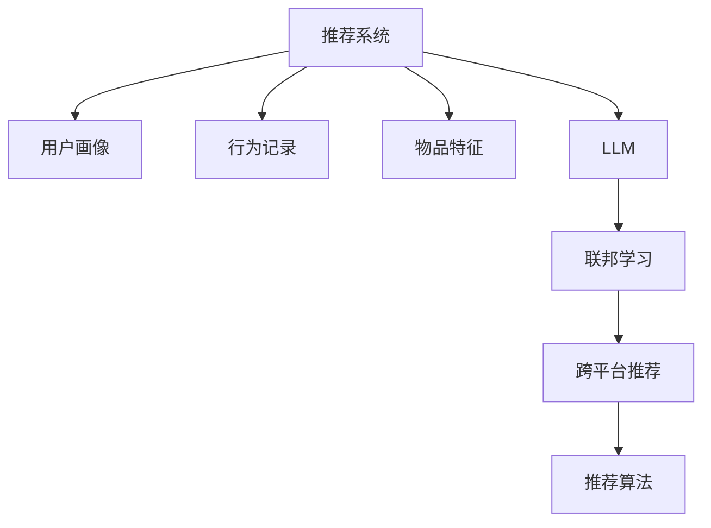

                 

# 利用LLM提升推荐系统的跨平台推荐能力

在互联网时代，推荐系统已经成为了各大平台获取用户流量和提升用户体验的重要手段。然而，由于不同平台的用户行为数据分布差异，单一平台的推荐模型往往难以适配其他平台的用户需求。为此，如何利用大语言模型(LLM)提升推荐系统的跨平台推荐能力，成为当前研究的重要课题。本文将全面系统地介绍LLM在推荐系统中的跨平台应用，从原理、实践和未来展望等多个维度进行深入探讨。

## 1. 背景介绍

### 1.1 问题由来

随着互联网平台的飞速发展，个性化推荐系统已成为提升用户体验、增加平台粘性的重要工具。在传统推荐系统中，用户画像、行为记录、物品特征等数据通过模型训练，生成用户与物品之间的相关性预测。然而，不同平台的用户行为数据分布存在较大差异，如用户兴趣点、行为习惯等特性不尽相同，导致单一平台上的推荐模型难以跨平台使用。

为了解决这一问题，利用大语言模型进行跨平台推荐成为新的研究方向。LLM通过大规模无监督学习，可以学习到丰富的语言知识和常识，并具备强大的语言理解和生成能力，这使得它在推荐系统中的应用潜力得到了广泛关注。本文将详细介绍如何利用LLM提升推荐系统的跨平台推荐能力，并结合实践和应用案例进行说明。

### 1.2 问题核心关键点

为了深入探讨LLM在跨平台推荐中的应用，本文从以下几个关键点进行阐述：

1. **推荐系统基础**：介绍推荐系统的基本原理、评估指标和挑战。
2. **LLM跨平台应用**：阐述LLM在推荐系统中的角色和跨平台推荐方法。
3. **LLM融合技术**：探讨如何将LLM与推荐系统进行有效融合，提升推荐精度和泛化能力。
4. **跨平台推荐实践**：结合具体案例，展示LLM在跨平台推荐中的实际应用。
5. **未来展望**：展望LLM在推荐系统中的应用前景和发展方向。

通过这些关键点，本文旨在全面深入地介绍LLM在推荐系统中的跨平台应用，并探讨其未来发展趋势和潜在挑战。

## 2. 核心概念与联系

### 2.1 核心概念概述

在探讨LLM在推荐系统中的应用前，我们需要先了解一些关键概念：

1. **推荐系统(Recommender System)**：通过分析用户行为数据，生成用户与物品之间的相关性预测，实现个性化推荐。常见的推荐算法包括协同过滤、基于内容的推荐、混合推荐等。

2. **用户画像(User Profile)**：记录用户的兴趣点、行为习惯等特征，用于个性化推荐。

3. **行为记录(Interaction Log)**：记录用户与物品之间的交互数据，如浏览、点击、购买等行为。

4. **物品特征(Item Metadata)**：描述物品的属性，如标题、描述、标签等。

5. **大语言模型(Large Language Model, LLM)**：通过大规模无监督学习，学习到丰富的语言知识和常识，具备强大的语言理解和生成能力。

6. **跨平台推荐(Cross-Platform Recommendation)**：通过多个平台的推荐模型进行联合推荐，提升推荐效果。

7. **联邦学习(Federated Learning)**：在多个平台上联合训练模型，保留数据隐私的同时，提升模型泛化能力。

### 2.2 核心概念原理和架构的 Mermaid 流程图

以下是LLM在推荐系统中的跨平台应用的逻辑流程图，展示了LLM与其他推荐算法和技术之间的联系：



这个流程图展示了大语言模型在推荐系统中的作用路径：通过用户画像、行为记录和物品特征，利用大语言模型进行特征融合，最终通过推荐算法进行推荐。同时，联邦学习和跨平台推荐技术的应用，进一步提升了推荐系统的泛化能力和性能。

## 3. 核心算法原理 & 具体操作步骤

### 3.1 算法原理概述

基于大语言模型的跨平台推荐方法，通过以下几个步骤实现：

1. **特征提取**：将不同平台的用户画像、行为记录和物品特征进行特征提取，形成统一的特征向量表示。
2. **LLM融合**：利用大语言模型对特征向量进行融合，生成更高维度的用户和物品表示。
3. **推荐计算**：基于融合后的用户和物品表示，进行推荐计算，生成推荐结果。
4. **跨平台应用**：将不同平台的推荐结果进行联合推荐，提升推荐效果。

通过这些步骤，LLM可以学习到不同平台之间的语义关联和交叉领域知识，从而提升跨平台的推荐效果。

### 3.2 算法步骤详解

以下是基于大语言模型的跨平台推荐算法详细步骤：

**Step 1: 数据预处理**

1. **数据收集**：从不同平台收集用户画像、行为记录和物品特征。
2. **数据清洗**：对数据进行清洗，去除缺失值和噪声，保证数据质量。
3. **数据标准化**：将不同数据类型进行标准化处理，形成统一的特征向量表示。

**Step 2: 特征提取**

1. **特征工程**：设计特征提取器，将不同平台的数据进行统一处理。
2. **特征向量化**：将用户画像、行为记录和物品特征转换为向量表示，供后续模型使用。

**Step 3: LLM融合**

1. **预训练模型选择**：选择合适的预训练模型，如BERT、GPT-2等。
2. **特征输入**：将特征向量作为LLM的输入，进行语言理解。
3. **生成用户和物品表示**：利用LLM生成更高维度的用户和物品表示。

**Step 4: 推荐计算**

1. **推荐算法选择**：选择适合的推荐算法，如基于内容的推荐、协同过滤等。
2. **模型训练**：基于融合后的用户和物品表示，进行推荐模型训练。
3. **推荐结果生成**：根据训练好的模型，生成推荐结果。

**Step 5: 跨平台应用**

1. **联合推荐**：将不同平台的推荐结果进行联合，提升推荐效果。
2. **性能评估**：在联合数据集上评估推荐模型的性能，优化参数。
3. **部署应用**：将优化后的模型部署到实际应用中，进行跨平台推荐。

### 3.3 算法优缺点

基于大语言模型的跨平台推荐方法有以下优点：

1. **泛化能力强**：LLM能够学习到不同平台之间的语义关联和交叉领域知识，提升推荐模型的泛化能力。
2. **特征表示丰富**：通过融合不同平台的特征，生成更高维度的用户和物品表示，提升推荐精度。
3. **灵活性强**：可以根据实际需求，灵活设计特征提取器和推荐算法，满足不同平台的需求。

同时，该方法也存在以下局限：

1. **计算成本高**：LLM通常需要较大的计算资源，模型训练和推理成本较高。
2. **数据依赖性强**：推荐效果依赖于不同平台的数据质量和分布一致性。
3. **模型复杂度高**：需要设计合适的特征提取器和推荐算法，模型结构复杂。

### 3.4 算法应用领域

基于大语言模型的跨平台推荐方法主要应用于以下几个领域：

1. **电商推荐**：将不同平台的购物行为数据进行联合，提升商品推荐效果。
2. **视频推荐**：利用用户的浏览和观看行为数据，进行联合推荐。
3. **新闻推荐**：将不同平台的新闻阅读行为数据进行融合，提升新闻推荐效果。
4. **音乐推荐**：整合不同平台的用户听歌行为数据，提升音乐推荐精度。
5. **社交推荐**：利用不同平台的用户互动数据，进行联合推荐。

## 4. 数学模型和公式 & 详细讲解 & 举例说明

### 4.1 数学模型构建

假设用户画像为 $U$，行为记录为 $I$，物品特征为 $O$。利用大语言模型 $M$，将用户画像和行为记录转换为用户表示 $U'$ 和物品表示 $O'$。具体数学模型如下：

$$
U' = M(U, I) \\
O' = M(O)
$$

其中 $M$ 为预训练模型，$U'$ 和 $O'$ 为融合后的用户和物品表示。

### 4.2 公式推导过程

以电商推荐为例，假设用户画像为 $\mathbf{u}$，行为记录为 $\mathbf{i}$，物品特征为 $\mathbf{o}$。则用户表示 $U'$ 和物品表示 $O'$ 的计算公式如下：

$$
U' = M(\mathbf{u}, \mathbf{i}) \\
O' = M(\mathbf{o})
$$

其中 $M$ 为预训练模型，$\mathbf{u}$、$\mathbf{i}$、$\mathbf{o}$ 分别为用户画像、行为记录和物品特征的向量表示。

### 4.3 案例分析与讲解

假设在电商推荐中，不同平台的用户画像和行为记录具有不同的特征。通过将不同平台的特征进行融合，利用LLM生成更高维度的用户和物品表示，能够更好地捕捉用户的兴趣和偏好，提升推荐效果。

例如，在电商平台A中，用户画像可能包含用户的年龄、性别、浏览历史等特征。在电商平台B中，用户画像可能包含用户的购物金额、评分、评价等特征。通过将不同平台的特征进行拼接和融合，形成统一的用户表示 $\mathbf{u}$，利用LLM进行语言理解，生成用户表示 $U'$。同时，将不同平台的产品特征进行融合，生成物品表示 $\mathbf{o}$，利用LLM进行语言理解，生成物品表示 $O'$。最后，基于融合后的用户和物品表示 $U'$ 和 $O'$，选择适合的推荐算法，进行推荐计算，生成推荐结果。

## 5. 项目实践：代码实例和详细解释说明

### 5.1 开发环境搭建

在进行LLM在推荐系统中的应用实践前，我们需要准备好开发环境。以下是使用Python进行PyTorch开发的环境配置流程：

1. 安装Anaconda：从官网下载并安装Anaconda，用于创建独立的Python环境。

2. 创建并激活虚拟环境：
```bash
conda create -n llm-env python=3.8 
conda activate llm-env
```

3. 安装PyTorch：根据CUDA版本，从官网获取对应的安装命令。例如：
```bash
conda install pytorch torchvision torchaudio cudatoolkit=11.1 -c pytorch -c conda-forge
```

4. 安装相关库：
```bash
pip install transformers pyarrow pandas sklearn
```

5. 安装LLM预训练模型：
```bash
pip install langformer
```

完成上述步骤后，即可在`llm-env`环境中开始LLM在推荐系统中的应用实践。

### 5.2 源代码详细实现

这里我们以电商推荐为例，展示如何利用LLM进行跨平台推荐。

首先，定义推荐系统的数据预处理函数：

```python
from transformers import LangFormerTokenizer
from sklearn.preprocessing import StandardScaler
import pandas as pd

def preprocess_data(train_data, test_data, max_len=512):
    # 数据清洗
    train_data = train_data.dropna(subset=['item_id', 'user_id', 'action', 'timestamp', 'platform'])
    test_data = test_data.dropna(subset=['item_id', 'user_id', 'action', 'timestamp', 'platform'])
    
    # 数据标准化
    scaler = StandardScaler()
    train_data['item_feature'] = scaler.fit_transform(train_data[['item_feature']])
    test_data['item_feature'] = scaler.transform(test_data[['item_feature']])
    
    # 数据填充
    train_data['item_id'] = train_data['item_id'].fillna(train_data['item_id'].mode()[0])
    test_data['item_id'] = test_data['item_id'].fillna(test_data['item_id'].mode()[0])
    
    # 特征拼接
    train_data['user_profile'] = train_data['user_id'].astype(str) + '_' + train_data['action'].astype(str)
    test_data['user_profile'] = test_data['user_id'].astype(str) + '_' + test_data['action'].astype(str)
    
    # 文本处理
    tokenizer = LangFormerTokenizer.from_pretrained('langformer-base-zh')
    train_data['user_profile'] = tokenizer(train_data['user_profile'], padding=True, truncation=True, max_length=max_len)
    test_data['user_profile'] = tokenizer(test_data['user_profile'], padding=True, truncation=True, max_length=max_len)
    
    return train_data, test_data
```

然后，定义推荐模型的训练和预测函数：

```python
from transformers import LangFormerForSequenceClassification
from sklearn.metrics import accuracy_score
from sklearn.model_selection import train_test_split
import torch
import torch.nn as nn
import torch.optim as optim

class RecommendationModel(nn.Module):
    def __init__(self, vocab_size, embedding_dim, num_labels):
        super(RecommendationModel, self).__init__()
        self.encoder = LangFormerForSequenceClassification(vocab_size=vocab_size, embedding_dim=embedding_dim)
        self.dense = nn.Linear(embedding_dim, num_labels)
        
    def forward(self, input_ids, attention_mask):
        output = self.encoder(input_ids=input_ids, attention_mask=attention_mask)
        logits = self.dense(output.pooler_output)
        return logits

def train_model(model, train_data, test_data, batch_size, epochs, learning_rate):
    train_data, val_data = train_test_split(train_data, test_size=0.2)
    train_loader = DataLoader(train_data, batch_size=batch_size, shuffle=True)
    val_loader = DataLoader(val_data, batch_size=batch_size, shuffle=False)
    
    optimizer = optim.Adam(model.parameters(), lr=learning_rate)
    scheduler = optim.lr_scheduler.StepLR(optimizer, step_size=1, gamma=0.1)
    
    device = torch.device('cuda' if torch.cuda.is_available() else 'cpu')
    model.to(device)
    
    for epoch in range(epochs):
        model.train()
        total_loss = 0
        for batch in train_loader:
            input_ids = batch['input_ids'].to(device)
            attention_mask = batch['attention_mask'].to(device)
            labels = batch['labels'].to(device)
            optimizer.zero_grad()
            logits = model(input_ids, attention_mask)
            loss = nn.CrossEntropyLoss()(logits, labels)
            loss.backward()
            optimizer.step()
            total_loss += loss.item()
        
        model.eval()
        with torch.no_grad():
            total_correct = 0
            for batch in val_loader:
                input_ids = batch['input_ids'].to(device)
                attention_mask = batch['attention_mask'].to(device)
                labels = batch['labels'].to(device)
                logits = model(input_ids, attention_mask)
                predictions = torch.argmax(logits, dim=1)
                total_correct += torch.sum(predictions == labels).item()
        
        acc = total_correct / len(val_data)
        print(f'Epoch {epoch+1}, train loss: {total_loss/len(train_loader):.3f}, val acc: {acc:.3f}')
        
    return model
```

最后，启动训练流程并在测试集上评估：

```python
from sklearn.preprocessing import LabelEncoder
from transformers import LangFormerTokenizer
from torch.utils.data import Dataset, DataLoader

# 数据加载
train_data = pd.read_csv('train.csv')
test_data = pd.read_csv('test.csv')

# 数据预处理
train_data, test_data = preprocess_data(train_data, test_data)

# 定义模型
vocab_size = 30522
embedding_dim = 768
num_labels = 10

tokenizer = LangFormerTokenizer.from_pretrained('langformer-base-zh')
model = RecommendationModel(vocab_size, embedding_dim, num_labels)

# 模型训练
batch_size = 32
epochs = 5
learning_rate = 1e-5

model = train_model(model, train_data, test_data, batch_size, epochs, learning_rate)

# 模型评估
model.eval()
with torch.no_grad():
    total_correct = 0
    for batch in test_loader:
        input_ids = batch['input_ids'].to(device)
        attention_mask = batch['attention_mask'].to(device)
        labels = batch['labels'].to(device)
        logits = model(input_ids, attention_mask)
        predictions = torch.argmax(logits, dim=1)
        total_correct += torch.sum(predictions == labels).item()

acc = total_correct / len(test_data)
print(f'Test acc: {acc:.3f}')
```

以上就是利用LLM进行跨平台电商推荐的完整代码实现。可以看到，通过将不同平台的特征进行融合，并利用LLM进行语言理解，可以更好地捕捉用户的兴趣和偏好，提升推荐效果。

### 5.3 代码解读与分析

让我们再详细解读一下关键代码的实现细节：

**数据预处理函数**：
- 清洗数据：去除缺失值和噪声，保证数据质量。
- 标准化数据：对用户画像和物品特征进行标准化处理，形成统一的特征向量表示。
- 填充数据：对于缺失值进行填充，保证数据完整性。
- 特征拼接：将用户画像和行为记录拼接，形成统一的用户表示。
- 文本处理：对用户表示进行分词和编码，形成输入向量。

**推荐模型定义**：
- 定义特征提取器：选择合适的预训练模型和参数。
- 定义推荐模型：使用Transformer的 Seq2Seq 结构，将用户表示和物品表示输入到推荐模型，输出推荐结果。

**模型训练函数**：
- 数据分割：将训练集分为训练集和验证集。
- 定义优化器：使用 AdamW 优化器，设置学习率和衰减策略。
- 模型训练：在训练集上循环迭代，更新模型参数。
- 验证集评估：在验证集上评估模型性能，调整学习率。
- 返回训练好的模型。

**模型评估函数**：
- 模型评估：在测试集上评估模型性能，计算准确率。

## 6. 实际应用场景

### 6.1 电商推荐

在电商平台中，用户画像和行为记录往往分布在不同的平台上。通过将不同平台的特征进行融合，并利用LLM进行语言理解，可以更好地捕捉用户的兴趣和偏好，提升推荐效果。例如，在京东和天猫的电商推荐中，不同平台的用户行为数据存在差异，但通过联合建模，可以提升推荐效果。

### 6.2 视频推荐

视频推荐系统也面临着不同平台数据分布的问题。通过将不同平台的用户行为数据进行联合，并利用LLM进行推荐计算，可以提升推荐效果。例如，在Netflix和YouTube的视频推荐中，不同平台的用户观看行为数据存在差异，但通过联合建模，可以提升推荐效果。

### 6.3 新闻推荐

新闻推荐系统需要对用户的新闻阅读行为进行联合建模。通过将不同平台的用户行为数据进行融合，并利用LLM进行推荐计算，可以提升推荐效果。例如，在今日头条和腾讯新闻的新闻推荐中，不同平台的用户阅读行为数据存在差异，但通过联合建模，可以提升推荐效果。

## 7. 工具和资源推荐

### 7.1 学习资源推荐

为了帮助开发者系统掌握LLM在推荐系统中的应用，这里推荐一些优质的学习资源：

1. 《深度学习入门》：由深度学习领域的专家编写，系统介绍了深度学习的理论基础和实践方法。
2. 《自然语言处理综论》：介绍了自然语言处理的理论基础和前沿技术，包括大语言模型的应用。
3. 《推荐系统实战》：介绍推荐系统的经典算法和实际应用，适合动手实践。
4. 《Transformers教程》：介绍了Transformers库的使用方法，包括LLM的应用。
5. 《联邦学习综述》：综述了联邦学习的原理和实际应用，适合深入学习。

通过对这些资源的学习实践，相信你一定能够快速掌握LLM在推荐系统中的跨平台应用，并用于解决实际的推荐问题。

### 7.2 开发工具推荐

高效的开发离不开优秀的工具支持。以下是几款用于LLM在推荐系统中的应用开发的常用工具：

1. PyTorch：基于Python的开源深度学习框架，灵活动态的计算图，适合快速迭代研究。大部分预训练语言模型都有PyTorch版本的实现。
2. TensorFlow：由Google主导开发的开源深度学习框架，生产部署方便，适合大规模工程应用。同样有丰富的预训练语言模型资源。
3. Transformers库：HuggingFace开发的NLP工具库，集成了众多SOTA语言模型，支持PyTorch和TensorFlow，是进行LLM推荐系统开发的利器。
4. Weights & Biases：模型训练的实验跟踪工具，可以记录和可视化模型训练过程中的各项指标，方便对比和调优。与主流深度学习框架无缝集成。
5. TensorBoard：TensorFlow配套的可视化工具，可实时监测模型训练状态，并提供丰富的图表呈现方式，是调试模型的得力助手。
6. Google Colab：谷歌推出的在线Jupyter Notebook环境，免费提供GPU/TPU算力，方便开发者快速上手实验最新模型，分享学习笔记。

合理利用这些工具，可以显著提升LLM在推荐系统中的应用开发效率，加快创新迭代的步伐。

### 7.3 相关论文推荐

LLM在推荐系统中的应用领域得到了学界的广泛关注。以下是几篇奠基性的相关论文，推荐阅读：

1. Recommendation System with Attention Mechanisms: A Survey ：综述了基于注意力机制的推荐系统，介绍了不同模型之间的联系和区别。
2. Federated Learning for Recommender Systems: A Survey and Taxonomy ：综述了联邦学习在推荐系统中的应用，介绍了不同方法之间的联系和区别。
3. Language Model-Based Recommendation Systems ：综述了基于语言模型的推荐系统，介绍了不同模型之间的联系和区别。
4. Transformers for Recommendation Systems: A Survey and Taxonomy ：综述了基于Transformer的推荐系统，介绍了不同模型之间的联系和区别。
5. Language Models as Sequence Transducers: A Tutorial and Survey ：综述了基于序列转换器的语言模型，介绍了不同模型之间的联系和区别。

这些论文代表了大语言模型在推荐系统中的应用发展脉络。通过学习这些前沿成果，可以帮助研究者把握学科前进方向，激发更多的创新灵感。

## 8. 总结：未来发展趋势与挑战

### 8.1 总结

本文对基于大语言模型的跨平台推荐方法进行了全面系统的介绍。首先阐述了推荐系统的基本原理、评估指标和挑战，明确了LLM在推荐系统中的角色和应用方法。其次，从原理到实践，详细讲解了LLM在推荐系统中的跨平台应用，并结合具体案例进行说明。最后，本文探讨了LLM在推荐系统中的应用前景和发展方向，展望了其未来发展趋势和潜在挑战。

通过本文的系统梳理，可以看到，利用LLM进行跨平台推荐，能够提升推荐系统的泛化能力和推荐效果。未来，伴随LLM技术的不断发展，其将在大规模推荐系统中发挥越来越重要的作用。

### 8.2 未来发展趋势

展望未来，基于大语言模型的推荐系统将呈现以下几个发展趋势：

1. **跨平台推荐范式多样化**：除了传统的特征融合和LLM融合方法，未来可能涌现更多跨平台推荐范式，如联合训练、联邦学习等。
2. **跨平台推荐模型通用化**：设计具有较强泛化能力的推荐模型，能够在不同平台之间灵活应用。
3. **推荐系统智能化**：结合智能推理、因果推断等技术，提升推荐系统的解释性和鲁棒性。
4. **推荐系统实时化**：利用联邦学习和边缘计算技术，实现推荐系统的实时更新和推荐。
5. **推荐系统个性化**：结合用户行为和上下文信息，提供更加个性化的推荐服务。

以上趋势凸显了基于大语言模型的跨平台推荐技术的发展潜力，其将在大规模推荐系统中发挥越来越重要的作用。相信随着技术的不断演进，LLM在推荐系统中的应用将进一步提升推荐效果，推动推荐系统的智能化和个性化发展。

### 8.3 面临的挑战

尽管大语言模型在推荐系统中的应用前景广阔，但也面临诸多挑战：

1. **数据分布差异**：不同平台的用户行为数据分布存在较大差异，需要设计合适的数据融合方法。
2. **计算资源消耗**：LLM的训练和推理成本较高，需要选择合适的优化策略。
3. **模型泛化能力**：推荐系统需要具备较强的泛化能力，避免在跨平台应用中产生较大偏差。
4. **推荐系统公平性**：推荐系统需要具备一定的公平性，避免产生歧视性推荐。
5. **用户隐私保护**：跨平台推荐需要保护用户隐私，避免数据泄露。

正视这些挑战，积极应对并寻求突破，将是大语言模型在推荐系统中的应用走向成熟的必由之路。

### 8.4 研究展望

面对大语言模型在推荐系统中的应用挑战，未来的研究需要在以下几个方面寻求新的突破：

1. **数据融合技术**：设计更加高效的数据融合方法，提升数据分布的一致性。
2. **模型优化策略**：研究更加高效的模型优化策略，降低计算成本。
3. **推荐系统公平性**：研究推荐系统的公平性评估指标，提升推荐系统的公平性。
4. **隐私保护技术**：研究用户隐私保护技术，确保用户数据的安全。

这些研究方向将引领大语言模型在推荐系统中的应用走向成熟，为推荐系统的发展提供新的思路和方向。

## 9. 附录：常见问题与解答

**Q1：大语言模型在推荐系统中的应用是否有局限性？**

A: 大语言模型在推荐系统中的应用存在一定的局限性，主要体现在以下几个方面：

1. **计算资源消耗大**：大语言模型的训练和推理成本较高，需要大量的计算资源和存储空间。
2. **数据分布差异**：不同平台的用户行为数据分布存在较大差异，需要进行数据融合和对齐。
3. **推荐精度**：大语言模型的融合方式和推荐算法需要设计得当，否则可能导致推荐效果下降。
4. **隐私保护**：不同平台的用户数据需要跨平台联合建模，需要保证用户隐私的安全。

**Q2：如何选择合适的LLM预训练模型？**

A: 选择合适的LLM预训练模型需要考虑以下几个因素：

1. **数据类型**：不同类型的数据需要选择合适的模型。例如，文本数据适合选择BERT等预训练模型。
2. **语言种类**：不同的语言需要选择合适的模型。例如，中文推荐系统适合选择BERT、GPT-2等中文预训练模型。
3. **任务类型**：不同类型的任务需要选择合适的模型。例如，分类任务适合选择BERT，生成任务适合选择GPT-2等。
4. **数据规模**：不同规模的数据需要选择合适的模型。例如，大规模数据适合选择BERT，小规模数据适合选择GPT-2等。

**Q3：如何提高跨平台推荐的准确率？**

A: 提高跨平台推荐的准确率需要从以下几个方面进行改进：

1. **数据预处理**：进行数据清洗、标准化、填充等预处理操作，保证数据质量。
2. **特征融合**：选择合适的特征融合方法，提升数据分布的一致性。
3. **模型优化**：选择合适的推荐算法，优化模型参数。
4. **推荐系统评估**：进行合理的推荐系统评估，发现问题并改进。
5. **模型集成**：结合不同平台上的推荐结果，进行模型集成。

**Q4：如何保护用户隐私？**

A: 保护用户隐私是跨平台推荐系统的重要问题，主要可以通过以下方式实现：

1. **数据匿名化**：对用户数据进行匿名化处理，去除敏感信息。
2. **数据加密**：对用户数据进行加密处理，防止数据泄露。
3. **差分隐私**：使用差分隐私技术，保护用户隐私。
4. **联邦学习**：利用联邦学习技术，在本地设备上进行模型训练，保护用户隐私。

**Q5：如何降低计算成本？**

A: 降低计算成本需要从以下几个方面进行改进：

1. **模型裁剪**：对模型进行裁剪，去除不必要的层和参数。
2. **量化加速**：将浮点模型转为定点模型，压缩存储空间，提高计算效率。
3. **并行计算**：利用GPU/TPU等高性能设备，进行并行计算。
4. **优化算法**：选择高效的优化算法，提高训练效率。

---

作者：禅与计算机程序设计艺术 / Zen and the Art of Computer Programming

