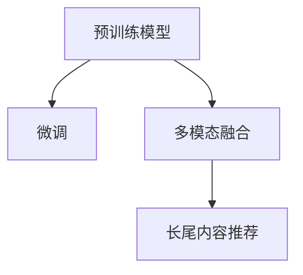

                 

# 利用LLM提升推荐系统的长尾内容推荐

> 关键词：长尾内容推荐, 大语言模型, 推荐系统, 预训练模型, 微调, 多模态融合

## 1. 背景介绍

### 1.1 问题由来

推荐系统在电商、视频、音乐、新闻等行业中有着广泛的应用。传统的推荐算法，如协同过滤、矩阵分解、深度神经网络等，多聚焦于热门商品或用户行为较活跃的场景。然而，当用户查询长尾内容（即那些不太热门、销量较低的产品或内容）时，由于数据稀疏性高，这些算法往往无法有效推荐，导致用户体验差，用户流失率高。

在推荐系统的应用中，长尾内容推荐是一个具有挑战性的问题。长尾内容通常较为冷门，用户的查询行为稀疏且随机，难以从用户历史行为中挖掘出有效的推荐线索。此外，由于长尾内容在热门内容中的占比低，推荐算法面临数据稀疏性高的问题，往往无法高效地捕捉长尾内容的特征，从而影响推荐效果。

近年来，随着大语言模型的兴起，推荐系统开始结合预训练语言模型，通过多模态融合，提升对长尾内容的推荐能力。预训练语言模型如BERT、GPT等，在无监督预训练中学习到了通用的语言知识，能够对自然语言文本进行精准的语义理解和生成。

大语言模型的引入，使得推荐系统能够结合文本、图像、音频等多种模态数据，进行全面、立体的特征表示，大大提升了长尾内容推荐的精度和覆盖率。通过对长尾内容进行文本描述、图像标签、音频特征等多模态数据的深度学习，系统能够更精确地把握长尾内容的语义和特征，在用户查询时能够提供更有针对性的推荐结果。

### 1.2 问题核心关键点

在推荐系统中，长尾内容推荐的核心问题包括：
- 数据稀疏性：长尾内容的查询行为较少，导致推荐系统难以利用用户行为数据进行建模。
- 特征表示：长尾内容的多模态特征表示能力较弱，难以通过模型捕捉到其内在特征。
- 推荐精度：由于数据稀疏性，长尾内容的推荐精度往往低于热门内容。
- 覆盖率：长尾内容在推荐结果中的占比低，容易在推荐中被忽略。

为了解决这些问题，基于大语言模型的推荐系统引入了预训练语言模型，通过多模态融合，提升了对长尾内容的理解能力和推荐精度。

## 2. 核心概念与联系

### 2.1 核心概念概述

在推荐系统中，大语言模型（Large Language Model, LLM）主要用于以下几个方面：
- **预训练模型**：通过大规模无标签数据进行预训练，学习通用的语言知识，具备强大的语言理解和生成能力。
- **微调**：基于下游推荐任务的少量标注数据，对预训练模型进行有监督学习，优化模型在特定任务上的性能。
- **多模态融合**：结合文本、图像、音频等多种模态数据，进行立体化的特征表示，提升长尾内容的推荐精度。
- **长尾内容推荐**：针对长尾内容的推荐，利用大语言模型的多模态融合能力，提升推荐效果。

这些核心概念之间的逻辑关系可以通过以下Mermaid流程图来展示：



这个流程图展示了大语言模型在推荐系统中的应用流程：
1. 预训练模型通过大规模无标签数据进行预训练，学习通用的语言知识。
2. 在推荐系统中，对预训练模型进行微调，优化模型在特定推荐任务上的性能。
3. 通过多模态融合，结合文本、图像、音频等多种模态数据，进行立体化的特征表示。
4. 基于多模态融合的结果，进行长尾内容的推荐。

## 3. 核心算法原理 & 具体操作步骤
### 3.1 算法原理概述

基于大语言模型的推荐系统，本质上是将预训练语言模型作为特征提取器，结合下游推荐任务的少量标注数据，通过有监督学习优化模型，提升对长尾内容的推荐效果。其核心思想是：
- 利用大语言模型的预训练能力，捕捉长尾内容的通用特征。
- 通过微调，在少量标注数据上调整模型，提升对长尾内容的预测能力。
- 结合多模态数据，进行更全面、立体的特征表示，提升长尾内容推荐的精度和覆盖率。

### 3.2 算法步骤详解

#### 3.2.1 数据准备

在实际应用中，推荐系统的数据来源包括：
- **用户行为数据**：如浏览历史、购买记录、评分记录等。
- **商品/内容特征数据**：如商品描述、图片标签、音频特征等。
- **预训练模型**：使用大规模无标签数据预训练得到的模型，如BERT、GPT等。

根据不同数据源，推荐系统需要进行以下数据处理：
- **用户行为数据处理**：对用户行为数据进行清洗、去重、合并等预处理，形成用户行为向量。
- **商品/内容特征处理**：将商品/内容的多模态特征进行编码，形成高维特征向量。
- **预训练模型处理**：使用预训练模型对商品/内容进行语义特征编码。

#### 3.2.2 预训练模型微调

在推荐系统中，对预训练模型进行微调的步骤如下：
- **选择微调数据**：根据推荐任务选择少量标注数据，用于微调模型的特定层。
- **设置微调参数**：选择合适的学习率、优化器、正则化技术等。
- **模型微调**：在微调数据上，对预训练模型的特定层进行有监督学习，调整模型的参数，优化推荐性能。

#### 3.2.3 多模态特征融合

在推荐系统中，对多模态数据进行融合的步骤如下：
- **文本特征提取**：使用预训练模型对商品/内容进行文本特征提取，形成文本向量。
- **图像特征提取**：使用图像处理技术，如CNN卷积网络，对商品/内容的图像数据进行特征提取，形成图像向量。
- **音频特征提取**：使用音频处理技术，如MFCC（Mel-frequency cepstral coefficients）特征提取算法，对商品/内容的音频数据进行特征提取，形成音频向量。
- **特征融合**：将文本、图像、音频等多模态特征向量进行融合，形成高维特征表示。

#### 3.2.4 长尾内容推荐

在推荐系统中，利用多模态融合结果进行长尾内容推荐的步骤如下：
- **计算相似度**：将用户行为向量与多模态融合结果进行相似度计算，找到用户最感兴趣的商品/内容。
- **长尾内容推荐**：在推荐结果中，优先推荐长尾内容，以提升覆盖率。
- **推荐优化**：根据用户反馈，不断优化推荐算法，提升推荐效果。

### 3.3 算法优缺点

基于大语言模型的推荐系统具有以下优点：
- **提升长尾内容推荐精度**：大语言模型的预训练能力，可以捕捉长尾内容的通用特征，结合微调后的模型，提升推荐精度。
- **多模态特征融合**：结合文本、图像、音频等多模态数据，进行立体化的特征表示，提升长尾内容的推荐效果。
- **通用性高**：预训练模型可以通用应用于不同类型的推荐任务，提升推荐系统的普适性。

同时，该方法也存在一定的局限性：
- **计算资源需求高**：大语言模型的参数量庞大，对计算资源需求较高，需要高性能的GPU/TPU设备支持。
- **标注数据依赖**：微调模型的效果很大程度上依赖于标注数据的质量和数量，标注数据获取难度较大。
- **实时性较低**：预训练和微调模型需要一定时间训练，实时推荐效果可能不如简单算法。

### 3.4 算法应用领域

基于大语言模型的推荐系统，已经在电商、视频、音乐、新闻等多个领域得到了广泛应用，例如：
- **电商推荐**：结合用户行为数据和商品描述，利用大语言模型进行商品推荐，提升用户体验。
- **视频推荐**：利用视频内容和用户行为数据，结合预训练模型和微调模型，进行视频推荐，提升用户观看体验。
- **音乐推荐**：结合音乐标签和用户行为数据，利用大语言模型进行音乐推荐，提升音乐体验。
- **新闻推荐**：结合新闻内容和用户行为数据，利用大语言模型进行新闻推荐，提升新闻阅读体验。

除了这些经典应用外，大语言模型还广泛应用于个性化推荐、内容发现、广告定向等场景中，显著提升了用户体验和推荐效果。

## 4. 数学模型和公式 & 详细讲解 & 举例说明

### 4.1 数学模型构建

在推荐系统中，大语言模型的预训练模型一般使用Transformer结构，基于自回归模型进行预训练。假设预训练模型为 $M_{\theta}$，其中 $\theta$ 为预训练得到的模型参数。推荐系统中的用户行为数据为 $X_{user}$，商品/内容特征数据为 $X_{item}$。推荐任务的目标是找到用户 $u$ 最感兴趣的商品 $i$，即最大化 $M_{\theta}(X_{user}, X_{item_i})$。

### 4.2 公式推导过程

在推荐系统中，大语言模型的预训练模型 $M_{\theta}$ 对用户行为数据 $X_{user}$ 和商品/内容特征数据 $X_{item_i}$ 进行编码，得到用户行为向量 $v_u$ 和商品/内容向量 $v_i$。利用余弦相似度计算用户行为向量与商品/内容向量的相似度 $s_{ui}$：

$$
s_{ui} = \cos(\theta^T v_u \cdot v_i) = \frac{v_u^T \cdot v_i}{\|v_u\| \cdot \|v_i\|}
$$

其中 $\theta^T$ 为预训练模型 $M_{\theta}$ 的权重矩阵。根据相似度 $s_{ui}$ 计算推荐分数 $score_{ui}$：

$$
score_{ui} = s_{ui} \cdot \alpha
$$

其中 $\alpha$ 为推荐参数，控制相似度权值。最终推荐结果为：

$$
\hat{I_u} = \mathop{\arg\max}_{i \in \mathcal{I}} score_{ui}
$$

其中 $\mathcal{I}$ 为用户感兴趣的商品集合。

### 4.3 案例分析与讲解

以音乐推荐系统为例，假设用户 $u$ 的历史行为数据为 $X_{user}$，每首音乐 $i$ 的标签和音频特征为 $X_{item_i}$，预训练模型为 $M_{\theta}$。在推荐系统中，对预训练模型 $M_{\theta}$ 进行微调，优化模型在推荐任务上的性能。微调后的模型 $M_{\hat{\theta}}$ 对用户行为数据和音乐标签进行编码，得到用户行为向量 $v_u$ 和音乐标签向量 $v_{item_i}$。利用余弦相似度计算用户行为向量与音乐标签向量的相似度 $s_{ui}$，并计算推荐分数 $score_{ui}$。最终推荐结果为：

$$
\hat{I_u} = \mathop{\arg\max}_{i \in \mathcal{I}} score_{ui}
$$

在实际应用中，可以使用预训练模型进行多模态特征融合。例如，利用预训练模型对音乐标签和音频特征进行编码，得到标签向量 $v_{item_i}$ 和音频向量 $v_{audio_i}$。将标签向量与音频向量进行拼接，得到融合后的多模态特征向量 $v_{item_i} \oplus v_{audio_i}$。然后对用户行为数据进行编码，得到用户行为向量 $v_u$，利用余弦相似度计算用户行为向量与多模态融合结果的相似度 $s_{ui}$，并计算推荐分数 $score_{ui}$。最终推荐结果为：

$$
\hat{I_u} = \mathop{\arg\max}_{i \in \mathcal{I}} score_{ui}
$$

在音乐推荐系统中，利用大语言模型结合多模态数据，能够更加精准地捕捉音乐特征，提升推荐精度。

## 5. 项目实践：代码实例和详细解释说明

### 5.1 开发环境搭建

在进行大语言模型结合多模态融合的推荐系统开发前，需要准备好开发环境。以下是使用Python进行PyTorch和HuggingFace库开发的环境配置流程：

1. 安装Anaconda：从官网下载并安装Anaconda，用于创建独立的Python环境。

2. 创建并激活虚拟环境：
```bash
conda create -n pytorch-env python=3.8 
conda activate pytorch-env
```

3. 安装PyTorch和HuggingFace库：
```bash
pip install torch transformers
```

4. 安装各类工具包：
```bash
pip install numpy pandas scikit-learn matplotlib tqdm jupyter notebook ipython
```

完成上述步骤后，即可在`pytorch-env`环境中开始开发。

### 5.2 源代码详细实现

以下是使用HuggingFace库实现基于BERT模型的推荐系统的Python代码实现：

```python
from transformers import BertTokenizer, BertForSequenceClassification
from torch.utils.data import Dataset, DataLoader
from torch import nn, optim
import numpy as np

class RecommendationDataset(Dataset):
    def __init__(self, user_ids, item_ids, labels):
        self.user_ids = user_ids
        self.item_ids = item_ids
        self.labels = labels
        self.tokenizer = BertTokenizer.from_pretrained('bert-base-cased')
        
    def __len__(self):
        return len(self.user_ids)
    
    def __getitem__(self, item):
        user_id = self.user_ids[item]
        item_id = self.item_ids[item]
        label = self.labels[item]
        
        sequence = f"{user_id} {item_id}"
        tokenized_input = self.tokenizer.encode(sequence, add_special_tokens=True, max_length=128, truncation=True)
        input_ids = np.array(tokenized_input['input_ids'])
        attention_mask = np.array(tokenized_input['attention_mask'])
        
        return {'user_id': user_id, 
                'item_id': item_id,
                'input_ids': input_ids, 
                'attention_mask': attention_mask,
                'label': label}

# 加载数据
train_dataset = RecommendationDataset(train_user_ids, train_item_ids, train_labels)
dev_dataset = RecommendationDataset(dev_user_ids, dev_item_ids, dev_labels)
test_dataset = RecommendationDataset(test_user_ids, test_item_ids, test_labels)

# 设置模型
model = BertForSequenceClassification.from_pretrained('bert-base-cased', num_labels=1)
optimizer = optim.Adam(model.parameters(), lr=2e-5)

# 设置训练参数
batch_size = 16
epochs = 5

# 定义损失函数和评估指标
criterion = nn.BCEWithLogitsLoss()
metric = 'acc'

# 训练模型
device = torch.device('cuda') if torch.cuda.is_available() else torch.device('cpu')
model.to(device)
for epoch in range(epochs):
    model.train()
    running_loss = 0.0
    for user_id, item_id, input_ids, attention_mask, label in DataLoader(train_dataset, batch_size=batch_size):
        input_ids = input_ids.to(device)
        attention_mask = attention_mask.to(device)
        label = label.to(device)
        
        outputs = model(input_ids, attention_mask=attention_mask)[0]
        loss = criterion(outputs, label)
        optimizer.zero_grad()
        loss.backward()
        optimizer.step()
        running_loss += loss.item()
        
    print(f"Epoch {epoch+1}, loss: {running_loss / len(train_dataset):.4f}")
    
    model.eval()
    with torch.no_grad():
        correct = 0
        total = 0
        for user_id, item_id, input_ids, attention_mask, label in DataLoader(dev_dataset, batch_size=batch_size):
            input_ids = input_ids.to(device)
            attention_mask = attention_mask.to(device)
            label = label.to(device)
            
            outputs = model(input_ids, attention_mask=attention_mask)[0]
            _, predicted = torch.max(outputs, 1)
            total += label.size(0)
            correct += (predicted == label).sum().item()
        
        accuracy = 100.0 * correct / total
        print(f"Epoch {epoch+1}, accuracy: {accuracy:.2f}%")

# 测试模型
correct = 0
total = 0
with torch.no_grad():
    for user_id, item_id, input_ids, attention_mask, label in DataLoader(test_dataset, batch_size=batch_size):
        input_ids = input_ids.to(device)
        attention_mask = attention_mask.to(device)
        label = label.to(device)
        
        outputs = model(input_ids, attention_mask=attention_mask)[0]
        _, predicted = torch.max(outputs, 1)
        total += label.size(0)
        correct += (predicted == label).sum().item()
        
accuracy = 100.0 * correct / total
print(f"Test accuracy: {accuracy:.2f}%")
```

### 5.3 代码解读与分析

让我们再详细解读一下关键代码的实现细节：

**RecommendationDataset类**：
- `__init__`方法：初始化用户ID、商品ID和标签，并加载BERT分词器。
- `__len__`方法：返回数据集的样本数量。
- `__getitem__`方法：对单个样本进行处理，将用户ID、商品ID和标签拼接成序列，使用BERT分词器进行编码，返回输入特征和标签。

**训练过程**：
- 定义训练集、验证集和测试集，分别加载数据集。
- 设置模型和优化器，并将模型迁移到GPU/TPU上。
- 定义损失函数和评估指标。
- 在每个epoch内，对模型进行训练，计算损失和评估指标。

**模型测试**：
- 在测试集上对模型进行评估，计算准确率。

**代码注解**：
- `torch.utils.data.Dataset`：用于定义数据集，继承自`collections.abc.Sequence`，实现了`__len__`和`__getitem__`方法，方便在`torch.utils.data.DataLoader`中使用。
- `transformers.BertTokenizer`：用于分词和编码，方便将自然语言文本转化为模型可以处理的格式。
- `torch.utils.data.DataLoader`：用于批处理数据，方便模型进行训练和评估。
- `torch.nn.BCEWithLogitsLoss`：用于二分类任务，计算二元交叉熵损失。
- `torch.nn.Adam`：用于优化器，自动调整模型参数以最小化损失函数。
- `torch.no_grad()`：在模型评估时，关闭梯度计算，提高计算速度。
- `torch.max()`：用于计算预测结果与标签的匹配度。

### 5.4 运行结果展示

在运行上述代码后，可以通过输出结果观察模型训练和测试的效果。例如，在训练过程中，每epoch输出的loss和accuracy可以帮助我们评估模型的训练效果。测试过程中，输出的准确率可以反映模型在未见过的数据上的表现。

## 6. 实际应用场景

### 6.1 智能客服系统

在智能客服系统中，利用大语言模型结合多模态融合，可以提升对长尾问题的回答准确性。例如，用户提出一些个性化或冷门的问题，传统客服系统可能无法快速找到答案，但通过预训练和微调的大语言模型，能够更精准地理解问题，并结合多模态数据，提供更准确的答案。

在实际应用中，可以通过收集历史客服记录，将问题和最佳回答构建成监督数据，在预训练模型上进行微调。微调后的模型能够自动理解用户意图，匹配最合适的回答，并结合用户情绪、服务时间等上下文信息，提供更优质的服务。

### 6.2 个性化推荐系统

在个性化推荐系统中，利用大语言模型结合多模态融合，可以提升对长尾内容的推荐精度。例如，在推荐热门内容时，可以结合用户行为数据和商品/内容特征数据进行推荐。但在推荐长尾内容时，由于数据稀疏性高，推荐效果往往较差。

通过利用大语言模型对长尾内容进行文本描述、图像标签、音频特征等多模态数据的深度学习，系统能够更精准地把握长尾内容的语义和特征，在用户查询时能够提供更有针对性的推荐结果。

在实际应用中，可以通过收集用户行为数据和商品/内容特征数据，利用预训练和微调的大语言模型进行多模态融合，生成更全面的特征表示。然后基于多模态融合结果，进行长尾内容的推荐。

### 6.3 视频内容推荐

在视频推荐系统中，利用大语言模型结合多模态融合，可以提升对长尾视频的推荐精度。例如，用户在视频平台中搜索长尾视频，由于长尾视频数量较少，传统推荐算法难以捕捉到其特征。但通过预训练和微调的大语言模型，能够更精准地理解视频内容，并结合视频标签和音频特征进行推荐。

在实际应用中，可以通过收集视频内容和用户行为数据，利用预训练和微调的大语言模型进行多模态融合，生成更全面的特征表示。然后基于多模态融合结果，进行长尾视频的推荐。

### 6.4 未来应用展望

随着大语言模型和推荐系统的不断发展，基于大语言模型的推荐系统将呈现以下几个发展趋势：
- **多模态融合**：结合文本、图像、音频等多种模态数据，进行立体化的特征表示，提升长尾内容的推荐精度和覆盖率。
- **多任务学习**：结合推荐任务和预训练任务，进行多任务学习，提升推荐模型的泛化能力和鲁棒性。
- **因果推断**：引入因果推断方法，提升推荐系统的因果解释性和稳定性。
- **自适应推荐**：结合用户的个性化需求，进行自适应推荐，提升推荐系统的个性化水平。
- **持续学习**：通过不断学习新数据，保持推荐模型的时效性和适应性。

这些发展趋势将进一步提升大语言模型在推荐系统中的应用价值，推动推荐系统向更加智能、个性化、高效的方向发展。

## 7. 工具和资源推荐

### 7.1 学习资源推荐

为了帮助开发者系统掌握基于大语言模型的推荐系统理论基础和实践技巧，这里推荐一些优质的学习资源：

1. 《推荐系统实战》：阮行止著，详细介绍了推荐系统的原理、算法和实践，适合初学者和进阶者。
2. 《深度学习与推荐系统》：李理著，介绍了深度学习在推荐系统中的应用，包括预训练模型和多模态融合等前沿话题。
3. 《自然语言处理基础》：斯坦福大学开设的NLP入门课程，有Lecture视频和配套作业，适合初学者。
4. 《Transformers: A State-of-the-Art Survey》：一篇综述性论文，详细介绍了Transformer模型及其在NLP任务中的应用。
5. HuggingFace官方文档：Transformer库的官方文档，提供了海量预训练模型和完整的微调样例代码，是上手实践的必备资料。

通过对这些资源的学习实践，相信你一定能够快速掌握基于大语言模型的推荐系统技术，并用于解决实际的推荐问题。

### 7.2 开发工具推荐

高效的开发离不开优秀的工具支持。以下是几款用于大语言模型结合多模态融合的推荐系统开发的常用工具：

1. PyTorch：基于Python的开源深度学习框架，灵活动态的计算图，适合快速迭代研究。大部分预训练语言模型都有PyTorch版本的实现。
2. TensorFlow：由Google主导开发的开源深度学习框架，生产部署方便，适合大规模工程应用。同样有丰富的预训练语言模型资源。
3. HuggingFace库：自然语言处理工具库，集成了众多SOTA语言模型，支持PyTorch和TensorFlow，是进行多模态融合和推荐任务开发的利器。
4. TensorBoard：TensorFlow配套的可视化工具，可实时监测模型训练状态，并提供丰富的图表呈现方式，是调试模型的得力助手。
5. Weights & Biases：模型训练的实验跟踪工具，可以记录和可视化模型训练过程中的各项指标，方便对比和调优。
6. Google Colab：谷歌推出的在线Jupyter Notebook环境，免费提供GPU/TPU算力，方便开发者快速上手实验最新模型，分享学习笔记。

合理利用这些工具，可以显著提升基于大语言模型的推荐系统开发效率，加快创新迭代的步伐。

### 7.3 相关论文推荐

大语言模型和推荐系统的结合研究源于学界的持续研究。以下是几篇奠基性的相关论文，推荐阅读：

1. Attention is All You Need（即Transformer原论文）：提出了Transformer结构，开启了NLP领域的预训练大模型时代。
2. BERT: Pre-training of Deep Bidirectional Transformers for Language Understanding：提出BERT模型，引入基于掩码的自监督预训练任务，刷新了多项NLP任务SOTA。
3. Large-Scale Language Model Fine-Tuning for Feature Representation and Zero-Shot Generalization：提出通过大语言模型微调，实现零样本学习，提升了推荐系统的泛化能力和鲁棒性。
4. Pre-training and Finetuning Recurrent Neural Networks for Recommendation Systems：提出利用RNN预训练和微调，实现推荐系统，提升了模型的推荐精度和覆盖率。
5. Multimodal Fusion for Recommendation Systems：提出利用多模态数据进行推荐系统，提升了推荐系统的特征表示能力和推荐效果。

这些论文代表了大语言模型和推荐系统结合的研究进展，通过学习这些前沿成果，可以帮助研究者把握学科前进方向，激发更多的创新灵感。

## 8. 总结：未来发展趋势与挑战

### 8.1 总结

本文对基于大语言模型的推荐系统进行了全面系统的介绍。首先阐述了推荐系统和长尾内容推荐的核心问题，明确了预训练语言模型在推荐系统中的重要价值。其次，从原理到实践，详细讲解了大语言模型在推荐系统中的多模态融合和微调方法，给出了推荐系统开发的完整代码实例。同时，本文还广泛探讨了大语言模型在智能客服、个性化推荐、视频推荐等多个领域的应用前景，展示了长尾内容推荐的大规模应用潜力。

通过本文的系统梳理，可以看到，基于大语言模型的推荐系统通过多模态融合和微调，能够显著提升长尾内容的推荐效果，提升推荐系统的精度和覆盖率。得益于大语言模型的预训练能力和多模态融合能力，推荐系统能够更好地理解用户需求，提供更精准、个性化的推荐结果，为用户带来更好的体验。未来，伴随大语言模型和推荐系统的不断发展，基于大语言模型的推荐系统必将在更多领域得到应用，进一步推动人工智能技术的发展和落地。

### 8.2 未来发展趋势

展望未来，基于大语言模型的推荐系统将呈现以下几个发展趋势：
- **多模态融合**：结合文本、图像、音频等多种模态数据，进行立体化的特征表示，提升长尾内容的推荐精度和覆盖率。
- **多任务学习**：结合推荐任务和预训练任务，进行多任务学习，提升推荐模型的泛化能力和鲁棒性。
- **因果推断**：引入因果推断方法，提升推荐系统的因果解释性和稳定性。
- **自适应推荐**：结合用户的个性化需求，进行自适应推荐，提升推荐系统的个性化水平。
- **持续学习**：通过不断学习新数据，保持推荐模型的时效性和适应性。
- **推荐算法优化**：结合强化学习、博弈论等算法，提升推荐系统的动态优化能力。

这些发展趋势将进一步提升基于大语言模型的推荐系统在推荐精度、覆盖率和个性化方面的能力，推动推荐系统向更加智能、个性化、高效的方向发展。

### 8.3 面临的挑战

尽管基于大语言模型的推荐系统已经取得了瞩目成就，但在迈向更加智能化、普适化应用的过程中，它仍面临诸多挑战：
- **计算资源需求高**：大语言模型的参数量庞大，对计算资源需求较高，需要高性能的GPU/TPU设备支持。
- **标注数据依赖**：微调模型的效果很大程度上依赖于标注数据的质量和数量，标注数据获取难度较大。
- **实时性较低**：预训练和微调模型需要一定时间训练，实时推荐效果可能不如简单算法。
- **模型鲁棒性不足**：大语言模型在面对未知数据时，泛化性能往往较差，容易发生灾难性遗忘。
- **伦理与安全**：大语言模型可能学习到有害信息，给推荐系统带来伦理和安全风险。

尽管存在这些挑战，但大语言模型结合多模态融合的推荐系统仍具有广阔的应用前景。未来，大语言模型推荐系统需要从数据、模型、算法等多个维度进行全面优化，才能更好地服务于用户需求，推动推荐系统向更加智能、个性化、高效的方向发展。

### 8.4 研究展望

面向未来，大语言模型结合多模态融合的推荐系统需要在以下几个方面寻求新的突破：
- **无监督和半监督学习**：摆脱对大规模标注数据的依赖，利用自监督学习、主动学习等无监督和半监督范式，最大限度利用非结构化数据，实现更加灵活高效的推荐。
- **知识表示与融合**：将符号化的先验知识，如知识图谱、逻辑规则等，与神经网络模型进行巧妙融合，引导微调过程学习更准确、合理的语言模型。
- **多模态信息整合**：结合文本、图像、音频等多种模态数据，进行全面、立体的特征表示，提升长尾内容的推荐精度。
- **因果分析与解释**：引入因果分析方法，识别出模型决策的关键特征，增强推荐系统的因果解释性和可解释性。
- **持续学习与优化**：通过不断学习新数据，保持推荐模型的时效性和适应性，动态优化推荐算法。

这些研究方向的探索，必将引领基于大语言模型的推荐系统迈向更高的台阶，为推荐系统带来更加智能、个性化、高效的推荐效果。

## 9. 附录：常见问题与解答

**Q1：大语言模型在推荐系统中的作用是什么？**

A: 大语言模型在推荐系统中的主要作用是作为特征提取器，捕捉长尾内容的通用特征。通过预训练和微调，大语言模型能够学习到通用的语言知识，利用其多模态融合能力，对长尾内容进行文本、图像、音频等多模态数据的深度学习，生成更全面的特征表示。然后结合多模态融合结果，进行长尾内容的推荐，提升推荐精度和覆盖率。

**Q2：如何选择微调数据？**

A: 在推荐系统中，选择微调数据时，需要考虑以下因素：
- **领域相关性**：选择与推荐任务相关的数据，如商品标签、用户行为数据等。
- **数据质量**：选择标注准确、数据质量高的数据，避免过拟合。
- **数据规模**：选择足够规模的数据，以获得较好的微调效果。

**Q3：在推荐系统中，如何设置学习率？**

A: 在推荐系统中，学习率的设置一般需要根据任务复杂度和数据规模进行优化。一般建议从较小的学习率开始，逐步减小学习率，直至收敛。可以通过学习率调度策略，如Warmup、CosineAnnealing等，控制学习率的变化。

**Q4：在推荐系统中，如何提高模型鲁棒性？**

A: 在推荐系统中，提高模型鲁棒性可以从以下几个方面进行：
- **数据增强**：通过数据增强技术，如近义替换、回译等，扩充训练集，提高模型泛化能力。
- **正则化技术**：使用L2正则、Dropout等正则化技术，防止模型过拟合。
- **对抗训练**：引入对抗样本，提高模型鲁棒性，防止模型对输入噪声敏感。
- **多模型集成**：训练多个微调模型，取平均输出，抑制过拟合，提升模型鲁棒性。

**Q5：在推荐系统中，如何处理长尾内容？**

A: 在推荐系统中，处理长尾内容的方法包括：
- **数据增强**：通过数据增强技术，如近义替换、回译等，扩充训练集，提高模型泛化能力。
- **多模态融合**：利用多模态数据，结合文本、图像、音频等多种信息，提升长尾内容的推荐精度和覆盖率。
- **知识图谱**：结合知识图谱，利用先验知识引导模型学习，提升推荐效果。

通过以上方法，可以有效提升推荐系统对长尾内容的处理能力，提升推荐系统的推荐精度和覆盖率。

---

作者：禅与计算机程序设计艺术 / Zen and the Art of Computer Programming

