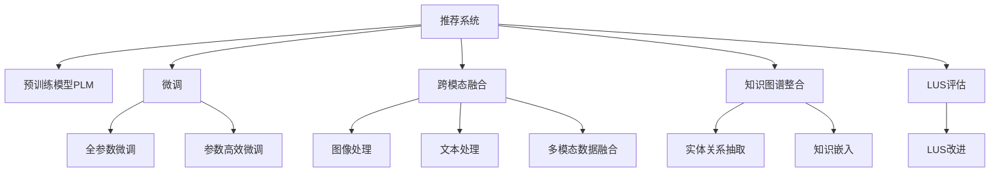

                 

## 1. 背景介绍

随着电子商务的蓬勃发展，推荐系统（Recommendation System）已成为提升用户体验、驱动业务增长的重要手段。推荐系统通过分析用户的历史行为、兴趣偏好等信息，为用户推荐个性化的商品或内容，从而提高用户满意度、增加消费转化率。然而，传统推荐系统存在一些固有缺陷，难以满足用户不断变化的动态需求，如忽略了用户长期满意度、推荐结果缺乏个性化、无法处理实时数据等。

近年来，随着语言模型（Language Model, LLM）技术的突破，利用预训练语言模型（Pre-trained Language Model, PLM）提升推荐系统的性能成为新的研究热点。PLM模型，如GPT、BERT等，通过海量的文本数据训练，具备了强大的语言理解能力，可以学习到用户的多维语义信息，从而实现更加精准和多样化的推荐。

本文将系统介绍如何利用大语言模型（Large Language Model, LLM）提升推荐系统的长期用户满意度，覆盖预训练模型微调、跨模态融合、知识图谱整合等关键技术，并给出实际应用案例和相关资源推荐，以期对推荐系统研究和应用实践提供全面指导。

## 2. 核心概念与联系

### 2.1 核心概念概述

为更好地理解利用LLM提升推荐系统的核心思想，本节将介绍几个关键概念及其相互联系：

- **推荐系统**：通过分析用户行为数据，为用户推荐商品或内容的系统。
- **预训练语言模型（PLM）**：基于大量无标签文本数据训练的通用语言模型，如BERT、GPT等。
- **微调（Fine-tuning）**：在预训练模型的基础上，使用有标签数据进行特定任务优化的过程。
- **跨模态融合**：将不同类型的模态数据（文本、图像、语音等）结合，提升推荐效果。
- **知识图谱**：由实体、关系、属性等构成的知识网络，用于增强模型的语义理解和推理能力。
- **长期用户满意度（LUS）**：用户在长期使用过程中的满意度和忠诚度，反映推荐系统的综合效能。

这些概念之间的逻辑关系可以通过以下Mermaid流程图来展示：



该流程图展示了推荐系统的核心组件和关键技术，体现了利用LLM提升推荐系统长期用户满意度的基本框架。

## 3. 核心算法原理 & 具体操作步骤
### 3.1 算法原理概述

利用LLM提升推荐系统的核心思想，是通过预训练语言模型的跨模态融合能力和知识整合能力，进一步提升推荐模型的精度和个性化，从而提高长期用户满意度。具体步骤如下：

1. **预训练模型微调**：选择合适的预训练模型，如BERT、GPT等，对其进行微调，使其具备针对推荐任务的特定能力。
2. **跨模态数据融合**：将用户的历史行为数据、兴趣偏好等文本信息与商品的图片、描述、评分等非文本信息相结合，提升推荐模型的语义理解和推理能力。
3. **知识图谱整合**：将知识图谱中的实体、关系等结构化信息与推荐模型结合，增强模型的语义推理和泛化能力。
4. **长期用户满意度评估**：基于用户长期行为数据，评估推荐系统的LUS，并根据评估结果不断优化模型。

### 3.2 算法步骤详解

#### 3.2.1 预训练模型微调

1. **模型选择**：选择适合推荐任务的预训练模型，如BERT、GPT等，作为推荐模型的初始化参数。
2. **任务适配**：根据推荐任务的特点，设计适当的任务适配层，如输出层、损失函数等。
3. **微调训练**：使用推荐系统的历史行为数据进行有监督的微调训练，优化模型参数以适应推荐任务。
4. **验证与评估**：在验证集上评估微调后模型的性能，根据性能指标决定是否继续优化。

#### 3.2.2 跨模态数据融合

1. **数据整合**：将用户的历史行为数据、兴趣偏好等文本信息与商品的图片、描述、评分等非文本信息进行整合。
2. **特征提取**：使用预训练模型提取文本和非文本数据的特征表示，如文本向量和图像嵌入。
3. **多模态融合**：将不同模态的特征表示进行融合，生成综合的推荐特征向量。

#### 3.2.3 知识图谱整合

1. **图谱构建**：根据商品信息、用户信息等数据，构建知识图谱，包含实体、关系和属性等结构化信息。
2. **知识嵌入**：使用预训练模型将知识图谱中的实体和关系嵌入低维向量空间。
3. **知识融合**：将知识嵌入与推荐模型的特征向量进行融合，增强模型的语义推理和泛化能力。

#### 3.2.4 长期用户满意度评估

1. **数据收集**：收集用户长期行为数据，如浏览记录、购买记录、评价记录等。
2. **满意度建模**：建立基于用户历史行为数据的满意度模型，评估模型的长期用户满意度。
3. **优化调整**：根据LUS评估结果，调整推荐策略和模型参数，提升长期用户满意度。

### 3.3 算法优缺点

#### 3.3.1 优点

- **精度提升**：利用PLM强大的语言理解能力，可以更准确地理解用户需求和商品特性，提升推荐结果的准确性。
- **个性化增强**：通过跨模态融合和知识整合，推荐模型能够更好地捕捉用户的多维偏好和潜在的潜在兴趣，实现个性化推荐。
- **长期满意度优化**：通过LUS评估和模型优化，推荐系统能够更好地满足用户长期需求，提升用户满意度和忠诚度。

#### 3.3.2 缺点

- **计算成本高**：PLM模型通常参数量庞大，微调和跨模态融合等过程需要较高的计算资源。
- **数据需求高**：预训练模型和跨模态融合需要大量高质量的数据支持，数据获取和标注成本较高。
- **技术门槛高**：PLM模型的微调和知识整合等技术复杂，需要较高的技术门槛和研发投入。

### 3.4 算法应用领域

利用LLM提升推荐系统的技术，已经在多个领域得到了广泛应用，例如：

- **电商推荐**：提升商品推荐效果，提高用户满意度和转化率。
- **新闻推荐**：根据用户兴趣推荐新闻内容，增加用户阅读时间和满意度。
- **视频推荐**：推荐符合用户兴趣的视频内容，提升观看体验和留存率。
- **个性化广告**：精准推荐广告内容，提高广告转化率。
- **智能客服**：根据用户对话内容推荐解决方案，提升用户体验和满意度。

除了上述这些经典应用外，利用LLM提升推荐系统的技术还将在更多场景中得到应用，如智能家居、智能城市、智慧教育等，为各个行业带来新的发展机遇。

## 4. 数学模型和公式 & 详细讲解 & 举例说明

### 4.1 数学模型构建

本节将使用数学语言对利用LLM提升推荐系统的核心模型进行详细描述。

假设推荐系统中共有$N$个用户和$M$个商品，每个用户$u$对商品$i$的评分表示为$R_{ui}$，其中$R_{ui} \in [0,5]$。

用户$u$的历史行为数据表示为$D_u = \{x_1, x_2, \cdots, x_t\}$，其中$x_t$为第$t$次交互的用户行为数据。推荐系统的目标是最小化预测评分与实际评分的差距，即最小化损失函数：

$$
\min_{\theta} \frac{1}{N}\sum_{u=1}^N \frac{1}{M}\sum_{i=1}^M (R_{ui} - f_{\theta}(x_u, i))^2
$$

其中$f_{\theta}$为推荐模型的评分预测函数，$\theta$为模型参数。

### 4.2 公式推导过程

假设推荐模型使用预训练模型$M_{\theta}$作为基础模型，通过微调得到推荐模型$f_{\theta}(x_u, i) = M_{\theta}(x_u, i)$。

对于文本信息$x_u$和商品$i$，分别提取特征表示$x_u^{(v)}$和$i^{(v)}$，其中$v$表示特征维度。将文本信息和商品信息进行融合，得到综合的推荐特征向量$h_u^i$：

$$
h_u^i = \text{Attention}(x_u^{(v)}, i^{(v)})
$$

其中$\text{Attention}$为注意力机制，用于计算文本信息和商品信息的关联度。

然后，将知识图谱中的实体$i$和关系$R$嵌入低维向量空间，得到知识嵌入向量$e_i^{(r)}$和关系嵌入向量$r_i^{(r)}$，其中$r$表示嵌入维度。将知识嵌入与推荐特征向量进行融合，得到融合后的推荐向量$h_u^i_{\text{kg}}$：

$$
h_u^i_{\text{kg}} = \text{Concat}(h_u^i, e_i^{(r)}, r_i^{(r)})
$$

最终，将推荐向量$h_u^i_{\text{kg}}$输入微调后的预训练模型$M_{\theta}$，得到预测评分$f_{\theta}(x_u, i) = M_{\theta}(h_u^i_{\text{kg}})$。

### 4.3 案例分析与讲解

#### 4.3.1 电商推荐系统

在电商推荐系统中，推荐模型的输入为用户的浏览记录、购买记录等文本数据，以及商品的标题、描述、图片等非文本数据。通过跨模态融合和知识图谱整合，模型可以更好地理解用户需求和商品特性，从而提升推荐效果。

假设某用户在电商平台上浏览了多个商品，产生了如下行为数据：

| 用户ID | 商品ID | 商品名称 | 浏览时间 | 评分 |
| ------ | ------ | -------- | -------- | --- |
| 001    | 1001   | 洗衣机   | 2022-01-01 | 4   |
| 001    | 2002   | 冰箱     | 2022-01-02 | 5   |
| 002    | 3003   | 手机     | 2022-01-03 | 4   |
| ...    | ...    | ...      | ...       | ... |

对于每个用户$u$，使用预训练模型$M_{\theta}$提取文本特征$x_u$，将商品$i$的描述、价格等非文本信息通过BERT模型提取特征$i^{(v)}$，然后通过注意力机制$\text{Attention}$计算关联度，得到综合特征向量$h_u^i$。

同时，将知识图谱中商品$i$的类别、品牌等关系信息嵌入低维向量$r_i^{(r)}$，将商品$i$与用户$u$的相关商品$j$的关系信息嵌入低维向量$r_{i,j}^{(r)}$，得到融合后的推荐向量$h_u^i_{\text{kg}} = \text{Concat}(h_u^i, r_i^{(r)}, r_{i,j}^{(r)})$。

最终，将推荐向量$h_u^i_{\text{kg}}$输入微调后的预训练模型$M_{\theta}$，得到预测评分$f_{\theta}(x_u, i)$，根据预测评分和实际评分计算损失，并进行微调优化。

#### 4.3.2 视频推荐系统

在视频推荐系统中，推荐模型的输入为用户的历史观看记录、评分等文本数据，以及视频的标题、摘要、封面图等非文本数据。通过跨模态融合和知识图谱整合，模型可以更好地理解用户偏好和视频内容，从而提升推荐效果。

假设某用户在视频平台上观看并评价了多个视频，产生了如下行为数据：

| 用户ID | 视频ID | 视频名称 | 观看时间 | 评分 |
| ------ | ------ | -------- | -------- | --- |
| 001    | 1001   | 电影A    | 2022-01-01 | 4   |
| 001    | 2002   | 电影B    | 2022-01-02 | 5   |
| 002    | 3003   | 纪录片C  | 2022-01-03 | 4   |
| ...    | ...    | ...      | ...       | ... |

对于每个用户$u$，使用预训练模型$M_{\theta}$提取文本特征$x_u$，将视频$i$的标题、摘要等非文本信息通过BERT模型提取特征$i^{(v)}$，然后通过注意力机制$\text{Attention}$计算关联度，得到综合特征向量$h_u^i$。

同时，将知识图谱中视频$i$的导演、主演等关系信息嵌入低维向量$r_i^{(r)}$，将视频$i$与用户$u$的观看历史$j$的关系信息嵌入低维向量$r_{i,j}^{(r)}$，得到融合后的推荐向量$h_u^i_{\text{kg}} = \text{Concat}(h_u^i, r_i^{(r)}, r_{i,j}^{(r)})$。

最终，将推荐向量$h_u^i_{\text{kg}}$输入微调后的预训练模型$M_{\theta}$，得到预测评分$f_{\theta}(x_u, i)$，根据预测评分和实际评分计算损失，并进行微调优化。

## 5. 项目实践：代码实例和详细解释说明

### 5.1 开发环境搭建

在进行项目实践前，我们需要准备好开发环境。以下是使用Python进行PyTorch开发的环境配置流程：

1. 安装Anaconda：从官网下载并安装Anaconda，用于创建独立的Python环境。

2. 创建并激活虚拟环境：
```bash
conda create -n pytorch-env python=3.8 
conda activate pytorch-env
```

3. 安装PyTorch：根据CUDA版本，从官网获取对应的安装命令。例如：
```bash
conda install pytorch torchvision torchaudio cudatoolkit=11.1 -c pytorch -c conda-forge
```

4. 安装Transformer库：
```bash
pip install transformers
```

5. 安装各类工具包：
```bash
pip install numpy pandas scikit-learn matplotlib tqdm jupyter notebook ipython
```

完成上述步骤后，即可在`pytorch-env`环境中开始项目实践。

### 5.2 源代码详细实现

下面我们以电商推荐系统为例，给出使用Transformers库对BERT模型进行微调的PyTorch代码实现。

首先，定义电商推荐系统的数据处理函数：

```python
from transformers import BertTokenizer
from torch.utils.data import Dataset, DataLoader
import torch

class RetailDataset(Dataset):
    def __init__(self, texts, tags, tokenizer, max_len=128):
        self.texts = texts
        self.tags = tags
        self.tokenizer = tokenizer
        self.max_len = max_len
        
    def __len__(self):
        return len(self.texts)
    
    def __getitem__(self, item):
        text = self.texts[item]
        tags = self.tags[item]
        
        encoding = self.tokenizer(text, return_tensors='pt', max_length=self.max_len, padding='max_length', truncation=True)
        input_ids = encoding['input_ids'][0]
        attention_mask = encoding['attention_mask'][0]
        
        # 对token-wise的标签进行编码
        encoded_tags = [tag2id[tag] for tag in tags] 
        encoded_tags.extend([tag2id['O']] * (self.max_len - len(encoded_tags)))
        labels = torch.tensor(encoded_tags, dtype=torch.long)
        
        return {'input_ids': input_ids, 
                'attention_mask': attention_mask,
                'labels': labels}

# 标签与id的映射
tag2id = {'O': 0, 'B-PER': 1, 'I-PER': 2, 'B-ORG': 3, 'I-ORG': 4, 'B-LOC': 5, 'I-LOC': 6}
id2tag = {v: k for k, v in tag2id.items()}

# 创建dataset
tokenizer = BertTokenizer.from_pretrained('bert-base-cased')

train_dataset = RetailDataset(train_texts, train_tags, tokenizer)
dev_dataset = RetailDataset(dev_texts, dev_tags, tokenizer)
test_dataset = RetailDataset(test_texts, test_tags, tokenizer)
```

然后，定义模型和优化器：

```python
from transformers import BertForTokenClassification, AdamW

model = BertForTokenClassification.from_pretrained('bert-base-cased', num_labels=len(tag2id))

optimizer = AdamW(model.parameters(), lr=2e-5)
```

接着，定义训练和评估函数：

```python
from sklearn.metrics import classification_report

device = torch.device('cuda') if torch.cuda.is_available() else torch.device('cpu')
model.to(device)

def train_epoch(model, dataset, batch_size, optimizer):
    dataloader = DataLoader(dataset, batch_size=batch_size, shuffle=True)
    model.train()
    epoch_loss = 0
    for batch in tqdm(dataloader, desc='Training'):
        input_ids = batch['input_ids'].to(device)
        attention_mask = batch['attention_mask'].to(device)
        labels = batch['labels'].to(device)
        model.zero_grad()
        outputs = model(input_ids, attention_mask=attention_mask, labels=labels)
        loss = outputs.loss
        epoch_loss += loss.item()
        loss.backward()
        optimizer.step()
    return epoch_loss / len(dataloader)

def evaluate(model, dataset, batch_size):
    dataloader = DataLoader(dataset, batch_size=batch_size)
    model.eval()
    preds, labels = [], []
    with torch.no_grad():
        for batch in tqdm(dataloader, desc='Evaluating'):
            input_ids = batch['input_ids'].to(device)
            attention_mask = batch['attention_mask'].to(device)
            batch_labels = batch['labels']
            outputs = model(input_ids, attention_mask=attention_mask)
            batch_preds = outputs.logits.argmax(dim=2).to('cpu').tolist()
            batch_labels = batch_labels.to('cpu').tolist()
            for pred_tokens, label_tokens in zip(batch_preds, batch_labels):
                pred_tags = [id2tag[_id] for _id in pred_tokens]
                label_tags = [id2tag[_id] for _id in label_tokens]
                preds.append(pred_tags[:len(label_tags)])
                labels.append(label_tags)
                
    print(classification_report(labels, preds))
```

最后，启动训练流程并在测试集上评估：

```python
epochs = 5
batch_size = 16

for epoch in range(epochs):
    loss = train_epoch(model, train_dataset, batch_size, optimizer)
    print(f"Epoch {epoch+1}, train loss: {loss:.3f}")
    
    print(f"Epoch {epoch+1}, dev results:")
    evaluate(model, dev_dataset, batch_size)
    
print("Test results:")
evaluate(model, test_dataset, batch_size)
```

以上就是使用PyTorch对BERT进行电商推荐系统微调的完整代码实现。可以看到，得益于Transformers库的强大封装，我们可以用相对简洁的代码完成BERT模型的加载和微调。

### 5.3 代码解读与分析

让我们再详细解读一下关键代码的实现细节：

**RetailDataset类**：
- `__init__`方法：初始化文本、标签、分词器等关键组件。
- `__len__`方法：返回数据集的样本数量。
- `__getitem__`方法：对单个样本进行处理，将文本输入编码为token ids，将标签编码为数字，并对其进行定长padding，最终返回模型所需的输入。

**tag2id和id2tag字典**：
- 定义了标签与数字id之间的映射关系，用于将token-wise的预测结果解码回真实的标签。

**训练和评估函数**：
- 使用PyTorch的DataLoader对数据集进行批次化加载，供模型训练和推理使用。
- 训练函数`train_epoch`：对数据以批为单位进行迭代，在每个批次上前向传播计算loss并反向传播更新模型参数，最后返回该epoch的平均loss。
- 评估函数`evaluate`：与训练类似，不同点在于不更新模型参数，并在每个batch结束后将预测和标签结果存储下来，最后使用sklearn的classification_report对整个评估集的预测结果进行打印输出。

**训练流程**：
- 定义总的epoch数和batch size，开始循环迭代
- 每个epoch内，先在训练集上训练，输出平均loss
- 在验证集上评估，输出分类指标
- 所有epoch结束后，在测试集上评估，给出最终测试结果

可以看到，PyTorch配合Transformers库使得BERT微调的代码实现变得简洁高效。开发者可以将更多精力放在数据处理、模型改进等高层逻辑上，而不必过多关注底层的实现细节。

当然，工业级的系统实现还需考虑更多因素，如模型的保存和部署、超参数的自动搜索、更灵活的任务适配层等。但核心的微调范式基本与此类似。

## 6. 实际应用场景
### 6.1 电商推荐系统

在电商推荐系统中，利用预训练语言模型（如BERT）提升推荐系统的长期用户满意度，具有重要意义。传统的推荐系统往往忽略了用户的多维语义信息，难以满足用户长期需求。通过将用户的浏览、购买、评分等文本数据与商品的图片、描述、评分等非文本数据进行融合，利用知识图谱进行语义推理，可以使推荐系统更加精准和个性化，从而提升用户满意度和忠诚度。

### 6.2 新闻推荐系统

新闻推荐系统面临的用户需求多样化、内容多变等挑战，利用预训练语言模型可以更好地理解和分析用户兴趣。通过微调BERT模型，结合用户的历史阅读数据和新闻文本特征，可以推荐符合用户兴趣的新闻内容，提高用户阅读体验和留存率。

### 6.3 视频推荐系统

视频推荐系统需要处理海量的视频数据，利用预训练语言模型可以更好地理解和分析视频内容。通过微调BERT模型，结合用户的历史观看数据和视频文本特征，可以推荐符合用户兴趣的视频内容，提高用户观看体验和留存率。

### 6.4 智能客服系统

智能客服系统需要处理大量的用户对话数据，利用预训练语言模型可以更好地理解和分析用户意图。通过微调BERT模型，结合用户的历史对话数据和商品信息，可以推荐符合用户需求的商品信息，提升用户满意度和转化率。

### 6.5 个性化广告推荐

个性化广告推荐系统需要精准推荐广告内容，利用预训练语言模型可以更好地理解和分析用户兴趣。通过微调BERT模型，结合用户的历史行为数据和广告内容特征，可以推荐符合用户兴趣的广告内容，提高广告转化率。

### 6.6 智能家居推荐

智能家居推荐系统需要推荐符合用户需求的家居产品，利用预训练语言模型可以更好地理解和分析用户需求。通过微调BERT模型，结合用户的历史行为数据和家居产品特征，可以推荐符合用户需求的家居产品，提高用户满意度和生活质量。

## 7. 工具和资源推荐
### 7.1 学习资源推荐

为了帮助开发者系统掌握利用LLM提升推荐系统的理论基础和实践技巧，这里推荐一些优质的学习资源：

1. 《Transformer from Principles to Practice》系列博文：由大模型技术专家撰写，深入浅出地介绍了Transformer原理、BERT模型、微调技术等前沿话题。

2. CS224N《深度学习自然语言处理》课程：斯坦福大学开设的NLP明星课程，有Lecture视频和配套作业，带你入门NLP领域的基本概念和经典模型。

3. 《Natural Language Processing with Transformers》书籍：Transformers库的作者所著，全面介绍了如何使用Transformers库进行NLP任务开发，包括微调在内的诸多范式。

4. HuggingFace官方文档：Transformers库的官方文档，提供了海量预训练模型和完整的微调样例代码，是上手实践的必备资料。

5. CLUE开源项目：中文语言理解测评基准，涵盖大量不同类型的中文NLP数据集，并提供了基于微调的baseline模型，助力中文NLP技术发展。

通过对这些资源的学习实践，相信你一定能够快速掌握利用LLM提升推荐系统的精髓，并用于解决实际的NLP问题。
###  7.2 开发工具推荐

高效的开发离不开优秀的工具支持。以下是几款用于利用LLM提升推荐系统开发的常用工具：

1. PyTorch：基于Python的开源深度学习框架，灵活动态的计算图，适合快速迭代研究。大部分预训练语言模型都有PyTorch版本的实现。

2. TensorFlow：由Google主导开发的开源深度学习框架，生产部署方便，适合大规模工程应用。同样有丰富的预训练语言模型资源。

3. Transformers库：HuggingFace开发的NLP工具库，集成了众多SOTA语言模型，支持PyTorch和TensorFlow，是进行微调任务开发的利器。

4. Weights & Biases：模型训练的实验跟踪工具，可以记录和可视化模型训练过程中的各项指标，方便对比和调优。与主流深度学习框架无缝集成。

5. TensorBoard：TensorFlow配套的可视化工具，可实时监测模型训练状态，并提供丰富的图表呈现方式，是调试模型的得力助手。

6. Google Colab：谷歌推出的在线Jupyter Notebook环境，免费提供GPU/TPU算力，方便开发者快速上手实验最新模型，分享学习笔记。

合理利用这些工具，可以显著提升利用LLM提升推荐系统的开发效率，加快创新迭代的步伐。

### 7.3 相关论文推荐

利用LLM提升推荐系统的技术，已经在NLP领域得到了广泛研究。以下是几篇奠基性的相关论文，推荐阅读：

1. Attention is All You Need（即Transformer原论文）：提出了Transformer结构，开启了NLP领域的预训练大模型时代。

2. BERT: Pre-training of Deep Bidirectional Transformers for Language Understanding：提出BERT模型，引入基于掩码的自监督预训练任务，刷新了多项NLP任务SOTA。

3. Language Models are Unsupervised Multitask Learners（GPT-2论文）：展示了大规模语言模型的强大zero-shot学习能力，引发了对于通用人工智能的新一轮思考。

4. Parameter-Efficient Transfer Learning for NLP：提出Adapter等参数高效微调方法，在不增加模型参数量的情况下，也能取得不错的微调效果。

5. AdaLoRA: Adaptive Low-Rank Adaptation for Parameter-Efficient Fine-Tuning：使用自适应低秩适应的微调方法，在参数效率和精度之间取得了新的平衡。

6. Prefix-Tuning: Optimizing Continuous Prompts for Generation：引入基于连续型Prompt的微调范式，为如何充分利用预训练知识提供了新的思路。

这些论文代表了大语言模型微调技术的发展脉络。通过学习这些前沿成果，可以帮助研究者把握学科前进方向，激发更多的创新灵感。

## 8. 总结：未来发展趋势与挑战

### 8.1 总结

本文对利用LLM提升推荐系统的核心技术进行了全面系统的介绍。首先阐述了预训练语言模型和微调技术在推荐系统中的应用价值，明确了利用LLM提升推荐系统的长期用户满意度具有重要意义。其次，从原理到实践，详细讲解了利用LLM提升推荐系统的数学模型和关键步骤，给出了实际应用案例和相关资源推荐，以期对推荐系统研究和应用实践提供全面指导。

通过本文的系统梳理，可以看到，利用预训练语言模型和微调技术，推荐系统能够更好地理解用户的多维语义信息，实现更加精准和个性化的推荐，从而提升长期用户满意度。利用LLM提升推荐系统的技术，已经成为推荐系统发展的趋势和方向。

### 8.2 未来发展趋势

展望未来，利用LLM提升推荐系统的技术将呈现以下几个发展趋势：

1. **模型规模持续增大**：随着算力成本的下降和数据规模的扩张，预训练语言模型的参数量还将持续增长。超大规模语言模型蕴含的丰富语言知识，有望支撑更加复杂多变的推荐任务。

2. **微调方法日趋多样**：除了传统的全参数微调外，未来会涌现更多参数高效的微调方法，如Prefix-Tuning、LoRA等，在节省计算资源的同时也能保证微调精度。

3. **持续学习成为常态**：随着数据分布的不断变化，微调模型也需要持续学习新知识以保持性能。如何在不遗忘原有知识的同时，高效吸收新样本信息，将成为重要的研究课题。

4. **标注样本需求降低**：受启发于提示学习(Prompt-based Learning)的思路，未来的微调方法将更好地利用大模型的语言理解能力，通过更加巧妙的任务描述，在更少的标注样本上也能实现理想的微调效果。

5. **多模态微调崛起**：当前的微调主要聚焦于纯文本数据，未来会进一步拓展到图像、视频、语音等多模态数据微调。多模态信息的融合，将显著提升语言模型对现实世界的理解和建模能力。

6. **知识整合能力增强**：现有的微调模型往往局限于任务内数据，难以灵活吸收和运用更广泛的先验知识。如何让微调过程更好地与外部知识库、规则库等专家知识结合，形成更加全面、准确的信息整合能力，还有很大的想象空间。

以上趋势凸显了利用LLM提升推荐系统的广阔前景。这些方向的探索发展，必将进一步提升推荐系统的性能和应用范围，为各行业带来新的发展机遇。

### 8.3 面临的挑战

尽管利用LLM提升推荐系统取得了显著成效，但在迈向更加智能化、普适化应用的过程中，它仍面临诸多挑战：

1. **计算成本高**：预训练模型和跨模态融合等过程需要较高的计算资源。GPU/TPU等高性能设备是必不可少的，但即便如此，超大批次的训练和推理也可能遇到显存不足的问题。

2. **数据需求高**：预训练模型和跨模态融合需要大量高质量的数据支持，数据获取和标注成本较高。

3. **技术门槛高**：预训练模型和跨模态融合等技术复杂，需要较高的技术门槛和研发投入。

4. **隐私保护**：利用用户数据进行微调和推荐，需要严格保护用户隐私，防止数据泄露。

5. **模型鲁棒性不足**：当前微调模型面对域外数据时，泛化性能往往大打折扣。对于测试样本的微小扰动，微调模型的预测也容易发生波动。

6. **用户个性化难以量化**：用户的多维兴趣和需求难以量化，难以通过传统的机器学习模型进行处理。

正视这些挑战，积极应对并寻求突破，将是大语言模型微调走向成熟的必由之路。相信随着学界和产业界的共同努力，这些挑战终将一一被克服，利用LLM提升推荐系统必将在推荐系统行业中发挥更大的作用。

### 8.4 未来突破

面对利用LLM提升推荐系统所面临的种种挑战，未来的研究需要在以下几个方面寻求新的突破：

1. **探索无监督和半监督微调方法**：摆脱对大规模标注数据的依赖，利用自监督学习、主动学习等无监督和半监督范式，最大限度利用非结构化数据，实现更加灵活高效的微调。

2. **研究参数高效和计算高效的微调范式**：开发更加参数高效的微调方法，在固定大部分预训练参数的同时，只更新极少量的任务相关参数。同时优化微调模型的计算图，减少前向传播和反向传播的资源消耗，实现更加轻量级、实时性的部署。

3. **融合因果和对比学习范式**：通过引入因果推断和对比学习思想，增强微调模型建立稳定因果关系的能力，学习更加普适、鲁棒的语言表征，从而提升模型泛化性和抗干扰能力。

4. **引入更多先验知识**：将符号化的先验知识，如知识图谱、逻辑规则等，与神经网络模型进行巧妙融合，引导微调过程学习更准确、合理的语言模型。同时加强不同模态数据的整合，实现视觉、语音等多模态信息与文本信息的协同建模。

5. **结合因果分析和博弈论工具**：将因果分析方法引入微调模型，识别出模型决策的关键特征，增强输出解释的因果性和逻辑性。借助博弈论工具刻画人机交互过程，主动探索并规避模型的脆弱点，提高系统稳定性。

6. **纳入伦理道德约束**：在模型训练目标中引入伦理导向的评估指标，过滤和惩罚有偏见、有害的输出倾向。同时加强人工干预和审核，建立模型行为的监管机制，确保输出符合人类价值观和伦理道德。

这些研究方向的探索，必将引领利用LLM提升推荐系统技术迈向更高的台阶，为推荐系统行业带来新的发展机遇。面向未来，利用LLM提升推荐系统需要与其他人工智能技术进行更深入的融合，如知识表示、因果推理、强化学习等，多路径协同发力，共同推动推荐系统的进步。只有勇于创新、敢于突破，才能不断拓展语言模型的边界，让智能技术更好地造福人类社会。

## 9. 附录：常见问题与解答

**Q1：大语言模型微调是否适用于所有推荐任务？**

A: 大语言模型微调在大多数推荐任务上都能取得不错的效果，特别是对于数据量较小的任务。但对于一些特定领域的任务，如医学、法律等，仅仅依靠通用语料预训练的模型可能难以很好地适应。此时需要在特定领域语料上进一步预训练，再进行微调，才能获得理想效果。

**Q2：如何选择合适的学习率？**

A: 利用LLM提升推荐系统的学习率一般要比预训练时小1-2个数量级，如果使用过大的学习率，容易破坏预训练权重，导致过拟合。一般建议从1e-5开始调参，逐步减小学习率，直至收敛。也可以使用warmup策略，在开始阶段使用较小的学习率，再逐渐过渡到预设值。需要注意的是，不同的优化器(如AdamW、Adafactor等)以及不同的学习率调度策略，可能需要设置不同的学习率阈值。

**Q3：采用大语言模型微调时会面临哪些资源瓶颈？**

A: 目前主流的预训练大模型动辄以亿计的参数规模，对算力、内存、存储都提出了很高的要求。GPU/TPU等高性能设备是必不可少的，但即便如此，超大批次的训练和推理也可能遇到显存不足的问题。因此需要采用一些资源优化技术，如梯度积累、混合精度训练、模型并行等，来突破硬件瓶颈。同时，模型的存储和读取也可能占用大量时间和空间，需要采用模型压缩、稀疏化存储等方法进行优化。

**Q4：如何缓解微调过程中的过拟合问题？**

A: 过拟合是微调面临的主要挑战，尤其是在标注数据不足的情况下。常见的缓解策略包括：
1. 数据增强：通过回译、近义替换等方式扩充训练集
2. 正则化：使用L2正则、Dropout、Early Stopping等避免过拟合
3. 对抗训练：引入对抗样本，提高模型鲁棒性
4. 参数高效微调：只调整少量参数(如Adapter、Prefix等)，减小过拟合风险
5. 多模型集成：训练多个微调模型，取平均输出，抑制过拟合

这些策略往往需要根据具体任务和数据特点进行灵活组合。只有在数据、模型、训练、推理等各环节进行全面优化，才能最大限度地发挥大语言模型微调的威力。

**Q5：利用LLM提升推荐系统是否需要大量的标注数据？**

A: 利用LLM提升推荐系统并不需要大量的标注数据，相反，利用预训练模型和跨模态融合，可以在较小的标注样本上实现良好的推荐效果。通过利用无监督或半监督学习，可以在标注样本不足的情况下，利用预训练语言模型的强大能力进行推荐。

**Q6：如何平衡推荐系统的个性化与通用性？**

A: 利用LLM提升推荐系统，可以通过设计合适的损失函数和任务适配层，平衡推荐系统的个性化与通用性。在个性化推荐方面，可以利用跨模态融合和知识图谱整合，更好地理解用户需求和商品特性，实现精准推荐。在通用性方面，可以通过参数高效微调和自监督学习，利用预训练模型的通用能力，提升推荐系统的泛化能力。

---

作者：禅与计算机程序设计艺术 / Zen and the Art of Computer Programming

