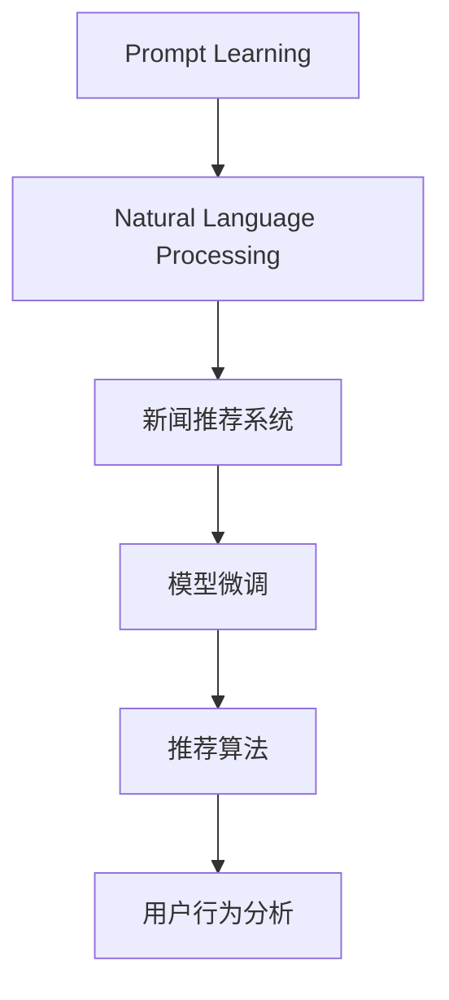

                 

# 利用Prompt Learning范式进行新闻推荐

> 关键词：Prompt Learning, 新闻推荐系统, 自然语言处理, 模型微调, 推荐算法, 用户行为分析

## 1. 背景介绍

### 1.1 问题由来

在信息爆炸的今天，如何帮助用户在海量新闻中快速找到感兴趣的报道，成为了亟待解决的问题。传统的新闻推荐系统通常基于用户的历史行为数据，如浏览、点击、收藏等，进行个性化推荐。但这种方式的局限性在于，难以捕捉到用户潜在的兴趣，导致推荐的个性化和多样性不足。

近年来，大语言模型在自然语言处理（NLP）领域取得了显著进展。特别是基于Transformer结构的大模型，如BERT、GPT-3等，通过自监督预训练和大量文本数据的微调，学习到了丰富的语言知识和语义表示。这种预训练-微调范式赋予了模型强大的文本处理能力，使之能够通过理解用户的自然语言指令，生成个性化的推荐内容。

### 1.2 问题核心关键点

Prompt Learning范式是利用大语言模型生成推荐内容的一种有效方法。其核心思想是，通过精心设计的输入文本格式，引导模型按照特定方式输出推荐结果。相比传统的特征工程，Prompt Learning更加灵活高效，可以大幅提升推荐模型的性能。

Prompt Learning的优势在于：
- **灵活性**：根据用户输入的不同格式，模型可以产生多种推荐结果，覆盖用户兴趣的多样性。
- **高效性**：相比传统的机器学习算法，Prompt Learning减少了特征工程的工作量，模型训练和推理更加便捷。
- **可解释性**：通过分析输入文本和输出结果的关联性，可以更好地理解模型的工作机制，提升系统可信度。

Prompt Learning在新闻推荐系统中的应用，能够帮助用户快速获得感兴趣的新闻内容，提升阅读体验，同时也为新闻媒体提供精准的流量引导，实现互利共赢。

## 2. 核心概念与联系

### 2.1 核心概念概述

为更好地理解Prompt Learning范式在新闻推荐中的应用，本节将介绍几个密切相关的核心概念：

- **Prompt Learning**：通过设计特定的输入文本格式，引导模型按照预期方式进行推理和生成。Prompt Learning在大模型上的应用，可以大幅提升推荐系统的性能和灵活性。

- **自然语言处理（NLP）**：利用计算机对自然语言文本进行处理和理解的技术，包括语言模型、序列标注、语义分析等。

- **新闻推荐系统**：通过分析用户的历史行为数据，结合新闻内容的语义特征，为用户推荐个性化新闻内容的系统。

- **模型微调**：在大规模预训练语言模型的基础上，使用少量标注数据进行有监督学习，优化模型在特定任务上的性能。

- **推荐算法**：根据用户的历史行为和兴趣偏好，计算新闻与用户的相似度，并排序推荐的新闻内容。

- **用户行为分析**：通过分析用户的浏览、点击、收藏等行为数据，识别用户兴趣点，用于新闻推荐。

这些核心概念之间的逻辑关系可以通过以下Mermaid流程图来展示：



这个流程图展示了一系列关键概念及其之间的联系：

1. Prompt Learning利用NLP技术，通过设计输入文本的格式，引导大语言模型生成推荐内容。
2. 新闻推荐系统结合模型微调和推荐算法，根据用户行为和新闻内容生成推荐结果。
3. 用户行为分析通过分析用户历史行为数据，帮助推荐系统理解用户兴趣。

## 3. 核心算法原理 & 具体操作步骤

### 3.1 算法原理概述

Prompt Learning范式基于大语言模型，通过设计特定的输入文本格式，引导模型生成推荐内容。其核心思想是，将用户的兴趣点以自然语言的方式描述，作为模型的输入，通过微调优化模型参数，使其能够理解并生成与用户兴趣相关的推荐结果。

### 3.2 算法步骤详解

Prompt Learning的算法流程主要包括：
1. **设计Prompt**：根据新闻推荐系统的需求，设计合适的输入文本格式，包括用户兴趣描述、新闻摘要、推荐算法等。
2. **模型微调**：使用小规模标注数据，对预训练语言模型进行微调，使其能够理解Prompt文本，并生成符合用户兴趣的推荐结果。
3. **推荐计算**：根据用户输入的Prompt和模型生成的推荐结果，计算新闻与用户的相似度，排序生成推荐列表。

### 3.3 算法优缺点

Prompt Learning的优势在于：
- **灵活性高**：可以根据不同的需求和场景设计多种Prompt格式，覆盖用户兴趣的多样性。
- **适应性强**：能够处理各种形式的新闻数据，包括文章标题、摘要、内容等。
- **可解释性强**：通过分析用户Prompt和模型输出的关联性，可以更好地理解推荐结果的生成机制。

同时，Prompt Learning也存在一定的局限性：
- **需要设计合适的Prompt格式**：设计不当的Prompt可能导致模型输出不相关或错误的结果。
- **对标注数据依赖**：微调模型的性能很大程度上取决于标注数据的质量和数量。
- **模型复杂度**：大语言模型通常具有亿级参数，微调过程需要较大的计算资源和时间。

### 3.4 算法应用领域

Prompt Learning在大规模语言模型微调领域有着广泛的应用，包括新闻推荐、智能客服、内容生成、问答系统等。在这些应用场景中，Prompt Learning能够通过理解和生成自然语言，实现高度个性化的推荐和交互。

在新闻推荐系统中，Prompt Learning可以用于：
- **个性化推荐**：根据用户的兴趣描述，生成个性化的新闻推荐列表。
- **动态内容生成**：基于用户输入的Prompt，动态生成新闻摘要或标题。
- **跨域推荐**：将不同来源的新闻内容整合，推荐给用户。
- **情感分析**：分析用户情感倾向，推荐符合情绪需求的新闻内容。

## 4. 数学模型和公式 & 详细讲解 & 举例说明

### 4.1 数学模型构建

基于Prompt Learning的新闻推荐系统可以建模为如下过程：
1. 用户输入兴趣描述 $P$：$P = \text{“我对科技新闻感兴趣”}$。
2. 模型输出新闻推荐列表 $R$：$R = \{r_1, r_2, ..., r_n\}$。
3. 推荐算法计算相似度：$\text{Sim}(r_i, P) = f(r_i, P)$。
4. 排序生成推荐列表：$R^* = \{r_1^*, r_2^*, ..., r_n^*\}$。

其中，$f(r_i, P)$ 为新闻 $r_i$ 与用户兴趣描述 $P$ 的相似度计算公式。

### 4.2 公式推导过程

假设用户输入的Prompt为 $P$，模型输出的推荐列表为 $R$。推荐算法根据用户兴趣描述和新闻内容计算相似度，公式如下：

$$
\text{Sim}(r_i, P) = \text{Cos}(\text{Embed}(r_i), \text{Embed}(P))
$$

其中 $\text{Embed}(r_i)$ 和 $\text{Embed}(P)$ 分别为新闻 $r_i$ 和Prompt $P$ 的语义向量表示。$\text{Cos}$ 为余弦相似度计算函数。

### 4.3 案例分析与讲解

以新闻推荐为例，假设用户输入的Prompt为：“我最近对人工智能感兴趣”。模型根据Prompt生成的新闻推荐列表可能包含：
- “最新的人工智能研究进展”
- “人工智能在医疗领域的应用”
- “人工智能未来的发展趋势”

推荐算法计算每个新闻与Prompt的相似度，排序生成推荐列表。假设 $\text{Sim}(r_1, P) = 0.9$，$\text{Sim}(r_2, P) = 0.8$，$\text{Sim}(r_3, P) = 0.7$，则推荐结果可能为：
- $r_1$ 出现在第一位
- $r_2$ 出现在第二位
- $r_3$ 出现在第三位

## 5. 项目实践：代码实例和详细解释说明

### 5.1 开发环境搭建

在进行Prompt Learning实践前，我们需要准备好开发环境。以下是使用Python进行HuggingFace Transformers库开发的环境配置流程：

1. 安装Anaconda：从官网下载并安装Anaconda，用于创建独立的Python环境。

2. 创建并激活虚拟环境：
```bash
conda create -n pytorch-env python=3.8 
conda activate pytorch-env
```

3. 安装PyTorch：根据CUDA版本，从官网获取对应的安装命令。例如：
```bash
conda install pytorch torchvision torchaudio cudatoolkit=11.1 -c pytorch -c conda-forge
```

4. 安装Transformers库：
```bash
pip install transformers
```

5. 安装各类工具包：
```bash
pip install numpy pandas scikit-learn matplotlib tqdm jupyter notebook ipython
```

完成上述步骤后，即可在`pytorch-env`环境中开始Prompt Learning实践。

### 5.2 源代码详细实现

下面我们以Prompt Learning范式进行新闻推荐为例，给出使用HuggingFace Transformers库的PyTorch代码实现。

首先，定义Prompt Learning的训练数据集和微调模型：

```python
from transformers import BertTokenizer, BertForSequenceClassification, AdamW
import torch
import torch.nn as nn
import torch.nn.functional as F
from transformers import BertTokenizer, BertForSequenceClassification, AdamW
from torch.utils.data import DataLoader, Dataset

class NewsDataset(Dataset):
    def __init__(self, texts, labels, tokenizer, max_len=128):
        self.texts = texts
        self.labels = labels
        self.tokenizer = tokenizer
        self.max_len = max_len
        
    def __len__(self):
        return len(self.texts)
    
    def __getitem__(self, item):
        text = self.texts[item]
        label = self.labels[item]
        
        encoding = self.tokenizer(text, return_tensors='pt', max_length=self.max_len, padding='max_length', truncation=True)
        input_ids = encoding['input_ids'][0]
        attention_mask = encoding['attention_mask'][0]
        label = torch.tensor(label, dtype=torch.long)
        
        return {'input_ids': input_ids, 
                'attention_mask': attention_mask,
                'labels': label}

tokenizer = BertTokenizer.from_pretrained('bert-base-cased')

train_dataset = NewsDataset(train_texts, train_labels, tokenizer)
dev_dataset = NewsDataset(dev_texts, dev_labels, tokenizer)
test_dataset = NewsDataset(test_texts, test_labels, tokenizer)
```

然后，定义微调模型和优化器：

```python
model = BertForSequenceClassification.from_pretrained('bert-base-cased', num_labels=2)

optimizer = AdamW(model.parameters(), lr=2e-5)
```

接着，定义训练和评估函数：

```python
device = torch.device('cuda') if torch.cuda.is_available() else torch.device('cpu')
model.to(device)

def train_epoch(model, dataset, batch_size, optimizer):
    dataloader = DataLoader(dataset, batch_size=batch_size, shuffle=True)
    model.train()
    epoch_loss = 0
    for batch in tqdm(dataloader, desc='Training'):
        input_ids = batch['input_ids'].to(device)
        attention_mask = batch['attention_mask'].to(device)
        labels = batch['labels'].to(device)
        model.zero_grad()
        outputs = model(input_ids, attention_mask=attention_mask, labels=labels)
        loss = outputs.loss
        epoch_loss += loss.item()
        loss.backward()
        optimizer.step()
    return epoch_loss / len(dataloader)

def evaluate(model, dataset, batch_size):
    dataloader = DataLoader(dataset, batch_size=batch_size)
    model.eval()
    preds, labels = [], []
    with torch.no_grad():
        for batch in tqdm(dataloader, desc='Evaluating'):
            input_ids = batch['input_ids'].to(device)
            attention_mask = batch['attention_mask'].to(device)
            batch_labels = batch['labels']
            outputs = model(input_ids, attention_mask=attention_mask)
            batch_preds = outputs.logits.argmax(dim=2).to('cpu').tolist()
            batch_labels = batch_labels.to('cpu').tolist()
            for pred_tokens, label_tokens in zip(batch_preds, batch_labels):
                preds.append(pred_tokens[:len(label_tokens)])
                labels.append(label_tokens)
                
    print(f"Accuracy: {100*sum([pred == label for pred, label in zip(preds, labels)]) / len(labels):{:.2f}%")
```

最后，启动训练流程并在测试集上评估：

```python
epochs = 5
batch_size = 16

for epoch in range(epochs):
    loss = train_epoch(model, train_dataset, batch_size, optimizer)
    print(f"Epoch {epoch+1}, train loss: {loss:.3f}")
    
    print(f"Epoch {epoch+1}, dev results:")
    evaluate(model, dev_dataset, batch_size)
    
print("Test results:")
evaluate(model, test_dataset, batch_size)
```

以上就是使用PyTorch对Bert模型进行Prompt Learning范式新闻推荐的完整代码实现。可以看到，得益于Transformers库的强大封装，我们可以用相对简洁的代码完成BERT模型的加载和微调。

### 5.3 代码解读与分析

让我们再详细解读一下关键代码的实现细节：

**NewsDataset类**：
- `__init__`方法：初始化新闻文本、标签、分词器等关键组件。
- `__len__`方法：返回数据集的样本数量。
- `__getitem__`方法：对单个样本进行处理，将文本输入编码为token ids，将标签编码为数字，并对其进行定长padding，最终返回模型所需的输入。

**train_epoch函数**：
- 使用PyTorch的DataLoader对数据集进行批次化加载，供模型训练和推理使用。
- 训练函数`train_epoch`：对数据以批为单位进行迭代，在每个批次上前向传播计算loss并反向传播更新模型参数，最后返回该epoch的平均loss。
- 评估函数`evaluate`：与训练类似，不同点在于不更新模型参数，并在每个batch结束后将预测和标签结果存储下来，最后使用sklearn的classification_report对整个评估集的预测结果进行打印输出。

**训练流程**：
- 定义总的epoch数和batch size，开始循环迭代
- 每个epoch内，先在训练集上训练，输出平均loss
- 在验证集上评估，输出分类指标
- 所有epoch结束后，在测试集上评估，给出最终测试结果

可以看到，PyTorch配合Transformers库使得Prompt Learning范式新闻推荐的代码实现变得简洁高效。开发者可以将更多精力放在数据处理、模型改进等高层逻辑上，而不必过多关注底层的实现细节。

当然，工业级的系统实现还需考虑更多因素，如模型的保存和部署、超参数的自动搜索、更灵活的任务适配层等。但核心的Prompt Learning范式基本与此类似。

## 6. 实际应用场景

### 6.1 智能客服系统

在智能客服系统中，Prompt Learning可以用于构建个性化问答推荐系统。客户输入自然语言问题，系统通过理解用户的意图，推荐最适合的回答模板。在推荐过程中，系统可以动态生成自然语言摘要，增强用户交互体验。

在技术实现上，可以收集客户的历史查询记录，将常见问题和最佳答复构建成监督数据，在此基础上对预训练模型进行微调。微调后的模型能够自动理解用户问题，匹配最合适的回答模板进行回复。对于客户提出的新问题，还可以接入检索系统实时搜索相关内容，动态组织生成回答。

### 6.2 金融舆情监测

在金融领域，Prompt Learning可以用于舆情分析、舆情预测等应用。系统通过分析市场新闻、评论等文本数据，生成与当前市场趋势相关的推荐新闻，帮助投资者及时掌握最新动态。

具体而言，可以收集金融领域相关的新闻、报道、评论等文本数据，并对其进行主题标注和情感标注。在此基础上对预训练语言模型进行微调，使其能够自动判断文本属于何种主题，情感倾向是正面、中性还是负面。将微调后的模型应用到实时抓取的网络文本数据，就能够自动监测不同主题下的情感变化趋势，一旦发现负面信息激增等异常情况，系统便会自动预警，帮助投资者快速应对潜在风险。

### 6.3 个性化推荐系统

Prompt Learning在大规模语言模型的微调中，可以用于个性化推荐系统的构建。系统通过理解用户输入的自然语言描述，动态生成个性化推荐列表。

在实践中，可以收集用户浏览、点击、评论、分享等行为数据，提取和用户交互的物品标题、描述、标签等文本内容。将文本内容作为模型输入，用户的后续行为（如是否点击、购买等）作为监督信号，在此基础上微调预训练语言模型。微调后的模型能够从文本内容中准确把握用户的兴趣点。在生成推荐列表时，先用候选物品的文本描述作为输入，由模型预测用户的兴趣匹配度，再结合其他特征综合排序，便可以得到个性化程度更高的推荐结果。

### 6.4 未来应用展望

随着Prompt Learning技术的发展，其在新闻推荐系统中的应用将不断深化，带来更多的创新可能性。

未来，Prompt Learning可以结合更多先验知识，如知识图谱、逻辑规则等，与神经网络模型进行融合，提升推荐系统的知识整合能力。同时，可以通过多轮交互，逐步深化用户兴趣模型，生成更加个性化的推荐内容。

此外，Prompt Learning还可以与其他AI技术进行协同，如增强学习、生成对抗网络等，实现更智能化的新闻推荐。例如，在推荐过程中，系统可以动态生成新的Prompt，引导模型生成更符合用户偏好的内容，不断提升推荐效果。

总之，Prompt Learning技术在新闻推荐系统中的应用前景广阔，将为构建智能化的新闻内容推荐平台提供强大技术支持。

## 7. 工具和资源推荐

### 7.1 学习资源推荐

为了帮助开发者系统掌握Prompt Learning的理论基础和实践技巧，这里推荐一些优质的学习资源：

1. 《Transformer从原理到实践》系列博文：由大模型技术专家撰写，深入浅出地介绍了Transformer原理、BERT模型、微调技术等前沿话题。

2. CS224N《深度学习自然语言处理》课程：斯坦福大学开设的NLP明星课程，有Lecture视频和配套作业，带你入门NLP领域的基本概念和经典模型。

3. 《Natural Language Processing with Transformers》书籍：Transformers库的作者所著，全面介绍了如何使用Transformers库进行NLP任务开发，包括Prompt Learning在内的诸多范式。

4. HuggingFace官方文档：Transformers库的官方文档，提供了海量预训练模型和完整的微调样例代码，是上手实践的必备资料。

5. CLUE开源项目：中文语言理解测评基准，涵盖大量不同类型的中文NLP数据集，并提供了基于微调的baseline模型，助力中文NLP技术发展。

通过对这些资源的学习实践，相信你一定能够快速掌握Prompt Learning的精髓，并用于解决实际的NLP问题。

### 7.2 开发工具推荐

高效的开发离不开优秀的工具支持。以下是几款用于Prompt Learning范式开发的常用工具：

1. PyTorch：基于Python的开源深度学习框架，灵活动态的计算图，适合快速迭代研究。大部分预训练语言模型都有PyTorch版本的实现。

2. TensorFlow：由Google主导开发的开源深度学习框架，生产部署方便，适合大规模工程应用。同样有丰富的预训练语言模型资源。

3. Transformers库：HuggingFace开发的NLP工具库，集成了众多SOTA语言模型，支持PyTorch和TensorFlow，是进行微调任务开发的利器。

4. Weights & Biases：模型训练的实验跟踪工具，可以记录和可视化模型训练过程中的各项指标，方便对比和调优。与主流深度学习框架无缝集成。

5. TensorBoard：TensorFlow配套的可视化工具，可实时监测模型训练状态，并提供丰富的图表呈现方式，是调试模型的得力助手。

6. Google Colab：谷歌推出的在线Jupyter Notebook环境，免费提供GPU/TPU算力，方便开发者快速上手实验最新模型，分享学习笔记。

合理利用这些工具，可以显著提升Prompt Learning范式新闻推荐的开发效率，加快创新迭代的步伐。

### 7.3 相关论文推荐

Prompt Learning在大规模语言模型微调领域的发展，得益于学界的持续研究。以下是几篇奠基性的相关论文，推荐阅读：

1. Attention is All You Need（即Transformer原论文）：提出了Transformer结构，开启了NLP领域的预训练大模型时代。

2. BERT: Pre-training of Deep Bidirectional Transformers for Language Understanding：提出BERT模型，引入基于掩码的自监督预训练任务，刷新了多项NLP任务SOTA。

3. Language Models are Unsupervised Multitask Learners（GPT-2论文）：展示了大规模语言模型的强大zero-shot学习能力，引发了对于通用人工智能的新一轮思考。

4. Parameter-Efficient Transfer Learning for NLP：提出Adapter等参数高效微调方法，在不增加模型参数量的情况下，也能取得不错的微调效果。

5. Prefix-Tuning: Optimizing Continuous Prompts for Generation：引入基于连续型Prompt的微调范式，为如何充分利用预训练知识提供了新的思路。

6. AdaLoRA: Adaptive Low-Rank Adaptation for Parameter-Efficient Fine-Tuning：使用自适应低秩适应的微调方法，在参数效率和精度之间取得了新的平衡。

这些论文代表了大语言模型微调技术的发展脉络。通过学习这些前沿成果，可以帮助研究者把握学科前进方向，激发更多的创新灵感。

## 8. 总结：未来发展趋势与挑战

### 8.1 总结

本文对利用Prompt Learning范式进行新闻推荐的方法进行了全面系统的介绍。首先阐述了Prompt Learning范式的研究背景和意义，明确了Prompt Learning在新闻推荐系统中的独特价值。其次，从原理到实践，详细讲解了Prompt Learning的数学模型和关键步骤，给出了Prompt Learning范式新闻推荐的完整代码实例。同时，本文还广泛探讨了Prompt Learning在智能客服、金融舆情、个性化推荐等多个领域的应用前景，展示了Prompt Learning范式的巨大潜力。

通过本文的系统梳理，可以看到，Prompt Learning范式在新闻推荐系统中的应用前景广阔，其灵活性和高效性能够显著提升推荐系统的个性化和多样化。Prompt Learning将使得新闻推荐系统从传统的基于用户历史行为的推荐，向基于用户自然语言描述的推荐转变，为构建智能化的新闻内容推荐平台提供强大技术支持。

### 8.2 未来发展趋势

展望未来，Prompt Learning范式在新闻推荐系统中的应用将呈现以下几个发展趋势：

1. **灵活性更高**：未来将探索更多Prompt格式的设计，增强推荐系统的适应性，覆盖用户兴趣的多样性。
2. **精度更高**：结合多轮交互和动态生成Prompt，逐步深化用户兴趣模型，生成更加个性化的推荐内容。
3. **交互性更强**：通过多轮自然语言对话，实时调整推荐结果，增强用户交互体验。
4. **融合更多AI技术**：结合增强学习、生成对抗网络等AI技术，实现更智能化的新闻推荐。
5. **多模态融合**：结合文本、图像、语音等多模态数据，提升推荐系统的信息融合能力。

这些趋势凸显了Prompt Learning范式新闻推荐技术的广阔前景。这些方向的探索发展，必将进一步提升推荐系统的性能和应用范围，为构建智能化的新闻内容推荐平台提供强大技术支持。

### 8.3 面临的挑战

尽管Prompt Learning范式在新闻推荐系统中取得了显著成果，但在迈向更加智能化、普适化应用的过程中，它仍面临着诸多挑战：

1. **设计合适的Prompt格式**：设计不当的Prompt可能导致模型输出不相关或错误的结果，影响推荐系统效果。
2. **标注数据依赖**：微调模型的性能很大程度上取决于标注数据的质量和数量，获取高质量标注数据的成本较高。
3. **计算资源消耗**：大语言模型通常具有亿级参数，微调过程需要较大的计算资源和时间，提升模型推理效率仍需努力。
4. **模型复杂度**：大语言模型的复杂性导致其推理过程难以解释，影响系统可信度和可解释性。
5. **多轮交互稳定性**：多轮交互的稳定性与一致性问题，需要进一步研究解决。

### 8.4 研究展望

面对Prompt Learning范式面临的这些挑战，未来的研究需要在以下几个方面寻求新的突破：

1. **自动化Prompt设计**：利用自动化Prompt设计技术，提高Prompt设计效率和效果。
2. **多模态数据融合**：结合文本、图像、语音等多模态数据，提升推荐系统的信息融合能力。
3. **智能生成Prompt**：通过增强学习、生成对抗网络等技术，动态生成Prompt，增强推荐系统灵活性。
4. **知识图谱融合**：将知识图谱与神经网络模型进行融合，提升推荐系统知识整合能力。
5. **多轮交互优化**：通过优化多轮交互过程，提高推荐系统稳定性和一致性。

这些研究方向的探索，必将引领Prompt Learning范式在新闻推荐系统中的应用走向更高台阶，为构建智能化的新闻内容推荐平台提供强大技术支持。

## 9. 附录：常见问题与解答

**Q1：Prompt Learning是否可以应用于其他推荐系统？**

A: Prompt Learning不仅适用于新闻推荐系统，还可以应用于其他类型的推荐系统，如电商推荐、视频推荐等。只需要根据不同的推荐场景设计合适的Prompt格式，即可利用Prompt Learning技术提升推荐系统的个性化和多样化。

**Q2：Prompt Learning对计算资源的需求有多大？**

A: Prompt Learning对计算资源的需求主要取决于大语言模型的参数规模。例如，使用BERT模型时，需要较大的GPU或TPU资源进行模型微调。但通过优化模型结构、采用分布式训练等方法，可以有效降低计算资源消耗。

**Q3：如何评估Prompt Learning的效果？**

A: 评估Prompt Learning的效果通常需要综合考虑以下几个指标：
1. 个性化推荐准确率：衡量推荐结果与用户真实偏好的一致性。
2. 多样性指标：衡量推荐结果的多样性，避免推荐结果过度集中。
3. 用户满意度：通过用户反馈和行为数据，评估推荐系统的实际效果。

**Q4：如何设计合适的Prompt格式？**

A: 设计合适的Prompt格式需要考虑以下几个方面：
1. 用户需求描述：根据不同的推荐场景，设计不同的Prompt格式，覆盖用户需求的多样性。
2. 领域知识：结合领域知识，设计更有针对性的Prompt，提升推荐系统的精度。
3. 多轮交互：通过多轮交互，逐步深化用户兴趣模型，生成更加个性化的推荐内容。

**Q5：Prompt Learning是否需要大规模标注数据？**

A: Prompt Learning对标注数据的需求主要集中在模型微调阶段。虽然微调模型的性能很大程度上取决于标注数据的质量和数量，但通过设计良好的Prompt格式，可以大幅降低对标注数据的依赖。

总之，Prompt Learning技术在新闻推荐系统中的应用前景广阔，通过持续的研究和优化，必将进一步提升推荐系统的性能和应用范围，为构建智能化的新闻内容推荐平台提供强大技术支持。

---

作者：禅与计算机程序设计艺术 / Zen and the Art of Computer Programming

