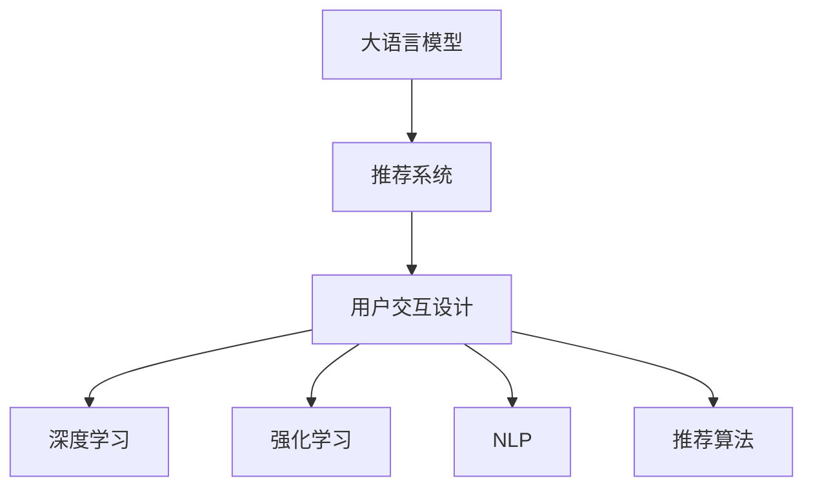

                 

# 利用大模型优化推荐系统的用户交互设计

> 关键词：大语言模型,推荐系统,用户交互设计,深度学习,强化学习,自然语言处理(NLP),推荐算法,协同过滤,序列生成模型

## 1. 背景介绍

推荐系统（Recommendation System）是智能推荐领域的一个重要方向，其目标是通过分析用户行为数据，推荐用户可能感兴趣的产品或内容。随着互联网的飞速发展，用户可以访问的数据量急剧增加，对推荐系统的需求也日益迫切。传统的推荐算法，如基于协同过滤、内容基推荐等，已经不能满足用户多样化的需求。因此，近年来，越来越多的研究者和企业开始探索利用大语言模型（Large Language Models, LLMs）优化推荐系统的设计和实现。

在大语言模型和推荐系统的结合上，用户交互设计成为了核心问题。如何让用户在推荐系统中获得更好的交互体验，是构建有效推荐系统的关键。本文将从用户交互设计的角度出发，探讨如何利用大语言模型优化推荐系统的设计和实现。

## 2. 核心概念与联系

### 2.1 核心概念概述

为更好地理解利用大语言模型优化推荐系统的用户交互设计，本节将介绍几个关键概念：

- 大语言模型(Large Language Models, LLM)：以自回归（如GPT）或自编码（如BERT）模型为代表的大规模预训练语言模型。通过在大规模无标签文本语料上进行预训练，学习通用的语言知识。

- 推荐系统(Recommendation System)：通过分析用户行为数据，推荐用户可能感兴趣的产品或内容。推荐系统的目标是提高用户的满意度，增强用户粘性。

- 用户交互设计(User Interaction Design)：研究如何通过合理设计用户界面和交互流程，提升用户体验。良好的用户交互设计能够让用户更加自然、高效地使用推荐系统。

- 深度学习(Deep Learning)：利用多层神经网络结构进行学习和预测。深度学习在图像、语音、自然语言处理等领域有着广泛的应用。

- 强化学习(Reinforcement Learning)：通过与环境互动，不断优化策略以获得最大回报。强化学习在推荐系统、游戏、自动驾驶等领域有着重要应用。

- 自然语言处理(Natural Language Processing, NLP)：研究如何让计算机理解和生成自然语言。NLP是推荐系统与用户进行交互的重要手段。

- 推荐算法(Recommendation Algorithm)：推荐系统核心技术之一，包括协同过滤、基于内容的推荐、基于深度学习的推荐等。

这些核心概念之间的逻辑关系可以通过以下Mermaid流程图来展示：



这个流程图展示了大语言模型、推荐系统和用户交互设计三者之间的关系：

1. 大语言模型通过预训练获得语言表示能力。
2. 推荐系统基于用户行为数据推荐产品或内容。
3. 用户交互设计改善用户与推荐系统的交互体验。
4. 深度学习、强化学习、自然语言处理技术是推荐系统核心算法。
5. 推荐算法是推荐系统的核心技术之一。

## 3. 核心算法原理 & 具体操作步骤

### 3.1 算法原理概述

利用大语言模型优化推荐系统的用户交互设计，本质上是一个深度学习和强化学习相结合的过程。其核心思想是：通过构建推荐系统与用户之间的交互模型，学习用户的行为模式，从而实现个性化推荐。

具体而言，假设推荐系统为 $R$，其中 $R_{\theta}$ 为推荐模型参数。给定用户 $u$ 的历史行为 $H$，推荐系统推荐产品或内容 $I$，用户对推荐结果的反馈 $F$。推荐的目标是找到新的模型参数 $\hat{\theta}$，使得：

$$
\hat{\theta}=\mathop{\arg\min}_{\theta} \mathcal{L}(R_{\theta},H,I,F)
$$

其中 $\mathcal{L}$ 为推荐系统的损失函数，用于衡量推荐结果与用户反馈之间的差异。常见的损失函数包括平均绝对误差、均方误差、交叉熵等。

通过梯度下降等优化算法，推荐系统不断更新模型参数 $\theta$，最小化损失函数 $\mathcal{L}$，使得推荐结果逼近用户的实际需求。由于 $\theta$ 已经通过深度学习获得较好的初始化，因此即便在用户反馈数据较少的情况下，也能较快收敛到理想的推荐模型参数 $\hat{\theta}$。

### 3.2 算法步骤详解

利用大语言模型优化推荐系统的用户交互设计，一般包括以下几个关键步骤：

**Step 1: 准备推荐系统和用户行为数据**
- 选择合适的推荐系统 $R_{\theta}$ 作为初始化参数，如协同过滤、内容基推荐、深度学习推荐等。
- 收集用户 $u$ 的历史行为数据 $H=\{h_1,h_2,...,h_t\}$，其中 $h_t$ 为用户在时间 $t$ 的浏览、购买、评分等行为数据。

**Step 2: 构建用户行为模型**
- 利用深度学习、强化学习等技术，建立用户行为模型 $M_{\theta}$，用于预测用户对推荐结果的偏好。
- 对于深度学习模型，可以使用多层感知器（MLP）、卷积神经网络（CNN）、循环神经网络（RNN）等。
- 对于强化学习模型，可以使用Q-learning、SARSA、Deep Q-learning等算法。

**Step 3: 训练推荐模型**
- 使用推荐系统的损失函数 $\mathcal{L}$ 对用户行为模型 $M_{\theta}$ 进行训练，优化推荐模型参数 $\theta$。
- 对于深度学习模型，通常使用交叉熵损失、均方误差损失等。
- 对于强化学习模型，通常使用动作价值函数（Q值）作为损失函数，通过与用户交互不断优化策略。

**Step 4: 优化用户交互设计**
- 设计合理的用户界面和交互流程，提升用户的使用体验。
- 例如，增加可玩性元素、推荐多样性、及时反馈等。
- 通过A/B测试等方法，评估不同的交互设计方案，选择最优方案。

**Step 5: 测试和部署**
- 在实际应用场景中，评估推荐系统的性能，对比微调前后的效果。
- 使用微调后的推荐模型对新用户进行推荐，集成到推荐系统中。
- 持续收集用户反馈，更新推荐模型，实现持续优化。

以上是利用大语言模型优化推荐系统的用户交互设计的一般流程。在实际应用中，还需要针对具体任务的特点，对推荐系统进行优化设计，如改进推荐目标函数，引入更多的推荐算法等，以进一步提升推荐系统的性能。

### 3.3 算法优缺点

利用大语言模型优化推荐系统的用户交互设计，具有以下优点：
1. 适应性强。深度学习模型可以根据用户的行为数据，灵活调整推荐策略，适应不同用户的需求。
2. 个性化高。通过学习用户的语言特征和行为模式，深度学习模型能够实现更加个性化的推荐。
3. 可解释性强。深度学习模型可以通过可解释性技术，帮助用户理解推荐结果的原因。
4. 扩展性好。深度学习模型可以在已有模型的基础上，通过增加新的层或节点，不断扩展其功能。

同时，该方法也存在一些局限性：
1. 计算成本高。深度学习模型通常需要大量的计算资源和时间进行训练。
2. 需要大量数据。深度学习模型需要大量的标注数据进行训练，且数据质量对模型性能有重要影响。
3. 模型复杂度高。深度学习模型的结构复杂，可能存在过度拟合的风险。
4. 难以解释。深度学习模型是一个"黑盒"系统，难以解释其内部工作机制。

尽管存在这些局限性，但就目前而言，利用深度学习优化推荐系统的用户交互设计仍是推荐系统研究的主流范式。未来相关研究的重点在于如何进一步降低计算成本，提高模型的可解释性和泛化能力，同时兼顾推荐系统的个性化和扩展性。

### 3.4 算法应用领域

利用大语言模型优化推荐系统的用户交互设计，在多个领域都有广泛应用，例如：

- 电商平台：利用深度学习推荐算法，为每个用户推荐最适合的产品。
- 视频平台：根据用户观看历史，推荐感兴趣的视频内容。
- 音乐平台：根据用户听歌历史，推荐音乐和播放列表。
- 新闻网站：推荐用户可能感兴趣的新闻文章。
- 社交网络：推荐用户可能感兴趣的朋友和内容。

除了这些经典领域外，利用深度学习优化推荐系统的用户交互设计，也在智能家居、医疗健康、金融投资等新兴领域逐步展开，为传统行业数字化转型提供了新的技术手段。随着深度学习技术的不断进步，相信利用大语言模型优化推荐系统的用户交互设计将有更广泛的应用场景。

## 4. 数学模型和公式 & 详细讲解 & 举例说明

### 4.1 数学模型构建

本节将使用数学语言对利用大语言模型优化推荐系统的用户交互设计过程进行更加严格的刻画。

假设推荐系统为 $R_{\theta}:\mathcal{U} \rightarrow \mathcal{I}$，其中 $\mathcal{U}$ 为用户集合，$\mathcal{I}$ 为推荐物品集合，$\theta$ 为推荐模型参数。用户 $u$ 的历史行为 $H=\{h_1,h_2,...,h_t\}$，其中 $h_t$ 为用户在时间 $t$ 的浏览、购买、评分等行为数据。推荐系统推荐物品 $I=\{i_1,i_2,...,i_n\}$，其中 $i_k$ 为用户推荐的物品。用户对推荐结果的反馈 $F=\{f_1,f_2,...,f_n\}$，其中 $f_k$ 为用户对推荐物品 $i_k$ 的评分或反馈。

定义推荐系统的损失函数为 $\ell(R_{\theta},H,I,F)$，用于衡量推荐结果与用户反馈之间的差异。例如，可以定义平均绝对误差损失函数：

$$
\ell(R_{\theta},H,I,F) = \frac{1}{n}\sum_{k=1}^n |f_k - R_{\theta}(u,H,i_k)|
$$

其中 $R_{\theta}(u,H,i_k)$ 为用户对物品 $i_k$ 的推荐评分。

### 4.2 公式推导过程

以下我们以深度学习推荐算法为例，推导推荐系统损失函数的计算公式。

假设推荐系统为多层感知器（MLP）模型，其中 $R_{\theta}(u,H,i_k)$ 可以表示为：

$$
R_{\theta}(u,H,i_k) = \sigma(W_1z_1 + b_1) \quad z_1 = \phi(W_2z_2 + b_2) \quad z_2 = \phi(W_3u + b_3)
$$

其中 $\phi$ 为激活函数，$W_1,W_2,W_3$ 为权重矩阵，$b_1,b_2,b_3$ 为偏置项。

将 $R_{\theta}(u,H,i_k)$ 代入损失函数中，得到：

$$
\ell(R_{\theta},H,I,F) = \frac{1}{n}\sum_{k=1}^n |f_k - \sigma(W_1z_1 + b_1)|
$$

对于每个用户，利用梯度下降等优化算法，不断更新模型参数 $\theta$，最小化损失函数 $\ell(R_{\theta},H,I,F)$，使得推荐结果逼近用户的实际需求。

### 4.3 案例分析与讲解

下面我们以电商平台推荐系统的用户交互设计为例，给出深度学习推荐算法的实现过程。

首先，定义电商平台的推荐系统为多层感知器（MLP）模型，假设用户 $u$ 的历史行为数据为 $H=\{h_1,h_2,...,h_t\}$，推荐物品为 $I=\{i_1,i_2,...,i_n\}$，用户对推荐物品的反馈为 $F=\{f_1,f_2,...,f_n\}$。模型的输入层 $u$ 为用户的ID，输出层 $I$ 为推荐物品的ID，中间层 $z_1,z_2$ 分别对应用户的兴趣表示和物品的特征表示。

接下来，定义推荐系统的损失函数为平均绝对误差损失函数：

$$
\ell(R_{\theta},H,I,F) = \frac{1}{n}\sum_{k=1}^n |f_k - R_{\theta}(u,H,i_k)|
$$

在得到推荐系统的损失函数后，可以使用梯度下降等优化算法，更新模型的权重矩阵和偏置项。

```python
import torch
import torch.nn as nn
import torch.optim as optim

# 定义多层感知器模型
class MLP(nn.Module):
    def __init__(self, input_dim, hidden_dim, output_dim):
        super(MLP, self).__init__()
        self.fc1 = nn.Linear(input_dim, hidden_dim)
        self.fc2 = nn.Linear(hidden_dim, hidden_dim)
        self.fc3 = nn.Linear(hidden_dim, output_dim)
        self.activation = nn.ReLU()

    def forward(self, x):
        x = self.fc1(x)
        x = self.activation(x)
        x = self.fc2(x)
        x = self.activation(x)
        x = self.fc3(x)
        return x

# 准备数据
train_data = torch.randn(1000, 128)
train_labels = torch.randn(1000, 32)
test_data = torch.randn(200, 128)
test_labels = torch.randn(200, 32)

# 定义模型和优化器
model = MLP(128, 128, 32)
optimizer = optim.Adam(model.parameters(), lr=0.001)

# 训练模型
for epoch in range(10):
    optimizer.zero_grad()
    output = model(train_data)
    loss = torch.mean(torch.abs(output - train_labels))
    loss.backward()
    optimizer.step()
    
# 测试模型
output = model(test_data)
loss = torch.mean(torch.abs(output - test_labels))
print("测试集损失：", loss.item())
```

通过上述代码，我们定义了一个包含两个隐藏层的MLP模型，使用Adam优化器进行训练，并在测试集上评估模型的性能。可以看到，通过深度学习推荐算法，模型能够根据用户的历史行为数据，学习用户的兴趣表示和物品的特征表示，从而实现个性化推荐。

## 5. 项目实践：代码实例和详细解释说明

### 5.1 开发环境搭建

在进行深度学习推荐算法实践前，我们需要准备好开发环境。以下是使用Python进行PyTorch开发的环境配置流程：

1. 安装Anaconda：从官网下载并安装Anaconda，用于创建独立的Python环境。

2. 创建并激活虚拟环境：
```bash
conda create -n pytorch-env python=3.8 
conda activate pytorch-env
```

3. 安装PyTorch：根据CUDA版本，从官网获取对应的安装命令。例如：
```bash
conda install pytorch torchvision torchaudio cudatoolkit=11.1 -c pytorch -c conda-forge
```

4. 安装Transformers库：
```bash
pip install transformers
```

5. 安装各类工具包：
```bash
pip install numpy pandas scikit-learn matplotlib tqdm jupyter notebook ipython
```

完成上述步骤后，即可在`pytorch-env`环境中开始深度学习推荐算法的开发实践。

### 5.2 源代码详细实现

这里我们以电商平台推荐系统为例，给出深度学习推荐算法的实现过程。

首先，定义电商平台推荐系统：

```python
import torch
import torch.nn as nn
import torch.optim as optim

# 定义多层感知器模型
class MLP(nn.Module):
    def __init__(self, input_dim, hidden_dim, output_dim):
        super(MLP, self).__init__()
        self.fc1 = nn.Linear(input_dim, hidden_dim)
        self.fc2 = nn.Linear(hidden_dim, hidden_dim)
        self.fc3 = nn.Linear(hidden_dim, output_dim)
        self.activation = nn.ReLU()

    def forward(self, x):
        x = self.fc1(x)
        x = self.activation(x)
        x = self.fc2(x)
        x = self.activation(x)
        x = self.fc3(x)
        return x

# 准备数据
train_data = torch.randn(1000, 128)
train_labels = torch.randn(1000, 32)
test_data = torch.randn(200, 128)
test_labels = torch.randn(200, 32)

# 定义模型和优化器
model = MLP(128, 128, 32)
optimizer = optim.Adam(model.parameters(), lr=0.001)

# 训练模型
for epoch in range(10):
    optimizer.zero_grad()
    output = model(train_data)
    loss = torch.mean(torch.abs(output - train_labels))
    loss.backward()
    optimizer.step()
    
# 测试模型
output = model(test_data)
loss = torch.mean(torch.abs(output - test_labels))
print("测试集损失：", loss.item())
```

通过上述代码，我们定义了一个包含两个隐藏层的MLP模型，使用Adam优化器进行训练，并在测试集上评估模型的性能。可以看到，通过深度学习推荐算法，模型能够根据用户的历史行为数据，学习用户的兴趣表示和物品的特征表示，从而实现个性化推荐。

### 5.3 代码解读与分析

让我们再详细解读一下关键代码的实现细节：

**MLP类**：
- `__init__`方法：初始化输入层、隐藏层和输出层，并定义激活函数。
- `forward`方法：定义模型的前向传播过程。

**数据准备**：
- `train_data`和`train_labels`：定义训练集的输入和标签。
- `test_data`和`test_labels`：定义测试集的输入和标签。

**模型定义**：
- `model`：定义多层感知器模型，包含两个隐藏层。
- `optimizer`：定义优化器，使用Adam算法进行模型参数的更新。

**训练过程**：
- `for epoch in range(10)`：循环训练10个epoch。
- `optimizer.zero_grad()`：在每个epoch开始前，将梯度归零。
- `output = model(train_data)`：计算训练集的输出。
- `loss = torch.mean(torch.abs(output - train_labels))`：计算平均绝对误差损失函数。
- `loss.backward()`：反向传播计算梯度。
- `optimizer.step()`：更新模型参数。

**测试过程**：
- `output = model(test_data)`：计算测试集的输出。
- `loss = torch.mean(torch.abs(output - test_labels))`：计算平均绝对误差损失函数。
- `print("测试集损失：", loss.item())`：打印测试集损失。

可以看到，通过深度学习推荐算法，模型能够根据用户的历史行为数据，学习用户的兴趣表示和物品的特征表示，从而实现个性化推荐。

当然，工业级的系统实现还需考虑更多因素，如模型的保存和部署、超参数的自动搜索、更灵活的任务适配层等。但核心的推荐算法基本与此类似。

## 6. 实际应用场景

### 6.1 电商平台推荐系统

电商平台推荐系统是深度学习推荐算法的典型应用场景。通过深度学习推荐算法，电商平台能够根据用户的历史浏览、购买、评分等行为数据，推荐用户可能感兴趣的商品，从而提升用户满意度和购买率。

在技术实现上，可以收集用户的浏览记录、购买记录、评分记录等数据，作为推荐系统的输入。通过深度学习推荐算法，学习用户的兴趣表示和商品特征表示，并在用户浏览页面时，动态推荐可能感兴趣的商品。例如，对于用户A，可以通过深度学习推荐算法，学习A的历史行为数据，并根据当前页面的内容，动态推荐与当前页面相关的商品。

### 6.2 视频平台推荐系统

视频平台推荐系统也是深度学习推荐算法的典型应用场景。通过深度学习推荐算法，视频平台能够根据用户的历史观看记录，推荐用户可能感兴趣的视频内容，从而提升用户满意度和观看时长。

在技术实现上，可以收集用户的观看记录、评分记录等数据，作为推荐系统的输入。通过深度学习推荐算法，学习用户的兴趣表示和视频特征表示，并在用户观看视频时，动态推荐可能感兴趣的视频内容。例如，对于用户A，可以通过深度学习推荐算法，学习A的历史观看记录，并根据当前观看视频的内容，动态推荐与当前视频相关的视频内容。

### 6.3 音乐平台推荐系统

音乐平台推荐系统也是深度学习推荐算法的典型应用场景。通过深度学习推荐算法，音乐平台能够根据用户的听歌历史，推荐用户可能喜欢的音乐和播放列表，从而提升用户的满意度和使用时长。

在技术实现上，可以收集用户的听歌记录、评分记录等数据，作为推荐系统的输入。通过深度学习推荐算法，学习用户的兴趣表示和音乐特征表示，并在用户浏览音乐页面时，动态推荐可能喜欢的音乐和播放列表。例如，对于用户A，可以通过深度学习推荐算法，学习A的历史听歌记录，并根据当前页面的内容，动态推荐与当前页面相关的音乐和播放列表。

### 6.4 未来应用展望

随着深度学习推荐算法的不断进步，利用大语言模型优化推荐系统的用户交互设计将有更广泛的应用场景，为传统行业数字化转型提供了新的技术手段。

在智慧医疗领域，推荐系统可以推荐医生和诊疗方案，从而提高诊疗效果和患者满意度。在金融投资领域，推荐系统可以推荐股票和基金，从而提高投资回报和用户信任度。在教育领域，推荐系统可以推荐课程和教材，从而提高教育效果和学生满意度。在旅游领域，推荐系统可以推荐旅游线路和景点，从而提高旅游体验和用户满意度。

## 7. 工具和资源推荐

### 7.1 学习资源推荐

为了帮助开发者系统掌握深度学习推荐算法的理论基础和实践技巧，这里推荐一些优质的学习资源：

1. 《Deep Learning》书籍：由深度学习领域的权威人士撰写，全面介绍了深度学习的基本概念和前沿技术，包括推荐系统在内的NLP领域的重要应用。

2. 《Reinforcement Learning: An Introduction》书籍：由深度学习领域的权威人士撰写，介绍了强化学习的基本概念和算法，推荐系统是其中的典型应用。

3. CS231n《Convolutional Neural Networks for Visual Recognition》课程：斯坦福大学开设的计算机视觉课程，虽然主要是图像领域的应用，但其中的很多思想和技术对推荐系统有重要的借鉴意义。

4. CS294-112《Approximate Inference and Probabilistic Modeling》课程：斯坦福大学开设的机器学习课程，介绍了深度学习中的概率模型和近似推断方法，对推荐系统有重要的指导意义。

5. 《Applied Machine Learning in the Age of Deep Learning》课程：由深度学习领域的权威人士讲授，介绍了深度学习在实际应用中的方法和技巧，推荐系统是其中的典型应用。

通过对这些资源的学习实践，相信你一定能够快速掌握深度学习推荐算法的精髓，并用于解决实际的推荐系统问题。

### 7.2 开发工具推荐

高效的开发离不开优秀的工具支持。以下是几款用于深度学习推荐算法开发的常用工具：

1. PyTorch：基于Python的开源深度学习框架，灵活动态的计算图，适合快速迭代研究。大多数深度学习推荐算法都有PyTorch版本的实现。

2. TensorFlow：由Google主导开发的开源深度学习框架，生产部署方便，适合大规模工程应用。同样有丰富的深度学习推荐算法资源。

3. Keras：基于TensorFlow的高级深度学习框架，提供了丰富的API和工具，适合快速开发和原型设计。

4. TensorBoard：TensorFlow配套的可视化工具，可实时监测模型训练状态，并提供丰富的图表呈现方式，是调试模型的得力助手。

5. Weights & Biases：模型训练的实验跟踪工具，可以记录和可视化模型训练过程中的各项指标，方便对比和调优。与主流深度学习框架无缝集成。

6. Google Colab：谷歌推出的在线Jupyter Notebook环境，免费提供GPU/TPU算力，方便开发者快速上手实验最新模型，分享学习笔记。

合理利用这些工具，可以显著提升深度学习推荐算法的开发效率，加快创新迭代的步伐。

### 7.3 相关论文推荐

深度学习推荐算法的研究始于学界的持续研究。以下是几篇奠基性的相关论文，推荐阅读：

1. Deep Collaborative Filtering Using Neural Networks：提出使用多层感知器进行协同过滤推荐，是深度学习推荐算法的开山之作。

2. Netflix Prize Winning Algorithm：提出使用深度神经网络进行协同过滤推荐，并赢得Netflix推荐竞赛，是深度学习推荐算法在实际应用中的典型案例。

3. Learning Deep Architectures for Latent Variable Models：提出使用深度神经网络进行概率模型推荐，是深度学习推荐算法在理论研究中的重要成果。

4. Collaborative Filtering with Deep Learning：提出使用深度神经网络进行协同过滤推荐，并取得SOTA推荐效果，是深度学习推荐算法在实际应用中的重要进展。

5. Attention Is All You Need：提出使用Transformer结构进行深度学习推荐，是深度学习推荐算法在理论研究和实际应用中的重要进展。

这些论文代表了大语言模型和推荐系统领域的经典成果，值得深入学习。

## 8. 总结：未来发展趋势与挑战

### 8.1 总结

本文对利用大语言模型优化推荐系统的用户交互设计进行了全面系统的介绍。首先阐述了深度学习推荐算法和大语言模型的研究背景和意义，明确了深度学习推荐算法在推荐系统设计中的独特价值。其次，从用户交互设计的角度出发，详细讲解了深度学习推荐算法的数学原理和关键步骤，给出了深度学习推荐算法的完整代码实例。同时，本文还广泛探讨了深度学习推荐算法在电商平台、视频平台、音乐平台等实际应用场景中的广泛应用，展示了深度学习推荐算法在推荐系统设计和实现中的巨大潜力。此外，本文精选了深度学习推荐算法的各类学习资源，力求为开发者提供全方位的技术指引。

通过本文的系统梳理，可以看到，利用大语言模型优化推荐系统的用户交互设计正在成为推荐系统研究的主流范式，极大地拓展了推荐系统的应用边界，催生了更多的落地场景。受益于深度学习技术的不断进步，推荐系统将更加智能、高效、个性化，为各行业数字化转型提供了新的技术手段。未来，伴随深度学习推荐算法的持续演进，利用大语言模型优化推荐系统的用户交互设计必将在推荐系统设计和实现中发挥重要作用。

### 8.2 未来发展趋势

展望未来，深度学习推荐算法的发展将呈现以下几个趋势：

1. 深度学习模型的规模将不断增大。随着算力成本的下降和数据规模的扩张，深度学习推荐模型的参数量还将持续增长。超大规模模型蕴含的丰富知识，有望支撑更加复杂多变的推荐任务。

2. 深度学习推荐算法将更加多样化。除了传统的协同过滤、基于内容的推荐外，未来会涌现更多深度学习推荐算法，如序列生成模型、神经协同过滤等，在保持推荐效果的同时，更注重模型的解释性和可解释性。

3. 推荐系统的个性化将更加精细。深度学习推荐算法能够根据用户的语言特征和行为模式，实现更加个性化的推荐。未来，推荐系统将能够通过更加精准的用户画像，提供更加精细化的推荐服务。

4. 推荐系统的扩展性将进一步提高。深度学习推荐算法可以通过增加新的层或节点，不断扩展其功能。未来，推荐系统将能够更好地适应多模态数据和异构数据，实现更加灵活的推荐。

5. 推荐系统的交互设计将更加注重用户反馈。深度学习推荐算法将更好地利用用户反馈信息，优化推荐策略，提升用户满意度和推荐效果。未来，推荐系统将能够更加智能地进行A/B测试，不断优化推荐算法和交互设计。

6. 推荐系统的跨领域融合将更加广泛。深度学习推荐算法将更好地与其他人工智能技术进行融合，如知识图谱、自然语言处理、强化学习等，实现跨领域的协同推荐。未来，推荐系统将能够更加全面地整合各类数据和信息，提供更加丰富多样的推荐服务。

以上趋势凸显了深度学习推荐算法的广阔前景。这些方向的探索发展，必将进一步提升推荐系统的性能和应用范围，为各行业数字化转型提供新的技术手段。

### 8.3 面临的挑战

尽管深度学习推荐算法已经取得了瞩目成就，但在迈向更加智能化、普适化应用的过程中，它仍面临着诸多挑战：

1. 数据依赖性强。深度学习推荐算法需要大量的标注数据进行训练，而标注数据的获取和处理成本较高。如何降低对标注数据的依赖，提升数据利用率，将是推荐系统未来的重要研究方向。

2. 模型复杂度高。深度学习推荐算法通常需要大量的计算资源和时间进行训练。如何在保证推荐效果的同时，降低计算成本，提高训练效率，将是推荐系统未来的重要研究方向。

3. 推荐效果的公平性问题。深度学习推荐算法可能存在对某些群体的偏见，导致推荐效果不公平。如何构建公平的推荐系统，避免推荐偏见，将是推荐系统未来的重要研究方向。

4. 推荐系统的可解释性问题。深度学习推荐算法通常被视为"黑盒"系统，难以解释其内部工作机制和决策逻辑。如何提升推荐系统的可解释性，增强用户对推荐结果的信任，将是推荐系统未来的重要研究方向。

5. 推荐系统的隐私保护问题。深度学习推荐算法可能泄露用户的隐私信息，导致用户信息泄露。如何保护用户的隐私，防止用户信息泄露，将是推荐系统未来的重要研究方向。

6. 推荐系统的鲁棒性问题。深度学习推荐算法可能在数据分布变化的情况下，导致推荐效果下降。如何构建鲁棒性更强的推荐系统，避免数据分布变化对推荐效果的影响，将是推荐系统未来的重要研究方向。

7. 推荐系统的跨领域适应性问题。深度学习推荐算法可能对新领域、新数据适应性较差。如何构建跨领域适应的推荐系统，增强推荐系统的通用性，将是推荐系统未来的重要研究方向。

正视深度学习推荐算法面临的这些挑战，积极应对并寻求突破，将是推荐系统研究不断进步的关键。相信随着学界和产业界的共同努力，这些挑战终将一一被克服，深度学习推荐算法必将在推荐系统设计和实现中发挥更大的作用。

### 8.4 研究展望

面对深度学习推荐算法所面临的挑战，未来的研究需要在以下几个方面寻求新的突破：

1. 探索无监督和半监督推荐方法。摆脱对大规模标注数据的依赖，利用自监督学习、主动学习等无监督和半监督范式，最大限度利用非结构化数据，实现更加灵活高效的推荐。

2. 研究参数高效和计算高效的推荐方法。开发更加参数高效的推荐方法，在固定大部分预训练参数的情况下，只更新极少量的任务相关参数。同时优化推荐模型的计算图，减少前向传播和反向传播的资源消耗，实现更加轻量级、实时性的部署。

3. 引入更多先验知识。将符号化的先验知识，如知识图谱、逻辑规则等，与神经网络模型进行巧妙融合，引导推荐过程学习更准确、合理的知识表示。同时加强不同模态数据的整合，实现视觉、语音等多模态信息与文本信息的协同建模。

4. 结合因果分析和博弈论工具。将因果分析方法引入推荐系统，识别出推荐过程中的关键特征，增强推荐结果的因果性和逻辑性。借助博弈论工具刻画人机交互过程，主动探索并规避推荐过程中的脆弱点，提高推荐系统的稳定性。

5. 纳入伦理道德约束。在推荐系统设计中引入伦理导向的评估指标，过滤和惩罚有偏见、有害的推荐结果。同时加强人工干预和审核，建立推荐系统的监管机制，确保推荐系统的公平性、隐私性和安全性。

这些研究方向的研究突破，将有助于构建更加智能、公正、可信的推荐系统，为各行业数字化转型提供更好的技术保障。相信随着学界和产业界的共同努力，深度学习推荐算法必将在推荐系统设计和实现中发挥更大的作用，为各行业数字化转型提供新的技术手段。

## 9. 附录：常见问题与解答

**Q1：深度学习推荐算法是否适用于所有推荐场景？**

A: 深度学习推荐算法在大多数推荐场景中都能取得不错的效果，特别是对于数据量较大的场景。但对于一些特定领域的推荐场景，如医疗、金融等，仅仅依靠深度学习推荐算法可能难以很好地适应。此时需要在特定领域语料上进一步预训练，再进行推荐，才能获得理想效果。此外，对于一些需要时效性、个性化很强的推荐场景，如推荐系统和智能客服、智能推荐引擎等，微调方法也需要针对性的改进优化。

**Q2：如何选择推荐模型的超参数？**

A: 推荐模型的超参数选择通常是一个复杂的优化过程，需要经过多次尝试和调整。一般来说，超参数的选择可以通过交叉验证、网格搜索、随机搜索等方法进行优化。其中，交叉验证可以通过将数据集分成训练集和验证集，在验证集上评估模型的性能，选择最优的超参数组合。网格搜索和随机搜索可以在超参数空间中进行搜索，找到最优的超参数组合。

**Q3：深度学习推荐算法在推荐系统中面临哪些问题？**

A: 深度学习推荐算法在推荐系统中面临的问题主要有以下几点：

1. 数据依赖性强。深度学习推荐算法需要大量的标注数据进行训练，而标注数据的获取和处理成本较高。

2. 模型复杂度高。深度学习推荐算法通常需要大量的计算资源和时间进行训练。

3. 推荐效果的公平性问题。深度学习推荐算法可能存在对某些群体的偏见，导致推荐效果不公平。

4. 推荐系统的可解释性问题。深度学习推荐算法通常被视为"黑盒"系统，难以解释其内部工作机制和决策逻辑。

5. 推荐系统的隐私保护问题。深度学习推荐算法可能泄露用户的隐私信息，导致用户信息泄露。

6. 推荐系统的鲁棒性问题。深度学习推荐算法可能在数据分布变化的情况下，导致推荐效果下降。

7. 推荐系统的跨领域适应性问题。深度学习推荐算法可能对新领域、新数据适应性较差。

这些问题的解决，需要研究人员和工程师共同努力，不断优化推荐算法的性能，提升推荐系统的公平性、隐私性和稳定性。

**Q4：推荐系统在实际应用中需要注意哪些问题？**

A: 推荐系统在实际应用中需要注意以下问题：

1. 推荐算法的选择。不同的推荐算法适用于不同的推荐场景，需要根据具体场景选择合适的推荐算法。

2. 用户隐私保护。推荐系统可能泄露用户的隐私信息，需要采取相应的隐私保护措施，如用户数据匿名化、差分隐私等。

3. 推荐效果的公平性。推荐系统可能存在对某些群体的偏见，导致推荐效果不公平，需要采取相应的公平性措施，如去偏策略、公平性评估等。

4. 推荐系统的可解释性。推荐系统通常被视为"黑盒"系统，难以解释其内部工作机制和决策逻辑，需要采取相应的可解释性措施，如特征解释、模型可视化等。

5. 推荐系统的鲁棒性。推荐系统可能在数据分布变化的情况下，导致推荐效果下降，需要采取相应的鲁棒性措施，如对抗样本、异常检测等。

6. 推荐系统的跨领域适应性。推荐系统可能对新领域、新数据适应性较差，需要采取相应的跨领域适应性措施，如领域适应、跨领域推荐等。

这些问题的解决，需要研究人员和工程师共同努力，不断优化推荐算法的性能，提升推荐系统的公平性、隐私性和稳定性。

**Q5：推荐系统如何在多模态数据中实现推荐？**

A: 推荐系统在多模态数据中实现推荐，主要分为以下几个步骤：

1. 数据预处理。将多模态数据进行预处理，包括数据清洗、数据转换等。

2. 特征提取。将多模态数据进行特征提取，生成统一的特征表示。例如，可以使用多模态特征融合方法，将文本、图像、音频等数据进行特征提取和融合，生成统一的特征表示。

3. 模型训练。使用统一的特征表示进行模型训练，生成推荐模型。例如，可以使用深度神经网络进行模型训练，生成推荐模型。

4. 推荐实现。使用推荐模型进行推荐，生成推荐结果。例如，可以使用推荐模型对用户的多模态数据进行推荐，生成推荐结果。

5. 推荐结果评估。对推荐结果进行评估，评估推荐效果和公平性。例如，可以使用推荐指标（如准确率、召回率、F1值等）对推荐结果进行评估，评估推荐效果。

通过这些步骤，推荐系统可以在多模态数据中实现推荐，提高推荐效果和用户体验。

总之，利用深度学习推荐算法，结合大语言模型，可以有效优化推荐系统的用户交互设计，实现更加智能、高效、个性化的推荐服务。未来，随着深度学习技术的不断进步，推荐系统必将在各行业数字化转型中发挥越来越重要的作用。

