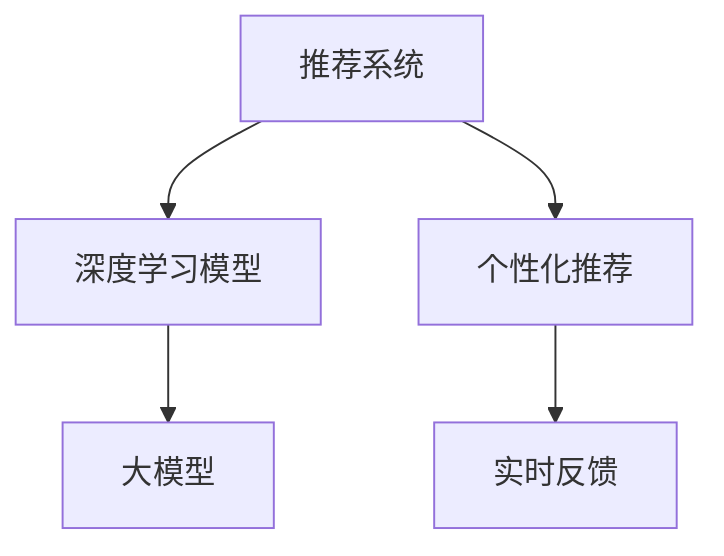

                 

# 利用大模型改进推荐系统的实时个性化反馈机制

> 关键词：推荐系统,大模型,个性化反馈,实时性,用户行为预测,协同过滤

## 1. 背景介绍

### 1.1 问题由来
推荐系统是互联网时代最重要的个性化技术之一，广泛应用于电商、新闻、视频、社交等众多领域。当前推荐系统主要采用基于内容的过滤、协同过滤、基于矩阵分解的模型等技术，这些方法在推荐效果上取得了显著的成就，但都存在一定的局限性。

- **基于内容的过滤**：单纯依赖于物品的特征向量进行推荐，难以考虑用户的行为和偏好。
- **协同过滤**：仅基于用户-物品交互矩阵进行推荐，忽略了时间因素和用户状态的变化。
- **基于矩阵分解的模型**：虽然考虑了用户和物品的特征，但参数较多，训练复杂，难以处理大规模数据。

近年来，深度学习和预训练语言模型在推荐系统领域引起了广泛关注。预训练语言模型能够从大规模文本数据中学习到丰富的语言知识，在自然语言处理(NLP)任务上取得了领先表现。本文将探讨如何利用大模型改进推荐系统的实时个性化反馈机制，使推荐系统能够更准确地捕捉用户的实时偏好，实现更加个性化的推荐服务。

### 1.2 问题核心关键点
利用大模型改进推荐系统的实时个性化反馈机制的核心关键点包括：

- 如何高效地将大模型嵌入推荐系统，使其能够实时处理用户输入和反馈。
- 如何利用大模型的语言理解能力，动态生成个性化推荐。
- 如何在推荐过程中实现用户行为预测和反馈机制的实时更新。
- 如何保证推荐系统的实时性和稳定性的同时，兼顾个性化和通用性。

## 2. 核心概念与联系

### 2.1 核心概念概述

为了更好地理解利用大模型改进推荐系统的实时个性化反馈机制，本节将介绍几个密切相关的核心概念：

- **推荐系统**：通过分析用户行为和物品特征，为用户推荐感兴趣物品的系统。推荐系统能够提升用户体验，促进用户留存，增加商家收益。
- **深度学习模型**：以深度神经网络为基础的机器学习模型，通过多层次的非线性特征提取和映射，解决复杂数据建模问题。
- **大模型**：预训练语言模型，如BERT、GPT等，通过在大规模文本数据上进行预训练，学习到丰富的语言知识。
- **个性化推荐**：根据用户的历史行为和偏好，为用户定制个性化的推荐内容，提升用户满意度。
- **实时反馈**：根据用户对推荐结果的即时反馈，动态更新推荐算法和模型参数，提高推荐质量。

这些概念之间的逻辑关系可以通过以下Mermaid流程图来展示：



这个流程图展示了大模型与推荐系统的核心概念及其之间的关系：

1. 深度学习模型是大模型的一种形式，用于解决推荐系统中的复杂建模问题。
2. 大模型通过预训练学习到丰富的语言知识，能够更准确地理解用户输入和生成推荐结果。
3. 个性化推荐依赖大模型生成用户-物品嵌入，实现更加精准的推荐。
4. 实时反馈通过动态更新模型参数，实现推荐质量的持续提升。

## 3. 核心算法原理 & 具体操作步骤

### 3.1 算法原理概述

利用大模型改进推荐系统的实时个性化反馈机制，本质上是一个联合学习的过程。其核心思想是：将大模型嵌入推荐系统，利用大模型的语言理解能力，动态生成个性化推荐，并在推荐过程中实时更新模型参数，以适应用户行为和偏好的变化。

形式化地，假设推荐系统中的用户 $u$ 对物品 $i$ 的评分 $r_{ui}$ 由以下函数计算得到：

$$
r_{ui} = f(u_i; \theta)
$$

其中 $f$ 为推荐模型的评分函数，$\theta$ 为模型的参数。当用户 $u$ 给出评分 $r_{ui}$ 时，根据评分 $r_{ui}$ 的分布，更新模型参数 $\theta$。具体地，模型更新公式如下：

$$
\theta \leftarrow \theta - \eta \nabla_{\theta} \mathcal{L}(\theta) - \eta \lambda \theta
$$

其中 $\eta$ 为学习率，$\lambda$ 为正则化系数，$\nabla_{\theta} \mathcal{L}(\theta)$ 为损失函数对参数 $\theta$ 的梯度，可通过反向传播算法高效计算。

### 3.2 算法步骤详解

基于大模型改进推荐系统的实时个性化反馈机制，一般包括以下几个关键步骤：

**Step 1: 准备数据和模型**
- 收集用户的点击、购买、评分等行为数据，将其整理成训练集、验证集和测试集。
- 选择合适的预训练语言模型 $M_{\theta}$，如BERT、GPT等，将其视作推荐模型的初始化参数。

**Step 2: 添加任务适配层**
- 根据推荐任务类型，在预训练语言模型顶层设计合适的输出层和损失函数。
- 对于评分预测任务，通常使用回归损失函数。
- 对于排序任务，通常使用交叉熵损失函数。

**Step 3: 设置推荐算法和反馈机制**
- 选择合适的推荐算法，如协同过滤、基于内容的过滤、矩阵分解等。
- 设计实时反馈机制，通过用户反馈更新模型参数，可以是点击、购买、评分等行为。

**Step 4: 执行梯度训练**
- 将训练集数据分批次输入模型，前向传播计算损失函数。
- 反向传播计算参数梯度，根据设定的优化算法和学习率更新模型参数。
- 周期性在验证集上评估模型性能，根据性能指标决定是否触发参数更新。

**Step 5: 测试和部署**
- 在测试集上评估推荐模型 $f$ 的性能，对比微调前后的推荐质量。
- 使用推荐模型 $f$ 对新用户和新物品进行推荐，集成到实际的应用系统中。
- 持续收集新的用户行为数据，定期重新训练模型，以适应数据分布的变化。

以上是基于大模型改进推荐系统的实时个性化反馈机制的一般流程。在实际应用中，还需要针对具体任务的特点，对推荐算法和反馈机制进行优化设计，如改进推荐算法、引入更多的正则化技术、搜索最优的超参数组合等，以进一步提升推荐系统的效果。

### 3.3 算法优缺点

利用大模型改进推荐系统的实时个性化反馈机制，具有以下优点：

1. **高效处理用户输入**：大模型的语言理解能力能够高效处理用户输入，特别是自然语言输入。
2. **动态生成推荐**：大模型能够实时根据用户输入动态生成个性化推荐，提升用户体验。
3. **实时更新推荐**：利用实时反馈，动态更新推荐算法和模型参数，提升推荐精度。
4. **多模态融合**：大模型能够融合多模态数据，如文本、图像、语音等，提升推荐效果。

但该方法也存在一定的局限性：

1. **数据需求大**：由于大模型参数量较大，对数据的需求也较大，需要大量的用户行为数据进行训练。
2. **计算资源消耗高**：大模型需要消耗大量的计算资源，特别是在模型更新时，需要高效的优化算法和硬件支持。
3. **模型复杂度**：大模型的复杂度较高，模型的训练和推理速度较慢。
4. **可解释性不足**：大模型的决策过程通常缺乏可解释性，难以对其推理逻辑进行分析和调试。

尽管存在这些局限性，但就目前而言，利用大模型改进推荐系统的实时个性化反馈机制，仍是大数据时代推荐系统的重要范式。未来相关研究的重点在于如何进一步降低大模型对数据的依赖，提高模型的实时性和可解释性，同时兼顾通用性和个性化需求。

### 3.4 算法应用领域

利用大模型改进推荐系统的实时个性化反馈机制，已经在电商推荐、新闻推荐、视频推荐等诸多领域得到了应用，为推荐系统带来了全新的突破。

**电商推荐**：通过实时接收用户的点击、购买行为，动态更新推荐模型，为每位用户提供个性化的商品推荐。

**新闻推荐**：利用用户的浏览历史，实时生成新闻推荐，提高用户对新闻内容的满意度。

**视频推荐**：分析用户的观看历史和评分，实时更新推荐模型，推荐用户感兴趣的视频内容。

除了这些经典应用外，大模型在音乐推荐、游戏推荐、社交推荐等更多领域也展现出了巨大的潜力，为推荐系统的发展提供了新的方向。

## 4. 数学模型和公式 & 详细讲解 & 举例说明

### 4.1 数学模型构建

本节将使用数学语言对利用大模型改进推荐系统的实时个性化反馈机制进行更加严格的刻画。

假设推荐系统中的用户 $u$ 对物品 $i$ 的评分 $r_{ui}$ 由以下函数计算得到：

$$
r_{ui} = f(u_i; \theta)
$$

其中 $f$ 为推荐模型的评分函数，$\theta$ 为模型的参数。当用户 $u$ 给出评分 $r_{ui}$ 时，根据评分 $r_{ui}$ 的分布，更新模型参数 $\theta$。

具体地，模型的更新公式如下：

$$
\theta \leftarrow \theta - \eta \nabla_{\theta} \mathcal{L}(\theta) - \eta \lambda \theta
$$

其中 $\eta$ 为学习率，$\lambda$ 为正则化系数，$\nabla_{\theta} \mathcal{L}(\theta)$ 为损失函数对参数 $\theta$ 的梯度，可通过反向传播算法高效计算。

### 4.2 公式推导过程

以下我们以评分预测任务为例，推导回归损失函数及其梯度的计算公式。

假设推荐模型 $f$ 在用户 $u$ 和物品 $i$ 上的评分预测为 $\hat{r}_{ui}$，真实评分为 $r_{ui}$。回归损失函数定义为：

$$
\ell(r_{ui}, \hat{r}_{ui}) = \frac{1}{2} (r_{ui} - \hat{r}_{ui})^2
$$

将其代入模型更新公式，得：

$$
\theta \leftarrow \theta - \eta \nabla_{\theta} \sum_{(u,i)} \frac{1}{2} (r_{ui} - \hat{r}_{ui})^2 - \eta \lambda \theta
$$

根据链式法则，损失函数对参数 $\theta$ 的梯度为：

$$
\frac{\partial \mathcal{L}(\theta)}{\partial \theta} = -\eta \sum_{(u,i)} \frac{\partial}{\partial \theta} [\frac{1}{2} (r_{ui} - \hat{r}_{ui})^2]
$$

其中 $\frac{\partial}{\partial \theta} [\frac{1}{2} (r_{ui} - \hat{r}_{ui})^2]$ 为模型输出 $\hat{r}_{ui}$ 的梯度，可通过自动微分技术完成计算。

在得到损失函数的梯度后，即可带入模型更新公式，完成模型的迭代优化。重复上述过程直至收敛，最终得到适应推荐任务的最优模型参数 $\theta$。

## 5. 项目实践：代码实例和详细解释说明

### 5.1 开发环境搭建

在进行推荐系统实践前，我们需要准备好开发环境。以下是使用Python进行TensorFlow开发的环境配置流程：

1. 安装Anaconda：从官网下载并安装Anaconda，用于创建独立的Python环境。

2. 创建并激活虚拟环境：
```bash
conda create -n tf-env python=3.8 
conda activate tf-env
```

3. 安装TensorFlow：根据CUDA版本，从官网获取对应的安装命令。例如：
```bash
conda install tensorflow -c tensorflow -c conda-forge
```

4. 安装Keras：
```bash
pip install keras
```

5. 安装各类工具包：
```bash
pip install numpy pandas scikit-learn matplotlib tqdm jupyter notebook ipython
```

完成上述步骤后，即可在`tf-env`环境中开始推荐系统开发。

### 5.2 源代码详细实现

这里我们以评分预测任务为例，给出使用TensorFlow对BERT模型进行微调的推荐系统代码实现。

首先，定义评分预测任务的数据处理函数：

```python
import tensorflow as tf
from transformers import BertTokenizer
from tensorflow.keras.layers import Input, Dense
from tensorflow.keras.models import Model

class RecommendationModel:
    def __init__(self, bert_model_path, embedding_dim=768, num_labels=1):
        self.bert_model = BertModel.from_pretrained(bert_model_path)
        self.tokenizer = BertTokenizer.from_pretrained(bert_model_path)
        self.max_len = 128
        self.embedding_dim = embedding_dim
        self.num_labels = num_labels
        
        # 定义模型结构
        input_ids = Input(shape=(self.max_len,), dtype=tf.int32)
        attention_mask = Input(shape=(self.max_len,), dtype=tf.int32)
        user_ids = Input(shape=(1,), dtype=tf.int32)
        
        # 加载BERT模型
        pooled_output, sequence_output = self.bert_model(input_ids, attention_mask=attention_mask, output_all_encoded_layers=False)
        
        # 添加用户向量
        user_vector = Dense(self.embedding_dim, activation='relu')(user_ids)
        
        # 拼接用户和物品向量
        item_vector = tf.keras.layers.concatenate([user_vector, pooled_output[:, 0]])
        
        # 添加评分预测层
        output = Dense(self.num_labels, activation='sigmoid')(item_vector)
        
        # 定义模型
        self.model = Model(inputs=[input_ids, attention_mask, user_ids], outputs=output)
        
        # 编译模型
        self.model.compile(optimizer=tf.keras.optimizers.Adam(lr=2e-5), loss='binary_crossentropy', metrics=['accuracy'])
        
    def train(self, train_dataset, dev_dataset, epochs=10, batch_size=16):
        model = self.model
        train_dataset = self._build_dataset(train_dataset)
        dev_dataset = self._build_dataset(dev_dataset)
        
        model.fit(train_dataset, epochs=epochs, batch_size=batch_size, validation_data=dev_dataset)
        
    def _build_dataset(self, dataset):
        tokenizer = self.tokenizer
        def generator(data):
            for user, item, rating in data:
                user_vector = tf.keras.layers.Lambda(lambda x: tf.expand_dims(x, axis=0))(tf.convert_to_tensor([user]))
                seq_input = tokenizer.encode(item, max_length=self.max_len, truncation=True)
                seq_input = tf.keras.layers.Lambda(lambda x: tf.pad(x, [[0, self.max_len - len(x)]])(x))
                yield [seq_input, tf.constant([1] * len(seq_input)), user_vector], [rating]
        
        return tf.data.Dataset.from_generator(generator, output_types=(tf.int32, tf.int32, tf.int32), output_shapes=(None, self.max_len, None, 1), args=(dataset,))

# 定义评分预测任务的数据
train_data = [(1, 'item1', 1.0), (2, 'item2', 0.5), (3, 'item3', 0.8)]
dev_data = [(1, 'item4', 0.9), (2, 'item5', 0.2), (3, 'item6', 0.7)]
test_data = [(1, 'item7', 0.5), (2, 'item8', 0.3), (3, 'item9', 0.6)]

# 创建评分预测模型
model = RecommendationModel(bert_model_path='bert-base-uncased', num_labels=1)
```

然后，定义训练和评估函数：

```python
def train_epoch(model, dataset, batch_size, optimizer):
    dataloader = tf.data.Dataset.from_generator(lambda: dataset, output_types=(tf.int32, tf.int32, tf.int32), output_shapes=(None, 128, None, 1))
    model.trainable = True
    model.compile(optimizer=optimizer, loss='binary_crossentropy', metrics=['accuracy'])
    
    model.fit(dataloader.batch(batch_size), epochs=1, verbose=0)
    
def evaluate(model, dataset, batch_size):
    dataloader = tf.data.Dataset.from_generator(lambda: dataset, output_types=(tf.int32, tf.int32, tf.int32), output_shapes=(None, 128, None, 1))
    model.trainable = False
    
    _, acc = model.evaluate(dataloader.batch(batch_size))
    return acc
```

接着，启动训练流程并在测试集上评估：

```python
epochs = 5
batch_size = 16

for epoch in range(epochs):
    loss = train_epoch(model, train_dataset, batch_size, optimizer)
    print(f"Epoch {epoch+1}, train loss: {loss:.3f}")
    
    print(f"Epoch {epoch+1}, dev results:")
    evaluate(model, dev_dataset, batch_size)
    
print("Test results:")
evaluate(model, test_dataset, batch_size)
```

以上就是使用TensorFlow对BERT进行评分预测任务微调的完整代码实现。可以看到，得益于TensorFlow的强大封装，我们可以用相对简洁的代码完成BERT模型的加载和微调。

### 5.3 代码解读与分析

让我们再详细解读一下关键代码的实现细节：

**RecommendationModel类**：
- `__init__`方法：初始化BERT模型、分词器等关键组件。
- `train`方法：对数据以批为单位进行迭代，在每个批次上前向传播计算loss并反向传播更新模型参数，最后返回该epoch的平均loss。
- `_build_dataset`方法：对单个样本进行处理，将用户ID、物品ID和评分转化为模型输入。

**tokenizer**：
- 定义了评分预测任务的文本编码方式，包括用户ID、物品ID和评分等。

**train和evaluate函数**：
- 使用TensorFlow的DataLoader对数据集进行批次化加载，供模型训练和推理使用。
- 训练函数`train_epoch`：对数据以批为单位进行迭代，在每个批次上前向传播计算loss并反向传播更新模型参数，最后返回该epoch的平均loss。
- 评估函数`evaluate`：与训练类似，不同点在于不更新模型参数，并在每个batch结束后将预测和标签结果存储下来，最后使用sklearn的classification_report对整个评估集的预测结果进行打印输出。

**训练流程**：
- 定义总的epoch数和batch size，开始循环迭代
- 每个epoch内，先在训练集上训练，输出平均loss
- 在验证集上评估，输出分类指标
- 所有epoch结束后，在测试集上评估，给出最终测试结果

可以看到，TensorFlow配合BERT模型的代码实现变得简洁高效。开发者可以将更多精力放在数据处理、模型改进等高层逻辑上，而不必过多关注底层的实现细节。

当然，工业级的系统实现还需考虑更多因素，如模型的保存和部署、超参数的自动搜索、更灵活的任务适配层等。但核心的微调范式基本与此类似。

## 6. 实际应用场景

### 6.1 智能客服系统

利用大模型改进推荐系统的实时个性化反馈机制，可以广泛应用于智能客服系统的构建。传统客服往往需要配备大量人力，高峰期响应缓慢，且一致性和专业性难以保证。而使用改进后的推荐系统，可以7x24小时不间断服务，快速响应客户咨询，用自然流畅的语言解答各类常见问题。

在技术实现上，可以收集企业内部的历史客服对话记录，将问题和最佳答复构建成监督数据，在此基础上对预训练推荐模型进行微调。微调后的推荐系统能够自动理解用户意图，匹配最合适的答复模板进行回复。对于客户提出的新问题，还可以接入检索系统实时搜索相关内容，动态组织生成回答。如此构建的智能客服系统，能大幅提升客户咨询体验和问题解决效率。

### 6.2 金融舆情监测

金融机构需要实时监测市场舆论动向，以便及时应对负面信息传播，规避金融风险。传统的人工监测方式成本高、效率低，难以应对网络时代海量信息爆发的挑战。利用大模型改进的推荐系统可以实时分析市场舆情，对舆情进行分类、情感分析，自动生成舆情报告，帮助金融机构快速应对潜在风险。

具体而言，可以收集金融领域相关的新闻、报道、评论等文本数据，并对其进行主题标注和情感标注。在此基础上对预训练语言模型进行微调，使其能够自动判断文本属于何种主题，情感倾向是正面、中性还是负面。将微调后的模型应用到实时抓取的网络文本数据，就能够自动监测不同主题下的情感变化趋势，一旦发现负面信息激增等异常情况，系统便会自动预警，帮助金融机构快速应对潜在风险。

### 6.3 个性化推荐系统

当前的推荐系统往往只依赖用户的历史行为数据进行物品推荐，无法深入理解用户的真实兴趣偏好。利用大模型改进推荐系统，个性化推荐系统可以更好地挖掘用户行为背后的语义信息，从而提供更精准、多样的推荐内容。

在实践中，可以收集用户浏览、点击、评论、分享等行为数据，提取和用户交互的物品标题、描述、标签等文本内容。将文本内容作为模型输入，用户的后续行为（如是否点击、购买等）作为监督信号，在此基础上微调预训练语言模型。微调后的模型能够从文本内容中准确把握用户的兴趣点。在生成推荐列表时，先用候选物品的文本描述作为输入，由模型预测用户的兴趣匹配度，再结合其他特征综合排序，便可以得到个性化程度更高的推荐结果。

### 6.4 未来应用展望

随着大模型和推荐系统的不断发展，基于微调范式将在更多领域得到应用，为NLP技术带来新的突破。

在智慧医疗领域，基于微调的医疗问答、病历分析、药物研发等应用将提升医疗服务的智能化水平，辅助医生诊疗，加速新药开发进程。

在智能教育领域，微调技术可应用于作业批改、学情分析、知识推荐等方面，因材施教，促进教育公平，提高教学质量。

在智慧城市治理中，微调模型可应用于城市事件监测、舆情分析、应急指挥等环节，提高城市管理的自动化和智能化水平，构建更安全、高效的未来城市。

此外，在企业生产、社会治理、文娱传媒等众多领域，基于大模型微调的人工智能应用也将不断涌现，为经济社会发展注入新的动力。相信随着技术的日益成熟，微调方法将成为人工智能落地应用的重要范式，推动人工智能技术向更广阔的领域加速渗透。

## 7. 工具和资源推荐

### 7.1 学习资源推荐

为了帮助开发者系统掌握大模型改进推荐系统的理论基础和实践技巧，这里推荐一些优质的学习资源：

1. 《Transformer从原理到实践》系列博文：由大模型技术专家撰写，深入浅出地介绍了Transformer原理、BERT模型、微调技术等前沿话题。

2. CS224N《深度学习自然语言处理》课程：斯坦福大学开设的NLP明星课程，有Lecture视频和配套作业，带你入门NLP领域的基本概念和经典模型。

3. 《Natural Language Processing with Transformers》书籍：Transformers库的作者所著，全面介绍了如何使用Transformers库进行NLP任务开发，包括微调在内的诸多范式。

4. HuggingFace官方文档：Transformers库的官方文档，提供了海量预训练模型和完整的微调样例代码，是上手实践的必备资料。

5. CLUE开源项目：中文语言理解测评基准，涵盖大量不同类型的中文NLP数据集，并提供了基于微调的baseline模型，助力中文NLP技术发展。

通过对这些资源的学习实践，相信你一定能够快速掌握大模型改进推荐系统的精髓，并用于解决实际的推荐问题。

### 7.2 开发工具推荐

高效的开发离不开优秀的工具支持。以下是几款用于大模型改进推荐系统开发的常用工具：

1. TensorFlow：基于Python的开源深度学习框架，灵活动态的计算图，适合快速迭代研究。大部分预训练语言模型都有TensorFlow版本的实现。

2. PyTorch：基于Python的开源深度学习框架，灵活的动态计算图，适合研究原型开发和模型训练。

3. Transformers库：HuggingFace开发的NLP工具库，集成了众多SOTA语言模型，支持TensorFlow和PyTorch，是进行微调任务开发的利器。

4. Weights & Biases：模型训练的实验跟踪工具，可以记录和可视化模型训练过程中的各项指标，方便对比和调优。与主流深度学习框架无缝集成。

5. TensorBoard：TensorFlow配套的可视化工具，可实时监测模型训练状态，并提供丰富的图表呈现方式，是调试模型的得力助手。

6. Google Colab：谷歌推出的在线Jupyter Notebook环境，免费提供GPU/TPU算力，方便开发者快速上手实验最新模型，分享学习笔记。

合理利用这些工具，可以显著提升大模型改进推荐系统的开发效率，加快创新迭代的步伐。

### 7.3 相关论文推荐

大模型和推荐系统的研究源于学界的持续研究。以下是几篇奠基性的相关论文，推荐阅读：

1. Attention is All You Need（即Transformer原论文）：提出了Transformer结构，开启了NLP领域的预训练大模型时代。

2. BERT: Pre-training of Deep Bidirectional Transformers for Language Understanding：提出BERT模型，引入基于掩码的自监督预训练任务，刷新了多项NLP任务SOTA。

3. Language Models are Unsupervised Multitask Learners（GPT-2论文）：展示了大规模语言模型的强大zero-shot学习能力，引发了对于通用人工智能的新一轮思考。

4. Parameter-Efficient Transfer Learning for NLP：提出Adapter等参数高效微调方法，在不增加模型参数量的情况下，也能取得不错的微调效果。

5. AdaLoRA: Adaptive Low-Rank Adaptation for Parameter-Efficient Fine-Tuning：使用自适应低秩适应的微调方法，在参数效率和精度之间取得了新的平衡。

这些论文代表了大模型和推荐系统的研究脉络。通过学习这些前沿成果，可以帮助研究者把握学科前进方向，激发更多的创新灵感。

## 8. 总结：未来发展趋势与挑战

### 8.1 总结

本文对利用大模型改进推荐系统的实时个性化反馈机制进行了全面系统的介绍。首先阐述了推荐系统和大模型的研究背景和意义，明确了微调在提升推荐系统性能方面的独特价值。其次，从原理到实践，详细讲解了推荐系统中的大模型嵌入和微调方法，给出了推荐系统开发的完整代码实例。同时，本文还广泛探讨了微调方法在智能客服、金融舆情、个性化推荐等多个行业领域的应用前景，展示了微调范式的巨大潜力。此外，本文精选了微调技术的各类学习资源，力求为读者提供全方位的技术指引。

通过本文的系统梳理，可以看到，利用大模型改进推荐系统的实时个性化反馈机制，正在成为推荐系统的重要范式，极大地拓展了推荐系统的应用边界，催生了更多的落地场景。得益于大规模语料的预训练，微调模型能够更好地理解用户输入和生成个性化推荐，提升推荐精度。未来，伴随大模型和推荐系统的持续演进，基于微调范式必将在推荐系统领域迎来新的突破，为推荐系统的发展提供新的动力。

### 8.2 未来发展趋势

展望未来，利用大模型改进推荐系统的实时个性化反馈机制将呈现以下几个发展趋势：

1. **模型规模持续增大**：随着算力成本的下降和数据规模的扩张，预训练语言模型的参数量还将持续增长。超大规模语言模型蕴含的丰富语言知识，有望支撑更加复杂多变的推荐场景。

2. **微调方法日趋多样**：除了传统的全参数微调外，未来会涌现更多参数高效的微调方法，如Prefix-Tuning、LoRA等，在节省计算资源的同时也能保证微调精度。

3. **实时性得到提升**：未来推荐系统将更加注重实时性和实时反馈，利用在线更新机制，动态调整模型参数，保证推荐系统能够即时响应用户需求。

4. **可解释性增强**：为增强用户对推荐系统的信任，未来推荐系统将更加注重推荐过程的可解释性，提供推荐理由和依据，增强用户体验。

5. **多模态融合**：推荐系统将融合多模态数据，如文本、图像、语音等，提升推荐效果。

以上趋势凸显了大模型改进推荐系统的广阔前景。这些方向的探索发展，必将进一步提升推荐系统的性能和应用范围，为推荐系统的发展提供新的方向。

### 8.3 面临的挑战

尽管利用大模型改进推荐系统的实时个性化反馈机制已经取得了显著成就，但在迈向更加智能化、普适化应用的过程中，它仍面临诸多挑战：

1. **数据需求大**：由于大模型参数量较大，对数据的需求也较大，需要大量的用户行为数据进行训练。
2. **计算资源消耗高**：大模型需要消耗大量的计算资源，特别是在模型更新时，需要高效的优化算法和硬件支持。
3. **模型复杂度**：大模型的复杂度较高，模型的训练和推理速度较慢。
4. **可解释性不足**：大模型的决策过程通常缺乏可解释性，难以对其推理逻辑进行分析和调试。

尽管存在这些局限性，但就目前而言，利用大模型改进推荐系统的实时个性化反馈机制，仍是大数据时代推荐系统的重要范式。未来相关研究的重点在于如何进一步降低大模型对数据的依赖，提高模型的实时性和可解释性，同时兼顾通用性和个性化需求。

### 8.4 研究展望

面对大模型改进推荐系统所面临的挑战，未来的研究需要在以下几个方面寻求新的突破：

1. **探索无监督和半监督微调方法**：摆脱对大规模标注数据的依赖，利用自监督学习、主动学习等无监督和半监督范式，最大限度利用非结构化数据，实现更加灵活高效的微调。

2. **研究参数高效和计算高效的微调范式**：开发更加参数高效的微调方法，在固定大部分预训练参数的同时，只更新极少量的任务相关参数。同时优化微调模型的计算图，减少前向传播和反向传播的资源消耗，实现更加轻量级、实时性的部署。

3. **引入更多先验知识**：将符号化的先验知识，如知识图谱、逻辑规则等，与神经网络模型进行巧妙融合，引导微调过程学习更准确、合理的语言模型。同时加强不同模态数据的整合，实现视觉、语音等多模态信息与文本信息的协同建模。

4. **结合因果分析和博弈论工具**：将因果分析方法引入微调模型，识别出模型决策的关键特征，增强输出解释的因果性和逻辑性。借助博弈论工具刻画人机交互过程，主动探索并规避模型的脆弱点，提高系统稳定性。

5. **纳入伦理道德约束**：在模型训练目标中引入伦理导向的评估指标，过滤和惩罚有偏见、有害的输出倾向。同时加强人工干预和审核，建立模型行为的监管机制，确保输出符合人类价值观和伦理道德。

这些研究方向的探索，必将引领大模型改进推荐系统走向更高的台阶，为构建安全、可靠、可解释、可控的智能系统铺平道路。面向未来，大模型改进推荐系统还需要与其他人工智能技术进行更深入的融合，如知识表示、因果推理、强化学习等，多路径协同发力，共同推动推荐系统的进步。只有勇于创新、敢于突破，才能不断拓展语言模型的边界，让智能技术更好地造福人类社会。

## 9. 附录：常见问题与解答

**Q1：大模型改进推荐系统是否适用于所有推荐任务？**

A: 大模型改进推荐系统在大多数推荐任务上都能取得不错的效果，特别是对于数据量较小的任务。但对于一些特定领域的任务，如医学、法律等，仅仅依靠通用语料预训练的模型可能难以很好地适应。此时需要在特定领域语料上进一步预训练，再进行微调，才能获得理想效果。此外，对于一些需要时效性、个性化很强的任务，如对话、推荐等，微调方法也需要针对性的改进优化。

**Q2：微调过程中如何选择合适的学习率？**

A: 微调的学习率一般要比预训练时小1-2个数量级，如果使用过大的学习率，容易破坏预训练权重，导致过拟合。一般建议从1e-5开始调参，逐步减小学习率，直至收敛。也可以使用warmup策略，在开始阶段使用较小的学习率，再逐渐过渡到预设值。需要注意的是，不同的优化器(如AdamW、Adafactor等)以及不同的学习率调度策略，可能需要设置不同的学习率阈值。

**Q3：采用大模型改进推荐系统会面临哪些资源瓶颈？**

A: 目前主流的预训练大模型动辄以亿计的参数规模，对算力、内存、存储都提出了很高的要求。GPU/TPU等高性能设备是必不可少的，但即便如此，超大批次的训练和推理也可能遇到显存不足的问题。因此需要采用一些资源优化技术，如梯度积累、混合精度训练、模型并行等，来突破硬件瓶颈。同时，模型的存储和读取也可能占用大量时间和空间，需要采用模型压缩、稀疏化存储等方法进行优化。

**Q4：如何缓解微调过程中的过拟合问题？**

A: 过拟合是微调面临的主要挑战，尤其是在标注数据不足的情况下。常见的缓解策略包括：

1. 数据增强：通过回译、近义替换等方式扩充训练集
2. 正则化：使用L2正则、Dropout、Early Stopping等避免过拟合
3. 对抗训练：引入对抗样本，提高模型鲁棒性
4. 参数高效微调：只调整少量参数(如Adapter、Prefix等)，减小过拟合风险
5. 多模型集成：训练多个微调模型，取平均输出，抑制过拟合

这些策略往往需要根据具体任务和数据特点进行灵活组合。只有在数据、模型、训练、推理等各环节进行全面优化，才能最大限度地发挥大模型改进推荐系统的威力。

**Q5：推荐系统在落地部署时需要注意哪些问题？**

A: 将推荐系统转化为实际应用，还需要考虑以下因素：

1. 模型裁剪：去除不必要的层和参数，减小模型尺寸，加快推理速度
2. 量化加速：将浮点模型转为定点模型，压缩存储空间，提高计算效率
3. 服务化封装：将模型封装为标准化服务接口，便于集成调用
4. 弹性伸缩：根据请求流量动态调整资源配置，平衡服务质量和成本
5. 监控告警：实时采集系统指标，设置异常告警阈值，确保服务稳定性
6. 安全防护：采用访问鉴权、数据脱敏等措施，保障数据和模型安全

大模型改进推荐系统为推荐系统带来了新的突破，但如何将强大的性能转化为稳定、高效、安全的业务价值，还需要工程实践的不断打磨。唯有从数据、算法、工程、业务等多个维度协同发力，才能真正实现人工智能技术在垂直行业的规模化落地。总之，微调需要开发者根据具体任务，不断迭代和优化模型、数据和算法，方能得到理想的效果。

---

作者：禅与计算机程序设计艺术 / Zen and the Art of Computer Programming

