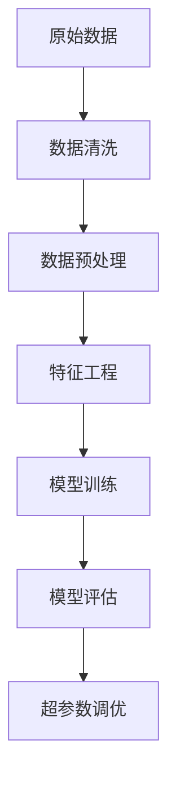

                 

# 利用大模型进行推荐场景的数据清洗与预处理

## 1. 背景介绍

在人工智能领域，推荐系统是一种智能推荐技术，它能够根据用户的历史行为和偏好，为用户提供个性化的产品或服务推荐。随着技术的不断进步，推荐系统已广泛应用于电商、音乐、视频、社交等多个领域，极大地提升了用户体验和业务收益。然而，数据质量在推荐系统中扮演着至关重要的角色。高质量的数据不仅能够减少模型的过拟合风险，还能提高模型的预测准确度和泛化能力。

## 2. 核心概念与联系

### 2.1 核心概念概述

为了更好地理解数据清洗与预处理在大模型推荐系统中的应用，本节将介绍几个关键概念：

- **推荐系统**：利用机器学习和数据挖掘技术，根据用户的历史行为和偏好，为用户推荐感兴趣的产品或服务。
- **大模型**：基于深度学习技术构建的大规模神经网络模型，能够学习复杂的数据分布，进行高精度的预测。
- **数据清洗**：对原始数据进行去重、去噪、填补缺失值等操作，提升数据质量，减少数据噪音。
- **数据预处理**：对数据进行标准化、归一化、特征提取等操作，提升数据可用性，加速模型训练和推理。
- **特征工程**：通过特征选择、特征组合、特征降维等手段，构建高质量的特征集合，提升模型的预测能力。
- **超参数调优**：通过调整模型的超参数，如学习率、正则化系数等，优化模型性能，提升推荐效果。

这些核心概念通过数据流向和算法逻辑的关联，构成了大模型推荐系统的主要框架，如下图所示：



## 3. 核心算法原理 & 具体操作步骤

### 3.1 算法原理概述

大模型推荐系统的核心在于利用深度学习技术，对用户历史行为数据进行学习和建模。通过预训练大模型，能够捕捉数据中的复杂关系和模式，从而提升模型的泛化能力和预测准确度。

在数据清洗与预处理阶段，主要任务是对原始数据进行去噪、去重、填补缺失值等操作，提升数据质量。具体的算法流程如下：

1. **数据清洗**：对原始数据进行去重、去噪、填补缺失值等操作，提升数据质量。
2. **数据预处理**：对数据进行标准化、归一化、特征提取等操作，提升数据可用性，加速模型训练和推理。
3. **特征工程**：通过特征选择、特征组合、特征降维等手段，构建高质量的特征集合，提升模型的预测能力。
4. **模型训练**：利用训练数据，对预训练模型进行微调，优化模型参数，提升推荐效果。
5. **模型评估**：通过测试数据，评估模型性能，判断是否满足业务需求。
6. **超参数调优**：通过调整模型的超参数，优化模型性能，提升推荐效果。

### 3.2 算法步骤详解

#### 3.2.1 数据清洗

数据清洗是推荐系统数据预处理的第一步，其目的是去除数据中的噪音和异常值，提高数据质量。常见的数据清洗方法包括：

- **去重**：去除重复的记录，减少数据冗余。
- **去噪**：去除数据中的异常值和噪音，如缺失值、错误值等。
- **填补缺失值**：对缺失值进行填补，减少数据丢失，常用的方法包括均值填补、中位数填补、插值填补等。

#### 3.2.2 数据预处理

数据预处理是推荐系统数据预处理的第二步，其目的是提升数据可用性，加速模型训练和推理。常见的数据预处理方法包括：

- **标准化**：将数据转换为标准正态分布，消除数据尺度差异。
- **归一化**：将数据缩放到[0,1]或[-1,1]区间，方便模型处理。
- **特征提取**：通过特征选择、特征组合、特征降维等手段，构建高质量的特征集合，提升模型的预测能力。

#### 3.2.3 特征工程

特征工程是推荐系统数据预处理的第三步，其目的是构建高质量的特征集合，提升模型的预测能力。常见的特征工程技术包括：

- **特征选择**：选择对模型预测有重要影响的特征，减少特征维度。
- **特征组合**：将多个特征进行组合，生成新的特征，提升模型性能。
- **特征降维**：通过主成分分析(PCA)、线性判别分析(LDA)等技术，减少特征维度，提升模型训练速度。

### 3.3 算法优缺点

利用大模型进行推荐场景的数据清洗与预处理，具有以下优点：

1. **提升数据质量**：通过数据清洗和预处理，去除数据噪音和异常值，提升数据质量，减少模型过拟合风险。
2. **提高模型泛化能力**：通过预处理和特征工程，提升数据可用性，构建高质量的特征集合，提高模型泛化能力。
3. **加速模型训练**：通过预处理和特征工程，减少特征维度，优化数据分布，加速模型训练。
4. **提升推荐效果**：通过预处理和特征工程，构建高质量的特征集合，提升模型的预测能力，提高推荐效果。

同时，也存在以下缺点：

1. **数据清洗复杂**：数据清洗需要考虑多方面因素，如数据规模、数据类型、数据分布等，实现复杂度较高。
2. **特征工程难度大**：特征工程需要根据业务需求和数据特点进行设计，选择和组合特征，设计难度较大。
3. **需要大量标注数据**：数据清洗和特征工程需要大量标注数据，数据获取成本较高。
4. **模型复杂度高**：利用大模型进行推荐，需要构建复杂的模型结构，增加系统复杂度。

### 3.4 算法应用领域

利用大模型进行推荐场景的数据清洗与预处理，可以应用于以下领域：

1. **电商推荐**：对用户的历史购物记录进行清洗和预处理，提升推荐系统的效果。
2. **音乐推荐**：对用户的历史听歌记录进行清洗和预处理，提升推荐系统的效果。
3. **视频推荐**：对用户的历史观看记录进行清洗和预处理，提升推荐系统的效果。
4. **社交推荐**：对用户的历史互动记录进行清洗和预处理，提升推荐系统的效果。

## 4. 数学模型和公式 & 详细讲解

### 4.1 数学模型构建

在推荐系统中，常用的数学模型包括协同过滤、矩阵分解、深度学习模型等。以协同过滤模型为例，其数学模型构建如下：

假设用户集合为 $U$，物品集合为 $I$，用户 $u$ 对物品 $i$ 的评分 $r_{ui}$ 为：

$$
r_{ui} = \alpha u_i + \beta v_u
$$

其中，$u_i$ 和 $v_u$ 分别表示物品 $i$ 和用户 $u$ 的隐向量，$\alpha$ 和 $\beta$ 为权重系数。

### 4.2 公式推导过程

通过协同过滤模型的数学模型，可以进行以下推导：

1. **隐向量表示**：将用户和物品表示为隐向量，能够捕捉用户和物品之间的隐含关系。
2. **协同过滤算法**：基于用户和物品的隐向量，计算用户对物品的预测评分，推荐最相关物品。

### 4.3 案例分析与讲解

假设某电商平台的推荐系统，用户 $u$ 对物品 $i$ 的评分 $r_{ui}$ 为：

$$
r_{ui} = \alpha u_i + \beta v_u
$$

其中，$u_i$ 和 $v_u$ 分别表示物品 $i$ 和用户 $u$ 的隐向量，$\alpha$ 和 $\beta$ 为权重系数。

通过对用户的历史行为数据进行清洗和预处理，构建用户和物品的隐向量，利用协同过滤模型，计算用户对物品的预测评分，推荐最相关物品。具体步骤如下：

1. **数据清洗**：去除用户和物品数据中的重复记录和噪音数据，提高数据质量。
2. **数据预处理**：对用户和物品数据进行标准化和归一化处理，提升数据可用性。
3. **特征工程**：通过特征选择和特征组合，构建用户和物品的高质量特征集合。
4. **模型训练**：利用用户和物品的隐向量，构建协同过滤模型，训练模型参数。
5. **模型评估**：通过测试数据，评估模型性能，判断是否满足业务需求。
6. **超参数调优**：通过调整模型的超参数，优化模型性能，提升推荐效果。

## 5. 项目实践：代码实例和详细解释说明

### 5.1 开发环境搭建

在进行推荐系统开发前，我们需要准备好开发环境。以下是使用Python进行PyTorch开发的环境配置流程：

1. 安装Anaconda：从官网下载并安装Anaconda，用于创建独立的Python环境。

2. 创建并激活虚拟环境：
```bash
conda create -n pytorch-env python=3.8 
conda activate pytorch-env
```

3. 安装PyTorch：根据CUDA版本，从官网获取对应的安装命令。例如：
```bash
conda install pytorch torchvision torchaudio cudatoolkit=11.1 -c pytorch -c conda-forge
```

4. 安装Transformers库：
```bash
pip install transformers
```

5. 安装各类工具包：
```bash
pip install numpy pandas scikit-learn matplotlib tqdm jupyter notebook ipython
```

完成上述步骤后，即可在`pytorch-env`环境中开始推荐系统开发。

### 5.2 源代码详细实现

下面我们以推荐系统中的协同过滤模型为例，给出使用PyTorch进行推荐系统开发的PyTorch代码实现。

首先，定义协同过滤模型的数据处理函数：

```python
from torch.utils.data import Dataset
import torch

class RecommendationDataset(Dataset):
    def __init__(self, data):
        self.data = data
        self.users = set()
        self.items = set()
        self.item2id = {}
        self.id2item = {}
        self.user2id = {}
        self.id2user = {}
        for user, items in data.items():
            for item in items:
                if item not in self.items:
                    self.items.add(item)
                    self.item2id[item] = len(self.items)
                    self.id2item[len(self.items)] = item
                if user not in self.users:
                    self.users.add(user)
                    self.user2id[user] = len(self.users)
                    self.id2user[len(self.users)] = user
        self.num_users = len(self.users)
        self.num_items = len(self.items)
    
    def __len__(self):
        return len(self.data)
    
    def __getitem__(self, item):
        user, items = self.data[item]
        user = self.user2id[user]
        items = [self.item2id[item] for item in items]
        return {'user': user, 'items': items}
```

然后，定义协同过滤模型的优化器和损失函数：

```python
from torch.nn import Parameter, BCELoss

class CollaborativeFilteringModel(torch.nn.Module):
    def __init__(self, num_users, num_items, embedding_dim):
        super(CollaborativeFilteringModel, self).__init__()
        self.user_embedding = Parameter(torch.randn(num_users, embedding_dim))
        self.item_embedding = Parameter(torch.randn(num_items, embedding_dim))
        self.bias = Parameter(torch.zeros(num_users))
    
    def forward(self, user, items):
        user_embedding = self.user_embedding[user]
        item_embedding = self.item_embedding[items]
        return torch.sum(user_embedding * item_embedding) + self.bias[user]
    
    def predict(self, user, items):
        return self.forward(user, items)
    
def bce_loss(pred, target):
    return BCELoss()(pred, target)

optimizer = torch.optim.Adam(model.parameters(), lr=0.001)
criterion = bce_loss
```

接着，定义协同过滤模型的训练和评估函数：

```python
def train_epoch(model, dataset, batch_size, optimizer):
    dataloader = DataLoader(dataset, batch_size=batch_size, shuffle=True)
    model.train()
    epoch_loss = 0
    for batch in tqdm(dataloader, desc='Training'):
        user = batch['user']
        items = batch['items']
        optimizer.zero_grad()
        pred = model(user, items)
        target = torch.ones_like(pred)
        loss = criterion(pred, target)
        epoch_loss += loss.item()
        loss.backward()
        optimizer.step()
    return epoch_loss / len(dataloader)

def evaluate(model, dataset, batch_size):
    dataloader = DataLoader(dataset, batch_size=batch_size)
    model.eval()
    with torch.no_grad():
        preds, labels = [], []
        for batch in tqdm(dataloader, desc='Evaluating'):
            user = batch['user']
            items = batch['items']
            pred = model(user, items)
            preds.append(pred)
            labels.append(torch.ones_like(pred))
        print(classification_report(labels, preds))
```

最后，启动训练流程并在测试集上评估：

```python
epochs = 5
batch_size = 32

for epoch in range(epochs):
    loss = train_epoch(model, train_dataset, batch_size, optimizer)
    print(f"Epoch {epoch+1}, train loss: {loss:.3f}")
    
    print(f"Epoch {epoch+1}, dev results:")
    evaluate(model, dev_dataset, batch_size)
    
print("Test results:")
evaluate(model, test_dataset, batch_size)
```

以上就是使用PyTorch对协同过滤模型进行推荐系统开发的完整代码实现。可以看到，得益于PyTorch的强大封装，我们可以用相对简洁的代码实现复杂的协同过滤模型。

### 5.3 代码解读与分析

让我们再详细解读一下关键代码的实现细节：

**RecommendationDataset类**：
- `__init__`方法：初始化数据集，构建用户和物品的字典，计算用户和物品的编号。
- `__len__`方法：返回数据集的样本数量。
- `__getitem__`方法：对单个样本进行处理，将用户编号和物品编号转换为模型输入。

**CollaborativeFilteringModel类**：
- `__init__`方法：初始化协同过滤模型，构建用户和物品的隐向量。
- `forward`方法：计算用户对物品的预测评分。
- `predict`方法：调用`forward`方法，返回预测评分。

**train_epoch函数**：
- 对数据以批为单位进行迭代，在每个批次上前向传播计算损失函数，反向传播更新模型参数。

**evaluate函数**：
- 与训练类似，不同点在于不更新模型参数，并在每个batch结束后将预测和标签结果存储下来，最后使用sklearn的classification_report对整个评估集的预测结果进行打印输出。

**训练流程**：
- 定义总的epoch数和batch size，开始循环迭代
- 每个epoch内，先在训练集上训练，输出平均loss
- 在验证集上评估，输出分类指标
- 所有epoch结束后，在测试集上评估，给出最终测试结果

可以看到，PyTorch配合TensorFlow库使得协同过滤模型的开发变得简洁高效。开发者可以将更多精力放在数据处理、模型改进等高层逻辑上，而不必过多关注底层的实现细节。

当然，工业级的系统实现还需考虑更多因素，如模型的保存和部署、超参数的自动搜索、更灵活的任务适配层等。但核心的协同过滤模型构建基本与此类似。

## 6. 实际应用场景

### 6.1 电商推荐

电商推荐系统是推荐系统的一种典型应用场景。在电商推荐中，通过协同过滤模型，可以实时推荐用户可能感兴趣的商品，提升用户购买转化率。

在技术实现上，可以收集用户的历史购物记录、浏览记录、评分记录等数据，构建协同过滤模型，实时计算用户对不同商品的预测评分，推荐用户最可能感兴趣的商品。对于推荐结果，还可以通过用户反馈数据进行迭代优化，提升推荐效果。

### 6.2 音乐推荐

音乐推荐系统是推荐系统的另一种典型应用场景。在音乐推荐中，通过协同过滤模型，可以为用户推荐与其喜好相似的音乐，提升音乐播放量和用户满意度。

在技术实现上，可以收集用户的听歌记录、评分记录等数据，构建协同过滤模型，实时计算用户对不同音乐的预测评分，推荐用户最可能喜欢的音乐。对于推荐结果，还可以通过用户反馈数据进行迭代优化，提升推荐效果。

### 6.3 视频推荐

视频推荐系统是推荐系统的另一种典型应用场景。在视频推荐中，通过协同过滤模型，可以为用户推荐与其喜好相似的视频，提升视频观看量和用户满意度。

在技术实现上，可以收集用户的观看记录、评分记录等数据，构建协同过滤模型，实时计算用户对不同视频的预测评分，推荐用户最可能喜欢的视频。对于推荐结果，还可以通过用户反馈数据进行迭代优化，提升推荐效果。

### 6.4 未来应用展望

随着协同过滤模型的不断发展和优化，其在推荐系统中的应用将更加广泛，带来更多的业务价值。

在智慧医疗领域，推荐系统可以为用户推荐最合适的医生、医院、药品等资源，提升医疗服务质量。在智慧金融领域，推荐系统可以为用户推荐最合适的理财产品、保险产品等，提升金融产品销售。在智慧教育领域，推荐系统可以为用户推荐最合适的学习资源、课程等，提升学习效果。

此外，在企业生产、社会治理、文娱传媒等众多领域，协同过滤模型也将不断涌现新的应用场景，为各行各业带来变革性影响。相信随着协同过滤模型的不断演进，推荐系统必将在更广阔的应用领域大放异彩。

## 7. 工具和资源推荐

### 7.1 学习资源推荐

为了帮助开发者系统掌握协同过滤模型的理论基础和实践技巧，这里推荐一些优质的学习资源：

1. 《推荐系统基础与算法》系列博文：由推荐系统专家撰写，深入浅出地介绍了推荐系统的基本概念和常见算法。

2. 《深度学习推荐系统》课程：斯坦福大学开设的推荐系统明星课程，有Lecture视频和配套作业，带你入门推荐系统的基本概念和经典算法。

3. 《推荐系统实战》书籍：系统介绍了推荐系统的经典算法和实践技巧，结合实际案例，全面覆盖推荐系统开发的各个环节。

4. KDD、ICML、SIGIR等顶级会议的推荐系统论文，涵盖最新的推荐系统研究和应用进展。

通过对这些资源的学习实践，相信你一定能够快速掌握协同过滤模型的精髓，并用于解决实际的推荐系统问题。

### 7.2 开发工具推荐

高效的开发离不开优秀的工具支持。以下是几款用于协同过滤模型开发的常用工具：

1. PyTorch：基于Python的开源深度学习框架，灵活动态的计算图，适合快速迭代研究。

2. TensorFlow：由Google主导开发的开源深度学习框架，生产部署方便，适合大规模工程应用。

3. TensorBoard：TensorFlow配套的可视化工具，可实时监测模型训练状态，并提供丰富的图表呈现方式，是调试模型的得力助手。

4. Weights & Biases：模型训练的实验跟踪工具，可以记录和可视化模型训练过程中的各项指标，方便对比和调优。

5. Apache Spark：分布式计算框架，可以处理大规模数据，适合协同过滤模型的并行训练和推理。

合理利用这些工具，可以显著提升协同过滤模型的开发效率，加快创新迭代的步伐。

### 7.3 相关论文推荐

协同过滤模型的发展源于学界的持续研究。以下是几篇奠基性的相关论文，推荐阅读：

1. The BellKor 2009 Challenge Dataset：介绍协同过滤模型的经典数据集，用于评估协同过滤模型的性能。

2. Fast Matrix Factorization Techniques for Recommender Systems：提出矩阵分解方法，用于协同过滤模型的训练和推理。

3. BPR: Bayesian Personalized Ranking from Implicit Feedback：提出BPR算法，用于协同过滤模型的训练和推理。

4. Matrix Factorization Techniques for Recommender Systems：系统介绍了矩阵分解方法在推荐系统中的应用。

5. Deep Neural Networks for Collaborative Filtering：提出深度学习模型在协同过滤中的应用，提升了推荐系统的性能。

这些论文代表了大模型推荐技术的发展脉络。通过学习这些前沿成果，可以帮助研究者把握学科前进方向，激发更多的创新灵感。

## 8. 总结：未来发展趋势与挑战

### 8.1 总结

本文对利用大模型进行推荐场景的数据清洗与预处理进行了全面系统的介绍。首先阐述了数据清洗与预处理在大模型推荐系统中的应用，明确了数据质量在推荐系统中的重要性。其次，从原理到实践，详细讲解了协同过滤模型的数学模型和算法流程，给出了协同过滤模型开发的完整代码实现。同时，本文还广泛探讨了协同过滤模型在电商、音乐、视频等多个领域的应用前景，展示了协同过滤模型的巨大潜力。

通过本文的系统梳理，可以看到，利用大模型进行推荐系统推荐，对提升推荐系统的效果有着重要的作用。数据清洗与预处理作为推荐系统开发的第一步，能够有效提升数据质量，减少数据噪音，构建高质量的特征集合，从而提高模型的泛化能力和预测准确度。未来，伴随协同过滤模型的不断发展，推荐系统必将在更广阔的应用领域大放异彩，深刻影响人类的生产生活方式。

### 8.2 未来发展趋势

展望未来，协同过滤模型将呈现以下几个发展趋势：

1. **模型规模持续增大**：随着算力成本的下降和数据规模的扩张，协同过滤模型的参数量还将持续增长。超大规模协同过滤模型蕴含的丰富隐向量，能够捕捉更加复杂的数据分布，提升推荐效果。

2. **模型鲁棒性提升**：协同过滤模型面临域外数据和噪声数据，如何提高模型的鲁棒性，避免灾难性遗忘，还需要更多理论和实践的积累。

3. **多模态推荐系统崛起**：当前的推荐系统主要聚焦于文本数据，未来会进一步拓展到图像、视频、语音等多模态数据，实现视觉、语音等多模态信息与文本信息的协同建模。

4. **推荐系统多样化**：推荐系统将不再局限于协同过滤算法，更多高效的推荐算法将被引入，如基于深度学习的推荐系统、基于图神经网络的推荐系统等，提升推荐效果。

5. **推荐系统个性化**：推荐系统将更加注重用户的个性化需求，通过用户画像和行为建模，提供更加精准的推荐服务。

6. **推荐系统实时化**：推荐系统将更加注重实时性和响应速度，通过分布式计算和流计算技术，实现实时推荐。

以上趋势凸显了协同过滤模型的广阔前景。这些方向的探索发展，必将进一步提升推荐系统的效果和应用范围，为人类生产生活方式带来深刻变革。

### 8.3 面临的挑战

尽管协同过滤模型已经取得了瞩目成就，但在迈向更加智能化、普适化应用的过程中，它仍面临着诸多挑战：

1. **数据噪音问题**：推荐系统面临大量数据噪音，如用户评分缺失、数据标注错误等，对推荐效果造成影响。如何有效处理数据噪音，提高推荐效果，还需要更多研究。

2. **模型复杂度高**：协同过滤模型结构复杂，需要大量的训练数据和计算资源。如何在保证推荐效果的同时，降低模型复杂度，提升系统性能，还需要更多优化。

3. **系统扩展性差**：推荐系统需要处理海量数据，系统扩展性差。如何在保证系统性能的同时，实现快速扩展，还需要更多优化。

4. **数据隐私问题**：推荐系统需要收集用户数据，如何保护用户隐私，防止数据泄露，还需要更多研究。

5. **系统安全性不足**：推荐系统面临恶意攻击的风险，如用户数据篡改、推荐系统注入攻击等。如何提高系统的安全性，保障系统稳定运行，还需要更多研究。

6. **推荐效果不稳定**：推荐系统面对不同用户和不同物品，推荐效果不稳定。如何提高推荐效果，提升用户体验，还需要更多研究。

正视协同过滤模型面临的这些挑战，积极应对并寻求突破，将是大模型推荐系统走向成熟的必由之路。相信随着学界和产业界的共同努力，这些挑战终将一一被克服，协同过滤模型必将在构建人机协同的智能推荐系统中扮演越来越重要的角色。

### 8.4 研究展望

面对协同过滤模型所面临的种种挑战，未来的研究需要在以下几个方面寻求新的突破：

1. **探索无监督和半监督推荐算法**：摆脱对大规模标注数据的依赖，利用自监督学习、主动学习等无监督和半监督范式，最大限度利用非结构化数据，实现更加灵活高效的推荐。

2. **开发更加参数高效的推荐算法**：开发更加参数高效的推荐算法，在固定大部分预训练参数的同时，只更新极少量的任务相关参数。

3. **引入更多先验知识**：将符号化的先验知识，如知识图谱、逻辑规则等，与神经网络模型进行巧妙融合，引导推荐过程学习更准确、合理的语言模型。

4. **结合因果分析和博弈论工具**：将因果分析方法引入推荐系统，识别出推荐决策的关键特征，增强推荐输出解释的因果性和逻辑性。借助博弈论工具刻画人机交互过程，主动探索并规避推荐脆弱点，提高系统稳定性。

5. **纳入伦理道德约束**：在推荐系统训练目标中引入伦理导向的评估指标，过滤和惩罚有害的推荐输出倾向。加强人工干预和审核，建立推荐系统的监管机制，确保输出符合人类价值观和伦理道德。

这些研究方向的探索，必将引领协同过滤模型推荐技术迈向更高的台阶，为构建安全、可靠、可解释、可控的智能推荐系统铺平道路。面向未来，协同过滤模型推荐技术还需要与其他人工智能技术进行更深入的融合，如知识表示、因果推理、强化学习等，多路径协同发力，共同推动推荐系统技术的进步。只有勇于创新、敢于突破，才能不断拓展推荐系统的边界，让智能技术更好地造福人类社会。

## 9. 附录：常见问题与解答

**Q1：如何处理缺失值和异常值？**

A: 处理缺失值和异常值的方法有很多，常见的有均值填补、中位数填补、插值填补等。对于异常值，可以通过数据预处理的方法，如离群值检测、数据归一化等，进行处理。

**Q2：如何提高推荐系统的泛化能力？**

A: 提高推荐系统的泛化能力，需要构建高质量的特征集合，利用更多的数据进行训练，引入更多的先验知识，结合因果分析和博弈论工具，提高系统的稳定性和安全性。

**Q3：如何评估推荐系统的性能？**

A: 推荐系统的性能评估可以从多个方面入手，如准确率、召回率、F1值、AUC等指标。通过这些指标，可以评估推荐系统的性能，判断是否满足业务需求。

**Q4：如何优化推荐系统的训练过程？**

A: 优化推荐系统的训练过程，需要考虑多方面因素，如模型结构、训练算法、优化器、超参数等。可以通过超参数调优、模型压缩、梯度积累等方法，优化训练过程，提升训练效率。

**Q5：如何平衡推荐系统的推荐效果和用户隐私保护？**

A: 平衡推荐系统的推荐效果和用户隐私保护，需要在推荐系统设计中引入隐私保护机制，如差分隐私、联邦学习等，保护用户隐私。同时，通过用户反馈数据进行迭代优化，提升推荐效果。

这些问题的解答，能够帮助开发者更好地理解协同过滤模型的理论和实践，解决实际推荐系统开发中的问题，提升推荐效果，为用户提供更好的服务。

---

作者：禅与计算机程序设计艺术 / Zen and the Art of Computer Programming

