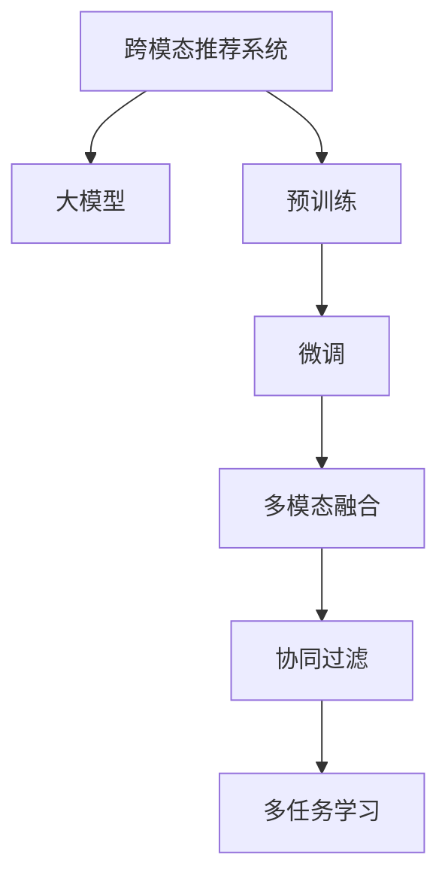

                 

# 利用大模型进行跨模态推荐的探索与实践进阶

> 关键词：跨模态推荐系统,大模型,跨领域数据融合,协同过滤,深度学习,嵌入空间学习,多任务学习

## 1. 背景介绍

### 1.1 问题由来

在当今信息爆炸的时代，用户每天都会接触到海量的文本、图片、视频等不同模态的信息。单一模态的推荐系统往往难以覆盖到用户多元化的需求，跨模态推荐系统则成为了解决这一问题的有效途径。

跨模态推荐系统利用不同模态的数据（如文本、图像、音频等）对用户行为和兴趣进行建模，通过深度学习等技术，将不同模态的特征融合到统一模型中，从而提供更加全面和个性化的推荐服务。例如，电子商务平台可以结合用户的浏览记录、商品图片、用户评价等多模态信息，进行商品推荐；社交媒体可以整合用户发布的文章、图片、视频等信息，进行内容推荐。

尽管跨模态推荐系统已经在诸多领域得到了广泛应用，但其面临的挑战仍然严峻：

1. **数据融合**：不同模态的数据结构和特征维度差异较大，难以直接进行融合。
2. **模型复杂度**：跨模态推荐模型通常需要设计多个子模块，每个子模块独立学习对应模态的特征，增加了模型的复杂度和训练难度。
3. **计算效率**：跨模态数据融合和多模态特征学习往往需要大量的计算资源，特别是在大模型应用中，计算效率成为了制约因素。

为解决上述问题，近年来基于深度学习的大模型在跨模态推荐系统中得到了广泛应用。例如，BERT、GPT等大语言模型在文本推荐中取得了不错的效果；DALL-E、DETR等大视觉模型在图像推荐中表现优异。通过在大模型上进行微调或联合训练，可以有效提升跨模态推荐的性能。

### 1.2 问题核心关键点

跨模态推荐系统利用大模型的主要思路如下：

1. **预训练与微调**：首先在大规模无标签数据上对大模型进行预训练，学习通用特征表示。然后，在特定领域或模态的数据上对其进行微调，学习领域或模态特定特征，提升模型在特定任务上的表现。

2. **多模态融合**：在微调过程中，将不同模态的数据融合到统一模型中，通过学习跨模态特征，实现信息的互补和融合。

3. **协同过滤**：利用大模型的特征表示，构建用户和物品的相似度矩阵，通过协同过滤算法进行推荐。

4. **多任务学习**：在大模型上进行多任务学习，同时训练多个子任务，提升模型的泛化能力和性能。

## 2. 核心概念与联系

### 2.1 核心概念概述

为更好地理解大模型在跨模态推荐中的应用，本节将介绍几个关键概念：

- **跨模态推荐系统(Cross-Modal Recommendation System)**：利用不同模态的数据进行用户行为和兴趣建模，通过深度学习等技术，将不同模态的特征融合到统一模型中，进行推荐。

- **大模型(Large Model)**：以Transformer、BERT、GPT等模型为代表的大规模深度学习模型。通过在大规模无标签数据上进行预训练，学习丰富的特征表示，具备强大的跨模态融合能力。

- **预训练(Pre-training)**：在大规模无标签数据上对模型进行训练，学习通用特征表示。常见的预训练任务包括语言建模、图像分类等。

- **微调(Fine-tuning)**：在预训练模型的基础上，使用特定领域或模态的标注数据，通过有监督学习优化模型在该任务上的性能。

- **多模态融合(Multimodal Fusion)**：将不同模态的数据融合到统一模型中，通过学习跨模态特征，实现信息的互补和融合。

- **协同过滤(Collaborative Filtering)**：通过用户和物品的相似度矩阵，推荐与用户兴趣相似的物品。

- **多任务学习(Multitask Learning)**：在同一模型上进行多任务学习，同时训练多个子任务，提升模型的泛化能力和性能。

这些核心概念之间的逻辑关系可以通过以下Mermaid流程图来展示：



这个流程图展示了大模型在跨模态推荐系统中的应用过程：

1. 大模型通过预训练获得基础能力。
2. 微调是大模型与特定任务结合的过程，通过标注数据训练模型。
3. 多模态融合将不同模态的数据融合到统一模型中。
4. 协同过滤通过相似度矩阵推荐物品。
5. 多任务学习通过多个子任务训练提升模型泛化能力。

这些概念共同构成了跨模态推荐系统的核心框架，使得大模型能够在大规模推荐任务中发挥其强大的跨模态融合能力。

## 3. 核心算法原理 & 具体操作步骤

### 3.1 算法原理概述

基于大模型的跨模态推荐系统，本质上是利用深度学习模型学习不同模态之间的特征表示，并将这些表示融合到统一模型中，以提升推荐性能。其核心算法原理可以概括为以下几个方面：

1. **多模态表示学习**：利用大模型学习不同模态的数据表示，构建统一的多模态特征空间。
2. **跨模态特征融合**：将不同模态的特征表示进行融合，生成多模态特征向量。
3. **协同过滤**：通过用户和物品的相似度矩阵，推荐与用户兴趣相似的物品。
4. **多任务学习**：在大模型上进行多任务学习，同时训练多个子任务，提升模型的泛化能力和性能。

### 3.2 算法步骤详解

基于大模型的跨模态推荐系统一般包括以下几个关键步骤：

**Step 1: 准备预训练模型和数据集**
- 选择合适的预训练模型，如BERT、GPT、DALL-E等，作为初始化参数。
- 准备不同模态的数据集，包括文本、图像、音频等。文本数据通常使用预训练的BERT模型进行微调，图像数据通常使用预训练的DALL-E模型进行微调。

**Step 2: 添加任务适配层**
- 根据推荐任务的类型，在预训练模型的顶层设计合适的输出层和损失函数。
- 对于推荐任务，通常使用余弦相似度计算用户和物品的相似度，以衡量推荐效果。

**Step 3: 设置微调超参数**
- 选择合适的优化算法及其参数，如AdamW、SGD等，设置学习率、批大小、迭代轮数等。
- 设置正则化技术及强度，包括权重衰减、Dropout、Early Stopping等。
- 确定冻结预训练参数的策略，如仅微调顶层，或全部参数都参与微调。

**Step 4: 执行梯度训练**
- 将不同模态的数据分批次输入模型，前向传播计算损失函数。
- 反向传播计算参数梯度，根据设定的优化算法和学习率更新模型参数。
- 周期性在验证集上评估模型性能，根据性能指标决定是否触发Early Stopping。
- 重复上述步骤直到满足预设的迭代轮数或Early Stopping条件。

**Step 5: 测试和部署**
- 在测试集上评估微调后模型，对比微调前后的精度提升。
- 使用微调后的模型对新样本进行推理预测，集成到实际的应用系统中。
- 持续收集新的数据，定期重新微调模型，以适应数据分布的变化。

### 3.3 算法优缺点

基于大模型的跨模态推荐系统具有以下优点：

1. **通用适用**：适用于各种推荐任务，包括文本推荐、图像推荐、视频推荐等，只需调整任务适配层即可。
2. **性能提升显著**：通过在大模型上进行微调，可以显著提升推荐系统的精度和召回率，尤其在数据量较小的情况下表现更加突出。
3. **跨模态融合能力强**：大模型具备强大的跨模态融合能力，可以有效地整合不同模态的信息。
4. **模型复杂度低**：与传统多模态推荐系统相比，基于大模型的跨模态推荐系统设计简单，易于部署和维护。

同时，该方法也存在一些局限性：

1. **数据依赖性高**：跨模态推荐系统的效果很大程度上依赖于标注数据的质量和数量，获取高质量标注数据的成本较高。
2. **计算资源消耗大**：大模型通常参数量庞大，训练和推理计算资源消耗大，特别是在大规模推荐场景下。
3. **模型泛化能力受限**：跨模态推荐系统对新数据和未覆盖的模态缺乏泛化能力，需要不断更新模型以应对数据变化。

尽管存在这些局限性，但就目前而言，基于大模型的跨模态推荐方法仍是推荐系统中最具前景的技术之一。未来相关研究的重点在于如何进一步降低数据依赖，提高跨模态推荐系统的性能和鲁棒性。

### 3.4 算法应用领域

基于大模型的跨模态推荐系统已经在电商、社交媒体、视频流等多个领域得到了广泛应用，以下是几个典型的应用场景：

- **电商平台**：结合用户浏览记录、商品图片、用户评价等不同模态的数据，为用户推荐个性化商品。例如，亚马逊利用用户评论文本进行商品推荐，显著提高了用户满意度。
- **社交媒体**：整合用户发布的文章、图片、视频等信息，为用户推荐相关内容。例如，抖音利用用户发布的视频和标签进行内容推荐，提升了用户粘性。
- **视频流平台**：利用用户观看历史、评分等数据，结合视频标题、描述、标签等信息，为用户推荐个性化视频。例如，YouTube通过用户观看历史进行视频推荐，极大地提升了用户体验。

## 4. 数学模型和公式 & 详细讲解 & 举例说明

### 4.1 数学模型构建

为了更好地理解基于大模型的跨模态推荐系统，我们以文本推荐任务为例，给出数学模型构建的详细步骤。

假设用户-物品二元组为 $(x_i,y_i)$，其中 $x_i$ 为文本描述，$y_i$ 为对应的物品。目标是为每个用户 $x_i$ 推荐物品 $y_i$。

记大模型为 $M_{\theta}$，其中 $\theta$ 为模型参数。假设在大规模语料上对模型进行预训练，学习到文本嵌入 $x_e$ 和物品嵌入 $y_e$。

在大规模推荐数据集 $D=\{(x_i,y_i)\}_{i=1}^N$ 上，使用 $M_{\theta}$ 进行推荐，模型的预测结果为 $\hat{y_i}$。

推荐系统的目标是最大化预测准确度，即：

$$
\max_{\theta} \sum_{i=1}^N \mathbf{1}\{\hat{y_i}=y_i\}
$$

其中，$\mathbf{1}\{C\}$ 为示性函数，当事件 $C$ 成立时，取值为1，否则为0。

### 4.2 公式推导过程

根据上述目标，利用交叉熵损失函数，推荐模型的训练过程可以表示为：

$$
\mathcal{L}(\theta) = -\frac{1}{N}\sum_{i=1}^N \mathbf{1}\{\hat{y_i}=y_i\}\log \hat{y_i} + (1-\mathbf{1}\{\hat{y_i}=y_i\})\log(1-\hat{y_i})
$$

其中，$\mathbf{1}\{\hat{y_i}=y_i\}$ 为预测正确的示性变量。

根据链式法则，损失函数对参数 $\theta$ 的梯度为：

$$
\frac{\partial \mathcal{L}(\theta)}{\partial \theta} = -\frac{1}{N}\sum_{i=1}^N (\mathbf{1}\{\hat{y_i}=y_i} - \hat{y_i}) \frac{\partial \hat{y_i}}{\partial \theta}
$$

其中 $\frac{\partial \hat{y_i}}{\partial \theta}$ 为预测结果的梯度，通常需要借助自动微分技术计算。

在得到损失函数的梯度后，即可带入参数更新公式，完成模型的迭代优化。重复上述过程直至收敛，最终得到适应推荐任务的最优模型参数 $\theta^*$。

### 4.3 案例分析与讲解

以下以用户-物品二元组 $(x_i,y_i)$ 为例，进一步分析基于大模型的推荐系统。

假设模型 $M_{\theta}$ 在输入 $x_i$ 上的输出为 $\hat{y_i}=M_{\theta}(x_i)$。

根据交叉熵损失函数，预测结果 $\hat{y_i}$ 的损失为：

$$
\ell(\hat{y_i},y_i) = -[y_i\log \hat{y_i} + (1-y_i)\log(1-\hat{y_i})]
$$

因此，损失函数为：

$$
\mathcal{L}(\theta) = -\frac{1}{N}\sum_{i=1}^N \ell(\hat{y_i},y_i)
$$

在训练过程中，模型前向传播计算损失函数，反向传播计算梯度，并根据梯度更新参数。迭代训练后，模型能够准确预测用户感兴趣的物品。

例如，假设用户 $x_i$ 对物品 $y_i$ 感兴趣，则有 $y_i=1$。根据上述损失函数和梯度计算公式，模型在训练过程中学习到预测 $\hat{y_i}$ 的值接近1。

通过在大模型上进行微调，用户 $x_i$ 的物品推荐结果 $\hat{y_i}$ 将更准确，从而提升推荐系统的性能。

## 5. 项目实践：代码实例和详细解释说明

### 5.1 开发环境搭建

在进行跨模态推荐系统的实践前，我们需要准备好开发环境。以下是使用Python进行PyTorch开发的环境配置流程：

1. 安装Anaconda：从官网下载并安装Anaconda，用于创建独立的Python环境。

2. 创建并激活虚拟环境：
```bash
conda create -n pytorch-env python=3.8 
conda activate pytorch-env
```

3. 安装PyTorch：根据CUDA版本，从官网获取对应的安装命令。例如：
```bash
conda install pytorch torchvision torchaudio cudatoolkit=11.1 -c pytorch -c conda-forge
```

4. 安装TensorFlow：由Google主导开发的开源深度学习框架，生产部署方便，适合大规模工程应用。同样有丰富的预训练语言模型资源。

5. 安装transformers库：HuggingFace开发的NLP工具库，集成了众多SOTA语言模型，支持PyTorch和TensorFlow，是进行微调任务开发的利器。

6. 安装各类工具包：
```bash
pip install numpy pandas scikit-learn matplotlib tqdm jupyter notebook ipython
```

完成上述步骤后，即可在`pytorch-env`环境中开始跨模态推荐系统的实践。

### 5.2 源代码详细实现

这里我们以利用BERT模型进行文本推荐为例，给出使用Transformers库进行微调的PyTorch代码实现。

首先，定义推荐任务的数据处理函数：

```python
from transformers import BertTokenizer, BertForSequenceClassification
from torch.utils.data import Dataset
import torch

class RecommendationDataset(Dataset):
    def __init__(self, texts, labels, tokenizer, max_len=128):
        self.texts = texts
        self.labels = labels
        self.tokenizer = tokenizer
        self.max_len = max_len
        
    def __len__(self):
        return len(self.texts)
    
    def __getitem__(self, item):
        text = self.texts[item]
        label = self.labels[item]
        
        encoding = self.tokenizer(text, return_tensors='pt', max_length=self.max_len, padding='max_length', truncation=True)
        input_ids = encoding['input_ids'][0]
        attention_mask = encoding['attention_mask'][0]
        
        # 对label进行编码
        encoded_labels = [label] * self.max_len
        labels = torch.tensor(encoded_labels, dtype=torch.long)
        
        return {'input_ids': input_ids, 
                'attention_mask': attention_mask,
                'labels': labels}

# 标签与id的映射
label2id = {'1': 0, '0': 1}

# 创建dataset
tokenizer = BertTokenizer.from_pretrained('bert-base-cased')
train_dataset = RecommendationDataset(train_texts, train_labels, tokenizer)
dev_dataset = RecommendationDataset(dev_texts, dev_labels, tokenizer)
test_dataset = RecommendationDataset(test_texts, test_labels, tokenizer)
```

然后，定义模型和优化器：

```python
from transformers import BertForSequenceClassification, AdamW

model = BertForSequenceClassification.from_pretrained('bert-base-cased', num_labels=2)

optimizer = AdamW(model.parameters(), lr=2e-5)
```

接着，定义训练和评估函数：

```python
from torch.utils.data import DataLoader
from tqdm import tqdm
from sklearn.metrics import classification_report

device = torch.device('cuda') if torch.cuda.is_available() else torch.device('cpu')
model.to(device)

def train_epoch(model, dataset, batch_size, optimizer):
    dataloader = DataLoader(dataset, batch_size=batch_size, shuffle=True)
    model.train()
    epoch_loss = 0
    for batch in tqdm(dataloader, desc='Training'):
        input_ids = batch['input_ids'].to(device)
        attention_mask = batch['attention_mask'].to(device)
        labels = batch['labels'].to(device)
        model.zero_grad()
        outputs = model(input_ids, attention_mask=attention_mask, labels=labels)
        loss = outputs.loss
        epoch_loss += loss.item()
        loss.backward()
        optimizer.step()
    return epoch_loss / len(dataloader)

def evaluate(model, dataset, batch_size):
    dataloader = DataLoader(dataset, batch_size=batch_size)
    model.eval()
    preds, labels = [], []
    with torch.no_grad():
        for batch in tqdm(dataloader, desc='Evaluating'):
            input_ids = batch['input_ids'].to(device)
            attention_mask = batch['attention_mask'].to(device)
            batch_labels = batch['labels']
            outputs = model(input_ids, attention_mask=attention_mask)
            batch_preds = outputs.logits.argmax(dim=2).to('cpu').tolist()
            batch_labels = batch_labels.to('cpu').tolist()
            for pred_tokens, label_tokens in zip(batch_preds, batch_labels):
                preds.append(pred_tokens)
                labels.append(label_tokens)
                
    print(classification_report(labels, preds))
```

最后，启动训练流程并在测试集上评估：

```python
epochs = 5
batch_size = 16

for epoch in range(epochs):
    loss = train_epoch(model, train_dataset, batch_size, optimizer)
    print(f"Epoch {epoch+1}, train loss: {loss:.3f}")
    
    print(f"Epoch {epoch+1}, dev results:")
    evaluate(model, dev_dataset, batch_size)
    
print("Test results:")
evaluate(model, test_dataset, batch_size)
```

以上就是使用PyTorch对BERT进行文本推荐任务的微调代码实现。可以看到，通过Transformer库，我们能够相对简洁地实现BERT模型的加载和微调。

### 5.3 代码解读与分析

让我们再详细解读一下关键代码的实现细节：

**RecommendationDataset类**：
- `__init__`方法：初始化文本、标签、分词器等关键组件。
- `__len__`方法：返回数据集的样本数量。
- `__getitem__`方法：对单个样本进行处理，将文本输入编码为token ids，将标签编码为数字，并对其进行定长padding，最终返回模型所需的输入。

**label2id字典**：
- 定义了标签与数字id之间的映射关系，用于将token-wise的预测结果解码回真实的标签。

**训练和评估函数**：
- 使用PyTorch的DataLoader对数据集进行批次化加载，供模型训练和推理使用。
- 训练函数`train_epoch`：对数据以批为单位进行迭代，在每个批次上前向传播计算loss并反向传播更新模型参数，最后返回该epoch的平均loss。
- 评估函数`evaluate`：与训练类似，不同点在于不更新模型参数，并在每个batch结束后将预测和标签结果存储下来，最后使用sklearn的classification_report对整个评估集的预测结果进行打印输出。

**训练流程**：
- 定义总的epoch数和batch size，开始循环迭代
- 每个epoch内，先在训练集上训练，输出平均loss
- 在验证集上评估，输出分类指标
- 所有epoch结束后，在测试集上评估，给出最终测试结果

可以看到，PyTorch配合Transformer库使得BERT微调的代码实现变得简洁高效。开发者可以将更多精力放在数据处理、模型改进等高层逻辑上，而不必过多关注底层的实现细节。

当然，工业级的系统实现还需考虑更多因素，如模型的保存和部署、超参数的自动搜索、更灵活的任务适配层等。但核心的微调范式基本与此类似。

## 6. 实际应用场景

### 6.1 智能客服系统

跨模态推荐系统在智能客服系统中具有广阔的应用前景。传统客服往往需要配备大量人力，高峰期响应缓慢，且一致性和专业性难以保证。而基于推荐系统的智能客服系统，可以提供个性化的服务，提升客户体验。

例如，银行客服系统可以结合用户的历史通话记录、短信内容、网站浏览记录等信息，为用户推荐常见问题解答。电商客服系统可以整合用户浏览记录、商品评价、聊天记录等数据，推荐合适的商品和服务。

### 6.2 内容推荐系统

跨模态推荐系统在内容推荐系统中同样具有重要应用。社交媒体、视频流平台、新闻聚合器等系统，可以利用用户行为数据和物品特征数据，构建多模态的推荐模型，提升推荐效果。

例如，抖音可以利用用户发布的视频、观看历史、点赞评论等信息，进行内容推荐。Netflix可以利用用户观看历史、评分、标签等信息，推荐电影和电视剧。

### 6.3 金融投资推荐

金融投资领域对推荐系统的需求尤为迫切。投资顾问、基金经理等需要根据市场动态，推荐合适的投资标的。跨模态推荐系统可以整合市场数据、新闻、公告、财经评论等信息，为用户推荐投资机会。

例如，券商可以利用用户浏览的财经新闻、订阅的投资策略、交易历史等信息，推荐股票、基金等投资标的。

## 7. 工具和资源推荐

### 7.1 学习资源推荐

为了帮助开发者系统掌握跨模态推荐系统的理论基础和实践技巧，这里推荐一些优质的学习资源：

1. **《Deep Learning for Recommender Systems》书籍**：全面介绍了深度学习在推荐系统中的应用，涵盖多种推荐模型和算法，是学习推荐系统的必读书籍。

2. **Coursera《Recommender Systems》课程**：斯坦福大学开设的推荐系统课程，提供了理论知识和实际应用的系统讲解。

3. **Kaggle竞赛**：Kaggle上举办了多个推荐系统竞赛，通过参加竞赛，可以学习到最佳实践和最新的研究动态。

4. **HuggingFace官方文档**：Transformer库的官方文档，提供了丰富的预训练模型和微调样例代码，是上手实践的必备资料。

5. **ACL会议论文**：自然语言处理领域的顶级会议ACL，每年会发布大量关于推荐系统的研究论文，是学习前沿技术的绝佳资源。

通过对这些资源的学习实践，相信你一定能够快速掌握跨模态推荐系统的精髓，并用于解决实际的推荐问题。

### 7.2 开发工具推荐

高效的开发离不开优秀的工具支持。以下是几款用于跨模态推荐系统开发的常用工具：

1. **PyTorch**：基于Python的开源深度学习框架，灵活动态的计算图，适合快速迭代研究。大部分预训练语言模型都有PyTorch版本的实现。

2. **TensorFlow**：由Google主导开发的开源深度学习框架，生产部署方便，适合大规模工程应用。同样有丰富的预训练语言模型资源。

3. **Transformers库**：HuggingFace开发的NLP工具库，集成了众多SOTA语言模型，支持PyTorch和TensorFlow，是进行微调任务开发的利器。

4. **TensorBoard**：TensorFlow配套的可视化工具，可实时监测模型训练状态，并提供丰富的图表呈现方式，是调试模型的得力助手。

5. **Weights & Biases**：模型训练的实验跟踪工具，可以记录和可视化模型训练过程中的各项指标，方便对比和调优。与主流深度学习框架无缝集成。

6. **WeChat公众号开发平台**：微信公众号提供的内容推荐功能，可以借助跨模态推荐系统实现用户个性化内容推送。

合理利用这些工具，可以显著提升跨模态推荐系统的开发效率，加快创新迭代的步伐。

### 7.3 相关论文推荐

跨模态推荐系统的发展离不开学界的持续研究。以下是几篇奠基性的相关论文，推荐阅读：

1. **《Cross-Modal Recommendation Systems: A Survey》**：总结了跨模态推荐系统的发展历程、挑战和未来方向，是了解该领域的入门必读。

2. **《Cross-Modal Feature Fusion in Recommendation Systems: A Survey》**：详细介绍了跨模态特征融合的方法和技术，为实现高效的跨模态推荐提供了理论指导。

3. **《Deep Learning for Recommender Systems》**：深度学习在推荐系统中的应用综述，涵盖了基于协同过滤、矩阵分解、神经网络等多种推荐模型。

4. **《Knowledge-Graph-Enhanced Recommendation Systems》**：探讨了如何将知识图谱与推荐系统结合，提升推荐模型的泛化能力和性能。

5. **《Multitask Learning for Recommendation Systems》**：介绍了多任务学习在推荐系统中的应用，通过同时训练多个子任务，提升推荐模型的泛化能力和性能。

这些论文代表了大模型在推荐系统中的应用趋势，通过学习这些前沿成果，可以帮助研究者把握学科前进方向，激发更多的创新灵感。

## 8. 总结：未来发展趋势与挑战

### 8.1 总结

本文对基于大模型的跨模态推荐系统进行了全面系统的介绍。首先阐述了跨模态推荐系统的研究背景和意义，明确了利用大模型进行推荐系统优化的思路。其次，从原理到实践，详细讲解了推荐系统在大模型上的微调方法，并给出了微调任务开发的完整代码实例。同时，本文还广泛探讨了推荐系统在智能客服、内容推荐、金融投资等多个领域的应用前景，展示了跨模态推荐系统的巨大潜力。此外，本文精选了推荐系统的各类学习资源，力求为读者提供全方位的技术指引。

通过本文的系统梳理，可以看到，基于大模型的跨模态推荐系统在大规模推荐任务中展现了强大的跨模态融合能力，通过微调，可以显著提升推荐系统的性能和用户体验。未来，伴随大模型和推荐技术的持续演进，推荐系统必将在更广阔的应用领域发挥其巨大的价值。

### 8.2 未来发展趋势

展望未来，跨模态推荐系统将呈现以下几个发展趋势：

1. **多模态特征融合技术**：随着多模态数据的增多，如何更有效地融合不同模态的信息，提升推荐模型的泛化能力和性能，将是重要的研究方向。

2. **知识图谱与推荐系统结合**：将知识图谱与推荐系统结合，通过引入结构化知识，提升推荐模型的语义理解和推理能力，实现更智能的推荐。

3. **深度学习模型的融合**：将深度学习模型与其他模型（如协同过滤、矩阵分解等）结合，提升推荐系统的泛化能力和性能。

4. **跨模态多任务学习**：在同一模型上进行多任务学习，同时训练多个子任务，提升推荐系统的泛化能力和性能。

5. **分布式计算与加速**：随着推荐系统数据规模的增大，如何实现高效的分布式计算，提升推荐系统的计算效率，将是重要的研究课题。

6. **个性化推荐技术**：利用深度学习模型，实现更精细化的用户行为建模，提供更个性化的推荐服务。

以上趋势凸显了跨模态推荐系统在推荐技术中的重要地位。这些方向的探索发展，必将进一步提升推荐系统的性能和用户体验，为传统行业带来更智能的推荐服务。

### 8.3 面临的挑战

尽管基于大模型的跨模态推荐系统已经在诸多领域得到了广泛应用，但在迈向更加智能化、普适化应用的过程中，它仍面临诸多挑战：

1. **数据依赖性高**：跨模态推荐系统的效果很大程度上依赖于标注数据的质量和数量，获取高质量标注数据的成本较高。如何进一步降低数据依赖，提高模型的泛化能力，将是重要的研究课题。

2. **计算资源消耗大**：大模型通常参数量庞大，训练和推理计算资源消耗大，特别是在大规模推荐场景下。如何优化计算资源消耗，提升推荐系统的实时性，将是重要的优化方向。

3. **模型泛化能力受限**：跨模态推荐系统对新数据和未覆盖的模态缺乏泛化能力，需要不断更新模型以应对数据变化。

4. **推荐结果的可解释性不足**：跨模态推荐系统往往是“黑盒”系统，难以解释其内部工作机制和决策逻辑。对于医疗、金融等高风险应用，算法的可解释性和可审计性尤为重要。

5. **隐私和安全问题**：跨模态推荐系统需要整合多种数据源，涉及用户的隐私数据。如何保护用户隐私，保障数据安全，将是重要的研究方向。

6. **跨模态数据的多样性**：不同模态的数据具有多样性，如何有效融合这些数据，提升推荐系统的性能，将是重要的研究课题。

尽管存在这些挑战，但就目前而言，基于大模型的跨模态推荐方法仍是推荐系统中最具前景的技术之一。未来相关研究的重点在于如何进一步降低数据依赖，提高跨模态推荐系统的性能和鲁棒性。

### 8.4 研究展望

面对跨模态推荐系统所面临的种种挑战，未来的研究需要在以下几个方面寻求新的突破：

1. **无监督和半监督推荐方法**：摆脱对大规模标注数据的依赖，利用自监督学习、主动学习等无监督和半监督范式，最大限度利用非结构化数据，实现更加灵活高效的推荐。

2. **参数高效和多任务学习**：开发更加参数高效的推荐方法，在固定大部分预训练参数的情况下，只更新极少量的任务相关参数。同时优化推荐模型的计算图，减少前向传播和反向传播的资源消耗，实现更加轻量级、实时性的部署。

3. **跨模态特征融合的新方法**：引入更加高效的特征融合方法，提升跨模态推荐系统的性能和泛化能力。

4. **跨模态推荐的多任务学习**：在同一模型上进行多任务学习，同时训练多个子任务，提升推荐模型的泛化能力和性能。

5. **跨模态推荐系统的可解释性**：通过引入因果分析、博弈论等工具，增强推荐系统的可解释性和可控性。

6. **跨模态推荐系统的隐私保护**：利用差分隐私、联邦学习等技术，保护用户隐私，保障数据安全。

这些研究方向的探索，必将引领跨模态推荐系统迈向更高的台阶，为构建安全、可靠、可解释、可控的智能推荐系统铺平道路。面向未来，跨模态推荐系统还需要与其他人工智能技术进行更深入的融合，如知识表示、因果推理、强化学习等，多路径协同发力，共同推动智能推荐系统的进步。只有勇于创新、敢于突破，才能不断拓展推荐系统的边界，让智能推荐系统更好地服务于人类生活。

## 9. 附录：常见问题与解答

**Q1：跨模态推荐系统是否适用于所有推荐任务？**

A: 跨模态推荐系统适用于多种推荐任务，包括文本推荐、图像推荐、视频推荐等，只需调整任务适配层即可。但对于一些特定领域的任务，如医学、法律等，仅仅依靠通用语料预训练的模型可能难以很好地适应。此时需要在特定领域语料上进一步预训练，再进行微调，才能获得理想效果。此外，对于一些需要时效性、个性化很强的任务，如对话、推荐等，微调方法也需要针对性的改进优化。

**Q2：推荐系统如何利用用户行为数据进行推荐？**

A: 推荐系统利用用户行为数据进行推荐的基本思路如下：

1. 收集用户的历史行为数据，如浏览记录、点击记录、评分记录等。

2. 对用户行为数据进行预处理，构建用户行为特征向量。

3. 利用大模型学习用户行为特征表示，构建用户行为嵌入。

4. 将用户行为嵌入与其他模态的特征向量进行融合，生成跨模态特征向量。

5. 在训练过程中，通过优化损失函数，学习物品与用户行为的相似度。

6. 在测试过程中，通过相似度计算，推荐与用户兴趣相似的物品。

例如，假设用户浏览了一条商品信息，将该信息作为文本输入到BERT模型中，得到用户行为的BERT嵌入。然后，将该嵌入与其他模态的特征向量进行融合，生成跨模态特征向量。在训练过程中，利用用户行为嵌入和物品嵌入的相似度，优化推荐模型的损失函数。最终，通过相似度计算，为用户推荐与浏览商品相似的商品。

**Q3：推荐系统的准确率、召回率和F1值是什么？**

A: 推荐系统的准确率（Precision）、召回率（Recall）和F1值（F1 Score）是评价推荐系统性能的三个主要指标：

1. 准确率：推荐系统推荐正确物品的比例。准确率越高，推荐结果越可靠。

2. 召回率：推荐系统中被推荐物品中，实际符合用户兴趣的物品比例。召回率越高，推荐系统覆盖面越广。

3. F1值：准确率和召回率的调和平均数，综合反映了推荐系统的性能。

例如，假设推荐系统推荐了100个物品，其中50个符合用户兴趣，50个不符合。则准确率为0.5，召回率为0.5，F1值为0.5。

通过优化推荐模型的损失函数，可以提升推荐系统的准确率、召回率和F1值，从而提升用户满意度和推荐效果。

**Q4：推荐系统的多任务学习有哪些方法？**

A: 推荐系统中的多任务学习可以分为以下几种方法：

1. **联合训练（Joint Training）**：在同一模型上同时训练多个任务，共享部分参数，提升模型泛化能力。

2. **子任务串联（Task Cascading）**：将多个子任务串联在一起，依次训练，每个子任务共享前一个子任务的输出。

3. **子任务并联（Task Parallelism）**：将多个子任务并行训练，每个子任务独立优化，最终融合输出。

4. **子任务融合（Task Fusion）**：将多个子任务的输出融合到一个共享的特征空间中，提升跨任务泛化能力。

例如，假设推荐系统需要同时进行文本推荐和图像推荐，可以将文本推荐和图像推荐作为一个任务进行联合训练，共享BERT嵌入。或者，可以依次训练文本推荐和图像推荐，每个任务独立优化。最后，将文本推荐和图像推荐的输出融合到一个共享的特征空间中，提升推荐效果。

以上多任务学习方法都可以提升推荐系统的泛化能力和性能，具体选择哪种方法，需要根据实际任务和数据特点进行选择。

