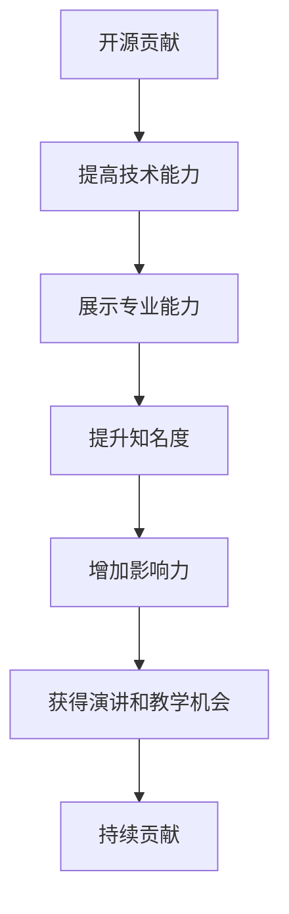

                 

# 利用开源贡献获得演讲和教学机会

## 1. 背景介绍

在计算机科学和人工智能领域，开源（Open Source）项目为研究者、开发者和公司提供了一个共享知识、协作开发和推广创新的平台。开源贡献不仅推动了技术进步，也为个人职业发展提供了新的机遇。利用开源贡献，个体可以展示其技术能力和专业知识，从而获得更多的演讲和教学机会。本文将详细探讨如何通过开源贡献来提升自己在这个领域的知名度和影响力，并具体分析实现这一目标的步骤。

## 2. 核心概念与联系

### 2.1 核心概念概述

要理解如何利用开源贡献获得演讲和教学机会，首先需要明确几个关键概念：

- **开源（Open Source）**：指软件或其他形式的知识产权在特定条件下公开，允许任何人自由使用、修改和分发，同时提供源代码以供查看和修改。

- **贡献（Contribution）**：指个人或组织在开源项目上完成的任务，包括代码编写、文档更新、测试、设计等。

- **影响力（Influence）**：指个人或组织在开源社区中的威望和影响力，通常通过贡献的数量和质量以及社区的认可度来衡量。

- **知名度（Visibility）**：指个人或组织在开源社区和更广泛科技界中的识别度，影响其获得更多机会如演讲、教学、合作等。

这些概念之间相互关联，共同构成了利用开源贡献获得演讲和教学机会的基础。开源贡献不仅展示了个人的技术能力，还通过贡献的认可和积累，提升了个人在社区和行业内的知名度和影响力。

### 2.2 核心概念原理和架构的 Mermaid 流程图

该图展示了开源贡献如何通过提升个人技术能力、展示专业能力，进而提升知名度和影响力，并最终获得演讲和教学机会的过程。

## 3. 核心算法原理 & 具体操作步骤

### 3.1 算法原理概述

利用开源贡献获得演讲和教学机会的核心算法原理是通过持续的、高质量的贡献，在开源社区中建立个人品牌，并逐步获得社区和行业的认可。这一过程涉及技术能力提升、专业展示和持续参与三个主要步骤。

### 3.2 算法步骤详解

#### 3.2.1 技术能力提升

- **学习最新技术**：通过阅读官方文档、博客文章和参加在线课程等方式，掌握最新的技术趋势和最佳实践。
- **实践和项目经验**：通过参与开源项目或个人项目，将理论知识转化为实践经验。
- **代码审查和反馈**：通过开源项目的代码审查和社区反馈，学习其他开发者的高效代码风格和设计思路。

#### 3.2.2 展示专业能力

- **撰写高质量文档**：编写详细、准确、易懂的文档，帮助他人理解代码和项目。
- **提交高质量代码**：在代码中遵循编码规范，注重代码的可读性和可维护性。
- **解决实际问题**：解决开源项目中的实际问题，如修复Bug、优化性能、增强功能等。

#### 3.2.3 持续参与

- **定期贡献**：保持定期贡献，展示对项目的持续关注和投入。
- **参与社区讨论**：积极参与社区讨论和问题解决，建立良好的社区关系。
- **引导新贡献者**：帮助新人熟悉开源文化和贡献流程，培养社区成员。

### 3.3 算法优缺点

#### 3.3.1 优点

- **广泛曝光**：开源贡献的可见性大，有助于在更广泛的社区中建立知名度。
- **积累经验**：通过解决实际问题，提升技术水平和问题解决能力。
- **建立关系**：与社区成员建立良好关系，为未来合作和机会打开大门。

#### 3.3.2 缺点

- **时间投入**：开源贡献需要大量时间和精力，可能影响工作生活平衡。
- **竞争激烈**：顶级开源项目贡献门槛高，竞争激烈，需要持续努力和耐心。
- **反馈不确定**：贡献可能未必得到预期反馈，需有心理准备。

### 3.4 算法应用领域

开源贡献的方法不仅限于软件和编程，在数据科学、机器学习、网络安全、自然语言处理等多个领域均有应用。例如，在数据科学领域，可以通过贡献数据集、算法实现、分析报告等方式展示专业能力。在自然语言处理领域，可以贡献模型实现、文本处理工具等。

## 4. 数学模型和公式 & 详细讲解 & 举例说明

### 4.1 数学模型构建

基于开源贡献获得演讲和教学机会的数学模型可构建如下：

- **贡献量**：个人对开源项目的贡献量（代码行数、提交次数、修复问题数量等）
- **贡献质量**：代码质量、文档质量、解决问题难易度
- **社区认可度**：通过代码审查、社区投票等形式获得的社区认可度
- **个人知名度**：在社区内的知名度和影响力

模型公式可表示为：

$$
I = f(C, Q, A, V)
$$

其中 $I$ 为个人影响力，$C$ 为贡献量，$Q$ 为贡献质量，$A$ 为社区认可度，$V$ 为个人知名度。

### 4.2 公式推导过程

假设每个贡献 $c_i$ 的效用为 $U_i$，则总效用为：

$$
U = \sum_{i=1}^{N} U_i = \sum_{i=1}^{N} f_i(C_i, Q_i)
$$

社区认可度 $A$ 和知名度 $V$ 与总效用 $U$ 之间存在正相关关系：

$$
A = \alpha_1U + \beta_1V
$$
$$
V = \alpha_2U + \beta_2A
$$

将上述公式代入 $I$ 的定义中，得到：

$$
I = \gamma_1U + \gamma_2A + \gamma_3V
$$

其中 $\gamma_1, \gamma_2, \gamma_3$ 为权重系数，需通过实际数据估计。

### 4.3 案例分析与讲解

以GitHub上的TensorFlow项目为例，展示如何通过开源贡献提升影响力：

- **案例背景**：TensorFlow是一个流行的开源机器学习框架，贡献者来自全球各地。
- **贡献策略**：选择感兴趣的TensorFlow模块，定期提交高质量代码和文档，积极参与社区讨论和问题解决。
- **结果**：经过一段时间的贡献，贡献者不仅提升了技术能力，还在社区中获得了认可，受邀参加多次TensorFlow的线下和线上活动，并在Google I/O等大型技术会议上担任演讲嘉宾。

## 5. 项目实践：代码实例和详细解释说明

### 5.1 开发环境搭建

1. **安装GitHub Desktop**：下载并安装GitHub Desktop，方便对GitHub进行管理。
2. **创建GitHub账号**：在GitHub官网创建个人账号，并注册GitHub Desktop。
3. **安装本地开发环境**：安装所需的软件包，如Python、Git、IDE（如VS Code）等。

### 5.2 源代码详细实现

1. **选择项目**：在GitHub上选择一个感兴趣的开源项目，如TensorFlow、PyTorch等。
2. **克隆项目**：使用GitHub Desktop或命令行工具，将项目克隆到本地。
3. **创建分支**：在本地创建一个新分支，用于提交个人贡献。
4. **编写代码**：在本地分支中编写代码或修复Bug，遵循项目编码规范。
5. **提交代码**：使用GitHub Desktop或命令行工具，将代码推送到远程仓库。

### 5.3 代码解读与分析

以TensorFlow项目的代码贡献为例，代码解读和分析如下：

- **代码规范**：遵循TensorFlow的代码规范，确保代码的可读性和可维护性。
- **文档撰写**：编写详细的使用说明和API文档，帮助其他开发者理解代码。
- **代码测试**：编写单元测试和集成测试，确保代码的正确性和稳定性。
- **问题解决**：解决实际问题，如性能优化、Bug修复等，提升项目的质量和可靠性。

### 5.4 运行结果展示

1. **提交记录**：查看提交记录，记录个人贡献数量和质量。
2. **社区反馈**：查看社区的评论和反馈，评估个人贡献的影响力。
3. **贡献排名**：查看贡献者排名，了解个人在社区中的地位和影响力。

## 6. 实际应用场景

### 6.1 学术研究

在学术研究中，通过开源贡献获取演讲和教学机会，可以提高研究者在该领域的知名度和影响力。例如，参与开源项目的研究和开发，撰写高质量的研究论文，并将其应用于开源项目中。

### 6.2 企业技术开发

在企业技术开发中，开源贡献有助于展示个人的技术能力和专业水平，获取更多的职业发展机会。例如，参与企业开源项目的维护和扩展，解决实际技术问题，提升个人在企业内部的认可度。

### 6.3 教育培训

在教育培训中，开源贡献可以用于教学材料和课程开发，提升教师的专业水平和教学质量。例如，开发和分享开源教育资源，参加线上和线下的教育活动，推广开源文化和教育技术。

## 7. 工具和资源推荐

### 7.1 学习资源推荐

1. **GitHub官方文档**：GitHub的官方文档，提供详细的GitHub使用和贡献指南。
2. **Open Source Initiative (OSI) 官网**：OSI的官方网站，提供开源软件和资源相关的信息和指南。
3. **开源贡献手册**：如《Contributing to Open Source: A Comprehensive Guide》，详细介绍了开源贡献的步骤和最佳实践。

### 7.2 开发工具推荐

1. **GitHub Desktop**：GitHub的桌面客户端，方便进行GitHub的日常管理和代码提交。
2. **Visual Studio Code (VS Code)**：开源的代码编辑器，支持多种编程语言和插件。
3. **Git**：全球最常用的版本控制系统，支持本地和远程代码管理。
4. **GitHub Pages**：GitHub提供的静态网页托管服务，方便发布个人项目和博客。

### 7.3 相关论文推荐

1. **《开源社区中个人影响力的测量与评估》**：研究开源社区中个人影响力的量化方法。
2. **《通过开源贡献提高技术能力与职业发展》**：分析开源贡献对个人技术能力和职业发展的具体影响。
3. **《开源贡献中的代码质量和社区认可度研究》**：探讨开源贡献中代码质量和社区认可度对个人影响力的影响。

## 8. 总结：未来发展趋势与挑战

### 8.1 研究成果总结

开源贡献是一种有效提升个人技术能力和知名度的方法，为演讲和教学机会的获取提供了强有力的支持。通过持续的、高质量的贡献，个人可以在开源社区中建立品牌，获得社区和行业的认可，从而在职业发展中取得更多机会。

### 8.2 未来发展趋势

1. **跨领域协作**：开源贡献将超越单一领域的限制，形成跨领域的协作和创新。
2. **自动化贡献**：利用自动化工具和平台，提高开源贡献的效率和质量。
3. **开源教育**：开源教育将进一步普及，培养更多开源贡献者和用户。

### 8.3 面临的挑战

1. **时间管理**：开源贡献需要大量时间和精力，需平衡工作和生活。
2. **质量控制**：确保贡献质量，避免低质量代码和不必要的问题。
3. **社区融入**：融入不同的开源社区，获取更多机会和资源。

### 8.4 研究展望

未来的研究应关注如何进一步提升开源贡献的质量和效率，增强个人在开源社区中的影响力和认可度，为演讲和教学机会的获取提供更全面的支持。同时，探索更多跨领域的合作和创新，促进开源技术的广泛应用和普及。

## 9. 附录：常见问题与解答

**Q1：如何选择合适的开源项目进行贡献？**

A: 选择感兴趣且与自身专业领域相关的开源项目，确保有足够的热情和动力持续贡献。同时，评估项目的活跃度、社区支持度和贡献门槛，选择适合的项目。

**Q2：如何管理时间，平衡工作和生活？**

A: 制定合理的时间计划，将开源贡献纳入日常工作和生活的一部分。使用时间管理工具如Trello、Asana等，合理安排任务和优先级。

**Q3：如何提升代码质量？**

A: 遵循项目编码规范，使用代码审查工具如Gerrit、GitLab等，进行代码审查和反馈。通过学习优秀的代码实现和设计，不断提高个人代码质量。

**Q4：如何融入不同的开源社区？**

A: 积极参与社区讨论和问题解决，主动与社区成员建立联系。参加社区组织的活动和会议，了解社区文化和规范，逐步融入社区。

---

作者：禅与计算机程序设计艺术 / Zen and the Art of Computer Programming

