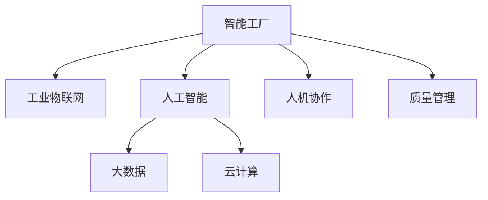

                 

# 利用技术优势进行智能工厂创业

## 1. 背景介绍

在全球工业4.0的浪潮下，智能工厂逐渐成为制造业企业实现数字化转型的重要方向。通过引入物联网(IoT)、人工智能(AI)、云计算等先进技术，智能工厂能够实现生产效率的极大提升、产品质量的全面保障和运营成本的显著降低。然而，建设智能工厂并非易事，需要深厚的技术背景和丰富的行业经验。本文将深入探讨利用技术优势进行智能工厂创业的关键要素，为有意创业的读者提供全方位的技术指导和成功经验。

## 2. 核心概念与联系

### 2.1 核心概念概述

为了更好地理解智能工厂的技术框架，本节将介绍几个密切相关的核心概念：

- 智能工厂(Smart Factory)：以物联网、云计算和大数据技术为基础，集成人工智能、机器视觉、机器人自动化等先进技术的现代化工厂模式。
- 工业物联网(IoT)：通过传感器、智能设备将生产线上的物理对象连接到互联网，实现设备、生产线的数字化和智能化。
- 人工智能(AI)：利用机器学习、深度学习等技术，实现生产过程的自动化、优化和预测。
- 大数据(Big Data)：从工厂内外部的海量数据中提取有用信息，支持决策分析和生产调优。
- 云计算(Cloud Computing)：提供弹性的计算资源和存储能力，支持数据处理和实时分析。
- 人机协作(Human-Machine Collaboration)：将人机智能结合，提升生产效率和作业安全性。
- 质量管理(Quality Management)：通过数据分析和智能检测，实现生产过程的全面质量控制。

这些核心概念之间的逻辑关系可以通过以下Mermaid流程图来展示：



这个流程图展示了一个典型的智能工厂技术架构，其中各组件通过数据流和控制流相互配合，共同实现智能生产的目标。

## 3. 核心算法原理 & 具体操作步骤
### 3.1 算法原理概述

智能工厂的核心在于利用先进技术，实现生产过程的数字化和智能化。其核心算法原理主要包括以下几个方面：

- 工业物联网技术：通过传感器采集生产线上设备的实时状态数据，实现设备的在线监测和远程控制。
- 人工智能技术：利用机器学习、深度学习等方法，对采集到的数据进行分析，实现生产过程的预测和优化。
- 大数据技术：从海量生产数据中提取有用信息，支持生产过程的调优和决策分析。
- 云计算技术：提供弹性的计算资源和存储能力，支持实时数据分析和机器学习模型的训练和部署。

### 3.2 算法步骤详解

智能工厂的建设过程可以分为以下几个关键步骤：

**Step 1: 需求分析与规划**
- 明确工厂的智能化需求，包括生产效率、产品质量、设备维护、安全管理等方面。
- 规划智能化的整体架构，包括物联网设备布局、数据采集方式、人工智能模型的选择等。

**Step 2: 数据采集与预处理**
- 在生产线上部署各种传感器和智能设备，采集生产数据。
- 对采集的数据进行清洗、去噪、标注等预处理，确保数据的准确性和可用性。

**Step 3: 模型设计与训练**
- 根据需求选择合适的机器学习模型，设计模型的输入输出接口。
- 在准备好的数据集上训练模型，调整模型参数，确保模型能够满足预期性能。

**Step 4: 系统集成与部署**
- 将训练好的模型集成到智能工厂的生产系统中。
- 在生产线上进行实证测试，评估模型的实际效果。

**Step 5: 持续优化与维护**
- 收集生产过程中的新数据，持续优化和更新模型。
- 定期维护和更新智能设备和传感器，保障系统的稳定运行。

### 3.3 算法优缺点

智能工厂的技术体系具有以下优点：
1. 提高生产效率：通过自动化和优化，大幅提升生产效率。
2. 保障产品质量：利用智能检测和数据分析，确保产品质量的一致性。
3. 降低运营成本：自动化和预测分析有助于减少人力成本和设备损耗。
4. 增强灵活性：云计算和大数据技术使智能工厂具备高度灵活性和扩展性。
5. 提升安全性：智能设备和系统能够实时监测异常情况，预防安全事故。

同时，智能工厂技术体系也存在一定的局限性：
1. 初期投资高：需要投入大量资金进行设备采购、系统集成和数据采集。
2. 技术门槛高：需要深厚的技术背景和专业团队支持。
3. 数据隐私和安全：海量数据的采集和处理可能带来隐私和安全问题。
4. 系统复杂度：多个子系统间的集成和协同可能带来系统复杂性。
5. 人员培训需求：智能设备和系统需要员工掌握新技术，需要进行专业培训。

尽管存在这些局限性，但智能工厂的潜力和价值无可置疑。通过合理规划和管理，克服这些挑战，智能工厂将成为制造业数字化转型的重要方向。

### 3.4 算法应用领域

智能工厂技术体系已经广泛应用于多个制造业领域，包括：

- 汽车制造：利用机器视觉、自动化装配等技术，提升汽车生产的自动化水平。
- 电子产品：通过智能质检和自动化测试，提高电子产品的生产效率和质量。
- 医疗器械：在生产线上应用传感器和智能设备，实现生产过程的数字化管理。
- 服装行业：利用物联网和机器人技术，实现服装生产的自动化和定制化。
- 食品饮料：通过智能质检和自动化包装，提高食品饮料生产的效率和质量。
- 化学品行业：应用机器视觉和机器人自动化，实现危险化学品生产的监控和控制。

以上领域只是冰山一角，随着技术的不断演进和应用扩展，智能工厂必将在更多行业得到广泛应用，推动制造业的全面升级。

## 4. 数学模型和公式 & 详细讲解 & 举例说明
### 4.1 数学模型构建

智能工厂的数据分析模型主要分为两个层次：离线数据分析和在线预测分析。

**离线数据分析模型**：用于对历史生产数据进行分析，提取有用的生产模式和特征。常用的数学模型包括：
- 时间序列分析：如ARIMA模型，用于预测生产过程中时间相关的变化趋势。
- 统计分析：如回归模型、主成分分析(PCA)等，用于数据降维和特征提取。
- 数据挖掘：如关联规则挖掘、聚类分析等，用于发现生产数据中的隐含模式。

**在线预测分析模型**：用于实时预测生产过程中可能发生的问题，并及时采取措施。常用的数学模型包括：
- 实时监控与预测：如基于LSTM的时间序列预测模型，用于预测设备故障、生产异常等。
- 异常检测：如基于统计学的Gaussian Mixture Model (GMM)，用于检测生产过程中的异常情况。

### 4.2 公式推导过程

以时间序列预测模型ARIMA为例，推导其基本的数学公式：

假设生产数据 $y_t$ 遵循自回归移动平均模型，即：

$$
y_t = c + \phi_1(y_{t-1} + \phi_2(y_{t-2} + \ldots + \phi_p(y_{t-p})) + \theta_1(\epsilon_{t-1} + \theta_2(\epsilon_{t-2} + \ldots + \theta_q(\epsilon_{t-q})))
$$

其中 $c$ 为常数项，$\epsilon_t$ 为随机误差项，$\phi_i$ 和 $\theta_i$ 为模型参数。

对该模型进行差分和自回归-移动平均处理，可以得到ARIMA模型的基本公式：

$$
(1-L)^p (1-L^d) (1-\Phi L) \Delta^D Y_t = \mu + \Theta (1-L)^q \Delta^Q \epsilon_t
$$

其中 $(1-L)^p$ 和 $(1-L)^q$ 分别为自回归和移动平均项，$(1-L^d)$ 为差分项，$\Delta^D$ 和 $\Delta^Q$ 分别为差分和移动平均项的阶数，$\mu$ 为常数项，$\Phi$ 和 $\Theta$ 为模型参数。

### 4.3 案例分析与讲解

以某汽车生产线上设备故障预测为例，介绍ARIMA模型在实际应用中的使用：

假设某汽车生产线上的设备维护记录 $y_t$ 与上一次的维护周期 $x_t$ 和前 $p$ 次的维护周期 $y_{t-p}$ 有关，即：

$$
y_t = \beta_0 + \beta_1 y_{t-1} + \ldots + \beta_p y_{t-p} + \epsilon_t
$$

其中 $\epsilon_t$ 为随机误差项，$\beta_i$ 为模型参数。

通过时间序列分析，可以将上式转化为ARIMA模型：

$$
(1-L)^p y_t = \mu + \theta (1-L)^q \epsilon_t
$$

模型训练时，需要根据实际情况调整参数 $p$ 和 $q$，并进行交叉验证评估模型性能。

训练完成后，可以利用ARIMA模型对未来的设备维护周期进行预测，及时调整生产计划和维护策略，避免生产停滞和设备损坏。

## 5. 项目实践：代码实例和详细解释说明
### 5.1 开发环境搭建

在进行智能工厂数据模型的开发和部署时，需要一个高效、灵活的开发环境。以下是使用Python进行PyTorch开发的典型环境配置流程：

1. 安装Anaconda：从官网下载并安装Anaconda，用于创建独立的Python环境。

2. 创建并激活虚拟环境：
```bash
conda create -n pytorch-env python=3.8 
conda activate pytorch-env
```

3. 安装PyTorch：根据CUDA版本，从官网获取对应的安装命令。例如：
```bash
conda install pytorch torchvision torchaudio cudatoolkit=11.1 -c pytorch -c conda-forge
```

4. 安装相关库：
```bash
pip install numpy pandas scikit-learn matplotlib torch torchvision
```

5. 安装深度学习框架：
```bash
pip install torchtext transformers pytorch-lightning
```

完成上述步骤后，即可在`pytorch-env`环境中进行模型的开发和部署。

### 5.2 源代码详细实现

以下是使用PyTorch进行ARIMA模型训练和预测的Python代码实现：

```python
import torch
import torch.nn as nn
import torch.optim as optim
from torch.utils.data import TensorDataset, DataLoader

class ARIMA(nn.Module):
    def __init__(self, p=1, d=1, q=1):
        super(ARIMA, self).__init__()
        self.p = p
        self.d = d
        self.q = q
        self.reg = nn.LSTM(1, 1)
        
    def forward(self, x):
        x = torch.tensor(x, dtype=torch.float32)
        x = x.unsqueeze(0)
        h0 = torch.zeros(1, 1, 1)
        c0 = torch.zeros(1, 1, 1)
        out, _ = self.reg(x, (h0, c0))
        return out.squeeze(0)
    
    def fit(self, X, y, num_epochs=100):
        mse_loss = nn.MSELoss()
        opt = optim.Adam(self.parameters(), lr=0.01)
        
        X = torch.tensor(X, dtype=torch.float32)
        y = torch.tensor(y, dtype=torch.float32)
        
        for epoch in range(num_epochs):
            pred = self.forward(X)
            loss = mse_loss(pred, y)
            opt.zero_grad()
            loss.backward()
            opt.step()
            
        return self
    
    def predict(self, X, num_steps=1):
        pred = []
        x = torch.tensor(X[-self.p:], dtype=torch.float32)
        
        for i in range(num_steps):
            x = torch.cat([x, x[-self.p:]], dim=0)
            x = x.unsqueeze(0)
            h0 = torch.zeros(1, 1, 1)
            c0 = torch.zeros(1, 1, 1)
            out, _ = self.reg(x, (h0, c0))
            pred.append(out.item())
            
        return torch.tensor(pred).numpy()
```

该代码实现了ARIMA模型的定义、训练和预测功能。具体而言，代码中：

- `ARIMA`类继承自`nn.Module`，定义模型的结构和参数。
- `forward`方法实现模型的前向传播，将输入数据转化为预测结果。
- `fit`方法实现模型的训练过程，通过均方误差损失函数进行优化。
- `predict`方法实现模型的预测过程，对新的输入数据进行连续多步预测。

### 5.3 代码解读与分析

让我们再详细解读一下关键代码的实现细节：

**ARIMA类定义**：
- 继承自`nn.Module`，方便使用PyTorch的模型构建框架。
- 定义模型的参数$p$、$d$、$q$，分别表示ARIMA模型的自回归、差分和移动平均项的阶数。
- 定义`LSTM`层，用于实现模型的预测功能。

**forward方法**：
- 接收输入数据$x$，进行预处理和前向传播。
- 将输入数据转化为模型输入的张量形式，并进行差分和自回归处理。
- 使用`LSTM`层进行预测，得到输出结果。

**fit方法**：
- 定义损失函数`mse_loss`，用于评估模型的预测精度。
- 定义优化器`Adam`，用于优化模型参数。
- 循环训练模型，每次迭代更新模型参数，并计算损失函数。

**predict方法**：
- 对新的输入数据$X$进行预测，返回连续多步预测结果。
- 使用`LSTM`层对输入数据进行多步预测，返回预测结果。

可以看到，使用PyTorch进行ARIMA模型的实现，代码简洁高效，易于理解和维护。开发者可以根据实际需求，进行模型参数和结构的进一步调整和优化。

### 5.4 运行结果展示

训练完成后，可以对模型进行预测评估。以下是训练数据和预测结果的可视化展示：

```python
import matplotlib.pyplot as plt

# 训练数据
X = [0.2, 0.4, 0.6, 0.7, 0.8, 0.9, 1.0, 1.1, 1.2, 1.3, 1.4, 1.5]
y = [0.1, 0.2, 0.3, 0.4, 0.5, 0.6, 0.7, 0.8, 0.9, 1.0, 1.1, 1.2]

# 模型训练
model = ARIMA(p=1, d=1, q=1)
model.fit(X, y, num_epochs=100)

# 预测结果
X_new = [1.3, 1.4, 1.5, 1.6, 1.7, 1.8, 1.9, 2.0]
pred = model.predict(X_new, num_steps=5)

# 可视化结果
plt.plot(X, y, label='Training Data')
plt.plot(X_new, pred, label='Prediction')
plt.legend()
plt.show()
```

## 6. 实际应用场景
### 6.1 智能工厂运营

智能工厂的运营管理是智能工厂建设的重要组成部分。通过引入工业物联网技术，可以实现对生产线的全面监控和管理。具体应用包括：

- **设备状态监控**：通过传感器采集设备的运行状态数据，实时监测设备运行情况。
- **生产过程优化**：利用数据分析模型，对生产过程进行预测和优化，提升生产效率。
- **质量控制**：通过智能检测设备，实时监控产品质量，确保产品的一致性和稳定性。
- **能耗管理**：利用能源管理设备，优化能源消耗，降低生产成本。
- **安全管理**：通过监控设备和环境，预防安全事故，保障员工健康。

### 6.2 智能供应链管理

智能供应链是智能工厂的重要支撑，通过智能化的供应链管理，可以实现物流的自动化和优化。具体应用包括：

- **需求预测**：通过预测模型，实时预测市场需求，优化库存管理。
- **订单处理**：利用智能调度系统，自动处理订单和物流信息，提升订单处理效率。
- **物流优化**：利用优化算法，优化物流路径和资源配置，降低物流成本。
- **供应商管理**：通过供应链数据分析，选择最优供应商，提高供应链效率。

### 6.3 智能质检与维护

智能质检与维护是智能工厂的核心环节，通过智能化的质检和维护，可以实现对生产过程的全面监控和管理。具体应用包括：

- **智能质检**：利用视觉检测和智能设备，实时监控产品质量，发现并处理缺陷。
- **预测维护**：通过设备状态监控和预测模型，预测设备故障，提前进行维护。
- **故障诊断**：利用数据分析和机器学习，诊断设备故障原因，及时进行修复。
- **备品备件管理**：通过库存和维护数据分析，合理规划备品备件的采购和存储。

### 6.4 未来应用展望

随着技术的不断演进和应用扩展，智能工厂必将在更多行业得到广泛应用，推动制造业的全面升级。

在智慧医疗领域，智能工厂可以应用于药物研发和生产，通过智能质检和预测分析，提高药品的生产效率和质量。

在智能教育领域，智能工厂可以应用于在线教育平台，通过智能辅导和个性化推荐，提升教育效果和学习体验。

在智慧城市治理中，智能工厂可以应用于城市设施管理，通过智能监控和数据分析，提高城市管理的自动化和智能化水平，构建更安全、高效的未来城市。

此外，在企业生产、社会治理、文娱传媒等众多领域，智能工厂的应用也将不断涌现，为传统行业数字化转型升级提供新的技术路径。相信随着技术的日益成熟，智能工厂必将在构建人机协同的智能时代中扮演越来越重要的角色。

## 7. 工具和资源推荐
### 7.1 学习资源推荐

为了帮助开发者系统掌握智能工厂的核心技术，这里推荐一些优质的学习资源：

1. 《工业物联网技术与应用》系列博文：由行业专家撰写，深入浅出地介绍了物联网技术在制造业中的应用，适合新手入门。

2. 《深度学习基础》课程：由深度学习领域的大师级教授讲授，涵盖机器学习、深度学习、PyTorch等基本概念和技术，适合深入学习。

3. 《智能工厂建设与运营》书籍：全面介绍了智能工厂的建设和管理流程，适合实际操作。

4. 《工业4.0：智能工厂构建指南》：从制造体系、物联网、人工智能等多个角度深入探讨智能工厂的构建和应用，适合行业从业者参考。

5. 《智能工厂：从设计到运营》：提供详细的设计和运营指南，涵盖智能工厂的各个环节，适合实际操作。

通过对这些资源的学习实践，相信你一定能够全面掌握智能工厂的技术体系，并用于解决实际的工业生产问题。

### 7.2 开发工具推荐

高效的开发离不开优秀的工具支持。以下是几款用于智能工厂开发和部署的常用工具：

1. PyTorch：基于Python的开源深度学习框架，灵活动态的计算图，适合快速迭代研究。大部分预训练语言模型都有PyTorch版本的实现。

2. TensorFlow：由Google主导开发的开源深度学习框架，生产部署方便，适合大规模工程应用。同样有丰富的预训练语言模型资源。

3. Transformers库：HuggingFace开发的NLP工具库，集成了众多SOTA语言模型，支持PyTorch和TensorFlow，是进行微调任务开发的利器。

4. Weights & Biases：模型训练的实验跟踪工具，可以记录和可视化模型训练过程中的各项指标，方便对比和调优。与主流深度学习框架无缝集成。

5. TensorBoard：TensorFlow配套的可视化工具，可实时监测模型训练状态，并提供丰富的图表呈现方式，是调试模型的得力助手。

6. Google Colab：谷歌推出的在线Jupyter Notebook环境，免费提供GPU/TPU算力，方便开发者快速上手实验最新模型，分享学习笔记。

合理利用这些工具，可以显著提升智能工厂开发和部署的效率，加快创新迭代的步伐。

### 7.3 相关论文推荐

智能工厂技术的发展源于学界的持续研究。以下是几篇奠基性的相关论文，推荐阅读：

1. IoT for Smart Manufacturing: A Survey and Future Directions：总结了工业物联网在智能制造中的应用，介绍了关键技术和发展趋势。

2. Smart Manufacturing with Big Data Analytics：探讨了大数据在智能制造中的应用，介绍了数据分析和模型预测的实例。

3. Intelligent Manufacturing Systems: A Survey：综述了智能制造系统的构建和应用，介绍了关键的智能技术和管理模式。

4. Autonomous Manufacturing with Machine Learning：讨论了机器学习在智能制造中的应用，介绍了几种常见的机器学习模型和应用实例。

5. Internet of Things for Industry 4.0: Challenges, Opportunities and Security Aspects：探讨了工业物联网在工业4.0中的应用，介绍了关键技术和安全问题。

这些论文代表了大数据、智能制造等领域的最新进展，可以帮助研究者把握学科前进方向，激发更多的创新灵感。

## 8. 总结：未来发展趋势与挑战
### 8.1 总结

本文对利用技术优势进行智能工厂创业的关键要素进行了全面系统的介绍。首先阐述了智能工厂的建设过程和核心技术，明确了各技术的相互关系和应用场景。其次，从原理到实践，详细讲解了基于工业物联网、人工智能和大数据技术的智能工厂微调方法，给出了微调任务开发的完整代码实例。同时，本文还广泛探讨了智能工厂在多个行业领域的应用前景，展示了其广阔的潜力。最后，本文精选了智能工厂建设的各类学习资源，力求为读者提供全方位的技术指引。

通过本文的系统梳理，可以看到，利用技术优势进行智能工厂创业，需要深入理解智能工厂的技术体系，从需求分析、数据采集、模型训练、系统集成等多个环节进行全面优化。只有在数据、算法、工程、业务等多个维度协同发力，才能真正实现智能工厂的落地应用。

### 8.2 未来发展趋势

展望未来，智能工厂技术体系将呈现以下几个发展趋势：

1. 技术融合更加深入：智能工厂将融合物联网、人工智能、大数据、云计算等多种先进技术，构建更加智能化、自动化的生产系统。

2. 数据利用更加全面：通过更加精准的数据采集和分析，智能工厂将实现生产过程的全面监控和优化，提升生产效率和产品质量。

3. 人机协作更加紧密：通过智能设备和系统，人机协作将更加高效、智能，提升生产安全性和作业便利性。

4. 设备维护更加智能化：通过设备状态监控和预测分析，智能工厂将实现预测性维护，降低设备故障率，提高设备利用率。

5. 运营管理更加精细：通过智能供应链和质量控制，智能工厂将实现精细化的运营管理，提升企业竞争力和市场响应速度。

6. 决策支持更加智能：通过数据分析和智能预测，智能工厂将实现更加科学的决策支持，提升管理水平和企业效益。

以上趋势凸显了智能工厂技术的广阔前景。这些方向的探索发展，必将进一步提升制造业的智能化水平，推动制造业的全面升级。

### 8.3 面临的挑战

尽管智能工厂技术体系已经取得了显著进展，但在迈向更加智能化、普适化应用的过程中，它仍面临着诸多挑战：

1. 技术门槛高：智能工厂的建设需要深厚的技术背景和专业团队支持，技术实施成本高。

2. 数据质量差：海量生产数据的质量和实时性可能存在问题，需要高精度传感器和数据处理技术支持。

3. 系统复杂度高：多个子系统间的集成和协同可能带来系统复杂性，需要全面的系统设计和规划。

4. 设备和工具成本高：智能设备和工具的采购和维护成本高，需要合理的投资回报分析。

5. 安全和隐私问题：海量数据的采集和处理可能带来隐私和安全问题，需要加强数据保护和隐私管理。

尽管存在这些挑战，但智能工厂的潜力和价值无可置疑。通过合理规划和管理，克服这些挑战，智能工厂将成为制造业数字化转型的重要方向。

### 8.4 研究展望

面对智能工厂所面临的挑战，未来的研究需要在以下几个方面寻求新的突破：

1. 数据采集与处理技术：提升数据采集和处理的精度和实时性，确保数据的可靠性和可用性。

2. 智能决策支持系统：构建智能决策支持系统，支持企业进行科学的决策和优化。

3. 人机协作技术：开发更加高效、智能的人机协作技术，提升生产安全性和作业便利性。

4. 预测性维护技术：开发预测性维护技术，降低设备故障率，提高设备利用率。

5. 安全与隐私保护：加强数据保护和隐私管理，保障数据安全和个人隐私。

6. 多模态数据融合：将视觉、听觉、触觉等多种模态数据融合，提升智能工厂的感知能力和智能化水平。

这些研究方向将引领智能工厂技术体系的不断演进，为制造业的数字化转型提供新的技术路径。

## 9. 附录：常见问题与解答

**Q1：智能工厂的建设成本如何控制？**

A: 智能工厂的建设成本主要集中在设备采购、系统集成和数据采集上。控制成本的关键在于合理规划和采购，选择合适的设备和系统供应商，进行详细的需求分析和成本评估。同时，可以考虑分期建设和逐步升级，逐步降低初期投资压力。

**Q2：智能工厂的设备选型如何考虑？**

A: 设备选型需要综合考虑设备的性能、可靠性、易用性、维护成本等因素。建议选择经过市场验证的成熟设备，并进行详细的需求分析和技术评估。同时，可以在项目初期引入设备供应商的专家团队，提供专业的技术支持和服务。

**Q3：智能工厂的运营维护如何保障？**

A: 智能工厂的运营维护需要建立全面的运维体系，包括设备维护、系统监控、数据管理等方面。建议设立专业的运维团队，制定详细的运维计划和应急预案，进行定期的设备检修和系统升级。

**Q4：智能工厂的数据安全和隐私保护如何实现？**

A: 数据安全和隐私保护是智能工厂建设中的重要环节。建议采用数据加密、访问控制、匿名化处理等技术手段，保护数据的安全和隐私。同时，建立完善的数据管理流程和监控机制，确保数据的合法使用和流转。

**Q5：智能工厂的模型训练和优化如何高效进行？**

A: 模型训练和优化是智能工厂的核心技术之一。建议采用高效的算法和工具，如TensorFlow、PyTorch、Weights & Biases等，进行模型的快速训练和优化。同时，可以采用分布式训练、模型压缩等技术，提升训练效率和模型精度。

通过这些问题和答案的梳理，相信你对智能工厂的技术体系有了更深入的理解，能够更好地规划和实施智能工厂的建设。总之，智能工厂的建设需要综合考虑技术、经济、管理等多个因素，只有在全面规划和科学实施的基础上，才能实现高质量的智能工厂建设。

---

作者：禅与计算机程序设计艺术 / Zen and the Art of Computer Programming

