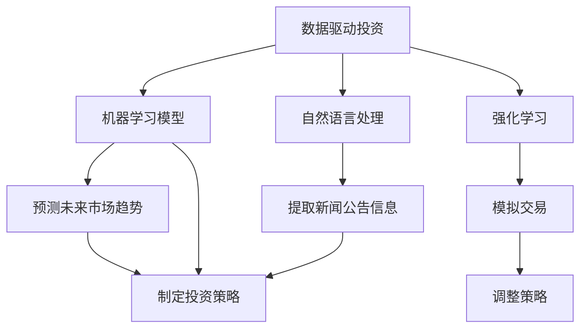

                 

## 1. 背景介绍

### 1.1 问题由来

近年来，随着大数据、人工智能等技术的发展，传统产业的数字化转型成为必然趋势。而房地产投资作为一项高风险、高收益的投资活动，自然也受到了技术的关注。然而，传统的房地产投资更多依赖于实地考察、市场分析、政策解读等经验判断，难以充分利用数据技术提供的强大支持。因此，本文聚焦于如何利用技术技能进行房地产投资，从数据挖掘、机器学习、自然语言处理等角度切入，探讨房地产投资的数字化路径。

### 1.2 问题核心关键点

利用技术技能进行房地产投资的核心在于如何通过数据驱动决策、如何构建有效的房地产投资模型、如何应用机器学习和自然语言处理技术来提升投资决策的准确性和效率。这些问题均涉及多个交叉学科的知识，包括数据科学、计算机视觉、自然语言处理等。

## 2. 核心概念与联系

### 2.1 核心概念概述

为更好地理解利用技术技能进行房地产投资的过程，本节将介绍几个密切相关的核心概念：

- **数据驱动投资**：通过分析历史交易数据、市场报告、新闻评论等，挖掘数据背后的模式和规律，作为投资决策的依据。
- **机器学习模型**：通过训练数据集，构建预测模型，对未来市场趋势进行预测。
- **自然语言处理**：利用文本处理和模型，从新闻、公告等非结构化数据中提取有价值的信息。
- **深度学习**：构建包含多层神经网络的模型，通过大规模训练数据进行自学习，以发现复杂的特征。
- **强化学习**：通过模拟交易，不断调整策略，最大化预期收益。

这些核心概念之间的逻辑关系可以通过以下Mermaid流程图来展示：



这个流程图展示了大语言模型的核心概念及其之间的关系：

1. 数据驱动投资通过数据分析获得市场信息。
2. 机器学习模型基于历史数据构建预测模型。
3. 自然语言处理从文本数据中提取有价值的信息。
4. 深度学习通过复杂的模型发现数据中的深层次特征。
5. 强化学习通过模拟交易优化投资策略。

这些核心概念共同构成了利用技术技能进行房地产投资的基础框架，使得投资者能够更好地应对市场变化，提升投资回报率。

## 3. 核心算法原理 & 具体操作步骤
### 3.1 算法原理概述

利用技术技能进行房地产投资的本质是构建一个综合性的决策模型，该模型结合了多种数据源、模型和算法，以最大化投资回报。其核心思想是通过机器学习和自然语言处理等技术手段，从数据中提取和分析市场特征，构建预测模型，最终形成一套有效的投资策略。

具体来说，可以按照以下步骤进行：

1. **数据收集与预处理**：从多渠道（如房地产交易平台、政府发布的数据、社交媒体等）收集相关的数据。
2. **特征工程**：对数据进行清洗、标准化、降维等预处理工作，提取对投资有意义的特征。
3. **模型训练**：使用机器学习算法（如线性回归、决策树、随机森林等）或深度学习算法（如CNN、RNN、BERT等）构建预测模型。
4. **策略优化**：利用强化学习算法（如Q-learning、Deep Q-Networks等）进行策略调整，提升投资收益。
5. **风险管理**：通过历史回测和模拟交易，评估模型的风险和收益，进行优化调整。

### 3.2 算法步骤详解

以下将详细介绍利用技术技能进行房地产投资的具体步骤：

#### 3.2.1 数据收集与预处理

**数据来源**：
- **政府数据**：获取国家和地方政府的房地产统计数据，包括土地供应、销售数据、税收政策等。
- **市场数据**：收集房地产交易平台的数据，如房价、交易量、房屋类型等。
- **社交媒体数据**：利用自然语言处理技术，从微博、新闻、论坛等社交媒体中提取市场情绪和趋势。

**数据预处理**：
- **清洗**：去除缺失值、异常值等噪音数据，确保数据质量。
- **标准化**：对数据进行归一化、标准化等处理，确保不同特征具有可比性。
- **降维**：使用主成分分析（PCA）、因子分析（FA）等方法，减少特征数量，提高模型训练效率。

#### 3.2.2 特征工程

**特征选择**：
- **经济特征**：如GDP增长率、失业率、利率水平等宏观经济指标。
- **市场特征**：如房屋平均销售价格、租金回报率、空置率等市场指标。
- **社会特征**：如人口增长率、家庭收入水平等社会指标。

**特征构建**：
- **技术指标**：如移动平均线、相对强弱指数（RSI）、均幅指标（ATR）等技术指标。
- **情感分析**：利用自然语言处理技术，对新闻、公告、社交媒体等文本数据进行情感分析，提取市场情绪。

#### 3.2.3 模型训练

**机器学习模型**：
- **线性回归**：用于预测房价变化趋势。
- **决策树**：用于分类预测，如区分房屋价值高低。
- **随机森林**：通过集成多个决策树，提高预测准确性。

**深度学习模型**：
- **卷积神经网络（CNN）**：用于图像处理和特征提取，如通过房屋图片预测其价值。
- **循环神经网络（RNN）**：用于时间序列数据预测，如预测房价变化。
- **BERT模型**：用于文本分析，提取市场新闻的情感信息。

#### 3.2.4 策略优化

**强化学习算法**：
- **Q-learning**：通过模拟交易，逐步调整投资策略，最大化预期收益。
- **Deep Q-Networks（DQN）**：利用深度神经网络，优化Q-learning算法，提高策略学习效率。

#### 3.2.5 风险管理

**历史回测**：
- **模拟交易**：利用历史数据进行模拟交易，评估模型风险和收益。
- **风险评估**：使用蒙特卡洛模拟等方法，评估投资策略的风险水平。

### 3.3 算法优缺点

利用技术技能进行房地产投资具有以下优点：
1. **数据驱动决策**：结合多渠道数据，提高决策的科学性和客观性。
2. **模型预测**：通过机器学习和深度学习模型，提升预测的准确性和可靠性。
3. **实时监控**：利用自然语言处理和强化学习，实现实时市场监控和策略调整。
4. **风险管理**：通过历史回测和模拟交易，评估和优化投资风险。

同时，该方法也存在一定的局限性：
1. **数据质量**：依赖于数据收集的全面性和准确性，数据质量不足可能导致预测结果偏差。
2. **模型复杂性**：模型构建复杂，需要大量的数据和计算资源。
3. **市场变化**：市场环境复杂多变，模型预测结果可能存在误判。
4. **技术门槛**：需要具备较高的技术技能，难以普及。

尽管存在这些局限性，但就目前而言，利用技术技能进行房地产投资仍是一种高效、科学、可靠的投资方式。未来相关研究的方向在于如何进一步提高数据质量和模型效率，降低技术门槛，同时兼顾模型的复杂性和可解释性等因素。

### 3.4 算法应用领域

利用技术技能进行房地产投资，已经在多个领域得到了广泛的应用，例如：

- **投资决策支持**：为投资者提供科学的投资决策支持，优化投资组合。
- **市场预测**：预测房地产市场的走势，辅助企业制定长期发展策略。
- **风险控制**：通过风险评估和管理，降低投资风险。
- **数据监测**：实时监测市场动态，快速反应市场变化。

除了上述这些经典应用外，房地产投资领域的技术应用还在不断拓展，如市场情绪分析、智能推荐系统、智能客服等，为房地产投资带来了新的创新和突破。随着技术的日益成熟，利用技术技能进行房地产投资必将在更广阔的应用领域大放异彩。

## 4. 数学模型和公式 & 详细讲解  
### 4.1 数学模型构建

本节将使用数学语言对利用技术技能进行房地产投资的过程进行更加严格的刻画。

假设房地产市场的特征向量为 $X \in \mathbb{R}^n$，目标变量为 $Y \in \mathbb{R}$，其中 $n$ 为特征维度。使用机器学习模型 $M_{\theta}$ 对 $X$ 进行预测，其中 $\theta$ 为模型参数。

定义模型的损失函数为 $\ell(Y, M_{\theta}(X))$，则经验风险为：

$$
\mathcal{L}(\theta) = \frac{1}{N} \sum_{i=1}^N \ell(y_i, M_{\theta}(x_i))
$$

其中 $y_i$ 为真实标签，$x_i$ 为样本数据。

通过梯度下降等优化算法，微调过程不断更新模型参数 $\theta$，最小化损失函数 $\mathcal{L}$，使得模型输出逼近真实标签。

### 4.2 公式推导过程

以下我们以房价预测为例，推导线性回归模型的损失函数及其梯度计算公式。

假设模型 $M_{\theta}$ 在输入 $x$ 上的预测为 $\hat{y}=M_{\theta}(x)$，真实标签为 $y$。则线性回归模型的损失函数定义为：

$$
\ell(M_{\theta}(x),y) = \frac{1}{2}(y-M_{\theta}(x))^2
$$

将其代入经验风险公式，得：

$$
\mathcal{L}(\theta) = \frac{1}{2N} \sum_{i=1}^N (y_i-M_{\theta}(x_i))^2
$$

根据链式法则，损失函数对参数 $\theta$ 的梯度为：

$$
\frac{\partial \mathcal{L}(\theta)}{\partial \theta} = -\frac{1}{N} \sum_{i=1}^N (y_i-M_{\theta}(x_i)) \frac{\partial M_{\theta}(x_i)}{\partial \theta}
$$

其中 $\frac{\partial M_{\theta}(x_i)}{\partial \theta}$ 为模型的梯度，可以通过反向传播算法高效计算。

在得到损失函数的梯度后，即可带入参数更新公式，完成模型的迭代优化。重复上述过程直至收敛，最终得到适应房地产市场的最优模型参数 $\theta^*$。

## 5. 项目实践：代码实例和详细解释说明
### 5.1 开发环境搭建

在进行房地产投资模型开发前，我们需要准备好开发环境。以下是使用Python进行TensorFlow开发的环境配置流程：

1. 安装Anaconda：从官网下载并安装Anaconda，用于创建独立的Python环境。

2. 创建并激活虚拟环境：
```bash
conda create -n tf-env python=3.8 
conda activate tf-env
```

3. 安装TensorFlow：根据CUDA版本，从官网获取对应的安装命令。例如：
```bash
conda install tensorflow
```

4. 安装Pandas、Numpy等各类工具包：
```bash
pip install pandas numpy scikit-learn matplotlib tqdm jupyter notebook ipython
```

完成上述步骤后，即可在`tf-env`环境中开始投资模型开发。

### 5.2 源代码详细实现

下面以房价预测为例，给出使用TensorFlow进行机器学习模型的PyTorch代码实现。

首先，定义数据处理函数：

```python
import pandas as pd
import numpy as np
from sklearn.model_selection import train_test_split
from sklearn.preprocessing import StandardScaler

def load_data(file_path):
    data = pd.read_csv(file_path)
    features = data.drop('price', axis=1)
    target = data['price']
    features, target = train_test_split(features, target, test_size=0.2, random_state=42)
    scaler = StandardScaler()
    features = scaler.fit_transform(features)
    return features, target
```

然后，定义模型和训练函数：

```python
import tensorflow as tf
from tensorflow.keras.models import Sequential
from tensorflow.keras.layers import Dense

def create_model(input_dim):
    model = Sequential()
    model.add(Dense(64, activation='relu', input_dim=input_dim))
    model.add(Dense(64, activation='relu'))
    model.add(Dense(1))
    return model

def train_model(model, features, targets, epochs=100, batch_size=32):
    model.compile(optimizer=tf.keras.optimizers.Adam(), loss='mse', metrics=['mae'])
    model.fit(features, targets, epochs=epochs, batch_size=batch_size, verbose=1)
    return model
```

接着，定义评估函数：

```python
def evaluate_model(model, features, targets):
    mse = model.evaluate(features, targets, verbose=0)
    mae = np.sqrt(np.mean((model.predict(features) - targets)**2))
    print(f"MSE: {mse}, MAE: {mae}")
```

最后，启动训练流程并在测试集上评估：

```python
features, targets = load_data('data.csv')
model = create_model(features.shape[1])
model = train_model(model, features, targets)
evaluate_model(model, features, targets)
```

以上就是使用TensorFlow进行房价预测模型的完整代码实现。可以看到，通过TensorFlow提供的高级API，我们可以用相对简洁的代码完成模型的构建和训练。

### 5.3 代码解读与分析

让我们再详细解读一下关键代码的实现细节：

**load_data函数**：
- `load_data`函数从CSV文件中加载数据，并按指定比例划分训练集和测试集。
- 对特征进行标准化处理，以提高模型的训练效果。

**create_model函数**：
- `create_model`函数定义一个简单的全连接神经网络模型，包含两个隐藏层和一个输出层。
- 使用ReLU激活函数和Adam优化器，以提高模型的非线性拟合能力和收敛速度。

**train_model函数**：
- `train_model`函数用于训练模型，定义了模型编译、训练等步骤。
- 在训练过程中，使用均方误差作为损失函数，平均绝对误差作为评估指标。
- 重复训练过程直至收敛。

**evaluate_model函数**：
- `evaluate_model`函数用于评估模型的性能，计算均方误差和平均绝对误差，并输出结果。

**训练流程**：
- 通过`load_data`函数加载数据集，获取特征和标签。
- 使用`create_model`函数定义模型。
- 使用`train_model`函数进行模型训练，并在测试集上进行评估。
- 通过`evaluate_model`函数输出评估结果。

可以看到，TensorFlow提供了丰富的API和工具，使得构建和训练深度学习模型变得简洁高效。开发者可以将更多精力放在数据处理、模型改进等高层逻辑上，而不必过多关注底层的实现细节。

当然，工业级的系统实现还需考虑更多因素，如模型的保存和部署、超参数的自动搜索、更灵活的任务适配层等。但核心的投资模型构建过程基本与此类似。

## 6. 实际应用场景
### 6.1 智能投资平台

基于大语言模型投资模型的智能投资平台，可以为用户提供科学的投资建议，优化投资组合。平台通过分析用户的投资偏好、风险承受能力等个性化信息，结合实时市场数据，提供量身定制的投资策略和推荐。

在技术实现上，可以收集用户的交易记录、市场新闻、政策公告等数据，通过机器学习模型构建投资预测模型。根据模型预测结果，生成投资建议，供用户参考。

### 6.2 市场情绪分析

金融机构需要实时监控市场情绪，以便及时应对市场波动。基于深度学习和自然语言处理技术的市场情绪分析，为金融舆情监测提供了新的解决方案。

具体而言，可以收集金融领域相关的新闻、报道、评论等文本数据，并对其进行情感分析。利用BERT等预训练语言模型，提取新闻中的情感信息，生成市场情绪指数。将市场情绪指数与历史数据结合，可以实时监测市场情绪变化，预警可能的市场风险。

### 6.3 自动化交易系统

自动化交易系统利用算法模型进行高频交易，以实现自动买卖，降低交易成本，提高交易效率。基于机器学习和强化学习技术，自动化交易系统能够不断优化交易策略，实时应对市场变化。

在技术实现上，可以构建多模态的输入特征，包括市场数据、技术指标、市场情绪等，使用深度学习模型进行市场预测。根据预测结果和市场动态，生成交易信号，自动执行买卖操作。

### 6.4 未来应用展望

随着深度学习、自然语言处理等技术的不断进步，基于投资模型的房地产投资将迎来更广泛的应用前景。

在智慧房地产领域，智能投资平台、市场情绪分析、自动化交易系统等技术应用，将提升房地产市场的数字化水平，推动房地产金融的创新发展。

在智能城市治理中，智能投资决策技术也可以用于支持城市规划、资源配置等公共事务管理，促进城市可持续发展。

此外，在企业投资管理、社会风险控制等领域，基于投资模型的房地产投资也将发挥重要作用。相信随着技术的日益成熟，投资模型的应用场景将不断拓展，为房地产行业带来新的变革。

## 7. 工具和资源推荐
### 7.1 学习资源推荐

为了帮助开发者系统掌握利用技术技能进行房地产投资的理论基础和实践技巧，这里推荐一些优质的学习资源：

1. 《TensorFlow官方文档》系列博文：由TensorFlow团队撰写，深入浅出地介绍了TensorFlow的各项功能和实践方法。

2. 《深度学习实战》系列书籍：详细讲解了深度学习模型的构建和优化，适合新手入门。

3. 《Python数据科学手册》：涵盖了数据科学和机器学习的各个方面，是综合学习的绝佳资源。

4. Kaggle开源项目：提供大量房地产投资相关的数据集和竞赛，适合实践和验证。

5. 知乎专栏：大数据与人工智能领域知名专家撰写，涵盖了深度学习、自然语言处理等前沿话题。

通过对这些资源的学习实践，相信你一定能够快速掌握利用技术技能进行房地产投资的核心技术，并用于解决实际的房地产投资问题。

### 7.2 开发工具推荐

高效的开发离不开优秀的工具支持。以下是几款用于房地产投资模型开发的常用工具：

1. TensorFlow：由Google主导开发的开源深度学习框架，生产部署方便，适合大规模工程应用。

2. PyTorch：基于Python的开源深度学习框架，灵活动态的计算图，适合快速迭代研究。

3. Keras：高层次的深度学习API，可以简化模型的构建过程。

4. Pandas：数据处理和分析工具，提供了高效的数据处理功能。

5. Jupyter Notebook：交互式编程环境，适合数据科学和机器学习任务。

6. Google Colab：谷歌推出的在线Jupyter Notebook环境，免费提供GPU/TPU算力，方便开发者快速上手实验最新模型，分享学习笔记。

合理利用这些工具，可以显著提升房地产投资模型的开发效率，加快创新迭代的步伐。

### 7.3 相关论文推荐

利用技术技能进行房地产投资的研究源于学界的持续研究。以下是几篇奠基性的相关论文，推荐阅读：

1. Building Deep Learning Models for Real Estate Investment（房地产投资深度学习模型）：提出基于深度学习的房地产投资模型，通过历史数据预测房价变化。

2. Sentiment Analysis in Real Estate Market（房地产市场情感分析）：利用自然语言处理技术，对市场新闻进行情感分析，提取市场情绪。

3. Deep Reinforcement Learning for Trading（深度强化学习交易）：通过强化学习算法，优化房地产市场交易策略。

4. Conditional Generation of Real Estate Prices（房地产价格条件生成）：使用生成对抗网络（GAN）生成房地产价格，提供更多预测样本。

这些论文代表了大语言模型投资模型的发展脉络。通过学习这些前沿成果，可以帮助研究者把握学科前进方向，激发更多的创新灵感。

## 8. 总结：未来发展趋势与挑战

### 8.1 总结

本文对利用技术技能进行房地产投资进行了全面系统的介绍。首先阐述了利用技术技能进行房地产投资的背景和意义，明确了投资模型在优化投资决策、提升投资收益方面的独特价值。其次，从原理到实践，详细讲解了投资模型的数学原理和关键步骤，给出了房地产投资模型的完整代码实例。同时，本文还广泛探讨了投资模型在智能投资平台、市场情绪分析、自动化交易系统等多个行业领域的应用前景，展示了投资模型的巨大潜力。此外，本文精选了投资模型的各类学习资源，力求为读者提供全方位的技术指引。

通过本文的系统梳理，可以看到，利用技术技能进行房地产投资是一种高效、科学、可靠的投资方式。投资模型能够结合多渠道数据，构建科学的投资决策，提升投资回报率。未来，伴随技术的不断发展，投资模型的应用场景将不断拓展，为房地产行业带来新的变革。

### 8.2 未来发展趋势

展望未来，利用技术技能进行房地产投资将呈现以下几个发展趋势：

1. 数据融合技术：随着数据融合技术的进步，投资模型可以整合更多维度、更多来源的数据，提升决策的科学性和准确性。

2. 多模态投资模型：结合文本、图像、声音等多种数据源，构建多模态投资模型，提升市场预测的全面性和精准性。

3. 模型集成技术：通过集成多个单一模型，构建更强大的投资决策模型，提升模型的鲁棒性和泛化能力。

4. 实时交易系统：结合强化学习和深度学习技术，构建实时交易系统，动态调整交易策略，应对市场变化。

5. 智能投资顾问：利用投资模型提供智能投资建议，提升用户体验和投资回报。

6. 投资风险管理：通过深度学习和强化学习技术，评估和优化投资风险，降低投资不确定性。

以上趋势凸显了利用技术技能进行房地产投资的前景广阔。这些方向的探索发展，必将进一步提升房地产投资决策的科学性和智能化水平，为房地产行业带来新的突破。

### 8.3 面临的挑战

尽管利用技术技能进行房地产投资已经取得了一定成果，但在迈向更加智能化、普适化应用的过程中，它仍面临诸多挑战：

1. 数据质量问题：投资模型依赖于数据的质量和全面性，数据质量不足可能导致模型预测偏差。

2. 模型复杂性：投资模型需要大量计算资源和专业知识，模型构建复杂，难以普及。

3. 市场变化：市场环境复杂多变，模型预测结果可能存在误判。

4. 技术门槛：需要具备较高的技术技能，难以快速掌握。

尽管存在这些挑战，但通过不断优化数据质量、降低模型复杂性、提高技术普及度等措施，相信利用技术技能进行房地产投资必将在更广阔的应用领域大放异彩。

### 8.4 研究展望

面对利用技术技能进行房地产投资所面临的种种挑战，未来的研究需要在以下几个方面寻求新的突破：

1. 探索大数据和深度学习结合的新方法，提高数据融合的效率和效果。

2. 研发更高效、更易用的投资模型构建工具，降低技术门槛，推动普及应用。

3. 引入更多先验知识和专家智慧，提升投资模型的可解释性和决策的合理性。

4. 结合因果分析和强化学习技术，提高投资模型的鲁棒性和抗干扰能力。

5. 引入伦理道德约束，确保投资模型的公平性和安全性。

这些研究方向的探索，必将引领投资模型的技术发展，推动房地产投资的智能化和精准化，为房地产行业带来新的变革。

## 9. 附录：常见问题与解答

**Q1：利用技术技能进行房地产投资是否适用于所有投资者？**

A: 利用技术技能进行房地产投资主要依赖于数据和模型，对数据的全面性和模型的准确性有较高要求。虽然技术投资模型可以为投资者提供科学的投资决策支持，但不同投资者对数据和模型的理解和运用程度不同，因此可能需要根据个人情况进行调整。

**Q2：如何选择合适的投资模型？**

A: 选择合适的投资模型需要考虑多个因素，如投资目标、市场环境、数据质量等。一般来说，可以优先选择经过大量数据验证、具备较高准确性和稳定性的模型，如线性回归、决策树、随机森林等。同时，也可以结合多模型集成技术，构建更强大的投资决策模型。

**Q3：投资模型的性能如何评估？**

A: 投资模型的性能评估可以从多个指标进行，如均方误差、平均绝对误差、R^2系数等。此外，还可以使用历史回测和模拟交易等方法，评估模型的风险和收益。在实际应用中，可以结合多种评估方法，综合评估投资模型的性能。

**Q4：如何降低投资模型的风险？**

A: 降低投资模型的风险需要从多个方面进行，如选择合适的模型、优化模型参数、引入风险控制机制等。可以通过历史回测和模拟交易，评估模型的风险水平，并结合强化学习等技术，动态调整投资策略，降低风险。

**Q5：投资模型如何适应市场变化？**

A: 投资模型需要具备较好的鲁棒性和泛化能力，以适应市场变化。可以通过引入更多先验知识和专家智慧，提高投资模型的可解释性和决策的合理性。同时，结合强化学习和深度学习技术，构建实时交易系统，动态调整投资策略，应对市场变化。

这些问题的解答，可以帮助开发者更好地理解和应用投资模型，解决实际问题。相信随着技术的不断进步，投资模型必将在房地产投资领域发挥更大的作用，推动行业数字化、智能化进程。

---

作者：禅与计算机程序设计艺术 / Zen and the Art of Computer Programming

