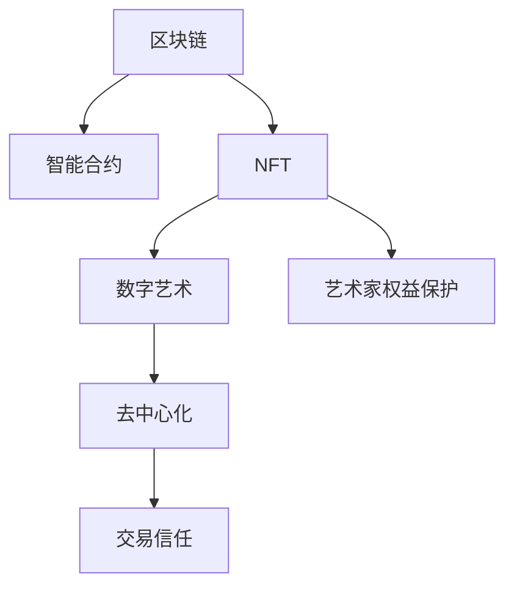

                 

# 区块链在数字艺术与NFT中的应用

> 关键词：区块链,数字艺术,非同质化代币(NFT),智能合约,去中心化,艺术家权益保护

## 1. 背景介绍

### 1.1 问题由来
随着数字技术和互联网的快速发展，艺术界也逐渐从传统线下交易转向线上交易，数字艺术应运而生。数字艺术是指使用数字媒介创作的艺术品，与传统艺术形式如绘画、雕塑等不同，数字艺术作品通常是以数字形式存在的，可以通过网络进行传播和交易。

然而，数字艺术交易面临着诸多问题：
- 版权保护难：数字艺术作品容易被复制和传播，传统版权法无法有效保护数字艺术作品的原创性。
- 交易过程复杂：数字艺术作品的交易需要经过多重身份验证、信任机制，效率低下。
- 所有权确认难：传统艺术品所有权的确认依赖于签名、证书等实体凭证，但数字艺术作品的所有权确认则需要通过技术手段实现。
- 交易信任问题：传统艺术交易依赖于第三方信任机构，而数字艺术交易则需要基于区块链的去中心化信任机制。

为解决这些问题，NFT(Non-Fungible Token, 非同质化代币)应运而生，NFT提供了一种基于区块链技术的新型数字资产形式，通过智能合约和区块链技术，实现了数字艺术作品的所有权、版权等信息的不可篡改和透明化。

### 1.2 问题核心关键点
NFT通过区块链技术，解决了数字艺术交易中的核心问题：
- 版权保护：通过区块链的不可篡改特性，确保数字艺术作品的原创性和版权信息。
- 交易效率：利用智能合约自动执行交易，减少了信任和中介成本，提高交易效率。
- 所有权确认：通过区块链记录所有权信息，确保所有权的不可抵赖性。
- 交易信任：基于区块链的去中心化信任机制，消除了第三方中介的依赖，增加了交易的透明度和安全性。

通过NFT技术，数字艺术作品的创作者和持有者可以更自由地控制和管理自己的作品，享受数字艺术带来的新机会。

## 2. 核心概念与联系

### 2.1 核心概念概述

为更好地理解NFT在数字艺术中的应用，本节将介绍几个密切相关的核心概念：

- 区块链(Blockchain)：一种去中心化的分布式账本技术，通过加密和共识算法保证数据不可篡改和透明。
- 数字艺术(Digital Art)：使用数字媒介创作的艺术品，如数字绘画、数字雕塑、数字影像等。
- 非同质化代币(NFT)：一种基于区块链的数字资产，每个NFT都有唯一的标识和所有权信息。
- 智能合约(Smart Contract)：一种自动执行、透明、可信的计算机协议，存储在区块链上，用于自动执行交易和其他操作。
- 去中心化(Decentralization)：与中心化系统相对，通过分布式网络确保系统的公平性和安全性。
- 艺术家权益保护：利用区块链技术，保护数字艺术作品的创作者权益，包括版权、收益等。

这些核心概念之间的逻辑关系可以通过以下Mermaid流程图来展示：



这个流程图展示了大语言模型的核心概念及其之间的关系：

1. 区块链为数字艺术提供了去中心化的存储和验证机制。
2. 智能合约是区块链上自动执行的协议，用于保护数字艺术作品的版权和所有权。
3. NFT作为数字艺术作品的载体，具有不可复制性和唯一性。
4. 去中心化技术保障了数字艺术交易的透明和公平。
5. 艺术家权益保护依赖于区块链的不可篡改性和智能合约的自动执行。

## 3. 核心算法原理 & 具体操作步骤
### 3.1 算法原理概述

NFT和数字艺术应用基于区块链技术的算法原理，主要包括以下几个关键点：

1. 去中心化存储：区块链利用分布式网络节点存储数据，保证了数据的不可篡改和透明性。
2. 不可篡改性：通过区块链的共识机制，任何单方无法篡改已记录在区块链上的数据。
3. 智能合约：利用区块链的智能合约，自动执行交易、验证所有权和版权等信息。
4. 加密算法：区块链使用加密算法保证数据传输的安全性，防止数据被窃取或篡改。
5. 去中心化交易：区块链上所有的交易都是公开透明的，不需要第三方中介。

### 3.2 算法步骤详解

基于区块链的数字艺术应用主要包括以下几个关键步骤：

**Step 1: 数字艺术创作与验证**
- 艺术家使用数字工具创作数字艺术品。
- 使用数字签名工具验证作品的原创性和所有权。
- 将作品信息上传到区块链平台，通过智能合约进行验证和记录。

**Step 2: 数字艺术品上架与出售**
- 艺术家在区块链平台上创建并发布自己的NFT作品。
- 作品信息（如艺术家姓名、作品名、版权信息等）被记录在区块链上，形成NFT。
- 艺术家设定作品的市场售价和相关条件。

**Step 3: 数字艺术品交易**
- 买家通过区块链平台查看并购买艺术家发布的NFT作品。
- 交易过程自动执行，智能合约验证交易双方身份和所有权信息。
- 交易信息被永久记录在区块链上，保证交易的透明和不可篡改。

**Step 4: 数字艺术品流转与转让**
- 艺术品的所有权和版权信息随NFT一同流转，任何转让都会自动记录在区块链上。
- 任何新的所有者可以查看并验证作品的所有权信息，确保所有权的合法性。

### 3.3 算法优缺点

基于区块链的数字艺术应用具有以下优点：
1. 不可篡改：区块链的不可篡改特性确保了数字艺术品版权的永久性和唯一性。
2. 去中心化：去中心化网络消除了中介机构的依赖，提高了交易效率和公平性。
3. 智能合约：智能合约的自动执行保证了交易的透明性和安全性。
4. 交易信任：基于区块链的去中心化信任机制，提高了交易的可信度。
5. 交易效率：智能合约自动执行减少了中间环节，提高了交易效率。

然而，基于区块链的数字艺术应用也存在一些缺点：
1. 交易费用：区块链上的交易需要支付一定的手续费，增加了艺术品的成本。
2. 技术复杂性：区块链和智能合约技术需要较高的技术门槛，一般用户难以理解和操作。
3. 数据隐私：尽管区块链上的数据公开透明，但艺术品的所有权和版权信息仍需提供，存在一定的隐私风险。
4. 网络延迟：由于区块链网络的延迟，交易速度可能较慢。
5. 安全风险：尽管区块链安全性较高，但仍存在黑客攻击和智能合约漏洞的风险。

尽管存在这些缺点，但基于区块链的数字艺术应用在艺术品的版权保护、交易效率和透明度等方面具有显著优势，推动了数字艺术的发展。

### 3.4 算法应用领域

基于NFT的数字艺术应用已经在多个领域得到广泛应用，如艺术拍卖、数字画廊、艺术收藏等。以下是对其主要应用领域的详细阐述：

**1. 数字艺术拍卖**
数字艺术拍卖平台利用NFT技术，提供了便捷、透明的数字艺术品交易平台。艺术家通过智能合约设定作品的市场售价和相关条件，买家通过平台查看并购买NFT作品。所有交易信息被永久记录在区块链上，保证了交易的透明性和不可篡改性。

**2. 数字画廊**
数字画廊平台使用NFT技术，为数字艺术家提供了一个展示和销售其作品的虚拟平台。艺术家将自己的作品上传至画廊平台，设置作品售价和信息，买家可以随时查看和购买。NFT技术确保了数字艺术品的唯一性和所有权的不可抵赖性。

**3. 艺术收藏**
数字艺术品收藏家可以使用NFT技术，购买并收藏数字艺术品。通过区块链记录的NFT所有权信息，收藏家可以随时验证和转让其收藏的数字艺术品。NFT技术确保了数字艺术品的所有权和版权的合法性和唯一性。

## 4. 数学模型和公式 & 详细讲解 & 举例说明（备注：数学公式请使用latex格式，latex嵌入文中独立段落使用 $$，段落内使用 $)
### 4.1 数学模型构建

NFT和数字艺术应用基于区块链技术的数学模型，主要包括以下几个关键点：

- 哈希算法（Hash Function）：用于将任意长度的消息压缩成固定长度的消息摘要，保证数据的唯一性和不可篡改性。
- 加密算法（Encryption Algorithm）：用于保护数据传输的安全性，防止数据被窃取或篡改。
- 共识机制（Consensus Mechanism）：用于确保区块链上的数据一致性和不可篡改性。

### 4.2 公式推导过程

以下以SHA-256算法为例，推导哈希函数的计算过程：

设原消息为 $M$，长度为 $l$，哈希函数为 $H$，则哈希函数的计算公式为：

$$
H(M) = F(M, K)
$$

其中 $F$ 为哈希函数的具体实现，$K$ 为密钥，对于SHA-256算法，$K$ 为固定长度256位的随机数。

具体计算过程如下：
1. 将消息 $M$ 填充至512位，增加计算的固定长度。
2. 将填充后的消息分成16个32位块。
3. 依次对每个32位块进行SHA-256计算，得到256位哈希值。
4. 将所有256位哈希值拼接，得到最终的512位哈希值。

### 4.3 案例分析与讲解

假设一个数字艺术家希望通过区块链平台发布其数字艺术品，并进行交易。具体步骤如下：

1. 艺术家使用数字工具创作数字艺术品，并通过数字签名工具验证作品的原创性和所有权。
2. 将作品信息（如艺术家姓名、作品名、版权信息等）上传到区块链平台，通过智能合约进行验证和记录。
3. 艺术家设定作品的市场售价和相关条件，生成NFT作品。
4. 买家通过区块链平台查看并购买艺术家发布的NFT作品，智能合约验证交易双方身份和所有权信息。
5. 交易信息被永久记录在区块链上，保证交易的透明和不可篡改。

## 5. 项目实践：代码实例和详细解释说明
### 5.1 开发环境搭建

在进行数字艺术和NFT应用的开发前，我们需要准备好开发环境。以下是使用Python进行区块链开发的环境配置流程：

1. 安装Python：确保Python 3.x版本已安装。
2. 安装区块链开发库：例如，安装以太坊的Python开发库web3.py。
3. 安装数字艺术工具包：例如，安装OpenAI的DALL-E等数字艺术生成工具。
4. 搭建区块链节点：可以使用官方提供的区块链测试网络，如Ropsten，搭建本地测试节点。

完成上述步骤后，即可在本地进行数字艺术和NFT应用的开发。

### 5.2 源代码详细实现

以下以Ethereum上的数字艺术品为例，给出使用web3.py库进行NFT开发的PyTorch代码实现。

首先，定义智能合约代码：

```python
from web3 import Web3, HTTPProvider
from web3.eth import accounts

# 连接测试网
provider = HTTPProvider('http://localhost:8545')
web3 = Web3(provider)
web3.eth.defaultAccounts = [0x1234567890abcdef]

# 定义智能合约
contract = """
pragma solidity ^0.8.0;

contract DigitalArt {
    uint256 public id;
    string public artist;
    string public title;
    bytes32 public hash;
    address payable public buyer;
    uint256 public price;

    constructor(uint256 _id, string memory _artist, string memory _title, bytes32 _hash, uint256 _price) {
        id = _id;
        artist = _artist;
        title = _title;
        hash = _hash;
        price = _price;
    }

    function sell() public payable {
        buyer = msg.sender;
        if (msg.value == price) {
            emit DigitalArtSold(id, msg.sender, buyer);
        } else {
            emit InvalidPrice();
        }
    }
}
"""
compiled_code = web3.eth.compile(contract)
abi = web3.eth.abi.compile(compiled_code)
address = web3.eth.deployContract(compiled_code)

# 创建NFT并出售
artwork = {
    'id': 1,
    'artist': 'Alice',
    'title': 'Digital Painting',
    'hash': '0x1234567890abcdef',
    'price': 1.0
}

# 实例化智能合约
nft_contract = web3.eth.contract(address=address, abi=abi)

# 创建NFT并出售
tx = nft_contract.functions.createArtwork(artwork['id'], artwork['artist'], artwork['title'], artwork['hash'], artwork['price']).send({'to': address, 'from': web3.eth.defaultAccounts[0], 'value': artwork['price']})

# 验证NFT信息
nft_info = nft_contract.functions.getArtworkInfo(artwork['id']).call()
print(nft_info)
```

然后，定义数字艺术生成和验证的代码：

```python
from PIL import Image
from io import BytesIO
import requests
import hashlib

# 生成数字艺术作品
def generate_digital_artwork():
    image = Image.open('artwork.png')
    canvas = Image.new('RGB', (512, 512), color='black')
    canvas.paste(image, (0, 0))
    canvas.save('artwork.png')

# 验证数字艺术品
def verify_digital_artwork(hash):
    digest = hashlib.sha256(open('artwork.png', 'rb').read()).hexdigest()
    return digest == hash
```

最后，定义区块链上的NFT交易代码：

```python
from web3 import Web3, HTTPProvider

# 连接测试网
provider = HTTPProvider('http://localhost:8545')
web3 = Web3(provider)
web3.eth.defaultAccounts = [0x1234567890abcdef]

# 实例化智能合约
contract = web3.eth.contract(address='0x1234567890abcdef', abi=abi)

# 购买NFT
def buy_nft(nft_id):
    tx = contract.functions.buyArtwork(nft_id).send({'to': contract.address, 'from': web3.eth.defaultAccounts[0], 'value': contract.functions.getArtworkPrice(nft_id).call()})

# 验证NFT所有权
def verify_nft_ownership(nft_id):
    owner = contract.functions.getOwner(nft_id).call()
    return owner == web3.eth.defaultAccounts[0]
```

## 6. 实际应用场景
### 6.1 数字艺术拍卖

数字艺术拍卖平台利用NFT技术，提供了便捷、透明的数字艺术品交易平台。艺术家通过智能合约设定作品的市场售价和相关条件，买家通过平台查看并购买NFT作品。所有交易信息被永久记录在区块链上，保证了交易的透明性和不可篡改性。

### 6.2 数字画廊

数字画廊平台使用NFT技术，为数字艺术家提供了一个展示和销售其作品的虚拟平台。艺术家将自己的作品上传至画廊平台，设置作品售价和信息，买家可以随时查看和购买。NFT技术确保了数字艺术品的唯一性和所有权的不可抵赖性。

### 6.3 艺术收藏

数字艺术品收藏家可以使用NFT技术，购买并收藏数字艺术品。通过区块链记录的NFT所有权信息，收藏家可以随时验证和转让其收藏的数字艺术品。NFT技术确保了数字艺术品的所有权和版权的合法性和唯一性。

### 6.4 未来应用展望

随着NFT技术的不断发展，其在数字艺术和相关领域的应用将更加广泛和深入。未来可能的趋势包括：

1. 数字艺术品金融化：NFT将成为数字艺术品交易和金融的新型载体，带来新的投资机会和商业模式。
2. 艺术品的数字化保护：NFT技术将为传统艺术品提供更高效、安全的数字化保护。
3. 数字艺术市场的普及：随着NFT技术的普及，数字艺术品市场将逐渐扩大，带来新的市场需求和就业机会。
4. 跨链NFT交易：不同区块链之间的NFT交易将变得更加便捷和高效，打破平台和网络的壁垒。
5. 智能合约的自动化应用：更多的智能合约将应用于数字艺术交易，实现自动化的艺术品管理、版权保护等功能。

## 7. 工具和资源推荐
### 7.1 学习资源推荐

为了帮助开发者系统掌握数字艺术和NFT的应用技术，这里推荐一些优质的学习资源：

1. 《区块链技术与数字艺术》课程：由知名区块链专家讲授，深入讲解区块链技术和数字艺术应用的最新进展。
2. 《NFT的原理与实践》书籍：由NFT领域的专家编写，详细介绍了NFT技术的实现原理和应用案例。
3. 《智能合约编程指南》书籍：介绍了智能合约的编写和部署流程，适合NFT应用开发的初学者。
4. 区块链开发社区：如以太坊开发者社区、Ropsten测试网社区，提供大量的学习和交流资源。
5. 数字艺术社区：如ArtStation、DeviantArt等，展示和分享数字艺术作品，提供灵感和创意。

通过这些资源的学习实践，相信你一定能够快速掌握数字艺术和NFT应用的技术，并用于解决实际的NLP问题。
###  7.2 开发工具推荐

高效的开发离不开优秀的工具支持。以下是几款用于数字艺术和NFT应用的常用工具：

1. Web3.py：用于连接Ethereum等区块链网络的Python开发库。
2. DALL-E：由OpenAI开发的数字艺术生成工具，支持从文本描述生成数字艺术品。
3. VASP：数字资产管理工具，帮助艺术家管理和销售其NFT作品。
4. IPFS：分布式文件系统，用于存储和传输数字艺术品，提供去中心化的存储解决方案。
5. MetaMask：基于Web3的钱包应用，支持数字资产的购买、销售和管理。

合理利用这些工具，可以显著提升数字艺术和NFT应用的开发效率，加快创新迭代的步伐。

### 7.3 相关论文推荐

数字艺术和NFT技术的发展源于学界的持续研究。以下是几篇奠基性的相关论文，推荐阅读：

1. Smart Contracts: Trustless Interactions（以太坊的智能合约论文）：介绍了以太坊智能合约的实现原理和应用场景。
2. Non-Fungible Tokens: Blockchain-based Identity Management for Digital Art and Beyond（NFT技术的原理与实现）：介绍了NFT技术的原理和应用，特别是数字艺术品保护方面的研究。
3. Digital Art and Blockchain：探讨了区块链技术在数字艺术中的应用，包括版权保护和市场交易。
4. Blockchain for Art Transactions（区块链在艺术交易中的应用）：介绍了区块链技术在艺术拍卖和交易中的应用，并对比了其优势和劣势。
5. Smart Contract-based Digital Art Sale Platform（基于智能合约的数字艺术品销售平台）：介绍了基于智能合约的数字艺术品销售平台的实现，并评估了其效果和可行性。

这些论文代表了大语言模型微调技术的发展脉络。通过学习这些前沿成果，可以帮助研究者把握学科前进方向，激发更多的创新灵感。

## 8. 总结：未来发展趋势与挑战
### 8.1 总结

本文对区块链在数字艺术与NFT中的应用进行了全面系统的介绍。首先阐述了数字艺术和NFT的背景和意义，明确了NFT在数字艺术品版权保护、交易效率和所有权确认等方面的独特价值。其次，从原理到实践，详细讲解了NFT和数字艺术应用的核心算法和操作步骤，给出了完整的代码实例。同时，本文还广泛探讨了NFT技术在数字艺术拍卖、数字画廊、艺术收藏等多个领域的应用前景，展示了NFT技术的广泛应用潜力。此外，本文精选了区块链和NFT技术的学习资源，力求为读者提供全方位的技术指引。

通过本文的系统梳理，可以看到，NFT技术在数字艺术中的应用，极大地提升了数字艺术品的版权保护、交易效率和透明度。NFT技术也为数字艺术交易和市场化提供了新的路径，带来了新的商业机会和创新场景。未来，随着NFT技术的不断发展，数字艺术品市场将进一步扩大，数字艺术和区块链技术的融合也将更加深入，推动艺术界的数字化转型。

### 8.2 未来发展趋势

展望未来，NFT技术在数字艺术和相关领域的应用将呈现以下几个发展趋势：

1. 数字艺术市场成熟：随着NFT技术的成熟和普及，数字艺术市场将逐渐成熟和稳定，吸引更多的投资者和收藏家。
2. 数字艺术形式多样化：随着技术的不断进步，数字艺术形式将更加丰富多样，涵盖更多种类的数字艺术品。
3. 智能合约的普及：智能合约将在数字艺术交易和管理中得到更广泛的应用，带来更高的交易效率和透明度。
4. 跨链交易的实现：不同区块链之间的NFT交易将变得更加便捷和高效，打破平台和网络的壁垒。
5. 去中心化艺术社区：去中心化的艺术社区将为艺术家提供更公平、自由的艺术创作和展示平台，提升艺术创作的自由度和多样性。
6. 数字艺术教育普及：数字艺术教育将逐步普及，为更多人提供学习和创作的机会，推动数字艺术的普及和创新。

### 8.3 面临的挑战

尽管NFT技术在数字艺术和相关领域的应用取得了显著进展，但在迈向更加智能化、普适化应用的过程中，它仍面临诸多挑战：

1. 技术门槛高：区块链和智能合约技术需要较高的技术门槛，一般用户难以理解和操作。
2. 交易成本高：NFT交易需要支付一定的手续费，增加了数字艺术品的成本。
3. 网络延迟和效率：区块链网络延迟可能导致交易效率低下。
4. 安全性和隐私问题：尽管区块链安全性较高，但仍存在智能合约漏洞和隐私风险。
5. 法律和监管问题：NFT技术的应用涉及法律和监管问题，需要制定相应的法律规范和监管措施。

尽管存在这些挑战，但NFT技术在数字艺术和相关领域的应用前景广阔，未来仍有很大的发展空间。

### 8.4 研究展望

面对NFT技术在数字艺术应用中面临的挑战，未来的研究需要在以下几个方面寻求新的突破：

1. 简化NFT技术和智能合约的使用：开发易于理解和使用的新型NFT应用平台，降低技术门槛。
2. 优化NFT交易成本：通过技术改进和激励机制，降低NFT交易的手续费和成本。
3. 提高区块链网络效率：通过优化共识机制和网络架构，提高区块链的交易速度和效率。
4. 增强NFT安全性：通过智能合约的设计和验证，增强NFT的安全性和隐私保护。
5. 制定NFT应用法规：与法律和监管机构合作，制定和完善NFT应用的法律法规，保障用户权益。

这些研究方向的探索，将推动NFT技术在数字艺术和相关领域的应用，带来更加广泛和深入的影响。

## 9. 附录：常见问题与解答
----------------------------------------------------------------

**Q1：什么是区块链和NFT？**

A: 区块链是一种去中心化的分布式账本技术，利用加密和共识算法保证数据不可篡改和透明。NFT是一种基于区块链的数字资产，每个NFT都有唯一的标识和所有权信息。

**Q2：NFT技术在数字艺术应用中的核心优势是什么？**

A: NFT技术在数字艺术应用中的核心优势包括：
1. 不可篡改：区块链的不可篡改特性确保了数字艺术品版权的永久性和唯一性。
2. 去中心化：去中心化网络消除了中介机构的依赖，提高了交易效率和公平性。
3. 智能合约：智能合约的自动执行保证了交易的透明性和安全性。
4. 交易信任：基于区块链的去中心化信任机制，提高了交易的可信度。
5. 交易效率：智能合约自动执行减少了中间环节，提高了交易效率。

**Q3：如何生成和验证数字艺术品？**

A: 数字艺术品的生成通常使用数字艺术工具和平台，如DALL-E、ArtStation等。数字艺术品的验证则通过智能合约中的哈希算法，验证作品与区块链上存储的哈希值是否匹配。

**Q4：NFT技术在数字艺术品交易中的优势是什么？**

A: NFT技术在数字艺术品交易中的优势包括：
1. 唯一性和不可抵赖性：每个NFT都有唯一的标识和所有权信息，确保了数字艺术品所有权的不可抵赖性。
2. 透明性和安全性：所有交易信息被永久记录在区块链上，保证了交易的透明性和安全性。
3. 便捷性和效率：NFT交易自动执行，减少了中间环节，提高了交易效率。

**Q5：NFT技术在数字艺术应用中存在哪些挑战？**

A: NFT技术在数字艺术应用中存在以下挑战：
1. 技术门槛高：区块链和智能合约技术需要较高的技术门槛，一般用户难以理解和操作。
2. 交易成本高：NFT交易需要支付一定的手续费，增加了数字艺术品的成本。
3. 网络延迟和效率：区块链网络延迟可能导致交易效率低下。
4. 安全性和隐私问题：尽管区块链安全性较高，但仍存在智能合约漏洞和隐私风险。
5. 法律和监管问题：NFT技术的应用涉及法律和监管问题，需要制定相应的法律规范和监管措施。

通过本文的系统梳理，可以看到，NFT技术在数字艺术中的应用，极大地提升了数字艺术品的版权保护、交易效率和透明度。NFT技术也为数字艺术交易和市场化提供了新的路径，带来了新的商业机会和创新场景。未来，随着NFT技术的不断发展，数字艺术品市场将进一步扩大，数字艺术和区块链技术的融合也将更加深入，推动艺术界的数字化转型。

