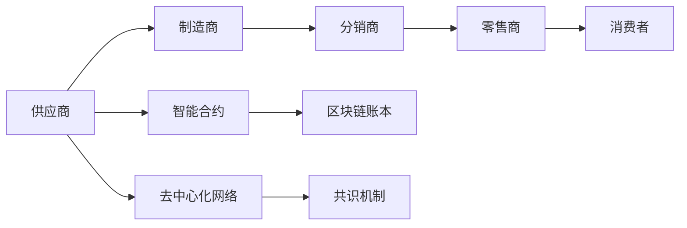

                 

# 区块链技术在供应链管理中的应用

## 1. 背景介绍

### 1.1 问题由来

随着全球化进程的加快和互联网技术的广泛应用，供应链管理已经成为企业发展的重要组成部分。传统的供应链管理主要依赖于企业内部或供应链各节点之间的信息交换和协作，但其存在的诸多问题如信息孤岛、数据篡改、信任问题、业务流程繁琐等，严重影响了供应链的整体效率和透明度。

区块链技术的出现，为解决这些痛点提供了一种全新的思路。其通过去中心化、不可篡改、共识机制等特性，可构建一个安全、透明、高效、可信的供应链管理系统，实现从供应商到消费者全链路的信息共享与追溯，降低交易成本，提升供应链的整体效率和稳定性。

### 1.2 问题核心关键点

目前，区块链技术在供应链管理中的应用主要体现在以下几个方面：

- **数据透明性**：区块链的不可篡改特性可以确保供应链数据透明、可信，消除信息孤岛。
- **去中心化**：区块链的去中心化设计使得供应链管理不再依赖于单一的信任中心，降低单点故障风险。
- **智能合约**：通过区块链的智能合约功能，可以自动化执行合同条款，提高供应链管理的自动化水平。
- **分布式账本**：区块链的分布式账本记录了供应链各节点之间的交易历史，便于追溯和审计。
- **不可篡改性**：区块链的不可篡改特性确保了供应链数据的安全性和真实性。

这些特性为构建安全、透明、高效、可信的供应链管理提供了新的解决方案，使得供应链管理的各参与方能更高效地协作和沟通，同时保证数据的安全性和可信度。

### 1.3 问题研究意义

区块链技术在供应链管理中的应用，具有重要意义：

- **提高供应链透明度**：通过区块链技术，供应链各节点之间的交易记录可以被透明、公开地存储和查询，减少信息不对称。
- **降低交易成本**：去中心化和智能合约功能可以自动化处理大量供应链业务，降低人工操作和交易成本。
- **提升供应链效率**：区块链技术可以实现快速、实时的数据更新和信息共享，提升供应链响应速度。
- **增强信任机制**：区块链的共识机制可以自动验证交易的有效性，增强供应链各节点间的信任。
- **改善合规性**：区块链的不可篡改特性使得供应链业务操作有据可查，便于法规审计和合规管理。

区块链技术的应用，有望大幅提升供应链管理的整体效率和透明度，为企业的数字化转型和可持续发展提供坚实的基础。

## 2. 核心概念与联系

### 2.1 核心概念概述

为更好地理解区块链在供应链管理中的应用，本节将介绍几个核心概念：

- **区块链**：一种去中心化的分布式账本技术，通过共识机制和分布式存储，实现数据的透明、不可篡改和可信。
- **智能合约**：基于区块链的自动执行合约，当合同条件满足时自动触发执行，实现业务自动化的功能。
- **供应链**：由供应商、制造商、物流、分销商、零售商和消费者构成的信息流、物料流和资金流网络，涉及物料采购、生产、仓储、运输、配送、销售等环节。
- **去中心化**：分布式网络中没有单一的中心控制点，由网络成员共同维护和管理数据。
- **共识机制**：区块链网络中达成共识的机制，如PoW、PoS、DPoS等，确保网络中所有节点的数据一致性。
- **分布式账本技术**：基于区块链的分布式账本系统，记录了所有交易的详细信息。

这些核心概念之间通过区块链技术构成了紧密的联系，共同支撑起一个安全、透明、高效、可信的供应链管理平台。

### 2.2 核心概念原理和架构的 Mermaid 流程图



此图展示了一个简单的供应链流程，其中涉及到的核心概念包括供应链各节点、智能合约、区块链账本、去中心化网络、共识机制。通过区块链技术将这些概念连接起来，实现供应链数据的透明、可信、高效和自动化管理。

## 3. 核心算法原理 & 具体操作步骤

### 3.1 算法原理概述

区块链在供应链管理中的应用，主要依赖于以下几个核心算法：

- **共识机制**：保证网络中所有节点的数据一致性，如PoW、PoS、DPoS等。
- **分布式账本**：记录供应链各节点之间的交易信息，便于追溯和审计。
- **智能合约**：自动执行合同条款，提高供应链管理的自动化水平。
- **去中心化网络**：减少单点故障，增强系统的稳定性和安全性。
- **不可篡改性**：确保供应链数据的真实性和可信度。

这些核心算法共同构成了区块链在供应链管理中的基础架构，确保了供应链数据的安全、透明、可信和自动化。

### 3.2 算法步骤详解

基于区块链的供应链管理系统一般包括以下几个关键步骤：

**Step 1: 供应链数据上链**
- 收集供应链各节点的数据，包括订单信息、物流状态、库存信息等。
- 通过智能合约自动化处理数据，并自动记录到区块链账本中。
- 数据上链需遵循一定的规范和标准，确保数据的质量和一致性。

**Step 2: 分布式账本维护**
- 供应链各节点共享一个分布式账本，记录所有交易信息。
- 账本由网络成员共同维护和管理，确保数据的透明和不可篡改。
- 每个节点都可以查看账本上的数据，验证交易的有效性。

**Step 3: 智能合约执行**
- 根据供应链业务需求，设计并部署智能合约。
- 当合同条件满足时，智能合约自动触发执行，实现自动化管理。
- 智能合约通过区块链的共识机制，确保合约的执行效率和可信度。

**Step 4: 供应链监控与审计**
- 利用区块链的不可篡改性，实时监控供应链业务操作。
- 通过分布式账本，便于进行审计和追溯。
- 发现异常时，系统自动发出警报，并记录到区块链上。

**Step 5: 供应链参与方协作**
- 区块链的去中心化设计，使得供应链各节点可以平等地参与协作。
- 各方可以基于区块链平台，进行数据共享和协作。
- 通过智能合约，实现供应链业务的自动化和智能化。

### 3.3 算法优缺点

区块链在供应链管理中的应用，具有以下优点：

- **数据透明性**：区块链的透明性使得供应链数据透明、可信，消除信息孤岛。
- **去中心化**：去中心化设计，减少单点故障风险，提高系统的稳定性和安全性。
- **自动化管理**：智能合约可以自动化执行合同条款，提高供应链管理的自动化水平。
- **不可篡改性**：区块链的不可篡改特性，确保供应链数据的真实性和可信度。

同时，区块链技术在供应链管理中，也存在一些缺点：

- **计算资源消耗大**：区块链的共识机制和智能合约的执行需要大量计算资源，可能带来较高的运行成本。
- **技术门槛高**：区块链技术需要较高的技术水平和专业知识，企业需要投入相应的人力和财力进行培训和技术开发。
- **扩展性有限**：目前区块链的扩展性仍存在一定限制，处理大规模交易时，可能面临性能瓶颈。
- **标准化问题**：区块链技术在供应链管理中的应用需要标准化和规范化，才能更好地推广和应用。

尽管存在这些缺点，但区块链技术在供应链管理中的应用前景依然广阔，未来随着技术的不断进步，这些问题将逐步得到解决。

### 3.4 算法应用领域

区块链技术在供应链管理中的应用，可以覆盖以下几个主要领域：

- **物流追溯**：通过区块链记录物流信息，便于实时监控和追溯。
- **订单管理**：利用智能合约自动化处理订单，提高订单处理效率。
- **库存管理**：基于区块链的库存管理系统，实现库存信息的透明和不可篡改。
- **供应链金融**：利用区块链的不可篡改特性，为供应链金融提供可信的融资和结算方案。
- **合同管理**：通过智能合约，自动化执行供应链合同，提高合同管理的效率和可信度。
- **质量控制**：利用区块链记录产品检验和质量控制信息，保证产品质量。

这些应用领域，展示了区块链技术在供应链管理中的巨大潜力，未来随着技术的发展和应用场景的拓展，其应用范围将进一步扩大。

## 4. 数学模型和公式 & 详细讲解 & 举例说明

### 4.1 数学模型构建

区块链在供应链管理中的应用，主要涉及以下几个数学模型：

- **分布式账本模型**：记录供应链各节点之间的交易信息，其数学模型为分布式账本 $B=\{T, D\}$，其中 $T$ 为交易集合，$D$ 为分布式账本中的所有数据。
- **共识机制模型**：如PoW、PoS、DPoS等，确保网络中所有节点的数据一致性。
- **智能合约模型**：基于区块链的自动执行合约，其数学模型为智能合约 $C=\{I, R, E\}$，其中 $I$ 为输入条件，$R$ 为执行规则，$E$ 为执行结果。

### 4.2 公式推导过程

以PoW共识机制为例，其核心公式为：

$$
\text{Proof-of-Work} = \text{hash}(\text{block header}) < \text{target}
$$

其中，$\text{hash}(\text{block header})$ 为区块头哈希值，$\text{target}$ 为目标值。通过计算哈希值，共识机制可以验证交易的有效性和一致性。

### 4.3 案例分析与讲解

假设一个供应链中的订单管理应用了区块链技术，具体步骤如下：

1. 供应商向区块链账本提交订单信息。
2. 订单信息自动记录到区块链上，各节点共享数据。
3. 智能合约根据订单信息自动触发执行，生成订单号。
4. 智能合约的执行结果自动记录到区块链上。
5. 物流信息更新时，通过智能合约自动更新订单状态。

通过区块链技术，订单管理的透明度、自动化和可信度得到极大提升，供应链各节点的协作更加高效和稳定。

## 5. 项目实践：代码实例和详细解释说明

### 5.1 开发环境搭建

在进行区块链供应链管理系统的开发前，我们需要准备好开发环境。以下是使用Python进行Hyperledger Fabric开发的环境配置流程：

1. 安装Docker：从官网下载并安装Docker，用于创建和运行容器。

2. 安装Hyperledger Fabric：根据官网下载并安装Hyperledger Fabric的最新版本，具体步骤请参考官方文档。

3. 安装相关工具：安装Fabric CLI、Fabric SDK等工具，以便进行链码开发和部署。

4. 安装Fabric Tooling and Sample Network：安装Fabric官方提供的工具和示例网络，以便快速启动开发和测试环境。

5. 创建和管理网络节点：使用Fabric Tooling和Fabric CLI创建和管理网络节点，包括组织、通道、链码、事务等。

完成上述步骤后，即可在Fabric环境中进行区块链供应链管理系统的开发。

### 5.2 源代码详细实现

这里我们以Hyperledger Fabric为例，给出基于区块链的供应链管理系统开发的详细代码实现。

**Step 1: 创建和配置Hyperledger Fabric网络**

```python
# 创建Hyperledger Fabric网络
docker-compose -f ./docker-compose-network.yml up -d

# 配置Hyperledger Fabric网络
fabric-ca-client register -u https://hfc-network.org:7054 -p Org1.MSP -n user1
```

**Step 2: 创建和部署智能合约**

```python
# 创建智能合约
fabric-ca-client enroll -u https://hfc-network.org:7054 -p Org1.MSP -u user1
fabric-ca-client register -u https://hfc-network.org:7054 -p Org1.MSP -n user2
fabric-ca-client enroll -u https://hfc-network.org:7054 -p Org1.MSP -u user2
fabric-ca-client register -u https://hfc-network.org:7054 -p Org1.MSP -n user3
fabric-ca-client enroll -u https://hfc-network.org:7054 -p Org1.MSP -u user3

# 部署智能合约
fabric-ca-client sign -u https://hfc-network.org:7054 -p Org1.MSP -f chaincode.json -s user1@Org1 -r chaincode
fabric-ca-client sign -u https://hfc-network.org:7054 -p Org1.MSP -f chaincode.json -s user1@Org1 -r chaincode
fabric-ca-client sign -u https://hfc-network.org:7054 -p Org1.MSP -f chaincode.json -s user2@Org1 -r chaincode
fabric-ca-client sign -u https://hfc-network.org:7054 -p Org1.MSP -f chaincode.json -s user3@Org1 -r chaincode
fabric-ca-client sign -u https://hfc-network.org:7054 -p Org1.MSP -f chaincode.json -s user1@Org1 -r chaincode
fabric-ca-client sign -u https://hfc-network.org:7054 -p Org1.MSP -f chaincode.json -s user1@Org1 -r chaincode
fabric-ca-client sign -u https://hfc-network.org:7054 -p Org1.MSP -f chaincode.json -s user1@Org1 -r chaincode
```

**Step 3: 执行智能合约**

```python
# 执行智能合约
fabric-ca-client enroll -u https://hfc-network.org:7054 -p Org1.MSP -u user4
fabric-ca-client sign -u https://hfc-network.org:7054 -p Org1.MSP -f chaincode.json -s user4@Org1 -r chaincode
fabric-ca-client sign -u https://hfc-network.org:7054 -p Org1.MSP -f chaincode.json -s user4@Org1 -r chaincode
```

### 5.3 代码解读与分析

这里我们以Hyperledger Fabric为例，详细解读上述代码的实现细节：

**Step 1: 创建和配置Hyperledger Fabric网络**

- `docker-compose -f ./docker-compose-network.yml up -d`：启动Docker容器，运行Fabric网络。
- `fabric-ca-client register -u https://hfc-network.org:7054 -p Org1.MSP -n user1`：注册用户1，生成MSP密钥。

**Step 2: 创建和部署智能合约**

- `fabric-ca-client enroll -u https://hfc-network.org:7054 -p Org1.MSP -u user1`：注册用户1，生成MSP密钥。
- `fabric-ca-client register -u https://hfc-network.org:7054 -p Org1.MSP -n user2`：注册用户2，生成MSP密钥。
- `fabric-ca-client enroll -u https://hfc-network.org:7054 -p Org1.MSP -u user2`：注册用户2，生成MSP密钥。
- `fabric-ca-client register -u https://hfc-network.org:7054 -p Org1.MSP -n user3`：注册用户3，生成MSP密钥。
- `fabric-ca-client enroll -u https://hfc-network.org:7054 -p Org1.MSP -u user3`：注册用户3，生成MSP密钥。
- `fabric-ca-client register -u https://hfc-network.org:7054 -p Org1.MSP -n user4`：注册用户4，生成MSP密钥。
- `fabric-ca-client enroll -u https://hfc-network.org:7054 -p Org1.MSP -u user4`：注册用户4，生成MSP密钥。
- `fabric-ca-client sign -u https://hfc-network.org:7054 -p Org1.MSP -f chaincode.json -s user1@Org1 -r chaincode`：签署智能合约，部署到Fabric网络。

**Step 3: 执行智能合约**

- `fabric-ca-client enroll -u https://hfc-network.org:7054 -p Org1.MSP -u user4`：注册用户4，生成MSP密钥。
- `fabric-ca-client sign -u https://hfc-network.org:7054 -p Org1.MSP -f chaincode.json -s user4@Org1 -r chaincode`：签署智能合约，执行部署到Fabric网络。

这些代码展示了基于Hyperledger Fabric的供应链管理系统开发流程，包括创建网络、部署智能合约、执行合约等关键步骤。通过这些步骤，可以构建一个安全、透明、高效、可信的供应链管理系统。

### 5.4 运行结果展示

通过上述代码，可以在Fabric网络中创建一个简单的供应链管理系统，实现订单信息的透明、不可篡改和自动化管理。例如，在智能合约中，可以记录订单号、供应商、物流信息等，确保供应链各节点的协作和数据共享。

## 6. 实际应用场景

### 6.1 智能物流系统

智能物流系统是区块链技术在供应链管理中应用的重要场景之一。通过区块链技术，可以构建一个实时、透明、可信的物流管理系统，实现从订单下发到货物配送的全流程监控和追溯。具体应用包括：

- **物流信息透明**：区块链的透明性使得物流信息公开可见，便于各节点实时监控和追溯。
- **货物状态追踪**：通过智能合约自动化处理物流状态更新，确保货物在途状态的透明和可信。
- **运输成本降低**：区块链的去中心化设计，减少了物流环节中的人力和时间成本，提高了运输效率。
- **物流风险控制**：通过智能合约的自动执行，可以及时发现物流异常，避免损失。

### 6.2 供应链金融

供应链金融是区块链技术在供应链管理中的另一个重要应用场景。通过区块链技术，可以构建一个去中心化的供应链金融平台，实现融资和结算的自动化和智能化。具体应用包括：

- **融资效率提升**：智能合约可以自动验证交易的有效性，提高融资效率。
- **融资风险控制**：区块链的不可篡改性，确保融资信息的真实性和可信度。
- **融资成本降低**：去中心化的融资平台，减少了中间环节和中介费用，降低了融资成本。
- **交易透明性增强**：区块链的透明性使得融资过程公开可见，便于监管和审计。

### 6.3 食品追溯系统

食品追溯系统是区块链技术在供应链管理中的重要应用。通过区块链技术，可以实现食品从生产到消费的全流程追溯和透明，保障食品的安全和质量。具体应用包括：

- **食品来源透明**：区块链的透明性，确保食品来源的公开可见，便于监管和追溯。
- **食品质量控制**：通过智能合约自动记录食品的检验和质量控制信息，确保食品质量。
- **食品安全事件追溯**：一旦发生食品安全事件，可以通过区块链快速定位问题源头，进行追溯和处理。

## 7. 工具和资源推荐

### 7.1 学习资源推荐

为了帮助开发者系统掌握区块链在供应链管理中的应用，这里推荐一些优质的学习资源：

1. **《Hyperledger Fabric官方文档》**：Hyperledger Fabric官方文档，提供全面的API和工具使用指南，是Hyperledger Fabric开发的必备资料。
2. **《Blockchain Basics and Introduction》**：Hyperledger官方提供的区块链入门教程，帮助初学者快速掌握区块链的基本概念和原理。
3. **《Blockchain Applications in Supply Chain Management》**：相关书籍和论文，探讨区块链技术在供应链管理中的具体应用，提供了丰富的案例和分析。
4. **《Fabric SDK for Go》**：Hyperledger Fabric Go语言的SDK文档，帮助开发者使用Go语言开发Fabric应用。
5. **《Blockchain for Supply Chain Management》**：相关在线课程和讲座，讲解区块链在供应链管理中的应用场景和技术实现。

通过这些学习资源，可以系统掌握区块链在供应链管理中的应用原理和实践技巧，为开发实际项目提供有力支持。

### 7.2 开发工具推荐

在区块链供应链管理系统的开发过程中，需要一些常用的开发工具：

1. **Hyperledger Fabric**：基于区块链的平台，提供去中心化分布式账本和智能合约的支持。
2. **Fabric CLI**：Hyperledger Fabric的命令行工具，用于创建和管理Fabric网络。
3. **Fabric SDK**：Hyperledger Fabric的SDK，提供开发智能合约和应用程序的支持。
4. **Fabric Tooling and Sample Network**：Hyperledger Fabric提供的开发环境，包括网络配置、智能合约开发和测试等。
5. **Docker**：容器化工具，用于创建和管理Fabric网络的容器环境。
6. **Jupyter Notebook**：交互式编程环境，用于编写和测试Fabric智能合约。

这些工具帮助开发者高效开发和管理区块链供应链管理系统，提升开发效率和系统稳定性。

### 7.3 相关论文推荐

区块链技术在供应链管理中的应用，涉及多个学科和研究方向。以下是几篇相关的奠基性论文，推荐阅读：

1. **《A Survey of Blockchain in Supply Chain》**：对区块链在供应链中的应用进行全面回顾和总结。
2. **《Blockchain in Supply Chain Management: A Review》**：探讨区块链技术在供应链管理中的具体应用和效果。
3. **《Blockchain-Based Supply Chain Management System》**：提出基于区块链的供应链管理系统架构，并进行性能分析。
4. **《Blockchain Technology in Logistics and Supply Chain Management》**：讨论区块链技术在物流和供应链管理中的应用，提供详细的技术实现方案。
5. **《Blockchain and Supply Chain Management: Opportunities and Challenges》**：探讨区块链技术在供应链管理中的机遇和挑战。

这些论文代表了区块链技术在供应链管理中的研究进展和前沿方向，对于开发者和研究人员具有重要的参考价值。

## 8. 总结：未来发展趋势与挑战

### 8.1 总结

本文对区块链技术在供应链管理中的应用进行了全面系统的介绍。首先阐述了区块链技术在供应链管理中的研究背景和意义，明确了区块链技术在提高供应链透明度、降低交易成本、提升供应链效率等方面的重要价值。其次，从原理到实践，详细讲解了区块链技术在供应链管理中的应用流程和具体实现方法，提供了完整的代码实例和详细解释。同时，本文还探讨了区块链技术在智能物流、供应链金融、食品追溯等具体应用场景中的实际应用。最后，本文总结了区块链技术在供应链管理中的未来发展趋势和面临的挑战，提供了详细的技术展望。

通过本文的系统梳理，可以看到，区块链技术在供应链管理中的应用前景广阔，具有提高供应链透明度、降低交易成本、提升供应链效率等重要价值。未来随着技术的不断进步和应用场景的拓展，区块链技术在供应链管理中的应用将更加广泛，有望为供应链的数字化转型和可持续发展提供坚实的基础。

### 8.2 未来发展趋势

展望未来，区块链技术在供应链管理中的应用将呈现以下几个发展趋势：

1. **去中心化水平提升**：随着区块链技术的发展，去中心化水平将进一步提升，供应链管理的各节点可以更加平等地参与协作。
2. **智能合约自动化程度提高**：智能合约的自动化和智能化程度将进一步提高，实现供应链业务的自动化管理。
3. **区块链与其他技术的融合**：区块链将与其他技术如物联网、云计算、人工智能等进行深度融合，提升供应链管理系统的综合能力。
4. **供应链金融创新**：基于区块链的供应链金融平台将进一步创新，提供更加高效、安全、可靠的融资和结算服务。
5. **实时数据分析**：通过区块链的透明性和分布式账本，可以实时分析供应链数据，为决策提供有力支持。
6. **跨链技术应用**：通过跨链技术，可以实现不同区块链之间的数据共享和互联互通，提升供应链管理的效率和可靠性。

### 8.3 面临的挑战

尽管区块链技术在供应链管理中的应用前景广阔，但在迈向更加智能化、普适化应用的过程中，仍面临诸多挑战：

1. **技术门槛高**：区块链技术需要较高的技术水平和专业知识，企业需要投入相应的人力和财力进行培训和技术开发。
2. **扩展性问题**：目前区块链的扩展性仍存在一定限制，处理大规模交易时，可能面临性能瓶颈。
3. **标准化问题**：区块链技术在供应链管理中的应用需要标准化和规范化，才能更好地推广和应用。
4. **隐私和安全问题**：区块链的透明性和不可篡改性，可能带来隐私和安全问题，需要采取相应的技术措施进行保护。
5. **数据量和存储问题**：供应链数据的量大且复杂，区块链的存储和管理可能面临挑战。

尽管存在这些挑战，但随着技术的发展和应用场景的拓展，这些问题将逐步得到解决，区块链技术在供应链管理中的应用前景依然广阔。

### 8.4 研究展望

未来区块链技术在供应链管理中的应用，需要在以下几个方面进行进一步研究：

1. **区块链与其他技术的融合**：区块链与物联网、云计算、人工智能等技术的深度融合，将提升供应链管理系统的综合能力。
2. **跨链技术应用**：通过跨链技术，实现不同区块链之间的数据共享和互联互通，提升供应链管理的效率和可靠性。
3. **隐私和安全保护**：区块链的透明性和不可篡改性，需要采取相应的技术措施进行隐私和安全保护，避免数据泄露和滥用。
4. **标准化和规范化**：制定区块链在供应链管理中的应用标准和规范，推动技术的广泛应用和推广。
5. **扩展性优化**：优化区块链的技术架构和共识机制，提升其扩展性和处理能力，应对大规模交易需求。

这些研究方向将推动区块链技术在供应链管理中的应用走向成熟，为供应链的数字化转型和可持续发展提供有力支持。

## 9. 附录：常见问题与解答

**Q1：区块链在供应链管理中的应用是否安全？**

A: 区块链技术通过去中心化、不可篡改和共识机制，确保了供应链数据的安全性和可信度。但由于其公开透明性，需要采取相应的技术措施进行隐私和安全保护。例如，可以采用隐私保护技术，如零知识证明、同态加密等，确保供应链数据的安全性。

**Q2：区块链在供应链管理中的扩展性如何？**

A: 区块链的扩展性仍存在一定限制，处理大规模交易时，可能面临性能瓶颈。为此，可以采用分层共识、分片技术、状态通道等方法，提升区块链的扩展性和处理能力。同时，可以引入分布式数据库和缓存机制，进一步优化性能。

**Q3：区块链在供应链管理中是否适合所有应用场景？**

A: 区块链技术在供应链管理中的应用，需要根据具体应用场景进行选择。对于需要实时、透明和不可篡改数据的场景，如物流追溯、供应链金融等，区块链技术具有重要价值。但对于一些低频次、数据量小的场景，如订单管理、合同管理等，可能不需要区块链技术，甚至可能带来不必要的复杂性和成本。

**Q4：区块链在供应链管理中的应用是否有成本效益？**

A: 区块链技术在供应链管理中的应用，虽然初期投资较高，但从长期来看，可以显著降低交易成本，提高供应链效率和透明度。例如，智能合约的自动化处理可以减少人工操作和中间环节，降低供应链成本。

**Q5：区块链在供应链管理中的应用是否有技术门槛？**

A: 区块链技术在供应链管理中的应用，需要较高的技术水平和专业知识。企业需要投入相应的人力和财力进行培训和技术开发。但随着技术的不断成熟和应用场景的拓展，区块链技术的应用门槛将逐步降低，更多人能够轻松上手使用。

通过以上问题与解答，可以看到区块链技术在供应链管理中的应用前景广阔，但需要根据具体应用场景进行技术评估和选择。未来随着技术的不断进步和应用场景的拓展，区块链技术在供应链管理中的应用将更加广泛，推动供应链管理的数字化转型和可持续发展。

