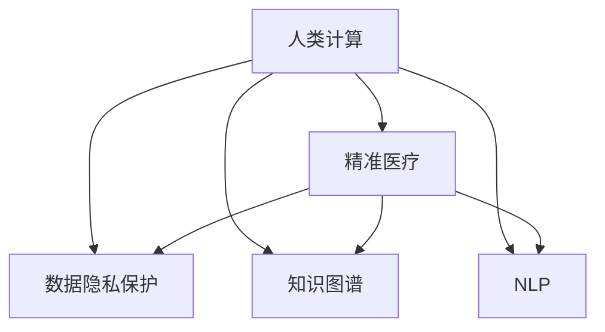

                 

## 1. 背景介绍

### 1.1 问题由来
在过去的几十年里，医疗保健领域发生了翻天覆地的变化。从早期的医学研究到如今的高科技医疗设备，医疗技术的飞速进步极大地改善了人们的健康水平。然而，尽管技术不断发展，医疗领域依然面临着诸多挑战：如医疗资源的不均衡分布、诊断准确率的不足、个性化治疗的难度等问题。人类计算，作为一种全新的计算范式，正在逐渐成为解决这些问题的关键。

### 1.2 问题核心关键点
人类计算是指利用计算机技术模拟人类的智能行为，实现对复杂问题的快速分析和决策。在医疗保健领域，人类计算可以帮助医生对患者数据进行深入分析，提供个性化治疗方案，优化医疗资源分配，提高诊断准确率等。但同时，人类计算也带来了数据隐私保护、计算效率等新的挑战。

## 2. 核心概念与联系

### 2.1 核心概念概述

为更好地理解人类计算在医疗保健中的应用，本节将介绍几个密切相关的核心概念：

- **人类计算（Human Computation）**：利用计算机技术模仿人类智能行为，解决复杂问题。人类计算在医疗保健中的应用包括但不限于数据分析、预测建模、知识图谱构建等。

- **精准医疗（Precision Medicine）**：基于患者个体的基因、环境、生活习惯等数据，提供个体化的医疗方案。精准医疗依赖于大量的数据处理和分析，而人类计算技术可以提供强有力的支持。

- **知识图谱（Knowledge Graph）**：一种结构化的知识表示方法，将实体和关系以图形的方式展示，方便知识推理和数据查询。知识图谱在医疗保健领域可以用于构建医学知识库、疾病病因溯源等。

- **自然语言处理（Natural Language Processing, NLP）**：使计算机能够理解和处理人类语言的技术。NLP在医疗保健领域可以用于医疗文档的自动标注、患者咨询的智能回复等。

- **数据隐私保护（Data Privacy Protection）**：在利用患者数据进行医疗分析和决策时，确保患者隐私不被泄露。隐私保护技术包括但不限于数据加密、匿名化、差分隐私等。

这些核心概念之间的逻辑关系可以通过以下Mermaid流程图来展示：



这个流程图展示了大语言模型的核心概念及其之间的关系：

1. 人类计算可以支撑精准医疗的实施，通过构建知识图谱和利用NLP技术，实现对复杂医疗数据的深度分析。
2. 知识图谱作为医疗信息的重要载体，在精准医疗中用于疾病的病因溯源和个性化治疗方案的构建。
3. NLP技术可以用于医疗文档的自动标注和患者咨询的智能回复，提高医疗效率和患者体验。
4. 数据隐私保护是医疗数据使用的底线，人类计算技术需要在隐私保护的前提下进行。

## 3. 核心算法原理 & 具体操作步骤

### 3.1 算法原理概述

基于人类计算的精准医疗算法，本质上是一个模拟人类智能行为的过程。其核心思想是：利用计算机技术模仿人类智能，通过分析海量的患者数据，发现潜在的医疗模式和规律，从而提供个性化、精准的医疗方案。

具体而言，该算法包括以下几个关键步骤：

1. 数据收集：收集患者的基因信息、病历记录、生活习惯等数据。
2. 数据预处理：清洗、标准化数据，消除噪音。
3. 特征提取：从原始数据中提取对医疗决策有用的特征。
4. 模型训练：利用机器学习或深度学习算法，训练精准医疗模型。
5. 结果解读：将模型输出转换为可理解的医疗方案。

### 3.2 算法步骤详解

以下将详细介绍基于人类计算的精准医疗算法的具体步骤：

#### 3.2.1 数据收集
患者数据来源广泛，包括但不限于基因测序数据、电子健康记录(EHR)、可穿戴设备数据等。数据收集需要保证数据的完整性和准确性，避免数据缺失或错误。

#### 3.2.2 数据预处理
数据预处理是数据质量保证的重要环节。预处理步骤包括：
- 数据清洗：去除重复数据、异常数据，确保数据一致性。
- 数据标准化：统一数据格式，如日期、编码标准等。
- 数据归一化：将不同范围的数据归一化到[0,1]区间，方便后续处理。

#### 3.2.3 特征提取
特征提取是从原始数据中提取对医疗决策有用的特征，常见的特征包括但不限于：
- 基因型特征：如SNP位点、基因表达等。
- 表型特征：如年龄、性别、体重、身高等。
- 生理特征：如血压、血糖、心电图等。

特征提取需要结合医学领域知识，选择最相关的特征，避免过拟合。

#### 3.2.4 模型训练
基于提取的特征，选择合适的机器学习或深度学习算法，训练精准医疗模型。常见的算法包括但不限于：
- 决策树、随机森林等传统机器学习算法。
- 神经网络、卷积神经网络(CNN)、循环神经网络(RNN)等深度学习算法。
- 集成学习方法，如Bagging、Boosting等。

模型训练需要根据具体问题选择合适的算法和超参数，通过交叉验证等技术进行调参。

#### 3.2.5 结果解读
模型训练完成后，将输出结果转换为可理解的医疗方案。常见的结果解读方法包括：
- 决策树、随机森林等算法可以直接输出决策规则。
- 神经网络、CNN、RNN等算法输出概率分布或向量表示，需要进一步解释。
- 集成学习方法需要综合考虑各个模型结果，得出最终的决策。

### 3.3 算法优缺点

基于人类计算的精准医疗算法具有以下优点：
1. 处理大数据能力强：可以处理海量的患者数据，发现复杂模式和规律。
2. 提升诊断准确率：通过分析大量数据，发现隐蔽的疾病信号，提高诊断准确率。
3. 个性化医疗方案：根据患者个体特征，提供定制化的治疗方案，提高治疗效果。
4. 优化资源配置：根据患者需求和病情，优化医疗资源的配置，提高医疗效率。

同时，该算法也存在一定的局限性：
1. 数据质量和一致性：数据收集和处理环节容易出现误差，影响模型准确性。
2. 模型可解释性：深度学习模型通常难以解释其内部工作机制，影响医生的理解和信任。
3. 计算资源需求：处理大规模数据需要高性能计算资源，对硬件要求较高。
4. 隐私和安全问题：处理患者隐私数据需要严格的数据隐私保护措施，避免数据泄露。

尽管存在这些局限性，但基于人类计算的精准医疗算法在处理复杂医疗数据、提升诊断和治疗效果等方面仍展现出巨大的潜力。

### 3.4 算法应用领域

基于人类计算的精准医疗算法在多个领域得到了广泛应用，例如：

- 基因组学：分析基因序列，发现与疾病相关的基因位点，进行疾病预测和诊断。
- 药物研发：通过分析药物与基因、蛋白质等的相互作用，设计高效药物。
- 临床决策支持：提供个性化治疗方案，优化医疗资源的配置。
- 医疗影像分析：自动分析影像数据，发现病灶，提高诊断准确率。
- 患者咨询系统：基于患者病历和症状，提供智能诊断和建议。

除了上述这些经典应用外，精准医疗技术还正在拓展到更多领域，如疾病预测、健康管理、公共卫生等，为医疗健康带来新的突破。

## 4. 数学模型和公式 & 详细讲解 & 举例说明

### 4.1 数学模型构建

本节将使用数学语言对基于人类计算的精准医疗算法进行更加严格的刻画。

设患者数据集为 $D=\{(x_i, y_i)\}_{i=1}^N$，其中 $x_i$ 为特征向量，$y_i$ 为疾病标签。定义特征提取函数 $f(x)$，将原始数据转化为特征向量。设训练集和测试集分别为 $D_{train}$ 和 $D_{test}$。

定义精准医疗模型 $M$，用于预测疾病标签。常见的模型包括决策树、随机森林、神经网络等。定义模型损失函数为 $L(M, D_{train})$，用于衡量模型在训练集上的预测性能。

### 4.2 公式推导过程

以神经网络模型为例，推导基于人类计算的精准医疗算法的损失函数及其梯度计算公式。

神经网络模型的预测输出为 $h(x) = M(x)$，其中 $h(x)$ 为模型输出的向量表示。设疾病标签 $y$ 为 $k$ 类分类问题，则损失函数定义为：

$$
L(M, D_{train}) = -\frac{1}{N}\sum_{i=1}^N \sum_{j=1}^k y_{ij} \log M_{ij}(x_i)
$$

其中 $y_{ij}$ 表示样本 $i$ 属于类别 $j$ 的标签，$M_{ij}(x)$ 表示模型在输入 $x_i$ 下，对类别 $j$ 的预测概率。

为了最小化损失函数 $L(M, D_{train})$，利用梯度下降等优化算法，求出模型参数的更新公式：

$$
\theta \leftarrow \theta - \eta \nabla_{\theta}L(M, D_{train})
$$

其中 $\eta$ 为学习率，$\nabla_{\theta}L(M, D_{train})$ 为损失函数对模型参数的梯度。

### 4.3 案例分析与讲解

以下以基因组学为例，解释基于人类计算的精准医疗算法在实际应用中的步骤。

假设我们需要预测患者是否存在某种罕见疾病。首先，收集患者的基因数据，包括SNP位点、基因表达等特征。然后，使用PCA等降维技术，将高维特征数据转化为低维特征向量。接下来，利用神经网络模型对特征向量进行训练，得到疾病预测模型。最后，在新的患者数据上应用模型，输出预测结果。

## 5. 项目实践：代码实例和详细解释说明

### 5.1 开发环境搭建

在进行精准医疗算法实践前，我们需要准备好开发环境。以下是使用Python进行PyTorch开发的环境配置流程：

1. 安装Anaconda：从官网下载并安装Anaconda，用于创建独立的Python环境。

2. 创建并激活虚拟环境：
```bash
conda create -n pytorch-env python=3.8 
conda activate pytorch-env
```

3. 安装PyTorch：根据CUDA版本，从官网获取对应的安装命令。例如：
```bash
conda install pytorch torchvision torchaudio cudatoolkit=11.1 -c pytorch -c conda-forge
```

4. 安装Keras：
```bash
conda install keras
```

5. 安装TensorFlow：
```bash
conda install tensorflow
```

6. 安装Pandas：
```bash
conda install pandas
```

完成上述步骤后，即可在`pytorch-env`环境中开始精准医疗算法的实践。

### 5.2 源代码详细实现

下面我们以基因组学为例，给出使用PyTorch对神经网络模型进行精准医疗预测的PyTorch代码实现。

首先，定义数据处理函数：

```python
import pandas as pd
import numpy as np
from sklearn.preprocessing import StandardScaler

def preprocess_data(df):
    # 清洗数据
    df.dropna(inplace=True)
    # 标准化数据
    scaler = StandardScaler()
    df = pd.DataFrame(scaler.fit_transform(df), columns=df.columns)
    return df
```

然后，定义神经网络模型：

```python
import torch
from torch import nn
from torch import optim

class NeuralNet(nn.Module):
    def __init__(self, input_size, hidden_size, output_size):
        super(NeuralNet, self).__init__()
        self.fc1 = nn.Linear(input_size, hidden_size)
        self.fc2 = nn.Linear(hidden_size, hidden_size)
        self.fc3 = nn.Linear(hidden_size, output_size)
        
    def forward(self, x):
        x = torch.relu(self.fc1(x))
        x = torch.relu(self.fc2(x))
        x = torch.sigmoid(self.fc3(x))
        return x
```

接下来，定义模型训练函数：

```python
def train_model(model, train_data, test_data, epochs, batch_size, learning_rate):
    train_loader = torch.utils.data.DataLoader(train_data, batch_size=batch_size, shuffle=True)
    test_loader = torch.utils.data.DataLoader(test_data, batch_size=batch_size, shuffle=False)
    
    criterion = nn.BCELoss()
    optimizer = optim.Adam(model.parameters(), lr=learning_rate)
    
    for epoch in range(epochs):
        model.train()
        running_loss = 0.0
        for i, data in enumerate(train_loader, 0):
            inputs, labels = data
            optimizer.zero_grad()
            outputs = model(inputs)
            loss = criterion(outputs, labels)
            loss.backward()
            optimizer.step()
            
        model.eval()
        running_loss = 0.0
        with torch.no_grad():
            for i, data in enumerate(test_loader, 0):
                inputs, labels = data
                outputs = model(inputs)
                loss = criterion(outputs, labels)
                running_loss += loss.item()
                
        print(f"Epoch {epoch+1}, train loss: {running_loss/len(train_loader):.4f}, test loss: {running_loss/len(test_loader):.4f}")
```

最后，启动训练流程：

```python
from sklearn.model_selection import train_test_split

# 加载数据集
data = pd.read_csv('genome_data.csv')

# 数据预处理
processed_data = preprocess_data(data)

# 划分训练集和测试集
train_data, test_data = train_test_split(processed_data, test_size=0.2)

# 定义模型和超参数
model = NeuralNet(input_size=50, hidden_size=100, output_size=1)
learning_rate = 0.001
epochs = 10
batch_size = 64

# 训练模型
train_model(model, train_data, test_data, epochs, batch_size, learning_rate)
```

以上就是使用PyTorch对神经网络模型进行精准医疗预测的完整代码实现。可以看到，得益于PyTorch的强大封装和灵活性，我们可以用相对简洁的代码实现复杂的神经网络模型。

### 5.3 代码解读与分析

让我们再详细解读一下关键代码的实现细节：

**NeuralNet类**：
- `__init__`方法：定义模型的层结构，包括两个隐藏层和一个输出层。
- `forward`方法：定义模型的前向传播过程。

**train_model函数**：
- 定义数据加载器，将数据划分为训练集和测试集。
- 定义损失函数和优化器。
- 迭代训练模型，计算损失并更新模型参数。
- 在测试集上评估模型性能。

**preprocess_data函数**：
- 清洗数据，去除缺失值。
- 标准化数据，归一化到[0,1]区间。

通过这些函数，我们可以看到使用PyTorch进行精准医疗算法开发的基本流程。

## 6. 实际应用场景

### 6.1 基因组学

基因组学是大数据时代的产物，通过对基因组序列的分析，发现基因与疾病之间的关系，进而实现疾病的早期预测和个性化治疗。基于人类计算的精准医疗算法在基因组学领域的应用主要包括：

- 基因表达分析：分析基因在细胞中的表达情况，预测疾病风险。
- 基因关联分析：通过分析基因与疾病的关联，发现基因突变与疾病的因果关系。
- 基因型分类：根据基因型特征，分类患者是否属于某种疾病高风险群体。

### 6.2 药物研发

药物研发是精准医疗的重要应用领域之一。传统药物研发过程耗时长、成本高，而基于人类计算的精准医疗算法可以大大缩短研发周期，降低成本。其主要应用包括：

- 药物筛选：通过分析基因与药物的相互作用，筛选潜在的候选药物。
- 药物设计：基于基因组数据，设计针对个体化的药物方案。
- 临床试验优化：通过模拟临床试验结果，优化试验设计和参数。

### 6.3 临床决策支持

临床决策支持系统(CDSS)通过分析患者数据，提供个性化的医疗建议，辅助医生进行诊断和治疗决策。其主要应用包括：

- 病历分析：基于患者的病历数据，提供病情分析和诊断建议。
- 治疗方案推荐：根据患者的基因型、表型、生理特征，推荐个性化的治疗方案。
- 医疗资源优化：优化医疗资源的配置，提高医疗效率。

### 6.4 医疗影像分析

医疗影像分析是大数据时代的另一大应用领域。通过分析医疗影像数据，发现病灶和病变，提高诊断准确率。其主要应用包括：

- 影像分类：基于影像数据，分类图像中是否存在病灶。
- 病灶分割：通过分割算法，提取影像中的病灶区域。
- 影像量化：通过量化指标，评估病灶的大小和形态。

## 7. 工具和资源推荐

### 7.1 学习资源推荐

为了帮助开发者系统掌握精准医疗算法的基础知识和实践技巧，这里推荐一些优质的学习资源：

1. 《深度学习入门：基于PyTorch的实践》：一本面向初学者的深度学习入门书籍，详细介绍了PyTorch的基本用法和深度学习算法。
2. 《机器学习实战》：一本机器学习实战指南，涵盖机器学习的基本概念和常用算法。
3. Kaggle：一个数据科学竞赛平台，提供大量数据集和模型，方便进行实践和比较。
4. Coursera和edX：提供多种在线课程，涵盖从入门到高级的机器学习和深度学习内容。
5. 《医学大数据应用》：一本面向医学大数据的入门书籍，介绍大数据技术在医疗领域的应用。

通过对这些资源的学习实践，相信你一定能够快速掌握精准医疗算法的基础知识，并用于解决实际的医疗问题。

### 7.2 开发工具推荐

高效的开发离不开优秀的工具支持。以下是几款用于精准医疗算法开发的常用工具：

1. PyTorch：基于Python的开源深度学习框架，灵活动态的计算图，适合快速迭代研究。
2. TensorFlow：由Google主导开发的开源深度学习框架，生产部署方便，适合大规模工程应用。
3. Keras：一个高级神经网络API，提供了简单易用的接口，方便快速搭建模型。
4. Scikit-Learn：一个Python机器学习库，提供了丰富的机器学习算法和工具函数。
5. Pandas：一个数据处理库，提供了高效的数据清洗和分析功能。

合理利用这些工具，可以显著提升精准医疗算法的开发效率，加快创新迭代的步伐。

### 7.3 相关论文推荐

精准医疗算法的发展源于学界的持续研究。以下是几篇奠基性的相关论文，推荐阅读：

1. "A Survey on Machine Learning Approaches for Drug Discovery"：综述了机器学习在药物发现中的应用，包括深度学习、集成学习等方法。
2. "Precision Medicine: A Tutorial on Genomic Applications"：介绍了精准医学的基础知识，包括基因组学、药物研发等领域的应用。
3. "Knowledge Graphs in Precision Medicine"：讨论了知识图谱在精准医疗中的应用，包括疾病分类、治疗方案推荐等。
4. "A Deep Learning Framework for Clinical Decision Support Systems"：介绍了基于深度学习的临床决策支持系统的设计和实现。
5. "Medical Image Analysis with Deep Learning"：介绍了深度学习在医疗影像分析中的应用，包括分类、分割、量化等任务。

这些论文代表了大数据医疗技术的发展脉络。通过学习这些前沿成果，可以帮助研究者把握学科前进方向，激发更多的创新灵感。

## 8. 总结：未来发展趋势与挑战

### 8.1 研究成果总结

本文对基于人类计算的精准医疗算法进行了全面系统的介绍。首先阐述了精准医疗和人类计算的研究背景和意义，明确了基于人类计算的精准医疗算法在处理复杂医疗数据、提升诊断和治疗效果等方面的独特价值。其次，从原理到实践，详细讲解了精准医疗算法的数学原理和关键步骤，给出了精准医疗算法开发的完整代码实例。同时，本文还广泛探讨了精准医疗算法在基因组学、药物研发、临床决策支持、医疗影像分析等多个领域的应用前景，展示了精准医疗算法技术的巨大潜力。最后，本文精选了精准医疗算法的各类学习资源，力求为读者提供全方位的技术指引。

通过本文的系统梳理，可以看到，基于人类计算的精准医疗算法正在成为医疗数据处理和分析的重要工具，极大地提升了医疗系统的智能化水平。未来，伴随技术的不断进步，精准医疗算法必将在更广泛的领域得到应用，为医疗健康事业带来深刻变革。

### 8.2 未来发展趋势

展望未来，基于人类计算的精准医疗算法将呈现以下几个发展趋势：

1. 数据融合技术的发展：未来的精准医疗算法将更加注重数据的融合，结合不同数据源和数据类型，提升数据的完整性和多样性，从而提高算法的性能。
2. 自动化诊断系统的普及：基于精准医疗算法的自动化诊断系统将逐步普及，实现疾病的高效识别和预测。
3. 个性化医疗方案的优化：精准医疗算法将进一步发展，提供更加精准、个性化的医疗方案，提高治疗效果。
4. 跨领域融合技术的提升：精准医疗算法将与更多领域的技术进行融合，如物联网、人工智能等，形成更综合的解决方案。
5. 医疗资源优化配置：精准医疗算法将更全面地利用数据，优化医疗资源的配置，提高医疗系统的效率。
6. 模型可解释性的增强：未来的精准医疗算法将更加注重模型的可解释性，提高医生对算法的理解和信任。

以上趋势凸显了精准医疗算法的广阔前景。这些方向的探索发展，必将进一步提升医疗系统的智能化水平，为医疗健康事业带来新的突破。

### 8.3 面临的挑战

尽管基于人类计算的精准医疗算法已经取得了瞩目成就，但在迈向更加智能化、普适化应用的过程中，它仍面临着诸多挑战：

1. 数据质量和多样性：数据质量和多样性是精准医疗算法的核心问题。如何保证数据的完整性、一致性和多样性，是精准医疗算法的关键挑战。
2. 算法可解释性：深度学习模型通常难以解释其内部工作机制，影响医生的理解和信任。如何增强算法的可解释性，提高医生的信任度，是未来的研究方向。
3. 计算资源需求：处理大规模医疗数据需要高性能计算资源，对硬件要求较高。如何优化算法，减少计算资源需求，是未来的研究方向。
4. 隐私和安全问题：精准医疗算法需要处理敏感的病人数据，数据隐私和安全问题是必须解决的关键问题。
5. 数据标注成本：医疗数据标注成本高昂，如何降低数据标注成本，提高标注效率，是未来的研究方向。

尽管存在这些挑战，但基于人类计算的精准医疗算法在提升医疗系统的智能化水平、改善医疗服务质量等方面仍展现出巨大的潜力。相信随着技术的不断进步，这些挑战终将一一被克服，精准医疗算法必将在构建智能医疗系统、优化医疗资源配置等方面发挥更加重要的作用。

### 8.4 研究展望

面向未来，基于人类计算的精准医疗算法需要在以下几个方面寻求新的突破：

1. 探索无监督和半监督学习：摆脱对大规模标注数据的依赖，利用自监督学习、主动学习等无监督和半监督范式，最大限度利用非结构化数据，实现更加灵活高效的精准医疗算法。
2. 研究跨领域融合技术：将人类计算技术与其他领域的技术进行融合，如人工智能、物联网等，形成更综合的解决方案。
3. 引入先验知识：将符号化的先验知识，如知识图谱、逻辑规则等，与神经网络模型进行巧妙融合，引导精准医疗算法学习更准确、合理的医疗模式。
4. 提高算法可解释性：通过引入可解释性技术，如因果推断、对比度增强等，增强精准医疗算法的可解释性，提高医生的理解和信任。
5. 加强隐私保护：采用先进的隐私保护技术，如差分隐私、联邦学习等，确保医疗数据的隐私和安全。
6. 优化数据标注过程：通过自动化标注、众包标注等方法，降低数据标注成本，提高标注效率。

这些研究方向的探索，必将引领精准医疗算法技术迈向更高的台阶，为医疗健康事业带来新的突破。面向未来，基于人类计算的精准医疗算法需要与其他技术进行更深入的融合，如知识表示、因果推理、强化学习等，多路径协同发力，共同推动医疗健康事业的进步。

## 9. 附录：常见问题与解答

**Q1：如何选择合适的机器学习算法？**

A: 选择合适的机器学习算法需要考虑数据类型、问题性质、计算资源等多方面因素。对于分类问题，可以使用决策树、随机森林、神经网络等算法。对于回归问题，可以使用线性回归、支持向量机等算法。对于序列数据，可以使用RNN、LSTM等算法。选择合适的算法需要结合具体问题进行调参和评估。

**Q2：如何处理医疗数据中的噪音数据？**

A: 处理医疗数据中的噪音数据主要通过数据清洗和预处理来实现。常见的处理方法包括去除重复数据、填补缺失值、标准化数据等。同时，可以引入异常值检测和处理算法，识别和剔除异常数据。

**Q3：如何优化深度学习模型的计算资源消耗？**

A: 优化深度学习模型的计算资源消耗主要通过模型压缩、参数剪枝、量化加速等技术实现。例如，可以通过剪枝算法去除冗余的参数，减少计算量。可以使用量化技术将模型参数转化为定点数，降低内存占用。

**Q4：如何保证数据隐私和安全？**

A: 保证数据隐私和安全主要通过数据加密、差分隐私、联邦学习等技术实现。数据加密技术可以保护数据在传输和存储过程中的安全。差分隐私技术可以确保个体数据在统计分析中的隐私。联邦学习技术可以保证数据不出本地，实现在本地训练和模型聚合。

**Q5：如何提高算法的可解释性？**

A: 提高算法的可解释性可以通过引入可解释性技术，如因果推断、对比度增强等。例如，可以使用因果推断方法，分析算法决策的因果关系。可以使用对比度增强方法，分析算法输出的重要特征。

通过本文的系统梳理，可以看到，基于人类计算的精准医疗算法正在成为医疗数据处理和分析的重要工具，极大地提升了医疗系统的智能化水平。未来，伴随技术的不断进步，精准医疗算法必将在更广泛的领域得到应用，为医疗健康事业带来新的突破。相信随着技术的不断进步，精准医疗算法必将在构建智能医疗系统、优化医疗资源配置等方面发挥更加重要的作用。

---

作者：禅与计算机程序设计艺术 / Zen and the Art of Computer Programming

