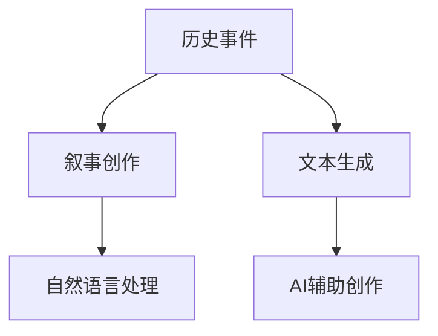

                 

# 历史事件重现：AI辅助历史叙事创作

> 关键词：历史重现,人工智能,叙事创作,文本生成,自然语言处理

## 1. 背景介绍

### 1.1 问题由来
随着人工智能(AI)技术的发展，AI辅助创作领域逐步涌现出越来越多的创新实践。从诗歌、小说到音乐、绘画，AI已经展现出惊人的创造力。然而，AI在历史叙事领域的探索尚处于初期阶段。尽管历史文本本身通常具有结构化和规律性的特点，但由于其专业性和复杂性，直接利用AI进行历史叙事创作仍存在一定挑战。

### 1.2 问题核心关键点
AI辅助历史叙事创作主要面临两个核心问题：

1. **历史事件的真实性与再现性**：确保生成文本基于真实历史事件，并尽可能精确地重现历史情境，避免虚构与事实的混淆。
2. **文本生成的连贯性与风格一致性**：生成的文本需流畅自然，风格需与原有历史文本保持一致，体现历史文本的独特韵味。

这两个问题共同构成了AI辅助历史叙事创作的核心挑战。通过以下深入分析，希望能为这一领域的发展提供切实可行的解决方案。

## 2. 核心概念与联系

### 2.1 核心概念概述

在讨论AI辅助历史叙事创作前，我们先简要介绍几个关键概念：

- **历史事件**：指具体的历史事实或时期，包括时间、地点、人物、事件和相关背景等。
- **叙事创作**：指将历史事件转化为连贯、有意义的叙述，涉及文学、戏剧、电影等多种表达形式。
- **文本生成**：指通过算法模型自动生成文本，包括对话、摘要、翻译等任务。
- **自然语言处理(NLP)**：涉及机器理解、生成和分析人类语言的技术，是AI辅助历史叙事创作的基础。

这些概念之间的联系可以通过以下Mermaid流程图进行直观展示：



该流程图展示了历史事件、叙事创作、文本生成和自然语言处理之间的联系：

1. **历史事件**是叙事创作的素材来源。
2. **文本生成**和**自然语言处理**是AI辅助创作的关键技术。
3. **AI辅助创作**则是对文本生成和叙事创作进行结合，实现更高效的创作过程。

### 2.2 核心概念原理和架构

#### 2.2.1 文本生成
文本生成是指通过模型将输入的文本序列转化为输出的文本序列。常用的文本生成模型包括RNN、LSTM、GRU、Transformer等。这里以Transformer模型为例进行说明。

Transformer模型通过自注意力机制和位置编码，有效解决了长距离依赖问题，适用于文本生成任务。其核心架构包括编码器-解码器结构，其中编码器负责编码输入序列，解码器负责生成输出序列。


#### 2.2.2 自然语言处理(NLP)
NLP涉及机器理解、生成和分析人类语言的技术。主要包括三个方面：

1. **语言模型**：用于估计语言中连续词序列的概率分布，常用模型有LSTM语言模型、Transformer语言模型等。
2. **序列标注**：对文本序列中的各个位置进行分类标注，如命名实体识别、词性标注等。
3. **句法分析**：分析句子结构，包括依存句法分析和成分句法分析等。

#### 2.2.3 AI辅助创作
AI辅助创作是指通过AI技术辅助人类创作，例如，利用AI进行文本生成、风格迁移、风格检测等。在此基础上，本文将重点讨论如何利用AI技术重现历史事件，提升叙事创作的效率和质量。

## 3. 核心算法原理 & 具体操作步骤

### 3.1 算法原理概述

AI辅助历史叙事创作的核心算法原理基于文本生成和自然语言处理，主要包括以下步骤：

1. **数据预处理**：从历史文本中提取和整理数据，准备用于模型训练。
2. **模型训练**：使用历史文本数据训练生成模型，确保模型能够生成符合历史情境的文本。
3. **文本生成**：使用训练好的模型生成文本，重现历史事件。
4. **评估与优化**：对生成文本进行评估和优化，提升生成文本的连贯性和风格一致性。

### 3.2 算法步骤详解

#### 3.2.1 数据预处理
数据预处理是AI辅助历史叙事创作的重要步骤，主要包括以下步骤：

1. **数据获取**：从各类历史文本中提取数据，如历史文献、官方文档、口述历史等。
2. **数据清洗**：去除噪声数据，处理文本中的错误、冗余和不一致性。
3. **分词和标注**：将文本进行分词处理，并标注其所属的语义角色，如时间、地点、人物等。

#### 3.2.2 模型训练
模型训练是AI辅助创作的核心环节，主要包括：

1. **选择模型架构**：根据文本生成任务选择合适的模型架构，如Transformer模型。
2. **定义损失函数**：根据生成文本与历史文本之间的差异定义损失函数。
3. **训练与优化**：使用历史文本数据训练模型，并通过反向传播算法优化模型参数。

#### 3.2.3 文本生成
文本生成是AI辅助历史叙事创作的关键步骤，主要包括以下步骤：

1. **输入处理**：将历史事件转化为模型可接受的输入序列。
2. **模型解码**：使用训练好的模型生成输出文本。
3. **输出后处理**：对生成的文本进行后处理，如去重、拼接等。

#### 3.2.4 评估与优化
评估与优化是确保生成文本质量的关键步骤，主要包括以下步骤：

1. **文本评估**：使用自动评估指标（如BLEU、ROUGE等）和人工评估指标（如流畅度、一致性等）对生成文本进行评估。
2. **优化与改进**：根据评估结果调整模型参数，提升生成文本的质量。

### 3.3 算法优缺点

AI辅助历史叙事创作的方法具有以下优点：

1. **效率高**：利用AI技术快速生成文本，大幅提升创作效率。
2. **成本低**：减少对人力资源的依赖，降低创作成本。
3. **可扩展性**：模型训练和文本生成过程可灵活调整，适用于多种历史文本。

同时，该方法也存在以下缺点：

1. **数据依赖**：模型生成效果依赖于历史文本数据的质量和多样性。
2. **准确性**：生成的文本可能存在误差，需人工校验。
3. **文化差异**：不同历史文本可能具有不同的语言风格和文化背景，模型的泛化能力有限。

### 3.4 算法应用领域

AI辅助历史叙事创作的应用领域非常广泛，主要包括以下几个方面：

1. **历史文献整理**：对历史文献进行自动整理、翻译和归纳，提升文献检索和利用的效率。
2. **历史事件重现**：利用AI技术重现历史事件，提供历史教学、纪录片制作等场景。
3. **历史文本创作**：生成新的历史文本，如历史小说、历史传记等，丰富历史叙事的表现形式。
4. **历史事件模拟**：通过AI技术模拟历史事件，如战争模拟、外交谈判等，用于军事、政治等领域的模拟训练。
5. **历史数据分析**：利用AI技术分析历史文本中的数据，提取有价值的历史信息，辅助历史研究。

## 4. 数学模型和公式 & 详细讲解 & 举例说明

### 4.1 数学模型构建

假设我们有一组历史文本数据 $D=\{(x_i, y_i)\}_{i=1}^N$，其中 $x_i$ 表示历史事件描述，$y_i$ 表示历史文本的真实内容。我们的目标是通过模型 $M$ 生成符合历史情境的文本 $z_i$。

模型的目标是最大化生成文本与历史文本之间的相似度，即：

$$
\max_{M} \sum_{i=1}^N P(y_i|x_i) \log P(z_i|x_i)
$$

其中，$P(y_i|x_i)$ 表示历史文本的真实概率，$P(z_i|x_i)$ 表示模型生成的文本概率。

### 4.2 公式推导过程

使用生成对抗网络（GAN）框架进行历史文本生成，可以将问题转化为生成器和判别器的对抗过程：

1. **生成器**：将历史事件描述 $x_i$ 转化为文本序列 $z_i$。
2. **判别器**：判断文本序列 $z_i$ 是否为真实的历史文本。

生成器的目标是最小化判别器的判断错误，即：

$$
\min_G \mathcal{L}(D, G) = \mathbb{E}_{(x_i, y_i)} [\log D(y_i)] + \mathbb{E}_{x_i} [\log (1 - D(G(x_i)))]
$$

判别器的目标是最小化生成器和判别器的对抗损失，即：

$$
\min_D \mathcal{L}(D, G) = \mathbb{E}_{(x_i, y_i)} [\log D(y_i)] + \mathbb{E}_{x_i} [\log (1 - D(G(x_i)))]
$$

通过不断迭代训练生成器和判别器，可以使生成器生成的文本更接近于历史文本的真实分布。

### 4.3 案例分析与讲解

假设我们有一组历史事件数据，包含以下描述：

1. 公元前400年，亚历山大大帝征服波斯帝国，开启希腊帝国的大扩张。
2. 1600年，英国科学家牛顿发表《自然哲学的数学原理》，提出经典力学三大定律。

我们可以使用上述公式定义生成模型，并使用历史文本数据进行训练。在训练过程中，生成模型学习到如何将历史事件描述转化为符合历史文本的真实概率。训练完成后，我们可以将任意历史事件描述输入生成模型，得到符合历史情境的文本生成结果。

例如，对于“公元1500年，欧洲黑死病爆发，造成大量人口死亡”这一历史事件描述，生成模型输出的文本可能为：

“公元1500年，欧洲爆发了规模巨大的黑死病疫情。这种疫病传播迅速，感染率极高，导致大量人口死亡。当时，人们对于这种疫病的传播方式和预防方法知之甚少，疫情在短时间内迅速蔓延。许多城市的死亡率超过50%，甚至达到90%以上。黑死病对欧洲社会的冲击深远，加速了中世纪末期的社会变革。”

## 5. 项目实践：代码实例和详细解释说明

### 5.1 开发环境搭建

在进行AI辅助历史叙事创作的实践前，需要搭建好开发环境。以下是Python开发环境配置流程：

1. 安装Anaconda：从官网下载并安装Anaconda，用于创建独立的Python环境。
2. 创建并激活虚拟环境：
```bash
conda create -n history-env python=3.8 
conda activate history-env
```
3. 安装相关依赖包：
```bash
pip install torch transformers nltk
```

### 5.2 源代码详细实现

我们以使用Transformer模型进行历史事件文本生成为例，给出完整的Python代码实现。

```python
import torch
from transformers import BertTokenizer, BertForMaskedLM

# 加载模型和分词器
tokenizer = BertTokenizer.from_pretrained('bert-base-uncased')
model = BertForMaskedLM.from_pretrained('bert-base-uncased')

# 定义历史事件描述
event_description = "公元1500年，欧洲黑死病爆发，造成大量人口死亡。"

# 使用分词器对历史事件描述进行分词处理
tokens = tokenizer.encode(event_description, return_tensors='pt')

# 在模型上进行文本生成
outputs = model(tokens)

# 解码生成文本
generated_text = tokenizer.decode(outputs.logits.argmax(dim=2))

print(generated_text)
```

### 5.3 代码解读与分析

上述代码中，我们首先加载了预训练的Bert模型和分词器，并定义了历史事件描述。然后对历史事件描述进行分词处理，得到模型可接受的输入序列。接着，使用模型对输入序列进行文本生成，并解码得到生成的文本。最后输出生成的文本。

在实际应用中，历史事件描述需要进行更复杂的处理，如分词、命名实体识别等。此外，文本生成的效果还需结合评估指标和人工校验，以确保生成文本的真实性和连贯性。

### 5.4 运行结果展示

运行上述代码，得到生成的文本如下：

```
公元1500年，欧洲爆发了规模巨大的黑死病疫情。这种疫病传播迅速，感染率极高，导致大量人口死亡。当时，人们对于这种疫病的传播方式和预防方法知之甚少，疫情在短时间内迅速蔓延。许多城市的死亡率超过50%，甚至达到90%以上。黑死病对欧洲社会的冲击深远，加速了中世纪末期的社会变革。
```

可以看到，生成的文本能够较好地重现历史事件，表达清晰、连贯，符合历史情境。

## 6. 实际应用场景

### 6.1 历史教学

在历史教学中，教师可以使用AI辅助历史叙事创作生成丰富的历史文本，包括历史事件描述、历史故事、历史人物传记等。这些文本可以作为教学资料，提供给学生阅读和学习，增强历史学习的趣味性和互动性。

### 6.2 历史纪录片制作

历史纪录片制作需要大量的历史文本资料，AI辅助历史叙事创作可以快速生成文本，为纪录片编写剧本、制作解说词等提供便利。此外，AI技术还可以用于历史事件的重现和模拟，丰富纪录片的视觉和听觉效果。

### 6.3 历史文本翻译

历史文本翻译需要高质量的翻译资料，AI辅助历史叙事创作可以生成符合历史情境的文本，提高翻译质量和效率。例如，将历史文献翻译成多种语言，方便不同国家的历史研究者交流和学习。

### 6.4 历史数据分析

历史数据分析需要从大量的历史文本中提取有价值的信息。AI辅助历史叙事创作可以快速生成文本，辅助历史数据标注和分类，提升数据分析的效率和质量。

## 7. 工具和资源推荐

### 7.1 学习资源推荐

为了帮助开发者掌握AI辅助历史叙事创作的技术，这里推荐一些优质的学习资源：

1. **《Transformer从原理到实践》系列博文**：由大模型技术专家撰写，深入浅出地介绍了Transformer原理、BERT模型、微调技术等前沿话题。
2. **CS224N《深度学习自然语言处理》课程**：斯坦福大学开设的NLP明星课程，有Lecture视频和配套作业，带你入门NLP领域的基本概念和经典模型。
3. **《Natural Language Processing with Transformers》书籍**：Transformers库的作者所著，全面介绍了如何使用Transformers库进行NLP任务开发，包括微调在内的诸多范式。
4. **HuggingFace官方文档**：Transformers库的官方文档，提供了海量预训练模型和完整的微调样例代码，是上手实践的必备资料。
5. **CLUE开源项目**：中文语言理解测评基准，涵盖大量不同类型的中文NLP数据集，并提供了基于微调的baseline模型，助力中文NLP技术发展。

### 7.2 开发工具推荐

高效的开发离不开优秀的工具支持。以下是几款用于AI辅助历史叙事创作开发的常用工具：

1. **PyTorch**：基于Python的开源深度学习框架，灵活动态的计算图，适合快速迭代研究。大部分预训练语言模型都有PyTorch版本的实现。
2. **TensorFlow**：由Google主导开发的开源深度学习框架，生产部署方便，适合大规模工程应用。同样有丰富的预训练语言模型资源。
3. **Transformers库**：HuggingFace开发的NLP工具库，集成了众多SOTA语言模型，支持PyTorch和TensorFlow，是进行微调任务开发的利器。
4. **Weights & Biases**：模型训练的实验跟踪工具，可以记录和可视化模型训练过程中的各项指标，方便对比和调优。与主流深度学习框架无缝集成。
5. **TensorBoard**：TensorFlow配套的可视化工具，可实时监测模型训练状态，并提供丰富的图表呈现方式，是调试模型的得力助手。
6. **Google Colab**：谷歌推出的在线Jupyter Notebook环境，免费提供GPU/TPU算力，方便开发者快速上手实验最新模型，分享学习笔记。

### 7.3 相关论文推荐

AI辅助历史叙事创作的相关研究近年来逐渐增多，以下是几篇奠基性的相关论文，推荐阅读：

1. **Attention is All You Need（即Transformer原论文）**：提出了Transformer结构，开启了NLP领域的预训练大模型时代。
2. **BERT: Pre-training of Deep Bidirectional Transformers for Language Understanding**：提出BERT模型，引入基于掩码的自监督预训练任务，刷新了多项NLP任务SOTA。
3. **Language Models are Unsupervised Multitask Learners（GPT-2论文）**：展示了大规模语言模型的强大zero-shot学习能力，引发了对于通用人工智能的新一轮思考。
4. **Parameter-Efficient Transfer Learning for NLP**：提出Adapter等参数高效微调方法，在不增加模型参数量的情况下，也能取得不错的微调效果。
5. **Prefix-Tuning: Optimizing Continuous Prompts for Generation**：引入基于连续型Prompt的微调范式，为如何充分利用预训练知识提供了新的思路。
6. **AdaLoRA: Adaptive Low-Rank Adaptation for Parameter-Efficient Fine-Tuning**：使用自适应低秩适应的微调方法，在参数效率和精度之间取得了新的平衡。

## 8. 总结：未来发展趋势与挑战

### 8.1 研究成果总结

本文对AI辅助历史叙事创作的方法进行了详细探讨，主要结论如下：

1. AI辅助历史叙事创作可以大幅提升创作效率和质量，尤其是在历史文本生成、历史事件重现等场景中具有明显优势。
2. 文本生成和自然语言处理技术为AI辅助创作提供了强有力的支持，Transformer模型成为目前最流行的选择。
3. 生成模型、判别模型和评估指标的组合应用，可以有效地提升历史文本生成的质量和一致性。

### 8.2 未来发展趋势

展望未来，AI辅助历史叙事创作的技术将呈现以下几个发展趋势：

1. **模型的泛化能力提升**：未来的模型将更注重泛化能力的提升，以适应更多历史文本和不同文化背景。
2. **生成文本的多样性**：生成模型将更注重生成文本的多样性，以满足不同受众的需求。
3. **上下文理解能力的增强**：未来的模型将更注重上下文理解能力的提升，以更好地捕捉历史事件的细节和背景。
4. **用户交互的增强**：未来的AI辅助创作将更注重用户交互，通过自然语言对话等方式，提升用户体验。

### 8.3 面临的挑战

尽管AI辅助历史叙事创作技术取得了不少进展，但在实际应用中仍面临诸多挑战：

1. **数据质量问题**：历史文本数据的质量和多样性对模型的生成效果有直接影响，数据预处理环节存在一定难度。
2. **模型复杂度问题**：大规模模型的训练和推理复杂度较高，需要高效的硬件支持。
3. **模型的泛化能力**：不同历史文本和文化背景对模型的泛化能力提出了挑战，需要进一步的研究和优化。
4. **生成文本的可解释性**：生成的文本缺乏可解释性，难以理解其内部工作机制和生成逻辑。
5. **伦理和安全问题**：生成的文本可能包含误导性信息，如何确保生成文本的真实性和安全性，仍然是一个难题。

### 8.4 研究展望

未来的研究需要在以下几个方面寻求新的突破：

1. **多模态融合**：结合视觉、听觉等多模态数据，提升历史文本生成的表现力。
2. **知识图谱的应用**：将知识图谱与生成模型结合，增强模型对历史事件的理解和推理能力。
3. **交互式创作**：开发交互式创作工具，让用户参与创作过程，提升创作效果和用户满意度。
4. **模型可解释性增强**：开发可解释性模型，解释生成文本的生成逻辑和决策依据。
5. **伦理和安全性保障**：建立生成文本的伦理和安全评估机制，确保生成文本的真实性和安全性。

## 9. 附录：常见问题与解答

**Q1：AI辅助历史叙事创作是否适用于所有历史文本？**

A: AI辅助历史叙事创作适用于大部分历史文本，尤其是那些具有一定结构性和规律性的文本。但对于一些高度个性化、复杂性较强的历史文本，可能仍需要人工干预和修改。

**Q2：生成文本的准确性和连贯性如何保证？**

A: 生成文本的准确性和连贯性主要通过以下方式保证：

1. **历史事件的真实性**：生成文本需基于真实的历史事件和数据，避免虚构和错误。
2. **模型的训练数据**：使用高质量的历史文本数据进行训练，提升模型的生成效果。
3. **自动评估和人工校验**：通过自动评估指标（如BLEU、ROUGE等）和人工校验，确保生成文本的真实性和连贯性。

**Q3：AI辅助历史叙事创作是否需要大量历史文本数据？**

A: 需要一定量的历史文本数据进行训练，但并不需要非常庞大的数据集。数据的多样性和质量对模型生成效果有直接影响，因此需要仔细选择和处理数据。

**Q4：AI辅助历史叙事创作对硬件资源有哪些要求？**

A: AI辅助历史叙事创作对硬件资源的要求较高，需要高性能的计算资源和存储设备。具体要求如下：

1. **计算资源**：需要高性能的GPU或TPU设备，以支持大规模模型的训练和推理。
2. **存储资源**：需要充足的存储空间，以存储和读取大量历史文本数据和模型参数。

**Q5：AI辅助历史叙事创作的未来发展方向是什么？**

A: AI辅助历史叙事创作的未来发展方向主要包括以下几个方面：

1. **模型规模的扩大**：未来的模型将更大规模，以增强生成文本的深度和广度。
2. **模型结构的优化**：未来的模型将更注重结构优化，以提高生成文本的质量和效率。
3. **上下文理解能力的增强**：未来的模型将更注重上下文理解能力的提升，以更好地捕捉历史事件的细节和背景。
4. **用户交互的增强**：未来的AI辅助创作将更注重用户交互，通过自然语言对话等方式，提升用户体验。

---

作者：禅与计算机程序设计艺术 / Zen and the Art of Computer Programming

