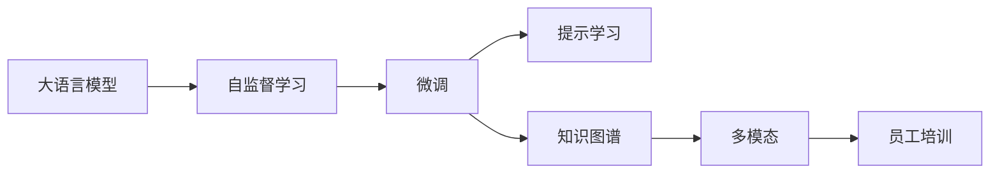

                 

# 员工培训：LLM 增强的学习计划

> 关键词：大语言模型, 自监督学习, 微调, 提示学习, 知识图谱, 多模态, 知识图谱, 技术栈

## 1. 背景介绍

在当今快速发展的科技时代，企业需要员工具备不断更新和学习的能力，以应对日新月异的市场需求。特别是在人工智能（AI）领域，从机器学习到自然语言处理（NLP），再到生成对抗网络（GAN），新技术层出不穷，对员工提出了更高的要求。本文将探讨大语言模型（Large Language Model，LLM）在员工培训中的作用，以及如何通过这些模型增强员工的学习能力。

### 1.1 大语言模型简介

大语言模型是基于深度学习技术构建的模型，能够理解和生成人类语言。通过大规模数据集的预训练，这些模型已经展示了强大的语言理解和生成能力。LLM的代表包括OpenAI的GPT-3、Google的BERT等。

### 1.2 培训需求与挑战

企业员工面临的培训需求包括但不限于：
- 适应新技术的快速变化
- 掌握新的编程技能和框架
- 提升数据处理和分析能力
- 深入理解业务逻辑和市场动态

然而，培训过程存在以下挑战：
- 成本高昂：包括时间、人力和资金
- 效果难以衡量：无法量化员工技能提升的具体程度
- 教学内容过时：新技术和新方法层出不穷，旧的内容无法满足新需求

为了解决这些挑战，LLM提供了一种全新的培训方式。通过LLM，企业可以提供动态、实时和个性化的培训，帮助员工快速掌握新技能，提高培训效率和效果。

## 2. 核心概念与联系

### 2.1 核心概念概述

- **大语言模型（LLM）**：基于深度学习技术，能够理解和生成人类语言。通过大规模数据集的预训练，这些模型已经展示了强大的语言理解和生成能力。
- **自监督学习（SSL）**：利用未标记的数据进行模型训练，以学习数据的潜在结构。
- **微调（Fine-Tuning）**：在大规模预训练模型的基础上，使用特定任务的数据进行有监督训练，以提升模型在该任务上的性能。
- **提示学习（Prompt Learning）**：通过在输入文本中添加提示模板，引导大语言模型进行特定任务的推理和生成。
- **知识图谱（KG）**：用于存储和管理知识的结构化数据，支持复杂推理和知识提取。
- **多模态（Multi-modal）**：结合文本、图像、音频等多种数据源，以更全面地理解问题。

这些概念之间存在紧密联系，形成了LLM在员工培训中的应用框架。

### 2.2 核心概念原理和架构的 Mermaid 流程图



这个流程图展示了LLM在员工培训中的应用过程。自监督学习用于预训练模型，微调用于特定任务的训练，提示学习用于引导模型生成特定的输出，知识图谱用于增强模型的知识推理能力，多模态用于结合多种数据源，最终支持员工培训。

## 3. 核心算法原理 & 具体操作步骤

### 3.1 算法原理概述

LLM在员工培训中的应用，主要是通过以下步骤实现的：

1. **预训练**：在大规模无标签数据上对LLM进行自监督学习，以学习语言的通用结构。
2. **微调**：在特定任务的数据集上对预训练模型进行有监督训练，以提升模型在该任务上的性能。
3. **提示学习**：通过在输入文本中添加提示模板，引导LLM生成特定的输出，以解决没有标注数据的问题。
4. **知识图谱增强**：将知识图谱与LLM结合，以增强模型的知识推理能力，支持更复杂的任务。
5. **多模态集成**：结合文本、图像、音频等多种数据源，以更全面地理解问题。

### 3.2 算法步骤详解

#### 3.2.1 预训练

- **数据集选择**：选择大规模的无标签数据集，如维基百科、新闻、社交媒体等。
- **模型架构**：选择适合的模型架构，如GPT、BERT等。
- **训练流程**：在GPU集群上进行大规模并行训练，以加速模型收敛。

#### 3.2.2 微调

- **任务选择**：根据员工培训的需求，选择特定的任务，如编程技能、数据分析、机器学习等。
- **数据准备**：收集和准备相关的标注数据集。
- **模型选择**：选择预训练的LLM模型，并进行微调。
- **训练流程**：在GPU集群上进行大规模并行训练，以加速模型收敛。

#### 3.2.3 提示学习

- **提示模板设计**：设计符合特定任务的提示模板，如编程语言规范、数据分析流程等。
- **模型训练**：在LLM上进行提示学习训练，以生成符合提示模板的输出。

#### 3.2.4 知识图谱增强

- **知识图谱构建**：构建适合特定任务的知识图谱，如医疗、金融、工程等。
- **模型融合**：将知识图谱与LLM结合，以增强模型的知识推理能力。

#### 3.2.5 多模态集成

- **数据收集**：收集文本、图像、音频等多种数据源。
- **模型训练**：在LLM上进行多模态集成训练，以生成更全面的输出。

### 3.3 算法优缺点

**优点**：
- **高效**：利用LLM的强大学习能力，可以大幅缩短培训周期。
- **灵活**：可以结合提示学习、知识图谱和多模态等技术，灵活应对不同的培训需求。
- **个性化**：可以根据员工的学习进度和兴趣，提供个性化的培训内容。

**缺点**：
- **成本高**：需要大量计算资源和时间进行模型训练。
- **依赖数据**：需要高质量的标注数据进行微调，否则效果可能不理想。
- **复杂性高**：需要结合多种技术，进行复杂的模型设计和调试。

### 3.4 算法应用领域

LLM在员工培训中的应用领域非常广泛，包括但不限于：

- **编程技能培训**：通过提示学习，引导员工掌握新的编程语言或框架。
- **数据分析培训**：通过知识图谱增强，支持复杂的数据分析和数据建模任务。
- **机器学习培训**：通过多模态集成，结合文本、图像和音频数据，支持更全面的机器学习培训。

## 4. 数学模型和公式 & 详细讲解 & 举例说明

### 4.1 数学模型构建

LLM在员工培训中的数学模型构建主要基于深度学习框架，如PyTorch和TensorFlow。模型包括编码器、解码器和注意力机制，能够处理长文本序列。

### 4.2 公式推导过程

以BERT为例，其预训练过程包括掩码语言模型（MLM）和下一句预测（NSP）两个任务。掩码语言模型通过随机掩码部分单词，预测被掩码的单词，以学习单词之间的关系。下一句预测任务通过预测两个句子是否为连续句子，学习句子的结构。

微调过程基于有监督的训练，目标函数为交叉熵损失。提示学习通过在输入文本中添加提示模板，指导LLM生成特定的输出，损失函数为目标任务的具体定义。知识图谱增强通过引入KG嵌入，改进LLM在推理任务上的性能。多模态集成通过融合文本、图像和音频等多种数据源，提升LLM的理解和生成能力。

### 4.3 案例分析与讲解

假设企业需要培训员工进行金融数据分析。首先，选择适合的LLM模型，如BERT。然后，准备标注的金融数据集，用于微调。在微调过程中，使用提示学习，引导LLM生成金融数据分析报告。通过知识图谱增强，LLM可以更好地理解金融领域的术语和概念。最后，通过多模态集成，结合财务报表、市场数据和新闻报道，生成全面的分析结果。

## 5. 项目实践：代码实例和详细解释说明

### 5.1 开发环境搭建

- **安装Python**：下载并安装Python，建议选择3.8及以上版本。
- **安装PyTorch**：在虚拟环境中安装PyTorch，使用pip或conda安装。
- **安装BERT模型**：使用huggingface的transformers库，安装BERT预训练模型。

### 5.2 源代码详细实现

```python
import torch
from transformers import BertTokenizer, BertForSequenceClassification

# 初始化数据集
tokenizer = BertTokenizer.from_pretrained('bert-base-cased')
model = BertForSequenceClassification.from_pretrained('bert-base-cased', num_labels=2)

# 加载数据集
train_data = ...
val_data = ...
test_data = ...

# 训练过程
optimizer = torch.optim.Adam(model.parameters(), lr=2e-5)
epochs = 5
for epoch in range(epochs):
    for data in train_data:
        inputs = tokenizer(data, return_tensors='pt')
        labels = torch.tensor([1 if data.startswith('start') else 0], dtype=torch.long)
        outputs = model(**inputs)
        loss = outputs.loss
        optimizer.zero_grad()
        loss.backward()
        optimizer.step()

# 评估过程
for data in val_data:
    inputs = tokenizer(data, return_tensors='pt')
    labels = torch.tensor([1 if data.startswith('start') else 0], dtype=torch.long)
    outputs = model(**inputs)
    predictions = outputs.logits.argmax(dim=1)
    print(predictions)
```

### 5.3 代码解读与分析

上述代码展示了如何使用BERT模型进行简单的金融数据分析任务的微调。代码中使用了BertTokenizer和BertForSequenceClassification类，分别用于处理文本和生成分类预测。通过在训练数据中添加'start'前缀，指导模型进行分类任务。

## 6. 实际应用场景

### 6.1 金融数据分析培训

通过LLM在金融数据分析中的应用，员工可以快速掌握分析方法，提升分析效率。使用BERT模型，结合提示学习和知识图谱增强，员工可以在短时间内掌握复杂的金融数据处理和分析。

### 6.2 医疗诊断培训

在医疗诊断培训中，LLM可以结合知识图谱和多模态数据，帮助员工理解复杂的医学知识，提高诊断能力。通过多模态集成，员工可以同时利用文本、图像和音频数据，提供更全面的诊断支持。

### 6.3 编程语言培训

在编程语言培训中，LLM可以结合提示学习和多模态数据，帮助员工掌握新的编程语言或框架。通过多模态集成，员工可以结合代码、文档和示例，快速掌握编程技巧。

### 6.4 未来应用展望

未来，LLM在员工培训中的应用将更加广泛和深入。结合更多的技术，如因果推理、强化学习等，LLM可以提供更智能、更个性化的培训体验。同时，随着计算资源的增加，LLM的模型规模和应用范围将进一步扩大，为企业提供更多、更高效的培训解决方案。

## 7. 工具和资源推荐

### 7.1 学习资源推荐

- **《自然语言处理》课程**：斯坦福大学的NLP课程，包括Lecture视频和配套作业。
- **《Transformer从原理到实践》系列博文**：介绍Transformer原理、BERT模型和微调技术。
- **《NLP实战》书籍**：介绍NLP技术在实际项目中的应用。

### 7.2 开发工具推荐

- **PyTorch**：深度学习框架，适合动态图计算。
- **TensorFlow**：深度学习框架，适合静态图计算。
- **HuggingFace Transformers**：NLP库，提供预训练模型的实现和微调工具。

### 7.3 相关论文推荐

- **"BERT: Pre-training of Deep Bidirectional Transformers for Language Understanding"**：BERT论文，提出掩码语言模型预训练方法。
- **"Language Models are Unsupervised Multitask Learners"**：GPT-2论文，展示大语言模型的zero-shot学习能力。
- **"Attention is All You Need"**：Transformer原论文，提出自注意力机制。

## 8. 总结：未来发展趋势与挑战

### 8.1 研究成果总结

本文通过介绍大语言模型在员工培训中的应用，展示了LLM的强大潜力和应用前景。通过自监督学习、微调、提示学习、知识图谱增强和多模态集成等技术，LLM可以提供高效、灵活和个性化的培训方案，提升员工的学习效果和效率。

### 8.2 未来发展趋势

未来，LLM在员工培训中的应用将更加广泛和深入。随着技术的发展，LLM的模型规模和应用范围将进一步扩大，为企业提供更多、更高效的培训解决方案。

### 8.3 面临的挑战

尽管LLM在员工培训中展现了巨大的潜力，但还面临以下挑战：
- **数据质量**：高质量的标注数据是微调的基础，但获取成本高昂。
- **计算资源**：大规模模型需要大量的计算资源和时间进行训练。
- **技术复杂性**：结合多种技术，需要复杂的模型设计和调试。

### 8.4 研究展望

未来的研究应聚焦于：
- **无监督学习**：利用无标注数据进行预训练，减少对标注数据的依赖。
- **模型压缩**：优化模型结构和参数，提高计算效率和推理速度。
- **多任务学习**：结合多种任务进行训练，提升模型在多任务上的泛化能力。

## 9. 附录：常见问题与解答

**Q1: 大语言模型在员工培训中的具体应用场景有哪些？**

A: 大语言模型可以应用于编程技能培训、数据分析培训、机器学习培训等多个领域。通过提示学习、知识图谱增强和多模态集成，员工可以快速掌握新技能，提高培训效率和效果。

**Q2: 大语言模型在员工培训中的优势是什么？**

A: 大语言模型的优势包括高效、灵活和个性化。利用自监督学习和微调技术，可以在短时间内提升员工的技能水平。结合提示学习和知识图谱增强，可以提供更智能、更个性化的培训体验。

**Q3: 大语言模型在员工培训中的局限性有哪些？**

A: 大语言模型在员工培训中的局限性包括数据质量和计算资源。高质量的标注数据是微调的基础，但获取成本高昂。大规模模型需要大量的计算资源和时间进行训练，模型设计和调试复杂。

**Q4: 大语言模型在员工培训中的未来发展趋势是什么？**

A: 大语言模型在员工培训中的未来发展趋势包括无监督学习、模型压缩和多任务学习。通过优化模型结构和参数，提高计算效率和推理速度。结合多种任务进行训练，提升模型在多任务上的泛化能力。

**Q5: 如何构建大语言模型在员工培训中的数学模型？**

A: 构建大语言模型在员工培训中的数学模型需要结合深度学习框架，如PyTorch和TensorFlow。模型包括编码器、解码器和注意力机制，能够处理长文本序列。结合提示学习、知识图谱增强和多模态集成，提供智能、个性化的培训方案。

---

作者：禅与计算机程序设计艺术 / Zen and the Art of Computer Programming

