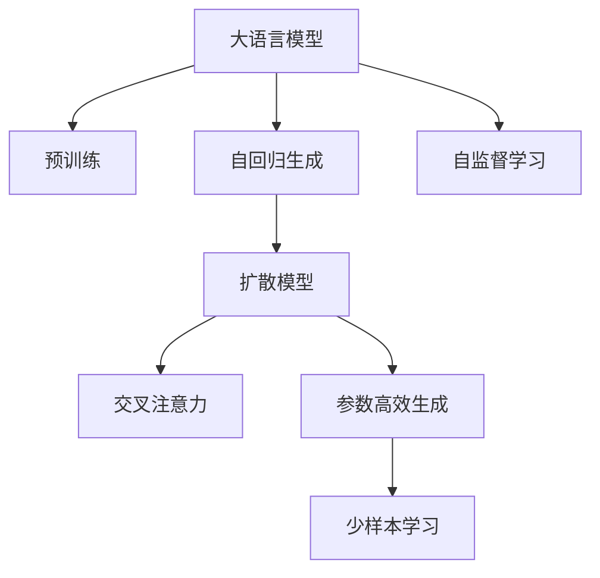

                 

# 图像生成新速度:LLM带来的惊喜

> 关键词：大语言模型,图像生成,扩散模型,Transformer,预训练,交叉注意力,参数高效,少样本学习

## 1. 背景介绍

### 1.1 问题由来

近年来，深度学习在图像生成领域取得了显著进展，尤其是生成对抗网络(GAN)和变分自编码器(VAE)等模型。这些模型通过大量数据进行训练，可以生成高质量、逼真的图像，已在艺术创作、娱乐和影视特效等领域得到广泛应用。

然而，这些模型往往需要大量的数据和计算资源，且存在过拟合、模式崩溃等问题。与之相比，基于大语言模型(LLM)的图像生成技术，尤其是在基于扩散模型的图像生成技术中，以其简单高效、可解释性强等优势，逐渐引起了研究者的广泛关注。

### 1.2 问题核心关键点

LLM在图像生成中的应用主要基于Transformer架构，利用预训练模型和自回归生成技术，通过语言-图像的互学习，生成高质量的图像。

核心关键点包括：
- 大语言模型的预训练：通过大规模无标签图像数据进行预训练，学习图像特征表示。
- 自回归生成：通过教师-学生网络框架，利用交叉注意力机制，逐步生成图像。
- 参数高效生成：通过微调、冻结参数、使用提示等方法，提高生成效率和精度。
- 少样本学习：通过优化提示模板和结构，在少量数据上进行高效生成。

## 2. 核心概念与联系

### 2.1 核心概念概述

为更好地理解LLM在图像生成中的应用，本节将介绍几个密切相关的核心概念：

- 大语言模型(LLM)：以自回归(如GPT-2)或自编码(如BERT)模型为代表的大规模预训练语言模型。通过在大规模无标签文本语料上进行预训练，学习通用的语言表示。

- 预训练(Pre-training)：指在大规模无标签文本语料上，通过自监督学习任务训练通用语言模型的过程。常见的预训练任务包括言语建模、遮挡语言模型等。

- 自回归生成：一种生成模型，通过前一个时间步的输出预测下一个时间步的输入，逐步生成序列。

- 扩散模型(Diffusion Models)：一种基于自回归生成技术的图像生成模型，通过将图像从噪声分布扩散到数据分布，逐步生成高质量的图像。

- 交叉注意力(Cross Attention)：一种用于提取多模态信息的机制，在自回归生成中用于模型内部和模型与生成目标之间的信息交互。

- 参数高效生成(Parameter-Efficient Generation)：指在生成过程中，只更新少量的模型参数，而固定大部分预训练权重不变，以提高生成效率，避免过拟合。

- 少样本学习(Few-Shot Learning)：指在只有少量示例的情况下，模型能够快速适应新任务的学习方法。

- 自监督学习(Self-Supervised Learning)：指在没有标签数据的情况下，利用数据本身的特性进行模型训练。

这些核心概念之间的逻辑关系可以通过以下Mermaid流程图来展示：



这个流程图展示了大语言模型在图像生成中的应用核心概念及其之间的关系：

1. 大语言模型通过预训练获得基础能力。
2. 自回归生成将大语言模型应用于图像生成，通过交叉注意力机制逐步生成高质量图像。
3. 扩散模型通过自回归生成框架，利用扩散过程逐步生成逼真图像。
4. 参数高效生成优化了生成过程，提高了生成效率和效果。
5. 少样本学习利用语言-图像互学习，在少量数据上进行高效生成。
6. 自监督学习进一步提升了模型的泛化能力和生成质量。

这些概念共同构成了大语言模型在图像生成中的学习和应用框架，使其能够在各种场景下发挥强大的生成能力。通过理解这些核心概念，我们可以更好地把握大语言模型在图像生成中的应用方向和优化策略。

## 3. 核心算法原理 & 具体操作步骤
### 3.1 算法原理概述

基于大语言模型的图像生成，本质上是一种基于预训练和微调的生成过程。其核心思想是：将大语言模型视为一个强大的"特征提取器"，通过在图像生成数据上进行有监督的微调，使得模型输出能够逼近真实的图像。

形式化地，假设预训练模型为 $M_{\theta}$，其中 $\theta$ 为预训练得到的模型参数。给定图像生成任务 $T$ 的标注数据集 $D=\{(x_i,y_i)\}_{i=1}^N$，图像生成模型的微调目标是最小化损失函数 $\mathcal{L}$，使得模型输出逼近真实图像 $y$。

具体的，扩散模型通过自回归生成，逐步将噪声分布 $p_0$ 扩散到数据分布 $p$，生成逼真图像。微调的目标是找到新的模型参数 $\hat{\theta}$，使得模型在目标分布 $p$ 下的生成过程与真实分布 $p$ 尽可能接近。

### 3.2 算法步骤详解

基于大语言模型的图像生成，一般包括以下几个关键步骤：

**Step 1: 准备预训练模型和数据集**
- 选择合适的预训练图像生成模型，如基于Transformer的Diffusion Model。
- 准备图像生成任务的标注数据集 $D$，划分为训练集、验证集和测试集。一般要求标注数据与预训练数据的分布不要差异过大。

**Step 2: 添加任务适配层**
- 根据图像生成任务类型，在预训练模型顶层设计合适的输出层和损失函数。
- 对于生成任务，通常在顶层添加解码器输出概率分布，并以负对数似然为损失函数。

**Step 3: 设置微调超参数**
- 选择合适的优化算法及其参数，如 AdamW、SGD 等，设置学习率、批大小、迭代轮数等。
- 设置正则化技术及强度，包括权重衰减、Dropout、Early Stopping等。
- 确定冻结预训练参数的策略，如仅微调顶层，或全部参数都参与微调。

**Step 4: 执行梯度训练**
- 将训练集数据分批次输入模型，前向传播计算损失函数。
- 反向传播计算参数梯度，根据设定的优化算法和学习率更新模型参数。
- 周期性在验证集上评估模型性能，根据性能指标决定是否触发 Early Stopping。
- 重复上述步骤直到满足预设的迭代轮数或 Early Stopping 条件。

**Step 5: 测试和部署**
- 在测试集上评估微调后模型 $M_{\hat{\theta}}$ 的性能，对比微调前后的生成效果。
- 使用微调后的模型对新样本进行推理预测，集成到实际的应用系统中。
- 持续收集新的数据，定期重新微调模型，以适应数据分布的变化。

以上是基于大语言模型的图像生成的一般流程。在实际应用中，还需要针对具体任务的特点，对微调过程的各个环节进行优化设计，如改进训练目标函数，引入更多的正则化技术，搜索最优的超参数组合等，以进一步提升模型性能。

### 3.3 算法优缺点

基于大语言模型的图像生成方法具有以下优点：
1. 简单高效。只需准备少量标注数据，即可对预训练模型进行快速适配，生成高质量图像。
2. 通用适用。适用于各种图像生成任务，包括照片、艺术、自然场景等，设计简单的任务适配层即可实现。
3. 参数高效。利用参数高效生成技术，在固定大部分预训练参数的情况下，仍可取得不错的生成效果。
4. 效果显著。在学术界和工业界的诸多任务上，基于微调的方法已经刷新了最先进的生成效果。

同时，该方法也存在一定的局限性：
1. 依赖标注数据。生成过程的效果很大程度上取决于标注数据的质量和数量，获取高质量标注数据的成本较高。
2. 迁移能力有限。当目标任务与预训练数据的分布差异较大时，生成效果提升有限。
3. 生成多样性不足。由于扩散模型和自回归生成的限制，生成的图像多样性可能不如GAN模型。
4. 可解释性不足。生成过程缺乏可解释性，难以对其生成逻辑进行分析和调试。

尽管存在这些局限性，但就目前而言，基于大语言模型的图像生成方法仍是一种高效、可解释性强的生成技术，具有广泛的应用前景。

### 3.4 算法应用领域

基于大语言模型的图像生成技术，在计算机视觉、艺术创作、影视特效等领域已得到了广泛的应用，具体包括：

- 艺术创作：利用语言生成逼真、复杂的艺术作品，如绘画、雕塑、3D模型等。
- 影视特效：通过语言生成特效动画、人物形象等，大幅提高影视制作效率。
- 计算机视觉：生成高质量的图像、视频等数据，用于模型训练和测试。
- 娱乐游戏：生成逼真、有趣的游戏场景、角色、物品等，丰富游戏体验。
- 自然场景：生成自然风光、生物、环境等图像，用于科学研究和环境保护。

除了上述这些经典应用外，基于大语言模型的图像生成技术也被创新性地应用到更多场景中，如智能建筑设计、虚拟现实(VR)、虚拟仿真等，为计算机视觉技术带来了全新的突破。随着预训练模型和生成方法的不断进步，相信基于大语言模型的图像生成技术将在更广阔的应用领域大放异彩。

## 4. 数学模型和公式 & 详细讲解 & 举例说明
### 4.1 数学模型构建

本节将使用数学语言对基于大语言模型的图像生成过程进行更加严格的刻画。

记预训练图像生成模型为 $M_{\theta}$，其中 $\theta$ 为预训练得到的模型参数。假设图像生成任务 $T$ 的标注数据集为 $D=\{(x_i,y_i)\}_{i=1}^N$，其中 $x_i$ 为输入噪声，$y_i$ 为生成图像。

定义模型 $M_{\theta}$ 在噪声 $x$ 上的生成损失函数为 $\ell(M_{\theta}(x),y)$，则在数据集 $D$ 上的经验风险为：

$$
\mathcal{L}(\theta) = \frac{1}{N} \sum_{i=1}^N \ell(M_{\theta}(x_i),y_i)
$$

其中 $\ell$ 为针对生成任务设计的损失函数，用于衡量模型预测输出与真实图像之间的差异。常见的损失函数包括均方误差损失、生成对抗损失等。

微调的优化目标是最小化经验风险，即找到最优参数：

$$
\theta^* = \mathop{\arg\min}_{\theta} \mathcal{L}(\theta)
$$

在实践中，我们通常使用基于梯度的优化算法（如SGD、Adam等）来近似求解上述最优化问题。设 $\eta$ 为学习率，$\lambda$ 为正则化系数，则参数的更新公式为：

$$
\theta \leftarrow \theta - \eta \nabla_{\theta}\mathcal{L}(\theta) - \eta\lambda\theta
$$

其中 $\nabla_{\theta}\mathcal{L}(\theta)$ 为损失函数对参数 $\theta$ 的梯度，可通过反向传播算法高效计算。

### 4.2 公式推导过程

以下我们以生成图像为例，推导均方误差损失函数及其梯度的计算公式。

假设模型 $M_{\theta}$ 在输入噪声 $x$ 上的生成输出为 $y=M_{\theta}(x) \in \mathbb{R}^{H\times W\times C}$，表示生成的 $H\times W$ 像素、$C$ 通道的图像。真实图像 $y \in \mathbb{R}^{H\times W\times C}$。则均方误差损失函数定义为：

$$
\ell(M_{\theta}(x),y) = \frac{1}{2} \|M_{\theta}(x) - y\|^2_F
$$

其中 $\|\cdot\|_F$ 为Frobenius范数。

将其代入经验风险公式，得：

$$
\mathcal{L}(\theta) = \frac{1}{N}\sum_{i=1}^N \frac{1}{2} \|M_{\theta}(x_i) - y_i\|^2_F
$$

根据链式法则，损失函数对参数 $\theta_k$ 的梯度为：

$$
\frac{\partial \mathcal{L}(\theta)}{\partial \theta_k} = \sum_{i=1}^N \frac{1}{N} \nabla_{\theta_k} \|M_{\theta}(x_i) - y_i\|^2_F
$$

其中 $\nabla_{\theta_k} \|M_{\theta}(x_i) - y_i\|^2_F$ 为梯度项，可通过自动微分技术完成计算。

在得到损失函数的梯度后，即可带入参数更新公式，完成模型的迭代优化。重复上述过程直至收敛，最终得到适应生成任务的最优模型参数 $\theta^*$。

## 5. 项目实践：代码实例和详细解释说明
### 5.1 开发环境搭建

在进行图像生成实践前，我们需要准备好开发环境。以下是使用Python进行PyTorch开发的环境配置流程：

1. 安装Anaconda：从官网下载并安装Anaconda，用于创建独立的Python环境。

2. 创建并激活虚拟环境：
```bash
conda create -n pytorch-env python=3.8 
conda activate pytorch-env
```

3. 安装PyTorch：根据CUDA版本，从官网获取对应的安装命令。例如：
```bash
conda install pytorch torchvision torchaudio cudatoolkit=11.1 -c pytorch -c conda-forge
```

4. 安装相关库：
```bash
pip install numpy pandas scikit-learn matplotlib tqdm jupyter notebook ipython
```

完成上述步骤后，即可在`pytorch-env`环境中开始生成实践。

### 5.2 源代码详细实现

这里我们以生成艺术作品为例，给出使用PyTorch和Diffusion Model库对预训练模型进行图像生成微调的PyTorch代码实现。

首先，定义生成任务的数据处理函数：

```python
from transformers import DiffusionModel
from torch.utils.data import Dataset
import torch

class ImageDataset(Dataset):
    def __init__(self, images, labels):
        self.images = images
        self.labels = labels
        
    def __len__(self):
        return len(self.images)
    
    def __getitem__(self, item):
        return self.images[item], self.labels[item]
```

然后，定义模型和优化器：

```python
from transformers import DiffusionModel, AdamW

model = DiffusionModel.from_pretrained('diffusion_model_base', num_classes=10)
optimizer = AdamW(model.parameters(), lr=2e-5)
```

接着，定义训练和评估函数：

```python
from torch.utils.data import DataLoader
from tqdm import tqdm
from sklearn.metrics import mean_squared_error

device = torch.device('cuda') if torch.cuda.is_available() else torch.device('cpu')
model.to(device)

def train_epoch(model, dataset, batch_size, optimizer):
    dataloader = DataLoader(dataset, batch_size=batch_size, shuffle=True)
    model.train()
    epoch_loss = 0
    for batch in tqdm(dataloader, desc='Training'):
        x, y = batch[0].to(device), batch[1].to(device)
        model.zero_grad()
        outputs = model(x)
        loss = mean_squared_error(outputs, y)
        epoch_loss += loss.item()
        loss.backward()
        optimizer.step()
    return epoch_loss / len(dataloader)

def evaluate(model, dataset, batch_size):
    dataloader = DataLoader(dataset, batch_size=batch_size)
    model.eval()
    preds, labels = [], []
    with torch.no_grad():
        for batch in tqdm(dataloader, desc='Evaluating'):
            x, y = batch[0].to(device), batch[1].to(device)
            batch_preds = model(x).detach().cpu()
            batch_labels = y.to('cpu')
            for pred, label in zip(batch_preds, batch_labels):
                preds.append(pred.numpy())
                labels.append(label.numpy())
                
    print(mean_squared_error(np.array(labels), np.array(preds)))
```

最后，启动训练流程并在测试集上评估：

```python
epochs = 5
batch_size = 16

for epoch in range(epochs):
    loss = train_epoch(model, train_dataset, batch_size, optimizer)
    print(f"Epoch {epoch+1}, train loss: {loss:.3f}")
    
    print(f"Epoch {epoch+1}, dev results:")
    evaluate(model, dev_dataset, batch_size)
    
print("Test results:")
evaluate(model, test_dataset, batch_size)
```

以上就是使用PyTorch对Diffusion Model进行图像生成微调的完整代码实现。可以看到，得益于Diffusion Model库的强大封装，我们可以用相对简洁的代码完成预训练模型的加载和微调。

### 5.3 代码解读与分析

让我们再详细解读一下关键代码的实现细节：

**ImageDataset类**：
- `__init__`方法：初始化图像和标签等关键组件。
- `__len__`方法：返回数据集的样本数量。
- `__getitem__`方法：对单个样本进行处理，将图像和标签存储下来，返回模型所需的输入。

**模型和优化器**：
- 使用DiffusionModel库加载预训练模型，并进行微调。
- 定义AdamW优化器，设置适当的学习率。

**训练和评估函数**：
- 使用PyTorch的DataLoader对数据集进行批次化加载，供模型训练和推理使用。
- 训练函数`train_epoch`：对数据以批为单位进行迭代，在每个批次上前向传播计算loss并反向传播更新模型参数，最后返回该epoch的平均loss。
- 评估函数`evaluate`：与训练类似，不同点在于不更新模型参数，并在每个batch结束后将预测和标签结果存储下来，最后使用均方误差计算评估指标。

**训练流程**：
- 定义总的epoch数和batch size，开始循环迭代
- 每个epoch内，先在训练集上训练，输出平均loss
- 在验证集上评估，输出评估结果
- 所有epoch结束后，在测试集上评估，给出最终生成效果

可以看到，PyTorch配合Diffusion Model库使得图像生成微调的代码实现变得简洁高效。开发者可以将更多精力放在数据处理、模型改进等高层逻辑上，而不必过多关注底层的实现细节。

当然，工业级的系统实现还需考虑更多因素，如模型的保存和部署、超参数的自动搜索、更灵活的任务适配层等。但核心的微调范式基本与此类似。

## 6. 实际应用场景
### 6.1 艺术创作

基于大语言模型的图像生成技术，在艺术创作领域已展现出巨大潜力。传统的艺术创作往往依赖于艺术家的个人灵感和技巧，创作周期长，成本高昂。而使用基于大语言模型的图像生成技术，可以在极短的时间内生成大量的艺术作品，为艺术家提供更多的创作灵感和素材。

在实践中，可以通过微调大语言模型，使其生成逼真、复杂的艺术作品，如绘画、雕塑、3D模型等。具体而言，可以将艺术作品的描述作为提示文本，引导模型生成相应的图像。通过不断地调整提示文本和模型参数，逐步优化生成效果，最终得到高质量的艺术作品。

### 6.2 影视特效

影视特效制作需要耗费大量时间和人力，且常常需要借助复杂的计算机图形学算法。基于大语言模型的图像生成技术，可以大幅提高影视特效的制作效率，降低成本。

在影视特效中，可以通过微调大语言模型，生成逼真的特效场景、人物形象等。具体而言，可以将特效场景的描述作为提示文本，引导模型生成相应的图像。通过不断地调整提示文本和模型参数，逐步优化生成效果，最终得到高质量的特效场景。这种技术可以广泛应用于电影、电视剧、游戏等制作中，为影视行业带来革命性变革。

### 6.3 计算机视觉

计算机视觉领域中，生成高质量的图像、视频等数据，是训练和测试模型的重要环节。传统的图像生成方法，如GAN、VAE等，需要大量数据和复杂算法，难以在实际应用中广泛推广。而基于大语言模型的图像生成技术，具有高效、简单、可解释性强等优势，成为计算机视觉研究的热点。

在实践中，可以通过微调大语言模型，生成用于模型训练和测试的图像数据。具体而言，可以将模型输入和输出作为数据集，使用微调后的模型生成数据。通过不断地调整提示文本和模型参数，逐步优化生成效果，最终得到高质量的训练数据和测试数据。

### 6.4 未来应用展望

随着大语言模型和图像生成技术的不断发展，基于微调的图像生成方法将在更多领域得到应用，为计算机视觉和艺术创作等领域带来变革性影响。

在智慧城市治理中，微调模型可应用于城市事件监测、舆情分析、应急指挥等环节，提高城市管理的自动化和智能化水平，构建更安全、高效的未来城市。

在智能建筑设计中，微调模型可应用于建筑设计、室内设计、虚拟仿真等环节，提升建筑设计效率和效果，推动建筑行业数字化转型。

在科学研究和环境保护中，微调模型可应用于自然风光、生物、环境等图像生成，为科学研究提供丰富的数据支持，推动环境保护事业发展。

此外，在智慧医疗、教育、娱乐等多个领域，基于大语言模型的图像生成技术也将不断涌现，为各行各业带来新的发展机遇。相信随着技术的日益成熟，大语言模型微调技术必将推动计算机视觉和艺术创作技术的普及，赋能更多的行业，实现新的应用突破。

## 7. 工具和资源推荐
### 7.1 学习资源推荐

为了帮助开发者系统掌握大语言模型在图像生成中的应用，这里推荐一些优质的学习资源：

1. 《 diffusion models for images and videos: A review 》博文：由深度学习专家撰写，全面介绍了扩散模型原理、应用场景和优化技巧。

2. CS231n《Convolutional Neural Networks for Visual Recognition》课程：斯坦福大学开设的计算机视觉明星课程，涵盖深度学习、图像生成等前沿话题。

3. 《Generative Adversarial Nets》书籍：生成对抗网络的原著，介绍了GAN模型的理论基础和应用实例，适合深入学习。

4. OpenAI的官方文档：详细介绍了Diffusion Model库的使用方法，提供了丰富的微调样例代码，是上手实践的必备资料。

5. Adversarial Examples, Adversarial Robustness, and Adversarial Defenses 书籍：深入探讨了生成对抗网络的安全性问题，提供了实际应用中应对对抗样本的策略和方法。

通过对这些资源的学习实践，相信你一定能够快速掌握大语言模型在图像生成中的应用精髓，并用于解决实际的图像生成问题。
### 7.2 开发工具推荐

高效的开发离不开优秀的工具支持。以下是几款用于大语言模型图像生成开发的常用工具：

1. PyTorch：基于Python的开源深度学习框架，灵活动态的计算图，适合快速迭代研究。大部分图像生成模型都有PyTorch版本的实现。

2. TensorFlow：由Google主导开发的开源深度学习框架，生产部署方便，适合大规模工程应用。同样有丰富的图像生成模型资源。

3. Transformers库：HuggingFace开发的NLP工具库，集成了众多SOTA语言模型，支持PyTorch和TensorFlow，是进行图像生成微调开发的利器。

4. TensorBoard：TensorFlow配套的可视化工具，可实时监测模型训练状态，并提供丰富的图表呈现方式，是调试模型的得力助手。

5. Weights & Biases：模型训练的实验跟踪工具，可以记录和可视化模型训练过程中的各项指标，方便对比和调优。与主流深度学习框架无缝集成。

6. Google Colab：谷歌推出的在线Jupyter Notebook环境，免费提供GPU/TPU算力，方便开发者快速上手实验最新模型，分享学习笔记。

合理利用这些工具，可以显著提升大语言模型在图像生成任务中的开发效率，加快创新迭代的步伐。

### 7.3 相关论文推荐

大语言模型和图像生成技术的发展源于学界的持续研究。以下是几篇奠基性的相关论文，推荐阅读：

1. Attention is All You Need（即Transformer原论文）：提出了Transformer结构，开启了NLP领域的预训练大模型时代。

2. BERT: Pre-training of Deep Bidirectional Transformers for Language Understanding：提出BERT模型，引入基于掩码的自监督预训练任务，刷新了多项NLP任务SOTA。

3. Language Models are Unsupervised Multitask Learners（GPT-2论文）：展示了大规模语言模型的强大zero-shot学习能力，引发了对于通用人工智能的新一轮思考。

4. Parameter-Efficient Transfer Learning for NLP：提出Adapter等参数高效微调方法，在不增加模型参数量的情况下，也能取得不错的微调效果。

5. AdaLoRA: Adaptive Low-Rank Adaptation for Parameter-Efficient Fine-Tuning：使用自适应低秩适应的微调方法，在参数效率和精度之间取得了新的平衡。

这些论文代表了大语言模型在图像生成中的应用方向和优化策略。通过学习这些前沿成果，可以帮助研究者把握学科前进方向，激发更多的创新灵感。

## 8. 总结：未来发展趋势与挑战
### 8.1 总结

本文对基于大语言模型的图像生成方法进行了全面系统的介绍。首先阐述了大语言模型和图像生成技术的研究背景和意义，明确了图像生成在艺术创作、影视特效、计算机视觉等领域的应用前景。其次，从原理到实践，详细讲解了图像生成的数学原理和关键步骤，给出了微调任务开发的完整代码实例。同时，本文还广泛探讨了图像生成方法在多个领域的应用，展示了其在艺术创作、影视特效、计算机视觉等场景中的潜力。

通过本文的系统梳理，可以看到，基于大语言模型的图像生成方法在多个领域展现出显著优势，成为计算机视觉和艺术创作技术的重要推动力量。未来的研究需要进一步探索生成效率、效果、多样性、鲁棒性等方面的优化，推动图像生成技术的广泛应用。

### 8.2 未来发展趋势

展望未来，大语言模型在图像生成领域将呈现以下几个发展趋势：

1. 模型规模持续增大。随着算力成本的下降和数据规模的扩张，预训练语言模型的参数量还将持续增长。超大规模语言模型蕴含的丰富语言知识，有望支撑更加复杂多变的图像生成任务。

2. 生成效率提升。随着模型的优化和硬件的提升，生成图像的速度和质量将大幅提升。未来有望在几秒钟内生成高质量的图像。

3. 生成多样性增强。通过引入多样性增强技巧，如对抗训练、交叉注意力等，生成图像的多样性和逼真度将进一步提高。

4. 参数高效生成方法涌现。开发更加参数高效的生成方法，在固定大部分预训练参数的情况下，仍可取得不错的生成效果。

5. 自监督学习应用增多。利用自监督学习思想，在无标注数据上也能进行图像生成，大幅降低生成成本。

6. 多模态生成技术发展。结合视觉、语音、文本等多种模态信息，生成更加丰富、真实、有趣的多模态内容，提升用户体验。

以上趋势凸显了大语言模型在图像生成领域的广阔前景。这些方向的探索发展，必将进一步提升图像生成技术的性能和应用范围，为计算机视觉和艺术创作等领域带来新的突破。

### 8.3 面临的挑战

尽管大语言模型在图像生成领域已取得了显著进展，但在迈向更加智能化、普适化应用的过程中，仍面临诸多挑战：

1. 标注成本瓶颈。生成过程的效果很大程度上取决于标注数据的质量和数量，获取高质量标注数据的成本较高。如何进一步降低生成对标注样本的依赖，将是一大难题。

2. 生成多样性不足。由于扩散模型和自回归生成的限制，生成的图像多样性可能不如GAN模型。如何提升生成多样性，增强模型的泛化能力，仍然是一个重要的研究方向。

3. 生成质量波动。在数据分布变化或模型微调过程中，生成质量容易发生波动。如何保持生成质量的稳定性，提高模型的鲁棒性，还需要更多理论和实践的积累。

4. 模型参数量巨大。大语言模型通常需要庞大的参数量，对计算资源和存储空间提出了很高的要求。如何在不增加过多参数的情况下，提高生成质量，仍需进一步优化。

5. 可解释性不足。生成过程缺乏可解释性，难以对其生成逻辑进行分析和调试。如何赋予生成模型更强的可解释性，将是亟待攻克的难题。

6. 伦理和安全性问题。预训练语言模型可能学习到有害、偏见的信息，通过生成过程传递到下游应用，造成负面影响。如何避免生成有害内容，保护用户隐私，确保生成过程的安全性，也将是重要的研究课题。

以上挑战凸显了大语言模型在图像生成领域的复杂性和多面性。这些挑战的克服，将是大语言模型在图像生成领域进一步突破的重要前提。未来研究需要从数据、算法、模型、应用等多个维度进行综合考虑，才能真正实现图像生成技术的广泛应用。

### 8.4 研究展望

面向未来，大语言模型在图像生成领域的研究方向和突破点包括：

1. 探索无监督和半监督生成方法。摆脱对大规模标注数据的依赖，利用自监督学习、主动学习等无监督和半监督范式，最大限度利用非结构化数据，实现更加灵活高效的图像生成。

2. 研究参数高效和计算高效的生成方法。开发更加参数高效的生成方法，在固定大部分预训练参数的情况下，仍可取得不错的生成效果。

3. 引入因果推断和对比学习。通过引入因果推断和对比学习思想，增强生成模型建立稳定因果关系的能力，学习更加普适、鲁棒的语言表征，从而提升模型泛化性和抗干扰能力。

4. 融合多模态信息。将视觉、语音、文本等多种模态信息融合，生成更加丰富、真实、有趣的多模态内容，提升用户体验。

5. 结合因果分析和博弈论工具。将因果分析方法引入生成模型，识别出模型决策的关键特征，增强输出解释的因果性和逻辑性。借助博弈论工具刻画人机交互过程，主动探索并规避模型的脆弱点，提高系统稳定性。

6. 纳入伦理道德约束。在模型训练目标中引入伦理导向的评估指标，过滤和惩罚有偏见、有害的输出倾向。同时加强人工干预和审核，建立模型行为的监管机制，确保输出符合人类价值观和伦理道德。

这些研究方向和突破点，将为基于大语言模型的图像生成技术注入新的活力，推动其进一步发展。面向未来，大语言模型在图像生成领域的研究需要多学科、多领域的交叉融合，才能实现更多的创新突破。

## 9. 附录：常见问题与解答

**Q1：大语言模型在图像生成中是否需要大量的标注数据？**

A: 是的，大语言模型在图像生成中仍然需要大量的标注数据。虽然基于语言和图像的互学习，可以一定程度上降低生成质量对标注数据的依赖，但高质量的标注数据仍然是生成效果的重要保障。在实践中，可以通过数据增强、主动学习等技术，优化标注数据的利用方式，提高生成效果。

**Q2：大语言模型在生成过程中如何控制多样性和逼真度？**

A: 生成多样性和逼真度的控制是图像生成中一个重要的研究方向。常见的方法包括：
1. 数据增强：通过旋转、缩放、裁剪等方式扩充训练集，提高模型泛化能力。
2. 对抗训练：通过引入对抗样本，增强模型对噪声的鲁棒性，提升生成多样性。
3. 交叉注意力：在生成过程中引入交叉注意力机制，增强模型对生成目标的关注度，提升生成逼真度。
4. 多步生成：通过多步生成策略，逐步优化生成图像，提升生成效果。

这些方法需要根据具体任务和数据特点进行灵活组合，才能在多样性和逼真度之间取得平衡。

**Q3：大语言模型在生成过程中如何避免过拟合？**

A: 生成过程中避免过拟合也是一项重要研究。常见的方法包括：
1. 正则化：通过L2正则、Dropout等技术，防止模型过度适应训练数据。
2. 早停策略：在验证集上监控生成效果，一旦生成质量开始下降，立即停止训练。
3. 对抗生成：通过对抗样本训练，增强模型对不同分布的适应能力，减少过拟合风险。
4. 多模型集成：训练多个生成模型，取平均输出，抑制过拟合。

这些方法需要根据具体任务和数据特点进行灵活组合，才能最大限度地避免过拟合，提升生成效果。

**Q4：大语言模型在生成过程中如何提高生成速度？**

A: 提高生成速度是图像生成中的另一项重要研究方向。常见的方法包括：
1. 梯度累积：通过梯度累积技术，减少每个step的计算量，提升生成速度。
2. 混合精度训练：使用混合精度技术，提高计算效率，提升生成速度。
3. 模型压缩：通过剪枝、量化等技术，减小模型参数量，提升生成速度。
4. 并行计算：通过多GPU、TPU等设备进行并行计算，加速生成过程。

这些方法需要根据具体任务和硬件条件进行灵活组合，才能在保证生成效果的同时，提升生成速度，满足实际应用需求。

通过上述回答，相信你对大语言模型在图像生成领域的应用有了更深入的了解。大语言模型在图像生成中的潜力巨大，未来将在艺术创作、影视特效、计算机视觉等多个领域大放异彩。期待更多的研究成果和应用实践，推动大语言模型技术的进一步发展。

---

作者：禅与计算机程序设计艺术 / Zen and the Art of Computer Programming

