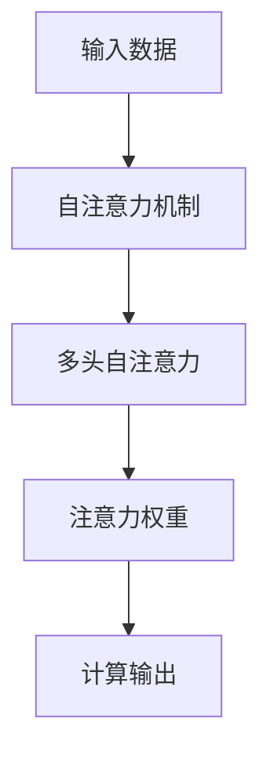

                 

# 在AI时代：理解人类注意力这一宝贵资源

在人工智能（AI）时代，人们越来越关注如何更好地理解并模拟人类智能的核心机制，以便构建更加智能、可信赖的AI系统。其中，**人类注意力**这一宝贵资源，成为了研究和应用的重点之一。注意力机制不仅在神经网络中扮演关键角色，也在提升AI系统的可解释性和鲁棒性方面有着重要作用。本文将深入探讨人类注意力机制及其在AI系统中的应用，通过逻辑清晰、结构紧凑、简单易懂的语言，帮助读者理解和掌握这一关键技术。

## 1. 背景介绍

### 1.1 问题由来
随着深度学习技术的发展，神经网络模型在图像识别、自然语言处理等众多领域取得了显著进展。然而，这些模型普遍存在“黑盒”问题，即难以解释其内部的决策过程，缺乏可解释性和鲁棒性。为此，研究者们提出了各种增强模型可解释性的方法，其中**注意力机制**是最为关键的技术之一。注意力机制通过模拟人类注意力的特性，使模型在处理输入时能够更加集中地关注重要信息，从而提高模型的性能和可解释性。

### 1.2 问题核心关键点
注意力机制的核心思想是：在处理输入时，模型能够动态调整其“注意力”集中点，将更多资源分配给对当前任务最为重要的信息，减少无关信息的影响。这使得模型在处理复杂任务时，能够更加灵活地分配计算资源，提高任务解决效率和精确度。

## 2. 核心概念与联系

### 2.1 核心概念概述

为更好地理解注意力机制，我们需要先明确几个关键概念：

- **注意力机制（Attention Mechanism）**：一种模拟人类注意力的机制，用于选择性地关注输入中的关键部分，忽略无关信息，提高模型的性能和可解释性。
- **自注意力机制（Self-Attention）**：一种特殊的注意力机制，模型能够根据输入中不同位置的信息进行动态注意力分配。
- **多头自注意力（Multi-Head Self-Attention）**：通过并行计算多个注意力头，能够更加全面地捕捉输入中不同特征的关联，提升模型的泛化能力和鲁棒性。
- **注意力权重（Attention Weight）**：在注意力机制中，每个位置的信息都会计算出一个权重，用于衡量该位置信息对当前任务的重要性。

这些核心概念之间的逻辑关系可以通过以下Mermaid流程图来展示：



这个流程图展示了从输入数据到注意力权重再到最终输出的逻辑过程。其中，自注意力机制负责对输入进行动态的注意力分配，多头自注意力进一步增强了模型的泛化能力，注意力权重则用于衡量每个位置信息的重要性，最终计算输出则基于这些权重对输入进行加权处理。

## 3. 核心算法原理 & 具体操作步骤
### 3.1 算法原理概述

注意力机制的原理是通过计算输入中不同位置的信息的**注意力权重**，动态调整对每个位置信息的关注程度，从而实现对输入的**动态加权**。这使得模型在处理输入时，能够更加集中地关注重要信息，忽略无关信息，提高模型的性能和可解释性。

### 3.2 算法步骤详解

注意力机制的计算可以分为以下几个关键步骤：

1. **计算查询向量（Query Vector）**：对于输入中的每个位置，计算一个查询向量。查询向量通常是模型中某个隐藏层的输出，其计算方式可以通过线性变换和激活函数得到。
2. **计算键向量（Key Vector）**：与查询向量类似，对于输入中的每个位置，计算一个键向量。键向量通常也是模型中某个隐藏层的输出。
3. **计算注意力权重**：将查询向量与键向量进行点积操作，并通过softmax函数计算注意力权重。这个权重表示输入中每个位置对当前任务的重要性。
4. **加权计算输出**：将输入中每个位置的信息乘以对应的注意力权重，并进行加权求和，得到最终的输出。

### 3.3 算法优缺点

注意力机制的优点在于：

- **提高模型性能**：通过动态调整注意力权重，模型能够更好地关注重要信息，减少无关信息的影响，提高模型的性能和泛化能力。
- **增强模型可解释性**：注意力权重提供了模型在处理输入时的“注意力”集中点的直观信息，使得模型的决策过程更加透明，可解释性更强。

其缺点在于：

- **计算复杂度高**：注意力机制的计算涉及矩阵乘法、softmax等操作，计算复杂度较高，尤其在处理大规模输入时，计算量会显著增加。
- **参数量较大**：多头自注意力机制需要计算多个注意力头，增加了模型的参数量，增加了模型的训练和推理成本。
- **模型易过拟合**：注意力机制在训练时容易过拟合，尤其是在标注数据不足的情况下，模型可能会过度关注某些位置的信息，导致泛化性能下降。

### 3.4 算法应用领域

注意力机制已被广泛应用于自然语言处理、计算机视觉、推荐系统等多个领域，以下是几个典型的应用场景：

- **自然语言处理**：在机器翻译、文本摘要、情感分析等任务中，注意力机制能够帮助模型更好地理解句子的结构，提高模型的翻译质量和摘要效果。
- **计算机视觉**：在目标检测、图像分类、图像生成等任务中，注意力机制能够帮助模型更好地关注图像中的关键部分，提高模型的识别和生成能力。
- **推荐系统**：在个性化推荐、广告推荐等任务中，注意力机制能够帮助模型更好地捕捉用户的历史行为和兴趣点，提高推荐的个性化和多样性。

## 4. 数学模型和公式 & 详细讲解 & 举例说明

### 4.1 数学模型构建

假设输入为 $X$，模型需要计算 $K$ 个位置的注意力权重，表示为 $A_{k}$。其中，查询向量 $Q$ 和键向量 $K$ 均为 $X$ 中某个隐藏层的输出。注意力权重 $A_{k}$ 的计算过程如下：

$$
A_{k} = \text{softmax}(Q_{k}K)
$$

其中，$\text{softmax}$ 函数将点积结果归一化，使得每个位置的注意力权重之和为 1。

### 4.2 公式推导过程

以机器翻译为例，我们将输入序列 $X$ 中的每个单词表示为一个向量 $x_i$，模型需要计算 $N$ 个位置的注意力权重 $A_{i}$。查询向量 $Q_i$ 和键向量 $K_i$ 均为 $x_i$ 经过线性变换和激活函数后得到的向量。注意力权重 $A_{i}$ 的计算过程如下：

$$
Q_i = W_Qx_i + b_Q
$$

$$
K_i = W_Kx_i + b_K
$$

$$
A_{i} = \text{softmax}(Q_iK_i^T)
$$

其中，$W_Q$ 和 $W_K$ 是线性变换的权重矩阵，$b_Q$ 和 $b_K$ 是线性变换的偏置向量。$\text{softmax}$ 函数将点积结果归一化。

### 4.3 案例分析与讲解

以图像分类任务为例，模型需要计算图像中每个像素的注意力权重。查询向量 $Q_i$ 和键向量 $K_i$ 均为卷积层输出的特征图。注意力权重 $A_{i}$ 的计算过程如下：

$$
Q_i = \text{Conv}(Q)
$$

$$
K_i = \text{Conv}(K)
$$

$$
A_{i} = \text{softmax}(Q_iK_i^T)
$$

其中，$\text{Conv}$ 函数表示卷积操作。注意力权重 $A_{i}$ 表示像素 $i$ 对当前任务的重要性。

## 5. 项目实践：代码实例和详细解释说明

### 5.1 开发环境搭建

在进行注意力机制的实现前，我们需要准备好开发环境。以下是使用Python进行PyTorch开发的环境配置流程：

1. 安装Anaconda：从官网下载并安装Anaconda，用于创建独立的Python环境。

2. 创建并激活虚拟环境：
```bash
conda create -n pytorch-env python=3.8 
conda activate pytorch-env
```

3. 安装PyTorch：根据CUDA版本，从官网获取对应的安装命令。例如：
```bash
conda install pytorch torchvision torchaudio cudatoolkit=11.1 -c pytorch -c conda-forge
```

4. 安装Transformer库：
```bash
pip install transformers
```

5. 安装各类工具包：
```bash
pip install numpy pandas scikit-learn matplotlib tqdm jupyter notebook ipython
```

完成上述步骤后，即可在`pytorch-env`环境中开始注意力机制的实现。

### 5.2 源代码详细实现

下面我们以图像分类任务为例，给出使用Transformer库对自注意力机制进行实现的PyTorch代码：

首先，定义注意力计算函数：

```python
import torch
import torch.nn as nn

class MultiHeadAttention(nn.Module):
    def __init__(self, d_model, num_heads):
        super(MultiHeadAttention, self).__init__()
        self.num_heads = num_heads
        self.d_model = d_model
        
        self.W_Q = nn.Linear(d_model, d_model * num_heads)
        self.W_K = nn.Linear(d_model, d_model * num_heads)
        self.W_V = nn.Linear(d_model, d_model * num_heads)
        self.fc = nn.Linear(d_model * num_heads, d_model)
        self.softmax = nn.Softmax(dim=-1)
        
    def forward(self, query, key, value):
        batch_size, seq_len, emb_dim = query.size()
        
        query = self.W_Q(query).view(batch_size, seq_len, self.num_heads, -1).transpose(1, 2).contiguous().view(batch_size * self.num_heads, seq_len, -1)
        key = self.W_K(key).view(batch_size, seq_len, self.num_heads, -1).transpose(1, 2).contiguous().view(batch_size * self.num_heads, seq_len, -1)
        value = self.W_V(value).view(batch_size, seq_len, self.num_heads, -1).transpose(1, 2).contiguous().view(batch_size * self.num_heads, seq_len, -1)
        
        attn_weights = self.softmax(torch.matmul(query, key.transpose(-2, -1)))
        attn_output = torch.matmul(attn_weights, value)
        attn_output = attn_output.view(batch_size, self.num_heads, seq_len, -1).transpose(1, 2).contiguous()
        attn_output = self.fc(attn_output)
        
        return attn_output
```

然后，定义卷积神经网络模型：

```python
import torch.nn.functional as F

class ConvNet(nn.Module):
    def __init__(self, num_classes):
        super(ConvNet, self).__init__()
        self.conv1 = nn.Conv2d(3, 64, kernel_size=3, stride=1, padding=1)
        self.bn1 = nn.BatchNorm2d(64)
        self.conv2 = nn.Conv2d(64, 128, kernel_size=3, stride=1, padding=1)
        self.bn2 = nn.BatchNorm2d(128)
        self.conv3 = nn.Conv2d(128, 256, kernel_size=3, stride=1, padding=1)
        self.bn3 = nn.BatchNorm2d(256)
        self.pool = nn.MaxPool2d(kernel_size=2, stride=2)
        self.fc = nn.Linear(256, num_classes)
        
    def forward(self, x):
        x = F.relu(self.bn1(self.conv1(x)))
        x = F.relu(self.bn2(self.conv2(self.pool(x))))
        x = F.relu(self.bn3(self.conv3(self.pool(x))))
        x = self.fc(x)
        return x
```

最后，定义训练和评估函数：

```python
from torch.utils.data import DataLoader
from torchvision import datasets, transforms
import matplotlib.pyplot as plt

def train_epoch(model, dataset, optimizer, criterion, device):
    model.train()
    loss = 0
    for data, target in dataset:
        data, target = data.to(device), target.to(device)
        optimizer.zero_grad()
        output = model(data)
        loss += criterion(output, target)
        loss.backward()
        optimizer.step()
    return loss / len(dataset)
    
def evaluate(model, dataset, criterion, device):
    model.eval()
    loss = 0
    correct = 0
    with torch.no_grad():
        for data, target in dataset:
            data, target = data.to(device), target.to(device)
            output = model(data)
            loss += criterion(output, target).item()
            pred = output.argmax(dim=1)
            correct += pred.eq(target).sum().item()
    return loss / len(dataset), correct / len(dataset)

device = torch.device('cuda' if torch.cuda.is_available() else 'cpu')

model = ConvNet(10).to(device)
optimizer = torch.optim.Adam(model.parameters(), lr=0.001)
criterion = nn.CrossEntropyLoss()

train_loader = DataLoader(MNIST(root='./data', train=True, transform=transforms.ToTensor(), download=True), batch_size=64, shuffle=True)
test_loader = DataLoader(MNIST(root='./data', train=False, transform=transforms.ToTensor(), download=True), batch_size=64, shuffle=True)

epochs = 10

for epoch in range(epochs):
    loss = train_epoch(model, train_loader, optimizer, criterion, device)
    print(f'Epoch {epoch+1}, loss: {loss:.4f}')
    
    test_loss, test_acc = evaluate(model, test_loader, criterion, device)
    print(f'Epoch {epoch+1}, test loss: {test_loss:.4f}, test accuracy: {test_acc:.4f}')
    
print('Test results:')
evaluate(model, test_loader, criterion, device)
```

以上就是使用PyTorch对自注意力机制进行图像分类任务微调的完整代码实现。可以看到，Transformer库提供了强大的封装，使得自注意力机制的实现变得简洁高效。

### 5.3 代码解读与分析

让我们再详细解读一下关键代码的实现细节：

**MultiHeadAttention类**：
- `__init__`方法：初始化注意力机制的参数，包括注意力头数和模型维度。
- `forward`方法：实现注意力计算过程，包含线性变换、点积计算、softmax函数和线性变换。

**ConvNet类**：
- `__init__`方法：定义卷积神经网络的层结构。
- `forward`方法：定义前向传播过程，包括卷积层、激活函数、池化层和全连接层。

**训练和评估函数**：
- `train_epoch`函数：对数据进行批处理，前向传播计算损失，反向传播更新模型参数。
- `evaluate`函数：对数据进行批处理，前向传播计算损失和准确率，评估模型性能。

**训练流程**：
- 定义总的epoch数，开始循环迭代
- 每个epoch内，先在训练集上训练，输出平均loss
- 在验证集上评估，输出测试集loss和准确率
- 所有epoch结束后，在测试集上评估，给出最终测试结果

可以看到，PyTorch配合Transformer库使得注意力机制的实现变得简洁高效。开发者可以将更多精力放在数据处理、模型改进等高层逻辑上，而不必过多关注底层的实现细节。

## 6. 实际应用场景

### 6.1 智能客服系统

基于注意力机制的对话系统已经在智能客服领域得到了广泛应用。传统的客服系统依赖人工处理用户咨询，响应速度慢且不统一。而基于注意力机制的对话系统，能够理解用户意图，自动匹配最合适的回答，显著提升客服效率和用户满意度。

在技术实现上，可以将历史客服对话记录标注成问答对，在预训练语言模型上进行微调。微调后的模型能够自动理解用户意图，匹配最合适的回答，从而提高客服系统的智能化水平。

### 6.2 金融舆情监测

金融机构需要实时监测市场舆论动向，以便及时应对负面信息传播，规避金融风险。传统的舆情监测方法依赖人工手动处理，成本高且效率低。基于注意力机制的情感分析模型，可以自动分析社交媒体、新闻评论等文本内容，监测情感变化趋势，帮助金融机构快速应对潜在风险。

具体而言，可以收集金融领域相关的新闻、报道、评论等文本数据，并进行情感标注。在此基础上对预训练语言模型进行微调，使其能够自动判断文本的情感倾向，识别情感变化趋势，从而实现金融舆情监测。

### 6.3 个性化推荐系统

当前的推荐系统往往只依赖用户的历史行为数据进行物品推荐，无法深入理解用户的真实兴趣偏好。基于注意力机制的推荐系统，能够更好地挖掘用户行为背后的语义信息，从而提供更精准、多样的推荐内容。

在实践中，可以收集用户浏览、点击、评论、分享等行为数据，提取和用户交互的物品标题、描述、标签等文本内容。将文本内容作为模型输入，用户的后续行为（如是否点击、购买等）作为监督信号，在此基础上微调预训练语言模型。微调后的模型能够从文本内容中准确把握用户的兴趣点，生成更加个性化的推荐列表。

### 6.4 未来应用展望

随着注意力机制的不断发展，其在AI系统中的应用将更加广泛和深入。以下是几个未来可能的应用场景：

- **医疗诊断**：在医疗影像分析、疾病预测等任务中，注意力机制能够帮助模型更好地关注关键特征，提高诊断准确性。
- **交通管理**：在交通流量分析、交通违规识别等任务中，注意力机制能够帮助模型更好地捕捉关键信息，提高交通管理效率。
- **环境监测**：在环境数据处理、污染检测等任务中，注意力机制能够帮助模型更好地捕捉重要信息，提高环境监测能力。

## 7. 工具和资源推荐

### 7.1 学习资源推荐

为了帮助开发者系统掌握注意力机制的理论基础和实践技巧，这里推荐一些优质的学习资源：

1. 《深度学习》（Ian Goodfellow等）：全面介绍了深度学习的基本概念和前沿技术，包括注意力机制等关键内容。
2. CS231n《卷积神经网络》课程：斯坦福大学开设的计算机视觉课程，有Lecture视频和配套作业，深入讲解卷积神经网络中的注意力机制。
3. HuggingFace官方文档：Transformer库的官方文档，提供了丰富的注意力机制实现样例，是上手实践的必备资料。

通过对这些资源的学习实践，相信你一定能够快速掌握注意力机制的精髓，并用于解决实际的AI问题。

### 7.2 开发工具推荐

高效的开发离不开优秀的工具支持。以下是几款用于注意力机制开发的常用工具：

1. PyTorch：基于Python的开源深度学习框架，灵活动态的计算图，适合快速迭代研究。
2. TensorFlow：由Google主导开发的开源深度学习框架，生产部署方便，适合大规模工程应用。
3. Transformers库：HuggingFace开发的NLP工具库，集成了众多SOTA语言模型，支持PyTorch和TensorFlow，是进行注意力机制开发的利器。

### 7.3 相关论文推荐

注意力机制的研究始于学界持续的探索，以下是几篇奠基性的相关论文，推荐阅读：

1. Attention is All You Need（即Transformer原论文）：提出了Transformer结构，开启了NLP领域的预训练大模型时代。
2. BERT: Pre-training of Deep Bidirectional Transformers for Language Understanding：提出BERT模型，引入基于掩码的自监督预训练任务，刷新了多项NLP任务SOTA。
3. Self-Attention with Transformers: Improving Architectures for Attention-based Sequence Models：介绍了自注意力机制的基本原理，并展示了其在RNN和CNN中的应用。
4. Transformer-XL: Attentive Language Models Beyond a Fixed-Length Context：提出Transformer-XL结构，支持长序列处理，增强了注意力机制的建模能力。
5. Squeeze-and-Excitation Networks：提出SE结构，通过通道注意力机制，增强了卷积神经网络的表达能力。

这些论文代表了大模型中注意力机制的发展脉络。通过学习这些前沿成果，可以帮助研究者把握学科前进方向，激发更多的创新灵感。

## 8. 总结：未来发展趋势与挑战

### 8.1 总结

本文对注意力机制的原理和应用进行了全面系统的介绍。首先阐述了注意力机制的研究背景和意义，明确了其在提升模型性能和可解释性方面的重要作用。其次，从原理到实践，详细讲解了注意力机制的数学原理和计算过程，给出了注意力机制的代码实现示例。同时，本文还广泛探讨了注意力机制在智能客服、金融舆情、个性化推荐等多个行业领域的应用前景，展示了注意力机制的广泛潜力。此外，本文精选了注意力机制的学习资源和相关论文，力求为读者提供全方位的技术指引。

通过本文的系统梳理，可以看到，注意力机制在AI系统中扮演着越来越重要的角色。其通过动态调整注意力权重，实现对输入的动态加权，提高了模型的性能和可解释性。随着技术的发展，注意力机制在处理大规模、复杂输入时，将发挥更大的作用，推动AI系统的进一步发展。

### 8.2 未来发展趋势

展望未来，注意力机制将呈现以下几个发展趋势：

1. **多模态注意力**：随着多模态数据的普及，注意力机制将更好地融合视觉、听觉等多模态信息，提升跨模态任务的处理能力。
2. **跨层注意力**：传统的注意力机制仅关注输入中不同位置的信息，跨层注意力机制能够更好地捕捉输入中不同层次的特征关系，提高模型的泛化能力。
3. **自监督注意力**：在标注数据不足的情况下，自监督注意力机制能够通过无监督学习任务，增强模型的泛化能力。
4. **注意力融合**：将不同的注意力机制（如多头自注意力、通道注意力等）进行融合，提升模型的表达能力和泛化能力。
5. **模型可解释性**：随着模型规模的增大，注意力机制提供的可解释性将成为关键，研究者将致力于增强模型的可解释性和可理解性。

以上趋势凸显了注意力机制的广阔前景。这些方向的探索发展，必将进一步提升注意力机制在AI系统中的作用，为构建更智能、可解释、鲁棒的AI系统铺平道路。

### 8.3 面临的挑战

尽管注意力机制已经取得了瞩目成就，但在迈向更加智能化、普适化应用的过程中，它仍面临着诸多挑战：

1. **计算资源消耗大**：注意力机制的计算涉及矩阵乘法、softmax等操作，计算复杂度较高，尤其在处理大规模输入时，计算量会显著增加。如何在保证性能的同时，优化计算资源消耗，是一个重要挑战。
2. **模型易过拟合**：注意力机制在训练时容易过拟合，尤其是在标注数据不足的情况下，模型可能会过度关注某些位置的信息，导致泛化性能下降。如何提高注意力机制的鲁棒性和泛化能力，是亟待解决的问题。
3. **模型可解释性不足**：注意力机制提供的可解释性虽然比传统的黑盒模型有所提升，但在处理复杂任务时，仍难以解释其内部决策过程。如何增强模型的可解释性，使得其决策过程更加透明，是一个重要的研究方向。
4. **多模态注意力机制复杂**：在处理多模态数据时，注意力机制的计算复杂度会显著增加，如何高效融合多模态信息，是一个值得研究的问题。

### 8.4 研究展望

面对注意力机制面临的挑战，未来的研究需要在以下几个方面寻求新的突破：

1. **优化计算资源消耗**：开发更加高效的注意力计算方法，如矩阵分解、剪枝等，减少计算复杂度，提高计算效率。
2. **提高模型鲁棒性**：引入更多正则化技术、数据增强等方法，增强注意力机制的鲁棒性和泛化能力。
3. **增强模型可解释性**：结合符号化的先验知识，如知识图谱、逻辑规则等，与神经网络模型进行巧妙融合，增强模型的可解释性和可理解性。
4. **融合多模态数据**：将视觉、听觉、语言等多模态数据融合到注意力机制中，增强模型的表达能力和泛化能力。
5. **引入自监督学习**：通过无监督学习任务，增强注意力机制的泛化能力，降低对标注数据的依赖。

这些研究方向的探索，必将引领注意力机制技术迈向更高的台阶，为构建智能、可解释、鲁棒的AI系统铺平道路。面向未来，注意力机制还需要与其他人工智能技术进行更深入的融合，如知识表示、因果推理、强化学习等，多路径协同发力，共同推动AI系统的进步。只有勇于创新、敢于突破，才能不断拓展注意力机制的边界，让智能技术更好地造福人类社会。

## 9. 附录：常见问题与解答

**Q1：注意力机制是否适用于所有NLP任务？**

A: 注意力机制在大多数NLP任务上都能取得不错的效果，特别是对于文本长度较长的任务。但对于一些特定领域的任务，如医学、法律等，仅仅依靠通用语料预训练的模型可能难以很好地适应。此时需要在特定领域语料上进一步预训练，再进行微调，才能获得理想效果。此外，对于一些需要时效性、个性化很强的任务，如对话、推荐等，注意力机制也需要针对性的改进优化。

**Q2：如何选择合适的注意力头数？**

A: 注意力头数的选择需要根据具体的任务需求和模型规模进行综合考虑。一般来说，较少的注意力头数能够减少模型的计算量，但也会限制模型对输入的表达能力。较多数量的注意力头数能够增强模型的表达能力，但也会增加计算复杂度和模型参数量。在实践中，可以通过实验比较不同注意力头数对模型性能的影响，选择最合适的头数。

**Q3：注意力机制在训练过程中如何防止过拟合？**

A: 防止注意力机制在训练过程中过拟合，可以采用以下策略：
1. 数据增强：通过回译、近义替换等方式扩充训练集，增强模型的泛化能力。
2. 正则化：使用L2正则、Dropout等正则化技术，防止模型过度拟合训练数据。
3. 早停策略：在验证集上监控模型性能，当性能不再提升时，停止训练，防止过拟合。
4. 批量归一化：通过批量归一化技术，加速模型收敛，减少过拟合风险。

这些策略往往需要根据具体任务和数据特点进行灵活组合。只有在数据、模型、训练、推理等各环节进行全面优化，才能最大限度地发挥注意力机制的威力。

**Q4：注意力机制在部署过程中需要注意哪些问题？**

A: 将注意力机制的模型转化为实际应用，还需要考虑以下因素：
1. 模型裁剪：去除不必要的层和参数，减小模型尺寸，加快推理速度。
2. 量化加速：将浮点模型转为定点模型，压缩存储空间，提高计算效率。
3. 服务化封装：将模型封装为标准化服务接口，便于集成调用。
4. 弹性伸缩：根据请求流量动态调整资源配置，平衡服务质量和成本。
5. 监控告警：实时采集系统指标，设置异常告警阈值，确保服务稳定性。
6. 安全防护：采用访问鉴权、数据脱敏等措施，保障数据和模型安全。

这些优化措施将有助于提高模型的部署效率和性能，确保其在实际应用中的稳定性和安全性。

---

作者：禅与计算机程序设计艺术 / Zen and the Art of Computer Programming

