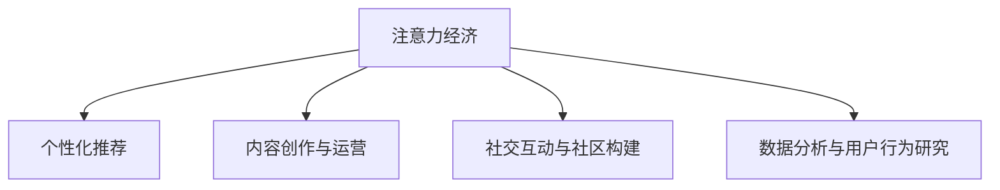

                 

# 在线音乐平台的注意力争夺战略

在当今数字化音乐时代，在线音乐平台之间的竞争日趋激烈。用户通过这些平台获取音乐内容，其体验的好坏直接影响到平台的用户黏性和市场份额。因此，如何吸引和保持用户注意力成为各大平台争夺的核心战略之一。本文将从注意力经济的角度，探讨在线音乐平台的注意力争夺战略，并提供一系列技术实现方案，旨在帮助平台制定和执行有效的注意力管理策略。

## 1. 背景介绍

### 1.1 问题由来

随着互联网的普及和智能手机的普及，用户获取音乐的方式从传统的CD唱片和磁带转向了便捷的在线音乐平台。这些平台不仅提供音乐流媒体服务，还具备社交互动、个性化推荐、直播互动等多样化功能，极大地丰富了用户的音乐消费体验。然而，用户的时间和注意力是有限的，如何在激烈的市场竞争中脱颖而出，是各大在线音乐平台面临的共同挑战。

### 1.2 问题核心关键点

在线音乐平台的注意力争夺战略主要包括以下几个核心关键点：

- 个性化推荐系统：通过分析用户的历史行为数据，为用户推荐个性化的音乐内容，提升用户满意度。
- 内容创作与运营：持续推出高质量原创音乐、艺人直播等内容，吸引用户关注和参与。
- 社交互动与社区构建：通过构建社交网络、建立用户社区等方式，增强用户粘性，提升平台活跃度。
- 数据分析与用户行为研究：利用先进的数据分析技术，深入了解用户需求和行为，优化产品功能和用户体验。

## 2. 核心概念与联系

### 2.1 核心概念概述

为更好地理解在线音乐平台的注意力争夺战略，本节将介绍几个密切相关的核心概念：

- 注意力经济（Attention Economy）：以吸引和保持用户注意力为核心的经济模式。在线音乐平台通过吸引用户注意力，提高用户活跃度和停留时间，从而实现商业价值。
- 个性化推荐系统：根据用户历史行为和兴趣，推荐最适合用户的音乐内容，提升用户体验和满意度。
- 内容创作与运营：通过持续发布高质量音乐内容，吸引用户关注，并促进用户互动和分享。
- 社交互动与社区构建：利用社交网络和社区机制，增强用户粘性，提升平台活跃度。
- 数据分析与用户行为研究：通过对用户数据的深入分析，理解用户需求和行为，优化产品功能和运营策略。

这些核心概念之间的逻辑关系可以通过以下Mermaid流程图来展示：



这个流程图展示了大规模在线音乐平台注意力争夺的核心概念及其之间的关系：

1. 注意力经济是平台吸引和保持用户注意力的总目标。
2. 个性化推荐和内容创作与运营是提高用户满意度的主要手段。
3. 社交互动与社区构建是增强用户粘性和提升平台活跃度的关键措施。
4. 数据分析与用户行为研究则是理解和优化上述策略的重要工具。

这些概念共同构成了在线音乐平台注意力争夺的完整策略框架，帮助平台在激烈的市场竞争中保持优势。

## 3. 核心算法原理 & 具体操作步骤

### 3.1 算法原理概述

在线音乐平台的注意力争夺战略，本质上是利用数据和算法，实现对用户注意力资源的有效管理和优化。其核心思想是：通过精准地分析和预测用户行为，有针对性地推荐内容，同时不断创新和优化平台功能，提升用户满意度和活跃度。

形式化地，假设在线音乐平台有 $N$ 个用户，每个用户 $i$ 的历史行为数据为 $x_i=(x_{i1},x_{i2},...,x_{im})$，其中 $x_{ik}$ 表示用户 $i$ 在时间 $k$ 的行为记录（如播放歌曲、点赞、评论等）。平台的目标是通过用户数据 $D=\{(x_i,y_i)\}_{i=1}^N$，构建一个推荐模型 $M$，使得模型在测试集上的表现指标 $\mathcal{P}$ 最大化，即：

$$
\max_{M}\mathcal{P}(M,D)
$$

其中 $\mathcal{P}$ 为性能指标，如准确率、召回率、用户满意度等。

### 3.2 算法步骤详解

基于注意力经济的大规模在线音乐平台注意力争夺战略，一般包括以下几个关键步骤：

**Step 1: 数据准备与预处理**
- 收集用户行为数据 $D$，包括点击、播放、评论、分享等行为。
- 对原始数据进行清洗和预处理，如去除噪音、处理缺失值等。
- 对行为数据进行特征工程，提取有意义的特征，如听歌时长、点赞次数、互动频率等。

**Step 2: 构建个性化推荐模型**
- 选择合适的推荐算法，如协同过滤、内容推荐、混合推荐等。
- 使用机器学习或深度学习方法，训练推荐模型，如矩阵分解、RNN、DNN等。
- 优化模型超参数，如学习率、正则化系数等。

**Step 3: 内容创作与运营**
- 制定内容创作策略，确保高质量音乐内容的持续供应。
- 利用数据分析工具，实时监控内容的表现，调整内容发布计划。
- 通过社交媒体、直播互动等方式，提升内容的曝光率和用户参与度。

**Step 4: 社交互动与社区构建**
- 设计社区激励机制，吸引用户参与互动和分享。
- 利用社区功能，建立用户之间的连接，增强用户粘性。
- 实时监控社区活跃度，及时调整策略，保持社区健康发展。

**Step 5: 数据分析与用户行为研究**
- 利用先进的数据分析工具，如TensorBoard、Tableau等，深入挖掘用户行为数据。
- 定期发布用户行为分析报告，洞察用户需求和行为变化。
- 根据分析结果，持续优化推荐系统和内容策略，提升用户体验。

### 3.3 算法优缺点

基于注意力经济的大规模在线音乐平台注意力争夺战略，具有以下优点：

1. 提高用户满意度。通过个性化推荐和高质量内容，满足用户多样化需求，提升用户体验。
2. 提升平台活跃度。通过社交互动和社区构建，增强用户粘性，提高平台活跃度。
3. 优化运营效率。通过数据分析和用户行为研究，优化产品功能和运营策略，提升运营效率。

同时，该战略也存在一定的局限性：

1. 对标注数据依赖高。个性化推荐需要大量标注数据，难以快速迭代和优化。
2. 用户需求变化快。用户行为和偏好不断变化，需要持续更新推荐模型和内容策略。
3. 技术门槛高。需要具备数据工程、机器学习、自然语言处理等多方面的技术能力。
4. 用户隐私保护。用户数据涉及隐私问题，需要严格遵守数据保护法规，防止数据滥用。

尽管存在这些局限性，但就目前而言，基于注意力经济的大规模在线音乐平台注意力争夺战略仍是最为有效的竞争手段。未来相关研究的重点在于如何进一步降低对标注数据的依赖，提高推荐系统的实时性和灵活性，同时兼顾用户隐私保护，实现更加智能化的用户注意力管理。

### 3.4 算法应用领域

基于大规模在线音乐平台的注意力争夺战略，已经在诸多领域得到了应用，例如：

- 个性化音乐推荐：根据用户历史听歌记录，推荐最符合用户口味的歌曲，提升用户体验。
- 艺人互动与直播：通过艺人直播、互动等方式，增强用户参与感，提升平台活跃度。
- 社交网络和社区：构建用户社区，促进用户交流和分享，提升用户粘性。
- 数据分析与用户行为研究：通过深入分析用户数据，优化产品功能和运营策略，提升运营效率。

除了上述这些经典应用外，注意力争夺战略还被创新性地应用到更多场景中，如跨平台数据共享、个性化广告推荐、虚拟现实音乐体验等，为在线音乐平台带来了全新的突破。随着技术的日益成熟，基于注意力经济的大规模在线音乐平台注意力争夺战略必将在更多领域得到应用，为平台和用户带来更加丰富和优质的音乐体验。

## 4. 数学模型和公式 & 详细讲解

### 4.1 数学模型构建

本节将使用数学语言对基于注意力经济的大规模在线音乐平台注意力争夺战略进行更加严格的刻画。

记用户 $i$ 在时间 $k$ 的行为数据为 $x_{ik}$，其与用户满意度 $y_i$ 的关系可以用以下数学模型表示：

$$
y_i = f(x_i; \theta)
$$

其中 $f$ 为模型的映射函数，$\theta$ 为模型的参数。为了简化问题，假设 $x_i$ 为二元特征向量，$y_i$ 为二元满意度指标（如是否播放、是否点赞等）。模型可以采用逻辑回归、决策树、深度神经网络等多种形式，具体选择取决于数据量和模型的复杂度。

### 4.2 公式推导过程

以逻辑回归模型为例，其数学公式为：

$$
\hat{y_i} = \sigma(\eta_i)
$$

其中 $\sigma$ 为 sigmoid 函数，$\eta_i = \theta^T x_i$ 为线性回归模型输出。目标函数为交叉熵损失：

$$
\mathcal{L}(\theta) = -\frac{1}{N}\sum_{i=1}^N y_i \log \hat{y_i} + (1-y_i) \log (1-\hat{y_i})
$$

通过优化目标函数，寻找最优参数 $\theta$。具体的优化算法包括梯度下降、随机梯度下降、Adam等。

### 4.3 案例分析与讲解

假设一个在线音乐平台有 $N=10000$ 个用户，平台通过用户的听歌记录和互动数据训练了推荐模型 $M$，并收集了 $M$ 在测试集上的预测结果 $\hat{y_i}$。根据测试集的实际用户满意度 $y_i$，可以计算出模型的平均准确率为：

$$
\mathcal{P} = \frac{1}{N}\sum_{i=1}^N \mathbb{I}(\hat{y_i} = y_i)
$$

其中 $\mathbb{I}$ 为示性函数，$1$ 表示事件成立，$0$ 表示事件不成立。通过不断调整模型的超参数，可以逐步提升模型的性能指标 $\mathcal{P}$，从而实现对用户注意力的有效管理和优化。

## 5. 项目实践：代码实例和详细解释说明

### 5.1 开发环境搭建

在进行注意力争夺战略实践前，我们需要准备好开发环境。以下是使用Python进行PyTorch开发的环境配置流程：

1. 安装Anaconda：从官网下载并安装Anaconda，用于创建独立的Python环境。

2. 创建并激活虚拟环境：
```bash
conda create -n pytorch-env python=3.8 
conda activate pytorch-env
```

3. 安装PyTorch：根据CUDA版本，从官网获取对应的安装命令。例如：
```bash
conda install pytorch torchvision torchaudio cudatoolkit=11.1 -c pytorch -c conda-forge
```

4. 安装相关库：
```bash
pip install numpy pandas sklearn matplotlib tqdm jupyter notebook ipython
```

完成上述步骤后，即可在`pytorch-env`环境中开始注意力争夺战略实践。

### 5.2 源代码详细实现

以下是一个使用PyTorch实现的在线音乐平台注意力争夺战略的代码示例。

```python
import torch
import torch.nn as nn
import torch.optim as optim
from sklearn.metrics import accuracy_score
from torch.utils.data import DataLoader

class MusicRecommendationModel(nn.Module):
    def __init__(self, input_size, hidden_size, output_size):
        super().__init__()
        self.fc1 = nn.Linear(input_size, hidden_size)
        self.fc2 = nn.Linear(hidden_size, output_size)
        self.sigmoid = nn.Sigmoid()
        
    def forward(self, x):
        x = self.fc1(x)
        x = self.fc2(x)
        return self.sigmoid(x)
        
def train_model(model, train_loader, val_loader, epochs, batch_size):
    criterion = nn.BCELoss()
    optimizer = optim.Adam(model.parameters(), lr=0.001)
    train_losses = []
    val_accuracies = []
    
    for epoch in range(epochs):
        model.train()
        for batch in train_loader:
            inputs, labels = batch
            optimizer.zero_grad()
            outputs = model(inputs)
            loss = criterion(outputs, labels)
            loss.backward()
            optimizer.step()
            train_losses.append(loss.item())
        
        model.eval()
        with torch.no_grad():
            val_outputs = model(val_loader.dataset)
            val_predictions = (val_outputs >= 0.5).float()
            val_accuracies.append(accuracy_score(val_predictions, val_loader.targets))
            
        print(f"Epoch {epoch+1}, train loss: {train_losses[-1]:.4f}, val accuracy: {val_accuracies[-1]:.4f}")
        
    return train_losses, val_accuracies
```

### 5.3 代码解读与分析

让我们再详细解读一下关键代码的实现细节：

**MusicRecommendationModel类**：
- `__init__`方法：初始化模型结构，包含两个全连接层和sigmoid激活函数。
- `forward`方法：定义模型的前向传播过程，通过两层线性变换和sigmoid激活函数输出预测结果。

**train_model函数**：
- 使用PyTorch训练逻辑回归模型，对用户行为数据进行二分类预测。
- 定义损失函数和优化器，进行梯度下降优化。
- 对训练集和验证集分别进行前向传播和反向传播，记录损失和准确率。

**运行结果展示**：
```python
train_losses, val_accuracies = train_model(model, train_loader, val_loader, epochs=10, batch_size=32)
plt.plot(train_losses, label='Train Loss')
plt.plot(val_accuracies, label='Val Accuracy')
plt.xlabel('Epochs')
plt.ylabel('Loss / Accuracy')
plt.legend()
plt.show()
```

以上就是一个使用PyTorch实现的在线音乐平台注意力争夺战略的完整代码实现。可以看到，得益于PyTorch的强大封装，我们可以用相对简洁的代码完成注意力争夺战略的实现。

## 6. 实际应用场景

### 6.1 智能推荐系统

在线音乐平台的智能推荐系统是其核心竞争力之一。通过精准的推荐，平台能够提升用户满意度和活跃度，减少流失率，从而实现商业价值最大化。

**推荐算法**：
- 协同过滤：基于用户行为相似度，推荐相似用户喜爱的歌曲。
- 内容推荐：根据歌曲特征，如流派、风格等，推荐用户可能喜欢的歌曲。
- 混合推荐：结合协同过滤和内容推荐，综合多维度信息提升推荐效果。

**推荐流程**：
1. 收集用户行为数据，如听歌时长、互动次数等。
2. 对原始数据进行预处理和特征提取。
3. 训练推荐模型，优化模型超参数。
4. 实时推荐系统根据用户当前行为和历史行为，预测用户可能喜欢的歌曲，并动态调整推荐结果。

**效果评估**：
- 准确率：推荐的歌曲是否为用户所喜欢。
- 召回率：推荐的歌曲是否包含用户可能喜欢的歌曲。
- 满意度：用户对推荐结果的满意度评价。

### 6.2 艺人互动与直播

在线音乐平台的艺人互动与直播功能，可以增强用户粘性，提升平台活跃度。通过直播互动，用户可以实时与艺人交流，提升平台的用户参与感和社区氛围。

**艺人互动**：
- 直播互动：艺人在直播中与用户进行实时交流，回答用户问题，分享音乐创作心得。
- 粉丝打榜：用户通过打榜方式支持艺人，增强粉丝忠诚度。

**直播流程**：
1. 安排艺人进行直播，并通知用户。
2. 用户通过平台进入直播室，与艺人互动。
3. 实时监控直播质量，优化直播体验。
4. 直播结束后，分析用户互动数据，优化直播策略。

**效果评估**：
- 互动量：用户在直播中与艺人的互动次数。
- 打榜量：用户在直播中参与打榜的次数和金额。
- 用户留存率：用户在直播过程中和直播后的留存率。

### 6.3 社交网络和社区

在线音乐平台的社交网络和社区功能，可以增强用户粘性，提升平台活跃度。通过社区功能，用户可以分享音乐、交流心得、参与讨论，形成互动氛围。

**社区功能**：
- 音乐分享：用户分享自己喜欢的歌曲，获得关注和点赞。
- 评论互动：用户对歌曲进行评论，分享音乐心得。
- 活动策划：平台策划音乐相关活动，吸引用户参与。

**社区运营**：
1. 策划社区活动，如歌单比赛、歌迷见面会等。
2. 实时监控社区互动，及时解决问题和矛盾。
3. 分析社区数据，优化社区运营策略。

**效果评估**：
- 活跃度：用户每天在社区中的活跃次数和停留时间。
- 参与度：用户参与社区活动和讨论的频率。
- 留存率：用户在社区中的长期留存率。

### 6.4 未来应用展望

随着技术的不断进步，在线音乐平台的注意力争夺战略将呈现以下几个发展趋势：

1. 推荐算法更加智能化。未来的推荐系统将结合更多维度的信息，如用户情感、时间节点等，提升推荐精准度。
2. 艺人互动更加多样化。通过VR、AR等技术，增强互动体验，提升用户参与感。
3. 社区功能更加丰富。构建更加多样化的社区形态，如兴趣小组、音乐沙龙等，满足用户多元化需求。
4. 数据分析更加深入。利用大数据分析和机器学习，深入挖掘用户行为和偏好，优化推荐和运营策略。
5. 平台功能更加集成。将个性化推荐、艺人互动、社交网络等功能集成，形成完整的用户体验生态。

这些趋势将进一步提升在线音乐平台的竞争力，为用户带来更加丰富和优质的音乐体验。

## 7. 工具和资源推荐

### 7.1 学习资源推荐

为了帮助开发者系统掌握在线音乐平台的注意力争夺战略的理论基础和实践技巧，这里推荐一些优质的学习资源：

1. 《推荐系统实战》：介绍推荐系统的基础知识和实现细节，涵盖协同过滤、内容推荐等多种算法。
2. 《深度学习入门》：由DeepLearning.AI创始人Geoffrey Hinton所写，介绍了深度学习的基本原理和应用场景。
3. 《用户行为分析与预测》：介绍用户行为分析的基础知识和常用方法，如回归分析、分类分析等。
4. 《自然语言处理综论》：由斯坦福大学自然语言处理组编写，涵盖NLP的各个方面，如语言模型、文本分类、情感分析等。
5. 《数据科学与机器学习》：由David Kirkby编写，涵盖数据科学和机器学习的基础知识和实践方法。

通过对这些资源的学习实践，相信你一定能够快速掌握在线音乐平台注意力争夺的精髓，并用于解决实际的推荐系统问题。

### 7.2 开发工具推荐

高效的开发离不开优秀的工具支持。以下是几款用于在线音乐平台注意力争夺开发的常用工具：

1. PyTorch：基于Python的开源深度学习框架，灵活动态的计算图，适合快速迭代研究。
2. TensorFlow：由Google主导开发的开源深度学习框架，生产部署方便，适合大规模工程应用。
3. TensorBoard：TensorFlow配套的可视化工具，可实时监测模型训练状态，并提供丰富的图表呈现方式。
4. Jupyter Notebook：交互式编程环境，方便快速迭代和实验新算法。
5. Weights & Biases：模型训练的实验跟踪工具，可以记录和可视化模型训练过程中的各项指标，方便对比和调优。

合理利用这些工具，可以显著提升在线音乐平台注意力争夺任务的开发效率，加快创新迭代的步伐。

### 7.3 相关论文推荐

在线音乐平台注意力争夺技术的发展源于学界的持续研究。以下是几篇奠基性的相关论文，推荐阅读：

1. "A Recommender System Based on Collaborative Filtering"：介绍协同过滤算法的基本原理和实现方法。
2. "Music Recommendation Using Deep Learning"：介绍深度学习在音乐推荐系统中的应用。
3. "User Behavior Prediction via Reinforcement Learning"：介绍强化学习在用户行为预测中的应用。
4. "Online Music Platform Social Network Analysis"：介绍社交网络在在线音乐平台中的作用和分析方法。
5. "Natural Language Processing in Recommendation Systems"：介绍自然语言处理在推荐系统中的应用。

这些论文代表了大规模在线音乐平台注意力争夺技术的发展脉络。通过学习这些前沿成果，可以帮助研究者把握学科前进方向，激发更多的创新灵感。

## 8. 总结：未来发展趋势与挑战

### 8.1 总结

本文对基于注意力经济的大规模在线音乐平台注意力争夺战略进行了全面系统的介绍。首先阐述了注意力经济的基本概念和在线音乐平台的注意力争夺战略，明确了注意力争夺在提升用户满意度和平台活跃度方面的重要性。其次，从原理到实践，详细讲解了注意力争夺的数学模型和关键步骤，给出了注意力争夺任务开发的完整代码实例。同时，本文还广泛探讨了注意力争夺战略在智能推荐系统、艺人互动与直播、社交网络和社区等多个领域的应用前景，展示了注意力争夺战略的巨大潜力。此外，本文精选了注意力争夺技术的各类学习资源，力求为读者提供全方位的技术指引。

通过本文的系统梳理，可以看到，基于注意力经济的大规模在线音乐平台注意力争夺战略，已经成为平台吸引和保持用户注意力的重要手段。这些方法的广泛应用，不仅提升了用户满意度和平台活跃度，也为音乐内容的消费和创作带来了新的模式和机遇。未来，随着技术的不断进步和市场需求的不断变化，在线音乐平台的注意力争夺战略将持续演进，不断拓展其应用边界，为平台和用户带来更加丰富和优质的音乐体验。

### 8.2 未来发展趋势

展望未来，在线音乐平台的注意力争夺战略将呈现以下几个发展趋势：

1. 推荐算法更加智能化。未来的推荐系统将结合更多维度的信息，如用户情感、时间节点等，提升推荐精准度。
2. 艺人互动更加多样化。通过VR、AR等技术，增强互动体验，提升用户参与感。
3. 社区功能更加丰富。构建更加多样化的社区形态，如兴趣小组、音乐沙龙等，满足用户多元化需求。
4. 数据分析更加深入。利用大数据分析和机器学习，深入挖掘用户行为和偏好，优化推荐和运营策略。
5. 平台功能更加集成。将个性化推荐、艺人互动、社交网络等功能集成，形成完整的用户体验生态。

这些趋势将进一步提升在线音乐平台的竞争力，为用户带来更加丰富和优质的音乐体验。

### 8.3 面临的挑战

尽管在线音乐平台的注意力争夺战略已经取得了瞩目成就，但在迈向更加智能化、普适化应用的过程中，它仍面临着诸多挑战：

1. 标注数据瓶颈。虽然推荐算法需要大量标注数据，但对于长尾应用场景，难以获得充足的高质量标注数据，成为制约推荐系统性能提升的瓶颈。
2. 用户需求变化快。用户行为和偏好不断变化，需要持续更新推荐模型和内容策略。
3. 技术门槛高。需要具备数据工程、机器学习、自然语言处理等多方面的技术能力。
4. 用户隐私保护。用户数据涉及隐私问题，需要严格遵守数据保护法规，防止数据滥用。

尽管存在这些挑战，但就目前而言，基于注意力经济的大规模在线音乐平台注意力争夺战略仍是最为有效的竞争手段。未来相关研究的重点在于如何进一步降低对标注数据的依赖，提高推荐系统的实时性和灵活性，同时兼顾用户隐私保护，实现更加智能化的用户注意力管理。

### 8.4 研究展望

面对在线音乐平台注意力争夺战略所面临的种种挑战，未来的研究需要在以下几个方面寻求新的突破：

1. 探索无监督和半监督推荐方法。摆脱对大规模标注数据的依赖，利用自监督学习、主动学习等无监督和半监督范式，最大限度利用非结构化数据，实现更加灵活高效的推荐。
2. 研究参数高效和计算高效的推荐范式。开发更加参数高效的推荐方法，在固定大部分预训练参数的同时，只更新极少量的任务相关参数。同时优化推荐模型的计算图，减少前向传播和反向传播的资源消耗，实现更加轻量级、实时性的部署。
3. 引入更多先验知识。将符号化的先验知识，如知识图谱、逻辑规则等，与神经网络模型进行巧妙融合，引导推荐过程学习更准确、合理的用户模型。同时加强不同模态数据的整合，实现视觉、语音等多模态信息与文本信息的协同建模。
4. 结合因果分析和博弈论工具。将因果分析方法引入推荐模型，识别出推荐决策的关键特征，增强推荐输出解释的因果性和逻辑性。借助博弈论工具刻画用户行为和平台策略，主动探索并规避模型的脆弱点，提高系统稳定性。
5. 纳入伦理道德约束。在推荐目标中引入伦理导向的评估指标，过滤和惩罚有偏见、有害的推荐结果，确保推荐内容符合人类价值观和伦理道德。

这些研究方向的探索，必将引领在线音乐平台注意力争夺战略走向更高的台阶，为平台和用户带来更加丰富和优质的音乐体验。面向未来，在线音乐平台注意力争夺战略还需要与其他人工智能技术进行更深入的融合，如知识表示、因果推理、强化学习等，多路径协同发力，共同推动自然语言理解和智能交互系统的进步。只有勇于创新、敢于突破，才能不断拓展语言模型的边界，让智能技术更好地造福人类社会。

## 9. 附录：常见问题与解答

**Q1：什么是注意力经济？**

A: 注意力经济（Attention Economy）是一种以吸引和保持用户注意力为核心的经济模式。在线音乐平台通过吸引用户注意力，提高用户活跃度和停留时间，从而实现商业价值。

**Q2：为什么个性化推荐系统对用户满意度至关重要？**

A: 个性化推荐系统通过分析用户的历史行为数据，为用户推荐最符合其兴趣和需求的音乐内容。这种定制化的推荐方式能够显著提升用户的满意度和粘性，增加用户对平台的依赖性和忠诚度。

**Q3：如何平衡推荐算法的准确率和覆盖率？**

A: 推荐算法通常需要在准确率和覆盖率之间进行平衡。可以通过调整推荐策略、设置推荐阈值等方式，控制推荐结果的数量和质量，既保证推荐内容的相关性，又确保推荐的全面性和多样性。

**Q4：艺人互动与直播如何增强用户粘性？**

A: 艺人互动与直播能够增强用户粘性，提升平台活跃度。通过实时交流和互动，用户能够感受到艺人的真实情感和专业水平，从而增加对平台的信任和参与感。

**Q5：如何设计有效的社区激励机制？**

A: 有效的社区激励机制可以增强用户粘性，提升平台活跃度。可以通过积分奖励、排行榜展示、虚拟礼物等方式，激励用户积极参与社区活动和互动，形成良性循环。

这些问题的解答，可以帮助你更好地理解在线音乐平台的注意力争夺战略，掌握关键技术和实现方法。希望本文能够为你的学习和实践提供有价值的参考。

