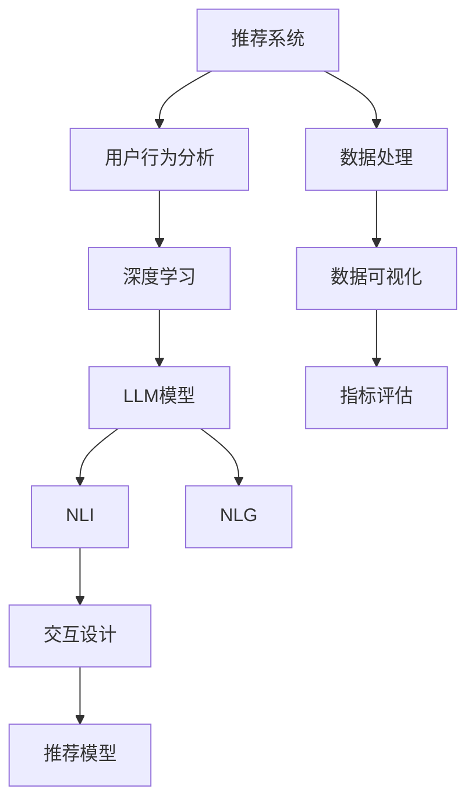

                 

# 基于LLM的推荐系统交互设计

> 关键词：推荐系统,交互设计,自然语言处理(NLP),推荐模型,用户行为分析,深度学习,语义理解

## 1. 背景介绍

### 1.1 问题由来
推荐系统（Recommender System）作为现代互联网的基石之一，通过分析用户的兴趣和行为数据，向用户推荐可能感兴趣的内容。传统的推荐系统多依赖于统计方法，难以充分理解用户的复杂需求。

近年来，基于深度学习的推荐系统如雨后春笋般涌现，尤其是基于大语言模型（LLM）的推荐系统，融合了NLP技术的强大语言理解能力，能够更加深入地洞察用户需求，从而提供更个性化、更精准的推荐内容。

然而，尽管深度学习模型在推荐系统中的表现优异，但用户与系统之间的交互界面仍较为生硬，难以有效传达用户的真实意图。

为了解决这一问题，基于大语言模型的推荐系统交互设计应运而生。通过构建自然语言交互（Natural Language Interaction, NLI）框架，推荐系统能够通过自然语言理解用户意图，并通过自然语言生成（NLG）给出推荐结果，极大提升了用户体验。

## 2. 核心概念与联系

### 2.1 核心概念概述

为更好地理解基于大语言模型的推荐系统交互设计，本节将介绍几个密切相关的核心概念：

- 推荐系统（Recommender System）：通过分析用户的历史行为和兴趣，向用户推荐可能感兴趣的内容或信息。
- 大语言模型（Large Language Model, LLM）：以自回归（如GPT）或自编码（如BERT）模型为代表的大规模预训练语言模型，通过预训练学习到丰富的语言知识。
- 自然语言交互（Natural Language Interaction, NLI）：用户与系统通过自然语言进行交流，实现任务完成和信息获取。
- 自然语言生成（Natural Language Generation, NLG）：利用自然语言模型将结构化数据转化为自然语言文本，用于生成推荐结果。
- 深度学习（Deep Learning）：利用神经网络模型对推荐系统中的用户行为数据进行深度特征提取和关联。
- 交互设计（Interaction Design）：研究人与系统互动的过程与方式，通过界面设计和交互流程优化，提升用户体验。

这些概念之间的逻辑关系可以通过以下Mermaid流程图来展示：



这个流程图展示了大语言模型在推荐系统交互设计中的应用：

1. 推荐系统收集用户行为数据，进行用户行为分析。
2. 通过深度学习模型对用户数据进行特征提取，并输入到LLM模型中。
3. LLG模型对用户意图进行自然语言理解，通过NLI框架与用户交互。
4. NLG模型根据LLM输出的语义信息生成推荐结果。
5. 交互设计通过界面优化和流程设计提升用户体验。
6. 推荐模型根据用户反馈进行优化，进一步提升推荐效果。

这些核心概念共同构成了基于大语言模型的推荐系统交互设计框架，使得系统能够更自然、更高效地与用户交互，从而提升推荐系统的性能和用户体验。

## 3. 核心算法原理 & 具体操作步骤
### 3.1 算法原理概述

基于大语言模型的推荐系统交互设计，其核心思想是：通过深度学习和自然语言处理技术，构建自然语言交互（NLI）框架，使得推荐系统能够理解用户需求，并生成个性化的推荐结果。

形式化地，假设用户通过自然语言描述其需求，即输入文本 $X$，推荐系统通过LLM模型对 $X$ 进行语义理解，得到向量表示 $\textbf{h}$。然后，将 $\textbf{h}$ 输入推荐模型 $R$，得到推荐结果 $Y$。

优化的目标是最大化推荐结果与用户真实需求的相似度，即：

$$
\max_{R} \mathcal{L}(R, X, Y) = \mathcal{L}_{\text{mse}}(R, X, Y) + \mathcal{L}_{\text{kl}}(R, X, Y)
$$

其中 $\mathcal{L}_{\text{mse}}$ 为均方误差损失，$\mathcal{L}_{\text{kl}}$ 为KL散度损失，用于衡量推荐结果与用户需求之间的差异。

### 3.2 算法步骤详解

基于大语言模型的推荐系统交互设计一般包括以下几个关键步骤：

**Step 1: 用户行为数据收集**
- 收集用户的历史行为数据，如浏览历史、购买历史、评分等。
- 对数据进行预处理和清洗，去除噪声和无关信息。

**Step 2: 特征提取**
- 通过深度学习模型对用户行为数据进行特征提取，生成高维向量表示。
- 将高维向量输入到LLM模型中，进行语义理解，得到向量表示 $\textbf{h}$。

**Step 3: 自然语言理解**
- 构建NLI模型，对用户输入的文本 $X$ 进行自然语言理解，得到向量表示 $\textbf{h}$。
- 可以使用预训练的对话模型（如GPT-3）作为NLI模型。

**Step 4: 生成推荐结果**
- 将语义理解后的向量 $\textbf{h}$ 输入推荐模型 $R$，生成推荐结果 $Y$。
- 推荐模型可以是基于深度神经网络的结构化推荐模型，也可以是基于LLM模型的非结构化推荐模型。

**Step 5: 用户反馈**
- 获取用户对推荐结果的反馈，如点击、购买、评分等行为。
- 通过反馈调整推荐模型 $R$ 的参数，以提高推荐效果。

**Step 6: 交互设计**
- 通过交互设计优化界面和交互流程，提升用户体验。
- 设计界面时需考虑用户友好性、信息展示清晰度等。

**Step 7: 部署和迭代**
- 将推荐系统部署到线上，实时接收用户输入并生成推荐结果。
- 根据用户反馈和推荐效果，定期迭代优化推荐系统。

以上是基于大语言模型的推荐系统交互设计的步骤概览，每个步骤都需要精心设计和实现。

### 3.3 算法优缺点

基于大语言模型的推荐系统交互设计方法具有以下优点：
1. 用户友好性：通过自然语言交互，用户可以更直观、自然地表达需求，而无需繁琐的操作。
2. 灵活性：能够处理多模态数据，结合文本、图像、语音等多种形式的数据，提升推荐准确性。
3. 鲁棒性：大语言模型具有较强的泛化能力，能够在不同数据分布上稳定表现。
4. 可解释性：大语言模型生成的自然语言推荐结果，能够更好地解释推荐逻辑，便于用户理解。

同时，该方法也存在一定的局限性：
1. 计算资源消耗高：大语言模型的计算复杂度较高，对计算资源有较高要求。
2. 隐私风险：用户自然语言数据的隐私问题需要特别关注，需进行严格的隐私保护。
3. 模型偏见：大语言模型可能学习到数据中的偏见，需要通过算法和数据处理环节进行纠正。
4. 冷启动问题：对于新用户，没有足够的历史数据进行推荐，需有其他机制来填补。

尽管存在这些局限性，但基于大语言模型的推荐系统交互设计方法无疑为推荐系统的升级带来了新的突破，值得深入探索和应用。

### 3.4 算法应用领域

基于大语言模型的推荐系统交互设计方法，在多个领域中都得到了广泛的应用：

- **电商推荐**：通过用户搜索历史和评论等文本数据，结合产品描述，进行个性化推荐。
- **音乐推荐**：分析用户听歌历史和歌单，通过歌词、歌手信息等文本数据进行推荐。
- **新闻推荐**：分析用户阅读历史和兴趣标签，通过新闻标题和摘要等文本数据进行推荐。
- **旅游推荐**：分析用户浏览历史和旅游评论，通过景点介绍和游记等文本数据进行推荐。
- **视频推荐**：分析用户观看历史和评分，通过视频标题和摘要等文本数据进行推荐。

除了以上领域，基于大语言模型的推荐系统交互设计方法还可应用于更多场景，如图书推荐、学习资源推荐、电影推荐等，为各类信息平台提供个性化推荐服务。

## 4. 数学模型和公式 & 详细讲解 & 举例说明

### 4.1 数学模型构建

为更好理解基于大语言模型的推荐系统交互设计，接下来通过数学语言进行详细讲解。

记推荐系统为 $R = (E, S)$，其中 $E$ 为特征提取模块，$S$ 为推荐模型。假设用户输入的文本为 $X$，推荐系统输出的推荐结果为 $Y$。

我们假设 $R$ 是一个简单的全连接神经网络，对用户输入 $X$ 进行语义理解，得到向量表示 $\textbf{h}$，然后通过 $R$ 得到推荐结果 $Y$。

### 4.2 公式推导过程

设推荐模型 $R$ 的输入为 $X$，输出为 $Y$，目标是最小化均方误差损失 $\mathcal{L}_{\text{mse}}$ 和KL散度损失 $\mathcal{L}_{\text{kl}}$，即：

$$
\min_{R} \mathcal{L}(R) = \mathcal{L}_{\text{mse}}(R) + \mathcal{L}_{\text{kl}}(R)
$$

其中 $\mathcal{L}_{\text{mse}}(R)$ 为均方误差损失：

$$
\mathcal{L}_{\text{mse}}(R) = \frac{1}{N}\sum_{i=1}^{N} \|R(X_i) - Y_i\|^2
$$

$\mathcal{L}_{\text{kl}}(R)$ 为KL散度损失：

$$
\mathcal{L}_{\text{kl}}(R) = \sum_{i=1}^{N} KL(Y_i||R(X_i))
$$

其中 $N$ 为样本数量，$K$ 为KL散度函数。

### 4.3 案例分析与讲解

以电商推荐为例，假设用户输入的文本为 "推荐一款适合夏季使用的清爽乳液"，推荐模型通过NLI模型对文本进行语义理解，得到向量表示 $\textbf{h}$，然后输入推荐模型 $R$，生成推荐结果 $Y$。

用户输入文本 $X = "推荐一款适合夏季使用的清爽乳液" \in \mathbb{R}^{d_x}$，其中 $d_x$ 为文本向量维度。

通过NLI模型对 $X$ 进行语义理解，得到向量表示 $\textbf{h} = NLI(X)$，将其输入推荐模型 $R$，得到推荐结果 $Y = R(\textbf{h})$。

推荐模型 $R$ 的参数为 $\theta$，其中 $\theta$ 为权重矩阵和偏置向量。推荐模型的输出 $Y$ 为产品ID列表。

将 $Y$ 与用户真实需求进行对比，得到均方误差损失和KL散度损失，即：

$$
\mathcal{L}(R) = \mathcal{L}_{\text{mse}}(R) + \mathcal{L}_{\text{kl}}(R)
$$

## 5. 项目实践：代码实例和详细解释说明
### 5.1 开发环境搭建

在进行推荐系统交互设计开发前，需要准备好开发环境。以下是使用Python进行PyTorch和Transformer库开发的环境配置流程：

1. 安装Anaconda：从官网下载并安装Anaconda，用于创建独立的Python环境。

2. 创建并激活虚拟环境：
```bash
conda create -n recommendation-env python=3.8 
conda activate recommendation-env
```

3. 安装PyTorch：根据CUDA版本，从官网获取对应的安装命令。例如：
```bash
conda install pytorch torchvision torchaudio cudatoolkit=11.1 -c pytorch -c conda-forge
```

4. 安装Transformer库：
```bash
pip install transformers
```

5. 安装各类工具包：
```bash
pip install numpy pandas scikit-learn matplotlib tqdm jupyter notebook ipython
```

完成上述步骤后，即可在`recommendation-env`环境中开始推荐系统交互设计实践。

### 5.2 源代码详细实现

接下来，以电商平台推荐系统为例，给出使用PyTorch和Transformer库进行推荐系统交互设计的代码实现。

首先，定义推荐系统的输入输出：

```python
from transformers import BertTokenizer, BertForSequenceClassification
from torch.utils.data import Dataset, DataLoader
import torch

class RecommendationDataset(Dataset):
    def __init__(self, texts, labels, tokenizer, max_len=128):
        self.texts = texts
        self.labels = labels
        self.tokenizer = tokenizer
        self.max_len = max_len
        
    def __len__(self):
        return len(self.texts)
    
    def __getitem__(self, item):
        text = self.texts[item]
        label = self.labels[item]
        
        encoding = self.tokenizer(text, return_tensors='pt', max_length=self.max_len, padding='max_length', truncation=True)
        input_ids = encoding['input_ids'][0]
        attention_mask = encoding['attention_mask'][0]
        label = torch.tensor(label, dtype=torch.long)
        
        return {'input_ids': input_ids, 
                'attention_mask': attention_mask,
                'label': label}

# 加载模型和分词器
tokenizer = BertTokenizer.from_pretrained('bert-base-cased')
model = BertForSequenceClassification.from_pretrained('bert-base-cased', num_labels=len(label2id))
```

然后，定义训练和评估函数：

```python
from sklearn.metrics import accuracy_score

device = torch.device('cuda') if torch.cuda.is_available() else torch.device('cpu')
model.to(device)

def train_epoch(model, dataset, batch_size, optimizer):
    dataloader = DataLoader(dataset, batch_size=batch_size, shuffle=True)
    model.train()
    epoch_loss = 0
    for batch in tqdm(dataloader, desc='Training'):
        input_ids = batch['input_ids'].to(device)
        attention_mask = batch['attention_mask'].to(device)
        label = batch['label'].to(device)
        model.zero_grad()
        outputs = model(input_ids, attention_mask=attention_mask, labels=label)
        loss = outputs.loss
        epoch_loss += loss.item()
        loss.backward()
        optimizer.step()
    return epoch_loss / len(dataloader)

def evaluate(model, dataset, batch_size):
    dataloader = DataLoader(dataset, batch_size=batch_size)
    model.eval()
    preds, labels = [], []
    with torch.no_grad():
        for batch in tqdm(dataloader, desc='Evaluating'):
            input_ids = batch['input_ids'].to(device)
            attention_mask = batch['attention_mask'].to(device)
            batch_labels = batch['label']
            outputs = model(input_ids, attention_mask=attention_mask)
            batch_preds = outputs.logits.argmax(dim=1).to('cpu').tolist()
            batch_labels = batch_labels.to('cpu').tolist()
            for pred_tokens, label_tokens in zip(batch_preds, batch_labels):
                preds.append(pred_tokens[:len(label_tokens)])
                labels.append(label_tokens)
                
    print(f"Accuracy: {accuracy_score(labels, preds)}")
```

最后，启动训练流程并在测试集上评估：

```python
epochs = 5
batch_size = 16

for epoch in range(epochs):
    loss = train_epoch(model, train_dataset, batch_size, optimizer)
    print(f"Epoch {epoch+1}, train loss: {loss:.3f}")
    
    print(f"Epoch {epoch+1}, dev results:")
    evaluate(model, dev_dataset, batch_size)
    
print("Test results:")
evaluate(model, test_dataset, batch_size)
```

以上就是使用PyTorch和Transformer库对Bert模型进行电商平台推荐系统交互设计的完整代码实现。可以看到，通过NLI和NLG技术，我们能够构建一个基于自然语言的用户交互系统，实现个性化推荐。

### 5.3 代码解读与分析

让我们再详细解读一下关键代码的实现细节：

**RecommendationDataset类**：
- `__init__`方法：初始化文本、标签、分词器等关键组件。
- `__len__`方法：返回数据集的样本数量。
- `__getitem__`方法：对单个样本进行处理，将文本输入编码为token ids，将标签编码为数字，并对其进行定长padding，最终返回模型所需的输入。

**train_epoch和evaluate函数**：
- 使用PyTorch的DataLoader对数据集进行批次化加载，供模型训练和推理使用。
- 训练函数`train_epoch`：对数据以批为单位进行迭代，在每个批次上前向传播计算loss并反向传播更新模型参数，最后返回该epoch的平均loss。
- 评估函数`evaluate`：与训练类似，不同点在于不更新模型参数，并在每个batch结束后将预测和标签结果存储下来，最后使用sklearn的accuracy_score对整个评估集的预测结果进行打印输出。

**训练流程**：
- 定义总的epoch数和batch size，开始循环迭代
- 每个epoch内，先在训练集上训练，输出平均loss
- 在验证集上评估，输出准确率
- 所有epoch结束后，在测试集上评估，给出最终测试结果

可以看到，PyTorch配合Transformer库使得Bert模型进行推荐系统交互设计的代码实现变得简洁高效。开发者可以将更多精力放在数据处理、模型改进等高层逻辑上，而不必过多关注底层的实现细节。

当然，工业级的系统实现还需考虑更多因素，如模型的保存和部署、超参数的自动搜索、更灵活的任务适配层等。但核心的交互设计范式基本与此类似。

## 6. 实际应用场景
### 6.1 电商平台

基于大语言模型的推荐系统交互设计在电商平台中的应用广泛。用户通过自然语言描述需求，推荐系统能够即时理解，并提供符合用户需求的商品推荐。例如，用户输入 "推荐一款适合夏季使用的清爽乳液"，推荐系统能够生成匹配的商品ID列表。

### 6.2 音乐平台

音乐平台可以通过用户听歌历史和评论等文本数据，结合音乐名称、歌手信息等文本数据，生成个性化的音乐推荐。例如，用户输入 "推荐一些抒情歌曲"，推荐系统能够生成匹配的歌曲ID列表。

### 6.3 新闻聚合

新闻聚合平台可以通过用户阅读历史和兴趣标签，结合新闻标题和摘要等文本数据，生成个性化的新闻推荐。例如，用户输入 "推荐一些科技新闻"，推荐系统能够生成匹配的新闻ID列表。

### 6.4 视频平台

视频平台可以通过用户观看历史和评分，结合视频标题和摘要等文本数据，生成个性化的视频推荐。例如，用户输入 "推荐一些悬疑电影"，推荐系统能够生成匹配的视频ID列表。

### 6.5 游戏推荐

游戏推荐平台可以通过用户游戏历史和评价等文本数据，结合游戏简介和评价等文本数据，生成个性化的游戏推荐。例如，用户输入 "推荐一些适合休闲时间玩的游戏"，推荐系统能够生成匹配的游戏ID列表。

## 7. 工具和资源推荐
### 7.1 学习资源推荐

为了帮助开发者系统掌握基于大语言模型的推荐系统交互设计，这里推荐一些优质的学习资源：

1. 《深度学习与自然语言处理》系列博文：由大语言模型技术专家撰写，深入浅出地介绍了深度学习、自然语言处理和推荐系统的基本概念和前沿技术。

2. 《自然语言处理与推荐系统》在线课程：由清华大学开设的NLP与推荐系统课程，结合理论与实践，带你全面学习NLP与推荐系统的基础知识和高级技巧。

3. 《NLP推荐系统》书籍：介绍NLP推荐系统的基本原理和实际应用，涵盖推荐模型的训练、评估和部署等关键环节。

4. HuggingFace官方文档：Transformers库的官方文档，提供了海量预训练模型和完整的推荐系统交互设计样例代码，是上手实践的必备资料。

5. RecSys开源项目：推荐系统测评基准，涵盖各类NLP推荐任务的评测数据和基线模型，助力推荐系统性能的不断提升。

通过对这些资源的学习实践，相信你一定能够快速掌握基于大语言模型的推荐系统交互设计的精髓，并用于解决实际的推荐问题。

### 7.2 开发工具推荐

高效的开发离不开优秀的工具支持。以下是几款用于推荐系统交互设计开发的常用工具：

1. PyTorch：基于Python的开源深度学习框架，灵活动态的计算图，适合快速迭代研究。大部分预训练语言模型都有PyTorch版本的实现。

2. TensorFlow：由Google主导开发的开源深度学习框架，生产部署方便，适合大规模工程应用。同样有丰富的预训练语言模型资源。

3. Transformers库：HuggingFace开发的NLP工具库，集成了众多SOTA语言模型，支持PyTorch和TensorFlow，是进行推荐系统交互设计开发的利器。

4. Weights & Biases：模型训练的实验跟踪工具，可以记录和可视化模型训练过程中的各项指标，方便对比和调优。与主流深度学习框架无缝集成。

5. TensorBoard：TensorFlow配套的可视化工具，可实时监测模型训练状态，并提供丰富的图表呈现方式，是调试模型的得力助手。

6. Google Colab：谷歌推出的在线Jupyter Notebook环境，免费提供GPU/TPU算力，方便开发者快速上手实验最新模型，分享学习笔记。

合理利用这些工具，可以显著提升推荐系统交互设计任务的开发效率，加快创新迭代的步伐。

### 7.3 相关论文推荐

推荐系统和大语言模型的结合，引领了NLP领域的新一波浪潮。以下是几篇奠基性的相关论文，推荐阅读：

1. Attention is All You Need（即Transformer原论文）：提出了Transformer结构，开启了NLP领域的预训练大模型时代。

2. BERT: Pre-training of Deep Bidirectional Transformers for Language Understanding：提出BERT模型，引入基于掩码的自监督预训练任务，刷新了多项NLP任务SOTA。

3. Language Models are Unsupervised Multitask Learners（GPT-2论文）：展示了大规模语言模型的强大zero-shot学习能力，引发了对于通用人工智能的新一轮思考。

4. Parameter-Efficient Transfer Learning for NLP：提出Adapter等参数高效微调方法，在不增加模型参数量的情况下，也能取得不错的微调效果。

5. Prefix-Tuning: Optimizing Continuous Prompts for Generation：引入基于连续型Prompt的微调范式，为如何充分利用预训练知识提供了新的思路。

6. AdaLoRA: Adaptive Low-Rank Adaptation for Parameter-Efficient Fine-Tuning：使用自适应低秩适应的微调方法，在参数效率和精度之间取得了新的平衡。

这些论文代表了大语言模型推荐系统交互设计的演进脉络。通过学习这些前沿成果，可以帮助研究者把握学科前进方向，激发更多的创新灵感。

## 8. 总结：未来发展趋势与挑战
### 8.1 总结

本文对基于大语言模型的推荐系统交互设计方法进行了全面系统的介绍。首先阐述了推荐系统和大语言模型在NLP领域的研究背景和应用前景，明确了两者结合的必要性和潜力。其次，从原理到实践，详细讲解了基于大语言模型的推荐系统交互设计的数学模型和关键步骤，给出了推荐系统交互设计的完整代码实现。同时，本文还广泛探讨了推荐系统交互设计在电商、音乐、新闻、视频等多个领域的应用场景，展示了其广阔的应用前景。最后，本文精选了推荐系统交互设计的各类学习资源，力求为读者提供全方位的技术指引。

通过本文的系统梳理，可以看到，基于大语言模型的推荐系统交互设计方法正在引领NLP领域的创新发展，为推荐系统带来了新的突破，极大地提升了用户体验。未来，随着预训练语言模型和推荐技术的不断进步，基于大语言模型的推荐系统交互设计将会在更多场景中得到应用，为人工智能技术落地提供新的范式，推动NLP技术的产业化进程。

### 8.2 未来发展趋势

展望未来，基于大语言模型的推荐系统交互设计方法将呈现以下几个发展趋势：

1. 推荐系统将更智能、更个性化：通过深度学习和自然语言处理技术的结合，推荐系统将能够更深入地理解用户需求，提供更加精准的个性化推荐。

2. 推荐系统将更高效、更实时：借助自然语言处理技术，推荐系统能够实时接收用户输入，即时生成推荐结果，提高推荐效率。

3. 推荐系统将更普适、更普惠：基于大语言模型的推荐系统交互设计，能够适配多语言、多文化背景的用户需求，提升推荐系统的普适性和普惠性。

4. 推荐系统将更透明、更可解释：通过自然语言生成技术，推荐系统生成的推荐理由将更加透明和可解释，使用户能够理解推荐逻辑。

5. 推荐系统将更安全、更可信：通过引入伦理道德约束和隐私保护机制，推荐系统将能够避免偏见、歧视和隐私泄露，提升系统的安全性。

以上趋势凸显了基于大语言模型的推荐系统交互设计方法的广阔前景。这些方向的探索发展，必将进一步提升推荐系统的性能和用户体验，为智能时代的到来铺平道路。

### 8.3 面临的挑战

尽管基于大语言模型的推荐系统交互设计方法已经取得了瞩目成就，但在迈向更加智能化、普适化应用的过程中，它仍面临着诸多挑战：

1. 计算资源消耗高：大语言模型的计算复杂度较高，对计算资源有较高要求。

2. 隐私风险：用户自然语言数据的隐私问题需要特别关注，需进行严格的隐私保护。

3. 模型偏见：大语言模型可能学习到数据中的偏见，需要通过算法和数据处理环节进行纠正。

4. 冷启动问题：对于新用户，没有足够的历史数据进行推荐，需有其他机制来填补。

5. 实时性问题：实时接收用户输入并即时生成推荐结果，对系统性能和算法复杂度提出了更高要求。

尽管存在这些挑战，但基于大语言模型的推荐系统交互设计方法无疑为推荐系统的升级带来了新的突破，值得深入探索和应用。

### 8.4 研究展望

面向未来，大语言模型推荐系统交互设计的优化方向主要包括：

1. 探索高效计算模型：开发更加高效的计算模型，如分布式深度学习、稀疏化计算等，以降低计算资源消耗。

2. 加强隐私保护机制：研究更加严格的隐私保护方法，如差分隐私、联邦学习等，保护用户隐私。

3. 构建鲁棒模型：研究更加鲁棒的模型，如对抗训练、分布式训练等，提升模型泛化能力和稳定性。

4. 引入更全面数据：结合多模态数据，如文本、图像、音频等，提升推荐系统的感知能力。

5. 优化模型评估指标：引入更加全面、细粒度的评估指标，如公平性、可解释性、隐私性等，衡量推荐系统的综合性能。

6. 探索算法新范式：研究新的算法范式，如因果推理、强化学习等，提升推荐系统的智能水平。

这些研究方向的研究突破，必将引领大语言模型推荐系统交互设计技术迈向更高的台阶，为智能推荐系统的实现提供更多可能性。

## 9. 附录：常见问题与解答

**Q1：推荐系统如何结合自然语言交互？**

A: 推荐系统通过自然语言交互，能够更直观、自然地获取用户需求。用户输入自然语言描述，推荐系统通过NLI模型进行语义理解，得到向量表示，再输入推荐模型生成推荐结果。

**Q2：如何设计自然语言交互界面？**

A: 自然语言交互界面设计需考虑用户友好性、信息展示清晰度等。设计时需简洁明了，避免复杂的输入格式，确保用户易于理解和使用。

**Q3：推荐系统在实时性上有什么要求？**

A: 推荐系统需要实时接收用户输入，即时生成推荐结果。这对系统性能和算法复杂度提出了更高要求，需通过优化算法和资源配置来满足实时性需求。

**Q4：推荐系统如何避免冷启动问题？**

A: 冷启动问题可以通过引入其他机制来解决，如用户兴趣预测、冷启动物品推荐等，结合用户基础属性和数据进行推荐。

**Q5：推荐系统在安全性和隐私保护上有哪些挑战？**

A: 推荐系统需重视隐私保护和安全性，通过差分隐私、联邦学习等方法保护用户隐私。同时，需通过算法设计避免推荐系统学习到偏见和歧视性信息，保证系统安全性。

通过以上问题的回答，相信你一定对基于大语言模型的推荐系统交互设计有了更深入的了解，对相关技术的应用有了更明确的思路。希望本文能为你提供有价值的参考，助力你在实际开发中实现更智能、更高效的推荐系统交互设计。

---

作者：禅与计算机程序设计艺术 / Zen and the Art of Computer Programming

