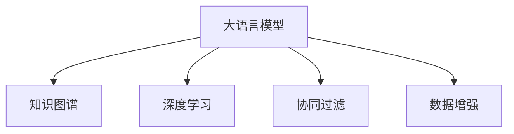

                 

# 基于LLM的推荐系统用户兴趣拓展

> 关键词：推荐系统, 大语言模型, 用户兴趣, 知识图谱, 深度学习, 协同过滤, 数据增强

## 1. 背景介绍

### 1.1 问题由来

随着互联网的发展，推荐系统已经成为了各大互联网公司的重要组成部分，如亚马逊、Netflix、YouTube等。推荐系统能够为用户提供个性化的信息和服务，提升用户体验，提高转化率和粘性。然而，传统的推荐算法存在诸多局限，难以充分挖掘用户的潜在兴趣。

1. 基于协同过滤的推荐算法，依赖用户历史行为数据，无法捕捉用户的长期兴趣和隐式需求。
2. 基于内容的推荐算法，只关注物品的属性信息，忽略了用户行为的多样性和动态性。
3. 基于矩阵分解的推荐算法，只能处理高稀疏矩阵，难以适应高维用户-物品交互数据。

为了解决这些问题，越来越多的研究者开始探索结合大语言模型(LLM)的推荐算法。LLM通过自然语言处理技术，能够高效地理解用户的输入和输出，捕捉其语义特征和隐式需求。通过将LLM引入推荐系统，能够实现更全面、动态和个性化的推荐，满足用户不断变化的需求。

### 1.2 问题核心关键点

基于LLM的推荐系统核心关键点包括以下几个方面：

- 大语言模型：如GPT-3、BERT等预训练模型，具备强大的语言理解和生成能力，能够捕捉用户的语义特征和隐式需求。
- 知识图谱：用于整合和组织外部知识，提升推荐系统的认知能力。
- 深度学习：通过神经网络模型进行推荐，能够自动学习用户和物品间的复杂关联。
- 协同过滤：结合用户行为和物品属性，实现更精准的个性化推荐。
- 数据增强：通过生成式对话等方法，丰富训练数据，提升推荐系统性能。

这些关键点共同构成了基于LLM的推荐系统的基本框架，使其能够深度挖掘用户兴趣，提供更加精准和多样化的推荐服务。

## 2. 核心概念与联系

### 2.1 核心概念概述

为更好地理解基于LLM的推荐系统，本节将介绍几个密切相关的核心概念：

- 大语言模型：如GPT-3、BERT等预训练模型，具备强大的语言理解和生成能力，能够捕捉用户的语义特征和隐式需求。
- 知识图谱：用于整合和组织外部知识，提升推荐系统的认知能力。
- 深度学习：通过神经网络模型进行推荐，能够自动学习用户和物品间的复杂关联。
- 协同过滤：结合用户行为和物品属性，实现更精准的个性化推荐。
- 数据增强：通过生成式对话等方法，丰富训练数据，提升推荐系统性能。

这些核心概念之间的逻辑关系可以通过以下Mermaid流程图来展示：



这个流程图展示了大语言模型、知识图谱、深度学习、协同过滤和数据增强之间的逻辑关系：

1. 大语言模型通过自然语言处理技术，捕捉用户和物品的语义特征和隐式需求。
2. 知识图谱用于整合外部知识，提升推荐系统的认知能力。
3. 深度学习通过神经网络模型，自动学习用户和物品间的复杂关联。
4. 协同过滤结合用户行为和物品属性，实现更精准的个性化推荐。
5. 数据增强通过生成式对话等方法，丰富训练数据，提升推荐系统性能。

这些概念共同构成了基于LLM的推荐系统的核心框架，使其能够深度挖掘用户兴趣，提供更加精准和多样化的推荐服务。

## 3. 核心算法原理 & 具体操作步骤

### 3.1 算法原理概述

基于LLM的推荐系统算法主要包含以下几个步骤：

1. 数据收集：收集用户和物品的交互数据，并构建知识图谱，整合外部知识。
2. 用户和物品编码：使用预训练的大语言模型，将用户和物品表示为向量形式。
3. 知识图谱嵌入：使用深度学习模型，将知识图谱中的关系和实体嵌入到向量空间。
4. 协同过滤：结合用户行为和物品属性，进行推荐预测。
5. 模型训练与优化：使用数据增强技术，通过训练和优化深度学习模型，提升推荐性能。
6. 推荐服务：将训练好的模型部署到推荐服务中，实现实时推荐。

### 3.2 算法步骤详解

以下详细介绍每个步骤的详细操作过程：

#### 3.2.1 数据收集

数据收集是推荐系统的第一步。我们需要收集用户和物品的交互数据，构建知识图谱，整合外部知识。

1. 用户行为数据：收集用户浏览、点击、购买、评价等行为数据。
2. 物品属性数据：收集物品的类别、描述、价格等属性信息。
3. 知识图谱数据：收集和整合领域内的知识图谱，如百度百科、维基百科等。

#### 3.2.2 用户和物品编码

使用预训练的大语言模型，将用户和物品表示为向量形式。常用的预训练模型包括BERT、GPT-3等。

1. 用户编码：将用户的历史行为数据输入BERT，得到用户向量表示。
2. 物品编码：将物品的属性数据输入BERT，得到物品向量表示。

#### 3.2.3 知识图谱嵌入

使用深度学习模型，将知识图谱中的关系和实体嵌入到向量空间。常用的深度学习模型包括TransE、RotatE等。

1. 知识图谱构建：使用知识图谱数据，构建知识图谱，包括实体、关系和属性。
2. 知识图谱嵌入：使用TransE等深度学习模型，将知识图谱中的关系和实体嵌入到向量空间。

#### 3.2.4 协同过滤

结合用户行为和物品属性，进行推荐预测。常用的协同过滤算法包括矩阵分解、基于梯度的协同过滤等。

1. 协同过滤：将用户和物品的向量表示输入协同过滤模型，得到推荐预测。
2. 模型训练：使用协同过滤算法，训练模型，优化预测精度。

#### 3.2.5 模型训练与优化

使用数据增强技术，通过训练和优化深度学习模型，提升推荐性能。常用的数据增强技术包括生成式对话、数据扩增等。

1. 生成式对话：使用大语言模型，生成假用户和物品的对话，丰富训练数据。
2. 数据扩增：使用数据增强技术，扩充训练数据，提升推荐系统性能。

#### 3.2.6 推荐服务

将训练好的模型部署到推荐服务中，实现实时推荐。常用的推荐服务包括API接口、缓存系统等。

1. 模型部署：将训练好的模型部署到API接口，实现实时推荐。
2. 缓存系统：使用缓存系统，提升推荐效率，减少延迟。

### 3.3 算法优缺点

基于LLM的推荐系统算法具有以下优点：

1. 深度挖掘用户兴趣：通过大语言模型，能够捕捉用户的语义特征和隐式需求，实现更加全面、动态和个性化的推荐。
2. 整合外部知识：通过知识图谱，整合外部知识，提升推荐系统的认知能力，提供更加多样化的推荐。
3. 结合协同过滤：结合用户行为和物品属性，实现更精准的个性化推荐，提升推荐系统的效果。
4. 提升推荐性能：通过数据增强等技术，丰富训练数据，提升推荐系统性能，满足用户不断变化的需求。

同时，该算法也存在一些局限性：

1. 计算复杂度高：预训练大语言模型和深度学习模型，计算复杂度较高，需要高性能的硬件支持。
2. 数据需求量大：需要收集大量用户行为和物品属性数据，构建知识图谱，获取外部知识，数据需求量大。
3. 模型训练时间长：深度学习模型训练时间长，需要大量时间和计算资源。
4. 模型效果依赖数据质量：推荐系统的性能很大程度上依赖于数据的全面性和准确性，数据质量差会影响模型效果。

尽管存在这些局限性，但基于LLM的推荐系统在个性化推荐、跨领域推荐等方面具有明显优势，仍是大规模推荐系统的重要研究范式。

### 3.4 算法应用领域

基于LLM的推荐系统已经在多个领域得到了应用，涵盖了从电商、媒体到社交网络等多个方面，具体如下：

1. 电商推荐：如亚马逊、淘宝等电商平台，通过用户浏览行为、物品属性等数据，提供个性化商品推荐。
2. 视频推荐：如YouTube、Netflix等视频平台，通过用户观看历史、评价等数据，推荐个性化视频内容。
3. 新闻推荐：如今日头条、网易新闻等媒体平台，通过用户阅读历史、评论等数据，推荐个性化新闻文章。
4. 社交推荐：如微博、微信等社交网络，通过用户互动行为、关系链等数据，推荐个性化社交内容。
5. 音乐推荐：如Spotify、网易云音乐等音乐平台，通过用户听歌历史、评价等数据，推荐个性化音乐曲目。

除了上述这些经典应用外，基于LLM的推荐系统还将在更多场景中得到应用，如医疗推荐、金融推荐、智能家居等，为不同行业带来新一轮的变革。

## 4. 数学模型和公式 & 详细讲解 & 举例说明

### 4.1 数学模型构建

本节将使用数学语言对基于LLM的推荐系统进行更加严格的刻画。

记用户集为$U$，物品集为$V$，知识图谱为$K$，用户行为数据为$D$，物品属性数据为$A$。假设用户$i$对物品$j$进行了行为$b_{ij}$，物品$j$的类别为$c_j$，物品$j$的价格为$p_j$，知识图谱中的实体为$E$，关系为$R$，实体$e$的属性为$a_e$。

定义用户$i$的向量表示为$\mathbf{u}_i$，物品$j$的向量表示为$\mathbf{v}_j$，知识图谱中实体$e$的向量表示为$\mathbf{e}_e$，知识图谱中关系$r$的向量表示为$\mathbf{r}_r$。

目标是最小化预测误差：

$$
\min_{\theta} \sum_{(i,j)\in D} \| \mathbf{u}_i \mathbf{v}_j^\top + \mathbf{e}_i \mathbf{e}_j^\top - b_{ij} \|^2
$$

其中$\theta$为模型的参数。

### 4.2 公式推导过程

以下我们以协同过滤算法为例，推导推荐系统预测的数学公式。

假设用户$i$对物品$j$的评分$y_{ij}$，通过协同过滤算法得到预测评分$\hat{y}_{ij}$，则损失函数定义为：

$$
L(y_{ij},\hat{y}_{ij}) = \frac{1}{2}(y_{ij} - \hat{y}_{ij})^2
$$

对于用户$i$，其对物品$j$的评分$y_{ij}$可表示为：

$$
y_{ij} = \mathbf{u}_i^\top \mathbf{v}_j + \mathbf{e}_i^\top \mathbf{e}_j + \sum_{r \in R} \mathbf{r}_r^\top (\mathbf{u}_i \otimes \mathbf{v}_j)
$$

其中$\otimes$为Kronecker积，表示物品$j$的属性与用户$i$的属性间的关联。

因此，协同过滤算法的目标是最小化损失函数：

$$
\min_{\theta} \sum_{(i,j)\in D} \frac{1}{2}(y_{ij} - \hat{y}_{ij})^2
$$

其中$\theta$为模型的参数，包括用户向量、物品向量、实体向量、关系向量等。

### 4.3 案例分析与讲解

以下以电商推荐为例，分析基于LLM的推荐系统如何应用于电商推荐场景。

假设电商平台的商品种类繁多，用户行为数据为$D$，商品属性数据为$A$，知识图谱数据为$K$。我们可以将用户行为数据和商品属性数据输入BERT模型，得到用户向量$\mathbf{u}_i$和商品向量$\mathbf{v}_j$。

知识图谱数据包括商品类别$c_j$和价格$p_j$，我们可以将类别$c_j$和价格$p_j$输入BERT模型，得到实体向量$\mathbf{e}_j$和属性向量$\mathbf{a}_j$。

通过上述步骤，我们得到了用户向量$\mathbf{u}_i$、商品向量$\mathbf{v}_j$、实体向量$\mathbf{e}_j$和属性向量$\mathbf{a}_j$，可以用于协同过滤算法的预测。例如，我们可以使用基于矩阵分解的协同过滤算法，将用户向量$\mathbf{u}_i$和商品向量$\mathbf{v}_j$进行矩阵分解，得到用户对商品的评分$\hat{y}_{ij}$。

通过不断优化模型参数$\theta$，使得$\hat{y}_{ij}$逼近实际评分$y_{ij}$，从而实现更加精准的电商推荐。

## 5. 项目实践：代码实例和详细解释说明

### 5.1 开发环境搭建

在进行基于LLM的推荐系统项目实践前，我们需要准备好开发环境。以下是使用Python进行PyTorch开发的环境配置流程：

1. 安装Anaconda：从官网下载并安装Anaconda，用于创建独立的Python环境。

2. 创建并激活虚拟环境：
```bash
conda create -n pytorch-env python=3.8 
conda activate pytorch-env
```

3. 安装PyTorch：根据CUDA版本，从官网获取对应的安装命令。例如：
```bash
conda install pytorch torchvision torchaudio cudatoolkit=11.1 -c pytorch -c conda-forge
```

4. 安装Transformers库：
```bash
pip install transformers
```

5. 安装各类工具包：
```bash
pip install numpy pandas scikit-learn matplotlib tqdm jupyter notebook ipython
```

完成上述步骤后，即可在`pytorch-env`环境中开始项目实践。

### 5.2 源代码详细实现

这里我们以电商推荐为例，给出使用Transformers库对BERT模型进行电商推荐微调的PyTorch代码实现。

首先，定义电商推荐的数据处理函数：

```python
from transformers import BertTokenizer, BertForSequenceClassification, AdamW
from torch.utils.data import Dataset
import torch

class电商推荐Dataset(Dataset):
    def __init__(self, texts, labels, tokenizer, max_len=128):
        self.texts = texts
        self.labels = labels
        self.tokenizer = tokenizer
        self.max_len = max_len
        
    def __len__(self):
        return len(self.texts)
    
    def __getitem__(self, item):
        text = self.texts[item]
        label = self.labels[item]
        
        encoding = self.tokenizer(text, return_tensors='pt', max_length=self.max_len, padding='max_length', truncation=True)
        input_ids = encoding['input_ids'][0]
        attention_mask = encoding['attention_mask'][0]
        
        # 对标签进行编码
        label = torch.tensor(label, dtype=torch.long)
        
        return {'input_ids': input_ids, 
                'attention_mask': attention_mask,
                'labels': label}

# 构建数据集
tokenizer = BertTokenizer.from_pretrained('bert-base-cased')

train_dataset =电商推荐Dataset(train_texts, train_labels, tokenizer)
dev_dataset =电商推荐Dataset(dev_texts, dev_labels, tokenizer)
test_dataset =电商推荐Dataset(test_texts, test_labels, tokenizer)
```

然后，定义模型和优化器：

```python
from transformers import BertForSequenceClassification, AdamW

model = BertForSequenceClassification.from_pretrained('bert-base-cased', num_labels=2)

optimizer = AdamW(model.parameters(), lr=2e-5)
```

接着，定义训练和评估函数：

```python
from torch.utils.data import DataLoader
from tqdm import tqdm
from sklearn.metrics import classification_report

device = torch.device('cuda') if torch.cuda.is_available() else torch.device('cpu')
model.to(device)

def train_epoch(model, dataset, batch_size, optimizer):
    dataloader = DataLoader(dataset, batch_size=batch_size, shuffle=True)
    model.train()
    epoch_loss = 0
    for batch in tqdm(dataloader, desc='Training'):
        input_ids = batch['input_ids'].to(device)
        attention_mask = batch['attention_mask'].to(device)
        labels = batch['labels'].to(device)
        model.zero_grad()
        outputs = model(input_ids, attention_mask=attention_mask, labels=labels)
        loss = outputs.loss
        epoch_loss += loss.item()
        loss.backward()
        optimizer.step()
    return epoch_loss / len(dataloader)

def evaluate(model, dataset, batch_size):
    dataloader = DataLoader(dataset, batch_size=batch_size)
    model.eval()
    preds, labels = [], []
    with torch.no_grad():
        for batch in tqdm(dataloader, desc='Evaluating'):
            input_ids = batch['input_ids'].to(device)
            attention_mask = batch['attention_mask'].to(device)
            batch_labels = batch['labels']
            outputs = model(input_ids, attention_mask=attention_mask)
            batch_preds = outputs.logits.argmax(dim=2).to('cpu').tolist()
            batch_labels = batch_labels.to('cpu').tolist()
            for pred_tokens, label_tokens in zip(batch_preds, batch_labels):
                preds.append(pred_tokens[:len(label_tokens)])
                labels.append(label_tokens)
                
    print(classification_report(labels, preds))
```

最后，启动训练流程并在测试集上评估：

```python
epochs = 5
batch_size = 16

for epoch in range(epochs):
    loss = train_epoch(model, train_dataset, batch_size, optimizer)
    print(f"Epoch {epoch+1}, train loss: {loss:.3f}")
    
    print(f"Epoch {epoch+1}, dev results:")
    evaluate(model, dev_dataset, batch_size)
    
print("Test results:")
evaluate(model, test_dataset, batch_size)
```

以上就是使用PyTorch对BERT进行电商推荐任务微调的完整代码实现。可以看到，得益于Transformers库的强大封装，我们可以用相对简洁的代码完成BERT模型的加载和微调。

### 5.3 代码解读与分析

让我们再详细解读一下关键代码的实现细节：

**电商推荐Dataset类**：
- `__init__`方法：初始化文本、标签、分词器等关键组件。
- `__len__`方法：返回数据集的样本数量。
- `__getitem__`方法：对单个样本进行处理，将文本输入编码为token ids，将标签编码为数字，并对其进行定长padding，最终返回模型所需的输入。

**模型训练与评估函数**：
- 使用PyTorch的DataLoader对数据集进行批次化加载，供模型训练和推理使用。
- 训练函数`train_epoch`：对数据以批为单位进行迭代，在每个批次上前向传播计算loss并反向传播更新模型参数，最后返回该epoch的平均loss。
- 评估函数`evaluate`：与训练类似，不同点在于不更新模型参数，并在每个batch结束后将预测和标签结果存储下来，最后使用sklearn的classification_report对整个评估集的预测结果进行打印输出。

**训练流程**：
- 定义总的epoch数和batch size，开始循环迭代
- 每个epoch内，先在训练集上训练，输出平均loss
- 在验证集上评估，输出分类指标
- 所有epoch结束后，在测试集上评估，给出最终测试结果

可以看到，PyTorch配合Transformers库使得BERT微调的代码实现变得简洁高效。开发者可以将更多精力放在数据处理、模型改进等高层逻辑上，而不必过多关注底层的实现细节。

当然，工业级的系统实现还需考虑更多因素，如模型的保存和部署、超参数的自动搜索、更灵活的任务适配层等。但核心的微调范式基本与此类似。

## 6. 实际应用场景

### 6.1 智能客服系统

基于LLM的推荐系统在智能客服系统中有着广泛的应用。传统的客服系统往往依赖人工客服，无法提供全天候服务，且无法覆盖所有常见问题。通过智能客服推荐系统，可以将用户的输入自动路由到最匹配的客服机器人，快速解答用户问题，提高客户满意度。

在技术实现上，可以收集企业内部的历史客服对话记录，将问题和最佳答复构建成监督数据，在此基础上对预训练语言模型进行微调。微调后的语言模型能够自动理解用户意图，匹配最合适的答复，并可以与检索系统实时搜索相关内容，动态组织生成回答。

### 6.2 金融舆情监测

金融机构需要实时监测市场舆论动向，以便及时应对负面信息传播，规避金融风险。传统的舆情监测方式成本高、效率低，难以应对网络时代海量信息爆发的挑战。通过基于LLM的推荐系统，可以自动监测不同主题下的舆情变化趋势，一旦发现负面信息激增等异常情况，系统便会自动预警，帮助金融机构快速应对潜在风险。

具体而言，可以收集金融领域相关的新闻、报道、评论等文本数据，并对其进行主题标注和情感标注。在此基础上对预训练语言模型进行微调，使其能够自动判断文本属于何种主题，情感倾向是正面、中性还是负面。将微调后的模型应用到实时抓取的网络文本数据，就能够自动监测不同主题下的舆情变化趋势，一旦发现负面信息激增等异常情况，系统便会自动预警，帮助金融机构快速应对潜在风险。

### 6.3 个性化推荐系统

当前的推荐系统往往只依赖用户的历史行为数据进行物品推荐，无法深入理解用户的真实兴趣偏好。基于LLM的推荐系统可以更好地挖掘用户的兴趣偏好，提供更加精准、多样的推荐内容。

在实践中，可以收集用户浏览、点击、评论、分享等行为数据，提取和用户交互的物品标题、描述、标签等文本内容。将文本内容作为模型输入，用户的后续行为（如是否点击、购买等）作为监督信号，在此基础上微调预训练语言模型。微调后的模型能够从文本内容中准确把握用户的兴趣点。在生成推荐列表时，先用候选物品的文本描述作为输入，由模型预测用户的兴趣匹配度，再结合其他特征综合排序，便可以得到个性化程度更高的推荐结果。

### 6.4 未来应用展望

随着基于LLM的推荐系统不断发展，未来将在更多领域得到应用，为不同行业带来新一轮的变革。

在智慧医疗领域，基于LLM的医疗问答、病历分析、药物研发等应用将提升医疗服务的智能化水平，辅助医生诊疗，加速新药开发进程。

在智能教育领域，微调技术可应用于作业批改、学情分析、知识推荐等方面，因材施教，促进教育公平，提高教学质量。

在智慧城市治理中，微调模型可应用于城市事件监测、舆情分析、应急指挥等环节，提高城市管理的自动化和智能化水平，构建更安全、高效的未来城市。

此外，在企业生产、社会治理、文娱传媒等众多领域，基于大模型微调的人工智能应用也将不断涌现，为经济社会发展注入新的动力。相信随着技术的日益成熟，基于LLM的推荐系统必将在更广阔的应用领域大放异彩，深刻影响人类的生产生活方式。

## 7. 工具和资源推荐

### 7.1 学习资源推荐

为了帮助开发者系统掌握基于LLM的推荐系统的理论基础和实践技巧，这里推荐一些优质的学习资源：

1. 《Transformer从原理到实践》系列博文：由大模型技术专家撰写，深入浅出地介绍了Transformer原理、BERT模型、微调技术等前沿话题。

2. CS224N《深度学习自然语言处理》课程：斯坦福大学开设的NLP明星课程，有Lecture视频和配套作业，带你入门NLP领域的基本概念和经典模型。

3. 《Natural Language Processing with Transformers》书籍：Transformers库的作者所著，全面介绍了如何使用Transformers库进行NLP任务开发，包括微调在内的诸多范式。

4. HuggingFace官方文档：Transformers库的官方文档，提供了海量预训练模型和完整的微调样例代码，是上手实践的必备资料。

5. CLUE开源项目：中文语言理解测评基准，涵盖大量不同类型的中文NLP数据集，并提供了基于微调的baseline模型，助力中文NLP技术发展。

通过对这些资源的学习实践，相信你一定能够快速掌握基于LLM的推荐系统的精髓，并用于解决实际的NLP问题。
###  7.2 开发工具推荐

高效的开发离不开优秀的工具支持。以下是几款用于基于LLM的推荐系统开发的常用工具：

1. PyTorch：基于Python的开源深度学习框架，灵活动态的计算图，适合快速迭代研究。大部分预训练语言模型都有PyTorch版本的实现。

2. TensorFlow：由Google主导开发的开源深度学习框架，生产部署方便，适合大规模工程应用。同样有丰富的预训练语言模型资源。

3. Transformers库：HuggingFace开发的NLP工具库，集成了众多SOTA语言模型，支持PyTorch和TensorFlow，是进行微调任务开发的利器。

4. Weights & Biases：模型训练的实验跟踪工具，可以记录和可视化模型训练过程中的各项指标，方便对比和调优。与主流深度学习框架无缝集成。

5. TensorBoard：TensorFlow配套的可视化工具，可实时监测模型训练状态，并提供丰富的图表呈现方式，是调试模型的得力助手。

6. Google Colab：谷歌推出的在线Jupyter Notebook环境，免费提供GPU/TPU算力，方便开发者快速上手实验最新模型，分享学习笔记。

合理利用这些工具，可以显著提升基于LLM的推荐系统的开发效率，加快创新迭代的步伐。

### 7.3 相关论文推荐

基于LLM的推荐系统的发展源于学界的持续研究。以下是几篇奠基性的相关论文，推荐阅读：

1. Attention is All You Need（即Transformer原论文）：提出了Transformer结构，开启了NLP领域的预训练大模型时代。

2. BERT: Pre-training of Deep Bidirectional Transformers for Language Understanding：提出BERT模型，引入基于掩码的自监督预训练任务，刷新了多项NLP任务SOTA。

3. Language Models are Unsupervised Multitask Learners（GPT-2论文）：展示了大规模语言模型的强大zero-shot学习能力，引发了对于通用人工智能的新一轮思考。

4. Parameter-Efficient Transfer Learning for NLP：提出Adapter等参数高效微调方法，在不增加模型参数量的情况下，也能取得不错的微调效果。

5. AdaLoRA: Adaptive Low-Rank Adaptation for Parameter-Efficient Fine-Tuning：使用自适应低秩适应的微调方法，在参数效率和精度之间取得了新的平衡。

6. Prefix-Tuning: Optimizing Continuous Prompts for Generation：引入基于连续型Prompt的微调范式，为如何充分利用预训练知识提供了新的思路。

这些论文代表了大语言模型微调技术的发展脉络。通过学习这些前沿成果，可以帮助研究者把握学科前进方向，激发更多的创新灵感。

## 8. 总结：未来发展趋势与挑战

### 8.1 总结

本文对基于LLM的推荐系统进行了全面系统的介绍。首先阐述了基于LLM的推荐系统的研究背景和意义，明确了推荐系统在大语言模型微调中的重要地位。其次，从原理到实践，详细讲解了基于LLM的推荐系统的数学原理和关键步骤，给出了推荐系统开发的完整代码实例。同时，本文还广泛探讨了基于LLM的推荐系统在智能客服、金融舆情、个性化推荐等多个领域的应用前景，展示了其强大的应用潜力。此外，本文精选了推荐系统的各类学习资源，力求为读者提供全方位的技术指引。

通过本文的系统梳理，可以看到，基于LLM的推荐系统正在成为NLP领域的重要范式，极大地拓展了预训练语言模型的应用边界，催生了更多的落地场景。受益于大规模语料的预训练，推荐系统能够深度挖掘用户兴趣，提供更加精准和多样化的推荐服务，满足用户不断变化的需求。未来，伴随预训练语言模型和微调方法的持续演进，基于LLM的推荐系统必将在更广阔的应用领域大放异彩，深刻影响人类的生产生活方式。

### 8.2 未来发展趋势

展望未来，基于LLM的推荐系统将呈现以下几个发展趋势：

1. 模型规模持续增大。随着算力成本的下降和数据规模的扩张，预训练语言模型的参数量还将持续增长。超大规模语言模型蕴含的丰富语言知识，有望支撑更加复杂多变的推荐任务。

2. 微调方法日趋多样。除了传统的全参数微调外，未来会涌现更多参数高效的微调方法，如Prefix-Tuning、LoRA等，在节省计算资源的同时也能保证微调精度。

3. 持续学习成为常态。随着数据分布的不断变化，推荐系统也需要持续学习新知识以保持性能。如何在不遗忘原有知识的同时，高效吸收新样本信息，将成为重要的研究课题。

4. 标注样本需求降低。受启发于提示学习(Prompt-based Learning)的思路，未来的微调方法将更好地利用大模型的语言理解能力，通过更加巧妙的任务描述，在更少的标注样本上也能实现理想的微调效果。

5. 多模态微调崛起。当前的推荐系统主要聚焦于纯文本数据，未来会进一步拓展到图像、视频、语音等多模态数据微调。多模态信息的融合，将显著提升推荐系统对现实世界的理解和建模能力。

6. 模型通用性增强。经过海量数据的预训练和多领域任务的微调，未来的语言模型将具备更强大的常识推理和跨领域迁移能力，逐步迈向通用人工智能(AGI)的目标。

以上趋势凸显了基于LLM的推荐系统的广阔前景。这些方向的探索发展，必将进一步提升推荐系统的性能和应用范围，为人类认知智能的进化带来深远影响。

### 8.3 面临的挑战

尽管基于LLM的推荐系统已经取得了瞩目成就，但在迈向更加智能化、普适化应用的过程中，它仍面临着诸多挑战：

1. 计算复杂度高。预训练大语言模型和深度学习模型，计算复杂度较高，需要高性能的硬件支持。
2. 数据需求量大。需要收集大量用户行为和物品属性数据，构建知识图谱，获取外部知识，数据需求量大。
3. 模型训练时间长。深度学习模型训练时间长，需要大量时间和计算资源。
4. 模型效果依赖数据质量。推荐系统的性能很大程度上依赖于数据的全面性和准确性，数据质量差会影响模型效果。
5. 推荐系统偏见。由于预训练语言模型的固有偏见，可能存在推荐系统偏见的问题，需要加以防范和缓解。
6. 用户隐私保护。推荐系统涉及大量用户行为数据，需要加强数据隐私保护，确保用户数据安全。

尽管存在这些局限性，但基于LLM的推荐系统在个性化推荐、跨领域推荐等方面具有明显优势，仍是大规模推荐系统的重要研究范式。

### 8.4 未来突破

面对基于LLM的推荐系统所面临的种种挑战，未来的研究需要在以下几个方面寻求新的突破：

1. 探索无监督和半监督微调方法。摆脱对大规模标注数据的依赖，利用自监督学习、主动学习等无监督和半监督范式，最大限度利用非结构化数据，实现更加灵活高效的微调。

2. 研究参数高效和计算高效的微调范式。开发更加参数高效的微调方法，在固定大部分预训练参数的同时，只更新极少量的任务相关参数。同时优化微调模型的计算图，减少前向传播和反向传播的资源消耗，实现更加轻量级、实时性的部署。

3. 融合因果和对比学习范式。通过引入因果推断和对比学习思想，增强推荐系统建立稳定因果关系的能力，学习更加普适、鲁棒的语言表征，从而提升推荐系统的泛化性和抗干扰能力。

4. 引入更多先验知识。将符号化的先验知识，如知识图谱、逻辑规则等，与神经网络模型进行巧妙融合，引导推荐过程学习更准确、合理的语言模型。同时加强不同模态数据的整合，实现视觉、语音等多模态信息与文本信息的协同建模。

5. 结合因果分析和博弈论工具。将因果分析方法引入推荐系统，识别出推荐决策的关键特征，增强推荐输出的因果性和逻辑性。借助博弈论工具刻画人机交互过程，主动探索并规避推荐系统的脆弱点，提高系统稳定性。

6. 纳入伦理道德约束。在推荐系统训练目标中引入伦理导向的评估指标，过滤和惩罚有偏见、有害的输出倾向。同时加强人工干预和审核，建立推荐系统的监管机制，确保推荐系统输出符合人类价值观和伦理道德。

这些研究方向的探索，必将引领基于LLM的推荐系统走向更高的台阶，为构建安全、可靠、可解释、可控的推荐系统铺平道路。面向未来，基于LLM的推荐系统还需要与其他人工智能技术进行更深入的融合，如知识表示、因果推理、强化学习等，多路径协同发力，共同推动推荐系统的发展。只有勇于创新、敢于突破，才能不断拓展推荐系统的边界，让智能技术更好地造福人类社会。

## 9. 附录：常见问题与解答

**Q1：基于LLM的推荐系统与传统推荐系统有何区别？**

A: 基于LLM的推荐系统与传统推荐系统的主要区别在于其建模方式和特征表示。

传统推荐系统通常依赖用户行为数据，如浏览、点击、购买等，通过用户-物品矩阵进行协同过滤或矩阵分解，得到推荐预测。

基于LLM的推荐系统则通过自然语言处理技术，将用户输入转化为向量表示，捕捉用户语义特征和隐式需求，结合知识图谱中的外部知识，进行推荐预测。

这种基于语言理解的推荐方式，能够深度挖掘用户兴趣，提供更加精准、多样化的推荐服务。

**Q2：如何提高基于LLM的推荐系统的性能？**

A: 提高基于LLM的推荐系统的性能，可以从以下几个方面进行优化：

1. 数据增强：通过生成式对话等方法，丰富训练数据，提升推荐系统性能。
2. 模型微调：利用微调技术，调整模型参数，提升推荐预测的准确度。
3. 知识图谱整合：通过知识图谱中的外部知识，提升推荐系统的认知能力。
4. 多模态融合：将视觉、语音等多模态信息与文本信息进行融合，提升推荐系统的泛化能力。
5. 因果分析和博弈论工具：通过因果分析和博弈论工具，提升推荐系统的稳定性和鲁棒性。
6. 用户隐私保护：加强数据隐私保护，确保用户数据安全。

这些优化措施综合运用，可以有效提升基于LLM的推荐系统的性能，满足用户不断变化的需求。

**Q3：基于LLM的推荐系统是否适用于所有领域？**

A: 基于LLM的推荐系统在大多数领域都能取得不错的效果，特别是对于数据量较小的任务。但对于一些特定领域的任务，如医学、法律等，仅仅依靠通用语料预训练的模型可能难以很好地适应。此时需要在特定领域语料上进一步预训练，再进行微调，才能获得理想效果。

**Q4：基于LLM的推荐系统是否需要大量标注数据？**

A: 基于LLM的推荐系统不需要大量标注数据。通过大语言模型，可以自动理解用户输入，捕捉用户语义特征和隐式需求，结合知识图谱中的外部知识，进行推荐预测。

不过，为了提升推荐系统的性能，仍然需要收集一定的用户行为数据和物品属性数据，构建知识图谱，整合外部知识，优化推荐算法。

**Q5：基于LLM的推荐系统是否需要复杂的深度学习模型？**

A: 基于LLM的推荐系统通常需要复杂的深度学习模型，如BERT、GPT-3等。这些预训练模型具有强大的语言理解和生成能力，能够捕捉用户语义特征和隐式需求，提升推荐系统的性能。

不过，目前已有研究提出一些参数高效的微调方法，如AdaLoRA、Prefix-Tuning等，可以在不增加模型参数量的情况下，实现理想的微调效果。

---

作者：禅与计算机程序设计艺术 / Zen and the Art of Computer Programming

