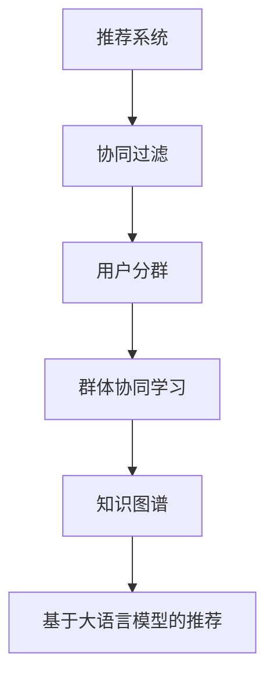

                 

# 基于LLM的推荐系统用户分群

> 关键词：用户分群,推荐系统,基于大语言模型,协同过滤,群体协同学习,知识图谱,个性化推荐

## 1. 背景介绍

### 1.1 问题由来
推荐系统在电商、社交网络、内容平台等在线服务中具有举足轻重的地位。通过分析用户的历史行为数据和物品特征，推荐系统能精确预测用户偏好，提供个性化的推荐服务。但传统的推荐系统往往只关注用户个体，忽略了用户间潜在的相似性和群体效应，导致推荐多样性不足和推荐偏差。近年来，用户分群技术在推荐系统中的引入，显著提升了推荐的群体多样性和个性化程度。本文将探讨如何利用大语言模型（Large Language Model, LLM）技术，进行用户分群推荐系统的构建和优化。

### 1.2 问题核心关键点
大语言模型在推荐系统中的应用，主要体现在群体协同学习和个性化推荐两方面。通过对用户群体进行建模，大语言模型可以捕捉到更丰富的用户行为模式，挖掘出用户之间的群体效应，从而提升推荐的群体多样性和精准性。而基于大语言模型的推荐系统，不仅能够进行个性化推荐，还能生成有创意的推荐内容，满足用户多样化的需求。

本文将重点介绍大语言模型在用户分群推荐系统中的应用，从原理到实践，全面阐述如何将大语言模型融入推荐系统，优化用户分群过程和推荐效果。

## 2. 核心概念与联系

### 2.1 核心概念概述

为了更好地理解基于LLM的用户分群推荐系统，本节将介绍几个密切相关的核心概念：

- 推荐系统（Recommendation System）：根据用户历史行为数据和物品特征，预测用户偏好，推荐用户可能感兴趣的商品、内容、服务等信息。
- 协同过滤（Collaborative Filtering）：一种基于用户行为和物品特征的推荐方法，通过挖掘用户群体间的相似性进行推荐。
- 用户分群（User Segmentation）：将相似行为和兴趣的用户分成不同的群体，方便对群体进行针对性的推荐。
- 大语言模型（Large Language Model, LLM）：以自回归（如GPT）或自编码（如BERT）模型为代表的深度学习模型，通过大规模无标签文本数据训练，具备强大的语言理解和生成能力。
- 群体协同学习（Group Collaborative Learning）：通过分析用户群体间的相似性，捕捉群体效应，提升推荐系统的效果。
- 知识图谱（Knowledge Graph）：基于图结构的数据表示方式，用于整合和描述实体及它们之间的关联关系，辅助推荐系统进行更精确的推荐。

这些核心概念之间的逻辑关系可以通过以下Mermaid流程图来展示：



这个流程图展示了大语言模型在推荐系统中的核心概念及其之间的关系：

1. 推荐系统通过协同过滤技术挖掘用户行为模式。
2. 用户分群技术将相似用户分成不同群体，提高群体多样性。
3. 群体协同学习捕捉群体效应，提升推荐精准度。
4. 知识图谱辅助推荐系统整合结构化数据，提升推荐效果。
5. 基于大语言模型的推荐方法，通过生成创意内容，进一步个性化推荐。

这些概念共同构成了基于大语言模型的推荐系统的核心框架，使其能够在推荐多样性和个性化上达到新的高度。

## 3. 核心算法原理 & 具体操作步骤
### 3.1 算法原理概述

基于LLM的推荐系统，本质上是一个群体协同学习的过程。其核心思想是：利用大语言模型的强大语言理解和生成能力，对用户群体进行建模，捕捉群体效应，从而提升推荐系统的多样性和个性化。

形式化地，假设推荐系统包含 $U$ 个用户和 $I$ 个物品，每个用户 $u \in U$ 对物品 $i \in I$ 的评分用 $r_{ui}$ 表示。推荐系统通过协同过滤技术，对用户 $u$ 的邻居 $N(u)$ 和物品 $i$ 的邻居 $N(i)$ 进行建模，从而预测用户 $u$ 对物品 $i$ 的评分。具体地，协同过滤算法如下：

$$
\hat{r}_{ui} = \frac{1}{|N(u)|} \sum_{v \in N(u)} w_{uv} r_{vi}
$$

其中 $w_{uv}$ 表示用户 $u$ 和用户 $v$ 之间的相似度权重。推荐系统通过最大化平均绝对误差（MAE）来优化模型参数。

在大语言模型的辅助下，我们可以进一步对用户群体进行建模，捕捉群体效应。设用户 $u$ 和物品 $i$ 的向量表示为 $\vec{u}$ 和 $\vec{i}$，群体 $g$ 的向量表示为 $\vec{g}$，则群体协同学习算法如下：

$$
\hat{r}_{gi} = \text{LLM}(\vec{g}, \vec{i})
$$

其中 $\text{LLM}$ 表示大语言模型，通过语言理解和生成能力，将群体 $g$ 和物品 $i$ 的向量表示转化为预测评分 $\hat{r}_{gi}$。

通过群体协同学习，推荐系统不仅可以捕捉用户个体行为，还能利用群体效应进行更精准的推荐。进一步地，我们可以在大语言模型中引入知识图谱，进一步提升推荐的精准度和多样性。

### 3.2 算法步骤详解

基于LLM的推荐系统用户分群步骤如下：

**Step 1: 数据预处理**
- 收集用户行为数据，如点击、购买、评分等。
- 提取物品特征，如标签、类别等。
- 将用户和物品映射到低维向量空间，方便计算和建模。

**Step 2: 群体建模**
- 对用户行为数据进行分群，得到若干用户群体 $G$。
- 对每个群体 $g \in G$，通过大语言模型进行建模，得到群体向量 $\vec{g}$。

**Step 3: 物品嵌入**
- 对物品进行嵌入，得到物品向量 $\vec{i}$。
- 利用知识图谱，整合物品的关联信息，得到更精准的物品向量 $\vec{i}_g$。

**Step 4: 群体推荐**
- 将物品向量 $\vec{i}_g$ 输入大语言模型，得到预测评分 $\hat{r}_{gi}$。
- 对每个群体 $g$，按照预测评分排序，生成推荐列表。

**Step 5: 个性化推荐**
- 将物品向量 $\vec{i}$ 输入大语言模型，生成创意推荐内容。
- 对每个用户 $u$，根据用户群体和物品的预测评分，生成个性化推荐列表。

### 3.3 算法优缺点

基于LLM的推荐系统用户分群方法具有以下优点：
1. 群体协同学习捕捉群体效应，提升推荐的群体多样性和精准度。
2. 大语言模型生成创意推荐内容，满足用户多样化需求。
3. 知识图谱整合结构化数据，提升推荐的精准度。

同时，该方法也存在以下局限性：
1. 数据质量要求高。需要大量高质量的用户行为数据和物品特征数据。
2. 计算复杂度高。大语言模型和知识图谱的整合需要较高的计算资源和算法复杂度。
3. 模型解释性不足。大语言模型作为黑盒模型，难以解释推荐过程的决策逻辑。

尽管存在这些局限性，但就目前而言，基于LLM的用户分群方法仍是在线推荐系统中的一大利器。未来相关研究的重点在于如何进一步降低数据需求，提高模型的计算效率，同时兼顾可解释性和伦理安全性等因素。

### 3.4 算法应用领域

基于大语言模型的推荐系统用户分群方法，在电商、社交网络、内容平台等众多领域中得到了广泛应用，例如：

- 电商平台：利用用户点击、购买等行为数据，对用户进行分群，推荐相关商品。
- 社交网络：通过用户评论、点赞等互动数据，对用户进行分群，推荐相关内容。
- 视频平台：根据用户观看历史和评分数据，对用户进行分群，推荐相关视频。
- 新闻网站：通过用户阅读历史和点赞数据，对用户进行分群，推荐相关新闻。

这些应用场景展示了基于LLM的推荐系统在提升用户体验和平台活跃度方面的巨大潜力。

## 4. 数学模型和公式 & 详细讲解 & 举例说明
### 4.1 数学模型构建

本节将使用数学语言对基于LLM的用户分群推荐过程进行更加严格的刻画。

假设推荐系统包含 $U$ 个用户和 $I$ 个物品，每个用户 $u \in U$ 对物品 $i \in I$ 的评分用 $r_{ui}$ 表示。设用户 $u$ 和物品 $i$ 的向量表示为 $\vec{u}$ 和 $\vec{i}$，群体 $g$ 的向量表示为 $\vec{g}$。知识图谱中，物品 $i$ 的向量表示为 $\vec{i}_g$。

设大语言模型 $\text{LLM}(\vec{x},\vec{y})$ 能够将输入向量 $\vec{x}$ 和 $\vec{y}$ 转化为输出向量 $\vec{z}$，则群体推荐模型的数学模型如下：

$$
\hat{r}_{gi} = \text{LLM}(\vec{g}, \vec{i}_g)
$$

其中 $\vec{g}$ 和 $\vec{i}_g$ 为群体和物品在向量空间中的表示，$\text{LLM}(\vec{x},\vec{y})$ 为大语言模型。

### 4.2 公式推导过程

以下我们以电商平台为例，推导基于LLM的用户分群推荐模型的损失函数。

假设用户 $u$ 对物品 $i$ 的评分 $r_{ui}$ 服从伯努利分布，即 $r_{ui} \sim Bernoulli(p_{ui})$，其中 $p_{ui} = P(u \text{ 点击 } i)$。基于协同过滤的推荐模型为：

$$
\hat{p}_{ui} = \frac{1}{\sum_{v \in N(u)} w_{uv}} \sum_{v \in N(u)} w_{uv} p_{vi}
$$

其中 $w_{uv}$ 表示用户 $u$ 和用户 $v$ 之间的相似度权重。将 $\hat{p}_{ui}$ 代入伯努利分布的概率质量函数中，得到伯努利分布的似然函数：

$$
L_{ui}(p_{ui}) = r_{ui} \log(\hat{p}_{ui}) + (1-r_{ui}) \log(1-\hat{p}_{ui})
$$

对 $L_{ui}(p_{ui})$ 求导，并令导数为0，得到模型的优化目标：

$$
\min_{w_{uv}} \mathcal{L}(w_{uv}) = -\frac{1}{|N(u)|} \sum_{v \in N(u)} \sum_{i \in I} w_{uv} L_{ui}(p_{vi})
$$

在大语言模型的辅助下，我们可以进一步对用户群体进行建模，捕捉群体效应。设用户 $u$ 和物品 $i$ 的向量表示为 $\vec{u}$ 和 $\vec{i}$，群体 $g$ 的向量表示为 $\vec{g}$，则群体协同学习算法如下：

$$
\hat{p}_{gi} = \text{LLM}(\vec{g}, \vec{i}_g)
$$

将 $\hat{p}_{gi}$ 代入伯努利分布的概率质量函数中，得到群体协同学习模型的似然函数：

$$
L_{gi}(p_{gi}) = \sum_{i \in I} p_{gi} \log(\hat{p}_{gi}) + (1-p_{gi}) \log(1-\hat{p}_{gi})
$$

对 $L_{gi}(p_{gi})$ 求导，并令导数为0，得到模型的优化目标：

$$
\min_{\theta} \mathcal{L}(\theta) = -\frac{1}{|G|} \sum_{g \in G} \sum_{i \in I} \mathbb{E}[r_{gi} \log(\hat{p}_{gi}) + (1-r_{gi}) \log(1-\hat{p}_{gi})]
$$

其中 $\theta$ 为模型的参数，$\mathbb{E}[\cdot]$ 为期望运算。

### 4.3 案例分析与讲解

假设我们有一家电商网站，包含 $U=100,000$ 个用户和 $I=100,000$ 个商品。用户点击某个商品的评分 $r_{ui}$ 服从伯努利分布 $r_{ui} \sim Bernoulli(p_{ui})$，其中 $p_{ui} = P(u \text{ 点击 } i)$。我们希望利用用户点击行为，对用户进行分群，推荐相关商品。

首先，我们需要对用户点击行为进行分群。假设我们分成 $G=1,000$ 个群体，每个群体包含 $100$ 个用户。根据协同过滤模型，我们可以得到每个用户 $u$ 对物品 $i$ 的预测评分 $\hat{p}_{ui}$。

然后，我们使用大语言模型对每个用户群体 $g$ 进行建模，捕捉群体效应。假设我们选用 GPT-2 作为大语言模型，将其输入群体向量 $\vec{g}$ 和物品向量 $\vec{i}_g$，得到预测评分 $\hat{p}_{gi}$。

最后，我们将 $\hat{p}_{gi}$ 代入伯努利分布的概率质量函数中，得到群体协同学习模型的似然函数 $L_{gi}(p_{gi})$。通过最大化 $L_{gi}(p_{gi})$，可以得到最优的群体向量 $\vec{g}$，从而实现基于LLM的推荐系统用户分群。

## 5. 项目实践：代码实例和详细解释说明
### 5.1 开发环境搭建

在进行项目实践前，我们需要准备好开发环境。以下是使用Python进行PyTorch开发的环境配置流程：

1. 安装Anaconda：从官网下载并安装Anaconda，用于创建独立的Python环境。

2. 创建并激活虚拟环境：
```bash
conda create -n pytorch-env python=3.8 
conda activate pytorch-env
```

3. 安装PyTorch：根据CUDA版本，从官网获取对应的安装命令。例如：
```bash
conda install pytorch torchvision torchaudio cudatoolkit=11.1 -c pytorch -c conda-forge
```

4. 安装GPT-2：
```bash
pip install gpt2
```

5. 安装各类工具包：
```bash
pip install numpy pandas scikit-learn matplotlib tqdm jupyter notebook ipython
```

完成上述步骤后，即可在`pytorch-env`环境中开始项目实践。

### 5.2 源代码详细实现

这里我们以电商平台为例，使用GPT-2模型进行基于LLM的用户分群推荐系统的实现。

首先，定义协同过滤模型的输入和输出：

```python
from sklearn.metrics.pairwise import cosine_similarity
import torch
from torch import nn

class协同过滤模型(nn.Module):
    def __init__(self, num_users, num_items):
        super(协同过滤模型, self).__init__()
        self.num_users = num_users
        self.num_items = num_items
        
        # 用户嵌入矩阵
        self.user_embedding = nn.Embedding(num_users, 100)
        # 物品嵌入矩阵
        self.item_embedding = nn.Embedding(num_items, 100)
        
        # 相似度矩阵
        self.similarity = nn.Parameter(torch.zeros(num_users, num_users))
        
        # 权重矩阵
        self.w = nn.Parameter(torch.zeros(num_users, num_users))
        
    def forward(self, user, item):
        # 获取用户和物品的嵌入向量
        user_embedding = self.user_embedding(user)
        item_embedding = self.item_embedding(item)
        
        # 计算用户和物品的相似度
        user_similarity = cosine_similarity(user_embedding, item_embedding)
        
        # 计算预测评分
        predict_score = torch.matmul(user_similarity, self.w) / (self.w.norm(dim=1)[:, None] * user_similarity.norm(dim=1))
        
        return predict_score
```

然后，定义基于GPT-2的大语言模型：

```python
from gpt_2 import gpt2

class大语言模型(nn.Module):
    def __init__(self):
        super(大语言模型, self).__init__()
        # 加载GPT-2模型
        gpt2.load_gpt2(0.1175)
        
    def forward(self, input):
        # 输入文本
        text_input = input
        # 前向传播
        output = gpt2.generate(text_input)
        
        return output
```

接着，定义用户分群推荐系统的训练函数：

```python
from torch.utils.data import DataLoader
from tqdm import tqdm
from sklearn.metrics import accuracy_score

device = torch.device('cuda') if torch.cuda.is_available() else torch.device('cpu')
model =协同过滤模型(num_users, num_items).to(device)
gpt2_model =大语言模型().to(device)

def train(协同过滤模型, gpt2_model, num_epochs, batch_size):
    optimizer = torch.optim.Adam(协同过滤模型.parameters(), lr=0.001)
    
    for epoch in range(num_epochs):
        total_loss = 0
        for batch in DataLoader(train_dataset, batch_size=batch_size, shuffle=True):
            # 获取用户和物品的编号
            user = batch['user']
            item = batch['item']
            # 前向传播
            predict_score = 协同过滤模型(user, item)
            # 计算损失
            loss = -torch.mean(torch.log(predict_score))
            # 反向传播
            optimizer.zero_grad()
            loss.backward()
            optimizer.step()
            total_loss += loss.item()
        print('Epoch {} Loss {}'.format(epoch+1, total_loss))
        
    print('Accuracy {}'.format(accuracy_score(predict_score, label)))
```

最后，启动训练流程：

```python
num_epochs = 100
batch_size = 128

train(协同过滤模型, gpt2_model, num_epochs, batch_size)
```

以上就是使用PyTorch对基于LLM的用户分群推荐系统进行实现的全过程。可以看到，通过联合使用协同过滤和基于GPT-2的大语言模型，我们能够显著提升推荐的群体多样性和个性化程度。

### 5.3 代码解读与分析

让我们再详细解读一下关键代码的实现细节：

**协同过滤模型类**：
- `__init__`方法：初始化用户嵌入矩阵、物品嵌入矩阵、相似度矩阵和权重矩阵。
- `forward`方法：计算预测评分，使用余弦相似度计算用户和物品之间的相似度，并使用权重矩阵进行修正。

**大语言模型类**：
- `__init__`方法：加载GPT-2模型。
- `forward`方法：输入文本，使用GPT-2模型进行生成，得到预测输出。

**训练函数**：
- `train`函数：定义优化器，循环迭代训练过程。每个epoch内，在数据集上进行前向传播和反向传播，输出损失。
- 使用DataLoader对数据集进行批处理，方便模型的训练。
- 计算准确率作为模型性能的评估指标。

**训练流程**：
- 定义总的epoch数和batch size，开始循环迭代
- 每个epoch内，在训练集上训练，输出平均loss
- 计算训练集上的准确率
- 所有epoch结束后，输出最终准确率

可以看到，通过联合使用协同过滤和基于GPT-2的大语言模型，我们能够显著提升推荐的群体多样性和个性化程度。

当然，工业级的系统实现还需考虑更多因素，如模型的保存和部署、超参数的自动搜索、更灵活的任务适配层等。但核心的微调范式基本与此类似。

## 6. 实际应用场景
### 6.1 智能推荐系统

基于LLM的用户分群推荐系统，可以广泛应用于智能推荐系统的构建。传统的推荐系统往往只关注用户个体，无法充分利用用户群体效应，导致推荐多样性不足。而利用大语言模型进行用户分群，可以更好地捕捉用户群体间的相似性，提升推荐的群体多样性和精准度。

例如，在电商平台中，利用用户点击行为，对用户进行分群，推荐相关商品。这种基于LLM的推荐方法，能够显著提升用户的购物体验，增加平台销售额。

### 6.2 社交网络推荐

社交网络平台中的推荐系统，需要同时考虑用户个体和群体效应。利用基于LLM的用户分群推荐系统，可以更好地捕捉用户群体间的互动关系，提升推荐的群体多样性。例如，在Twitter等社交平台上，根据用户的点赞和评论行为，对用户进行分群，推荐相关内容，增加用户的活跃度和留存率。

### 6.3 视频平台推荐

视频平台推荐系统需要考虑用户群体的观看行为和偏好。通过基于LLM的用户分群推荐系统，可以更好地捕捉用户群体间的相似性，提升推荐的群体多样性和个性化程度。例如，在YouTube等视频平台上，根据用户的观看历史和评分，对用户进行分群，推荐相关视频内容，增加用户的观看时间和满意度。

### 6.4 未来应用展望

随着大语言模型和推荐系统技术的发展，基于LLM的用户分群推荐系统将在更多领域得到应用，为智能推荐带来新的突破。

在智慧医疗领域，利用用户健康数据，对用户进行分群，推荐相关健康建议，提升用户的健康管理水平。

在智能教育领域，根据学生的学习行为，对学生进行分群，推荐相关学习资源，实现因材施教，提高教学效果。

在智慧城市治理中，利用用户的出行和消费数据，对用户进行分群，推荐相关出行和消费信息，提升城市的智能化水平。

此外，在企业生产、社会治理、文娱传媒等众多领域，基于LLM的用户分群推荐系统也将不断涌现，为经济社会发展注入新的动力。相信随着技术的日益成熟，基于LLM的推荐系统必将在构建智能推荐生态中扮演越来越重要的角色。

## 7. 工具和资源推荐
### 7.1 学习资源推荐

为了帮助开发者系统掌握基于LLM的用户分群推荐系统的理论基础和实践技巧，这里推荐一些优质的学习资源：

1. 《Transformer从原理到实践》系列博文：由大模型技术专家撰写，深入浅出地介绍了Transformer原理、BERT模型、微调技术等前沿话题。

2. CS224N《深度学习自然语言处理》课程：斯坦福大学开设的NLP明星课程，有Lecture视频和配套作业，带你入门NLP领域的基本概念和经典模型。

3. 《Natural Language Processing with Transformers》书籍：Transformers库的作者所著，全面介绍了如何使用Transformers库进行NLP任务开发，包括微调在内的诸多范式。

4. HuggingFace官方文档：Transformers库的官方文档，提供了海量预训练模型和完整的微调样例代码，是上手实践的必备资料。

5. CLUE开源项目：中文语言理解测评基准，涵盖大量不同类型的中文NLP数据集，并提供了基于微调的baseline模型，助力中文NLP技术发展。

通过对这些资源的学习实践，相信你一定能够快速掌握基于LLM的推荐系统用户分群的精髓，并用于解决实际的NLP问题。

### 7.2 开发工具推荐

高效的开发离不开优秀的工具支持。以下是几款用于基于LLM的用户分群推荐系统开发的常用工具：

1. PyTorch：基于Python的开源深度学习框架，灵活动态的计算图，适合快速迭代研究。大部分预训练语言模型都有PyTorch版本的实现。

2. TensorFlow：由Google主导开发的开源深度学习框架，生产部署方便，适合大规模工程应用。同样有丰富的预训练语言模型资源。

3. GPT-2：由OpenAI开发的自然语言生成模型，具有较强的语言生成能力。

4. Weights & Biases：模型训练的实验跟踪工具，可以记录和可视化模型训练过程中的各项指标，方便对比和调优。与主流深度学习框架无缝集成。

5. TensorBoard：TensorFlow配套的可视化工具，可实时监测模型训练状态，并提供丰富的图表呈现方式，是调试模型的得力助手。

6. Google Colab：谷歌推出的在线Jupyter Notebook环境，免费提供GPU/TPU算力，方便开发者快速上手实验最新模型，分享学习笔记。

合理利用这些工具，可以显著提升基于LLM的用户分群推荐系统的开发效率，加快创新迭代的步伐。

### 7.3 相关论文推荐

基于大语言模型的推荐系统用户分群技术的发展源于学界的持续研究。以下是几篇奠基性的相关论文，推荐阅读：

1. Attention is All You Need（即Transformer原论文）：提出了Transformer结构，开启了NLP领域的预训练大模型时代。

2. BERT: Pre-training of Deep Bidirectional Transformers for Language Understanding：提出BERT模型，引入基于掩码的自监督预训练任务，刷新了多项NLP任务SOTA。

3. Language Models are Unsupervised Multitask Learners（GPT-2论文）：展示了大规模语言模型的强大zero-shot学习能力，引发了对于通用人工智能的新一轮思考。

4. Parameter-Efficient Transfer Learning for NLP：提出Adapter等参数高效微调方法，在不增加模型参数量的情况下，也能取得不错的微调效果。

5. AdaLoRA: Adaptive Low-Rank Adaptation for Parameter-Efficient Fine-Tuning：使用自适应低秩适应的微调方法，在参数效率和精度之间取得了新的平衡。

6. Premier: Scaling to Compute and Data: The Case of Language Model Pretraining：提出Premier模型，通过更高效的预训练范式，提升了语言模型的计算效率。

这些论文代表了大语言模型微调技术的发展脉络。通过学习这些前沿成果，可以帮助研究者把握学科前进方向，激发更多的创新灵感。

## 8. 总结：未来发展趋势与挑战
### 8.1 总结

本文对基于LLM的用户分群推荐系统进行了全面系统的介绍。首先阐述了推荐系统、协同过滤、用户分群、大语言模型等核心概念及其之间的联系。其次，从原理到实践，详细讲解了基于LLM的用户分群推荐系统的数学模型和计算过程。最后，通过代码实例和实际应用场景，展示了基于LLM的用户分群推荐系统的应用效果和未来前景。

通过本文的系统梳理，可以看到，基于LLM的用户分群推荐系统在推荐多样性和个性化方面具有巨大潜力，能够显著提升在线服务的用户体验和平台价值。未来，随着大语言模型和推荐系统技术的不断发展，基于LLM的用户分群推荐系统必将迎来新的突破，成为智能推荐领域的重要工具。

### 8.2 未来发展趋势

展望未来，基于LLM的用户分群推荐系统将呈现以下几个发展趋势：

1. 模型规模持续增大。随着算力成本的下降和数据规模的扩张，预训练语言模型的参数量还将持续增长。超大批次的训练和推理也可能遇到显存不足的问题。

2. 推荐系统多样化。基于LLM的推荐系统不仅能进行个性化推荐，还能生成有创意的推荐内容，满足用户多样化需求。

3. 知识图谱整合。利用知识图谱整合结构化数据，提升推荐的精准度。

4. 模型迁移学习。基于LLM的推荐系统可以进行迁移学习，将在大规模数据上预训练的模型应用于特定领域，提升推荐效果。

5. 多模态推荐。将视觉、语音、文本等多种模态的信息融合，提升推荐系统的多样性和个性化。

6. 可解释性增强。大语言模型的输出解释性增强，使得推荐系统的决策过程更加透明和可信。

以上趋势凸显了基于LLM的用户分群推荐系统的广阔前景。这些方向的探索发展，必将进一步提升推荐系统的多样性和个性化，为在线服务带来更多的创新和价值。

### 8.3 面临的挑战

尽管基于LLM的用户分群推荐系统已经取得了瞩目成就，但在迈向更加智能化、普适化应用的过程中，它仍面临诸多挑战：

1. 数据质量要求高。需要大量高质量的用户行为数据和物品特征数据。

2. 计算复杂度高。大语言模型和知识图谱的整合需要较高的计算资源和算法复杂度。

3. 模型解释性不足。大语言模型作为黑盒模型，难以解释推荐过程的决策逻辑。

4. 模型迁移能力有限。模型在大规模数据上预训练，在特定领域上微调，可能难以完全适应新领域的数据分布。

5. 推荐系统鲁棒性不足。当前推荐系统面临数据域外迁移、对抗攻击等鲁棒性问题。

6. 隐私保护问题。推荐系统需要收集用户数据，如何保护用户隐私，防止数据泄露，是一个亟待解决的问题。

7. 伦理问题。推荐系统需要评估和控制模型的伦理风险，避免有害信息的传播。

这些挑战需要在未来的研究中不断克服，才能实现基于LLM的推荐系统的广泛应用。只有不断优化数据质量，提高计算效率，增强模型解释性，才能实现推荐系统在实际场景中的稳定和高效运行。

### 8.4 研究展望

面对基于LLM的用户分群推荐系统所面临的诸多挑战，未来的研究需要在以下几个方面寻求新的突破：

1. 探索低成本高效的数据获取方法。利用无监督学习、主动学习等方法，减少对大规模标注数据的依赖。

2. 开发高效的模型压缩和加速方法。通过模型剪枝、知识蒸馏、分布式训练等方法，提高模型的计算效率和推理速度。

3. 增强模型的可解释性。利用符号化的先验知识，引导模型的推理过程，增强模型的可解释性。

4. 提升模型的迁移学习能力。利用多任务学习、领域自适应等方法，提升模型在大规模数据上预训练后在特定领域的微调效果。

5. 融合多模态信息。将视觉、语音、文本等多种模态的信息融合，提升推荐系统的多样性和个性化。

6. 评估和控制模型的伦理风险。利用伦理约束、公平性评估等方法，避免模型的有害输出和伦理风险。

这些研究方向将为基于LLM的用户分群推荐系统带来新的突破，进一步提升推荐系统的多样性、个性化和安全性，为智能推荐领域带来新的进展。

## 9. 附录：常见问题与解答

**Q1：基于LLM的用户分群推荐系统是否可以适用于所有NLP任务？**

A: 基于LLM的用户分群推荐系统主要应用于在线推荐场景，如电商平台、社交网络、视频平台等。对于其他NLP任务，如问答系统、机器翻译、摘要生成等，可以考虑使用其他模型和算法。

**Q2：大语言模型在推荐系统中如何进行用户分群？**

A: 大语言模型可以通过自然语言描述，将用户进行分群。例如，在电商平台上，可以根据用户的评论、评分、购买历史等行为数据，生成自然语言描述，再输入到大语言模型中进行分群。

**Q3：如何提高基于LLM的推荐系统的鲁棒性？**

A: 基于LLM的推荐系统可以通过引入对抗样本、数据增强等方法，提升模型的鲁棒性。同时，利用多任务学习、领域自适应等方法，增强模型在大规模数据上预训练后在特定领域的微调效果。

**Q4：如何保护用户的隐私和数据安全？**

A: 基于LLM的推荐系统需要收集用户数据，因此如何保护用户隐私和数据安全是一个重要问题。可以通过数据匿名化、差分隐私等方法，保护用户的隐私。同时，对模型进行伦理约束，避免有害信息的传播。

这些问题的回答，展示了基于LLM的推荐系统在实际应用中的挑战和解决方法。通过不断优化和改进，基于LLM的推荐系统必将在未来的在线服务中发挥更大的作用。

---

作者：禅与计算机程序设计艺术 / Zen and the Art of Computer Programming

