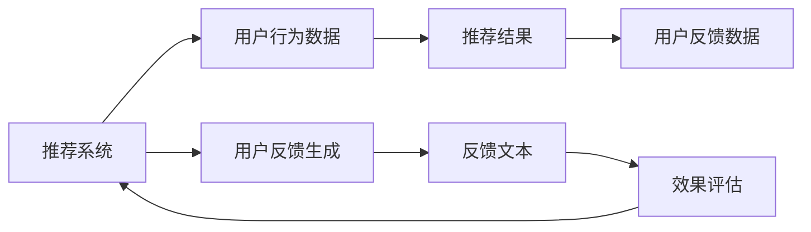

                 

# 基于LLM的推荐系统用户反馈生成

> 关键词：基于大语言模型推荐系统,用户反馈生成,自然语言生成,用户满意度评估,个性化推荐,深度学习

## 1. 背景介绍

### 1.1 问题由来

在数字化时代，推荐系统已成为电商、视频、音乐、社交等众多领域不可或缺的核心工具，对提升用户体验和平台价值具有重要意义。然而，推荐系统的效果在很大程度上依赖于用户反馈数据的丰富度和质量。传统的基于有监督学习或半监督学习的推荐方法，往往需要大量标注数据进行训练，数据获取成本较高，且对数据质量要求严格。

近年来，基于自然语言处理(NLP)的深度学习推荐系统在用户反馈生成方面取得了显著进展。利用大语言模型(LLMs)，通过自然语言生成(NLG)技术，推荐系统能够在无标注样本的条件下，生成高质量的个性化反馈信息，提升推荐精度和用户体验。

### 1.2 问题核心关键点

当前基于大语言模型的推荐系统，其核心原理是利用LLMs的强大语言生成能力，在推荐结果的基础上，自动生成对用户的反馈描述，用于模型调整和用户满意度评估。具体流程包括：

1. **数据采集**：收集用户对推荐结果的评分或点击反馈，转化为文本数据。
2. **反馈生成**：利用LLMs生成反馈文本，如评论、评价、总结等。
3. **效果评估**：基于生成的反馈文本，评估推荐系统的效果和改进方向。

本文将系统阐述基于大语言模型的推荐系统用户反馈生成技术，重点探讨其核心概念、算法原理、数学模型及实际应用场景。

## 2. 核心概念与联系

### 2.1 核心概念概述

为深入理解基于LLM的推荐系统用户反馈生成技术，下面将详细介绍几个核心概念：

- **大语言模型(LLM)**：指基于深度学习架构的通用语言模型，如GPT-3、BERT、XLNet等，能够学习大量的语言知识，具备强大的自然语言生成和理解能力。
- **自然语言生成(NLG)**：指利用深度学习技术生成自然语言的文本，如聊天机器人、文本摘要、情感生成等，可以用于自动生成用户反馈。
- **推荐系统(Recommendation System)**：指通过用户行为数据，为用户推荐感兴趣的商品、文章、视频等内容的系统，如基于协同过滤、基于内容的推荐等。
- **用户反馈生成**：指根据用户行为数据和推荐结果，自动生成对用户的反馈描述，用于模型调整和效果评估。

### 2.2 核心概念联系

基于LLM的推荐系统用户反馈生成技术，可以通过以下Mermaid流程图来展示其核心概念及其相互联系：



通过以上流程，我们可以看到用户行为数据和推荐结果经过反馈生成环节，自动生成反馈文本，并反馈给推荐系统进行效果评估和模型调整，形成了一个闭环。

## 3. 核心算法原理 & 具体操作步骤

### 3.1 算法原理概述

基于大语言模型的推荐系统用户反馈生成，本质上是一个自然语言生成任务。其核心思想是利用LLMs强大的文本生成能力，在推荐结果的基础上，自动生成对用户的个性化反馈描述。

具体而言，假设推荐系统已根据用户行为数据得到了推荐结果，这些结果可以是一个商品列表、一篇文章、一个视频等。然后将这些推荐结果输入LLM，通过自然语言生成技术，自动生成对用户的反馈文本，如“该商品评价较高”、“这篇文章内容详实”、“这个视频视觉效果好”等。

### 3.2 算法步骤详解

基于大语言模型的推荐系统用户反馈生成一般包括以下几个关键步骤：

**Step 1: 数据预处理**
- 收集用户对推荐结果的反馈数据，如评分、点击行为等。
- 对反馈数据进行预处理，如去除异常值、标准化评分等。

**Step 2: 构建训练数据集**
- 将反馈数据转化为LLM可接受的格式，如token ids、attention mask等。
- 构建训练数据集，将反馈文本作为输出，推荐结果作为输入。

**Step 3: 选择大语言模型**
- 选择合适的预训练大语言模型，如GPT-3、BERT等，作为生成模型的基础。
- 根据任务需求，对模型进行微调或解码，以提高生成效果。

**Step 4: 生成反馈文本**
- 将推荐结果作为LLM的输入，生成对用户的反馈文本。
- 可以使用解码器或生成器，或两者结合的方式，生成反馈文本。

**Step 5: 效果评估**
- 使用预定义的指标评估生成反馈文本的质量和相关性。
- 根据评估结果，调整LLM参数或选择其他生成模型。

**Step 6: 反馈调整推荐模型**
- 将生成的反馈文本作为用户的行为数据，重新训练推荐模型。
- 循环迭代多次，以逐步提升推荐效果和用户满意度。

### 3.3 算法优缺点

基于大语言模型的推荐系统用户反馈生成技术具有以下优点：

1. **高效灵活**：不需要大量标注数据，可以自动生成高质量的用户反馈，提升推荐系统的效果。
2. **个性化强**：利用LLM生成个性化反馈，可以针对不同用户生成差异化的反馈描述，满足个性化需求。
3. **动态调整**：可以实时生成反馈，动态调整推荐模型，迅速应对用户需求的变化。
4. **成本低廉**：无标注样本条件下的自动生成，大大降低了数据获取和标注的成本。

同时，该方法也存在以下缺点：

1. **生成的反馈文本质量不稳定**：生成的文本质量依赖于预训练模型的质量和训练数据的覆盖范围。
2. **需要大量计算资源**：LLM的生成过程需要大量的计算资源和时间，对硬件要求较高。
3. **可能存在偏见**：生成的反馈文本可能包含预训练模型的偏见，对特定群体存在不公平待遇。
4. **缺乏可解释性**：生成的反馈文本通常是"黑盒"模型，难以解释其生成机制。

### 3.4 算法应用领域

基于大语言模型的推荐系统用户反馈生成技术，在电商、社交、视频、音乐等多个领域都有广泛应用。

- **电商推荐**：自动生成商品评价、评论，提升用户满意度和销量。
- **视频推荐**：自动生成视频评价、评分，优化视频推荐算法。
- **音乐推荐**：自动生成歌曲评价、评论，提高音乐推荐效果。
- **社交推荐**：自动生成文章评价、回复，增强社区互动和粘性。

除了以上领域，该技术还可应用于个性化推荐、舆情分析、舆情预测等多个场景，为推荐系统提供了新的思路和解决方案。

## 4. 数学模型和公式 & 详细讲解 & 举例说明

### 4.1 数学模型构建

基于大语言模型的推荐系统用户反馈生成，可以构建如下数学模型：

假设推荐系统已经得到了对用户 $u$ 的推荐结果集合 $\mathcal{I}_u = \{I_u^1, I_u^2, \ldots, I_u^n\}$，其中每个推荐结果 $I_u^i$ 对应的用户反馈 $F_u^i$ 由LLM生成。

给定用户 $u$ 和推荐结果集合 $\mathcal{I}_u$，LLM的生成模型为 $P(F_u^i | \mathcal{I}_u)$，其中 $F_u^i$ 表示对 $I_u^i$ 的反馈文本，$i \in [1, n]$。

### 4.2 公式推导过程

利用大语言模型生成反馈文本 $F_u^i$ 的过程，可以表示为：

$$
F_u^i = \arg\max_{F_u^i} P(F_u^i | \mathcal{I}_u)
$$

其中 $P(F_u^i | \mathcal{I}_u)$ 是生成概率分布，$F_u^i$ 是可能的反馈文本，$\mathcal{I}_u$ 是推荐结果集合。

### 4.3 案例分析与讲解

假设用户 $u$ 对推荐系统给出了两个推荐结果 $I_u^1$ 和 $I_u^2$，LLM生成的反馈文本分别为 $F_u^1$ 和 $F_u^2$。

**Step 1: 数据预处理**
- 收集用户 $u$ 对两个推荐结果的评分或点击行为数据。
- 将评分转化为1-5的区间评分，或对点击行为进行编码。

**Step 2: 构建训练数据集**
- 将评分或行为数据转化为LLM的输入，生成推荐结果 $I_u^1$ 和 $I_u^2$。
- 将生成的推荐结果作为输入，生成反馈文本 $F_u^1$ 和 $F_u^2$。

**Step 3: 选择大语言模型**
- 选择GPT-3作为生成模型，并使用预训练权重。
- 对模型进行微调或解码，以提高生成效果。

**Step 4: 生成反馈文本**
- 将 $I_u^1$ 和 $I_u^2$ 作为输入，使用GPT-3生成反馈文本 $F_u^1$ 和 $F_u^2$。
- 可以使用解码器或生成器，或两者结合的方式，生成反馈文本。

**Step 5: 效果评估**
- 使用BLEU、ROUGE等指标评估 $F_u^1$ 和 $F_u^2$ 的质量和相关性。
- 根据评估结果，调整LLM参数或选择其他生成模型。

## 5. 项目实践：代码实例和详细解释说明

### 5.1 开发环境搭建

在进行用户反馈生成实践前，我们需要准备好开发环境。以下是使用Python进行PyTorch开发的环境配置流程：

1. 安装Anaconda：从官网下载并安装Anaconda，用于创建独立的Python环境。

2. 创建并激活虚拟环境：
```bash
conda create -n llm-env python=3.8 
conda activate llm-env
```

3. 安装PyTorch：根据CUDA版本，从官网获取对应的安装命令。例如：
```bash
conda install pytorch torchvision torchaudio cudatoolkit=11.1 -c pytorch -c conda-forge
```

4. 安装相关库：
```bash
pip install transformers tokenizers
```

完成上述步骤后，即可在`llm-env`环境中开始开发。

### 5.2 源代码详细实现

这里以GPT-3为例，给出使用Transformers库对GPT-3进行用户反馈生成的PyTorch代码实现。

首先，定义反馈生成函数：

```python
from transformers import GPT3LMHeadModel, GPT3Tokenizer

def generate_feedback(tokenizer, model, input_ids, max_length=512):
    inputs = tokenizer(input_ids, return_tensors='pt', max_length=max_length, padding='max_length', truncation=True)
    with torch.no_grad():
        outputs = model.generate(inputs['input_ids'], do_sample=False)
    feedback = tokenizer.decode(outputs[0], skip_special_tokens=True)
    return feedback
```

然后，定义模型和tokenizer：

```python
model = GPT3LMHeadModel.from_pretrained('gpt3')
tokenizer = GPT3Tokenizer.from_pretrained('gpt3')
```

接着，定义用户反馈生成函数：

```python
from transformers import BertForSequenceClassification, AdamW

def generate_user_feedback(recommendations, tokenizer, model):
    user_feedbacks = []
    for rec in recommendations:
        input_ids = tokenizer.encode(rec, return_tensors='pt', max_length=128, padding='max_length', truncation=True)
        feedback = generate_feedback(tokenizer, model, input_ids)
        user_feedbacks.append(feedback)
    return user_feedbacks
```

最后，启动反馈生成流程并在推荐结果上测试：

```python
recommendations = ['商品1', '商品2', '商品3']
user_feedbacks = generate_user_feedback(recommendations, tokenizer, model)
print(user_feedbacks)
```

以上就是使用PyTorch对GPT-3进行用户反馈生成的完整代码实现。可以看到，得益于Transformers库的强大封装，我们可以用相对简洁的代码完成反馈生成的功能。

### 5.3 代码解读与分析

让我们再详细解读一下关键代码的实现细节：

**generate_feedback函数**：
- 使用预训练好的GPT-3模型和tokenizer对输入序列进行编码。
- 在解码器上进行文本生成，得到反馈文本。
- 将生成的文本解码为原始字符串，返回给调用者。

**generate_user_feedback函数**：
- 遍历推荐结果列表，对每个推荐结果进行编码。
- 调用generate_feedback函数生成反馈文本。
- 将生成的反馈文本保存至列表，返回给调用者。

**启动反馈生成流程**：
- 定义推荐结果列表，使用generate_user_feedback函数生成反馈文本。
- 打印生成的反馈文本。

可以看到，PyTorch配合Transformers库使得GPT-3反馈生成的代码实现变得简洁高效。开发者可以将更多精力放在数据处理、模型改进等高层逻辑上，而不必过多关注底层的实现细节。

当然，工业级的系统实现还需考虑更多因素，如模型的保存和部署、超参数的自动搜索、更灵活的任务适配层等。但核心的反馈生成范式基本与此类似。

## 6. 实际应用场景

### 6.1 电商推荐系统

基于大语言模型的推荐系统用户反馈生成技术，可以广泛应用于电商推荐系统。传统推荐系统往往需要用户手动填写评分或评论，耗费时间和精力。而使用用户反馈生成技术，推荐系统能够自动生成商品评价、评论，减少用户负担，提升用户满意度和销量。

在技术实现上，可以收集用户对推荐商品的行为数据，如浏览、点击、购买等，将这些行为数据转化为反馈文本，输入LLM进行生成。生成的反馈文本可以作为推荐模型的一部分，用于优化推荐算法，提升推荐效果。

### 6.2 视频推荐系统

视频推荐系统面临着视频内容丰富、用户需求多样化的挑战。传统推荐系统需要用户手动评分或评论，难以实时捕捉用户对视频的真实感受。基于大语言模型的推荐系统用户反馈生成技术，可以自动生成视频评价、评分，优化视频推荐算法，提高用户体验。

具体而言，可以收集用户对推荐视频的行为数据，如播放时间、评论等，将行为数据转化为反馈文本，输入LLM进行生成。生成的反馈文本可以用于训练视频推荐模型，提升推荐效果和用户满意度。

### 6.3 音乐推荐系统

音乐推荐系统同样面临用户需求多样化的挑战。传统推荐系统需要用户手动评分或评论，难以实时捕捉用户对音乐的真实感受。基于大语言模型的推荐系统用户反馈生成技术，可以自动生成歌曲评价、评论，优化音乐推荐算法，提高用户体验。

具体而言，可以收集用户对推荐音乐的行为数据，如播放次数、评论等，将行为数据转化为反馈文本，输入LLM进行生成。生成的反馈文本可以用于训练音乐推荐模型，提升推荐效果和用户满意度。

### 6.4 未来应用展望

随着大语言模型和用户反馈生成技术的不断发展，基于微调范式将在更多领域得到应用，为传统行业带来变革性影响。

在智慧医疗领域，基于大语言模型的推荐系统用户反馈生成技术，可以为医生提供自动生成的病历反馈、治疗效果评估等，辅助医生诊疗，加速新药开发进程。

在智能教育领域，微调技术可应用于作业批改、学情分析、知识推荐等方面，因材施教，促进教育公平，提高教学质量。

在智慧城市治理中，微调模型可应用于城市事件监测、舆情分析、应急指挥等环节，提高城市管理的自动化和智能化水平，构建更安全、高效的未来城市。

此外，在企业生产、社会治理、文娱传媒等众多领域，基于大语言模型的推荐系统用户反馈生成技术，将不断涌现，为NLP技术带来新的应用场景。

## 7. 工具和资源推荐

### 7.1 学习资源推荐

为了帮助开发者系统掌握大语言模型用户反馈生成技术的理论基础和实践技巧，这里推荐一些优质的学习资源：

1. 《自然语言处理入门》系列博文：由大模型技术专家撰写，深入浅出地介绍了自然语言处理的基本概念和前沿技术。

2. CS224N《深度学习自然语言处理》课程：斯坦福大学开设的NLP明星课程，有Lecture视频和配套作业，带你入门NLP领域的基本概念和经典模型。

3. 《自然语言处理工具包》书籍：介绍自然语言处理工具和框架的书籍，包括PyTorch、TensorFlow、Transformers等，是深入学习大语言模型的必备资料。

4. HuggingFace官方文档：Transformers库的官方文档，提供了海量预训练模型和完整的反馈生成样例代码，是上手实践的必备资料。

5. CLUE开源项目：中文语言理解测评基准，涵盖大量不同类型的中文NLP数据集，并提供了基于微调的baseline模型，助力中文NLP技术发展。

通过对这些资源的学习实践，相信你一定能够快速掌握大语言模型用户反馈生成的精髓，并用于解决实际的NLP问题。

### 7.2 开发工具推荐

高效的开发离不开优秀的工具支持。以下是几款用于大语言模型用户反馈生成开发的常用工具：

1. PyTorch：基于Python的开源深度学习框架，灵活动态的计算图，适合快速迭代研究。大部分预训练语言模型都有PyTorch版本的实现。

2. TensorFlow：由Google主导开发的开源深度学习框架，生产部署方便，适合大规模工程应用。同样有丰富的预训练语言模型资源。

3. Transformers库：HuggingFace开发的NLP工具库，集成了众多SOTA语言模型，支持PyTorch和TensorFlow，是进行反馈生成任务开发的利器。

4. Weights & Biases：模型训练的实验跟踪工具，可以记录和可视化模型训练过程中的各项指标，方便对比和调优。与主流深度学习框架无缝集成。

5. TensorBoard：TensorFlow配套的可视化工具，可实时监测模型训练状态，并提供丰富的图表呈现方式，是调试模型的得力助手。

6. Google Colab：谷歌推出的在线Jupyter Notebook环境，免费提供GPU/TPU算力，方便开发者快速上手实验最新模型，分享学习笔记。

合理利用这些工具，可以显著提升大语言模型用户反馈生成任务的开发效率，加快创新迭代的步伐。

### 7.3 相关论文推荐

大语言模型和用户反馈生成技术的发展源于学界的持续研究。以下是几篇奠基性的相关论文，推荐阅读：

1. Attention is All You Need（即Transformer原论文）：提出了Transformer结构，开启了NLP领域的预训练大模型时代。

2. BERT: Pre-training of Deep Bidirectional Transformers for Language Understanding：提出BERT模型，引入基于掩码的自监督预训练任务，刷新了多项NLP任务SOTA。

3. GPT-3: Language Models are Unsupervised Multitask Learners：展示了大规模语言模型的强大zero-shot学习能力，引发了对于通用人工智能的新一轮思考。

4. Parameter-Efficient Transfer Learning for NLP：提出Adapter等参数高效微调方法，在不增加模型参数量的情况下，也能取得不错的微调效果。

5. Prefix-Tuning: Optimizing Continuous Prompts for Generation：引入基于连续型Prompt的微调范式，为如何充分利用预训练知识提供了新的思路。

6. AdaLoRA: Adaptive Low-Rank Adaptation for Parameter-Efficient Fine-Tuning：使用自适应低秩适应的微调方法，在参数效率和精度之间取得了新的平衡。

这些论文代表了大语言模型用户反馈生成技术的发展脉络。通过学习这些前沿成果，可以帮助研究者把握学科前进方向，激发更多的创新灵感。

## 8. 总结：未来发展趋势与挑战

### 8.1 总结

本文对基于大语言模型的推荐系统用户反馈生成技术进行了全面系统的介绍。首先阐述了大语言模型和用户反馈生成的研究背景和意义，明确了反馈生成在提升推荐系统效果方面的独特价值。其次，从原理到实践，详细讲解了反馈生成的数学模型和算法原理，给出了反馈生成任务开发的完整代码实例。同时，本文还广泛探讨了反馈生成技术在电商、视频、音乐等多个领域的应用前景，展示了反馈生成范式的巨大潜力。最后，本文精选了反馈生成技术的各类学习资源，力求为读者提供全方位的技术指引。

通过本文的系统梳理，可以看到，基于大语言模型的推荐系统用户反馈生成技术正在成为推荐系统的重要范式，极大地拓展了推荐系统的应用边界，催生了更多的落地场景。得益于大语言模型的强大文本生成能力，推荐系统能够自动生成高质量的用户反馈，显著提升推荐精度和用户体验。

### 8.2 未来发展趋势

展望未来，基于大语言模型的推荐系统用户反馈生成技术将呈现以下几个发展趋势：

1. **模型规模持续增大**：随着算力成本的下降和数据规模的扩张，预训练语言模型的参数量还将持续增长。超大规模语言模型蕴含的丰富语言知识，有望支撑更加复杂多变的用户反馈生成。

2. **反馈生成过程更加智能**：未来反馈生成技术将结合因果推理、对比学习等思想，增强反馈文本的生成效果和解释性，避免偏见和噪音。

3. **生成文本更加个性化**：利用LLMs的多模态融合能力，结合用户画像、行为数据等多维信息，生成更加个性化、符合用户偏好的反馈文本。

4. **反馈生成结果更加多样化**：生成不同类型的反馈文本，如评论、评分、总结等，提升用户满意度。

5. **实时反馈生成成为常态**：结合流式数据处理技术，实现实时反馈生成，动态调整推荐模型。

6. **跨模态反馈生成**：结合视觉、音频等多模态信息，生成更加全面、丰富的反馈文本，增强用户体验。

这些趋势凸显了大语言模型用户反馈生成技术的广阔前景。这些方向的探索发展，必将进一步提升推荐系统的效果和用户满意度，为NLP技术带来新的突破。

### 8.3 面临的挑战

尽管大语言模型用户反馈生成技术已经取得了瞩目成就，但在迈向更加智能化、普适化应用的过程中，它仍面临着诸多挑战：

1. **生成的反馈文本质量不稳定**：生成的文本质量依赖于预训练模型的质量和训练数据的覆盖范围。
2. **需要大量计算资源**：LLM的生成过程需要大量的计算资源和时间，对硬件要求较高。
3. **可能存在偏见**：生成的反馈文本可能包含预训练模型的偏见，对特定群体存在不公平待遇。
4. **缺乏可解释性**：生成的反馈文本通常是"黑盒"模型，难以解释其生成机制。

### 8.4 研究展望

面对大语言模型用户反馈生成所面临的挑战，未来的研究需要在以下几个方面寻求新的突破：

1. **探索无监督和半监督反馈生成方法**：摆脱对大量标注数据的依赖，利用自监督学习、主动学习等无监督和半监督范式，最大限度利用非结构化数据，实现更加灵活高效的反馈生成。

2. **引入更多先验知识**：将符号化的先验知识，如知识图谱、逻辑规则等，与神经网络模型进行巧妙融合，引导反馈生成过程学习更准确、合理的语言模型。

3. **结合因果分析和博弈论工具**：将因果分析方法引入反馈生成模型，识别出模型决策的关键特征，增强输出解释的因果性和逻辑性。

4. **纳入伦理道德约束**：在模型训练目标中引入伦理导向的评估指标，过滤和惩罚有偏见、有害的输出倾向。同时加强人工干预和审核，建立模型行为的监管机制，确保输出符合人类价值观和伦理道德。

这些研究方向将为基于大语言模型的推荐系统用户反馈生成技术带来新的突破，使其在更多领域得到应用，为NLP技术带来新的应用场景。

## 9. 附录：常见问题与解答

**Q1: 大语言模型在用户反馈生成中有什么优势？**

A: 大语言模型在用户反馈生成中具有以下优势：

1. **高效灵活**：不需要大量标注数据，可以自动生成高质量的用户反馈，提升推荐系统的效果。
2. **个性化强**：利用LLM生成个性化反馈，可以针对不同用户生成差异化的反馈描述，满足个性化需求。
3. **动态调整**：可以实时生成反馈，动态调整推荐模型，迅速应对用户需求的变化。
4. **成本低廉**：无标注样本条件下的自动生成，大大降低了数据获取和标注的成本。

**Q2: 生成反馈文本质量不稳定怎么办？**

A: 生成反馈文本质量不稳定，可以采取以下措施：

1. **选择更好的预训练模型**：选择更大规模、更先进的预训练模型，如GPT-4、BERT等，提高生成效果。
2. **增加训练数据**：扩大训练集范围，覆盖更多样化的用户反馈，提高模型的泛化能力。
3. **正则化技术**：使用L2正则、Dropout等正则化技术，防止模型过拟合。
4. **优化解码策略**：调整解码器的解码策略，如温度调低、Top-k采样等，提高生成的反馈文本质量。

**Q3: 需要大量计算资源怎么办？**

A: 需要大量计算资源，可以采取以下措施：

1. **优化模型结构**：减少模型参数量，使用更轻量级的模型。
2. **混合精度训练**：使用混合精度训练，降低计算量。
3. **并行计算**：使用分布式计算、GPU加速等技术，提高计算效率。
4. **优化代码**：优化代码实现，减少计算开销。

**Q4: 如何提高反馈文本的个性化程度？**

A: 提高反馈文本的个性化程度，可以采取以下措施：

1. **结合用户画像**：利用用户画像信息，如年龄、性别、兴趣等，生成更加个性化的反馈文本。
2. **结合行为数据**：结合用户行为数据，如浏览记录、点击行为等，生成符合用户兴趣的反馈文本。
3. **多模态融合**：结合视觉、音频等多模态信息，生成更加全面、丰富的反馈文本。

**Q5: 生成反馈文本是否需要标注数据？**

A: 生成反馈文本通常不需要标注数据，可以自动生成高质量的用户反馈。但为了进一步优化反馈生成模型，仍可以使用标注数据进行微调，提高生成效果。

通过本文的系统梳理，可以看到，基于大语言模型的推荐系统用户反馈生成技术正在成为推荐系统的重要范式，极大地拓展了推荐系统的应用边界，催生了更多的落地场景。得益于大语言模型的强大文本生成能力，推荐系统能够自动生成高质量的用户反馈，显著提升推荐精度和用户体验。未来，伴随预训练语言模型和用户反馈生成技术的不断演进，基于微调范式将在更多领域得到应用，为传统行业带来变革性影响。

总之，大语言模型用户反馈生成技术将会在NLP领域发挥越来越重要的作用，推动推荐系统向更加智能化、普适化方向发展。相信随着学界和产业界的共同努力，大语言模型用户反馈生成技术必将带来更多创新，为智能推荐系统的落地应用注入新的活力。

---

作者：禅与计算机程序设计艺术 / Zen and the Art of Computer Programming

