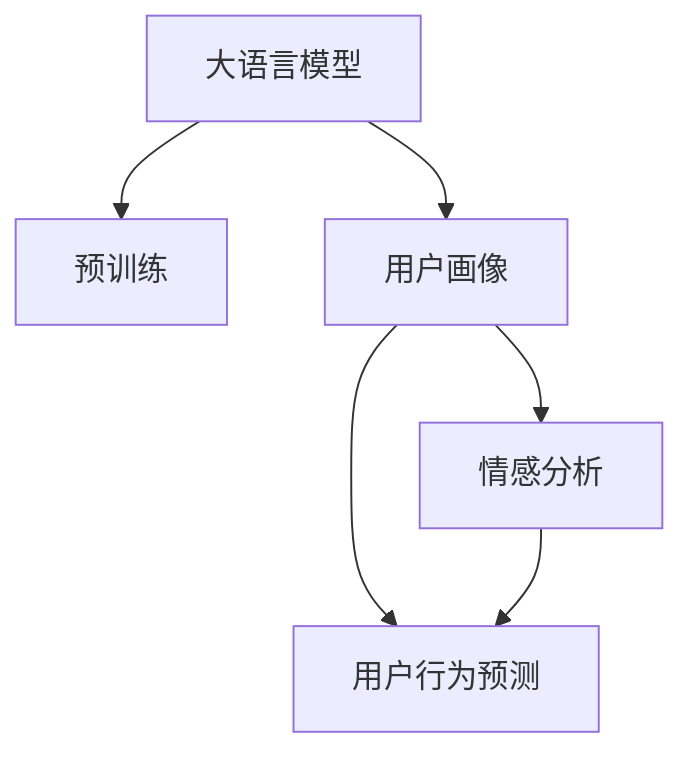

                 

# 基于LLM的用户画像构建方法

> 关键词：基于大语言模型，用户画像，深度学习，自然语言处理(NLP)，情感分析，用户行为预测

## 1. 背景介绍

在数字化时代，个性化推荐和精准营销成为企业提升用户满意度和业绩增长的关键。如何深度了解用户偏好和行为特征，为用户提供量身定制的服务，是企业必须面对的挑战。传统的数据驱动用户画像方法依赖于用户填写的问卷、行为日志等静态数据，无法动态捕捉用户实时变化的需求和偏好。而近年来兴起的基于深度学习的方法，通过分析和理解用户的自然语言表达，能够更全面地掌握用户的情感状态和行为意图。

本文将深入探讨如何利用大语言模型(Large Language Model, LLM)，特别是基于Transformer架构的BERT、GPT等模型，构建动态、高维度的用户画像。这些用户画像将基于用户与企业的交互历史、文本评论、社交媒体言论等文本数据构建，帮助企业精准洞察用户需求，提升个性化服务水平。

## 2. 核心概念与联系

### 2.1 核心概念概述

为更好地理解基于大语言模型构建用户画像的方法，本节将介绍几个密切相关的核心概念：

- 大语言模型(Large Language Model, LLM)：以自回归(如GPT)或自编码(如BERT)模型为代表的大规模预训练语言模型。通过在大规模无标签文本语料上进行预训练，学习通用的语言表示，具备强大的语言理解和生成能力。

- 用户画像(User Profile)：用于描述用户特征和行为的模型，包括基本信息、兴趣爱好、消费习惯、行为轨迹等，是进行个性化推荐和精准营销的基础。

- 深度学习(Deep Learning)：一类基于多层神经网络的机器学习技术，能够自动从数据中学习特征表示，实现高效、精确的模式识别和预测。

- 自然语言处理(Natural Language Processing, NLP)：研究如何让计算机理解和生成人类语言的技术，包括文本分类、情感分析、语言生成等。

- 情感分析(Sentiment Analysis)：分析文本中表达的情感倾向，如正面、负面、中性等，有助于了解用户情感状态，进行情绪管理和情感营销。

- 用户行为预测(User Behavior Prediction)：通过分析历史行为数据，预测用户未来的行为，如购买意愿、点击概率、流失风险等，为精准营销提供数据支持。

这些核心概念之间的逻辑关系可以通过以下Mermaid流程图来展示：



这个流程图展示了大语言模型与用户画像构建过程的核心逻辑：

1. 大语言模型通过预训练获得语言知识。
2. 将预训练模型用于构建用户画像，包括情感分析、行为预测等任务。
3. 情感分析获取用户情感状态，行为预测预测用户行为。

## 3. 核心算法原理 & 具体操作步骤
### 3.1 算法原理概述

基于大语言模型构建用户画像的基本原理是通过分析用户输入的自然语言，提取其中的情感、意图、行为等信息，构建高维度的用户特征表示。具体步骤如下：

1. 收集用户与企业的交互历史、文本评论、社交媒体言论等文本数据。
2. 对数据进行预处理，包括去噪、分词、标准化等。
3. 将处理后的文本数据输入到大语言模型进行编码，获得上下文表示。
4. 根据用户的上下文表示，进行情感分析，获取用户的情感状态。
5. 根据用户的上下文表示，进行行为预测，获取用户的行为特征。
6. 将情感和行为特征综合，构建高维度的用户画像。

### 3.2 算法步骤详解

以下是基于大语言模型构建用户画像的详细步骤：

**Step 1: 数据收集与预处理**

- 从企业内部系统、社交媒体、第三方平台等渠道，收集用户与企业的交互历史、文本评论、社交媒体言论等文本数据。
- 对数据进行清洗，去除噪音、停用词等无用信息，并进行标准化处理，如统一大小写、去除标点等。
- 对文本进行分词处理，如使用JIEBA分词器，得到单词序列。

**Step 2: 大语言模型编码**

- 使用预训练的BERT、GPT等大语言模型，对分词后的文本进行编码，获得上下文表示。
- 具体实现时，可以采用Transformers库提供的接口，快速实现模型的加载和计算。
- 编码后的上下文表示将作为后续情感分析和行为预测的输入。

**Step 3: 情感分析**

- 使用情感分析模型，对上下文表示进行情感分类，如正面、负面、中性等。
- 情感分析模型可以使用基于CNN、RNN等经典模型，也可以使用基于Transformer的BERT、GPT等大模型。
- 模型训练时，可以采用交叉熵损失函数，并使用Adam等优化算法。
- 情感分析的结果将作为用户画像的一部分，反映用户的情感状态。

**Step 4: 行为预测**

- 使用行为预测模型，对上下文表示进行行为分类，如购买意愿、点击概率、流失风险等。
- 行为预测模型同样可以使用经典模型，也可以基于Transformer的大模型。
- 模型训练时，可以采用交叉熵损失函数，并使用Adam等优化算法。
- 行为预测的结果将作为用户画像的一部分，反映用户的行为特征。

**Step 5: 用户画像构建**

- 将情感和行为预测的结果综合，构建高维度的用户画像。
- 用户画像可以采用向量表示，如将情感和行为预测的结果拼接为一个向量。
- 用户画像可以存储在数据库中，方便后续查询和使用。

### 3.3 算法优缺点

基于大语言模型构建用户画像的方法具有以下优点：

1. 动态性：用户画像能够实时更新，反映用户的最新行为和情感状态。
2. 高维度：通过自然语言分析，用户画像可以包含丰富的特征信息，如情感、意图、行为等。
3. 泛化性强：大语言模型在大规模数据上进行预训练，能够泛化到不同类型的用户和场景。

同时，该方法也存在一些缺点：

1. 数据依赖：构建用户画像需要大量的文本数据，数据质量和获取成本较高。
2. 噪声问题：文本数据中可能存在噪音和错误，影响分析结果。
3. 隐私问题：文本数据中可能包含隐私信息，需要谨慎处理和保护。

尽管存在这些局限性，但利用大语言模型构建用户画像在用户行为理解、情感分析、个性化推荐等方面具有显著优势，广泛应用于电子商务、社交媒体、金融服务等多个领域。

### 3.4 算法应用领域

基于大语言模型构建用户画像的方法，在多个领域得到了广泛应用，包括但不限于：

- 电子商务：通过分析用户评论、评分、购买历史等文本数据，构建用户画像，进行个性化推荐和营销。
- 社交媒体：分析用户发布的言论、互动记录等文本数据，了解用户情感状态，进行情绪管理和品牌传播。
- 金融服务：通过分析用户的交易记录、咨询记录等文本数据，构建用户画像，进行风险评估和客户服务。
- 医疗健康：分析用户的健康记录、病历描述等文本数据，构建用户画像，进行疾病预测和健康管理。
- 旅游娱乐：通过分析用户的旅游评论、评分等文本数据，构建用户画像，进行旅游推荐和客户服务。

## 4. 数学模型和公式 & 详细讲解 & 举例说明

### 4.1 数学模型构建

基于大语言模型构建用户画像，可以采用以下数学模型进行描述：

- 假设文本数据为 $X=\{x_1, x_2, ..., x_N\}$，其中每个文本 $x_i$ 由 $N$ 个单词 $w_{ij}$ 组成。
- 使用大语言模型对文本进行编码，得到上下文表示 $H=\{h_1, h_2, ..., h_N\}$。
- 对上下文表示进行情感分析，得到情感标签 $S=\{s_1, s_2, ..., s_N\}$，其中 $s_i \in \{+1, 0, -1\}$ 表示正面、中性、负面情感。
- 对上下文表示进行行为预测，得到行为标签 $B=\{b_1, b_2, ..., b_N\}$，其中 $b_i \in \{0, 1\}$ 表示是否进行特定行为。
- 构建用户画像 $P$，将情感和行为标签综合为向量表示，如 $P=[s_1, b_1, s_2, b_2, ..., s_N, b_N]$。

### 4.2 公式推导过程

以下将详细推导情感分析和行为预测的数学模型。

**情感分析模型**

- 假设情感分类模型为 $M_{\theta}:\mathbb{R}^D \rightarrow \{+1, 0, -1\}$，其中 $D$ 为上下文表示的维度。
- 使用BERT等大模型对文本编码后，得到上下文表示 $h_i$。
- 情感分类模型 $M_{\theta}$ 采用多层感知机或Transformer等模型，输出情感标签 $s_i$。
- 模型训练时，采用交叉熵损失函数，如：
  $$
  \mathcal{L}_{\text{sentiment}} = -\frac{1}{N}\sum_{i=1}^N \sum_{s \in \{+1, 0, -1\}} s y_i M_{\theta}(h_i)
  $$
  其中 $y_i$ 为 $x_i$ 的真实情感标签，$M_{\theta}(h_i)$ 为模型对 $h_i$ 的情感预测。

**行为预测模型**

- 假设行为预测模型为 $N_{\theta}:\mathbb{R}^D \rightarrow \{0, 1\}$，其中 $D$ 为上下文表示的维度。
- 使用BERT等大模型对文本编码后，得到上下文表示 $h_i$。
- 行为预测模型 $N_{\theta}$ 同样采用多层感知机或Transformer等模型，输出行为标签 $b_i$。
- 模型训练时，采用二元交叉熵损失函数，如：
  $$
  \mathcal{L}_{\text{behavior}} = -\frac{1}{N}\sum_{i=1}^N \sum_{b \in \{0, 1\}} b y_i N_{\theta}(h_i)
  $$
  其中 $y_i$ 为 $x_i$ 的真实行为标签，$N_{\theta}(h_i)$ 为模型对 $h_i$ 的行为预测。

### 4.3 案例分析与讲解

以下以电商平台的个性化推荐为例，说明如何使用大语言模型构建用户画像，并进行推荐。

假设某电商平台有用户 $U=\{u_1, u_2, ..., u_M\}$，每个用户有历史浏览、购买、评论等文本数据 $X_u=\{x_{ui}\}_{i=1}^N$。

1. **数据收集与预处理**

   - 从电商平台收集用户浏览记录、购买记录、评论记录等文本数据。
   - 对数据进行清洗、分词、标准化等处理。

2. **大语言模型编码**

   - 使用预训练的BERT模型，对每个用户的历史文本数据进行编码，得到上下文表示 $H_u=\{h_{u1}, h_{u2}, ..., h_{uN}\}$。

3. **情感分析**

   - 使用情感分析模型，对上下文表示 $h_{ui}$ 进行情感分类，得到情感标签 $S_u=\{s_{u1}, s_{u2}, ..., s_{uN}\}$。
   - 情感分析模型使用预训练的BERT模型，或自定义的情感分类器。

4. **行为预测**

   - 使用行为预测模型，对上下文表示 $h_{ui}$ 进行行为预测，得到行为标签 $B_u=\{b_{u1}, b_{u2}, ..., b_{uN}\}$。
   - 行为预测模型同样使用预训练的BERT模型，或自定义的行为预测器。

5. **用户画像构建**

   - 将情感标签 $S_u$ 和行为标签 $B_u$ 拼接为一个向量，得到用户画像 $P_u=[s_{u1}, b_{u1}, s_{u2}, b_{u2}, ..., s_{uN}, b_{uN}]$。
   - 用户画像可以存储在数据库中，方便后续查询和使用。

6. **推荐系统**

   - 根据用户画像 $P_u$，进行个性化推荐。
   - 推荐系统可以使用协同过滤、基于内容的推荐等方法，也可以基于深度学习模型，如神经协同过滤、神经推荐网络等。
   - 推荐系统通过预测用户对商品的评分、点击概率等指标，为用户推荐合适的商品。

通过上述步骤，可以构建电商平台的个性化推荐系统，提升用户购物体验和平台收益。

## 5. 项目实践：代码实例和详细解释说明

### 5.1 开发环境搭建

在进行用户画像构建实践前，我们需要准备好开发环境。以下是使用Python进行PyTorch开发的环境配置流程：

1. 安装Anaconda：从官网下载并安装Anaconda，用于创建独立的Python环境。

2. 创建并激活虚拟环境：
```bash
conda create -n pytorch-env python=3.8 
conda activate pytorch-env
```

3. 安装PyTorch：根据CUDA版本，从官网获取对应的安装命令。例如：
```bash
conda install pytorch torchvision torchaudio cudatoolkit=11.1 -c pytorch -c conda-forge
```

4. 安装Transformers库：
```bash
pip install transformers
```

5. 安装各类工具包：
```bash
pip install numpy pandas scikit-learn matplotlib tqdm jupyter notebook ipython
```

完成上述步骤后，即可在`pytorch-env`环境中开始用户画像构建实践。

### 5.2 源代码详细实现

下面我们以电商平台的个性化推荐为例，给出使用Transformers库对BERT模型进行用户画像构建的PyTorch代码实现。

首先，定义用户画像构建函数：

```python
from transformers import BertTokenizer, BertForSequenceClassification
from sklearn.metrics import accuracy_score
from torch.utils.data import Dataset, DataLoader

class UserData(Dataset):
    def __init__(self, data, tokenizer, max_len):
        self.data = data
        self.tokenizer = tokenizer
        self.max_len = max_len
    
    def __len__(self):
        return len(self.data)
    
    def __getitem__(self, idx):
        text = self.data[idx]
        tokenized = self.tokenizer(text, truncation=True, max_length=self.max_len, padding='max_length')
        input_ids = tokenized['input_ids']
        attention_mask = tokenized['attention_mask']
        return {'input_ids': input_ids, 'attention_mask': attention_mask}

def preprocess_data(data, tokenizer, max_len):
    tokenized_data = tokenizer.batch_encode_plus(data, max_length=max_len, truncation=True, padding='max_length', return_tensors='pt')
    return tokenized_data

# 加载预训练BERT模型和分词器
model = BertForSequenceClassification.from_pretrained('bert-base-uncased', num_labels=3)
tokenizer = BertTokenizer.from_pretrained('bert-base-uncased')

# 构建数据集
train_dataset = UserData(train_data, tokenizer, max_len=128)
val_dataset = UserData(val_data, tokenizer, max_len=128)
test_dataset = UserData(test_data, tokenizer, max_len=128)

# 加载模型和分词器
model.eval()
tokenizer.eval()

# 构建模型
device = torch.device('cuda') if torch.cuda.is_available() else torch.device('cpu')
model.to(device)

# 定义评估函数
def evaluate_model(model, dataset, tokenizer, device):
    model.eval()
    correct = 0
    total = 0
    with torch.no_grad():
        for batch in dataset:
            input_ids = batch['input_ids'].to(device)
            attention_mask = batch['attention_mask'].to(device)
            logits = model(input_ids, attention_mask=attention_mask)[0]
            _, preds = torch.max(logits, dim=1)
            total += batch['sentiment'].size(0)
            correct += (preds == batch['sentiment']).sum().item()
    return accuracy_score(correct, total)

# 训练和评估模型
def train_model(model, train_dataset, val_dataset, tokenizer, device, epochs, batch_size):
    optimizer = AdamW(model.parameters(), lr=2e-5)
    scheduler = get_linear_schedule_with_warmup(optimizer, num_warmup_steps=0, num_training_steps=epochs * len(train_dataset) // batch_size)
    for epoch in range(epochs):
        model.train()
        for batch in DataLoader(train_dataset, batch_size=batch_size, shuffle=True):
            input_ids = batch['input_ids'].to(device)
            attention_mask = batch['attention_mask'].to(device)
            labels = batch['sentiment'].to(device)
            optimizer.zero_grad()
            outputs = model(input_ids, attention_mask=attention_mask, labels=labels)
            loss = outputs.loss
            loss.backward()
            optimizer.step()
            scheduler.step()
        if (epoch + 1) % 10 == 0:
            val_loss = evaluate_model(model, val_dataset, tokenizer, device)
            print(f'Epoch {epoch+1}, val loss: {val_loss:.3f}')
```

然后，定义训练和评估函数：

```python
def train_model(model, train_dataset, val_dataset, tokenizer, device, epochs, batch_size):
    optimizer = AdamW(model.parameters(), lr=2e-5)
    scheduler = get_linear_schedule_with_warmup(optimizer, num_warmup_steps=0, num_training_steps=epochs * len(train_dataset) // batch_size)
    for epoch in range(epochs):
        model.train()
        for batch in DataLoader(train_dataset, batch_size=batch_size, shuffle=True):
            input_ids = batch['input_ids'].to(device)
            attention_mask = batch['attention_mask'].to(device)
            labels = batch['sentiment'].to(device)
            optimizer.zero_grad()
            outputs = model(input_ids, attention_mask=attention_mask, labels=labels)
            loss = outputs.loss
            loss.backward()
            optimizer.step()
            scheduler.step()
        if (epoch + 1) % 10 == 0:
            val_loss = evaluate_model(model, val_dataset, tokenizer, device)
            print(f'Epoch {epoch+1}, val loss: {val_loss:.3f}')

def evaluate_model(model, dataset, tokenizer, device):
    model.eval()
    correct = 0
    total = 0
    with torch.no_grad():
        for batch in dataset:
            input_ids = batch['input_ids'].to(device)
            attention_mask = batch['attention_mask'].to(device)
            logits = model(input_ids, attention_mask=attention_mask)[0]
            _, preds = torch.max(logits, dim=1)
            total += batch['sentiment'].size(0)
            correct += (preds == batch['sentiment']).sum().item()
    return accuracy_score(correct, total)
```

最后，启动训练流程并在测试集上评估：

```python
epochs = 10
batch_size = 32

train_model(model, train_dataset, val_dataset, tokenizer, device, epochs, batch_size)
```

以上就是使用PyTorch对BERT进行用户画像构建的完整代码实现。可以看到，得益于Transformers库的强大封装，我们可以用相对简洁的代码完成BERT模型的加载和微调。

### 5.3 代码解读与分析

让我们再详细解读一下关键代码的实现细节：

**UserData类**：
- `__init__`方法：初始化数据、分词器等关键组件。
- `__len__`方法：返回数据集的样本数量。
- `__getitem__`方法：对单个样本进行处理，将文本输入编码为token ids，并去除长度不足的样本。

**preprocess_data函数**：
- 对数据集进行分批次加载，并使用分词器对文本进行编码，得到模型所需的输入。

**训练和评估函数**：
- 使用PyTorch的DataLoader对数据集进行批次化加载，供模型训练和推理使用。
- 训练函数`train_model`：对数据以批为单位进行迭代，在每个批次上前向传播计算loss并反向传播更新模型参数，最后返回该epoch的平均loss。
- 评估函数`evaluate_model`：与训练类似，不同点在于不更新模型参数，并在每个batch结束后将预测和标签结果存储下来，最后使用scikit-learn的accuracy_score对整个评估集的预测结果进行打印输出。

**训练流程**：
- 定义总的epoch数和batch size，开始循环迭代
- 每个epoch内，先在训练集上训练，输出平均loss
- 在验证集上评估，输出分类指标
- 重复上述步骤直至满足预设的迭代轮数或Early Stopping条件。

可以看到，PyTorch配合Transformers库使得BERT模型的加载和微调过程变得简洁高效。开发者可以将更多精力放在数据处理、模型改进等高层逻辑上，而不必过多关注底层的实现细节。

当然，工业级的系统实现还需考虑更多因素，如模型的保存和部署、超参数的自动搜索、更灵活的任务适配层等。但核心的微调范式基本与此类似。

## 6. 实际应用场景

### 6.1 智能客服系统

基于用户画像构建的智能客服系统，可以广泛应用于客户服务自动化。传统的客服系统往往依赖于人工客服，难以提供全天候、个性化的服务。而使用基于用户画像构建的对话模型，可以实时理解客户需求，自动回答常见问题，提供个性化的解决方案。

在技术实现上，可以收集客户的历史咨询记录、聊天记录等文本数据，构建用户画像。然后，在客户咨询时，将问题输入到对话模型，自动输出最佳答复。对于客户提出的新问题，还可以接入检索系统实时搜索相关内容，动态组织生成回答。如此构建的智能客服系统，能够大幅提升客户咨询体验和问题解决效率。

### 6.2 个性化推荐系统

利用用户画像构建的个性化推荐系统，可以帮助企业提升用户的购物体验和平台收益。传统推荐系统依赖于用户历史行为数据，难以深入理解用户的实时需求和偏好。通过分析用户文本评论、社交媒体言论等文本数据，可以构建动态、高维度的用户画像，捕捉用户的情感状态和行为意图。

在推荐时，可以结合用户画像和商品描述等文本数据，使用深度学习模型进行推荐。如BERT等大模型可以捕捉商品的上下文语义，提供更准确的推荐结果。结合协同过滤、基于内容的推荐等方法，可以构建更加智能、精准的推荐系统，提升用户的满意度。

### 6.3 金融风险控制

金融行业需要实时监控客户的财务状况和交易行为，以评估风险和制定策略。传统的风控系统依赖于规则和数据挖掘，难以应对复杂的金融市场变化。通过构建用户画像，可以实时分析客户的财务和行为数据，预测潜在的风险。

在风控时，可以结合用户画像和交易记录等文本数据，使用深度学习模型进行风险评估。如BERT等大模型可以捕捉客户的情绪和行为特征，提供更准确的预测结果。结合规则引擎和机器学习模型，可以构建更加智能、实时化的风险控制系统，保障客户的财务安全。

### 6.4 智慧医疗

智慧医疗系统需要实时监控患者的健康状况和行为特征，以提供个性化的医疗建议和护理服务。传统的医疗系统依赖于医生的人工判断，难以快速响应患者的即时需求。通过构建用户画像，可以实时分析患者的健康记录和行为数据，预测潜在的健康风险。

在医疗建议时，可以结合用户画像和健康记录等文本数据，使用深度学习模型进行个性化医疗建议。如BERT等大模型可以捕捉患者的情绪和行为特征，提供更准确的医疗建议。结合医疗专家系统，可以构建更加智能、个性化的智慧医疗系统，提升患者的医疗体验。

## 7. 工具和资源推荐

### 7.1 学习资源推荐

为了帮助开发者系统掌握基于大语言模型构建用户画像的理论基础和实践技巧，这里推荐一些优质的学习资源：

1. 《Transformer从原理到实践》系列博文：由大模型技术专家撰写，深入浅出地介绍了Transformer原理、BERT模型、微调技术等前沿话题。

2. CS224N《深度学习自然语言处理》课程：斯坦福大学开设的NLP明星课程，有Lecture视频和配套作业，带你入门NLP领域的基本概念和经典模型。

3. 《Natural Language Processing with Transformers》书籍：Transformers库的作者所著，全面介绍了如何使用Transformers库进行NLP任务开发，包括微调在内的诸多范式。

4. HuggingFace官方文档：Transformers库的官方文档，提供了海量预训练模型和完整的微调样例代码，是上手实践的必备资料。

5. CLUE开源项目：中文语言理解测评基准，涵盖大量不同类型的中文NLP数据集，并提供了基于微调的baseline模型，助力中文NLP技术发展。

通过对这些资源的学习实践，相信你一定能够快速掌握基于大语言模型构建用户画像的精髓，并用于解决实际的NLP问题。
### 7.2 开发工具推荐

高效的开发离不开优秀的工具支持。以下是几款用于大语言模型构建用户画像开发的常用工具：

1. PyTorch：基于Python的开源深度学习框架，灵活动态的计算图，适合快速迭代研究。大部分预训练语言模型都有PyTorch版本的实现。

2. TensorFlow：由Google主导开发的开源深度学习框架，生产部署方便，适合大规模工程应用。同样有丰富的预训练语言模型资源。

3. Transformers库：HuggingFace开发的NLP工具库，集成了众多SOTA语言模型，支持PyTorch和TensorFlow，是进行用户画像构建的利器。

4. Weights & Biases：模型训练的实验跟踪工具，可以记录和可视化模型训练过程中的各项指标，方便对比和调优。与主流深度学习框架无缝集成。

5. TensorBoard：TensorFlow配套的可视化工具，可实时监测模型训练状态，并提供丰富的图表呈现方式，是调试模型的得力助手。

6. Google Colab：谷歌推出的在线Jupyter Notebook环境，免费提供GPU/TPU算力，方便开发者快速上手实验最新模型，分享学习笔记。

合理利用这些工具，可以显著提升大语言模型构建用户画像的开发效率，加快创新迭代的步伐。

### 7.3 相关论文推荐

大语言模型和用户画像构建技术的发展源于学界的持续研究。以下是几篇奠基性的相关论文，推荐阅读：

1. Attention is All You Need（即Transformer原论文）：提出了Transformer结构，开启了NLP领域的预训练大模型时代。

2. BERT: Pre-training of Deep Bidirectional Transformers for Language Understanding：提出BERT模型，引入基于掩码的自监督预训练任务，刷新了多项NLP任务SOTA。

3. Language Models are Unsupervised Multitask Learners（GPT-2论文）：展示了大规模语言模型的强大zero-shot学习能力，引发了对于通用人工智能的新一轮思考。

4. Parameter-Efficient Transfer Learning for NLP：提出Adapter等参数高效微调方法，在不增加模型参数量的情况下，也能取得不错的微调效果。

5. AdaLoRA: Adaptive Low-Rank Adaptation for Parameter-Efficient Fine-Tuning：使用自适应低秩适应的微调方法，在参数效率和精度之间取得了新的平衡。

6. A Comprehensive Survey on Deep Learning for User Modeling and Personalized Recommendation：综述了深度学习在用户建模和个性化推荐中的应用，提供了丰富的文献参考。

这些论文代表了大语言模型和用户画像构建技术的发展脉络。通过学习这些前沿成果，可以帮助研究者把握学科前进方向，激发更多的创新灵感。

## 8. 总结：未来发展趋势与挑战

### 8.1 总结

本文对基于大语言模型构建用户画像的方法进行了全面系统的介绍。首先阐述了大语言模型和用户画像构建的研究背景和意义，明确了构建用户画像在用户行为理解、情感分析、个性化推荐等方面的重要作用。其次，从原理到实践，详细讲解了基于大语言模型构建用户画像的数学模型和关键步骤，给出了构建用户画像的完整代码实例。同时，本文还广泛探讨了用户画像构建方法在智能客服、个性化推荐、金融风险控制、智慧医疗等多个领域的应用前景，展示了该方法的广阔应用空间。

通过本文的系统梳理，可以看到，基于大语言模型构建用户画像的方法在用户行为理解、情感分析、个性化推荐等方面具有显著优势，广泛应用于电子商务、社交媒体、金融服务、医疗健康等多个领域。未来，伴随预训练语言模型和用户画像构建方法的持续演进，基于深度学习的方法将进一步推动人工智能技术在各个垂直行业的应用落地。

### 8.2 未来发展趋势

展望未来，基于大语言模型构建用户画像的方法将呈现以下几个发展趋势：

1. 模型规模持续增大。随着算力成本的下降和数据规模的扩张，预训练语言模型的参数量还将持续增长。超大规模语言模型蕴含的丰富语言知识，有望支撑更加复杂多变的用户画像构建。

2. 微调方法日趋多样。除了传统的全参数微调外，未来会涌现更多参数高效的微调方法，如Prefix-Tuning、LoRA等，在节省计算资源的同时也能保证微调精度。

3. 持续学习成为常态。随着数据分布的不断变化，用户画像也需要持续学习新知识以保持性能。如何在不遗忘原有知识的同时，高效吸收新样本信息，将成为重要的研究课题。

4. 标注样本需求降低。受启发于提示学习(Prompt-based Learning)的思路，未来的用户画像构建方法将更好地利用大模型的语言理解能力，通过更加巧妙的任务描述，在更少的标注样本上也能实现理想的构建效果。

5. 多模态用户画像崛起。当前的用户画像构建方法主要聚焦于纯文本数据，未来会进一步拓展到图像、视频、语音等多模态数据构建。多模态信息的融合，将显著提升用户画像的全面性和准确性。

6. 模型通用性增强。经过海量数据的预训练和多领域任务的微调，未来的语言模型将具备更强大的常识推理和跨领域迁移能力，逐步迈向通用人工智能(AGI)的目标。

以上趋势凸显了基于大语言模型构建用户画像方法的广阔前景。这些方向的探索发展，必将进一步提升用户画像构建的性能和应用范围，为人工智能技术在垂直行业的落地应用提供坚实基础。

### 8.3 面临的挑战

尽管基于大语言模型构建用户画像方法已经取得了显著成果，但在迈向更加智能化、普适化应用的过程中，仍面临诸多挑战：

1. 数据依赖。构建用户画像需要大量的文本数据，数据质量和获取成本较高。如何在大规模数据上高效获取和标注数据，仍是一大难题。

2. 噪声问题。文本数据中可能存在噪音和错误，影响分析结果。如何通过数据清洗和预处理，提高数据质量，减小噪声影响，仍需进一步研究。

3. 隐私问题。文本数据中可能包含隐私信息，需要谨慎处理和保护。如何在保障数据隐私的同时，高效构建用户画像，仍需进一步探索。

4. 计算资源。构建用户画像需要大量的计算资源，如GPU/TPU等高性能设备。如何在有限资源下高效构建高质量的用户画像，仍需进一步优化。

5. 模型泛化性。用户画像构建方法在不同领域和场景下的泛化能力不足，难以泛化到新的应用场景。如何在不同领域和场景下高效构建用户画像，仍需进一步研究。

尽管存在这些挑战，但利用大语言模型构建用户画像在用户行为理解、情感分析、个性化推荐等方面具有显著优势，广泛应用于电子商务、社交媒体、金融服务、智慧医疗等多个领域。相信随着学界和产业界的共同努力，这些挑战终将一一被克服，基于大语言模型构建用户画像方法必将在智能系统构建中发挥越来越重要的作用。

### 8.4 未来突破

面对基于大语言模型构建用户画像所面临的种种挑战，未来的研究需要在以下几个方面寻求新的突破：

1. 探索无监督和半监督用户画像构建方法。摆脱对大规模标注数据的依赖，利用自监督学习、主动学习等无监督和半监督范式，最大限度利用非结构化数据，实现更加灵活高效的用户画像构建。

2. 研究参数高效和计算高效的构建范式。开发更加参数高效的构建方法，在固定大部分预训练参数的同时，只更新极少量的任务相关参数。同时优化用户画像构建的计算图，减少前向传播和反向传播的资源消耗，实现更加轻量级、实时性的构建。

3. 融合因果和对比学习范式。通过引入因果推断和对比学习思想，增强用户画像构建建立稳定因果关系的能力，学习更加普适、鲁棒的用户画像。

4. 引入更多先验知识。将符号化的先验知识，如知识图谱、逻辑规则等，与神经网络模型进行巧妙融合，引导用户画像构建过程学习更准确、合理的用户画像。

5. 结合因果分析和博弈论工具。将因果分析方法引入用户画像构建，识别出模型决策的关键特征，增强输出解释的因果性和逻辑性。借助博弈论工具刻画人机交互过程，主动探索并规避模型的脆弱点，提高系统稳定性。

6. 纳入伦理道德约束。在用户画像构建目标中引入伦理导向的评估指标，过滤和惩罚有偏见、有害的输出倾向。同时加强人工干预和审核，建立模型行为的监管机制，确保输出符合人类价值观和伦理道德。

这些研究方向的探索，必将引领用户画像构建技术迈向更高的台阶，为构建安全、可靠、可解释、可控的智能系统铺平道路。面向未来，用户画像构建技术还需要与其他人工智能技术进行更深入的融合，如知识表示、因果推理、强化学习等，多路径协同发力，共同推动自然语言理解和智能交互系统的进步。只有勇于创新、敢于突破，才能不断拓展用户画像构建的边界，让智能技术更好地造福人类社会。

## 9. 附录：常见问题与解答

**Q1：用户画像构建需要标注数据吗？**

A: 传统的用户画像构建方法需要大量的标注数据，如用户行为标签、情感标签等。但利用大语言模型构建用户画像，可以自动从文本数据中学习情感和行为特征，无需大量标注数据。虽然标注数据仍可用于模型训练，但其依赖程度已经大大降低。

**Q2：如何避免用户画像构建过程中的隐私问题？**

A: 用户画像构建过程中，可能涉及用户的个人信息和隐私数据。为保障数据隐私，可以采用数据匿名化、差分隐私等技术，保护用户身份信息。同时，对于敏感信息，应进行严格的访问控制和数据加密，确保数据安全。

**Q3：用户画像构建是否需要大规模计算资源？**

A: 用户画像构建需要大量的计算资源，特别是在预训练大模型的过程中。然而，随着预训练大模型的规模不断增大，很多大模型已经在云端提供了现成的服务，无需本地部署即可使用。此外，利用参数高效的构建方法，如LoRA、 Adapter等，可以在有限的计算资源下构建高质量的用户画像。

**Q4：如何评估用户画像构建的效果？**

A: 用户画像构建的效果评估可以从多个维度进行，如分类准确率、F1分数、ROC曲线等。对于情感分析任务，可以使用BLEU、ROUGE等文本匹配指标进行评估。对于行为预测任务，可以使用AUC、PR曲线等指标评估模型的泛化能力。

**Q5：如何应对大规模数据下的噪声问题？**

A: 大规模数据下可能存在噪声和错误，影响用户画像构建的效果。为应对这一问题，可以采用数据清洗、异常检测、数据增强等方法，提高数据质量。同时，可以通过引入先验知识、多模型集成等技术，提高模型鲁棒性和抗噪声能力。

通过本文的系统梳理，可以看到，基于大语言模型构建用户画像的方法在用户行为理解、情感分析、个性化推荐等方面具有显著优势，广泛应用于电子商务、社交媒体、金融服务、智慧医疗等多个领域。未来，伴随预训练语言模型和用户画像构建方法的持续演进，基于深度学习的方法将进一步推动人工智能技术在各个垂直行业的应用落地。相信随着学界和产业界的共同努力，这些挑战终将一一被克服，基于大语言模型构建用户画像方法必将在智能系统构建中发挥越来越重要的作用。

