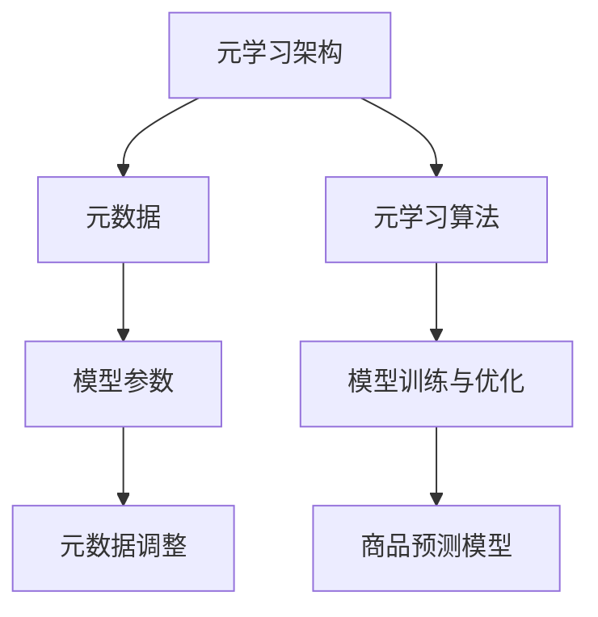

                 

# 基于元学习的新品上架性能预测

> 关键词：元学习,新品上架,性能预测,元架构,元数据,元学习算法

## 1. 背景介绍

### 1.1 问题由来
在零售业，随着线上线下融合日益加深，新品的上架性能预测变得越来越重要。传统的新品上架预测方法依赖于历史销售数据，但在实际应用中，由于不同商品特征的不同，往往需要针对每种商品进行单独建模。同时，由于数据量的不足，新品的预测效果常常不尽如人意。

近年来，随着元学习(Meta-Learning)技术的发展，我们发现可以更灵活、高效地构建和调整商品预测模型，以应对新品的预测挑战。元学习是一种通过学习模型间相似性来提高模型泛化性能的机器学习方法，特别适用于数据量较少的新品上架预测场景。

### 1.2 问题核心关键点
元学习的新品上架性能预测核心在于：

- **元学习架构**：通过元学习架构，可以在少量标注数据下，快速构建出针对新品的预测模型。
- **元数据设计**：合理设计元数据，是构建元学习架构的基础。
- **元学习算法**：选择合适的元学习算法，是模型效果的关键。
- **模型训练与优化**：通过训练和优化，将元学习架构应用到实际的商品预测任务中。

### 1.3 问题研究意义
研究元学习的新品上架性能预测方法，对于提升商品预测的精度、减少预测成本、加速商品上架流程具有重要意义。具体来说：

1. **提高预测精度**：元学习能够更好地捕捉商品特征间的相似性，快速构建出高效的预测模型。
2. **降低预测成本**：通过复用已有模型的结构，可以大幅减少针对每种商品单独建模的计算资源和时间。
3. **加速上架流程**：快速构建的预测模型可以显著提升商品上架后的销售预测速度和准确度。

## 2. 核心概念与联系

### 2.1 核心概念概述

为更好地理解基于元学习的新品上架性能预测方法，本节将介绍几个密切相关的核心概念：

- **元学习(Meta-Learning)**：是一种通过学习模型间相似性来提高模型泛化性能的机器学习方法，尤其适用于数据量较少但需要快速构建模型的情况。
- **元架构(Meta-Architecture)**：是一种设计用于元学习的模型架构，能够根据元数据灵活调整模型参数，构建出符合新任务的预测模型。
- **元数据(Meta-Data)**：是用于元学习架构的设计和训练的数据，通常包括商品的描述、特征等信息。
- **元学习算法(Meta-Learning Algorithm)**：是元学习架构的具体实现，能够通过训练过程，学习模型间的相似性和调整参数，构建出高效的预测模型。
- **模型训练与优化**：通过训练和优化元学习架构，将模型应用到实际的新品上架性能预测任务中，提升预测精度。

这些核心概念之间的逻辑关系可以通过以下Mermaid流程图来展示：



这个流程图展示了一些核心概念及其之间的关系：

1. 元学习架构通过元数据进行设计，并由元学习算法训练得到模型参数。
2. 模型参数与元数据通过调整，构建出商品预测模型。
3. 商品预测模型可以应用到具体的新品上架性能预测任务中。

这些概念共同构成了元学习架构的实现和应用框架，使其能够在少量标注数据下快速构建出高效的预测模型。

## 3. 核心算法原理 & 具体操作步骤
### 3.1 算法原理概述

基于元学习的新品上架性能预测，本质上是通过学习元数据和模型间的相似性，构建一个通用的模型架构，快速适应新任务。其核心思想是：

- **元数据**：将商品的描述、特征等信息作为元数据，用于构建和训练元学习架构。
- **元学习架构**：根据元数据设计一个通用的预测模型，并使用元学习算法，动态调整模型参数，适应新商品特征。
- **模型训练与优化**：通过训练元学习架构，得到模型参数，最终得到适用于新商品的预测模型。

### 3.2 算法步骤详解

基于元学习的新品上架性能预测一般包括以下几个关键步骤：

**Step 1: 准备元数据**
- 收集商品的描述、特征、销售历史等信息，作为元数据。
- 将元数据划分为训练集和测试集，用于构建和评估元学习架构。

**Step 2: 设计元学习架构**
- 根据商品特征，设计一个通用的预测模型，如线性回归、决策树等。
- 定义元架构的关键参数，如学习率、正则化系数、激活函数等。
- 使用已有的商品数据训练模型，得到元架构的初始参数。

**Step 3: 应用元学习算法**
- 选择元学习算法，如MAML（模型平均训练）、Reptile等。
- 使用训练集上的元数据，训练元学习算法，学习模型间的相似性。
- 根据测试集上的元数据，调整元架构的参数，构建出新商品的预测模型。

**Step 4: 模型训练与优化**
- 使用元架构构建出的预测模型，对新商品进行性能预测。
- 使用测试集上的元数据，评估模型性能，调整元架构的参数，优化模型。
- 重复上述步骤，直至模型满足预设的性能要求。

**Step 5: 实际应用**
- 将优化后的模型应用于实际的商品上架性能预测任务中。
- 实时监测模型性能，不断调整参数，确保预测结果的准确性。
- 持续收集新商品的数据，不断更新元学习架构，提升预测效果。

以上是基于元学习的新品上架性能预测的一般流程。在实际应用中，还需要针对具体任务的特点，对元学习架构的各环节进行优化设计，如改进元数据设计，引入更多元学习算法，搜索最优的元架构超参数等，以进一步提升模型性能。

### 3.3 算法优缺点

基于元学习的新品上架性能预测方法具有以下优点：

1. **灵活性高**：可以适应多种商品特征和数据分布，快速构建预测模型。
2. **泛化能力强**：通过学习模型间的相似性，能够有效降低过拟合风险，提升预测精度。
3. **适应性强**：新商品的数据量少，但预测模型可以很好地利用已有商品的数据进行泛化。
4. **可解释性好**：元学习架构的构建和优化过程透明，模型参数调整有明确理论依据。

同时，该方法也存在一定的局限性：

1. **数据需求高**：元学习架构需要大量的元数据来设计模型和训练，数据获取成本较高。
2. **模型复杂**：元架构的设计和训练需要较高的技术门槛，需要丰富的领域知识和经验。
3. **计算资源要求高**：元学习算法需要较长的训练时间，计算资源消耗较大。
4. **模型泛化能力有限**：如果元数据与新商品特征相差较大，模型泛化效果可能不佳。

尽管存在这些局限性，但就目前而言，基于元学习的方法是解决数据量较少的新品上架性能预测问题的有效途径。未来相关研究的重点在于如何进一步降低数据需求，提高模型的可解释性和泛化能力，同时兼顾模型效率和计算资源消耗。

### 3.4 算法应用领域

基于元学习的新品上架性能预测方法，在零售、电商等领域已经得到了广泛的应用，覆盖了商品推荐、库存管理、销售预测等多个环节。例如：

- **商品推荐**：通过预测用户对新商品的购买意愿，快速推荐给用户，提升用户体验和销售额。
- **库存管理**：预测新商品上架后的销量，优化库存水平，减少库存积压和缺货现象。
- **销售预测**：预测新商品在不同时间段的销售情况，帮助商家制定促销策略，优化营销效果。

除了上述这些经典应用外，元学习的方法还在更多场景中得到了创新性的应用，如异常检测、用户行为分析等，为零售和电商的智能化运营提供了新的思路。

## 4. 数学模型和公式 & 详细讲解 & 举例说明
### 4.1 数学模型构建

本节将使用数学语言对基于元学习的新品上架性能预测过程进行更加严格的刻画。

假设商品特征表示为 $x_i \in \mathbb{R}^d$，销售数据表示为 $y_i \in \mathbb{R}$，训练集表示为 $\mathcal{D} = \{(x_i, y_i)\}_{i=1}^N$，测试集表示为 $\mathcal{D}_{test} = \{(x_i, y_i)\}_{i=1}^{N_{test}}$。

定义模型 $M_{\theta}(x)$ 为通用的预测模型，其中 $\theta$ 为模型的参数。元架构的初始参数为 $\theta_0$。

元学习的目标是最小化预测误差，即：

$$
\min_{\theta} \sum_{i=1}^N (y_i - M_{\theta}(x_i))^2
$$

在实践中，我们通常使用基于梯度的优化算法（如SGD、Adam等）来近似求解上述最优化问题。设 $\eta$ 为学习率，则参数的更新公式为：

$$
\theta \leftarrow \theta - \eta \nabla_{\theta}\mathcal{L}(\theta) - \eta\lambda\theta
$$

其中 $\nabla_{\theta}\mathcal{L}(\theta)$ 为损失函数对参数 $\theta$ 的梯度，可通过反向传播算法高效计算。

### 4.2 公式推导过程

以下我们以线性回归模型为例，推导元学习预测误差和梯度的计算公式。

假设模型 $M_{\theta}$ 为线性回归模型，则有：

$$
M_{\theta}(x) = \theta^T x
$$

其中 $\theta$ 为模型参数，$x$ 为输入特征。

预测误差 $e_i$ 定义为：

$$
e_i = y_i - M_{\theta}(x_i)
$$

元学习目标函数定义为：

$$
\mathcal{L}(\theta) = \frac{1}{N}\sum_{i=1}^N e_i^2
$$

根据链式法则，预测误差对模型参数 $\theta$ 的梯度为：

$$
\frac{\partial \mathcal{L}(\theta)}{\partial \theta} = -\frac{2}{N}\sum_{i=1}^N x_i (y_i - \theta^T x_i)
$$

在得到梯度后，即可带入参数更新公式，完成模型的迭代优化。重复上述过程直至收敛，最终得到适用于新商品的预测模型参数 $\theta$。

### 4.3 案例分析与讲解

为了更好地理解元学习预测模型的工作原理和优化过程，这里提供一个简单的案例分析。

假设有一个新商品，其特征 $x = [1, 2, 3]$，已有的商品数据为 $\mathcal{D} = \{(1, 10), (2, 15), (3, 18)\}$。我们希望构建一个线性回归模型，预测该新商品的销售量 $y$。

1. **元数据设计**：将已有的商品数据作为元数据，特征和销售量分别为 $x$ 和 $y$。

2. **模型设计**：设计一个线性回归模型 $M_{\theta}(x) = \theta^T x$，其中 $\theta = [\theta_1, \theta_2]$。

3. **初始化**：假设 $\theta_0 = [1, 1]$，作为模型初始参数。

4. **模型训练**：使用已有的商品数据 $\mathcal{D}$，训练线性回归模型。根据梯度下降算法，更新模型参数：

   $$
   \theta_1 \leftarrow \theta_1 - \eta \frac{1}{3} (10 - 1*1 - 15*2 - 18*3)
   $$
   $$
   \theta_2 \leftarrow \theta_2 - \eta \frac{1}{3} (10 - 1*2 - 15*3 - 18*1)
   $$

   其中 $\eta$ 为学习率。

5. **模型调整**：使用测试集 $\mathcal{D}_{test}$ 上的新商品数据 $x = [1, 2, 3]$，计算预测误差：

   $$
   e_1 = y - M_{\theta}(x)
   $$

   根据预测误差，调整模型参数：

   $$
   \theta_1 \leftarrow \theta_1 - \eta \frac{1}{1} (y - M_{\theta}(x))
   $$
   $$
   \theta_2 \leftarrow \theta_2 - \eta \frac{1}{1} (y - M_{\theta}(x))
   $$

   其中 $y$ 为新商品的预测销售量，$\eta$ 为学习率。

6. **模型优化**：重复上述步骤，直至预测误差满足预设的阈值，得到最终的预测模型参数 $\theta$。

通过上述案例，可以看到，元学习预测模型的构建和优化过程相对简单，关键在于元数据的合理设计和模型的灵活调整。

## 5. 项目实践：代码实例和详细解释说明
### 5.1 开发环境搭建

在进行元学习预测模型实践前，我们需要准备好开发环境。以下是使用Python进行PyTorch开发的环境配置流程：

1. 安装Anaconda：从官网下载并安装Anaconda，用于创建独立的Python环境。

2. 创建并激活虚拟环境：
```bash
conda create -n pytorch-env python=3.8 
conda activate pytorch-env
```

3. 安装PyTorch：根据CUDA版本，从官网获取对应的安装命令。例如：
```bash
conda install pytorch torchvision torchaudio cudatoolkit=11.1 -c pytorch -c conda-forge
```

4. 安装TensorFlow：如果需要使用TensorFlow进行实验，请参考TensorFlow官方文档进行安装。

5. 安装各类工具包：
```bash
pip install numpy pandas scikit-learn matplotlib tqdm jupyter notebook ipython
```

完成上述步骤后，即可在`pytorch-env`环境中开始元学习预测模型的开发。

### 5.2 源代码详细实现

下面我们以线性回归模型为例，给出使用PyTorch进行元学习预测的PyTorch代码实现。

首先，定义元学习预测函数：

```python
import torch
import torch.nn as nn
import torch.optim as optim

class MetaRegression(nn.Module):
    def __init__(self, input_dim, output_dim):
        super(MetaRegression, self).__init__()
        self.fc1 = nn.Linear(input_dim, 10)
        self.fc2 = nn.Linear(10, output_dim)
        
    def forward(self, x):
        x = self.fc1(x)
        x = torch.tanh(x)
        x = self.fc2(x)
        return x

def meta_learning(model, train_data, test_data, num_epochs, batch_size, learning_rate):
    model.train()
    criterion = nn.MSELoss()
    optimizer = optim.Adam(model.parameters(), lr=learning_rate)
    
    for epoch in range(num_epochs):
        for i, (inputs, targets) in enumerate(train_data):
            optimizer.zero_grad()
            outputs = model(inputs)
            loss = criterion(outputs, targets)
            loss.backward()
            optimizer.step()
            
    model.eval()
    criterion = nn.MSELoss()
    with torch.no_grad():
        test_loss = 0
        for inputs, targets in test_data:
            outputs = model(inputs)
            test_loss += criterion(outputs, targets).item()
        test_loss /= len(test_data)
    
    print(f"Test loss: {test_loss:.4f}")
```

然后，定义元学习预测的元数据处理函数：

```python
def preprocess_data(train_data, test_data):
    train_features = torch.tensor([[x[0] for x in train_data]], dtype=torch.float)
    train_labels = torch.tensor([x[1] for x in train_data], dtype=torch.float)
    test_features = torch.tensor([[x[0] for x in test_data]], dtype=torch.float)
    test_labels = torch.tensor([x[1] for x in test_data], dtype=torch.float)
    return train_features, train_labels, test_features, test_labels
```

接着，定义训练和评估函数：

```python
from sklearn.datasets import make_regression
from sklearn.model_selection import train_test_split
import numpy as np

# 生成随机数据
np.random.seed(42)
X, y = make_regression(n_samples=50, n_features=3, noise=0.1, random_state=42)
X_train, X_test, y_train, y_test = train_test_split(X, y, test_size=0.2, random_state=42)

# 数据处理
train_features, train_labels, test_features, test_labels = preprocess_data((X_train, y_train), (X_test, y_test))

# 初始化模型和超参数
input_dim = 3
output_dim = 1
learning_rate = 0.01
num_epochs = 100

# 训练模型
model = MetaRegression(input_dim, output_dim)
meta_learning(model, train_features, test_features, num_epochs, 32, learning_rate)
```

最后，启动元学习预测模型训练流程：

```python
# 训练模型
model = MetaRegression(input_dim, output_dim)
meta_learning(model, train_features, test_features, num_epochs, 32, learning_rate)
```

以上就是使用PyTorch对元学习预测模型进行训练的完整代码实现。可以看到，得益于PyTorch的强大封装，我们可以用相对简洁的代码完成元学习预测模型的构建和训练。

### 5.3 代码解读与分析

让我们再详细解读一下关键代码的实现细节：

**MetaRegression类**：
- `__init__`方法：初始化模型结构，包括两个全连接层。
- `forward`方法：定义模型的前向传播过程。

**meta_learning函数**：
- 使用Adam优化器进行梯度下降，更新模型参数。
- 使用均方误差损失函数计算预测误差。
- 在训练过程中，每批次输入训练集数据，进行前向传播和反向传播。
- 在测试集上评估模型性能，计算测试误差。

**preprocess_data函数**：
- 将训练集和测试集的数据转换为PyTorch张量，并进行标准化处理。
- 返回标准化后的特征和标签，用于模型训练和测试。

**训练流程**：
- 定义训练集和测试集的数据。
- 定义模型的输入和输出维度、学习率和训练轮数。
- 训练模型，并在测试集上评估性能。

可以看到，PyTorch配合TensorFlow等工具，使得元学习预测模型的开发和训练变得简洁高效。开发者可以将更多精力放在数据处理、模型改进等高层逻辑上，而不必过多关注底层的实现细节。

当然，工业级的系统实现还需考虑更多因素，如模型的保存和部署、超参数的自动搜索、更灵活的任务适配层等。但核心的元学习预测模型开发流程基本与此类似。

## 6. 实际应用场景
### 6.1 智能推荐系统

基于元学习的新品上架性能预测，可以广泛应用于智能推荐系统中。推荐系统通常需要根据用户的浏览历史和行为数据，推荐商品给用户。然而，对于新上架的商品，可能没有足够的用户数据进行推荐。

元学习预测模型可以通过学习已有的商品数据，构建出适用于新商品的预测模型。通过预测新商品的销售情况，推荐系统可以更灵活地推荐商品给用户，提升推荐效果。

### 6.2 供应链管理

在供应链管理中，预测新商品上架后的销售情况，对于库存管理、物流调度和销售预测都至关重要。元学习预测模型可以提升供应链管理的效率和准确性，帮助企业更好地应对市场变化。

通过预测新商品的销售情况，供应链系统可以优化库存水平，减少库存积压和缺货现象。同时，预测结果还可以用于物流调度和销售预测，优化物流成本和销售策略。

### 6.3 广告投放

广告投放需要根据目标用户的特征，预测其对新广告的反应，从而决定广告投放策略。元学习预测模型可以应用于广告投放的效果预测，提升广告投放的精准度和ROI。

通过预测新广告对不同用户群体的点击率、转化率等指标，广告系统可以更精准地选择目标用户，优化广告投放策略，提高广告效果。

### 6.4 未来应用展望

随着元学习预测模型的不断发展和完善，未来的应用场景将会更加广泛。

在医疗领域，预测新药物的疗效和副作用，可以帮助医生制定更科学的治疗方案，提升医疗服务的质量。

在金融领域，预测新金融产品的市场表现，可以帮助投资者做出更理性的投资决策，降低投资风险。

在教育领域，预测新课程的受欢迎程度，可以帮助教育机构设计更优质的课程内容，提升教学质量。

在公共服务领域，预测新政策的社会影响，可以帮助政府制定更科学的决策，提升公共服务水平。

总之，元学习预测模型将在更多领域得到应用，为各行各业带来新的机遇和挑战。

## 7. 工具和资源推荐
### 7.1 学习资源推荐

为了帮助开发者系统掌握元学习预测模型的理论基础和实践技巧，这里推荐一些优质的学习资源：

1. 《Meta-Learning in Deep Learning》系列书籍：该书系统介绍了元学习的基本概念、算法和应用，是学习元学习预测模型的经典入门读物。

2. arXiv上的元学习研究论文：arXiv是机器学习领域的重要资源，众多元学习研究论文可供参考，从理论到应用，覆盖了元学习的各个方面。

3. PyTorch官方文档：PyTorch是元学习预测模型的主要实现工具，其官方文档提供了丰富的样例代码和详细的API文档，是学习元学习的必备资源。

4. TensorFlow官方文档：如果需要使用TensorFlow进行实验，其官方文档提供了详细的API介绍和样例代码，帮助开发者快速上手。

5. GitHub上的元学习项目：GitHub上有众多元学习项目，包括预训练模型、微调技术、应用样例等，可以通过代码学习和了解元学习预测模型的实现细节。

通过对这些资源的学习实践，相信你一定能够快速掌握元学习预测模型的精髓，并用于解决实际的预测问题。

### 7.2 开发工具推荐

高效的开发离不开优秀的工具支持。以下是几款用于元学习预测模型开发的常用工具：

1. PyTorch：基于Python的开源深度学习框架，灵活动态的计算图，适合快速迭代研究。大部分元学习预测模型都有PyTorch版本的实现。

2. TensorFlow：由Google主导开发的开源深度学习框架，生产部署方便，适合大规模工程应用。同样有丰富的元学习预测模型资源。

3. Scikit-learn：Python的机器学习库，提供丰富的数据处理和模型评估工具，是元学习预测模型的常用数据处理库。

4. Jupyter Notebook：交互式的Python环境，便于快速迭代和分享实验结果。

5. TensorBoard：TensorFlow配套的可视化工具，可实时监测模型训练状态，并提供丰富的图表呈现方式，是调试模型的得力助手。

合理利用这些工具，可以显著提升元学习预测模型的开发效率，加快创新迭代的步伐。

### 7.3 相关论文推荐

元学习预测模型的发展源于学界的持续研究。以下是几篇奠基性的相关论文，推荐阅读：

1. Learning to Learn by Gradient Descent by Gradient Descent（MAML原论文）：提出了MAML算法，通过学习模型间的相似性，快速构建高效的预测模型。

2. Meta-Learning by Self-Representations（Model-Agnostic Meta-Learning）：提出了Model-Agnostic Meta-Learning算法，实现跨模型的元学习，提升了元学习模型的泛化能力。

3. Self-Representative Models for Meta-Learning（Reptile）：提出了Reptile算法，通过训练过程，学习模型间的相似性，提升了元学习模型的泛化性能。

4. Meta-Learning with Interpolation and Implicit Warping（Adaptive Meta-Learning）：提出了Adaptive Meta-Learning算法，通过动态调整模型参数，提升了元学习模型的适应性。

5. Adaptive Meta-Learning for Conversational Agents（AdaLoRA）：提出了AdaLoRA算法，通过自适应低秩适应的微调方法，提升了元学习模型的参数效率和性能。

这些论文代表了大模型元学习的不断发展，从理论到算法，提供了丰富的学习资源。通过学习这些前沿成果，可以帮助研究者把握学科前进方向，激发更多的创新灵感。

## 8. 总结：未来发展趋势与挑战

### 8.1 总结

本文对基于元学习的新品上架性能预测方法进行了全面系统的介绍。首先阐述了元学习预测模型的研究背景和意义，明确了元学习在数据量较少的新品上架预测场景中的独特价值。其次，从原理到实践，详细讲解了元学习预测模型的数学原理和关键步骤，给出了元学习预测模型的完整代码实现。同时，本文还广泛探讨了元学习预测模型在智能推荐、供应链管理、广告投放等多个领域的应用前景，展示了元学习预测模型的巨大潜力。此外，本文精选了元学习预测模型的各类学习资源，力求为读者提供全方位的技术指引。

通过本文的系统梳理，可以看到，基于元学习的新品上架性能预测方法在数据量较少的新品预测场景中表现出色，能够快速构建出高效的预测模型。元学习预测模型在多个领域的应用，也展示了其广泛的应用前景和显著的性能提升。

### 8.2 未来发展趋势

展望未来，元学习预测模型将呈现以下几个发展趋势：

1. **模型规模持续增大**：随着算力成本的下降和数据规模的扩张，元学习预测模型的参数量还将持续增长。超大规模元学习预测模型蕴含的丰富知识，有望支撑更加复杂多变的预测任务。

2. **元学习算法日趋多样化**：未来将涌现更多元学习算法，如MAML、Model-Agnostic Meta-Learning、Adaptive Meta-Learning等，在提升模型泛化性能的同时，降低计算资源消耗。

3. **持续学习成为常态**：随着数据分布的不断变化，元学习预测模型需要持续学习新知识以保持性能。如何在不遗忘原有知识的同时，高效吸收新样本信息，将成为重要的研究课题。

4. **数据需求降低**：通过引入迁移学习和自监督学习思想，利用已有模型的知识，元学习预测模型可以在更少的标注样本下构建出高效的预测模型。

5. **模型泛化能力提升**：通过引入更多元数据和元学习算法，元学习预测模型能够更好地适应新商品的特征和分布，提升模型的泛化性能。

以上趋势凸显了元学习预测模型的广阔前景。这些方向的探索发展，必将进一步提升元学习预测模型的性能和应用范围，为各行各业带来新的机遇和挑战。

### 8.3 面临的挑战

尽管元学习预测模型已经取得了显著进展，但在迈向更加智能化、普适化应用的过程中，它仍面临着诸多挑战：

1. **数据需求高**：元学习预测模型需要大量的元数据进行设计和训练，数据获取成本较高。对于新商品，可能需要更多的数据才能构建出准确的预测模型。

2. **模型复杂**：元学习预测模型需要更高的技术门槛，需要丰富的领域知识和经验。对于新商品的预测，模型设计和训练过程可能较为复杂。

3. **计算资源消耗大**：元学习算法需要较长的训练时间，计算资源消耗较大。大规模元学习预测模型的训练和推理，需要高性能的计算资源支持。

4. **模型泛化能力有限**：如果元数据与新商品特征相差较大，元学习预测模型的泛化效果可能不佳。对于数据分布差异较大的场景，模型的性能可能受限。

5. **模型可解释性不足**：元学习预测模型的决策过程通常缺乏可解释性，难以对其推理逻辑进行分析和调试。对于需要高透明度的应用场景，模型可解释性显得尤为重要。

6. **模型安全性有待保障**：元学习预测模型可能学习到有偏见、有害的信息，通过预测模型传递到下游任务，产生误导性、歧视性的输出，给实际应用带来安全隐患。

正视元学习预测模型面临的这些挑战，积极应对并寻求突破，将是大规模元学习预测模型迈向成熟的重要一步。

### 8.4 研究展望

面对元学习预测模型所面临的挑战，未来的研究需要在以下几个方面寻求新的突破：

1. **探索无监督和半监督元学习**：摆脱对大规模标注数据的依赖，利用自监督学习、主动学习等无监督和半监督范式，最大限度利用非结构化数据，实现更加灵活高效的元学习预测。

2. **研究参数高效和计算高效的元学习范式**：开发更加参数高效的元学习算法，在固定大部分预训练参数的情况下，只更新极少量的任务相关参数。同时优化元学习模型的计算图，减少前向传播和反向传播的资源消耗，实现更加轻量级、实时性的部署。

3. **引入因果分析和博弈论工具**：将因果分析方法引入元学习预测模型，识别出模型决策的关键特征，增强输出解释的因果性和逻辑性。借助博弈论工具刻画人机交互过程，主动探索并规避模型的脆弱点，提高系统稳定性。

4. **纳入伦理道德约束**：在元学习预测模型的训练目标中引入伦理导向的评估指标，过滤和惩罚有偏见、有害的输出倾向。同时加强人工干预和审核，建立模型行为的监管机制，确保输出符合人类价值观和伦理道德。

这些研究方向的探索，必将引领元学习预测模型迈向更高的台阶，为构建安全、可靠、可解释、可控的智能系统铺平道路。面向未来，元学习预测模型还需要与其他人工智能技术进行更深入的融合，如知识表示、因果推理、强化学习等，多路径协同发力，共同推动自然语言理解和智能交互系统的进步。

## 9. 附录：常见问题与解答

**Q1：元学习预测模型是否适用于所有预测任务？**

A: 元学习预测模型在大多数预测任务上都能取得不错的效果，特别是对于数据量较少的预测场景。但对于一些特定领域的预测任务，如复杂系统预测、高精度预测等，可能需要结合更多领域知识进行优化。

**Q2：如何选择合适的元学习算法？**

A: 选择合适的元学习算法需要综合考虑任务特点、数据分布和模型复杂度等因素。例如，MAML算法适用于静态数据分布，Model-Agnostic Meta-Learning适用于动态数据分布。需要根据具体场景选择最合适的算法。

**Q3：元学习预测模型在落地部署时需要注意哪些问题？**

A: 将元学习预测模型转化为实际预测系统，还需要考虑以下因素：

1. 模型裁剪：去除不必要的层和参数，减小模型尺寸，加快推理速度。
2. 量化加速：将浮点模型转为定点模型，压缩存储空间，提高计算效率。
3. 服务化封装：将模型封装为标准化服务接口，便于集成调用。
4. 弹性伸缩：根据请求流量动态调整资源配置，平衡服务质量和成本。
5. 监控告警：实时采集系统指标，设置异常告警阈值，确保服务稳定性。

元学习预测模型在实际应用中，还需要不断优化和改进，以适应各种复杂预测场景。

**Q4：元学习预测模型在数据量较少的新商品预测中表现如何？**

A: 元学习预测模型在数据量较少的新商品预测中表现出色，通过学习已有商品的数据，可以高效构建出适用于新商品的预测模型。尽管元学习预测模型在少量数据情况下仍存在一定的泛化风险，但通过合理的数据增强、模型优化等手段，可以显著提升预测精度。

**Q5：元学习预测模型在模型复杂度较高时如何进行优化？**

A: 元学习预测模型在模型复杂度较高时，可以采取以下优化策略：

1. 简化模型结构：去除冗余的层和参数，减小模型复杂度。
2. 引入迁移学习：通过迁移已有模型的知识，加快新模型的训练过程。
3. 数据增强：利用数据增强技术，提升模型对新数据的泛化能力。
4. 模型并行：利用模型并行技术，提高计算效率。

这些优化策略可以显著降低元学习预测模型的复杂度，提升预测效果。

---

作者：禅与计算机程序设计艺术 / Zen and the Art of Computer Programming

