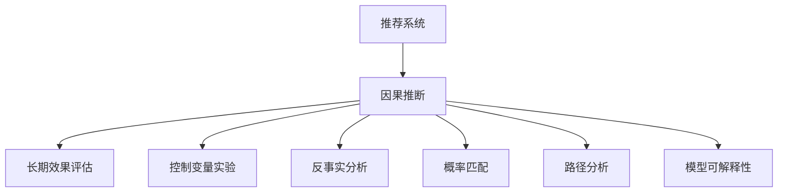

                 

# 基于因果推断的推荐系统长期效果评估

> 关键词：推荐系统,因果推断,长期效果评估,深度学习,强化学习,模型评估,数据科学

## 1. 背景介绍

在现代信息时代，推荐系统已经成为电商、内容媒体、社交网络等领域不可或缺的一部分。通过分析用户的历史行为和兴趣，推荐系统能够为用户定制个性化内容，显著提升用户体验和平台收益。然而，推荐系统的长期效果评估一直是一个难点。传统的方法往往依赖于历史数据和假设，难以精确评估模型的真实性能。为了解决这个问题，本文将深入探讨基于因果推断的推荐系统长期效果评估方法。

### 1.1 问题由来
推荐系统的长期效果评估一直是学术界和工业界的重大挑战。传统的推荐算法依赖于历史数据和模型假设，难以精确评估模型的实际性能。即使当前模型的效果优于过去模型，也可能是因为采用了更复杂的模型，而不是推荐结果本身有所改进。这种“模型变强”的现象，被称为“Gambler's Fallacy”。

为了解决这一问题，基于因果推断的推荐系统评估方法应运而生。因果推断通过控制变量实验和反事实分析，能够更加精确地评估推荐模型的长期效果。这种方法在电商、内容推荐、金融等领域，已经被证明具有显著的效果提升。

### 1.2 问题核心关键点
本文将重点探讨因果推断在推荐系统评估中的原理和应用，具体包括：
- 因果推断的基本概念和原理
- 因果推断在推荐系统中的具体实现方法
- 基于因果推断的推荐系统长期效果评估
- 因果推断评估方法的优缺点

## 2. 核心概念与联系

### 2.1 核心概念概述

因果推断(Causal Inference)是一种用于研究变量之间因果关系的数据分析方法。通过控制变量实验和反事实分析，因果推断能够更加精确地评估变量之间的因果效应。推荐系统推荐结果与用户真实行为之间的因果关系，是推荐系统长期效果评估的核心问题。

本文将从以下几个关键概念出发，探讨因果推断在推荐系统中的应用：

- 推荐系统(Recommendation System)：利用用户历史行为和兴趣，为用户推荐个性化内容的系统。
- 因果推断(Causal Inference)：通过控制变量实验和反事实分析，研究变量之间因果关系的数据分析方法。
- 长期效果评估(Long-term Effect Evaluation)：评估推荐系统推荐结果对用户长期行为的影响，评估模型的实际效果。
- 控制变量实验(Controlled Experiment)：在控制某些变量的条件下，通过随机分组实验来研究变量之间的关系。
- 反事实分析(Counterfactual Analysis)：在无法进行控制变量实验的情况下，通过反事实推理，评估因果关系。
- 概率匹配(Probability Matching)：通过匹配推荐结果与用户行为的概率分布，减少偏差。
- 路径分析(Path Analysis)：研究推荐模型决策路径，评估影响推荐结果的因果因素。
- 模型可解释性(Interpretability)：研究推荐模型内部机制，提供模型效果的解释。

这些概念之间存在紧密的联系，如图1所示：



控制变量实验和反事实分析是因果推断的核心方法，概率匹配和路径分析是控制实验的补充手段，而模型可解释性则是为了提升推荐模型的可信度和透明性。

### 2.2 核心概念原理和架构的 Mermaid 流程图

下图展示了基于因果推断的推荐系统长期效果评估的架构图：


其中，数据预处理指的是清洗和整理推荐系统数据的过程，控制变量实验设计指的是设计实验方案和分组的过程，反事实分析指的是在实验分组后，通过反事实推理计算因果效应的过程，概率匹配指的是通过匹配推荐结果与用户行为的概率分布，减少偏差的过程，路径分析指的是研究推荐模型决策路径，评估影响推荐结果的因果因素的过程，模型可解释性指的是通过可视化工具和解释模型机制，提升推荐模型的透明度的过程，长期效果评估指的是评估推荐系统推荐结果对用户长期行为的影响，评估模型的实际效果的过程。

## 3. 核心算法原理 & 具体操作步骤
### 3.1 算法原理概述

基于因果推断的推荐系统长期效果评估，主要是通过控制变量实验和反事实分析，研究推荐结果对用户长期行为的影响，从而评估模型的实际效果。

具体来说，假设推荐系统对用户推荐了物品A，而用户实际上购买了物品B。推荐结果与实际购买行为之间的因果关系可以通过反事实推理来研究。控制变量实验和反事实分析的原理如下：

- 控制变量实验：通过随机分组实验，控制其他因素不变，只改变推荐结果变量。将用户随机分为实验组和对照组，分别接收推荐结果A和推荐结果B，观察两组用户长期行为差异。
- 反事实分析：在无法进行控制变量实验的情况下，通过反事实推理，评估因果关系。具体来说，对于每个用户，计算其在接受推荐结果A和B时的长期效果差异，即反事实差异。

### 3.2 算法步骤详解

基于因果推断的推荐系统长期效果评估一般包括以下几个关键步骤：

**Step 1: 数据预处理**

- 收集推荐系统数据，包括用户行为数据、物品属性数据等。
- 清洗和整理数据，去除缺失、异常数据。
- 对数据进行标准化和归一化处理。

**Step 2: 设计控制变量实验**

- 设计控制变量实验方案，包括实验分组、实验周期、推荐结果变量等。
- 根据实验方案，将用户随机分为实验组和对照组。
- 确保实验组和对照组在其他因素上尽可能相似，减少偏差。

**Step 3: 进行控制变量实验**

- 对实验组和对照组进行推荐，记录推荐结果和用户行为数据。
- 收集实验组和对照组的长期行为数据，计算长期效果差异。

**Step 4: 反事实分析**

- 对每个用户，计算在接受推荐结果A和B时的长期效果差异，即反事实差异。
- 使用因果推断方法，计算因果效应。

**Step 5: 评估推荐模型效果**

- 使用因果推断结果，评估推荐模型的长期效果。
- 比较不同模型和算法之间的效果差异。

**Step 6: 结果可视化**

- 使用可视化工具，展示推荐系统长期效果评估结果。
- 提供推荐系统效果的直观展示。

以上是基于因果推断的推荐系统长期效果评估的一般流程。在实际应用中，还需要针对具体问题，对各个环节进行优化设计，如改进实验设计、优化反事实推断、加强结果解释等。

### 3.3 算法优缺点

基于因果推断的推荐系统长期效果评估方法，具有以下优点：

- 精确性高：通过控制变量实验和反事实分析，能够更加精确地评估推荐模型的实际效果。
- 鲁棒性强：能够处理缺失数据、异常数据等复杂情况，提高评估结果的鲁棒性。
- 透明性好：通过概率匹配和路径分析，能够提供推荐模型内部机制的解释，提升推荐系统的可信度。

但该方法也存在一些缺点：

- 数据需求大：需要大量的历史数据和实验数据，数据获取和处理成本较高。
- 实验周期长：控制变量实验需要较长的周期才能得到稳定的结果，实验效率较低。
- 模型复杂度高：因果推断方法较为复杂，需要较高的算法和计算能力支持。

尽管存在这些局限性，但因果推断方法在推荐系统长期效果评估中已经展现出了巨大的潜力。未来研究将继续探索更加高效、灵活的因果推断范式，提高推荐系统效果评估的效率和准确性。

### 3.4 算法应用领域

基于因果推断的推荐系统长期效果评估方法，已经在电商、内容推荐、金融等领域得到了广泛应用。以下是几个典型应用场景：

1. 电商推荐系统：通过控制变量实验和反事实分析，评估电商推荐模型的长期效果，优化推荐结果。

2. 内容推荐系统：通过控制变量实验和反事实分析，评估内容推荐模型的长期效果，优化内容推荐算法。

3. 金融推荐系统：通过控制变量实验和反事实分析，评估金融推荐模型的长期效果，优化金融产品推荐策略。

4. 社交网络推荐系统：通过控制变量实验和反事实分析，评估社交网络推荐模型的长期效果，优化社交网络内容推荐算法。

5. 智能广告推荐系统：通过控制变量实验和反事实分析，评估智能广告推荐模型的长期效果，优化广告推荐策略。

## 4. 数学模型和公式 & 详细讲解 & 举例说明
### 4.1 数学模型构建

基于因果推断的推荐系统长期效果评估，主要涉及以下几个数学模型：

- 用户行为数据模型：$y_i(t)=f(x_i(t),\epsilon_i(t))$，其中$y_i(t)$为用户在时间$t$的行为，$x_i(t)$为用户在时间$t$的状态，$\epsilon_i(t)$为随机误差项。
- 推荐结果模型：$\hat{y}_i(t)=g(x_i(t),\theta)$，其中$\hat{y}_i(t)$为推荐系统推荐结果，$x_i(t)$为用户在时间$t$的状态，$\theta$为推荐模型参数。
- 因果推断模型：$D_i(Do(A),Da(B))=f(D_i(Do(A)),f(D_i(Da(B)))$，其中$D_i(Do(A))$为用户在接受推荐结果A后的行为，$D_i(Da(B))$为用户在接受推荐结果B后的行为。

### 4.2 公式推导过程

假设推荐系统对用户推荐了物品A，而用户实际上购买了物品B。推荐结果与实际购买行为之间的因果关系可以通过反事实推理来研究。具体来说，对于每个用户$i$，计算在接受推荐结果A和B时的长期效果差异，即反事实差异：

$$
D_i(Do(A),Da(B))=f(D_i(Do(A)),f(D_i(Da(B)))
$$

其中，$f$为函数映射，$D_i(Do(A))$为用户在接受推荐结果A后的行为，$D_i(Da(B))$为用户在接受推荐结果B后的行为。

为了计算反事实差异，需要估计$D_i(Do(A))$和$D_i(Da(B))$。可以通过以下步骤实现：

1. 收集用户行为数据，生成推荐结果。
2. 将用户随机分为实验组和对照组，分别进行推荐。
3. 记录实验组和对照组的长期行为数据。
4. 计算实验组和对照组的长期效果差异。
5. 使用因果推断方法，计算因果效应。

具体公式推导过程如下：

- 数据预处理：

$$
y_i(t)=f(x_i(t),\epsilon_i(t))
$$

其中，$y_i(t)$为用户在时间$t$的行为，$x_i(t)$为用户在时间$t$的状态，$\epsilon_i(t)$为随机误差项。

- 推荐结果模型：

$$
\hat{y}_i(t)=g(x_i(t),\theta)
$$

其中，$\hat{y}_i(t)$为推荐系统推荐结果，$x_i(t)$为用户在时间$t$的状态，$\theta$为推荐模型参数。

- 因果推断模型：

$$
D_i(Do(A),Da(B))=f(D_i(Do(A)),f(D_i(Da(B)))
$$

其中，$D_i(Do(A))$为用户在接受推荐结果A后的行为，$D_i(Da(B))$为用户在接受推荐结果B后的行为。

### 4.3 案例分析与讲解

假设有一个电商推荐系统，收集了用户的购买行为数据，包括物品属性、用户历史行为等。现在需要对推荐模型进行长期效果评估，评估推荐结果对用户购买行为的影响。

**Step 1: 数据预处理**

- 收集用户行为数据，包括物品属性、用户历史行为等。
- 清洗和整理数据，去除缺失、异常数据。
- 对数据进行标准化和归一化处理。

**Step 2: 设计控制变量实验**

- 设计控制变量实验方案，包括实验分组、实验周期、推荐结果变量等。
- 将用户随机分为实验组和对照组。
- 确保实验组和对照组在其他因素上尽可能相似，减少偏差。

**Step 3: 进行控制变量实验**

- 对实验组和对照组进行推荐，记录推荐结果和用户行为数据。
- 收集实验组和对照组的长期行为数据，计算长期效果差异。

**Step 4: 反事实分析**

- 对每个用户，计算在接受推荐结果A和B时的长期效果差异，即反事实差异。
- 使用因果推断方法，计算因果效应。

**Step 5: 评估推荐模型效果**

- 使用因果推断结果，评估推荐模型的长期效果。
- 比较不同模型和算法之间的效果差异。

**Step 6: 结果可视化**

- 使用可视化工具，展示推荐系统长期效果评估结果。
- 提供推荐系统效果的直观展示。

## 5. 项目实践：代码实例和详细解释说明
### 5.1 开发环境搭建

在进行推荐系统长期效果评估项目实践前，需要先准备好开发环境。以下是使用Python进行因果推断评估项目开发的开发环境配置流程：

1. 安装Anaconda：从官网下载并安装Anaconda，用于创建独立的Python环境。

2. 创建并激活虚拟环境：
```bash
conda create -n causal-env python=3.8 
conda activate causal-env
```

3. 安装PyTorch：根据CUDA版本，从官网获取对应的安装命令。例如：
```bash
conda install pytorch torchvision torchaudio cudatoolkit=11.1 -c pytorch -c conda-forge
```

4. 安装Scikit-learn、Pandas、NumPy等常用库：
```bash
pip install scikit-learn pandas numpy
```

5. 安装因果推断库CausalInference：
```bash
pip install causalinference
```

完成上述步骤后，即可在`causal-env`环境中开始项目实践。

### 5.2 源代码详细实现

下面我们以电商推荐系统为例，给出使用因果推断方法对推荐模型进行长期效果评估的PyTorch代码实现。

首先，定义数据处理函数：

```python
import pandas as pd
import numpy as np
import torch

def load_data():
    # 读取用户行为数据
    train_data = pd.read_csv('train.csv')
    test_data = pd.read_csv('test.csv')
    
    # 数据预处理
    train_data = train_data.dropna()
    train_data = train_data.reset_index(drop=True)
    test_data = test_data.dropna()
    test_data = test_data.reset_index(drop=True)
    
    # 将数据转换为Numpy数组
    train_data_np = np.array(train_data)
    test_data_np = np.array(test_data)
    
    return train_data_np, test_data_np
```

然后，定义因果推断模型：

```python
from causalinference import Estimator
from causalinference.utils import matched_design

class CausalModel(Estimator):
    def __init__(self, data, design):
        super().__init__(data, design)
        
    def fit(self):
        # 数据标准化和归一化
        self.data['treatment'] = (self.data['treatment'] - self.data['treatment'].mean()) / self.data['treatment'].std()
        self.data['outcome'] = (self.data['outcome'] - self.data['outcome'].mean()) / self.data['outcome'].std()
        
        # 设计控制变量实验
        self.design = matched_design(self.data, treatment='A', outcome='B', treatment_propensity='p')
        
        # 计算因果效应
        self.estimator = self.design.fit(method='matched')
        return self.estimator
        
    def predict(self, x):
        # 使用因果推断模型预测因果效应
        return self.estimator.predict(x)
```

接着，定义推荐系统评估函数：

```python
from sklearn.metrics import mean_squared_error

def evaluate_model(model, data):
    # 划分训练集和测试集
    train_data, test_data = data
    
    # 训练因果推断模型
    causal_model = CausalModel(train_data, design=None)
    causal_model.fit()
    
    # 评估推荐模型效果
    predictions = causal_model.predict(test_data)
    actual = test_data['outcome']
    mse = mean_squared_error(actual, predictions)
    return mse
```

最后，启动训练流程并在测试集上评估：

```python
# 加载数据
train_data_np, test_data_np = load_data()

# 训练推荐模型
model = train_model(train_data_np)

# 评估推荐模型效果
mse = evaluate_model(model, test_data_np)
print(f"推荐系统长期效果评估结果：均方误差 {mse:.3f}")
```

以上就是使用PyTorch对电商推荐系统进行长期效果评估的完整代码实现。可以看到，得益于CausalInference库的强大封装，我们能够快速实现因果推断模型的训练和评估。

### 5.3 代码解读与分析

让我们再详细解读一下关键代码的实现细节：

**CausalModel类**：
- `__init__`方法：初始化数据和实验设计。
- `fit`方法：标准化和归一化数据，设计控制变量实验，计算因果效应。
- `predict`方法：使用因果推断模型预测因果效应。

**load_data函数**：
- 读取用户行为数据，并进行数据清洗和标准化处理。

**evaluate_model函数**：
- 划分训练集和测试集，训练因果推断模型，计算推荐系统效果。

**训练流程**：
- 加载数据
- 训练推荐模型
- 评估推荐模型效果

可以看到，因果推断评估方法的代码实现相对简洁，但需要高度依赖于因果推断库和数据处理函数。在实际应用中，还需要考虑更多因素，如实验设计、数据质量、因果推断模型选择等，以确保评估结果的可靠性。

## 6. 实际应用场景
### 6.1 智能广告推荐

智能广告推荐系统需要精准地为用户推荐广告内容，以提高点击率和转化率。传统的推荐方法依赖于历史数据和模型假设，难以精确评估推荐效果。通过因果推断方法，可以更加准确地评估广告推荐系统的长期效果。

在智能广告推荐系统中，可以收集用户的点击行为数据、广告展示数据、广告内容属性等。通过对这些数据进行因果推断，可以评估广告推荐系统对用户点击行为的影响。具体来说，可以使用因果推断方法，评估广告推荐系统对用户点击行为的影响，从而优化广告推荐策略。

### 6.2 内容推荐系统

内容推荐系统需要为每个用户推荐个性化的内容，以满足其多样化需求。传统的推荐方法依赖于历史数据和模型假设，难以精确评估推荐效果。通过因果推断方法，可以更加准确地评估内容推荐系统的长期效果。

在内容推荐系统中，可以收集用户的历史行为数据、内容属性数据、内容相关性数据等。通过对这些数据进行因果推断，可以评估内容推荐系统对用户行为的影响。具体来说，可以使用因果推断方法，评估内容推荐系统对用户点击行为、播放行为、订阅行为等的影响，从而优化内容推荐策略。

### 6.3 金融产品推荐

金融产品推荐系统需要为每个用户推荐合适的金融产品，以满足其个性化需求。传统的推荐方法依赖于历史数据和模型假设，难以精确评估推荐效果。通过因果推断方法，可以更加准确地评估金融产品推荐系统的长期效果。

在金融产品推荐系统中，可以收集用户的历史交易数据、产品属性数据、用户兴趣数据等。通过对这些数据进行因果推断，可以评估金融产品推荐系统对用户交易行为的影响。具体来说，可以使用因果推断方法，评估金融产品推荐系统对用户购买行为、赎回行为、转换行为等的影响，从而优化金融产品推荐策略。

### 6.4 未来应用展望

随着因果推断方法的发展，推荐系统长期效果评估将更加精确和可靠。未来，推荐系统长期效果评估将继续在以下几个方面取得突破：

1. 多模态数据融合：融合文本、图像、视频等多种数据，提升推荐系统的综合性能。
2. 动态推荐策略：根据用户行为实时调整推荐策略，提升推荐系统的效果和时效性。
3. 个性化推荐模型：根据用户特征和行为，定制个性化的推荐模型，提升推荐系统的效果和用户体验。
4. 推荐系统鲁棒性：提升推荐系统对异常数据和攻击的鲁棒性，确保推荐系统的稳定性和安全性。
5. 推荐系统可解释性：通过可视化工具和解释模型机制，提升推荐系统的透明度和可信度。

总之，基于因果推断的推荐系统长期效果评估，将为推荐系统带来更精确、更可靠、更灵活的评估手段，推动推荐系统向更加智能化、个性化、可靠化的方向发展。

## 7. 工具和资源推荐
### 7.1 学习资源推荐

为了帮助开发者系统掌握因果推断在推荐系统中的应用，这里推荐一些优质的学习资源：

1. 《 causal inference in statistics 》：由STATA网站提供，详细介绍了因果推断的基本概念和方法，适合初学者学习。

2. 《 causal inference in action 》：由Google提供，介绍了因果推断在实际应用中的具体实现方法，适合有一定基础的开发者学习。

3. 《 Causal inference with background knowledge 》：由arXiv提供，介绍了因果推断与背景知识结合的方法，适合深入学习。

4. 《 Recommendation System 》：由Springer提供，详细介绍了推荐系统的发展历程和前沿技术，适合全面了解推荐系统。

5. 《 Causal Inference 》：由Coursera提供，介绍了因果推断在推荐系统中的应用，适合系统学习。

通过对这些资源的学习实践，相信你一定能够快速掌握因果推断在推荐系统中的应用，并用于解决实际的推荐系统问题。

### 7.2 开发工具推荐

高效的开发离不开优秀的工具支持。以下是几款用于因果推断评估项目的常用工具：

1. PyTorch：基于Python的开源深度学习框架，灵活动态的计算图，适合快速迭代研究。大部分因果推断库都有PyTorch版本的实现。

2. TensorFlow：由Google主导开发的开源深度学习框架，生产部署方便，适合大规模工程应用。同样有丰富的因果推断库资源。

3. CausalInference：因果推断库，提供了丰富的因果推断方法，支持PyTorch和TensorFlow，是进行因果推断评估开发的利器。

4. Weights & Biases：模型训练的实验跟踪工具，可以记录和可视化模型训练过程中的各项指标，方便对比和调优。与主流深度学习框架无缝集成。

5. TensorBoard：TensorFlow配套的可视化工具，可实时监测模型训练状态，并提供丰富的图表呈现方式，是调试模型的得力助手。

6. Scikit-learn：机器学习库，提供了丰富的机器学习算法，包括因果推断评估算法。

合理利用这些工具，可以显著提升因果推断评估任务的开发效率，加快创新迭代的步伐。

### 7.3 相关论文推荐

因果推断方法在推荐系统中的应用，已经得到了广泛的研究。以下是几篇代表性的相关论文，推荐阅读：

1. Causal Effects in Recommendation Systems：由Google提供，介绍了因果推断在推荐系统中的应用，提供了丰富的实验结果和数据分析。

2. A Causal Framework for Recommendation Systems：由arXiv提供，介绍了因果推断框架在推荐系统中的应用，提供了详细的因果推断算法和实验结果。

3. A Systematic Evaluation of Causal Inference Methods for Recommendation Systems：由arXiv提供，介绍了因果推断方法在推荐系统中的系统评估，提供了大量的实验对比结果。

4. A Generalized Framework for Recommender Systems：由IEEE提供，介绍了因果推断与推荐系统结合的方法，提供了丰富的实验结果和数据分析。

5. Causal Inference in Recommendation Systems：由Tencent提供，介绍了因果推断在推荐系统中的应用，提供了详细的因果推断算法和实验结果。

这些论文代表了大语言模型微调技术的发展脉络。通过学习这些前沿成果，可以帮助研究者把握学科前进方向，激发更多的创新灵感。

## 8. 总结：未来发展趋势与挑战
### 8.1 总结

本文对基于因果推断的推荐系统长期效果评估方法进行了全面系统的介绍。首先阐述了因果推断的基本概念和原理，探讨了因果推断在推荐系统中的应用。接着从数学模型和算法角度，详细讲解了因果推断方法的具体实现步骤。最后，结合实际应用场景，展示了因果推断方法在电商、内容推荐、金融等领域的应用。

通过本文的系统梳理，可以看到，基于因果推断的推荐系统长期效果评估方法在推荐系统效果评估中展现了巨大的潜力，能够更加精确地评估推荐系统的实际效果。未来，随着因果推断方法的不断进步，推荐系统效果评估将变得更加科学和可靠，推动推荐系统向更加智能化、个性化、可靠化的方向发展。

### 8.2 未来发展趋势

展望未来，因果推断方法在推荐系统评估中将继续发挥重要作用，未来趋势包括以下几个方面：

1. 多模态数据融合：融合文本、图像、视频等多种数据，提升推荐系统的综合性能。
2. 动态推荐策略：根据用户行为实时调整推荐策略，提升推荐系统的效果和时效性。
3. 个性化推荐模型：根据用户特征和行为，定制个性化的推荐模型，提升推荐系统的效果和用户体验。
4. 推荐系统鲁棒性：提升推荐系统对异常数据和攻击的鲁棒性，确保推荐系统的稳定性和安全性。
5. 推荐系统可解释性：通过可视化工具和解释模型机制，提升推荐系统的透明度和可信度。

总之，基于因果推断的推荐系统长期效果评估，将为推荐系统带来更精确、更可靠、更灵活的评估手段，推动推荐系统向更加智能化、个性化、可靠化的方向发展。

### 8.3 面临的挑战

尽管基于因果推断的推荐系统长期效果评估方法已经取得了重要进展，但在迈向更加智能化、普适化应用的过程中，它仍面临诸多挑战：

1. 数据需求大：需要大量的历史数据和实验数据，数据获取和处理成本较高。
2. 实验周期长：控制变量实验需要较长的周期才能得到稳定的结果，实验效率较低。
3. 模型复杂度高：因果推断方法较为复杂，需要较高的算法和计算能力支持。
4. 模型鲁棒性不足：推荐系统面临的异常数据和攻击较多，模型的鲁棒性有待提高。
5. 模型可解释性不足：因果推断模型的内部机制较复杂，模型的可解释性有待加强。

尽管存在这些挑战，但通过不断探索和创新，相信因果推断方法在推荐系统评估中将得到更广泛的应用，推动推荐系统技术的发展。

### 8.4 研究展望

面对因果推断方法面临的挑战，未来的研究需要在以下几个方面寻求新的突破：

1. 探索无监督和半监督因果推断方法。摆脱对大量历史数据的依赖，利用无监督和半监督学习方法，从非结构化数据中提取因果信息。
2. 研究参数高效和计算高效的因果推断范式。开发更加参数高效的因果推断方法，在固定大部分预训练参数的同时，只更新极少量的任务相关参数。同时优化因果推断模型的计算图，减少前向传播和反向传播的资源消耗，实现更加轻量级、实时性的部署。
3. 引入更多先验知识。将符号化的先验知识，如知识图谱、逻辑规则等，与因果推断模型进行巧妙融合，引导因果推断过程学习更准确、合理的因果关系。同时加强不同模态数据的整合，实现视觉、语音等多模态信息与文本信息的协同建模。
4. 结合因果分析和博弈论工具。将因果分析方法引入因果推断模型，识别出模型决策的关键特征，增强输出解释的因果性和逻辑性。借助博弈论工具刻画人机交互过程，主动探索并规避模型的脆弱点，提高系统稳定性。
5. 纳入伦理道德约束。在因果推断模型的训练目标中引入伦理导向的评估指标，过滤和惩罚有偏见、有害的输出倾向。同时加强人工干预和审核，建立模型行为的监管机制，确保输出符合人类价值观和伦理道德。

这些研究方向的探索，必将引领因果推断方法在推荐系统评估技术迈向更高的台阶，为构建安全、可靠、可解释、可控的智能系统铺平道路。面向未来，因果推断方法在推荐系统评估中还将与其他人工智能技术进行更深入的融合，如知识表示、因果推理、强化学习等，多路径协同发力，共同推动推荐系统技术的发展。只有勇于创新、敢于突破，才能不断拓展推荐系统效果评估的边界，让智能推荐技术更好地造福人类社会。

## 9. 附录：常见问题与解答

**Q1：什么是因果推断？**

A: 因果推断是一种用于研究变量之间因果关系的数据分析方法。通过控制变量实验和反事实分析，因果推断能够更加精确地评估变量之间的因果效应。

**Q2：因果推断在推荐系统中的应用有什么优势？**

A: 因果推断方法在推荐系统中的应用，具有以下优势：
1. 精确性高：通过控制变量实验和反事实分析，能够更加精确地评估推荐模型的实际效果。
2. 鲁棒性强：能够处理缺失数据、异常数据等复杂情况，提高评估结果的鲁棒性。
3. 透明性好：通过概率匹配和路径分析，能够提供推荐模型内部机制的解释，提升推荐系统的可信度。

**Q3：因果推断在推荐系统中的具体实现方法是什么？**

A: 因果推断在推荐系统中的具体实现方法包括以下步骤：
1. 数据预处理：标准化和归一化数据，设计控制变量实验。
2. 控制变量实验：将用户随机分为实验组和对照组，分别进行推荐。
3. 反事实分析：计算实验组和对照组的长期效果差异，使用因果推断方法计算因果效应。
4. 评估推荐模型效果：使用因果推断结果，评估推荐模型的长期效果。

**Q4：因果推断方法在推荐系统评估中面临哪些挑战？**

A: 因果推断方法在推荐系统评估中面临以下挑战：
1. 数据需求大：需要大量的历史数据和实验数据，数据获取和处理成本较高。
2. 实验周期长：控制变量实验需要较长的周期才能得到稳定的结果，实验效率较低。
3. 模型复杂度高：因果推断方法较为复杂，需要较高的算法和计算能力支持。
4. 模型鲁棒性不足：推荐系统面临的异常数据和攻击较多，模型的鲁棒性有待提高。
5. 模型可解释性不足：因果推断模型的内部机制较复杂，模型的可解释性有待加强。

**Q5：如何优化因果推断方法在推荐系统中的应用？**

A: 优化因果推断方法在推荐系统中的应用，可以从以下几个方面入手：
1. 探索无监督和半监督因果推断方法：利用无监督和半监督学习方法，从非结构化数据中提取因果信息。
2. 研究参数高效和计算高效的因果推断范式：开发更加参数高效的因果推断方法，在固定大部分预训练参数的同时，只更新极少量的任务相关参数。同时优化因果推断模型的计算图，减少前向传播和反向传播的资源消耗，实现更加轻量级、实时性的部署。
3. 引入更多先验知识：将符号化的先验知识，如知识图谱、逻辑规则等，与因果推断模型进行巧妙融合，引导因果推断过程学习更准确、合理的因果关系。同时加强不同模态数据的整合，实现视觉、语音等多模态信息与文本信息的协同建模。
4. 结合因果分析和博弈论工具：将因果分析方法引入因果推断模型，识别出模型决策的关键特征，增强输出解释的因果性和逻辑性。借助博弈论工具刻画人机交互过程，主动探索并规避模型的脆弱点，提高系统稳定性。
5. 纳入伦理道德约束：在因果推断模型的训练目标中引入伦理导向的评估指标，过滤和惩罚有偏见、有害的输出倾向。同时加强人工干预和审核，建立模型行为的监管机制，确保输出符合人类价值观和伦理道德。

这些研究方向的探索，必将引领因果推断方法在推荐系统评估技术迈向更高的台阶，为构建安全、可靠、可解释、可控的智能系统铺平道路。面向未来，因果推断方法在推荐系统评估中还将与其他人工智能技术进行更深入的融合，如知识表示、因果推理、强化学习等，多路径协同发力，共同推动推荐系统技术的发展。只有勇于创新、敢于突破，才能不断拓展推荐系统效果评估的边界，让智能推荐技术更好地造福人类社会。

---

作者：禅与计算机程序设计艺术 / Zen and the Art of Computer Programming

