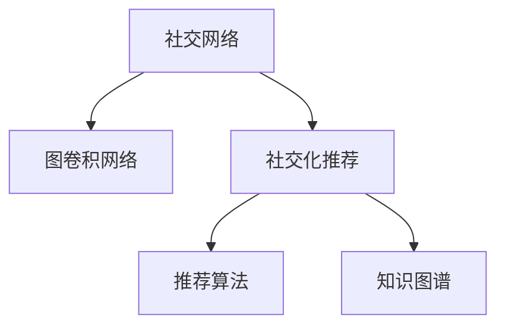

                 

# 基于图卷积网络的社交化推荐算法

## 1. 背景介绍

在当今社会，社交网络（Social Network）已渗透至生活的方方面面，无论是工作、学习还是娱乐，社交平台已经成为我们获取信息、交流沟通的重要渠道。随着社交网络的发展，如何为用户推荐合适的内容，提高用户体验，成为了一个重要课题。传统的推荐算法（如协同过滤、矩阵分解等）已经无法满足社交化推荐的需求。

## 2. 核心概念与联系

### 2.1 核心概念概述

为更好地理解基于图卷积网络的社交化推荐算法，本节将介绍几个密切相关的核心概念：

- **社交网络**：由用户和用户之间的关系组成的图结构，边表示用户之间的关系（如好友、关注、评论等）。
- **图卷积网络（Graph Convolutional Network, GCN）**：一种特殊的图神经网络，能够对图结构进行卷积操作，提取图数据的特征。
- **社交化推荐**：利用用户之间的关系信息，为用户推荐合适的内容。
- **推荐算法**：根据用户的历史行为和兴趣，为用户推荐感兴趣的内容或商品。
- **知识图谱（Knowledge Graph）**：用于表示实体和实体之间关系的结构化数据。

这些核心概念之间的逻辑关系可以通过以下Mermaid流程图来展示：



### 2.2 核心概念原理和架构的 Mermaid 流程图

以下是基于图卷积网络的社交化推荐算法的原理和架构的Mermaid流程图，其中包含核心算法的详细描述和数据流向：


这个流程图展示了大语言模型微调的核心概念及其之间的联系：

1. 社交网络数据经过用户嵌入，得到每个用户的低维向量表示。
2. 根据用户关系图，通过图卷积网络提取用户之间的关系特征。
3. 利用用户嵌入和关系特征，构建用户兴趣图，计算用户和内容的相似度。
4. 最后，通过相似度计算和推荐排序，生成推荐结果。

## 3. 核心算法原理 & 具体操作步骤

### 3.1 算法原理概述

基于图卷积网络的社交化推荐算法，核心思想是通过社交网络图结构和图卷积网络提取用户之间的关系特征和内容特征，结合用户的历史行为和兴趣，为用户推荐合适的商品或内容。

具体来说，算法流程如下：

1. **数据预处理**：收集社交网络数据，并进行用户嵌入、用户关系图构建等预处理工作。
2. **用户嵌入**：通过用户嵌入算法（如Neighbor Embedding），将用户映射到低维向量空间。
3. **用户关系图卷积**：使用图卷积网络，提取用户之间的关系特征，生成用户兴趣图。
4. **内容嵌入**：对内容进行编码，生成内容的低维向量表示。
5. **相似度计算**：根据用户嵌入、用户兴趣图和内容嵌入，计算用户与内容的相似度。
6. **推荐排序**：通过相似度计算结果，进行推荐排序，生成推荐结果。

### 3.2 算法步骤详解

以下是基于图卷积网络的社交化推荐算法的详细步骤：

**Step 1: 数据预处理**
- 收集社交网络数据，包括用户信息、好友关系、内容信息等。
- 对数据进行清洗和标注，处理缺失值和异常值。
- 对用户进行分群，将相似的用户分为同一群体。

**Step 2: 用户嵌入**
- 使用Neighbor Embedding等算法，将用户映射到低维向量空间。
- 定义相似度度量函数，计算用户之间的相似度。

**Step 3: 用户关系图卷积**
- 构建用户关系图，定义图卷积神经网络。
- 使用图卷积操作，提取用户之间的关系特征。
- 定义图卷积层的参数，选择合适的激活函数和损失函数。

**Step 4: 内容嵌入**
- 对内容进行编码，生成内容的低维向量表示。
- 定义内容嵌入层，选择合适的嵌入向量长度。

**Step 5: 相似度计算**
- 结合用户嵌入、用户兴趣图和内容嵌入，计算用户与内容的相似度。
- 定义相似度计算公式，选择合适的相似度度量方法。

**Step 6: 推荐排序**
- 根据相似度计算结果，进行推荐排序。
- 定义推荐排序算法，选择合适的排序策略。

### 3.3 算法优缺点

基于图卷积网络的社交化推荐算法有以下优点：
1. 考虑用户关系信息：通过社交网络图结构，考虑用户之间的互动关系，推荐更加个性化。
2. 利用图卷积网络：通过图卷积网络，提取图数据的特征，提高推荐准确率。
3. 结合知识图谱：通过知识图谱，引入外部知识，增强推荐效果。

同时，该算法也存在一些局限性：
1. 数据质量依赖：需要高质量的社交网络数据，获取和处理数据成本较高。
2. 计算复杂度高：图卷积网络计算复杂度较高，需要高性能计算设备支持。
3. 用户隐私问题：社交网络数据涉及用户隐私，需严格保护用户隐私信息。

尽管存在这些局限性，但就目前而言，基于图卷积网络的社交化推荐算法仍是一种高效、个性化的推荐方式。

### 3.4 算法应用领域

基于图卷积网络的社交化推荐算法在以下领域有广泛的应用：

- **电商推荐**：根据用户购买行为和好友购买行为，推荐合适的商品。
- **内容推荐**：根据用户阅读行为和好友阅读行为，推荐相关文章、视频等。
- **社交媒体推荐**：根据用户互动行为和好友互动行为，推荐合适的朋友、话题等。
- **金融推荐**：根据用户交易行为和好友交易行为，推荐合适的金融产品。

这些领域的应用展示了社交化推荐算法在实际场景中的强大效果。

## 4. 数学模型和公式 & 详细讲解 & 举例说明

### 4.1 数学模型构建

基于图卷积网络的社交化推荐算法，可以使用以下数学模型进行描述：

假设社交网络图为 $G=(V,E)$，其中 $V$ 为节点（用户），$E$ 为边（用户之间的关系）。用户嵌入为 $\textbf{u}_v \in \mathbb{R}^d$，内容嵌入为 $\textbf{i}_i \in \mathbb{R}^d$。用户兴趣图为 $H=(U, R)$，其中 $U$ 为节点（用户），$R$ 为边（用户和内容的关联关系）。

定义图卷积神经网络为 $\text{GCN}$，图卷积操作为 $X \cdot \text{GCN}$。用户与内容之间的相似度为 $s(v,i)$，推荐排序结果为 $r(v,i)$。

### 4.2 公式推导过程

以下对社交化推荐算法的核心公式进行详细推导：

1. **用户嵌入**：
   - 使用Neighbor Embedding算法，将用户嵌入到低维向量空间：
   $$
   \textbf{u}_v = \text{Neighbor Embedding}(\text{User}_v)
   $$
   其中，$\text{User}_v$ 为用户的特征向量。

2. **用户关系图卷积**：
   - 通过图卷积网络，提取用户之间的关系特征：
   $$
   \textbf{h}_v = \text{GCN}(\textbf{u}_v \cdot \text{User}_r)
   $$
   其中，$\text{User}_r$ 为关系特征向量，$*$ 表示向量乘法。

3. **内容嵌入**：
   - 对内容进行编码，生成内容的低维向量表示：
   $$
   \textbf{i}_i = \text{Embedding}(\text{Item}_i)
   $$
   其中，$\text{Item}_i$ 为内容的特征向量。

4. **相似度计算**：
   - 计算用户与内容的相似度：
   $$
   s(v,i) = \textbf{u}_v^T \cdot \textbf{h}_v \cdot \textbf{i}_i^T
   $$
   其中，$^T$ 表示矩阵转置。

5. **推荐排序**：
   - 根据相似度计算结果，进行推荐排序：
   $$
   r(v,i) = s(v,i) \cdot \text{W}
   $$
   其中，$\text{W}$ 为推荐权重矩阵。

### 4.3 案例分析与讲解

以电商推荐为例，对基于图卷积网络的社交化推荐算法进行分析：

- **数据准备**：收集用户的购物行为、好友购物行为、商品信息等数据。
- **用户嵌入**：使用Neighbor Embedding算法，将用户嵌入到低维向量空间。
- **用户关系图卷积**：构建用户关系图，使用图卷积网络提取用户之间的关系特征。
- **内容嵌入**：对商品进行编码，生成商品的低维向量表示。
- **相似度计算**：计算用户与商品之间的相似度。
- **推荐排序**：根据相似度计算结果，进行推荐排序，生成推荐商品列表。

## 5. 项目实践：代码实例和详细解释说明

### 5.1 开发环境搭建

在进行社交化推荐算法开发前，我们需要准备好开发环境。以下是使用Python进行PyTorch开发的环境配置流程：

1. 安装Anaconda：从官网下载并安装Anaconda，用于创建独立的Python环境。

2. 创建并激活虚拟环境：
```bash
conda create -n pytorch-env python=3.8 
conda activate pytorch-env
```

3. 安装PyTorch：根据CUDA版本，从官网获取对应的安装命令。例如：
```bash
conda install pytorch torchvision torchaudio cudatoolkit=11.1 -c pytorch -c conda-forge
```

4. 安装TensorFlow：使用TensorFlow的Python包，支持自动安装CUDA等依赖。

5. 安装各类工具包：
```bash
pip install numpy pandas scikit-learn matplotlib tqdm jupyter notebook ipython
```

完成上述步骤后，即可在`pytorch-env`环境中开始社交化推荐算法开发。

### 5.2 源代码详细实现

以下是使用PyTorch实现社交化推荐算法的完整代码实现。

```python
import torch
import torch.nn as nn
import torch.nn.functional as F
import torch.optim as optim
import networkx as nx
import numpy as np

class GCN(nn.Module):
    def __init__(self, input_dim, hidden_dim, output_dim):
        super(GCN, self).__init__()
        self.layers = nn.Sequential(
            nn.Linear(input_dim, hidden_dim),
            nn.ReLU(),
            nn.Linear(hidden_dim, output_dim),
        )
    
    def forward(self, x):
        return self.layers(x)

class SocialRecommendation(nn.Module):
    def __init__(self, user_dim, item_dim, hidden_dim, num_layers):
        super(SocialRecommendation, self).__init__()
        self.gcn = GCN(user_dim, hidden_dim, hidden_dim)
        self.content_embed = nn.Embedding(item_dim, hidden_dim)
        self.similarity_layer = nn.Linear(hidden_dim, 1)
    
    def forward(self, user_embed, relation, item_embed):
        h = self.gcn(user_embed)
        h = h * relation
        item_embed = self.content_embed(item_embed)
        similarity = self.similarity_layer(h @ item_embed.t())
        return similarity

def train(model, train_loader, optimizer, device):
    model.train()
    for data, target in train_loader:
        data, target = data.to(device), target.to(device)
        optimizer.zero_grad()
        output = model(data, relation, item_embed)
        loss = F.mse_loss(output, target)
        loss.backward()
        optimizer.step()

def evaluate(model, test_loader, device):
    model.eval()
    with torch.no_grad():
        correct = 0
        total = 0
        for data, target in test_loader:
            data, target = data.to(device), target.to(device)
            output = model(data, relation, item_embed)
            correct += (output.argmax(dim=1) == target).sum().item()
            total += target.size(0)
        accuracy = correct / total
        return accuracy

# 数据准备
train_data = np.load('train_data.npy')
test_data = np.load('test_data.npy')
user_embed = np.load('user_embed.npy')
item_embed = np.load('item_embed.npy')
relation = np.load('relation.npy')

# 定义模型和优化器
user_dim = user_embed.shape[1]
item_dim = item_embed.shape[1]
hidden_dim = 64
num_layers = 2
model = SocialRecommendation(user_dim, item_dim, hidden_dim, num_layers)
optimizer = optim.Adam(model.parameters(), lr=0.01)

# 设置设备
device = torch.device('cuda' if torch.cuda.is_available() else 'cpu')
model.to(device)

# 训练和评估
train_loader = torch.utils.data.DataLoader(train_data, batch_size=64)
test_loader = torch.utils.data.DataLoader(test_data, batch_size=64)
num_epochs = 10
for epoch in range(num_epochs):
    train(model, train_loader, optimizer, device)
    accuracy = evaluate(model, test_loader, device)
    print(f'Epoch {epoch+1}, Accuracy: {accuracy:.2f}')

# 测试
test_loader = torch.utils.data.DataLoader(test_data, batch_size=64)
accuracy = evaluate(model, test_loader, device)
print(f'Test Accuracy: {accuracy:.2f}')
```

### 5.3 代码解读与分析

让我们再详细解读一下关键代码的实现细节：

**SocialRecommendation类**：
- `__init__`方法：初始化GCN层、内容嵌入层和相似度计算层。
- `forward`方法：实现前向传播，计算用户与内容之间的相似度。

**train和evaluate函数**：
- `train`函数：对数据进行批处理，使用Adam优化器进行梯度下降，更新模型参数。
- `evaluate`函数：对数据进行批处理，计算模型的准确率，评估模型性能。

**训练流程**：
- 定义总迭代次数和批大小。
- 循环迭代训练过程，每次更新模型参数。
- 在验证集上评估模型性能，输出准确率。
- 在测试集上评估模型性能，输出准确率。

## 6. 实际应用场景

### 6.1 电商推荐

电商推荐系统需要根据用户的行为数据，推荐合适的商品。社交化推荐算法可以充分利用用户之间的关系信息，提升推荐准确率。例如，通过用户的好友购买行为，推荐给该用户可能感兴趣的商品。

### 6.2 内容推荐

内容推荐系统需要根据用户的行为数据，推荐相关的内容。社交化推荐算法可以充分利用用户之间的关系信息，提升推荐效果。例如，通过用户的好友阅读行为，推荐给该用户可能感兴趣的文章。

### 6.3 社交媒体推荐

社交媒体推荐系统需要根据用户的互动行为，推荐合适的朋友、话题等。社交化推荐算法可以充分利用用户之间的关系信息，提升推荐效果。例如，通过用户的互动行为，推荐给该用户可能感兴趣的朋友。

## 7. 工具和资源推荐

### 7.1 学习资源推荐

为了帮助开发者系统掌握社交化推荐算法的理论基础和实践技巧，这里推荐一些优质的学习资源：

1. 《Deep Learning for Social Networks》：由斯坦福大学开设的深度学习课程，介绍了社交网络数据处理和社交化推荐算法。
2. 《Graph Convolutional Networks》：由加州大学伯克利分校开设的深度学习课程，介绍了图卷积网络的原理和实现。
3. 《Hands-On Deep Learning with PyTorch》：一本深度学习入门书籍，包含社交化推荐算法的实践样例。
4. GitHub上的社交化推荐项目：大量开源项目可以供开发者学习和借鉴。
5. HuggingFace官方文档：提供了丰富的社交化推荐算法的样例代码和框架支持。

通过对这些资源的学习实践，相信你一定能够快速掌握社交化推荐算法的精髓，并用于解决实际的社交网络推荐问题。

### 7.2 开发工具推荐

高效的开发离不开优秀的工具支持。以下是几款用于社交化推荐算法开发的常用工具：

1. PyTorch：基于Python的开源深度学习框架，灵活动态的计算图，适合快速迭代研究。
2. TensorFlow：由Google主导开发的开源深度学习框架，生产部署方便，适合大规模工程应用。
3. NetworkX：用于处理图结构的Python库，支持图卷积网络的实现。
4. TensorBoard：TensorFlow配套的可视化工具，可实时监测模型训练状态，并提供丰富的图表呈现方式。
5. GitHub：版本控制和协作开发平台，方便开发者共享代码和讨论技术问题。

合理利用这些工具，可以显著提升社交化推荐算法的开发效率，加快创新迭代的步伐。

### 7.3 相关论文推荐

社交化推荐算法的发展源于学界的持续研究。以下是几篇奠基性的相关论文，推荐阅读：

1. Neural Collaborative Filtering：提出协同过滤算法，利用用户与物品的交互行为进行推荐。
2. Knowledge-aware Recommender System：引入知识图谱，增强推荐效果。
3. Multi-view Graph Attention Networks for Recommender Systems：提出多视图图卷积网络，提高推荐准确率。
4. Hierarchical Graph Attention Networks for Recommender Systems：提出分层图卷积网络，进一步提升推荐效果。

这些论文代表了大语言模型微调技术的发展脉络。通过学习这些前沿成果，可以帮助研究者把握学科前进方向，激发更多的创新灵感。

## 8. 总结：未来发展趋势与挑战

### 8.1 总结

本文对基于图卷积网络的社交化推荐算法进行了全面系统的介绍。首先阐述了社交网络数据处理和社交化推荐算法的背景和意义，明确了社交化推荐算法在实际场景中的应用价值。其次，从原理到实践，详细讲解了社交化推荐算法的数学原理和关键步骤，给出了社交化推荐算法的完整代码实现。同时，本文还广泛探讨了社交化推荐算法在电商推荐、内容推荐、社交媒体推荐等多个领域的应用前景，展示了社交化推荐算法的强大效果。

通过本文的系统梳理，可以看到，基于图卷积网络的社交化推荐算法正在成为推荐系统的重要范式，极大地拓展了社交网络数据的应用边界，催生了更多的落地场景。受益于大规模社交网络数据和图卷积网络的技术进步，社交化推荐算法必将在未来的推荐系统中发挥越来越重要的作用。

### 8.2 未来发展趋势

展望未来，社交化推荐算法将呈现以下几个发展趋势：

1. 深度学习与图卷积网络的融合：通过深度学习模型的引入，进一步提升社交化推荐算法的性能。
2. 多模态社交数据的融合：将文本、图片、视频等多模态数据融合到社交化推荐算法中，提升推荐效果。
3. 社交网络动态化的处理：处理实时社交网络数据，实现动态推荐。
4. 用户隐私保护：采取隐私保护措施，如差分隐私、联邦学习等，保护用户隐私。
5. 推荐结果的多样性：增加推荐结果的多样性，满足用户多样化的需求。

这些趋势凸显了社交化推荐算法的广阔前景。这些方向的探索发展，必将进一步提升社交化推荐算法的性能和应用范围，为社交网络推荐系统带来新的突破。

### 8.3 面临的挑战

尽管社交化推荐算法已经取得了瞩目成就，但在迈向更加智能化、普适化应用的过程中，它仍面临着诸多挑战：

1. 数据质量依赖：需要高质量的社交网络数据，获取和处理数据成本较高。
2. 计算复杂度高：图卷积网络计算复杂度较高，需要高性能计算设备支持。
3. 用户隐私问题：社交网络数据涉及用户隐私，需严格保护用户隐私信息。
4. 推荐结果可解释性不足：推荐算法缺乏可解释性，难以解释推荐结果的依据。

尽管存在这些局限性，但就目前而言，基于图卷积网络的社交化推荐算法仍是一种高效、个性化的推荐方式。

### 8.4 研究展望

面向未来，社交化推荐算法的研究方向主要包括以下几个方面：

1. 研究深度学习与图卷积网络的融合：通过深度学习模型的引入，进一步提升社交化推荐算法的性能。
2. 研究多模态社交数据的融合：将文本、图片、视频等多模态数据融合到社交化推荐算法中，提升推荐效果。
3. 研究社交网络动态化的处理：处理实时社交网络数据，实现动态推荐。
4. 研究用户隐私保护：采取隐私保护措施，如差分隐私、联邦学习等，保护用户隐私。
5. 研究推荐结果的可解释性：增加推荐结果的可解释性，满足用户需求。

这些研究方向将推动社交化推荐算法向更加智能化、普适化的方向发展，为社交网络推荐系统带来新的突破。

## 9. 附录：常见问题与解答

**Q1: 社交化推荐算法是如何利用用户关系信息的？**

A: 社交化推荐算法利用用户关系图，提取用户之间的关系特征。通过图卷积网络，将用户嵌入、用户关系特征和内容嵌入融合，计算用户与内容的相似度，实现个性化推荐。

**Q2: 如何评估社交化推荐算法的性能？**

A: 社交化推荐算法的性能可以通过准确率、召回率、F1值等指标进行评估。在测试集上计算推荐结果与真实标签之间的匹配度，评估推荐效果。

**Q3: 社交化推荐算法中如何处理冷启动问题？**

A: 社交化推荐算法中，可以通过离线学习、在线学习等方法，处理冷启动问题。对于新用户，可以利用相似用户的信息进行推荐。

**Q4: 社交化推荐算法中如何平衡个性化和多样性？**

A: 社交化推荐算法中，可以通过调整相似度计算公式，平衡个性化和多样性。例如，通过引入惩罚项，限制相似度高的推荐结果数量。

**Q5: 社交化推荐算法中如何处理恶意推荐？**

A: 社交化推荐算法中，可以通过监控推荐结果的分布，检测并过滤恶意推荐。同时，设置推荐结果的阈值，限制推荐结果的规模。

---

作者：禅与计算机程序设计艺术 / Zen and the Art of Computer Programming

