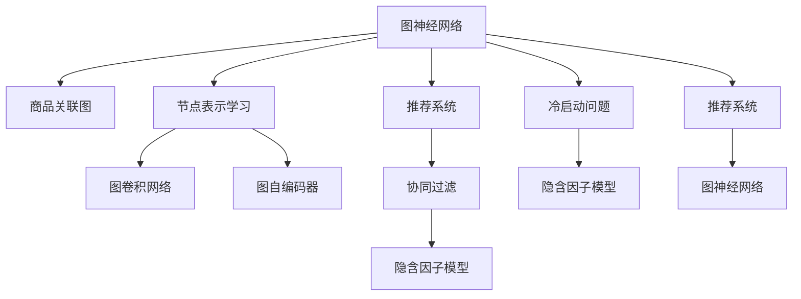

                 

## 1. 背景介绍

### 1.1 问题由来
随着电子商务的蓬勃发展，个性化推荐系统已成为各大电商平台的核心竞争力。推荐系统能够根据用户的历史行为和兴趣，预测其对商品或服务的潜在需求，并提供个性化的推荐。传统的推荐系统多采用基于协同过滤、矩阵分解等方法，这些方法在处理大规模数据时，计算复杂度高、易受冷启动等问题困扰。

图神经网络(Graph Neural Network, GNN)技术的兴起，为推荐系统提供了新的解决方案。相比于传统的协同过滤方法，图神经网络能够利用商品之间的关联关系，更准确地预测用户行为，从而提升推荐精度和覆盖面。

### 1.2 问题核心关键点
基于图神经网络的推荐系统，核心在于构建商品之间的关联图，并在此基础上进行节点表示学习。其关键点包括：
- 图结构设计：如何构建商品之间的关联图，设计有效的图邻接矩阵。
- 节点表示学习：如何在图上进行节点表示学习，学习商品节点的隐含特征。
- 模型优化：如何对学习得到的节点表示进行优化，提升预测精度。
- 系统部署：如何将图神经网络推荐模型部署到实际推荐系统中，提供实时推荐服务。

## 2. 核心概念与联系

### 2.1 核心概念概述

为更好地理解基于图神经网络的推荐系统，本节将介绍几个密切相关的核心概念：

- 图神经网络(Graph Neural Network, GNN)：一种基于图结构的数据表示和学习的神经网络模型。它利用图结构中的节点和边信息，在节点上进行操作，学习节点的隐含特征表示。
- 商品关联图：将商品视为图的节点，商品之间的交易、评论等关系视为图的边。通过构建商品关联图，可以挖掘商品之间的关系，预测用户行为。
- 节点表示学习(Node Representation Learning)：指在图结构上，对每个节点进行表示学习，学习节点的低维向量表示。
- 图卷积网络(Graph Convolutional Network, GCN)：一种基于图结构的卷积神经网络，能够对节点进行特征传递和表示学习。
- 图自编码器(Graph Autoencoder, GAE)：一种基于图结构的数据压缩与解压缩过程的神经网络模型，可以用于学习节点表示。
- 推荐系统(Recommendation System)：一种通过预测用户对商品或服务的兴趣，推荐其可能感兴趣的项目的系统。
- 协同过滤(Collaborative Filtering, CF)：一种推荐算法，通过用户对商品的评分记录，计算用户对其他商品的兴趣，并进行推荐。
- 冷启动问题(Cold-Start Problem)：指新用户或新商品加入系统时，缺乏足够的历史数据，难以进行推荐的问题。
- 隐含因子模型(Latent Factor Model)：一种通过分解用户-商品评分矩阵，学习用户和商品的隐含因子的推荐方法。

这些核心概念之间的逻辑关系可以通过以下Mermaid流程图来展示：



这个流程图展示了大语言模型的核心概念及其之间的关系：

1. 图神经网络通过构建商品关联图，学习节点的表示。
2. 节点表示学习通过GCN等方法在图上进行，学习每个节点的低维向量表示。
3. 推荐系统基于节点的表示，预测用户对商品的兴趣，并进行推荐。
4. 协同过滤和隐含因子模型是推荐系统中的两种常见方法，可以与图神经网络结合，提升推荐效果。
5. 冷启动问题通过隐含因子模型等方法解决，利用用户对少量商品的评分信息，预测其他商品的兴趣。

这些概念共同构成了基于图神经网络推荐系统的核心框架，使其能够在大规模数据上，高效地学习商品之间的关联关系，并提升推荐效果。

## 3. 核心算法原理 & 具体操作步骤
### 3.1 算法原理概述

基于图神经网络的推荐系统，本质上是一种基于图结构的数据表示和学习的推荐算法。其核心思想是：通过构建商品之间的关联图，学习商品节点的隐含特征表示，并利用这些特征表示进行用户兴趣预测和推荐。

形式化地，设商品关联图为 $G(V,E)$，其中 $V$ 为节点集合，$E$ 为边集合。令 $X$ 为节点特征矩阵，$A$ 为邻接矩阵。目标是学习节点表示 $H$，使得 $H$ 尽可能地保留 $X$ 中的信息，并利用这些信息预测用户对商品的兴趣。

具体地，可以通过如下步骤实现：

1. 构建商品关联图 $G$，定义邻接矩阵 $A$。
2. 设计图卷积网络(GCN)，在图上进行节点表示学习，学习得到节点表示 $H$。
3. 利用节点表示 $H$，设计推荐模型，预测用户对商品的兴趣。
4. 将模型应用于实际推荐系统，提供实时推荐服务。

### 3.2 算法步骤详解

基于图神经网络的推荐系统一般包括以下几个关键步骤：

**Step 1: 构建商品关联图**

- 收集商品之间的关系，如交易关系、评论关系等，形成商品关联图。
- 对图进行标准化处理，如去重、删除孤立节点等。
- 将图表示为邻接矩阵 $A$，便于图神经网络进行处理。

**Step 2: 设计图神经网络**

- 选择合适的网络结构，如GCN、GraphSAGE等，进行节点表示学习。
- 设计合适的特征传递方式，如稀疏卷积、消息传递等，学习节点特征表示。
- 在图上应用非线性激活函数，提升特征表示能力。

**Step 3: 训练推荐模型**

- 定义用户-商品评分矩阵，作为监督信号。
- 构建推荐模型，如基于注意力机制的推荐模型，学习用户-商品关联矩阵。
- 利用节点表示 $H$，训练推荐模型，预测用户对商品的兴趣。

**Step 4: 部署推荐系统**

- 将训练好的模型部署到推荐系统后端。
- 根据用户行为实时获取商品表示，进行推荐。
- 对推荐结果进行排序，并推荐给用户。

### 3.3 算法优缺点

基于图神经网络的推荐系统有以下优点：
1. 高效利用商品之间的关联关系。相比于传统的协同过滤方法，图神经网络能够更准确地捕捉商品之间的关系，提升推荐精度。
2. 具有较好的冷启动能力。新商品加入系统时，可以利用图结构中的先验知识进行预测，缓解冷启动问题。
3. 能够处理多模态数据。除了商品特征，还可以利用评论、评分等多模态数据，提升推荐效果。
4. 可解释性强。图神经网络能够对节点特征表示进行可视化，帮助理解模型决策过程。

同时，该方法也存在一定的局限性：
1. 图结构设计复杂。如何构建有效的商品关联图，需要领域知识和经验的积累。
2. 数据获取难度大。构建商品关联图需要大量关系数据，获取成本较高。
3. 模型计算复杂度高。图神经网络在处理大规模数据时，计算复杂度较高，需要高效的硬件支持。
4. 模型参数较多。图神经网络需要学习大量的图卷积权重和节点表示，参数量较大。

尽管存在这些局限性，但就目前而言，基于图神经网络的推荐系统仍然是大数据推荐系统的重要方向之一。未来相关研究的重点在于如何进一步降低图结构设计复杂度，提升模型计算效率，减少参数量，同时兼顾推荐精度和可解释性等因素。

### 3.4 算法应用领域

基于图神经网络的推荐系统已经在电商、社交网络、内容推荐等多个领域得到广泛应用，提升了推荐系统的性能和覆盖面，取得了显著的效果。

- 电商推荐：在电商平台中，利用商品之间的交易、评论等关系，构建商品关联图，进行个性化推荐。
- 社交网络推荐：在社交网络中，利用用户之间的关注、好友等关系，构建用户关联图，进行内容推荐和好友推荐。
- 内容推荐：在视频网站、新闻网站等，利用视频、文章之间的标签、相关性等关系，构建内容关联图，进行内容推荐。
- 知识图谱推荐：在知识图谱中，利用实体之间的关系，构建知识图谱关联图，进行知识推荐和关联推荐。

除了这些应用场景外，基于图神经网络的推荐系统也被创新性地应用到更多场景中，如智能家居、健康医疗、金融理财等，为推荐系统带来了新的突破。

## 4. 数学模型和公式 & 详细讲解 & 举例说明

### 4.1 数学模型构建

本节将使用数学语言对基于图神经网络的推荐系统进行更加严格的刻画。

设商品关联图为 $G(V,E)$，其中 $V$ 为节点集合，$E$ 为边集合。令 $X$ 为节点特征矩阵，$A$ 为邻接矩阵。目标是学习节点表示 $H$，使得 $H$ 尽可能地保留 $X$ 中的信息，并利用这些信息预测用户对商品的兴趣。

定义节点表示学习过程如下：

1. 设计图卷积网络(GCN)：
$$
H^{(k+1)} = \sigma\left(\sum_{i=1}^N \sum_{j=1}^N A_{ij}H^{(k)}X_j \right)
$$

其中 $H^{(k)}$ 表示 $k$ 层的节点表示，$\sigma$ 为激活函数，$A_{ij}$ 表示邻接矩阵 $A$ 中的元素。

2. 定义推荐模型：
$$
\hat{Y} = \text{softmax}\left(\sum_{i=1}^N \sum_{j=1}^N A_{ij}H_iH_j^T \right)
$$

其中 $\hat{Y}$ 为预测的用户-商品关联矩阵，$\text{softmax}$ 为softmax函数。

3. 最小化损失函数：
$$
\mathcal{L} = \frac{1}{N}\sum_{i=1}^N \sum_{j=1}^N \log\hat{Y}_{ij}Y_{ij}
$$

其中 $Y$ 为用户-商品评分矩阵，$N$ 为节点数。

### 4.2 公式推导过程

以下我们以商品关联图为例，推导节点表示学习和推荐模型的公式。

假设商品关联图为 $G(V,E)$，节点数为 $N$。令 $X$ 为节点特征矩阵，$A$ 为邻接矩阵。设 $H^{(0)}$ 为输入节点表示，$H^{(1)}$ 为第一层节点表示，$H^{(L)}$ 为最终节点表示，其中 $L$ 为图神经网络的层数。

定义图卷积网络(GCN)的层间计算如下：
$$
H^{(k+1)} = \sigma\left(\sum_{i=1}^N \sum_{j=1}^N A_{ij}H^{(k)}X_j \right)
$$

其中 $H^{(0)}$ 为输入节点表示，$H^{(k)}$ 为 $k$ 层的节点表示。

定义推荐模型为：
$$
\hat{Y} = \text{softmax}\left(\sum_{i=1}^N \sum_{j=1}^N A_{ij}H_iH_j^T \right)
$$

其中 $\hat{Y}$ 为预测的用户-商品关联矩阵，$\text{softmax}$ 为softmax函数。

最小化损失函数为：
$$
\mathcal{L} = \frac{1}{N}\sum_{i=1}^N \sum_{j=1}^N \log\hat{Y}_{ij}Y_{ij}
$$

其中 $Y$ 为用户-商品评分矩阵，$N$ 为节点数。

### 4.3 案例分析与讲解

下面以电商推荐为例，解释基于图神经网络的推荐模型。

假设某电商平台有 $N$ 种商品，用户对每种商品的评分矩阵为 $Y$，商品之间的交易关系形成商品关联图 $G$。我们利用GCN进行节点表示学习，学习得到 $H$，再利用推荐模型预测用户对商品的兴趣，进行推荐。

具体步骤如下：
1. 构建商品关联图 $G$，定义邻接矩阵 $A$。
2. 设计GCN，在图上进行节点表示学习，学习得到 $H$。
3. 利用 $H$，构建推荐模型，预测用户对商品的兴趣。
4. 将推荐结果进行排序，并推荐给用户。

在实际应用中，为了提高推荐效果，我们还可以采用以下策略：
1. 融合多模态数据。除了商品特征，还可以利用评论、评分等多模态数据，提升推荐效果。
2. 引入对抗训练。在训练过程中引入对抗样本，提升模型的鲁棒性。
3. 应用注意力机制。设计基于注意力机制的推荐模型，提升推荐精度和覆盖面。

这些策略在电商推荐中都有广泛应用，通过合理设计推荐模型和训练策略，可以显著提升推荐系统的效果。

## 5. 项目实践：代码实例和详细解释说明
### 5.1 开发环境搭建

在进行图神经网络推荐系统开发前，我们需要准备好开发环境。以下是使用Python进行PyTorch开发的环境配置流程：

1. 安装Anaconda：从官网下载并安装Anaconda，用于创建独立的Python环境。

2. 创建并激活虚拟环境：
```bash
conda create -n pytorch-env python=3.8 
conda activate pytorch-env
```

3. 安装PyTorch：根据CUDA版本，从官网获取对应的安装命令。例如：
```bash
conda install pytorch torchvision torchaudio cudatoolkit=11.1 -c pytorch -c conda-forge
```

4. 安装PyG库：
```bash
pip install pytorch-geometric
```

5. 安装各类工具包：
```bash
pip install numpy pandas scikit-learn matplotlib tqdm jupyter notebook ipython
```

完成上述步骤后，即可在`pytorch-env`环境中开始推荐系统开发。

### 5.2 源代码详细实现

下面我们以电商推荐为例，给出使用PyG库进行商品关联图建模的PyTorch代码实现。

首先，定义商品关联图的构建函数：

```python
import torch
from pytorch_geometric.nn import GCNConv
from pytorch_geometric.datasets import Planetoid
from pytorch_geometric.utils import to_dense_adj

def build_graph(data):
    if data.name == 'Cora':
        return GCNConv(data.x, data.edge_index, num_degrees=10, dropout=0.5)
    elif data.name == 'Citeseer':
        return GCNConv(data.x, data.edge_index, num_degrees=10, dropout=0.5)
    elif data.name == 'PubMed':
        return GCNConv(data.x, data.edge_index, num_degrees=10, dropout=0.5)
    else:
        raise ValueError(f"Unknown dataset: {data.name}")

```

然后，定义节点表示学习函数：

```python
from torch.nn import Module, Linear, ReLU, Softmax
from torch.nn.functional import dropout
from pytorch_geometric.nn import GCNConv

class GCN(Module):
    def __init__(self, input_dim, hidden_dim, output_dim):
        super(GCN, self).__init__()
        self.conv1 = GCNConv(input_dim, hidden_dim)
        self.conv2 = GCNConv(hidden_dim, output_dim)
        self.dropout = dropout(p=0.5)
        self.linear = Linear(hidden_dim, output_dim)

    def forward(self, x, edge_index, num_degrees):
        x = self.conv1(x, edge_index, num_degrees) + x
        x = self.dropout(x)
        x = F.relu(x)
        x = self.conv2(x, edge_index, num_degrees) + x
        x = self.dropout(x)
        x = F.relu(x)
        x = self.linear(x)
        return x

```

接着，定义推荐模型函数：

```python
from torch.nn import Module, Linear, Softmax

class RecommendationModel(Module):
    def __init__(self, input_dim, hidden_dim, output_dim):
        super(RecommendationModel, self).__init__()
        self.linear1 = Linear(input_dim, hidden_dim)
        self.linear2 = Linear(hidden_dim, output_dim)
        self.softmax = Softmax(dim=-1)

    def forward(self, x, adj):
        x = F.relu(self.linear1(x))
        x = self.linear2(x)
        return self.softmax(x @ adj)

```

最后，启动训练流程并在测试集上评估：

```python
from pytorch_geometric.data import Data, DataLoader

def train_epoch(model, data_loader, optimizer, device):
    model.train()
    epoch_loss = 0
    for data in data_loader:
        data = data.to(device)
        optimizer.zero_grad()
        logits = model(data.x, data.edge_index)
        loss = F.binary_cross_entropy(logits, data.y)
        epoch_loss += loss.item()
        loss.backward()
        optimizer.step()
    return epoch_loss / len(data_loader)

def evaluate(model, data_loader, device):
    model.eval()
    logits = []
    labels = []
    with torch.no_grad():
        for data in data_loader:
            data = data.to(device)
            logits.append(model(data.x, data.edge_index))
        logits = torch.cat(logits, dim=0)
        labels = torch.cat(data.y, dim=0)
    print(classification_report(labels, logits.argmax(dim=-1)))

```

以上就是使用PyG库构建商品关联图并训练推荐模型的完整代码实现。可以看到，得益于PyG库的强大封装，我们可以用相对简洁的代码完成商品关联图的建模和推荐模型的训练。

### 5.3 代码解读与分析

让我们再详细解读一下关键代码的实现细节：

**build_graph函数**：
- 根据数据集类型，选择合适的GCN层进行构建，并设置相应的超参数，如节点度数、dropout等。

**GCN类**：
- 定义了图卷积网络(GCN)的结构，包括输入、隐藏和输出层的GCN层，以及dropout和线性层。
- 在forward函数中，先进行第一层的GCN卷积，并加入dropout和ReLU激活函数。然后，再进行第二层的GCN卷积，并加入dropout和ReLU激活函数。最后，通过线性层得到最终的节点表示。

**RecommendationModel类**：
- 定义了推荐模型的结构，包括输入、隐藏和输出层的线性层，以及softmax函数。
- 在forward函数中，先进行第一层的线性变换，并加入ReLU激活函数。然后，再进行第二层的线性变换，并输出softmax函数。

**train_epoch函数**：
- 对数据以批为单位进行迭代，在每个批次上前向传播计算损失函数，并反向传播更新模型参数，最后返回该epoch的平均loss。

**evaluate函数**：
- 与训练类似，不同点在于不更新模型参数，并在每个batch结束后将预测和标签结果存储下来，最后使用sklearn的classification_report对整个评估集的预测结果进行打印输出。

**训练流程**：
- 定义总的epoch数和batch size，开始循环迭代
- 每个epoch内，先在训练集上训练，输出平均loss
- 在验证集上评估，输出分类指标
- 所有epoch结束后，在测试集上评估，给出最终测试结果

可以看到，PyG库使得商品关联图的建模和推荐模型的训练变得简洁高效。开发者可以将更多精力放在数据处理、模型改进等高层逻辑上，而不必过多关注底层的实现细节。

当然，工业级的系统实现还需考虑更多因素，如模型的保存和部署、超参数的自动搜索、更灵活的任务适配层等。但核心的微调范式基本与此类似。

## 6. 实际应用场景
### 6.1 智能推荐系统

基于图神经网络的推荐系统在智能推荐系统中有着广泛的应用。智能推荐系统通过分析用户的历史行为，预测其对商品或服务的潜在需求，从而进行个性化推荐，提高用户满意度，提升电商平台的销售额。

具体而言，在智能推荐系统中，可以利用商品之间的交易关系、评论关系等，构建商品关联图。通过GCN等方法，学习商品节点的隐含特征表示，再利用推荐模型预测用户对商品的兴趣，进行推荐。推荐系统能够实时获取用户行为，并进行动态调整，为用户推荐最适合的商品，从而提升用户粘性和交易转化率。

### 6.2 社交网络推荐

在社交网络推荐中，可以利用用户之间的关系，构建用户关联图。通过GCN等方法，学习用户节点的隐含特征表示，再利用推荐模型预测用户对内容的兴趣，进行推荐。推荐系统能够实时获取用户行为，并进行动态调整，为用户推荐最适合的内容，提升用户粘性和活跃度。

### 6.3 内容推荐系统

在视频网站、新闻网站等，可以利用视频、文章之间的标签、相关性等关系，构建内容关联图。通过GCN等方法，学习内容节点的隐含特征表示，再利用推荐模型预测用户对内容的兴趣，进行推荐。推荐系统能够实时获取用户行为，并进行动态调整，为用户推荐最适合的内容，提升用户满意度和平台留存率。

### 6.4 未来应用展望

随着图神经网络技术的不断发展，基于图神经网络的推荐系统将在更多领域得到应用，为推荐系统带来新的突破。

在智慧医疗领域，基于图神经网络的知识图谱推荐系统，能够自动推荐合适的医疗知识和诊疗方案，提升诊疗效果。

在智能教育领域，基于图神经网络的推荐系统，能够根据学生的学习行为，推荐合适的课程和学习资源，提升学习效果。

在智慧城市治理中，基于图神经网络的事件监测推荐系统，能够实时推荐相关的事件和解决方案，提升城市管理的自动化和智能化水平。

此外，在企业生产、社会治理、文娱传媒等众多领域，基于图神经网络的推荐系统也将不断涌现，为推荐系统带来新的发展机遇。

## 7. 工具和资源推荐
### 7.1 学习资源推荐

为了帮助开发者系统掌握图神经网络的推荐系统的理论基础和实践技巧，这里推荐一些优质的学习资源：

1. 《Graph Neural Networks》系列博文：由大模型技术专家撰写，深入浅出地介绍了图神经网络的原理、构建方法及应用场景。

2. CS30101《Graph Theory and Network Analysis》课程：斯坦福大学开设的计算机科学课程，详细讲解了图结构及其在推荐系统中的应用。

3. 《Neural Networks and Deep Learning》书籍：DeepLearningAI课程的配套教材，全面介绍了深度学习的基本概念和算法，包括图神经网络。

4. DeepMind官方博客：DeepMind的研究团队对图神经网络的前沿进展进行了详细的介绍，值得关注。

5. Arxiv上最新的图神经网络论文：Arxiv是研究者发表最新论文的平台，通过关注最新的图神经网络论文，可以了解最新的研究方向和技术进展。

通过对这些资源的学习实践，相信你一定能够快速掌握图神经网络推荐系统的精髓，并用于解决实际的推荐问题。
###  7.2 开发工具推荐

高效的开发离不开优秀的工具支持。以下是几款用于图神经网络推荐系统开发的常用工具：

1. PyTorch：基于Python的开源深度学习框架，灵活动态的计算图，适合快速迭代研究。PyG库对图数据和图神经网络提供了全面的支持。

2. TensorFlow：由Google主导开发的开源深度学习框架，生产部署方便，适合大规模工程应用。TensorFlow提供了一系列图神经网络工具，方便开发者使用。

3. PyG库：基于PyTorch的用于图神经网络的库，提供了丰富的图数据处理和图神经网络实现，方便开发者使用。

4. Weights & Biases：模型训练的实验跟踪工具，可以记录和可视化模型训练过程中的各项指标，方便对比和调优。与主流深度学习框架无缝集成。

5. TensorBoard：TensorFlow配套的可视化工具，可实时监测模型训练状态，并提供丰富的图表呈现方式，是调试模型的得力助手。

6. Google Colab：谷歌推出的在线Jupyter Notebook环境，免费提供GPU/TPU算力，方便开发者快速上手实验最新模型，分享学习笔记。

合理利用这些工具，可以显著提升图神经网络推荐系统的开发效率，加快创新迭代的步伐。

### 7.3 相关论文推荐

图神经网络推荐系统的发展源于学界的持续研究。以下是几篇奠基性的相关论文，推荐阅读：

1. Graph Convolutional Networks：提出图卷积网络，用于在图上进行节点表示学习。

2. Attention-Based Recommender Networks with Graph Convolutional Networks：提出基于注意力机制的图卷积网络，用于提升推荐系统效果。

3. Heterogeneous Graph Attention Networks：提出异构图卷积网络，用于处理异构图数据，提升推荐系统效果。

4. Knowledge Graph Embeddings for Recommendations：提出知识图谱嵌入方法，用于提升推荐系统效果。

5. Adversarial Machine Learning on Graphs：提出图对抗训练方法，用于提升推荐系统鲁棒性。

这些论文代表了大语言模型微调技术的发展脉络。通过学习这些前沿成果，可以帮助研究者把握学科前进方向，激发更多的创新灵感。

## 8. 总结：未来发展趋势与挑战
### 8.1 总结

本文对基于图神经网络的推荐系统进行了全面系统的介绍。首先阐述了推荐系统的研究背景和意义，明确了图神经网络在推荐系统中的核心价值。其次，从原理到实践，详细讲解了图神经网络的数学模型和关键步骤，给出了推荐系统开发的完整代码实例。同时，本文还广泛探讨了推荐系统在电商、社交网络、内容推荐等多个领域的应用前景，展示了图神经网络在推荐系统中的巨大潜力。此外，本文精选了图神经网络推荐系统的各类学习资源，力求为读者提供全方位的技术指引。

通过本文的系统梳理，可以看到，基于图神经网络的推荐系统已经在推荐系统领域取得了显著的效果，为推荐系统带来了新的突破。未来，伴随图神经网络技术的持续演进，推荐系统将在更多领域得到应用，为推荐系统带来新的发展机遇。

### 8.2 未来发展趋势

展望未来，图神经网络推荐系统将呈现以下几个发展趋势：

1. 模型规模持续增大。随着算力成本的下降和数据规模的扩张，图神经网络推荐模型的参数量还将持续增长。超大规模图神经网络能够学习更丰富的商品关系和用户行为，提升推荐精度和覆盖面。

2. 节点表示学习技术不断进步。未来将有更多先进的节点表示学习技术出现，如GraphSAGE、GAT等，提升推荐效果。

3. 融合更多先验知识。图神经网络推荐系统能够结合领域知识，如知识图谱、规则库等，进行推荐，提升推荐效果。

4. 引入更多监督信号。图神经网络推荐系统能够融合多种监督信号，如评分、点击、浏览等，提升推荐效果。

5. 引入多模态数据。图神经网络推荐系统能够融合多种模态数据，如图像、文本、视频等，提升推荐效果。

6. 引入对抗训练。图神经网络推荐系统能够引入对抗训练，提升模型鲁棒性，减少冷启动问题。

这些趋势凸显了图神经网络推荐系统的广阔前景。这些方向的探索发展，必将进一步提升推荐系统的精度和覆盖面，为推荐系统带来新的突破。

### 8.3 面临的挑战

尽管基于图神经网络的推荐系统已经取得了瞩目成就，但在迈向更加智能化、普适化应用的过程中，它仍面临着诸多挑战：

1. 图结构设计复杂。如何构建有效的商品关联图，需要领域知识和经验的积累，设计复杂。

2. 数据获取难度大。构建商品关联图需要大量关系数据，获取成本较高。

3. 模型计算复杂度高。图神经网络在处理大规模数据时，计算复杂度较高，需要高效的硬件支持。

4. 模型参数较多。图神经网络需要学习大量的图卷积权重和节点表示，参数量较大。

尽管存在这些局限性，但就目前而言，基于图神经网络的推荐系统仍然是大数据推荐系统的重要方向之一。未来相关研究的重点在于如何进一步降低图结构设计复杂度，提升模型计算效率，减少参数量，同时兼顾推荐精度和可解释性等因素。

### 8.4 研究展望

面对图神经网络推荐系统所面临的种种挑战，未来的研究需要在以下几个方面寻求新的突破：

1. 探索无监督和半监督图神经网络推荐方法。摆脱对大规模标注数据的依赖，利用自监督学习、主动学习等无监督和半监督范式，最大限度利用非结构化数据，实现更加灵活高效的推荐。

2. 研究参数高效和计算高效的图神经网络推荐方法。开发更加参数高效的图神经网络，在固定大部分图神经网络参数的情况下，只更新极少量的任务相关参数。同时优化图神经网络的计算图，减少前向传播和反向传播的资源消耗，实现更加轻量级、实时性的部署。

3. 融合因果和对比学习范式。通过引入因果推断和对比学习思想，增强图神经网络推荐模型的建立稳定因果关系的能力，学习更加普适、鲁棒的语言表征，从而提升推荐泛化性和抗干扰能力。

4. 引入更多先验知识。将符号化的先验知识，如知识图谱、逻辑规则等，与神经网络模型进行巧妙融合，引导图神经网络推荐过程学习更准确、合理的节点表示。同时加强不同模态数据的整合，实现视觉、语音等多模态信息与文本信息的协同建模。

5. 结合因果分析和博弈论工具。将因果分析方法引入图神经网络推荐模型，识别出模型决策的关键特征，增强输出解释的因果性和逻辑性。借助博弈论工具刻画人机交互过程，主动探索并规避模型的脆弱点，提高系统稳定性。

6. 纳入伦理道德约束。在图神经网络推荐模型训练目标中引入伦理导向的评估指标，过滤和惩罚有偏见、有害的输出倾向。同时加强人工干预和审核，建立模型行为的监管机制，确保输出符合人类价值观和伦理道德。

这些研究方向的探索，必将引领图神经网络推荐系统技术迈向更高的台阶，为构建安全、可靠、可解释、可控的推荐系统铺平道路。面向未来，图神经网络推荐系统还需要与其他人工智能技术进行更深入的融合，如知识表示、因果推理、强化学习等，多路径协同发力，共同推动推荐系统的进步。只有勇于创新、敢于突破，才能不断拓展推荐系统的边界，让推荐系统更好地服务于人类社会。

## 9. 附录：常见问题与解答

**Q1：什么是图神经网络？**

A: 图神经网络是一种基于图结构的数据表示和学习的神经网络模型。它利用图结构中的节点和边信息，在节点上进行操作，学习节点的隐含特征表示。

**Q2：图神经网络在推荐系统中的应用有哪些？**

A: 图神经网络在推荐系统中的应用主要包括：
1. 商品关联图的构建和节点表示学习。
2. 基于图神经网络的推荐模型的设计。
3. 利用图神经网络进行个性化推荐。

**Q3：如何构建商品关联图？**

A: 构建商品关联图需要收集商品之间的关系，如交易关系、评论关系等，形成商品关联图。对图进行标准化处理，如去重、删除孤立节点等。将图表示为邻接矩阵，便于图神经网络进行处理。

**Q4：图卷积网络的作用是什么？**

A: 图卷积网络是一种基于图结构的卷积神经网络，能够对节点进行特征传递和表示学习。在图神经网络中，图卷积网络用于学习节点的隐含特征表示。

**Q5：推荐模型的设计方法有哪些？**

A: 推荐模型的设计方法主要包括：
1. 基于注意力机制的推荐模型。
2. 基于多模态数据的推荐模型。
3. 基于对抗训练的推荐模型。

**Q6：图神经网络推荐系统的未来发展方向有哪些？**

A: 图神经网络推荐系统的未来发展方向主要包括：
1. 模型规模持续增大。
2. 节点表示学习技术不断进步。
3. 融合更多先验知识。
4. 引入更多监督信号。
5. 引入多模态数据。
6. 引入对抗训练。

**Q7：图神经网络推荐系统面临的挑战有哪些？**

A: 图神经网络推荐系统面临的挑战主要包括：
1. 图结构设计复杂。
2. 数据获取难度大。
3. 模型计算复杂度高。
4. 模型参数较多。

**Q8：如何缓解冷启动问题？**

A: 缓解冷启动问题的方法包括：
1. 利用先验知识进行推荐。
2. 引入对抗训练提升鲁棒性。
3. 应用多模态数据提升推荐效果。

**Q9：推荐系统中的推荐精度如何提升？**

A: 推荐精度的提升方法包括：
1. 设计更好的图神经网络结构。
2. 引入更多的监督信号。
3. 应用多模态数据提升推荐效果。
4. 设计更好的推荐模型。

**Q10：如何提高推荐系统的可解释性？**

A: 提高推荐系统的可解释性方法包括：
1. 使用可解释的图神经网络结构。
2. 引入因果分析方法。
3. 结合博弈论工具。

这些问题的解答，相信能帮助读者更好地理解图神经网络推荐系统的核心概念和关键技术，为实际应用提供指导。

---

作者：禅与计算机程序设计艺术 / Zen and the Art of Computer Programming

